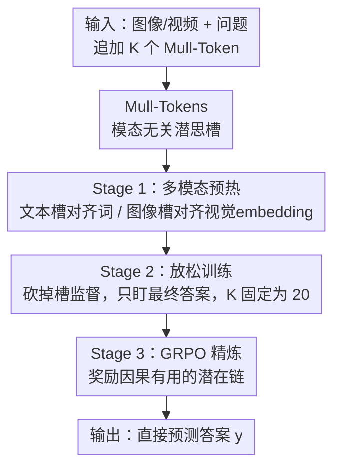

# Mull-Tokens: Modality-Agnostic Latent Thinking

**会议**: CVPR2026  
**arXiv**: [2512.10941](https://arxiv.org/abs/2512.10941)  
**代码**: https://arijitray.com/multimodal_thinking/ (项目主页)  
**领域**: 多模态VLM  
**关键词**: 视觉空间推理, 潜在推理, 模态无关token, 思维链, GRPO

## 一句话总结
本文提出 Mull-Tokens——一组追加在问题后的「模态无关潜在 token」，可同时承载图像或文本中间信息，充当模型内部的多模态草稿纸；通过「多模态预热 → 放松训练 → GRPO 精炼」三阶段训练，仅用 20 个 token 就在四个空间推理 benchmark 上平均比最强 baseline 提升 +3%、在拼图推理硬切片上最高提升 +16%。

## 研究背景与动机
**领域现状**：现实视觉任务（解拼图、IQ 测试、视频空间关系、换视角推理）需要在空间、时间、3D 上做推理，光靠语言说不清。文本思维链（Text CoT）擅长语言逻辑，但在视觉任务上会「漂移」——推着推着脱离了图像证据。

**现有痛点**：为了让模型「带着图像思考」，现有路线各有硬伤：① 工具增强（裁剪工具、专用素描模型）做不了复杂视觉操作且脆弱；② 统一生成模型显式生成中间子目标图像，训练昂贵；③ 最新方法用显式视觉 token 或稠密连续 embedding 当图像思维，但都需要为具体任务量身定制的数据集，没有通用配方。更尴尬的是，作者发现**朴素地交错插入「模态特定」的视觉潜变量有时反而掉点**——在视觉拼图任务上，监督模型交错文本思维和视觉潜变量，性能比纯文本推理还差。

**核心矛盾**：「让模型思考时切换到图像模态」这件事本身很别扭——模型很少主动切到图像思维（强行逼它切反而掉点），而且无论文本还是显式图像 token，都把推理硬绑死在某个模态上，既不灵活又昂贵。

**本文目标**：找到一个简单、便宜、不需要 bespoke 数据、也不需要在模态间显式切换的中间推理表示。

**切入角度**：受 NLP 潜在推理（latent reasoning，如 Coconut、pause token）启发——既然推理可以在连续/离散的潜在槽里隐式进行，那何必规定这个槽是「文本」还是「图像」？

**核心 idea**：引入一组**模态无关**的潜在 token（Mull-Tokens），它既能编码视觉布局也能编码符号映射，由「对最终答案是否有用」来自由决定语义，从而把多模态思考压进一小段统一的内部草稿。

## 方法详解

### 整体框架
模型在 Qwen2.5-VL (7B) 基础上，把 $K$ 个特殊 token $z_{1:K}=(\langle\text{Mull}\rangle_1,\dots,\langle\text{Mull}\rangle_K)$ 追加到「图像 + 问题」之后，让 Transformer 把这些槽当作内部计算空间，推完直接输出答案 $y$，**中间不解码成任何文本或图像**。难点在于：如何让这些初始无意义的潜在槽学会承载「有用的多模态推理信息」，而不是退化成一堆冗余算力。作者用三阶段训练逐步注入再放手：先用图文交错的 CoT 轨迹「预热」槽的语义（Stage 1），再砍掉所有中间监督、只盯最终答案让槽自由优化（Stage 2），最后用 GRPO 强化那些「真正因果导向正确答案」的潜在链（Stage 3）。

### 关键设计

**1. Mull-Tokens：模态无关的内部草稿纸**

针对「文本/图像思维都被硬绑死在某个模态、且需要定制数据」的痛点，作者把中间推理表示设计成一组固定长度的特殊潜在 token $z_{1:K}$，它们既可承载图像条件信息（如拼图当前布局、深度图），也可承载文本条件信息（如符号映射）。关键在于：训练时不再监督「中间应该输出什么文本/图像」，而是监督「用了 $z_{1:K}$ 能否提升 $p_\theta(y\mid x^{\text{img}},x^{\text{txt}})$」，让槽的内部语义自由适配任务。这等价于把 CoT 从「显式 token 序列」变成「功能性约束」——你不用规定它怎么想，只要求它想得对。和给词表加 `<plan>`/`<pause>` 类似，但 Mull-Token 是模态无关的，且数量极少（10–40 个就够），相比文本 CoT 的几百个词 token 或一张图的几百个视觉 token，推理开销大幅下降

**2. Stage 1 多模态预热：把图文语义锚进潜在槽**

如果直接让随机初始化的槽去优化答案（即跳过预热），它很容易退化成「一堆没意义的额外算力」。所以第一阶段用图文交错的 CoT 数据集 $\mathcal{D}_{\text{CoT}}$ 做锚定：构造交错序列 $s=(q_{1:M},z_1,\tilde c_1,\dots,z_T,\tilde c_T,y_{1:L})$，此时 $K$ 等于推理轨迹长度（一个 Mull-Token 对一个 CoT 步）。对第 $t$ 个槽的隐状态 $h_t^{\text{Mull}}$ 施加两类监督：若该步是文本（$c_t\in\mathcal V^{txt}$），过语言模型头做交叉熵 $\mathcal L_t^{text}=-\log p_\theta(c_t\mid s_{<t})$；若该步是子目标图像（$c_t\in\mathcal V^{img}$），用冻结的 Qwen 图像编码器 + 平均池化得到 $v_t=\bar g_\phi(I_t)$，再用余弦相似度对齐 $\mathcal L_t^{img}=1-\cos(h_t^{\text{Mull}},v_t)$。总目标叠加标准答案/问题的自回归损失：

$$\mathcal L_{\text{stage1}}=\sum_{i\in\mathcal I_{AR}}\mathcal L_i^{AR}+\lambda_{text}\sum_{t\in\mathcal T_{text}}\mathcal L_t^{text}+\lambda_{img}\sum_{t\in\mathcal T_{img}}\mathcal L_t^{img}$$

这一步是性能的命门：消融显示只有图文双模态预热（而非纯文本预热、或干脆不预热）才能让槽真正「装得下」多模态推理信息

**3. Stage 2 放松训练：砍掉脚手架，把推理压成紧凑潜在链**

Stage 1 的显式 CoT 可能本身是次优的脚手架，若一直照搬会限制模型。第二阶段把序列简化为 $s'=(q_{1:M},z_{1:K},y_{1:L})$——去掉所有中间步，**丢弃 $z_{1:K}$ 上的全部损失**，只优化答案似然 $\mathcal L_{\text{stage2}}=-\sum_\ell\log p_\theta(y_\ell\mid s'_{<\ell})$。此时把 $K$ 固定成一个小常数（如 20），等于把整条推理轨迹**压缩**进紧凑潜在表示，顺带缓解了冗长文本 CoT 的漂移问题（模型没法在误导性的中间措辞上停留）。一个关键取舍是「递归形式」：连续递归潜变量（$z_{t+1}^{\text{cont}}=f_\theta(z_t^{\text{cont}},x)$）需要逐步串行更新，既破坏 Transformer 并行、又会随链长累积误差；作者改用**离散 token 潜变量**——分配固定 $K$ 个 $\langle\text{Mull}\rangle$，其隐状态 $H^{\text{Mull}}$ 由标准自注意力并行算出、再被答案 token 注意到，既兼容并行又能通过自注意力实现「内部递归」

**4. Stage 3 GRPO 精炼：奖励因果有用的潜在链**

Stage 2 只保证「用了槽能降低答案损失」，但模型可能学到捷径——直接从 $(x^{img},x^{txt})$ 映到 $y$、几乎忽略 $z_{1:K}$。为强制潜在链对答案**因果负责**，第三阶段引入 GRPO：把策略写成 $\pi_\theta(y_{1:L},z_{1:K}\mid x)$，对离散答案给奖励 1、对数值答案给基于归一化误差的分级相似度 $\mathrm{score}$。由于首个答案 token $y_1$ 是从最后一个槽状态 $h_K^{\text{Mull}}$ 采样的，奖励梯度主要经 $h_K^{\text{Mull}}$、再经自注意力回传到整条潜在链 $h_{1:K}^{\text{Mull}}$，从而塑造出「真正导致正确答案」而非「只是与正确答案共现」的潜在轨迹。实验显示这一步在 BLINK、VSI 的推理硬切片上能进一步加分

## 实验关键数据

### 主实验
基座 Qwen2.5-VL (7B)，8×H100 训练；评测 BLINK、SAT-Real、VSI-Bench、ERQA 四个空间推理 benchmark（Avg(All) 为综合平均）。

| 配置 | BLINK Jig | BLINK Reas | VSI Reas | SAT-R Avg | Avg(All) | vs DirAns |
|------|-----------|------------|----------|-----------|----------|-----------|
| a. Qwen2.5-VL (7B) 基座 | 58.66 | 41.00 | 22.96 | 59.00 | 44.30 | — |
| b. + DirAns FT（直接答案微调） | 58.66 | 48.60 | 30.65 | 71.66 | 50.87 | 基准 |
| c. + TextCoT FT | 69.30 | 49.34 | 31.04 | 68.33 | 48.90 | −1.97 |
| d. + GRPO（文本链） | 72.00 | 50.74 | 30.15 | 69.00 | 48.50 | −2.37 |
| e. + Interleave Im-Txt（图文交错潜变量[67]） | 68.67 | 50.38 | 32.96 | 74.00 | 50.49 | −0.38 |
| **f. + Mull-Tokens（Stage 2）** | **74.00** | **56.38** | 32.85 | 77.66 | **53.92** | **+3.05** |
| **g. + GRPO（Stage 3）** | **74.67** | **56.66** | 33.49 | 77.00 | **54.04** | **+3.17** |

关键对比：直接答案微调（b）本身是个**意外强的 baseline**，把文本 CoT（c、d）和图文交错（e）全比下去；只有 Mull-Tokens（f、g）真正反超它。BLINK 拼图切片在 Stage 3 上相对 DirAns 提升 **+16.01%**（74.67 vs 58.66），是「推理密集」场景收益最大的证据。

### 消融实验

预热方式消融（Table 2，含「是否预热 / 预热是否需要图像」）：

| 配置 | BLINK Avg | BLINK Reas | SAT-R | 结论 |
|------|-----------|------------|-------|------|
| b. DirAns FT | 61.4 | 48.6 | 71.7 | 强基准 |
| c. 不预热（仅 Stage 2） | 59.2 | 45.2 | 67.3 | 比基座好 +4.2%，但**输给 DirAns** |
| d. 纯文本预热 | 65.9 | 52.9 | 71.3 | 仅比 DirAns +1.07% |
| e. **图文双模态预热（本文）** | **66.8** | **56.4** | **77.7** | 比 DirAns **+3.05%** |

其它分析：
- **离散 vs 连续潜变量**（Fig 5a）：在各 $k$ 值下离散都优于连续；连续 embedding 随数量增多反而退化（误差沿长链累积），且离散能用 token 并行，训练/推理显著更快。
- **潜在 token 数 $K$**（Fig 5b/c）：推理切片随 $K$ 增多变好，但**太多反而掉点**；GRPO 之后性能随 $K$ 的 scaling 更明显（因 GRPO 因果奖励了潜在链）。
- **泛化**（Table 3）：MMSI-Bench 多步推理 +1.2%、不同视角属性判断 +8.0%、SiteBench 通用空间 +2.1%。
- **可与文本理由共存**（Table 4）：Mull-Tokens + 文本理由综合 51.1，高于纯文本 48.9 与图文交错 50.5；模型会自行决定哪些任务需要文本理由、哪些只用潜在 token 直答。

### 关键发现
- 贡献最大的是「图文双模态预热」：去掉预热（c）直接跌破 DirAns baseline，说明 Mull-Tokens 的收益**不是**靠「更宽的算力通路」，而是真的装进了多模态推理信息。
- 强 baseline 的反直觉现象：文本 CoT 和图文交错潜变量都打不过「直接拿答案微调」，这正是论文要解决的核心矛盾。
- ERQA 上所有微调变体都贴近基座，作者归因于该 benchmark 偏感知（问直接可见的物体状态），推理改进空间小。

## 亮点与洞察
- **「模态无关」是关键解法**：不强迫模型在文本/图像间显式切换（它本来就不爱切、强切还掉点），而是给一个统一潜在槽让它自己决定装什么——这个去约束化的设计直接绕开了「交错图文思维失败」的根因。
- **极低 token 开销的 Pareto 优势**：仅 20 个潜在 token 对比文本 CoT 的 200–500 个词 token，既省推理又涨点，呼应了「更短的推理轨迹同样有效」的近期发现。
- **三阶段「注入语义 → 放手优化 → 因果强化」的训练范式可迁移**：Stage 1 用现成多模态 CoT 数据锚定 + Stage 2 砍监督让其自由 + Stage 3 用 GRPO 防捷径，这套配方对任何「想训练潜在推理 token」的场景都通用（作者也指出换掉 $\bar g_\phi$ 和相似度损失即可扩展到 3D/轨迹模态）。
- **GRPO 用来防「绕过潜在链的捷径」**：把强化学习目标对准「潜在链是否因果有用」而非只对答案，是个值得借鉴的角度。

## 局限与展望
- **依赖现成多模态 CoT 数据做预热**：Stage 1 需要图文交错 CoT 轨迹（Zebra-CoT 等），扩展到 3D/轨迹等模态时因缺这类数据被作者明确留作 future work。
- **潜在 token 不可读**：Mull-Tokens 本身不能解码成人类可读输出，可解释性靠搭配显式文本理由（Table 4）间接补偿。
- **$K$ 需要按任务调**：太多潜在 token 会掉点，最优 $K$ 与 GRPO 是否使用相关，缺乏自适应选 $K$ 的机制。
- **绝对数值口径敏感**：作者自述 VSI-Bench 的绝对分会因帧数、答案匹配逻辑、system prompt 不同而和并行工作不可直接比——横向比大小需谨慎。
- **gain 集中在推理密集切片**：在感知重的 benchmark（ERQA）上几乎无提升，方法收益面有边界。

## 相关工作与启发
- **vs MIRAGE / Interleave Im-Txt [67]**：他们用图像潜变量 + 显式文本理由交错推理（模态特定），本文用模态无关潜在槽且不需显式切换模态；实验里本文（f/g）综合 53.9/54.0 反超其 50.5，证明「模态无关」比「视觉受限」更有效。
- **vs 文本 CoT / GRPO（纯文本链）**：纯文本推理在视觉任务上会漂移、且整体跑不过直接答案微调；本文把推理压进少量潜在 token，既抗漂移又省 token。
- **vs 连续递归潜变量（Coconut [23] 类）**：连续递归破坏并行、长链累积误差，本文改用离散 token + 自注意力内部递归，兼顾并行效率与稳定性。
- **vs 显式视觉 token 方法 [4]**：同样靠「学习到的思维 token」涨点，但本文用的 token 更少且模态无关，推理开销（20 vs 几百）大幅下降。

## 评分
- 新颖性: ⭐⭐⭐⭐ 「模态无关潜在推理槽」是对图文交错思维失败的简洁而切中要害的回应，三阶段训练范式有通用性。
- 实验充分度: ⭐⭐⭐⭐ 四主 benchmark + 两泛化集，预热方式 / 离散vs连续 / $K$ / 与文本理由共存等消融较完整，仅缺更多骨干验证。
- 写作质量: ⭐⭐⭐⭐ 动机链（强 baseline 反直觉 → 交错失败 → 模态无关）讲得清楚，公式与图示配套。
- 价值: ⭐⭐⭐⭐ 低 token 开销 + 不需 bespoke 数据 + 可扩展多模态，对多模态推理工程实用性高。

<!-- RELATED:START -->

## 相关论文

- [\[ICML 2026\] ECG-R1: Protocol-Guided and Modality-Agnostic MLLM for Reliable ECG Interpretation](../../ICML2026/multimodal_vlm/ecg-r1_protocol-guided_and_modality-agnostic_mllm_for_reliable_ecg_interpretatio.md)
- [\[ICLR 2026\] Visual Prompt-Agnostic Evolution](../../ICLR2026/multimodal_vlm/visual_prompt-agnostic_evolution.md)
- [\[CVPR 2026\] Thinking Diffusion: Penalize and Guide Visual-Grounded Reasoning in Diffusion Multimodal Language Models](thinking_diffusion_penalize_and_guide_visual-grounded_reasoning_in_diffusion_mul.md)
- [\[CVPR 2026\] MUPO: All Roads Lead to Rome - Incentivizing Divergent Thinking in Vision-Language Models](mupo_all_roads_lead_to_rome_incentivizing_divergent_thinking_in_vlms.md)
- [\[CVPR 2026\] BriMA: Bridged Modality Adaptation for Multi-Modal Continual Action Quality Assessment](brima_bridged_modality_adaptation_for_multi-modal_continual_action_quality_asses.md)

<!-- RELATED:END -->
