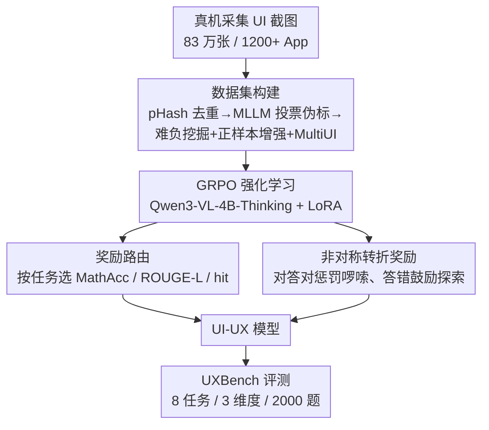

# Reasoning for Mobile User Experience with Multimodal LLMs: Task, Benchmark, and Approach

**会议**: CVPR2026  
**arXiv**: [2606.13192](https://arxiv.org/abs/2606.13192)  
**代码**: 待确认  
**领域**: 多模态VLM  
**关键词**: UX 推理, UI 诊断, 强化学习, 奖励路由, 过度思考抑制

## 一句话总结
这篇论文提出首个面向移动端用户体验（UX）诊断的多模态推理基准 UXBench（2000 题、8 个细粒度任务），并基于 Qwen3-VL-4B-Thinking 用强化学习训练出 UI-UX 模型——靠「奖励路由」统一异构任务的优化目标、靠「非对称转折奖励」压制冗长推理，最终以 4B 参数在 UXBench 上拿到 0.7963 的准确率，超过 Claude-4.5-Sonnet 的 0.6550，且推理延迟很低。

## 研究背景与动机

**领域现状**：MLLM 在 UI 领域已经能做视觉元素 grounding、GUI agent、design-to-code 生成等任务，把基础模型当成解析界面、生成界面的基础设施。

**现有痛点**：现有 UI 基准（Screen2Words、Mobile-bench、VisualWebBench、RICO 等）几乎都停在「感知层」——生成界面描述、检测按钮、解析布局，考的是「认得出界面里有什么」，而不是「这个设计会不会让用户困惑」。真正的 UX 问题往往不是肉眼可见的布局缺陷，而是设计惯例和用户心智模型之间的错位：弹窗遮住了导航栏、角标宣传的内容和落地页不符、服务名和实际功能对不上——界面看上去「正确」，却会引发挫败、信任崩塌和用户流失。

**核心矛盾**：判断这类问题需要的是「体验推理」（experience-based reasoning）而非「事实推理」（fact-based reasoning）——要做反事实推断（这个弹窗会不会让操作不可逆）、语义关联（角标和落地页内容是否一致）、意图建模（用户预期 vs 实际功能）。单纯对齐视觉和文本不足以支撑真正的 UX 理解，现有 MLLM 在复杂案例上经常给出含糊、错误甚至自相矛盾的推理。

**本文目标**：(1) 建一个能定量评估 MLLM「UI→UX 推理」能力的基准；(2) 造一个真正擅长 UX 诊断、又不啰嗦的模型。

**切入角度**：把 UX 诊断从笼统的「好/坏」二分，拆解成立足 HCI 框架的三个维度、8 个细粒度可评测任务，每题强制要求因果推理而非关键词匹配；模型侧则发现「推理模型虽强但容易过度思考超出 token 上限解析失败」，于是把「奖励该任务的正确性」和「惩罚冗余推理步数」一起塞进 RL 奖励里。

**核心 idea**：用 task-adaptive 奖励路由统一不同任务的优化目标 + 用非对称转折奖励在「答对就别废话、答错就多探索」之间做不对称约束，端到端用 GRPO 训练，无需人工偏好标注。

## 方法详解

### 整体框架

论文分成两条主线：**基准侧 UXBench** 和 **模型侧 UI-UX**。

UXBench 是个 VQA 基准：输入是真实移动端 UI 截图，每题是一个二选一或三选一的选择题，要求模型对截图做因果推理、判断是否存在某类 UX 缺陷。它把 UX 问题归到三个维度——**Usability（可用性）/ Efficiency（效率）/ Trustworthiness（可信度）**，每个维度下挂 2-3 个细粒度任务，共 8 个任务（如 BubbleOcclT 文字气泡遮挡正文、PopupStack 多重弹窗叠加、MismatchBadge 角标与落地页不符等），最终经多轮 MLLM 标注 + 四位资深 UX 专家两轮人工验证，平衡采样出 2000 题。

UI-UX 是模型侧贡献：以 Qwen3-VL-4B-Thinking 为底座，先用自动化测试脚本在 8 台真机（Android/HarmonyOS/iOS）上跑 1200+ App 采集 83 万张原始截图，经 pHash 去重 + 两阶段标注 + 难负样本挖掘 + 正样本增强 + MultiUI 正则化，构造 26680 条训练数据；再用 GRPO 做强化学习，奖励由「奖励路由」和「非对称转折奖励」两部分组成。整体数据流如下：

### 关键设计

**1. UXBench：把「好/坏」二分升级为 8 任务的 UX 因果诊断基准**

针对「现有基准只考感知、没有 UX 推理目标」这个痛点，UXBench 把 UX 诊断锚定到 HCI 框架的三个维度并细化为 8 个任务：Usability 对应「Operability」（BubbleOcclT 文字遮挡、BubbleOcclBtn 遮挡可点元素）；Efficiency 对应操作/认知成本（PopupNoClose 弹窗无关闭键、PopupBlockClose 弹窗挡住原生关闭键、PopupStack 多弹窗叠加）；Trustworthiness 对应「Persuasiveness/Security」（MismatchBadge 角标与落地页不符、MismatchContent 服务名与文案不符、MismatchFunc 描述与功能不符）。每题是 2-3 选择题（40% 二选一、60% 三选一），正负样本平衡，覆盖 iOS/Android、明/暗主题、多种屏幕方向。数据流水线是「真实用户反馈采集 → Gemini-2.5-Pro 相关性过滤（再蒸馏到微调 Qwen3-VL-2B 规模化复现）→ Gemini few-shot 分类打维度子任务（歧义样本多轮投票）→ 四位资深研究员两轮交叉验证」，保证标签一致性。它的价值在于：这些题不能靠关键词匹配蒙对，必须做空间分析 + 操作影响的因果推断，才暴露出当前 MLLM 在体验推理上的真实差距。

**2. 奖励路由（Reward Routing）：让异构任务各用各的正确性度量**

UI-UX 的训练数据混了多种任务（UX 诊断选择题、MultiUI 通用理解、视觉 grounding），如果用同一个奖励，优化目标会互相打架。奖励路由按样本的来源和格式动态选择最合适的奖励函数：UX 诊断题是要求精确逻辑推理的选择题，用答案准确率 MathAcc（靠鲁棒的 LaTeX 解析 + 语义等价判断比对最终答案）；MultiUI 通用理解任务要生成自然语言描述，用 ROUGE-L 衡量文本保真度

$$\mathcal{R}_{\text{ROUGE-L}}=\frac{(1+\beta^{2})\cdot P_{\text{LCS}}\cdot R_{\text{LCS}}}{\beta^{2}\cdot P_{\text{LCS}}+R_{\text{LCS}}}$$

其中 $P_{\text{LCS}}$、$R_{\text{LCS}}$ 是基于最长公共子序列的精确率和召回率；grounding 任务则用命中奖励 $\mathcal{R}_{\text{hit}}=\mathbb{I}\!\left((x_{c}^{\text{pred}},y_{c}^{\text{pred}})\in[x_{1}^{\text{gt}},x_{2}^{\text{gt}}]\times[y_{1}^{\text{gt}},y_{2}^{\text{gt}}]\right)$，即预测中心点是否落进 ground-truth 框。这样总奖励 $\mathcal{R}=\mathcal{R}_{\text{routing}}+\mathcal{R}_{\text{transition}}$ 中的路由项能解耦不同任务的优化目标，避免用一把尺子量所有任务。

**3. 非对称转折奖励（Asymmetric Transition Reward）：用转折词数量当「过度思考」的代理信号**

推理模型在 UXBench 上有个突出毛病——过度思考导致生成超出 token 上限、直接解析失败。作者观察到「转折标记」（but、however 这类逻辑转折词）的数量和推理质量强相关：错误样本的平均转折词数（14.38）几乎是正确样本（2.48）的 6 倍。于是设计了一个非对称奖励：给定预测 $p$ 的转折词计数 $T(p)$ 和标签 $y$，

$$R(p,y)=\mathbf{1}_{p=y}\cdot R_{\text{correct}}(T(p))+(1-\mathbf{1}_{p=y})\cdot R_{\text{incorrect}}(T(p))$$

两个分支为 $R_{\text{correct}}(T)=\max(r_{\text{base}}-\alpha T,\,r_{\min})$、$R_{\text{incorrect}}(T)=\min(\alpha T,\,r_{\max})$（论文取 $r_{\text{base}}=1.0,\ \alpha=0.03$，并拟合出 $r_{\min}=0.5,\ r_{\max}=0.4$）。三层含义：(1) **答对惩罚啰嗦**——奖励随转折词线性下降，逼模型答对后别再纠结，但下界 $r_{\min}$ 保证再啰嗦的正确答案也强于错误答案；(2) **答错鼓励探索**——奖励随转折词线性上升，让模型不确定时多探索，但上界 $r_{\max}$ 防止靠堆冗余刷分；(3) **正确性优先**——约束 $r_{\min}>r_{\max}$ 制造一个恒正的奖励间隙 $\mathcal{G}=r_{\min}-r_{\max}>0$，从数学上保证任意正确答案严格优于任意错误答案，从而避免「为了简洁牺牲正确」的退化解。转折词计数还加了位置约束 $T(p)=\sum_{i=2}^{n}\mathbf{1}_{w_i\in\mathcal{V}_t}\cdot\mathbf{1}_{\exists k\in\mathcal{P}:w_{i-1}=k}$，只统计前缀是「\n、–」等显式逻辑断点处的转折词，滤掉句内随意的转折。

**4. 训练数据构造：难负挖掘 + 正样本增强 + MultiUI 正则化三招治类别失衡与遗忘**

真实场景里缺陷 UI（正样本）极度稀少，类别严重失衡会让模型一律预测「负」，并使 GRPO 在「一组样本标签全同」时训练退化。作者先用 pHash 去重（保留汉明距离 $d_H(\mathbf{h}_i,\mathbf{h}_j)=\sum_{k}\mathbb{I}[h_i[k]\neq h_j[k]]\le 5$ 的每组一张），从 83 万张压到 6.8 万张唯一截图；再用 GPT5/Gemini2.5-pro/Claude4.5 多模型投票生成伪标、五位专家人工校正。针对失衡，用**难负挖掘**——每张负样本用 Qwen3-VL-4B-Thinking 在 temperature=1.0 下采样 8 次，只保留预测不一致（≤5/8 票）的「难负样本」，滤掉一眼就对的简单例；再用**正样本增强**（布局变换 + 内容扰动生成多样变体，优于简单重采样）。最后掺 4919 条 MultiUI 样本做正则化，缓解只训 UX 数据导致的灾难性遗忘。最终训练集 26680 条。

### 损失函数 / 训练策略

用 GRPO（on-policy RL，按 token 加权奖励 + 组内归一化稳定更新）训练。底座 Qwen3-VL-4B-Thinking，对所有线性层加 LoRA（rank $r=8$、$\alpha=32$），冻结 ViT 视觉编码器和视觉-语言对齐器以保留预训练表征。DeepSpeed ZeRO-2 省显存，vLLM 张量并行做高吞吐 rollout。最大序列 16K token、completion 上限 8K，每 prompt 采 16 个回复（temperature=1.0、top-k=80），学习率 $2\times10^{-6}$、5% 线性 warmup 后单 epoch 余弦衰减，16-PPU 集群训练约 130 小时。最终奖励按 MathAccuracy 权重 2.0、转折奖励权重 1.0 联合优化，并对前 40% 训练步设保护期（先稳准确率再压啰嗦）。

## 实验关键数据

### 主实验

UXBench 上各模型对比（AVG. 为 8 任务平均准确率，评测时 temperature=0、生成上限 8192 token；`*` 表示因解析失败或推理过长导致的失分）：

| 模型 | 参数量 | AVG. |
|------|--------|------|
| **UI-UX (ours)** | **4B** | **0.7963** |
| Claude-4.5-Sonnet | – | 0.6550 |
| Claude-3.7-Sonnet | – | 0.6488 |
| Claude-4-Sonnet | – | 0.6238 |
| Qwen3-VL-Thinking | 235B | 0.5854 |
| Qwen3-VL (instruct) | 235B | 0.5600 |
| Qwen2.5-VL (instruct) | 72B | 0.5482 |
| MimoVL-0528 | 7B | 0.5438 |
| Qwen3-VL-Thinking (base) | 4B | 0.5254 |
| GLM-4.1-Thinking | 9B | 0.2813 |
| Llava3-Next | 8B | 0.1200 |

UI-UX 仅 4B 参数就拿到 0.7963，比最强推理模型 Claude-4.5-Sonnet（0.6550）高 21.6%，比最强 instruct 模型 Qwen3-VL 235B（0.56）高 42.2%。同时推理模型整体优于 instruct 模型（如 Qwen3-VL-Thinking 235B 0.5854 > 其 instruct 版 0.56），印证 CoT 推理对这类难任务的重要性。

**过度思考问题**：推理模型虽准，但容易超出 8192 token 上限解析失败（标 `*`），且小模型受害更重——GLM-4.1-Thinking(9B) 在 BubbleOccT/MismatchBadge/MismatchContent 多任务上解析失败、均分仅 0.2813；而 235B 级推理模型能避开这类失败，说明控制推理冗长度需要足够的模型规模（或本文这种显式惩罚机制）。

### 消融实验

训练策略消融（全部基于 Qwen3-VL-4B-Thinking）：

| 配置 | ACC | ΔACC |
|------|-----|------|
| Qwen3-VL-4B-Thinking (baseline) | 0.5254 | – |
| + Before Balance | Reward Hacking | – |
| + 难负挖掘 (HNM) | 0.7195 | +0.1941 |
| + HNM + 正样本重采样 | 0.7579 | +0.2325 |
| + HNM + 正样本增强 | 0.7771 | +0.2517 |
| + HNM + 正样本增强 + MultiUI | 0.7963 | +0.2709 |

非对称转折奖励的效果验证（隔离 MultiUI 影响）：

| 模型 | Acc | TR | 平均输出长度(token) |
|------|-----|-----|------|
| Baseline（仅正确性奖励） | 0.7771 | — | 1770 |
| + 非对称转折奖励 | 0.7675 | 0.926 | 334 |

转折标记分布统计（2000 样本）：错误样本平均转折词 14.38、正确样本仅 2.48（约 6 倍差）；$T>3$ 的比例错误样本 31.5%、正确样本 11.7%（2.7 倍），这为把惩罚阈值设在 $T=3$ 提供了依据。

### 关键发现
- **失衡训练会导致 reward hacking**：直接拿未平衡全量数据训练，模型靠预测全负刷到 40% 准确率但「有意义准确率」为 0；难负挖掘一招就 +19.41%，是建立稳健训练基础的关键。
- **正样本增强优于重采样**：增强（+25.17%）比重采样（+23.25%）多 1.92%，因为布局变换/内容扰动带来更大视觉多样性、减少对特定 UI 布局的过拟合。
- **转折词是过度思考的有效代理信号**：非对称转折奖励在准确率几乎不掉（77.71%→76.75%）的前提下把生成长度砍掉 81.1%（1770→334 token），转折奖励 0.926 逼近理想值 1.0；且准确率随转折词数从 61.0% 单调降到 14.8%（4.1 倍），正确样本转折词与奖励强负相关（$r=-0.728$）、错误样本强正相关（$r=+0.774$），印证奖励曲线和理论设计一致。

## 亮点与洞察
- **把「会不会让用户困惑」做成可量化的因果推理任务**：UXBench 最巧的地方是跳出感知层，用 HCI 框架把抽象的「体验风险」拆成 8 个二/三选一、强制因果推断的题目，让 UX 评估第一次有了 benchmark，这个问题定义本身就是核心贡献。
- **用转折词当过度思考的代理信号，极轻量却有效**：不需要训练额外的 reward model，只数 but/however 这类词、再加个位置约束滤噪，就能把推理长度砍掉 80%+，这个 trick 几乎零成本，可直接迁移到任何想压制 reasoning 模型啰嗦的 RL 场景。
- **非对称奖励的「正确性优先间隙」是干净的数学保证**：通过约束 $r_{\min}>r_{\max}$ 制造恒正间隙 $\mathcal{G}$，从理论上堵死「为简洁牺牲正确」的退化解——比单纯加长度惩罚项更可控，这种「先保正确性、再在正确/错误两支里分别做不对称引导」的设计思路值得借鉴。
- **奖励路由让多任务混训不打架**：按样本来源动态切 MathAcc/ROUGE-L/hit 三种度量，配合 MultiUI 正则化防遗忘，是小模型靠数据+RL 而非堆参数追平大模型的关键工程。

## 局限性 / 可改进方向
- **维度仍偏工程化**：作者自承未来要从认知心理学和真实交互日志引入更丰富的维度；当前 8 个任务主要是遮挡/弹窗/内容不符这类结构化缺陷，更微妙的情感/信任动态尚未覆盖。
- **转折词作为推理质量的代理可能不鲁棒**：转折词计数是个启发式信号，对不同语言、不同 prompt 风格（甚至模型故意少用转折词来骗奖励）的稳健性存疑；位置约束依赖「\n、–」等前缀，换 prompt 模板可能失效。
- **基准与训练数据同源**：UXBench 与 UI-UX 训练数据都来自移动 App 截图 + MLLM 投票标注，跨到桌面端/网页端或非 App 场景的泛化仍待验证；伪标质量受 GPT5/Gemini/Claude 这几个标注模型自身能力上限制约。
- **「超过人类专家」的结论需谨慎**：论文称性能超过人类专家，但人类基线如何度量、专家是否在相同 token/时间预算下作答，文中交代有限，⚠️ 以原文为准。

## 相关工作与启发
- **vs Screen2Words / VisualWebBench / RICO**：它们考的是 UI 感知（生成描述、检测元素、解析布局），停在「认得出界面有什么」；本文 UXBench 第一个把目标定在「判断设计会不会让用户困惑」的 UX 因果诊断，从理解界面升级到理解用户。
- **vs OwlEyes / Nighthawk / Metamorphosis / UISGPT**：传统 UX bug 检测多基于预定义问题类型 + 有限/合成数据集，处理不了高层设计异味和跨组件不一致；UISGPT 虽用 LLM 找规范违例但难做复杂上下文推理。本文用真实大规模数据 + MLLM 因果推理来检测并解释复杂设计缺陷。
- **vs GRPO-λ / Step Pruner / CoRE-Eval 等推理效率工作**：这些方法靠剪枝冗余步骤、评估步级重要性来降延迟；本文的非对称转折奖励同样针对推理效率，但把它内化进 RL 奖励、并用「正确性优先间隙」保证不损精度，且首次把这种效率约束嵌进 HCI 的 UX 推理语境。

## 评分
- 新颖性: ⭐⭐⭐⭐⭐ 首个 UX 因果推理基准 + 转折词代理 + 非对称正确性优先奖励，问题定义和方法都有原创性
- 实验充分度: ⭐⭐⭐⭐ 主实验覆盖十余个主流模型、消融逐项拆解，但人类专家基线和跨域泛化交代偏少
- 写作质量: ⭐⭐⭐⭐ 动机清晰、奖励设计的数学推导完整，部分公式符号（如 top-k 重复）有笔误
- 价值: ⭐⭐⭐⭐⭐ 4B 模型超 Claude-4.5 且低延迟，UX 自动评估/设计助手/自动化测试落地价值高

## 评分
- 新颖性: 待评
- 实验充分度: 待评
- 写作质量: 待评
- 价值: 待评

<!-- RELATED:START -->

## 相关论文

- [\[NeurIPS 2025\] To See or To Read: User Behavior Reasoning in Multimodal LLMs](../../NeurIPS2025/multimodal_vlm/to_see_or_to_read_user_behavior_reasoning_in_multimodal_llms.md)
- [\[CVPR 2026\] Demo2Tutorial: From Human Experience to Multimodal Software Tutorials](demo2tutorial_from_human_experience_to_multimodal_software_tutorials.md)
- [\[ACL 2025\] Multimodal Coreference Resolution for Chinese Social Media Dialogues: Dataset and Benchmark Approach](../../ACL2025/multimodal_vlm/multimodal_coreference_resolution_for_chinese_social_media_dialogues_dataset_and.md)
- [\[CVPR 2026\] SALMUBench: A Benchmark for Sensitive Association-Level Multimodal Unlearning](salmubench_a_benchmark_for_sensitive_association-level_multimodal_unlearning.md)
- [\[CVPR 2026\] Interactive Episodic Memory with User Feedback](interactive_episodic_memory_with_user_feedback.md)

<!-- RELATED:END -->
