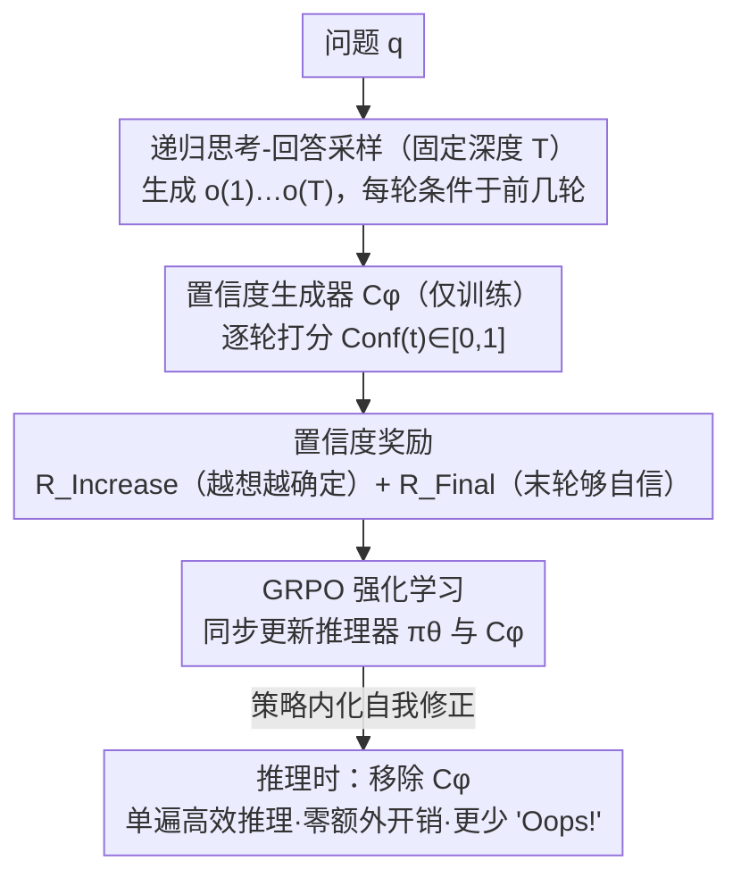

# Recursive Think-Answer Process for LLMs and VLMs

**会议**: CVPR 2026 Findings  
**arXiv**: [2603.02099](https://arxiv.org/abs/2603.02099)  
**代码**: 待确认（论文提到 Project page）  
**领域**: LLM推理 / 多模态VLM  
**关键词**: 递归推理, Think-Answer, confidence generator, reasoning refinement, test-time scaling

## 一句话总结
R-TAP 提出一种递归思考-回答过程，通过置信度生成器评估模型回答确定性并引导迭代推理修正，配合递归置信度增长奖励和最终答案置信度奖励的双重强化信号，在 LLM 和 VLM 上均一致超越单次推理方法，同时显著减少推理中的"Oops!"式自我反思表达。

## 研究背景与动机

**领域现状**：DeepSeek-R1 这类 Think-Answer 推理器靠可解释的内部思维链取得了明显进步，模型在作答前会产生大量中间推理。

**现有痛点**：这些模型在推理途中经常蹦出"Oops!"之类的自我反思，说明它其实意识到了自己出错。但在**单次推理（single-pass inference）**里，这种觉察派不上用场——模型发现错了也没法回滚重写，错误照样留在最终答案里，反思变成了一场"无效的挣扎"。

**核心 idea**：把一次性的思考-回答改成**递归的思考-回答循环**。每轮作答后由一个置信度生成器评估这次回答有多确定；确定性不够就带着上一轮的推理重启一轮，直到置信度过阈值或触顶最大递归次数。这样模型的"觉察到错误"终于能转化为"真正改掉错误"。

## 方法详解

### 整体框架
R-TAP 要解决的是 Think-Answer 推理器"发现自己错了却改不了"的问题：单次推理里模型作完答就停，途中那句"Oops!"的自我察觉只能留在思维链里，没有任何回滚或重写的机会。R-TAP 的关键转变是把"想一次"改成"在训练阶段递归地想多次"——给定问题 $q$，推理器 $\pi_\theta$ 连续生成一串 Think-Answer 响应 $o^{(1)}, o^{(2)}, \dots, o^{(T)}$，每一轮都以前面所有轮为上下文重新作答（式 2）。训练时递归深度 $T$ 固定（便于批量采样），每轮答案由一个**只在训练期使用**的置信度生成器 $C_\phi$ 打一个 $[0,1]$ 的确定性分数 $\mathrm{Conf}^{(t)}$。这些分数被组装成两路置信度奖励，连同常规的正确性/格式奖励一起喂给 GRPO 强化学习，去塑造推理器的策略：让它学会"不确定时多想一轮、足够自信时及时收手"。

关键且容易误读的一点：**置信度生成器与递归采样都是训练期的脚手架，推理时一律移除**。模型把"按需自我修正"这件事内化进了策略本身，因此 R-TAP 相比标准单遍模型**不增加任何推理开销**，反而因为推理更稳、少了大量"Oops!"式反复纠错而更快。换句话说，递归是用来"训"出一个更稳的单遍推理器，而不是在线上反复跑循环。

### 关键设计

**1. 递归思考-回答采样：把"想一次"推广成"带记忆地想多次"**

标准 Think-Answer 作完一轮 $o^{(1)} \sim \pi_\theta(o \mid q)$ 就停。R-TAP 把它推广为递归序列 $o^{(t+1)} \sim \pi_\theta(o \mid q, \{o^{(i)}\}_{i=1}^{t})$（式 2）——第 $t+1$ 轮把前 $t$ 轮的完整推理和答案都拼进上下文，相当于"带着上一稿重写"。训练阶段把深度 $T$ 固定（实现里 $T=4$）以便整批采样；推理阶段则交给模型自己内部判断要不要继续。这里定义**有效递归深度** $M$ 为答案首次正确的轮次（若第一轮就对则 $M=1$），它是后面奖励计算的锚点。这一设计是整个框架的载体：没有递归轨迹，置信度评估和"越想越对"的奖励都无从谈起。

**2. 置信度生成器：给每轮回答一个可校准的确定性分数**

模型自己蹦出的"Oops!"是隐式、离散、不可靠的不确定信号，没法直接拿来当奖励。R-TAP 因此外置一个轻量置信度生成器 $C_\phi$：它复用参考模型 $\pi_{ref}$ 的主干，但把语言头换成一个置信度头并接 sigmoid，对每个 $(q, o^{(t)})$ 输出一个标量 $\mathrm{Conf}^{(t)} = C_\phi(q, o^{(t)}) \in [0,1]$（式 5）。训练前先对它做监督预训练：对每个问题采 $N=128$ 个单轮回答，按答案对错打二元标签，用二分类目标（式 6，正负样本各约一半）让 $C_\phi$ 学会"估计一段推理正确的概率"。这样得到的分数比模型自评连续、可校准，才能当作奖励的可靠依据。⚠️ 注意 $C_\phi$ 仅用于训练、推理时移除，因此不带来任何额外推理开销。

**3. 置信度奖励 + GRPO：让策略学会"越想越确定、自信了就停"**

有了逐轮置信度，R-TAP 用两路互补奖励塑造递归行为。**递归置信度增长奖励**盯过程，统计相邻两轮置信度上升的比例 $R_{Increase} = \frac{1}{M-1}\sum_{t=1}^{M-1}\mathbb{1}[\mathrm{Conf}^{(t+1)} > \mathrm{Conf}^{(t)}]$（式 7），逼模型每多想一轮都比上轮更确定、而不是来回抖动；**最终答案置信度奖励**盯结果，要求末轮置信度过阈 $R_{Final} = \mathbb{1}[\mathrm{Conf}^{(M)} \ge \tau]$（式 8，$\tau=0.55$），鼓励在足够自信处收手。两者与常规奖励直接相加成总奖励 $R = R_{Increase} + R_{Final} + R_{Format} + R_{Answer} + R_{Length}$（式 9），再作为 GRPO 目标（式 3）里递归轨迹的回报 $R_i$ 去优化策略。前者保证"每步都在进步"，后者保证"落点足够稳"，合起来把"按需自我修正"训进模型自身。

### 一个完整示例

> 取论文 Figure 4 的瓢虫选花例子，置信度数值为示意（论文未逐一列出具体分数）。⚠️ 以原文为准。

训练时模型对同一道题递归作答 $T$ 轮。第 1 轮数错叶子、选了花 D（错），$C_\phi$ 给 $\mathrm{Conf}^{(1)}=0.5$；第 2 轮重新检查、改选 E（仍错），$\mathrm{Conf}^{(2)}=0.6$；第 3 轮模型自己冒出"Oops，又数错了"，重新数清花瓣和叶子后选 B（正确），$\mathrm{Conf}^{(3)}=0.7$。答案首次正确在第 3 轮，故有效递归深度 $M=3$。此时增长奖励看前两步的上升比例：$\mathrm{Conf}$ 沿 $0.5\to0.6\to0.7$ 单调爬升、两步都在涨，故 $R_{Increase}=\frac{1}{2}(1+1)=1$；末轮置信度 $0.7\ge\tau=0.55$，故 $R_{Final}=1$。这条"越想越确定、最终落在高置信度正确答案"的轨迹拿到高回报，GRPO 就会强化这种按需修正的行为——而不是奖励盲目固定多推几次。

### 损失函数 / 训练策略
训练分两阶段。**阶段 1（监督预训练置信度生成器）**：对每题采 $N=128$ 个单轮 Think-Answer 样本，按对错打二元标签，用二分类目标（式 6）训练 $C_\phi$，使其能估计一段推理的正确概率。**阶段 2（GRPO 强化微调）**：以 $R = R_{Increase} + R_{Final} + R_{Format} + R_{Answer} + R_{Length}$ 为轨迹回报对推理器做 GRPO 优化；实现里递归深度 $T=4$、每步采 $G=12$ 个轨迹、$\epsilon=0.2$、$\beta=0.04$、$\tau=0.55$，且 $C_\phi$ 在此阶段与推理器**同步在线更新**，以跟上模型分布的变化。训练完成后 $C_\phi$ 被丢弃，推理时只保留学会了自我修正的单遍推理器。

## 实验关键数据

### 主实验：LLM 推理（数学/逻辑推理基准）

| 模型 | 方法 | MATH (%) | GSM8K (%) | ARC (%) | 平均 |
|------|------|----------|-----------|---------|------|
| DeepSeek-R1-7B | Single-pass | 68.2 | 83.5 | 72.1 | 74.6 |
| DeepSeek-R1-7B | Self-Consistency | 70.8 | 85.1 | 73.4 | 76.4 |
| DeepSeek-R1-7B | **R-TAP** | **73.5** | **87.2** | **75.8** | **78.8** |

### VLM 推理任务

| 模型 | 方法 | MathVista (%) | ScienceQA (%) | 平均 |
|------|------|---------------|---------------|------|
| Base VLM | Single-pass | 54.3 | 71.6 | 63.0 |
| Base VLM | **R-TAP** | **58.7** | **74.9** | **66.8** |

### 消融实验

| 配置 | MATH (%) | 说明 |
|------|----------|------|
| Full R-TAP | 73.5 | 完整方法 |
| w/o RCIR | 71.2 | 去掉递归增长奖励 |
| w/o FACR | 72.0 | 去掉最终置信度奖励 |
| w/o Confidence Generator | 69.5 | 改为固定次数递归 |

### 关键发现
- R-TAP 使模型的"Oops!"等自我反思表达显著减少——表明模型不再需要频繁的内部纠错，推理更加稳定
- 递归 2-3 轮即可获得大部分收益，超过 5 轮后收益饱和
- 置信度生成器是核心组件——没有它，固定次数的递归效果显著变差
- R-TAP 带来的推理更加稳定和快速——减少了不必要的内部反思循环

## 亮点与洞察
- **"Oops!"现象的深刻洞察**——首次系统分析 Think-Answer 推理器中自我反思表达的频率与推理质量的关系，发现反思频率低≠推理能力差，而是推理更加稳定的标志
- **递归而非单次**——将 test-time compute 从"更长的单次思考"转变为"多轮迭代改进"，两种范式可以互补
- **置信度驱动的按需递归**——不是盲目多推几次，而是不确定时才递归，效率更高
- **LLM + VLM 通用**——框架不依赖特定模态，适用于纯文本和多模态推理

## 局限与展望
- 代价集中在训练侧：递归采样（深度 $T$）外加置信度生成器的预训练带来不小的训练开销，尽管推理时 $C_\phi$ 被移除、不产生额外推理成本
- 置信度生成器需要额外训练数据和计算，不如 Self-Consistency 的无训练简洁
- 当答案空间开放（如生成式任务）时，置信度的定义和估计变得更困难
- 未探索与 Tree-of-Thought 等结构化推理方法的结合
- 最大递归深度 $K$ 仍是手工设定的超参

## 相关工作与启发
- **vs Self-Consistency**：Self-Consistency 通过多次采样+投票提升一致性，但每次推理独立，不利用上一轮信息。R-TAP 的递归是"有记忆的改进"
- **vs Chain-of-Thought**：CoT 是"更长地想一次"，R-TAP 是"短地想多次并迭代改进"
- **vs Self-Refine**：Self-Refine 让模型自我反馈改进，但缺少外部置信度评估。R-TAP 用专门的 Confidence Generator 做更可靠的判断
- **启发**：递归推理+置信度评估的范式可以推广到代码生成、机器人规划等需要迭代改进的场景

## 评分
- 新颖性: ⭐⭐⭐⭐ 递归推理的思想虽有先例（Self-Refine），但置信度驱动+双奖励设计有新意
- 实验充分度: ⭐⭐⭐⭐ LLM+VLM 双验证，消融实验覆盖各组件，"Oops!"分析有独到视角
- 写作质量: ⭐⭐⭐⭐ 问题动机清晰，"Oops!"现象的引入很生动
- 价值: ⭐⭐⭐⭐ 提供了一种通用的 test-time reasoning 改进框架

<!-- RELATED:START -->

## 相关论文

- [\[ICLR 2026\] Empowering Small VLMs to Think with Dynamic Memorization and Exploration](../../ICLR2026/multimodal_vlm/empowering_small_vlms_to_think_with_dynamic_memorization_and_exploration.md)
- [\[ICLR 2026\] VTool-R1: VLMs Learn to Think with Images via Reinforcement Learning on Multimodal Tool Use](../../ICLR2026/multimodal_vlm/vtool-r1_vlms_learn_to_think_with_images_via_reinforcement_learning_on_multimoda.md)
- [\[CVPR 2026\] Do Vision Language Models Need to Process Image Tokens?](do_vision_language_models_need_to_process_image_tokens.md)
- [\[CVPR 2026\] When to Think and When to Look: Uncertainty-Guided Lookback](when_to_think_and_when_to_look_uncertainty-guided_lookback.md)
- [\[ACL 2025\] Chart-based Reasoning: Transferring Capabilities from LLMs to VLMs](../../ACL2025/multimodal_vlm/chart-based_reasoning_transferring_capabilities_from_llms_to_vlms.md)

<!-- RELATED:END -->
