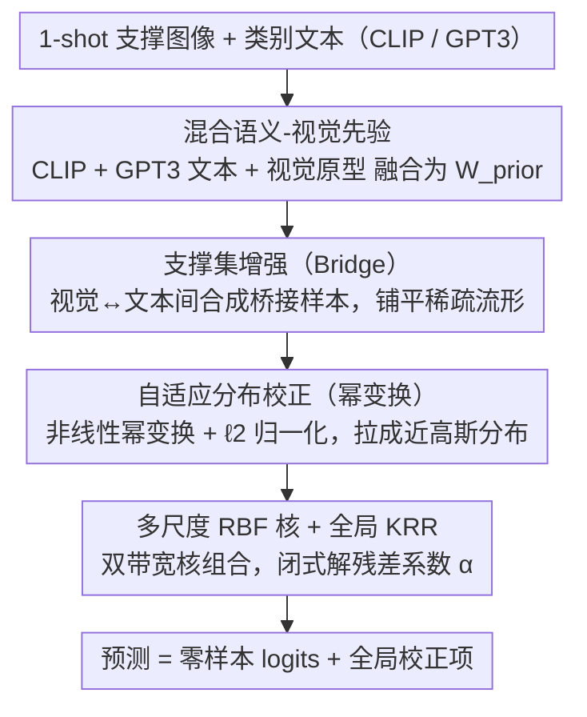

# ReHARK: Refined Hybrid Adaptive RBF Kernels for Robust One-Shot Vision-Language Adaptation

**会议**: CVPR 2026  
**arXiv**: [2603.11542](https://arxiv.org/abs/2603.11542)  
**代码**: [Jahid12012021/ReHARK](https://github.com/Jahid12012021/ReHARK)  
**领域**: 多模态VLM  
**关键词**: Vision-Language模型, One-Shot适应, 核岭回归, CLIP, GPT3语义

## 一句话总结

提出 ReHARK 框架，通过混合语义-视觉先验构建、支撑集增强、自适应分布校正和多尺度 RBF 核集成四阶段精炼管道，在 11 个基准上实现 65.83% 的单样本适应 SOTA 准确率，显著超越 Tip-Adapter 和 ProKeR。

## 研究背景与动机

**领域现状**: CLIP 等视觉-语言模型具有强大的零样本能力，但在具体下游任务上仍需适应。Tip-Adapter 等 training-free 方法使用缓存机制避免微调，但本质是局部 Nadaraya-Watson 估计器。

**现有痛点**: 局部 NW 估计器存在边界偏差，缺乏全局结构正则化。ProKeR 引入 RKHS 全局正则化但在极端数据稀缺的 1-shot 场景下仍受限——单个视觉样本难以捕获领域特有细微差异。

**核心矛盾**: 在仅有 1 个视觉样本的情况下，如何在保留预训练知识（稳定性）和适应新任务（可塑性）之间取得平衡？

**本文目标** (1) 如何构建比纯视觉更鲁棒的初始先验？(2) 如何缓解支撑集和查询集之间的分布偏移？(3) 如何处理不同数据集特征几何结构的差异？

**切入角度**: 1-shot 视觉证据本身不足以进行鲁棒适应，需要引入文本知识（CLIP + GPT3）和视觉原型的协同先验，并通过多尺度核捕获不同尺度的特征几何。

**核心 idea**: 将 CLIP 零样本权重、GPT3 密集语义描述和视觉类原型融合为混合先验，在 RKHS 中通过多尺度 RBF 核集成进行全局核岭回归适应。

## 方法详解

### 整体框架

ReHARK 想解决的是一个很具体的窘境：CLIP 在下游任务上每类只给了 1 张图，这点视觉证据太薄，既有的缓存式适应（Tip-Adapter 那类局部估计器）很容易被这唯一样本带偏。它的破局思路是不把这 1 张图当成全部，而是先用文本和原型把先验"撑厚"，再在一个全局核岭回归（KRR）里求闭式解，整条管道完全不训练。

具体来说，一张待适应的图片会依次经过四步：先融合 CLIP 文本权重、GPT3 语义描述和视觉原型，拼出一个比纯文本更稳的混合先验；接着用这个先验把稀疏的支撑集"补全"，生成一批介于视觉与文本之间的桥接样本；然后对所有特征做一次非线性幂变换，把分布拉到更适合核回归的形状；最后用两个不同带宽的 RBF 核组合算相似度，解一个带正则的线性方程组得到适应系数。最终预测是零样本 logits 加上这个全局校正项，全程没有反向传播。其中前三步是把数据和先验"喂好"，第四步才是真正的回归求解——消融里幂变换贡献最大，恰好说明这条管道的胜负手更多在特征预处理而非核本身。

### 关键设计

**1. 混合语义-视觉先验：用三路互补信息把 1-shot 撑成一个稳的全局锚点**

单张图的类原型噪声很大，纯 CLIP 文本权重又只是手工模板的平均，两者都不足以当全局锚点。ReHARK 的做法是分两层融合：先把 CLIP 文本权重 $\mathbf{W}_{clip}$ 和 GPT3 生成的密集语义权重 $\mathbf{W}_{gpt3}$ 按比例 $\gamma$ 合成文本先验 $\mathbf{W}_{text}$，再把它和视觉类原型 $\mathbf{P}_{vis}$ 按比例 $\omega$ 合成最终先验 $\mathbf{W}_{prior}$。三路信息各补一块短板：GPT3 给出比 CLIP 模板细得多的类别描述（"鸟的喙是尖锐的……"这类判别性细节），CLIP 提供和图像空间对齐好的零样本权重，视觉原型则带来手工文本拿不到的领域特有信息。三者叠起来，先验对单样本噪声的容忍度明显高于任一单独来源。

**2. 支撑集增强（Bridge）：在视觉和文本之间造中间样本，把稀疏流形填平**

1-shot 的支撑集只有一个点，KRR 在这么稀疏的支撑上很难拟合出平滑的决策面。Bridge 的思路是直接合成中间样本来填空——对每个视觉样本，把它和对应类别的先验加权混合再归一化：

$$\mathbf{x}_{bridge} = \text{norm}(\mathbf{x}_{vis} + \eta\,\mathbf{w}_{label})$$

这些桥接样本落在视觉模态和文本模态之间的"间隙"里，等于在适应流形上额外铺了一排锚点，让核回归在模态过渡区也有支撑。机制极简（一次特征加权），却不依赖任何生成模型或数据增强，正是 training-free 设定下能用的少数手段之一。

**3. 自适应分布校正（幂变换）：一次幂变换把特征分布拉成核回归更好啃的形状**

CLIP 的高维特征分布往往偏斜，加上支撑集（1-shot 训练样本）与查询集（测试样本）之间存在域偏移，直接丢进 RBF 核回归会让相似度估计失真。ReHARK 在进入核回归前，对所有视觉和文本特征先做一次符号保留的非线性幂变换：

$$f(\mathbf{x}, p) = \text{sign}(\mathbf{x}) \cdot |\mathbf{x}|^{p}, \quad p \in [0.5, 1.0]$$

再接 $\ell_2$ 归一化投回单位超球面。指数 $p<1$ 会压缩大幅值、抬升小幅值，把长尾分布拉得更接近高斯——这正是核方法假设下最友好的形状，同时让测试统计量与增强支撑集对齐，缓解域偏移。这一步看着不起眼，却是消融里贡献最大的单项（去掉幂变换平均掉 0.51%、去掉整个分布校正掉 0.40%），印证了本文一个略反直觉的结论：在 training-free 适应里，喂给核回归的特征"长什么样"，比核本身设计得多花哨更要紧。

**4. 多尺度 RBF 核集成：用两个带宽同时抓局部和全局相似性，闭式解一次出结果**

1-shot 学习方差天然很高，而单一带宽的高斯核在不同数据集上几乎不可能都最优——窄带宽对局部细节敏感，宽带宽看全局结构，固定一个就会在另一类数据集上吃亏。ReHARK 干脆把两个带宽的核线性组合起来：

$$\mathbf{K}(\mathbf{x}, \mathbf{x}') = \pi\, e^{-\beta_1\|\mathbf{x}-\mathbf{x}'\|^2} + (1-\pi)\, e^{-\beta_2\|\mathbf{x}-\mathbf{x}'\|^2}$$

$\beta_1, \beta_2$ 分管局部和全局尺度，$\pi$ 控制两者权重，都交给超参搜索去适配每个数据集的特征几何。有了核矩阵，适应系数就是一个带岭正则的闭式解：

$$\boldsymbol{\alpha} = (\mathbf{K} + \lambda\mathbf{I})^{-1}(\mathbf{Y} - \hat{\mathbf{Y}}_{zs})$$

注意回归目标是真值标签减去零样本预测 $\hat{\mathbf{Y}}_{zs}$，也就是只学零样本"差到哪去"的残差，从而把预训练知识当基线保留下来、只在其上做全局校正——这正是它相对 Tip-Adapter 局部估计器的关键区别。

### 损失函数 / 训练策略

ReHARK 完全 training-free，没有可学习参数，推理时直接套闭式解、无需反向传播。代价转移到了超参数上：$\gamma, \omega, \eta, \beta_1, \beta_2, \pi, p, \lambda$ 这一组（$p$ 为幂变换指数）全部用 Optuna 在验证集上自动搜索，主实验跑 1000 次试验、消融跑 500 次。这是一次性的离线成本，搜完即固定。

## 实验关键数据

### 主实验（1-shot 分类准确率 %，ViT-B/16）

| 方法 | ImageNet | Caltech101 | EuroSAT | Food101 | OxfordFlowers | 平均 |
|------|----------|------------|---------|---------|-------------|------|
| Zero-Shot CLIP | 60.35 | 85.68 | 36.27 | 77.37 | 66.02 | 58.88 |
| Tip-Adapter | 60.58 | 88.09 | 56.76 | 77.54 | 75.06 | 62.85 |
| ProKeR | 60.60 | 88.17 | 59.75 | 77.40 | 78.85 | 63.77 |
| **ReHARK** | **61.88** | **90.13** | **69.19** | **77.55** | **80.82** | **65.83** |

### 消融实验（1-shot，500 trials）

| 配置 | 平均准确率 | 说明 |
|------|----------|------|
| Full ReHARK | 65.83 | 完整模型 |
| NO_POWER | 65.32 | 去幂变换掉 0.51 |
| NO_Refine | 65.49 | 去视觉先验精炼掉 0.34 |
| NO_RECTIFY | 65.43 | 去分布校正掉 0.40 |
| NO_MULTISCALE | 65.72 | 去多尺度核掉 0.11 |

### 关键发现

- 在 EuroSAT 上提升最大（59.75→69.19%，+9.44%），说明混合先验对结构敏感数据集帮助巨大
- 幂变换 ($p$) 贡献最大（-0.51%），分布校正次之（-0.40%）——特征空间的预处理比核设计更关键
- 所有计算在单卡 P100 上完成，推理效率极高（training-free + 闭式解）

## 亮点与洞察

- **多模态先验融合**：CLIP 文本 + GPT3 描述 + 视觉原型三路融合构建先验，比任何单一来源都更稳定——GPT3 提供丰富语义，CLIP 提供零样本对齐，视觉原型提供领域适应
- **Bridge 机制简单有效**：仅用特征加权混合就能扩充支撑集，无需复杂的数据增强或生成模型
- **全局 vs 局部的理论视角**：从 NW 估计器的局部性出发引出全局 KRR 的必要性，理论动机清晰

## 局限与展望

- 超参数搜索需 1000 次试验（per dataset），虽然是一次性成本但不够优雅
- Bridge 样本是视觉和文本的简单线性混合，更复杂的跨模态生成策略可能更有效
- 仅在分类任务上验证，未扩展到目标检测/分割等下游任务

## 相关工作与启发

- **vs Tip-Adapter**: Tip-Adapter 是局部 NW 估计器，ReHARK 通过全局 KRR + 混合先验将平均准确率从 62.85% 提升到 65.83%
- **vs ProKeR**: ProKeR 同样用全局 KRR 但先验仅用 CLIP 文本权重，ReHARK 通过融入 GPT3 + 视觉原型 + 多尺度核进一步提升 2.06%
- **vs CoOp**: CoOp 需要微调（计算昂贵+易过拟合），ReHARK 完全不训练

## 评分

- 新颖性: ⭐⭐⭐⭐ 混合先验 + 多尺度核的组合虽非革命性但系统性强
- 实验充分度: ⭐⭐⭐⭐⭐ 11 个基准、完整消融、多种 backbone
- 写作质量: ⭐⭐⭐⭐ 数学推导清晰，但组件略多读起来需要整合
- 价值: ⭐⭐⭐⭐ 对 training-free VLM 适应提供了有力的新基线

<!-- RELATED:START -->

## 相关论文

- [\[CVPR 2026\] Dynamic Token Reweighting for Robust Vision-Language Models](dynamic_token_reweighting_for_robust_vision-language_models.md)
- [\[CVPR 2025\] Rethinking Few-Shot Adaptation of Vision-Language Models in Two Stages](../../CVPR2025/multimodal_vlm/rethinking_few-shot_adaptation_of_vision-language_models_in_two_stages.md)
- [\[CVPR 2026\] EvoPrompt: Evolving Prompt Adaptation for Vision-Language Models](evolving_prompt_adaptation_for_vision-language_models.md)
- [\[CVPR 2026\] ReMoRa: Multimodal Large Language Model based on Refined Motion Representation for Long-Video Understanding](remora_multimodal_large_language_model_based_on_refined_motion_representation_fo.md)
- [\[CVPR 2026\] DeAR: Fine-Grained VLM Adaptation by Decomposing Attention Head Roles](dear_fine-grained_vlm_adaptation_by_decomposing_attention_head_roles.md)

<!-- RELATED:END -->
