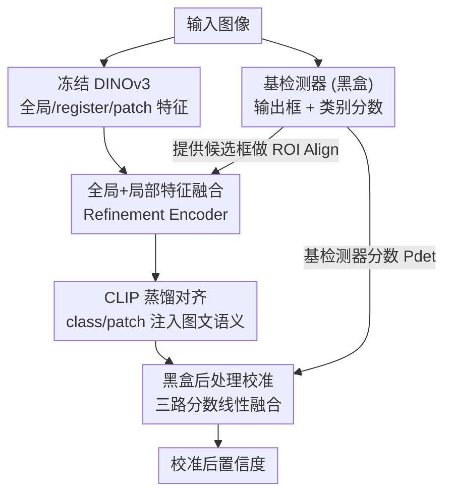

# DetRefiner: Model-Agnostic Detection Refinement with Feature Fusion Transformer

**会议**: CVPR 2026  
**arXiv**: [2605.10190](https://arxiv.org/abs/2605.10190)  
**代码**: https://github.com/hitachi-rd-cv/detrefiner (有)  
**领域**: 目标检测 / 开放词汇检测  
**关键词**: 开放词汇检测, 置信度校准, 特征融合, CLIP 蒸馏, 即插即用

## 一句话总结
DetRefiner 是一个不碰基检测器、不需重训的轻量后处理模块：用一个 7.5M 参数的 Transformer 把 DINOv3 的全局与局部特征融成 class/patch 向量，再借 CLIP 蒸馏对齐文本语义，推理时只对每个 (框, 类别) 重新校准置信度，给多个开放词汇检测器在 LVIS 稀有类上带来最高 +10.1 AP 的提升。

## 研究背景与动机
**领域现状**：开放词汇目标检测（OVOD）把区域定位和文本分类耦合起来，借助 GLIP、Grounding DINO 这类视觉-语言预训练模型，能在推理时用自然语言 prompt 指定任意类别，从而识别训练标签集之外的新概念。

**现有痛点**：这些模型虽然灵活，却在**语义对齐**和**置信度校准**上长期不稳。预训练学到的图文表征常和检测器的区域 embedding 错位，导致视觉特征匹配不上文本描述；面对细粒度、语义重叠的类别时，分数尤其不可靠——错误检测可能拿到高分，而正确的稀有/未见类却被压到很低的置信度而被阈值滤掉。

**核心矛盾**：根因在于现有检测器**只用自己单一来源的区域特征**做分类打分，缺乏全局场景语义和局部细粒度证据的互补整合；同时大多数互补方法（如 DVDet、CODet）要么需要联合训练、要么需要访问检测器内部特征，无法真正解耦。

**本文目标**：在不修改、不重训、不访问内部特征的前提下，给任意 OVOD 检测器的预测做一次 post-hoc 校准，把被错杀的正确框救回来、把过自信的假阳性压下去。

**切入角度**：作者观察到基础模型彼此互补——DINO 擅长丰富的全局+局部视觉特征，CLIP 擅长强图文对齐。把二者结合成一个独立学习的小模块去重估分数，既轻量又通用。

**核心 idea**：用一个独立训练的 Transformer 融合 DINOv3 的全局与局部特征，得到 class 向量（图级语义）和 patch 向量（区域证据），再用 CLIP 蒸馏注入图文对齐，推理时把这两路语义分数线性融进基检测器的分数里完成校准。

## 方法详解

### 整体框架
DetRefiner 把基检测器当**黑盒**：基检测器照常输出一组框和类别分数；与此并行，冻结的 DINOv3 抽出全局/register/patch 三级特征，喂进一个轻量 Refinement Encoder，产出图级 class 向量和区域级 patch 向量。这两个向量在训练时通过分类损失和 CLIP 蒸馏损失学会"语义对齐 + 校准"，推理时分别和文本 embedding 算相似度得到两路概率，再和基检测器分数线性加权，得到最终校准后的置信度。整个过程**不改框坐标、不改类别归属**，只重估分数。

### 关键设计

**1. 全局+局部特征融合的 Refinement Encoder：单一来源特征不够，就把三级视觉证据并到一个序列里联合推理**

针对"检测器只靠单一区域特征打分、缺全局上下文"这个痛点，DetRefiner 从冻结的 DINOv3 取三类 token：全局 token $\mathbf{g}$、4 个 register token $\{\mathbf{r}_i\}$、196 个 patch token $\{\mathbf{p}_j\}$，分别用线性层 $W_g, W_r, W_p$ 投到统一维度 $d$，前面再拼一个可学习的 class token $\mathbf{c}'$。为区分异构 token，给每类 token 加可学习的 segment embedding；patch token 还按 MAE 风格加固定 2D sin-cos 位置编码。完整序列 $T=[\mathbf{c}'';\mathbf{g}'';\mathbf{r}_1'',\dots;\mathbf{p}_1'',\dots,\mathbf{p}_{196}'']$ 过一个仅 7.5M 参数的轻量 Transformer，class token 的输出即图级 **class 向量** $\mathbf{v}_{cls}$，patch 输出即 **patch 向量** $\{\mathbf{v}_{patch,j}\}$。对每个框再用 ROI Align 在 patch 向量上池化得 **ROI 向量** $\mathbf{v}_{roi}$。这样设计的关键在于：ROI 池化能抑制背景、聚焦框内细粒度外观，而全局特征补上场景级先验——因为局部线索单独看常常视觉/语义都模糊，全局与局部互补才稳

**2. CLIP 蒸馏对齐：DINO 的视觉特征虽丰富却没图文对齐能力，用 CLIP 当老师把语义结构蒸进来**

DINOv3 特征强在视觉表征，但缺乏开放词汇所依赖的图文对齐，尤其对稀有/未见类的校准不利。作者引入 MobileCLIP 作教师，对 class 向量和 patch 向量同时施加**余弦相似度蒸馏**。class 向量与 CLIP 图像特征 $\mathbf{m}_{img}$ 对齐的全局蒸馏损失为 $\mathcal{L}_{ckd}=1-\frac{\mathbf{v}_{cls}^\top \mathbf{m}_{img}}{\|\mathbf{v}_{cls}\|_2\|\mathbf{m}_{img}\|_2}$；patch 向量先平均池化 $\bar{\mathbf{v}}_{patch}=\frac{1}{196}\sum_j \mathbf{v}_{patch,j}$ 再对齐，得局部蒸馏 $\mathcal{L}_{pkd}$。同时用 BCE 形式的分类损失监督：把归一化的 $\hat{\mathbf{v}}_{cls}, \hat{\mathbf{v}}_{roi}$ 与文本 embedding 的余弦相似度乘温度 $s_{cls}=1/\tau$ 得 logits，分别算图级损失 $\mathcal{L}^{cls}_{img}$ 和区域级损失 $\mathcal{L}^{cls}_{roi}$。这套蒸馏让 DetRefiner 继承 CLIP 的强图文对齐，从而显著改善稀有类和未见类的语义对齐与置信度校准——消融显示去掉 $\mathcal{L}_{ckd}$ 时 LVIS 上 APr 从 30.0 掉到 26.9

**3. 黑盒后处理校准：把基检测器当黑盒、零阈值跑一遍，再线性融合三路分数救回被错杀的框**

为了真正解耦、不依赖基模型内部，DetRefiner 推理时只吃基检测器吐出的框和分数。它对每个候选类算两路语义概率 $P_{cls,k}=\sigma(s_{cls}(\hat{\mathbf{v}}_{cls}^\top \hat{\mathbf{t}}_k))$ 和 $P_{roi,k}=\sigma(s_{cls}(\hat{\mathbf{v}}_{roi}^\top \hat{\mathbf{t}}_k))$，最终置信度按 $P_{final}=w_d P_{det}+w_c P_{cls}+w_p P_{roi}$ 线性融合（默认 $w_d{=}0.8, w_c{=}w_p{=}0.1$）。一个关键工程做法是：把基检测器以**零检测阈值**跑，一次前向就把所有候选框（包括低分但可能正确的）都送进来校准，从而把大量被原阈值错杀的正确框救回，同时保持推理开销适中。未见类只靠推理时的文本 embedding 定义，因此天然支持 zero-shot 识别

### 损失函数 / 训练策略
总目标为 $\mathcal{L}=\mathcal{L}^{cls}_{img}+\mathcal{L}^{cls}_{roi}+\lambda_1\mathcal{L}_{ckd}+\lambda_2\mathcal{L}_{pkd}$，前两项是图级/区域级 BCE 分类损失，后两项是 class/patch 的 CLIP 余弦蒸馏。训练时框和类别标签来自数据集标注，监督**只施加在 seen 类别集** $C_{seen}$ 上、忽略 unseen 标签；LVIS 上还只把 `neg_category_ids` 当有效负样本、其余负样本一律忽略。默认配置为 Transformer 2 层、$\tau{=}0.03$、DINOv3 + MobileCLIP + ROI Align。

## 实验关键数据

### 主实验
DetRefiner 作为即插即用模块挂在 GLIP、Grounding DINO、MM-Grounding DINO、LLMDet 等多个检测器上，在 OV-LVIS、OV-COCO、ODinW13、Pascal VOC 上一致涨点，稀有类提升尤其明显（AP 为 AP@[0.5:0.95]）。

| 基检测器 (OV-LVIS) | APr | APc | APf | APall |
|--------|------|------|------|------|
| Grounding DINO (Tiny) | 19.9 | 22.6 | 33.1 | 27.4 |
| +DetRefiner | **30.0 (+10.1)** | 31.6 (+9.0) | 37.1 (+4.0) | 34.1 (+6.7) |
| LLMDet (Large) | 43.9 | 43.6 | 55.4 | 49.3 |
| +DetRefiner | **50.1 (+6.2)** | 49.3 (+5.7) | 57.1 (+1.7) | 53.2 (+3.9) |
| MM-Grounding DINO (Base) | 35.4 | 37.8 | 48.5 | 42.8 |
| +DetRefiner | 41.6 (+6.2) | 43.0 (+5.2) | 50.4 (+1.9) | 46.4 (+3.6) |

可见提升集中在稀有类 APr（最高 +10.1）和中频类 APc，频繁类 APf 涨幅小——和"校准主要救回被错杀的稀有/未见类"的设计意图吻合。OV-COCO 上 APnovel 提升较温和（+0.1～+0.7），但 APbase/APall 稳定上涨。跨数据集泛化（DetRefiner 在 OV-LVIS 训练，直接迁到 ODinW13/Pascal VOC）也都正向：如 GLIP-T 在 Pascal VOC 上 56.6 → 59.2 (+2.6)。

### 消融实验
基于 Grounding DINO (Tiny)，OV-LVIS / OV-COCO 上的组件消融（APr / APnovel）：

| 配置 | APr (LVIS) | APall (LVIS) | APnovel (COCO) | 说明 |
|------|---------|---------|---------|------|
| Full (Refine+$\mathcal{L}_{ckd}$+$\mathcal{L}_{pkd}$) | 30.0 | 34.1 | 58.1 | 完整模型 |
| w/o $\mathcal{L}_{ckd}$ | 26.9 | 33.1 | 57.7 | 去全局蒸馏，APr 掉 3.1 |
| w/o $\mathcal{L}_{pkd}$ | 29.1 | 34.1 | 58.1 | 去局部蒸馏，APr 掉 0.9 |
| CLIP-V (直接喂 CLIP 视觉特征) | 26.4 | 33.6 | 56.8 | 用 CLIP 替 DINO 融合，APr 掉 3.6 |

### 关键发现
- **全局蒸馏 $\mathcal{L}_{ckd}$ 贡献最大**：去掉后 LVIS APr 从 30.0 掉到 26.9，说明 CLIP 图级语义注入是稀有类校准的主力；局部蒸馏贡献较小但仍正向。
- **Transformer 不是越深越好**：层数 1/2/3/6/12 对应 APr 29.1/30.0/28.5/25.5/20.2——2 层最优，深到 12 层在 LVIS 上反而崩到 27.9 APall，作者据此选了极轻的 2 层 7.5M 模型。
- **温度 $\tau$ 与编码器选择敏感**：$\tau{=}0.03$ 最佳；用 DINOv3 明显优于 CLIP/LongCLIP 作视觉编码器（APr 30.0 vs 26.4/27.1），印证"DINO 抽特征 + CLIP 做对齐"的分工。
- **集成权重需偏重基检测器**：$w_d{=}0.8$ 时整体最稳；$w_d$ 过高（0.9）会让语义校准失效（APr 跌到 24.7），过低（0.5）虽 APc 升但 APf 和 COCO 掉。

## 亮点与洞察
- **真正的黑盒解耦**：相比 DVDet/CODet 需联合训练或访问检测器内部，DetRefiner 只吃基检测器的输出框和分数、独立训练，泛化到任意 OVOD 检测器，工程落地成本极低。
- **"零阈值跑一遍 + 后校准"救回低分框**：这个看似简单的推理技巧是涨点关键——它把传统阈值会丢掉的正确稀有类框留下来交给语义模块重估，开销只增加一次轻量前向。
- **基础模型互补的具象化**：把 DINO 的视觉表征能力和 CLIP 的图文对齐能力拆成"抽特征 vs 当老师"两个角色，消融数据直接证明二者不可互换——这个分工思路可迁移到其他需要语义校准的开放词汇任务（如分割、检索）。
- **极致轻量**：7.5M 参数、2 层 Transformer 就能给 50M+ 的大检测器稳定加几个点，性价比突出。

## 局限与展望
- **依赖基检测器召回出框**：DetRefiner 不改框坐标也不新增框，若正确目标在基检测器里**完全没被框出来**（即使零阈值），它也无力回天，只能重估已有候选。
- **只在 seen 类上监督**：未见类完全靠 CLIP 文本 embedding 做 zero-shot，校准质量上限受 MobileCLIP 对齐能力约束；细粒度未见类仍可能对不齐。
- **额外推理开销**：虽称"moderate"，但零阈值会带来远多于常规的候选框，加上一次 DINOv3 前向，实时场景下的延迟代价值得进一步量化（原文未给吞吐数据，⚠️ 以原文为准）。
- **超参敏感**：集成权重 $(w_d,w_c,w_p)$ 和温度 $\tau$ 都较敏感，跨数据集是否需要重调权重，论文未充分讨论。

## 相关工作与启发
- **vs SIC-CADS**：SIC-CADS 也做图级置信度校准但**不动框级分数**；DetRefiner 同时校准图级和框级（class + ROI 两路），覆盖更全。
- **vs DVDet / CODet**：二者要么需 LLM 辅助联合训练、要么需访问检测器内部架构，且多在较早的 OVOD baseline 上评测；DetRefiner 把基模型当黑盒，且挂在 Grounding DINO、LLMDet 等近期强检测器上验证实用性。
- **vs BRAVE / AM-RADIO**：这些工作把多个冻结视觉编码器融成统一表征或蒸成通才模型；DetRefiner 采用相近的"基础模型互补"哲学，但落点是 OVOD 的 post-hoc 分数校准，而非训练通用 backbone。

## 评分
- 新颖性: ⭐⭐⭐⭐ 黑盒解耦 + DINO/CLIP 分工 + 零阈值救框的组合很实用，但单个组件多为已有技术拼装
- 实验充分度: ⭐⭐⭐⭐⭐ 4 检测器族 × 4 benchmark 一致涨点，组件/深度/温度/编码器/ROI/权重消融齐全
- 写作质量: ⭐⭐⭐⭐ 方法清晰、公式完整，部分推理开销数据缺失
- 价值: ⭐⭐⭐⭐⭐ 即插即用、零重训给任意 OVOD 检测器稳定加点，落地价值高

<!-- RELATED:START -->

## 相关论文

- [\[CVPR 2026\] Foundation Model Priors Enhance Object Focus in Feature Space for Source-Free Object Detection](foundation_model_priors_enhance_object_focus_in_feature_space_for_source-free_ob.md)
- [\[CVPR 2026\] MRD: Multi-resolution Retrieval-Detection Fusion for High-Resolution Image Understanding](mrd_multi-resolution_retrieval-detection_fusion_for_high-resolution_image_unders.md)
- [\[CVPR 2026\] Small Target Detection Based on Mask-Enhanced Attention Fusion of Visible and Infrared Remote Sensing Images](small_target_detection_based_on_mask-enhanced_attention_fusion_of_visible_and_in.md)
- [\[CVPR 2026\] VisualAD: Language-Free Zero-Shot Anomaly Detection via Vision Transformer](visualad_language-free_zero-shot_anomaly_detection_via_vision_transformer.md)
- [\[CVPR 2026\] CrossVL: Complexity-Aware Feature Routing and Paired Curriculum for Cross-View Vision-Language Detection](crossvl_complexity-aware_feature_routing_and_paired_curriculum_for_cross-view_vi.md)

<!-- RELATED:END -->
