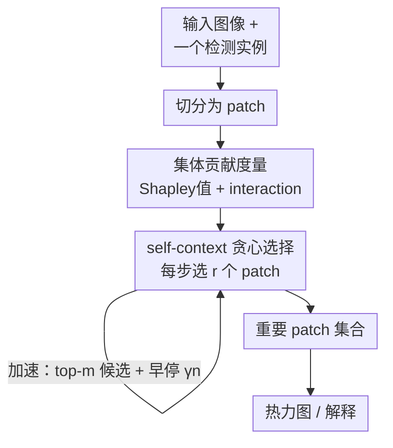

# Explaining Object Detectors via Collective Contribution of Pixels

**会议**: CVPR 2026  
**arXiv**: [2412.00666](https://arxiv.org/abs/2412.00666)  
**代码**: https://github.com/tttt-0814/VX-CODE （有）  
**领域**: 目标检测 / 可解释性  
**关键词**: 检测器可解释性、Shapley值、像素交互、贪心patch选择、忠实度

## 一句话总结
本文提出 VX-CODE，用博弈论中的 Shapley 值（个体贡献）与 interaction（集体贡献）来解释目标检测器，并通过 self-context 变体 + 贪心 patch 选择把指数级计算降到可用，生成同时覆盖"主体特征 + 协同背景线索"的忠实热力图，insertion/deletion AUC 相比 SOTA 最高提升约 19%。

## 研究背景与动机
**领域现状**：目标检测器被广泛用于自动驾驶、医学影像等安全敏感场景，理解"图像里哪些像素影响了检测"对排查偏置、提升鲁棒性很关键。已有解释方法大致分三类：梯度类（ODAM）、CAM 类（SSGrad-CAM++）、扰动类（D-RISE、BSED）。

**现有痛点**：这些方法都只衡量**单个像素的独立贡献**，谁的梯度/激活/边际收益高就高亮谁。但检测器是靠**多个视觉特征协同**来判断的——一个像素单独看不重要、但和别的像素组合起来才决定了框的大小或类别。只看独立贡献，会漏掉这类"次要但关键"的组合线索，或者反过来抓到虚假相关。

**核心矛盾**：检测决策本质是"集体的"，而主流解释指标是"个体的"。论文给的例子很直观：冲浪者检测里现有方法只高亮冲浪板，却忽略了"冲浪板 + 周围海面"这种共同支撑检测的组合；解释偏置模型时，现有方法要么只高亮训练集里植入的方块标记、要么糊满整个框，无法同时点出"物体 + 标记"这两个被模型同时依赖的线索。

**切入角度**：博弈论里恰好有现成工具——Shapley 值衡量单个玩家的平均边际贡献，interaction 衡量两个玩家"合在一起比各自之和多/少多少"。把图像 patch 当玩家、检测得分当收益，就能显式刻画集体贡献。难点在于这两个指标的精确计算随 patch 数指数爆炸（$\mathcal{O}(n\cdot 2^n)$）。

**核心 idea**：用 Shapley 值 + interaction 同时建模个体与集体贡献，再用一个**贪心 patch 插入/删除**策略把它高效嵌进解释流程，并从序贯联盟博弈（$\pi^*$-index）的角度给这个贪心一个理论解释。

## 方法详解

### 整体框架
VX-CODE 解决的是这样一个问题（Problem 1）：给定一张图、一个已检测出的实例 $(L^x, P^x)$，找出大小为 $k$ 的最小 patch 子集 $S_k$，使得**只插入**这些 patch 到空白图就能复现检测（insertion setup，找最小充分信息），或**删除**它们就让检测失败（deletion setup，找最完整必要信息）。衡量"复现程度"的奖励函数同时考虑定位和分类：

$$f(\mathcal{D}(x_S);(L^x,P^x))=\max_{(L,P)\in\mathcal{D}(x_S)}\mathrm{IoU}(L^x,L)\cdot\frac{P^x\cdot P}{\|P^x\|\|P\|}$$

其中 $\mathrm{IoU}$ 项管框对齐、余弦项管类别一致。整个流程是：输入图切成 patch → 每一步用"博弈论度量"给候选 patch 组合打分 → 贪心选出本步 $r$ 个最有价值的 patch → 累积成重要 patch 集合 → 渲染成热力图。关键在于每步的打分不只看单 patch，而是通过 self-context 值自然地把 Shapley 值与 interaction 揉进选择里。

### 关键设计

**1. 用 Shapley 值 + interaction 同时刻画个体与集体贡献：让"组合才重要"的线索浮出来**

针对"现有方法只看单像素独立贡献、漏掉组合线索"这个痛点，本文把 patch 当玩家放进联盟博弈。Shapley 值 $\phi(i|N)$ 取玩家 $i$ 加入各种子集时的平均边际收益，刻画个体贡献；interaction $I(i,j|N)=\phi(S_{ij}|N')-\phi(i|N\setminus\{j\})-\phi(j|N\setminus\{i\})$ 把 $i,j$ 视作一个合并玩家，衡量"二者合体的贡献"减去"各自单独贡献"。这个量的符号很有信息：当两个 patch 编码近乎相同的信息（合体不比单个多），interaction 变**负**——正好用来识别**最小、无冗余**的解释 patch 集。反过来，只挑 Shapley 值高的 patch（旧做法）会偏向物体主体，把"单独看贡献小、但与主体协同才生效"的辅助信息（如背景、上下文）漏掉，而这恰恰是解释偏置和失败案例时最关键的线索

**2. self-context 变体 + 贪心 patch 选择：把指数计算压到可跑，且 interaction 自动冒出来**

精确 Shapley/interaction 是 $\mathcal{O}(n\cdot 2^n)$，无法用。本文引入 self-context 值绕过：self-context Shapley 值 $\phi^{sc}(S)=f(S)-f(\emptyset)$ 直接把整个子集 $S$ 当作一个玩家；self-context interaction $I^{sc}(S)=\phi^{sc}(S)-\sum_{S'\in\mathcal{P}^*(S)}\phi^{sc}(S')$（$\mathcal{P}^*(S)$ 是 $S$ 的所有真子集）则是原 interaction 定义的自然推广。贪心策略据此运行：每步 $k$ 从剩余 patch 中选出 $r$ 个的集合 $B_k=\arg\max_{B}\phi^{sc}(\{\mathcal{B}_{k-1}\}\cup B)$，其中 $\mathcal{B}_{k-1}$ 是前面各步累积的 patch（被当作单个玩家）。妙处在于这个目标可被分解为

$$\phi^{sc}(\{\mathcal{B}_{k-1}\}\cup B)=I^{sc}(\{\mathcal{B}_{k-1}\}\cup B)+\sum_{B'\in\mathcal{P}^*(\{\mathcal{B}_{k-1}\}\cup B)}\phi^{sc}(B')$$

也就是说，看似只在选大小为 $r$ 的集合，实际上 interaction 项与各子集 Shapley 项**自动浮现**——贪心在最大化"个体贡献 + 集体交互"之和，从而选出信息量大且不冗余的 patch。这就把"考虑 interaction"从一句口号落到了具体可计算的目标上（$r=1$ 时退化为只看个体贡献）

**3. $\pi^*$-index：用序贯联盟博弈给贪心一个理论解释**

self-context 值是原始指标的"概念类比"，并不满足联盟博弈的全部公理（如 efficiency）。为了给框架一个站得住的理论根，本文提出 $\pi^*$-index：考虑一个**序贯**联盟博弈，玩家按某顺序逐个加入，最优顺序 $\pi^*=\arg\max_{\pi}\sum_{k=1}^n f(\pi(1),\dots,\pi(k))$ 让总奖励最大（即"先招最重要的玩家"），每个玩家的 index $\psi(k|\pi^*)=f(\pi^*(1),\dots,\pi^*(k))-f(\pi^*(1),\dots,\pi^*(k-1))$ 就是它入列时带来的奖励增量。它满足联盟博弈公理，且有个漂亮关系——把 $\psi(k|\pi)$ 在所有排列上平均就还原成 Shapley 值（$\pi^*$ 关注"最好情况"、Shapley 关注"平均情况"）。求精确 $\pi^*$ 是 NP-hard，而前一步的贪心恰好可看作它的贪心近似：$\psi(k|\hat\pi)=\phi^{sc}(\{\mathcal{B}_{k-1}\}\cup B_k)-\phi^{sc}(\mathcal{B}_{k-1})$。虽不保证 $\hat\pi=\pi^*$，但实验表明这个近似已足够强

**4. patch selection + step restriction：把 $r\ge2$ 的组合爆炸再砍一刀**

当 $r\ge2$，每步要枚举 $\binom{|N\setminus\mathcal{B}_{k-1}|}{r}$ 个组合，实时性吃紧。本文加两个轻量模块：**patch selection** 每步只让单 patch 奖励影响排前 $m$ 的候选参与组合（实验取 $m=30$），把组合数从 $\binom{|N|}{r}$ 降到 $\binom{m}{r}$；**step restriction** 在已识别出 $\gamma n$（实验取 $\gamma=0.1$）个 patch 后就停止组合搜索、剩下的退回逐个选（$r=1$），因为最重要的 patch 通常在前几步就被挑出。两者把复杂度从 $\mathcal{O}(n^{r+1}/r)$ 降到 $\mathcal{O}(\frac{\gamma n}{r}m^r+(1-\gamma)n^2)$，生成时间锐减而精度只略降——有趣的是 step restriction 还**提升**了 insertion/deletion 指标，侧面印证"信息量大的 patch 集中在前几步"

### 损失函数 / 训练策略
VX-CODE 是**事后（post-hoc）解释方法**，不训练任何模型、无损失函数。它直接在已训练好的检测器（DETR、Faster R-CNN，ResNet-50 backbone，基于 detectron2）上前向推理，靠局部零掩码（local zero masking）或模糊（blurring）来模拟 patch 缺席。唯一的"超参"是每步选取数 $r\in\{1,2,3\}$、候选数 $m=30$、早停比例 $\gamma=0.1$。

## 实验关键数据

### 主实验
忠实度用 insertion/deletion AUC 衡量：insertion 往空白图逐步加入重要 patch（越早把得分拉高越好，AUC 越高越好），deletion 从原图逐步删除重要 patch（越早把得分压垮越好，AUC 越低越好），overall (OA) = Ins − Del。每个设置在预测类别得分 > 0.7 的 1,000 个实例上平均。

| 数据集 / 检测器 | 方法 | Ins ↑ | Del ↓ | OA ↑ |
|--------|------|------|------|------|
| MS-COCO / DETR | SSGrad-CAM++（次优） | .871 | .114 | .757 |
| MS-COCO / DETR | VX-CODE (r=1) | .904 | **.053** | .851 |
| MS-COCO / DETR | VX-CODE (r=3) | **.909** | .052 | **.857** |
| MS-COCO / Faster R-CNN | SSGrad-CAM++ | .900 | .126 | .774 |
| MS-COCO / Faster R-CNN | VX-CODE (r=3) | **.922** | **.067** | **.855** |
| PASCAL VOC / DETR | SSGrad-CAM++ | .813 | .166 | .647 |
| PASCAL VOC / DETR | VX-CODE (r=3) | **.838** | **.067** | **.771** |
| PASCAL VOC / Faster R-CNN | SSGrad-CAM++ | .890 | .140 | .750 |
| PASCAL VOC / Faster R-CNN | VX-CODE (r=3) | .850 | **.063** | **.787** |

VX-CODE (r=1) 已在几乎所有指标上超过现有方法（唯一例外是 Faster R-CNN / VOC 的 insertion），增大 $r$ 进一步改善，$r=3$ 在所有检测器/数据集上拿到最佳 OA。论文强调 insertion/deletion AUC 最高提升约 **19%**；在 COCO 上，于 10% 面积处 VX-CODE 比次优方法 insertion 高 20%、deletion 低 50%，说明它用**更少像素**就锁定了关键区域。

失败案例上（DETR/COCO，各 200 实例）同样领先：

| 失败类型 | 方法 | Ins ↑ | Del ↓ |
|------|------|------|------|
| 误分类 | SSGrad-CAM++ | .647 | .220 |
| 误分类 | VX-CODE (r=3) | **.738** | **.168** |
| 误定位 | SSGrad-CAM++ | .766 | .120 |
| 误定位 | VX-CODE (r=3) | **.787** | **.078** |

### 消融实验
patch selection (PS) + step restriction (SR) 的效果（DETR/COCO，50 实例，RTX A6000，$r=2$）：

| PS | SR | Ins ↑ | Del ↓ | OA ↑ | 单实例耗时 (s) ↓ |
|----|----|------|------|------|------|
| ✗ | ✗ | .917 | .057 | .860 | 768.13 |
| ✓ | ✗ | .917 | .059 | .858 | 287.61 |
| ✗ | ✓ | .922 | .056 | **.866** | 281.78 |
| ✓ | ✓ | .921 | .058 | .863 | **96.25** |

### 关键发现
- **两个加速模块几乎不掉点却砍掉约 87% 时间**：全开时耗时从 768s 降到 96s（约 8×），Ins/Del/OA 仅微动；其中 step restriction 单开反而把 OA 从 .860 提到 .866，印证"关键 patch 集中在前几步"。
- **$r$ 越大覆盖越全**：长颈鹿例子里 $r=1,2$ 只点出脖子/额头/耳朵，$r=3$ 还抓到鼻子；马克杯例子里 $r=1$ 漏掉杯沿和把手，$r=2,3$ 能提前找到。大 $r$ 通过考虑更多 patch 间交互，缓解"奖励增量几乎相等、难以排序"的平坦奖励问题。
- **insertion vs deletion 解释侧重不同**：patch insertion 会把"冲浪板 + 海面"这类协同背景一并高亮，patch deletion 优先移除最掉置信度的实例特征、解释更"以物体为中心"，可改善定位。
- **泛化性**：在 Grounding DINO（开放词表）上 VX-CODE Ins .962 / Del .211 / OA .751，显著超过对比的 VPS（OA .646）；也在单阶段 RetinaNet 上验证有效。

## 亮点与洞察
- **把"集体贡献"这个直觉做成可计算的目标**：interaction 为负正好对应"两个 patch 信息冗余"，这给"找最小无冗余解释集"提供了一个干净的判据，比"挑 Shapley 高的"更贴合检测器"靠组合决策"的本质。
- **贪心目标的代数分解很巧**：$\phi^{sc}(\{\mathcal{B}_{k-1}\}\cup B)$ 看着只是选大小 $r$ 的集合，展开却自动包含 interaction 项与各子集 Shapley 项——不用显式枚举 interaction，它"免费"出现在贪心里。
- **$\pi^*$-index 把工程 heuristic 接回理论**：序贯联盟博弈视角下，贪心被解释成对 NP-hard 最优顺序的近似，而"$\pi^*$-index 在所有排列上平均 = Shapley 值"这个关系很优雅，给 self-context 这套"非公理化"变体一个体面的理论落点。
- **可迁移**：这套"Shapley + interaction + 贪心 patch 选择"框架不绑定目标检测，凡是输出依赖多区域协同、又想要最小忠实解释的任务（分割、VLM grounding、医学影像）都可借鉴，只需替换奖励函数 $f$。

## 局限与展望
- **计算仍偏重**：即便全加速后单实例约 96s（A6000），离实时/大规模审计还远；deletion setup 与 $r$ 增大都会进一步加成本。
- **贪心无最优性保证**：$\hat\pi=\pi^*$ 没有理论保证，作者也观察到 $r=1$ 时"早期信息不足"会导致某些案例失败（靠增大 $r$ 缓解），说明解释质量对 patch 选择顺序敏感。
- **patch 粒度与掩码方式是隐含变量**：解释建立在 patch 划分 + 零掩码/模糊"模拟缺席"之上，掩码引入的分布外伪影可能影响奖励，论文虽在附录讨论了奖励形式与掩码方式，但 patch 尺寸的敏感性值得更系统评估。
- **指标本身的局限**：insertion/deletion AUC 是间接代理，不直接等于"人类觉得解释对"，pointing game 等只在附录补充；自定义 self-context 值不满 efficiency 公理这点虽不影响实用，但解释的可加性/守恒性较弱。

## 相关工作与启发
- **vs ODAM / SSGrad-CAM++（梯度/CAM 类）**：它们靠梯度×特征或带空间信息的 Grad-CAM 算单像素重要性，只反映独立贡献；VX-CODE 显式建模 patch 间 interaction，能点出"次要但协同"的线索（如背景海面、植入标记），在所有数据集/检测器上忠实度领先。
- **vs D-RISE（扰动类）**：D-RISE 用 5,000 个随机掩码估计每像素重要性，本质仍是个体贡献且解释偏噪；VX-CODE 用结构化的贪心 patch 选择替代随机掩码，更省评估次数、解释更干净。
- **vs BSED / FSOD（已用 Shapley 的检测解释）**：它们用 Shapley 值估计 per-pixel/per-region 重要性，但**不建模交互**；本文是首个从 Shapley 值 + interaction + 序贯联盟博弈视角分析贪心 patch 选择的工作。
- **vs MoXI / PredDiff（分类领域的集体贡献）**：分类上已有工作显示建模集体贡献更忠实，本文把这一思路（含 self-context 变体）迁移并扩展到目标检测，并补上 $\pi^*$-index 的理论解释。

## 评分
- 新颖性: ⭐⭐⭐⭐ 首个用 Shapley + interaction + 序贯联盟博弈解释检测器、并给贪心理论根的工作，切入角度扎实
- 实验充分度: ⭐⭐⭐⭐ 覆盖两数据集×两检测器 + Grounding DINO/RetinaNet + 偏置/失败案例 + 加速消融，较全面
- 写作质量: ⭐⭐⭐⭐ 动机用偏置/失败案例讲得直观，理论推导清晰，但 self-context 与原始指标的关系略绕
- 价值: ⭐⭐⭐⭐ 解释忠实度明显提升且可用于偏置/失败诊断，对安全敏感场景的检测器审计有实用价值

<!-- RELATED:START -->

## 相关论文

- [\[CVPR 2026\] AnomalyVFM -- Transforming Vision Foundation Models into Zero-Shot Anomaly Detectors](anomalyvfm_--_transforming_vision_foundation_models_into_zero-shot_anomaly_detec.md)
- [\[ECCV 2024\] On Calibration of Object Detectors: Pitfalls, Evaluation and Baselines](../../ECCV2024/object_detection/on_calibration_of_object_detectors_pitfalls_evaluation_and_baselines.md)
- [\[ECCV 2024\] Can OOD Object Detectors Learn from Foundation Models?](../../ECCV2024/object_detection/can_ood_object_detectors_learn_from_foundation_models.md)
- [\[ICCV 2025\] Visual Modality Prompt for Adapting Vision-Language Object Detectors](../../ICCV2025/object_detection/visual_modality_prompt_for_adapting_vision-language_object_detectors.md)
- [\[AAAI 2026\] Correcting False Alarms from Unseen: Adapting Graph Anomaly Detectors at Test Time](../../AAAI2026/object_detection/correcting_false_alarms_from_unseen_adapting_graph_anomaly_detectors_at_test_tim.md)

<!-- RELATED:END -->
