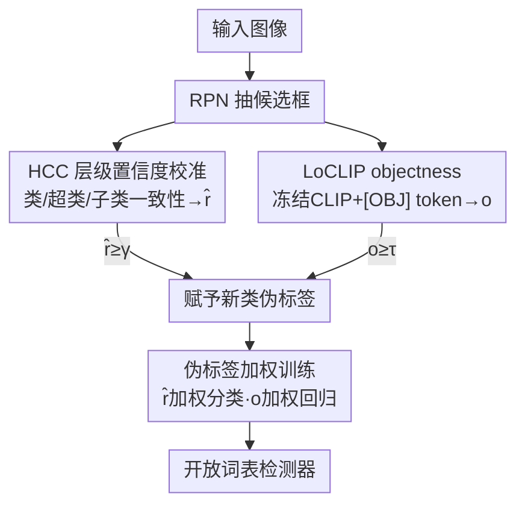

# Exploring Hierarchical Consistency and Unbiased Objectness for Open-Vocabulary Object Detection

**会议**: CVPR 2026  
**arXiv**: [2604.23344](https://arxiv.org/abs/2604.23344)  
**代码**: https://cvlab.yonsei.ac.kr/projects/HCC (项目页)  
**领域**: 开放词表目标检测 / VLM  
**关键词**: 开放词表检测, 伪标签, 层级一致性, objectness, CLIP 适配

## 一句话总结
针对开放词表检测（OVD）伪标签里两个老毛病——CLIP 的类别置信度不可靠、RPN 的 objectness 偏向基类——本文提出 HCC（用类/超类/子类三级预测的一致性来校准置信度）和 LoCLIP（往冻结 CLIP 里插一个 `[OBJ]` token 估计 objectness），只靠更干净的伪标签就在 OV-COCO/OV-LVIS 上刷到新 SOTA（OV-COCO 新类 AP$_{50}^{N}$ 38.9）。

## 研究背景与动机
**领域现状**：OVD 要在只有基类（base）标注的情况下，检测训练时没见过的新类（novel）。主流做法是用 VLM（如 CLIP）给 RPN 产出的候选框打伪标签：RPN 先生成一堆候选区域，CLIP 用「a photo of a [class]」的文本特征算分类置信度 $\hat{p}=\max(\mathbf{p})$，RPN 给 objectness 分数，两个分数都够高的候选才被赋予新类伪标签，再连同基类真值一起训练检测器。

**现有痛点**：这套流程有两个硬伤。其一，CLIP 是为**图像级**预测优化的，拿来做**区域级**判断时分不清「贴合物体的框」和「背景/错位框」——背景区域也可能拿到很高的 $\hat{p}$，导致伪标签被无关区域污染（论文引用：COCO 上 76% 的 CLIP 伪标签落在背景）。其二，RPN 只用基类标注训练，novel 类在训练时被当作背景压制，所以它对新类物体的 objectness 估计天然不可靠（41M 参数全为基类调过，过拟合基类）。

**核心矛盾**：用来挑伪标签的两把尺子——分类置信度和 objectness——都是在「基类/图像级」语境下学出来的，却被要求去判断「新类/区域级」的好坏，存在系统性偏置。

**本文目标**：分别修这两把尺子。让置信度能区分好框坏框；让 objectness 不再偏向基类。

**切入角度**：作者观察到一个现象（Fig.1）——**贴合物体的框，在类/超类/子类三个层级上的预测是一致的；而背景框的层级预测是乱的**。这给了一个不依赖额外标注、纯靠层级一致性筛框的信号。

**核心 idea**：用「层级语义一致性」校准 CLIP 置信度（HCC），用「冻结 CLIP + 可学 objectness token」替代 RPN 估 objectness（LoCLIP），把两个分数都做干净，再用它们反过来给伪标签的损失加权。

## 方法详解

### 整体框架
整篇方法本质是一条**更干净的伪标签生产线**：输入一张图，RPN 抽候选框 → 每个框走两路，HCC 算校准后的分类置信度 $\hat{r}$、LoCLIP 算 objectness $o$ → 只有「层级一致（$\hat{r}\ge\gamma$）且 objectness 够高（$o\ge\tau$）」的框才被赋予新类伪标签 → 伪标签连同基类真值训练 OV 检测器，且训练时用 $\hat{r}$、$o$ 给分类/回归损失逐框加权。两个核心组件分工明确：HCC 抓**类别相关**线索，LoCLIP 抓**类别无关**的定位质量，互补。

### 关键设计

**1. HCC 层级置信度校准：用类/超类/子类预测是否一致来判断框好不好**

直接拿 $\hat{p}=\max(\mathbf{p})$ 当置信度的问题是，CLIP 在区域级分不清好坏框，背景框也能拿高分。HCC 的做法是先用 LLM（GPT-OSS）给每个新类生成 $K$ 个超类（super）和子类（sub），比如 dog 的子类是 corgi/husky 之类；然后对每个候选框，在子类层级上算一个跨全部 $|C_N|\times K$ 个子类的 softmax 分布 $\mathbf{p}_{\operatorname{sub}}$，再对每个类做 max-pooling 取该类最相关子类的分数 $\mathbf{z}_{\operatorname{sub}}(n)=\max(\mathbf{p}_{\operatorname{sub}}(n))$，用它去重加权原类别概率：

$$\mathbf{r}_{\operatorname{sub}}(n)=\frac{\mathbf{p}(n)\,\mathbf{z}_{\operatorname{sub}}(n)}{\sum_m \mathbf{p}(m)\,\mathbf{z}_{\operatorname{sub}}(m)}$$

这个乘积-归一化形式有个漂亮的性质：当类层级和子类层级的 argmax **一致**时，$\max(\mathbf{r}_{\operatorname{sub}})\ge\hat{p}$（置信度被抬高）；**不一致**时 $\max(\mathbf{r}_{\operatorname{sub}})<\hat{p}$（被压低）。超类侧对称地得到 $\mathbf{r}_{\operatorname{sup}}$，最终 $\hat{r}=\max(\mathbf{r})$，$\mathbf{r}(n)=\tfrac{1}{2}(\mathbf{r}_{\operatorname{sub}}(n)+\mathbf{r}_{\operatorname{sup}}(n))$。只有 $\hat{r}\ge\gamma$ 才赋伪标签。之所以有效，是因为「层级一致」恰好对应「框贴合物体」这一物理事实——背景框在不同粒度上预测会自相矛盾，自然被压下去，从源头减少了背景污染。

**2. LoCLIP 无偏 objectness：往冻结 CLIP 里插一个 `[OBJ]` token 替代 RPN 打分**

RPN 的 objectness 对新类不可信，因为它把新类当背景训过。LoCLIP 不再用 RPN，而是给预训练 CLIP 的 ViT 图像编码器追加一个**可学习 `[OBJ]` token**，让它通过自注意力和冻结的 CLIP patch 特征交互，输出过一个 FC + sigmoid 直接预测 objectness。整个适配里 `[CLS]` token、embedding、ViT 编码器**全部冻结**，只训 `[OBJ]` token 和 FC（约 33K 参数，对比 RPN 的 41M）。无偏的两点原因：一是 `[OBJ]` 交互的是没被基类污染的冻结 CLIP 特征；二是可训参数极少，几乎不会过拟合基类。相比另一种「直接拿 `[CLS]` 图像级特征 + 一个 FC（Adapter）」的方案，LoCLIP 用的是 **patch 级局部特征**，对定位质量更敏感，所以对新类 objectness 估得更准。训练用 BCE，标签由候选框与基类物体的 IoU 决定；用 masked attention 让一次前向同时吐出视觉特征和 objectness，几乎不增开销（每图仅 +2.3% 时间）。

**3. 置信度/objectness 双重加权的伪标签训练损失**

光把伪标签筛干净还不够——留下的伪标签质量仍有高低。本文不把伪标签当作硬标签等权使用，而是把 HCC 的置信度 $z_i$ 和 LoCLIP 的 objectness $o_i$ 当作软权重写进损失：

$$\mathcal{L}_i=\begin{cases}\mathcal{L}_{\mathrm{cls}}(\hat{c}_i,c_i)+\mathds{1}_{[c_i\in C_B]}\mathcal{L}_{\mathrm{reg}}(\hat{u}_i,u_i)&c_i\in C_B\cup\{bg\}\\ z_i\,\mathcal{L}_{\mathrm{cls}}(\hat{c}_i,c_i)+o_i\,\mathcal{L}_{\mathrm{reg}}(\hat{u}_i,u_i)&c_i\in C_N\end{cases}$$

直觉很顺：分类置信度高就让这个伪标签的分类损失说话更响，定位（objectness）高就让回归损失更响；反之低质量伪标签的监督信号被自动压低。这让检测器把注意力放在更可信的区域上，降低错位/不确定伪标签的干扰。

### 损失函数 / 训练策略
总损失 $\mathcal{L}=\sum_i\mathcal{L}_i$。基类用真值标准训练，novel 类用上式加权伪标签。OV-COCO 用 Faster R-CNN + ResNet-50，1× 调度（90k 迭代），$\gamma=0.8,\tau=0.3$；OV-LVIS 用 Mask R-CNN，2× 调度（180k），$\gamma=0.6,\tau=0.2$。VLM 为 CLIP ViT-B/32，超类 $K=10$、子类 $K=30$，LLM 用 GPT-OSS-120b。LoCLIP 仅用 1% 训练图、单卡 A6000 约 5 分钟收敛。

## 实验关键数据

### 主实验
OV-COCO（box AP$_{50}$，RCNN 类检测器、无额外数据集，3 次独立运行均值±标准差）：

| 方法 | Backbone | AP$_{50}^{N}$（新类） | AP$_{50}^{B}$（基类） |
|------|----------|------|------|
| VL-PLM | RN50 | 32.3 | 54.0 |
| BARON | RN50 | 34.0 | 60.4 |
| MarvelOVD† | RN50 | 35.4 | 56.5 |
| SAS-Det | RN50 | 37.4 | 58.5 |
| **本文** | RN50 | **38.9±0.3** | 59.5±0.2 |
| CLIPSelf† | ViT-L/14 | 41.3 | 65.5 |
| **本文** | ViT-L/14 | **44.0±0.2** | 65.8±0.1 |

新类 AP 超过用「为检测定制的 VLM（RegionCLIP）」的 SAS-Det，也超过需要额外自训练阶段的 MarvelOVD，且训练时间只有 MarvelOVD 的 1/1.5。

OV-LVIS（mask mAP）：

| 方法 | Backbone | AP$_m^{N}$（新类） | AP$_m^{All}$ |
|------|----------|------|------|
| SAS-Det | RN50 | 20.9 | 26.1 |
| **本文** | RN50 | **21.7±0.4** | 26.0±0.2 |
| CLIPSelf† | ViT-B/16 | 25.1 | 24.5 |
| **本文** | ViT-B/16 | **25.5±0.2** | 24.7±0.1 |

### 消融实验
OV-COCO，逐组件叠加（① 为本文复现的 VL-PLM 基线）：

| 配置 | $\mathbf{r}_{\operatorname{sub}}$ | $\mathbf{r}_{\operatorname{sup}}$ | LoCLIP | AP$_{50}^{N}$ | AP$_{50}^{B}$ |
|------|:---:|:---:|:---:|------|------|
| ① 基线 | | | | 32.2 | 58.3 |
| ② +超类 | | ✓ | | 36.8 | 59.3 |
| ③ +子类 | ✓ | | | 36.0 | 59.5 |
| ④ 超类+子类 | ✓ | ✓ | | 37.8 | 59.4 |
| ⑤ +LoCLIP | | | ✓ | 33.9 | 59.0 |
| ⑥ 完整 | ✓ | ✓ | ✓ | **38.9** | 59.5 |

objectness 估计质量（与 GT IoU 的相关系数，unseen 类）：

| 指标 | RPN | Adapter | LoCLIP |
|------|------|------|------|
| Spearman ρ (Even→Odd) | 0.038 | 0.456 | **0.473** |
| Kendall τ (Even→Odd) | 0.024 | 0.313 | **0.326** |
| Spearman ρ (Odd→Even) | 0.002 | 0.434 | **0.449** |

### 关键发现
- HCC 单独把基线从 32.2 抬到 37.8（+5.6），是涨点主力；合用超类+子类（④）互补。作者指出 CLIP 对细粒度文本描述（子类）更敏感，归因于细粒度概念在预训练数据里出现更频繁。
- RPN 的 objectness 与真实 IoU 几乎零相关（0.002~0.038），证实它对新类完全失效；LoCLIP（局部 patch 特征）稳超 Adapter（图像级 `[CLS]` 特征）。
- 干净伪标签连基类 AP 也一起涨（噪声变少）；全流程仅比 VL-PLM 慢 2.3%，比靠自训练的 MarvelOVD 快得多。

## 亮点与洞察
- **「层级一致性 = 框贴不贴物体」这个观察很巧**：它把一个难以直接监督的「定位质量」问题，转化成「CLIP 在多粒度文本下预测是否自洽」的可计算信号，且不需要任何额外标注。
- **HCC 的乘积-归一化有可证明的单调性**：一致则升、不一致则降（式 7/8），不是经验调参的启发式，机制干净。
- **LoCLIP 用 33K 参数打败 41M 的 RPN**，核心是「冻结大模型 + 极小可学 token」避免基类过拟合——这套「插一个任务 token、冻结主干」的思路可迁移到任何需要从预训练 VLM 抽「类别无关属性」的场景。
- **把筛选分数复用为损失权重**（设计 3）几乎零成本，是软标签思想在伪标签 OVD 里的自然落地。

## 局限与展望
- HCC 依赖 LLM 生成的超/子类层级质量，层级噪声会直接影响校准；论文提到还需 LLM 驱动的细化流程（细节在附录），对不同 LLM 的鲁棒性主要靠附录支撑，正文未充分展开。
- 方法仍建立在 RPN 产出的候选框之上——若 RPN 连候选框都没召回到的新类物体，后续 HCC/LoCLIP 也无能为力。
- 子类 $K=30$、超类 $K=10$ 等粒度超参在 COCO/LVIS 上调过，迁移到类别体系差异大的数据集时可能需重调。
- 评测仍限于 COCO/LVIS 标准 OVD 设定，更开放、更长尾的真实场景泛化性待验证。

## 相关工作与启发
- **vs VL-PLM / SAS-Det / MarvelOVD（伪标签系）**：它们都用 CLIP 置信度 + RPN objectness 挑框，本文指出这两把尺子本身有偏，分别用 HCC 和 LoCLIP 替换；尤其相比 MarvelOVD 靠额外自训练去噪，本文主张「把伪标签一次做干净」更划算（训练快 1.5×）。
- **vs RegionCLIP/CLIPSelf（区域级 VLM 系）**：它们重训 VLM 让其具备区域级对齐，代价是大规模预训练；本文不动 CLIP 主干，只做轻量适配，且能叠在 CLIPSelf 上进一步涨点，说明二者正交。
- **vs 用语言层级的 OVD（如增广 classifier / class label）**：以往层级信息主要用于改进**分类**，本文首次把层级一致性用于判断「区域是否含目标物」即**定位/筛选**，并额外显式建模 objectness。

## 评分
- 新颖性: ⭐⭐⭐⭐ 「层级一致性判定框质量」+「冻结 CLIP 插 objectness token」两个角度都新且自洽
- 实验充分度: ⭐⭐⭐⭐ COCO/LVIS 双榜 SOTA、组件消融、objectness 相关性、效率分析齐全，3 次重复给方差
- 写作质量: ⭐⭐⭐⭐ 动机-观察-方法链条清晰，公式与图示配合好
- 价值: ⭐⭐⭐⭐ 不依赖额外数据、轻量、可叠加，伪标签 OVD 的实用增益明显

<!-- RELATED:START -->

## 相关论文

- [\[CVPR 2026\] NoOVD: Novel Category Discovery and Embedding for Open-Vocabulary Object Detection](noovd_novel_category_discovery_and_embedding_for_open-vocabulary_object_detectio.md)
- [\[CVPR 2026\] Parameter-Efficient Semantic Augmentation for Enhancing Open-Vocabulary Object Detection](parameter-efficient_semantic_augmentation_for_enhancing_open-vocabulary_object_d.md)
- [\[CVPR 2026\] ABRA: Teleporting Fine-Tuned Knowledge Across Domains for Open-Vocabulary Object Detection](abra_teleporting_fine-tuned_knowledge_across_domains_for_open-vocabulary_object_.md)
- [\[AAAI 2026\] VK-Det: Visual Knowledge Guided Prototype Learning for Open-Vocabulary Aerial Object Detection](../../AAAI2026/object_detection/vk-det_visual_knowledge_guided_prototype_learning_for_open-vocabulary_aerial_obj.md)
- [\[CVPR 2026\] Back to Point: Exploring Point-Language Models for Zero-Shot 3D Anomaly Detection](back_to_point_exploring_point-language_models_for_zero-shot_3d_anomaly_detection.md)

<!-- RELATED:END -->
