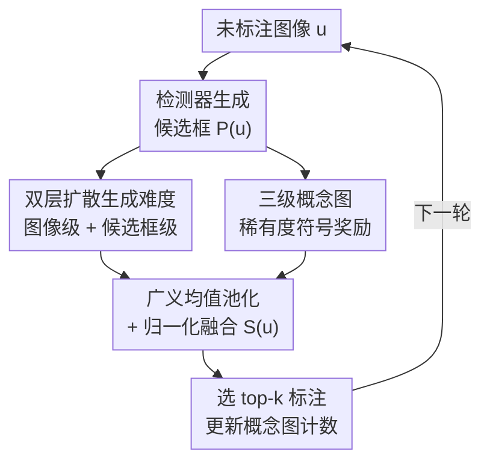

# Hard to See, Hard to Label: Generative and Symbolic Acquisition for Subtle Visual Phenomena

**会议**: CVPR 2026  
**arXiv**: [2604.22990](https://arxiv.org/abs/2604.22990)  
**代码**: 无  
**领域**: 目标检测 / 主动学习 / 工业缺陷检测  
**关键词**: 主动学习, 扩散模型不确定性, 神经符号, 概念图, 微弱缺陷

## 一句话总结
针对"既难看清又难标注"的微弱视觉异常（如发丝裂纹、亚毫米气孔），本文提出主动学习框架 GSAL：用扩散模型在图像级和候选框级打"生成难度分"找出视觉上反常的样本，再用三级概念图给语义稀有类加"覆盖奖励"，两路信号融合后挑样本去标注，在工业薄膜缺陷、Pascal VOC、MS COCO 上都比纯不确定性/多样性基线更省标注、更早召回稀有类。

## 研究背景与动机
**领域现状**：目标检测的主动学习（Active Learning, AL）主流靠三类信号挑样本——判别式不确定性（softmax 熵、MC-dropout 方差）、特征空间多样性（core-set），以及二者的混合。它们共享一个假设：检测器的置信度或特征空间距离能可靠地代理"这个样本值不值得标注"。

**现有痛点**：在微弱视觉异常上这个假设系统性失效。这类目标（工业薄膜里的发丝钻孔、亚毫米气孔）有三个叠加属性——空间上极小（占图像面积不到 2%）、对比度极低（和背景纹理几乎分不开）、语义上稀有。后果是恶性循环：少量样本训出的检测器自信地把微弱异常判成背景，于是给它们极低的采集优先级，标注池越来越偏向显眼类别。具体而言：① 低标注预算下判别式熵失准，像背景的微弱异常拿到低熵，被漏选；② 特征空间多样性不保证语义覆盖，稀有目标若在特征上靠近主流背景就被欠探索；③ 在可审计的检测流程里（漏检缺陷有合规后果），每次采集决策还必须可追溯解释，而上述信号都给不出理由。

**核心矛盾**：一个样本可以"视觉上很反常但判别式不确定性很低"，也可以"对生成模型很难重建但其实落在已被充分覆盖的语义模态里"。单一信号管不住——视觉难度和语义稀有度是两个正交维度。

**本文目标**：设计一个针对微弱异常的"定向混合"采集规则，一路信号捕捉视觉反常度（与检测器状态无关），另一路促进语义稀疏但重要区域的覆盖，并且每次选择都带可读的语义理由。

**切入角度**：扩散模型天然是"生成难度"的来源——通过测量潜空间的重建误差和去噪方差，它对结构反常、视觉模糊的区域打高分，**独立于检测器是否已经学会区分**。但生成难度单独不够：反常但常见的背景纹理也会得高分。于是再叠加一个三级概念图提供语义覆盖先验，把"反常但常见"和"语义稀疏但重要"区分开。

**核心 idea**：用"扩散生成难度（视觉反常度）+ 概念图稀有度奖励（语义覆盖）"的双信号采集，专门把"既难看清、又重要"的样本捞出来标注。

## 方法详解

### 整体框架
GSAL（Generative and Symbolic Active Learning）解决的是池式主动学习里"怎么从未标注池 $\mathcal{U}$ 选 $k$ 张图去标注、让检测器涨得最多"的问题。整体是一个每轮循环的采集 pipeline：给一张未标注图，检测器先生成候选框；然后并行计算两路信号——扩散模型在**图像级**（捕捉全局场景模糊度）和**候选框级**（捕捉被图像级稀释掉的局部微弱异常）打生成难度分，同时每个候选框从三级概念图拿一个稀有度奖励；候选框级的难度分和覆盖分经归一化后用 soft top-$k$（广义均值）池化聚合，再与图像级扩散分融合，得到整图的最终采集分 $S(u)$；按 $S(u)$ 选 top-$k$ 图标注，更新概念图的覆盖计数，进入下一轮。

### 关键设计

**1. 双层扩散生成难度：用重建误差和去噪方差捞出"视觉反常"的样本**

痛点是判别式不确定性在低标注预算下失准——像背景的微弱异常拿不到高熵。本文换一个与检测器无关的信号源：用 Stable Diffusion v2.1-base 的潜空间扩散，从样本潜表示 $z(u)$ 的加噪版本出发产生 $T$ 个去噪重建 $\hat{z}^{(t)}(u)$，取其均值 $\bar{z}(u)$ 后抽两个量——重建误差 $R(u)=\|z(u)-\bar{z}(u)\|_2^2$ 衡量平均能恢复多好，去噪方差 $V(u)=\frac{1}{T}\sum_t\|\hat{z}^{(t)}(u)-\bar{z}(u)\|_2^2$ 衡量去噪轨迹有多不稳定。图像级生成难度是二者加权 $U_{\mathrm{img}}(u)=\alpha R(u)+\beta V(u)$。直觉是：微弱缺陷往往难以忠实重建（即便检测器判它为低不确定性），所以重建误差/方差高的区域更值得标。

关键的"双层"在于：光在图像级打分会把占面积不到 2% 的局部异常稀释掉。所以本文把同一套扩散评分搬到检测器候选框上——经 NMS 后保留 top-$M$ 个候选框，对每个候选框裁剪 $p$ 算 $U_{\mathrm{prop}}(p)=\alpha R(p)+\beta V(p)$，让采集对"全局场景模糊度"和"空间局部的微弱异常"同时敏感

**2. 三级概念图与稀有度符号奖励：把"反常但常见"和"语义稀疏但重要"区分开**

痛点是扩散难度单独会把"反常但常见的背景"也选进来，且没有可审计的理由。本文构造一个三级有向无环概念图 $\mathcal{G}=(V,E)$，节点分 $V_{\text{fine}}$（细粒度=数据集标签，如薄膜里的 void/inclusion/petal/drill hole）、$V_{\text{coarse}}$（按结构来源分组，如表面/亚表面）、$V_{\text{abstract}}$（可复用的视觉属性，如 dark/bright/round/u-shaped/sharp-boundary）。三层分别承担不同的覆盖语义：fine 保真到标注标签、coarse 防止重复采同一大类、abstract 捕捉极性/形状/边界这类可复用特征，让"语义缺口"在多个粒度上显式可见，而不是埋在潜特征里。每个未标注样本用 CLIP 接入图——用图像嵌入 $\phi(u)$ 与概念文本嵌入 $\psi(c)$ 的内积取 $v_f(u)=\arg\max_{c\in V_{\text{fine}}}\langle\phi(u),\psi(c)\rangle$ 定到细类，再沿图取出其粗类和抽象节点，于是每次采集都能用"标签→家族→视觉属性"的语义路径解释。

为奖励欠覆盖区域，对每个节点维护覆盖计数 $n(v)$（被选过几次），设 fine/coarse/abstract 三级稀有阈值 $\tau_f,\tau_c,\tau_a$，用指示函数判稀有：$I_f(u)=\mathbb{I}[n(v_f(u))<\tau_f]$（coarse/abstract 同理）。符号奖励为 $B(p)=I_f(p)+I_c(p)+\lambda\sum_{v_a\in\mathcal{A}(u)}I_a(u)$，$\lambda$ 调抽象级稀有的贡献。这样同时偏好稀有缺陷身份、欠探索缺陷家族、低频视觉属性三种"稀有"。阈值 $(\tau_f,\tau_c,\tau_a)$ 每轮按 top-20% 覆盖分位数动态重算，随标注集增长自适应

**3. 广义均值池化与归一化融合：把两路信号拉到可比尺度再合成一个采集分**

痛点是候选框分要聚合成整图分、且扩散难度与符号奖励量纲不同没法直接相加。本文先对候选框级用广义均值（generalized-mean）池化：$S_{\mathrm{prop}}(u)=\big(\frac{1}{|P_M(u)|}\sum_p(\tilde{U}_{\mathrm{prop}}(p)+\lambda\tilde{B}_{\mathrm{prop}}(p))^\rho\big)^{1/\rho}$，$\rho=1$ 退化为均值、$\rho$ 越大越突出高分候选框（soft top-$k$）。再把候选框级与图像级生成难度融合 $U_g(u)=(1-\gamma)S_{\mathrm{prop}}(u)+\gamma\tilde{U}_{\mathrm{img}}(u)$。

跨项可比的关键是归一化：所有分量在当轮未标注池内用 z-score 归一 $\tilde{x}=\frac{x-\mu_x}{\sigma_x+\epsilon}$，再合成最终采集分 $S(u)=\tilde{U}(u)+\eta\tilde{B}(u)$，$\eta$ 是"视觉难度 vs 语义覆盖"的权衡。这个尺度归一的合成规则让同一套超参在三个数据集上无需逐数据集调参就一致可用

### 损失函数 / 训练策略
GSAL 本身不引入新损失，它改的是"选哪些图去标"的采集规则。检测器用 Faster R-CNN + ResNet-50，每个 AL 轮从头重训以避免偏差累积，SGD（lr=0.02，momentum=0.9，weight decay=$10^{-4}$，batch=16），短边 resize 到 600。语义对齐用 CLIP，生成不确定性用 Stable Diffusion v2.1-base。关键超参取 $\eta=0.5$、$\lambda=1.0$、$\rho\in\{2,4\}$、$M\in\{16,32,64\}$、$T=4$ 次随机重建。

## 实验关键数据

### 主实验
工业薄膜 CT 缺陷数据集（约 15000 张灰度图、4 类缺陷、异常占面积 <2%）从 1% 标注起每轮加 1% 到 10%，三次独立运行取均值；VOC/COCO 从 5% 起每轮加 2.5%。

| 数据集（预算） | 指标 | GSAL | 最强基线 | 熵基线 |
|--------|------|------|----------|--------|
| 薄膜缺陷（10%） | F1 | **0.770** | 0.756 (NORIS) | 0.748 |
| Pascal VOC（20%） | mAP@50 | **71.1** | 69.2 (NORIS) | 63.1 |
| MS COCO（20%） | AP@[.5:.95] | **32.1** | 31.8 (NORIS) | 29.6 |

最大优势出现在 1–5% 的低预算区间——正是熵失准最严重、微弱异常标注最贵的地方。跨数据训练（多源协议）下 GSAL 仍最强：薄膜 0.77 F1、VOC 74.5 mAP@50、COCO 33.1 AP。

### 消融实验
概念图层级消融（薄膜缺陷 F1）与组件消融（VOC/COCO 20%）：

| 配置 | F1@10% | 说明 |
|------|--------|------|
| Fine-only | 0.748 | 只细类，管不住同一粗类内过采 |
| Coarse-only | 0.752 | 丢失组内细粒度多样性 |
| Abstract-only | 0.751 | 有外观多样性但不锚定具体缺陷类 |
| Fine+Coarse | 0.756 | 两级互补 |
| **Full (F+C+A)** | **0.770** | 三级覆盖信号互补，最优 |

| 配置 | VOC mAP@50 | 稀有覆盖(6) | COCO AP | 稀有覆盖(10) |
|------|-----------|-----------|---------|-------------|
| GSAL (full) | 77.0 | 6 | 33.5 | 10 |
| w/o Diffusion | 70.2 | 5 | 31.5 | 8 |
| w/o Symbolic | 68.7 | 3 | 30.7 | 6 |
| w/o Rarity | 67.5 | 4 | 30.2 | 7 |

### 关键发现
- **去符号覆盖掉点最狠**：VOC 稀有类覆盖从 6 降到 3、COCO 从 10 降到 6，说明语义覆盖才是召回稀有类的主因；去扩散则整体性能降但覆盖不崩——两路信号互补、各管一头。
- **稀有类召回更早**：VOC 上 GSAL 10% 标注召回 4 个稀有类、15% 召回全部 6 个，而基线 10% 只召回 1–3、15% 召回 3–5。
- **代价可控**：尽管加了扩散打分，靠候选框预筛/轻量筛选，GSAL 相比熵采样只增 ~15% 运行时（熵=1.0× 归一化，core-set/混合 ~1.1×）。
- **超参稳健**：单参数独立扫描下任一参数引起的 F1 波动均 <±0.3，说明报告的固定取值是稳健工作点而非数据集特调。

## 亮点与洞察
- **把"采集信号"从检测器里解耦出来**：扩散重建误差/方差不依赖检测器是否学会区分缺陷，正好绕开"低标注→低熵→漏选"的死循环，这是它能在 1–5% 预算赢最多的根因。
- **正交分解很干净**：视觉难度（扩散）和语义稀有度（概念图）是两个独立维度，消融正好印证——一个管"反常度"、一个管"覆盖度"，缺一不可。
- **可解释性顺带白送**："标签→家族→视觉属性"的语义路径让每次采集自带可审计理由，这在合规要求高的工业检测里是刚需，而不是事后贴标签。
- **双层扩散打分可迁移**：图像级+候选框级的"全局/局部"双尺度思路，可搬到任何"小目标被全局信号稀释"的检测/分割主动学习场景。

## 局限与展望
- **概念图靠手工构建**：三级图（尤其抽象属性）目前需人工定义，换新工业域成本高；作者在 Future Work 提出用 CLIP 嵌入 + LLM 语义聚类自动建图，但仅是初步探索。
- **工业数据集只有二值标签**：薄膜缺陷只有"有/无缺陷"，没有细粒度缺陷类型标注，CLIP 在灰度 CT 这种 OOD 域上对齐也不可靠，因此"语义覆盖提升稀有缺陷召回"在工业集上**无法直接验证**，只能借 VOC/COCO 的覆盖证据做"支持性推断"——作者自己也诚实地把这点标为"supporting evidence rather than direct proof"。⚠️ 即工业集的核心收益缺直接因果证据。
- **依赖 CLIP+SD 大模型**：每轮要跑扩散重建和 CLIP 嵌入，虽然预筛后只增 15% 时间，但绝对算力门槛仍高（4×A100）。
- **改进方向**：补齐工业集的细粒度缺陷类型标注以直接验证覆盖机制；把自动建图做扎实以适配演化中的缺陷分类体系。

## 相关工作与启发
- **vs 不确定性 AL（熵 / MC-dropout / margin）**：它们用检测器置信度代理标注价值，本文指出在微弱异常上判别式置信度被严重误标，改用与检测器无关的扩散生成难度，VOC 上 71.1 vs 熵 63.1。
- **vs 多样性 AL（Core-set / BADGE）**：它们靠特征空间几何展开，但不保证语义稀疏类被覆盖；本文用显式三级概念图提供语义覆盖先验，稀有类召回 6/6 vs core-set 的 4/6。
- **vs 现有扩散 AL**：已有扩散主动学习只在图像级、且面向分类/域适应；本文首次把扩散不确定性下沉到检测器候选框级，专攻微弱目标检测。
- **vs 神经符号 / 概念瓶颈方法**：它们证明把神经预测锚到显式符号结构能提升覆盖和可解释性，但没用在主动学习里；本文把 CLIP 接地的概念图与扩散难度耦合，填上"主动学习里做微弱视觉检测"这块空白。

## 评分
- 新颖性: ⭐⭐⭐⭐ 扩散生成难度（候选框级）+ 神经符号概念图覆盖的双信号组合在微弱异常 AL 上是新颖且自洽的切入。
- 实验充分度: ⭐⭐⭐⭐ 工业+VOC+COCO 三数据集、多预算、组件/层级双消融充分，但工业集核心机制因二值标签无法直接验证。
- 写作质量: ⭐⭐⭐⭐ 动机层层递进、三类失效讲得清楚，公式与流程完整，且诚实标注了证据局限。
- 价值: ⭐⭐⭐⭐ 直击工业缺陷"难看清又难标"的真实痛点，省标注+可审计理由对落地有实际意义。

<!-- RELATED:START -->

## 相关论文

- [\[CVPR 2026\] Does YOLO Really Need to See Every Training Image in Every Epoch?](does_yolo_really_need_to_see_every_training_image_in_every_epoch.md)
- [\[CVPR 2026\] Integration of Deep Generative Anomaly Detection Algorithm in High-Speed Industrial Line](integration_of_deep_generative_anomaly_detection_algorithm_in_high-speed_industr.md)
- [\[ICCV 2025\] From Easy to Hard: Progressive Active Learning Framework for Infrared Small Target Detection with Single Point Supervision](../../ICCV2025/object_detection/from_easy_to_hard_progressive_active_learning_framework_for_infrared_small_targe.md)
- [\[CVPR 2026\] CompAgent: An Agentic Framework for Visual Compliance Verification](compagent_an_agentic_framework_for_visual_compliance_verification.md)
- [\[CVPR 2026\] Evaluating Few-Shot Pill Recognition Under Visual Domain Shift](evaluating_few-shot_pill_recognition_under_visual_domain_shift.md)

<!-- RELATED:END -->
