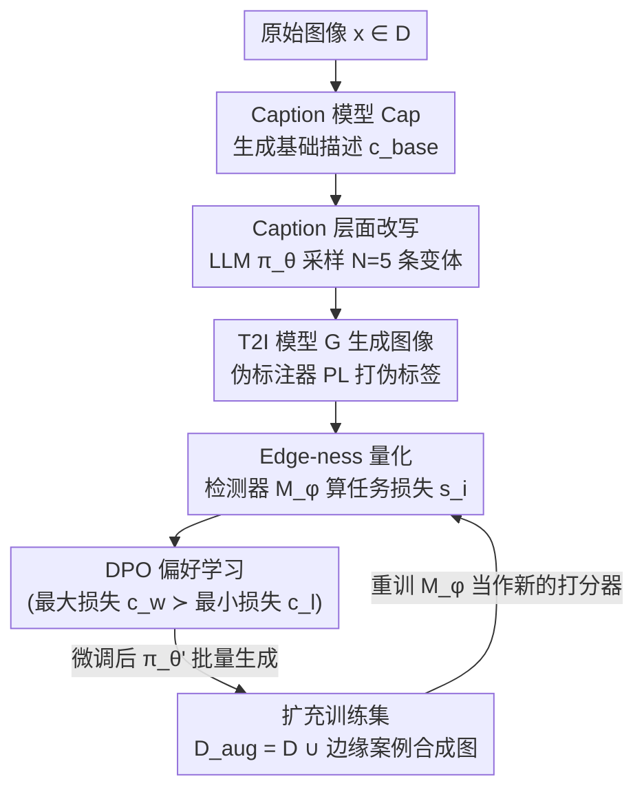

# Towards Continual Expansion of Data Coverage: Automatic Text-guided Edge-case Synthesis

**会议**: CVPR 2026  
**arXiv**: [2509.26158](https://arxiv.org/abs/2509.26158)  
**代码**: 有（论文称 Code is available at github repository，具体链接以原文为准）  
**领域**: 目标检测 / 合成数据增强  
**关键词**: 边缘案例合成、文生图增强、偏好学习(DPO)、数据闭环、鱼眼目标检测

## 一句话总结
用一个被 DPO 偏好微调过的 LLM 把图像 caption 改写成"刁难检测器"的文本提示，喂给文生图模型批量生成困难场景图像来扩充训练集，从而在 FishEye8K 鱼眼目标检测上以全自动方式超过朴素增强和人工设计提示。

## 研究背景与动机
**领域现状**：深度模型的性能高度依赖训练数据的质量与多样性，但真实数据集普遍带有标签噪声与分布偏置。缓解这种偏置的主流做法分两条线——以模型为中心（鲁棒优化、正则化）和以数据为中心（数据增强、重采样）。近年来更激进的趋势是直接用生成模型"合成新数据"来补齐模型的弱点和欠表达的边缘场景。

**现有痛点**：找到这些"边缘案例（edge-case）"传统上是个高度依赖人力的过程——需要领域专家手动分析模型的失败模式，盯着混淆矩阵、逐类指标、具体的假阳/假阴样本，再据此指导后续的数据采集和提示设计（如鱼眼检测里靠 AI 研究员做详细错误分析、手写提示）。这让整条流程难以自动化、难以扩展、难以复现。另一条自动化路线（DREAM-OOD、GIF、LTG）则在生成模型的**潜空间**里导航采样，依赖复杂的结构假设、对超参敏感、生成结果可解释性差。

**核心矛盾**：生成式数据增强还有一个根本性陷阱——生成模型天然倾向于产出训练分布主模态附近的样本（mode-collapse），而真实数据往往是长尾分布。一旦合成数据只是在反复强化模型已经学会的典型样本，超过某个阈值后边际收益就急剧衰减，根本覆盖不到稀有但关键的边缘场景。所以单纯堆数据量是低效的，需要**有针对性地**往"模型高不确定性"的区域扩张。

**本文目标**：把边缘案例的"发现"和"合成"都自动化——既要潜空间法那样的模型条件引导（自动、可规模化），又要提示工程那样的语义精度（可解释、可控）。

**切入角度**：作者的关键观察是，与其在图像/实例 embedding 的潜空间里折腾，不如**在 caption（文本）层面**识别和制造边缘案例。理由有二：① 对 caption 做简单的语义改写，就能在生成图像上诱导出大幅且有意义的多样性，不仅改变物体属性和排布，还能改变整体场景上下文和背景；② 站在标准 T2I 框架之上，可以天然吃到未来高保真生成模型和参数高效微调技术的红利。

**核心 idea**：训练一个"改写器 LLM"，用偏好学习（DPO）让它学会把普通 caption 改写成能让目标检测器"答错"的提示，再用 T2I 把这些提示变成困难图像补进训练集；并且整条管线可以**迭代闭环**——重训检测器后用新检测器当下一轮的难度打分器，持续扩张数据覆盖。

## 方法详解

### 整体框架
整条管线是一个**自我改进的反馈闭环**：给定原始训练集 $D$ 中的一张图 $x$，先用 caption 模型 $Cap(\cdot)$ 生成一句客观的基础描述 $c_{base}=Cap(x)$；把它送进改写器 LLM $\pi_\theta$，采样出 $N$ 条语义变体 $C=\{c_1,\dots,c_N\}$（实现里固定 $N=5$）。每条改写 caption $c_i$ 经 T2I 模型 $G(\cdot)$ 生成图像 $x_i'=G(c_i)$，由于合成图没有真值标注，用一个高性能预训练模型当伪标注器 $PL(\cdot)$ 打上伪标签 $y_i'$。然后用一个**在 $D$ 上预训练好的判别模型（检测器）$M_\phi$** 算每个合成样本的任务损失，损失越高代表这条 caption 越"刁钻"（edge-ness 越高）。在 $N$ 条变体里挑出损失最大的 $c_w$（preferred）和损失最小的 $c_l$（un-preferred）组成偏好对，用 DPO 微调改写器 LLM，使它整体偏向生成高 edge-ness 的 caption。微调后的 $\pi_{\theta'}$ 批量生成边缘案例 caption，合成图像连同伪标签扩充训练集 $D_{aug}=D\cup\{(x_{new}',y_{new}')\}$。最后——重训 $M_\phi$、把更新后的检测器当作下一轮的 edge-ness 打分器，整个流程可反复迭代，逐步挖出越来越复杂的边缘案例。

### 关键设计

**1. Caption 层面的边缘案例发现：把"找难例"从潜空间搬到自然语言**

这一设计直接针对两类前作的痛点：手工提示工程不可规模化、潜空间导航法（DREAM-OOD/GIF/LTG）依赖复杂结构假设且不可解释。作者发现，对一句 caption 做语义改写就足以在生成图上诱导出大范围、有意义的多样性——不止改物体属性，连光照、视角、天气、场景上下文都会变。于是边缘案例的"搜索空间"被定义在文本上：改写器 LLM 从基础 caption $c_{base}$ 采样 $N$ 条变体 $c_i\sim\pi_\theta(\cdot\mid c_{base})$。相比在图像/实例 embedding 上动刀，文本改写既可读可控（生成内容有明确语义解释），又能无缝复用标准 T2I 框架，未来换更强的生成模型/伪标注器即可即插即用。论文的语言学分析进一步发现，微调后的改写器学会了一套"老练"的改写策略：用更具文学性的描述、强调动作与动态情境、把客观元数据（时间、天气）转成有氛围感的渲染——这恰好补上了 FishEye8K 数据集背景单调的偏置。

**2. Edge-ness 量化：用检测器自己的任务损失定义"难度"**

要做偏好学习，先得有一个可量化的"难例"信号。作者把 **edge-ness** 定义为合成图对判别模型 $M_\phi$ 造成的困难程度，直接用任务损失度量：

$$s_i=\mathcal{L}_{task}\big(M_\phi(x_i'),\,y_i'\big)$$

其中 $x_i'=G(c_i)$ 是合成图，$y_i'=PL(x_i')$ 是伪标注器给的伪标签。$s_i$ 越大说明检测器的预测与伪标注的偏差越大，即这张图越"刁难"。这里的 $\mathcal{L}_{task}$ 就是 YOLOv11-small 的标准训练目标——边界框回归损失、分类损失、分布焦点损失（DFL）的加权和。这个设计的巧妙之处在于：edge-ness 完全由"目标检测器当前的盲区"内生定义，不需要任何额外的不确定性头或外部判别器；检测器进步后，同样的打分公式自然指向新的盲区，天然支持迭代闭环。论文用 Figure 3 验证了 automatic 生成的数据确实具有最高的均值/中位损失，证明改写器真的把 caption 转成了"可验证更难"的样本。

**3. DPO 偏好学习对齐改写器：让 LLM 主动生成高 edge-ness 提示**

光能给 caption 打分还不够，要让 LLM **主动**学会生成高 edge-ness 的提示。作者为每个基础 caption 的 $N$ 条变体取损失最大者 $c_w$（preferred）和损失最小者 $c_l$（un-preferred）构成偏好对，汇成偏好数据集 $D_{pref}$，再用 Direct Preference Optimization 微调改写器：

$$\mathcal{L}_{DPO}=\log\sigma\Big(\beta\big(r_\theta(c_w\mid c_{base})-r_\theta(c_l\mid c_{base})\big)\Big),\quad r_\theta(c\mid c_{base})=\log\frac{\pi_\theta(c\mid c_{base})}{\pi_{ref}(c\mid c_{base})}$$

其中 $\pi_{ref}$ 是初始 LLM 的冻结副本，$\sigma$ 是 sigmoid，$\beta$ 控制偏好信号强度。DPO 的好处是免去显式奖励建模和 RL 训练的不稳定，直接拉高"难提示"相对"易提示"的对数概率比。对齐后的 $\pi_{\theta'}$ 就成了一台"自动难例提示发生器"，把人工错误分析+手写提示这一步彻底替换掉。

**4. 迭代式数据闭环：用更新后的检测器持续扩张覆盖**

整条管线被设计成可反复执行的闭环：每一轮生成的边缘案例合成图连同伪标签扩充训练集 $D_{aug}=D\cup\{(x_{new}',y_{new}')\}$，重训检测器 $M_\phi$，再把这个**更强的**检测器当作下一轮的 edge-ness 打分器。因为难度信号始终锚定在"当前检测器还搞不定的地方"，系统能逐步发现并合成越来越复杂的边缘案例，实现标题所说的"数据覆盖的持续扩张"。实验里 v0（朴素五倍扩充）当公共起点，v1/v2 是后续迭代——automatic 在每一轮迭代都拿到最高 mAP，而朴素/人工路线则出现明显的边际收益递减。

### 损失函数 / 训练策略
- **改写器 LLM 对齐**：DPO，目标即上式 $\mathcal{L}_{DPO}$；$\pi_{ref}$ 为初始模型冻结副本，$\beta$ 调节偏好强度。
- **判别检测器**：YOLOv11（small/medium/large），任务损失 $\mathcal{L}_{task}$ = bbox 回归损失 + 分类损失 + 分布焦点损失（DFL）加权和。
- **防数据泄漏协议**：训练集拆成不相交的 train-D 与 train-R——train-D 训检测器，train-R（分布更多样）专供改写器 LLM 做偏好学习；LLM 在偏好学习阶段被禁止访问 train-D，只在推理增强时才接触它，确保合成样本反映 LLM 的泛化能力而非记忆。测试集严格留出。
- **变体数**：$N=5$（增大 $N$ 提升多样性但合成+伪标注成本线性上升，故取折中）。

## 实验关键数据

### 主实验
数据集为 **FishEye8K**（AI-City Challenge 采用的鱼眼相机基准，20 个鱼眼相机、5 类：Bus/Bike/Car/Pedestrian/Truck）。检测器 YOLOv11-small。v0 = 用 naive 策略把 train-D 扩充五倍的公共起点，v1/v2 为后续迭代。指标除 mAP 外还有自定义的 **mAP w/o TP**：只在"与基线（train-D+naive v0）检测器的真阳性预测不重叠"的真值标注上计算 mAP，专门衡量对盲区/困难实例的改善（越高越好）。

| 训练集配置（迭代 v1/v2） | 样本数 | mAP | mAP w/o TP |
|----------------------|--------|------|------------|
| train-D（仅原始） | 3,187 | 0.335 | - |
| train-D + naive v0 | 19,122 | 0.376 | - |
| + naive v1 | 35,057 | 0.378 | 0.361 |
| + manual v1 | 35,057 | 0.374 | 0.357 |
| **+ automatic v1（本文）** | 35,057 | **0.381** | **0.363** |
| + naive v2 | 50,992 | 0.380 | 0.362 |
| + manual v2 | 50,992 | 0.380 | 0.362 |
| **+ automatic v2（本文）** | 50,992 | **0.384** | **0.366** |

automatic 在每一轮迭代都拿到最高的 mAP 和 mAP w/o TP；naive/manual 随数据量增加出现明显边际收益递减（v1→v2 的 mAP 几乎不动），印证"只堆量不针对弱点"的低效。

### 消融实验
跨模型尺度的可迁移性实验（用 YOLOv11-small 生成的数据去训更大的 medium/large，验证合成数据不是只对生成它的那个模型有效）：

| 配置 | 模型 | mAP | mAP w/o TP | 说明 |
|------|------|------|------------|------|
| + naive v1 | YOLOv11-medium | 0.429 | 0.415 | 朴素 |
| + manual v1 | YOLOv11-medium | 0.428 | 0.414 | 人工提示 |
| **+ automatic v1** | YOLOv11-medium | **0.429** | **0.416** | 本文 |
| + naive v1 | YOLOv11-large | 0.431 | 0.414 | 朴素 |
| + manual v1 | YOLOv11-large | 0.429 | 0.411 | 人工提示 |
| **+ automatic v1** | YOLOv11-large | **0.432** | **0.415** | 本文 |

即便迁移到更大的检测器上，automatic 仍取得最高（或并列最高）的 mAP 和 mAP w/o TP，说明它合成的边缘案例携带的是**跨尺度可迁移**的信息，而非只针对 small 模型的过拟合噪声。

### 关键发现
- **mAP w/o TP 比 mAP 更能区分方法**：在补盲区这件事上 automatic 优势更稳定，说明它的增益来自"修正初始盲区"而非"强化已学会的模式"。
- **edge-ness 机制被直接验证**（Figure 3）：automatic 生成的数据具有最高的均值与中位训练损失，证明改写器确实在制造"可验证更难"的样本。
- **多样性来自背景而非物体数量**（Figure 1 + 4.2）：automatic 不一定生成更多物体实例，但背景多样性（光照、视角、场景上下文）显著更高；CLIP+UMAP 可视化（Figure 4）显示 automatic 的 embedding 不仅铺得更广，还把模态推向真实数据 embedding 的稀疏区，即覆盖到欠表达区域。
- **语言学层面的差异**：改写器学到的是"更文学化、强调动作/动态、把元数据转成氛围渲染"，而人工提示只盯着物体属性——这正是其背景多样性来源。

## 亮点与洞察
- **把"找难例"问题转译成"自然语言改写"问题**：边缘案例的搜索空间从难导航、不可解释的图像/实例潜空间，搬到了可读可控的 caption 文本上，既保留语义精度又自动可扩展——这是全文最"啊哈"的换框思路。
- **edge-ness 用检测器自身任务损失内生定义**：不需要额外的不确定性头或判别器，检测器一进步、打分器就自动指向新盲区，天然支撑迭代闭环。这个"难度信号即损失"的极简定义很容易迁移到分割、分类等其他判别任务。
- **DPO 用得很贴切**：把"哪条 caption 更刁钻"的离散排序信号（最大损失 vs 最小损失）直接转成偏好对喂给 DPO，绕开了奖励建模和 RL 的不稳定，是一个把 RLHF 工具用到数据合成上的干净示范。
- **train-D / train-R 拆分防泄漏**：让改写器只在不相交的 train-R 上学偏好、推理时才碰 train-D，干净地把"泛化"和"记忆"分开，是合成数据评测里值得复用的实验设计。
- **可迁移性实验**主动回应了数据中心化评测的核心质疑（合成数据是否只对生成它的模型有效），增强了结论可信度。

## 局限与展望
- **绝对增益偏小**：automatic 相对 naive/manual 的 mAP 提升只在 0.003~0.006 量级（如 v1 的 0.381 vs 0.378/0.374），虽然方向一致且 w/o TP 更稳，但实用显著性有待在更大规模/更多基准上确认。
- **只在单一基准、单一架构上验证**：实验全部基于 FishEye8K + YOLOv11 系列，作者自己也把"扩展到更广数据集"列为未来工作；鱼眼监控之外（如通用检测、自动驾驶车载视角）的有效性未知。
- **强依赖伪标注器质量**：合成图的标签完全来自 $PL(\cdot)$，伪标签的系统性误差会直接污染 edge-ness 打分和训练信号；作者也指出在微调 T2I/伪标注器时考虑数据集偏置或许能再提升。
- **edge-ness 等价于高 loss 的隐患**：用任务损失当唯一难度信号，可能把"真·有价值的困难样本"和"生成失真/标注错误导致的高 loss 样本"混为一谈；作者把"探索其他不确定性度量"列为未来方向，正是这个隐患的回应。
- **迭代轮数与成本权衡**：每条 caption 都要合成+伪标注，$N$ 增大成本线性上升，论文只跑到 v2，长程迭代是否持续增益、何时饱和未充分探究。

## 相关工作与启发
- **vs DREAM-OOD / GIF / LTG（潜空间合成）**：它们在生成模型的潜空间里采样低似然区/做信息最大化扰动/用 Epistemic Head 引导扩散来制造难例，依赖复杂结构假设、对超参敏感、可解释性差；本文把边缘案例发现搬到 caption 文本层面，可读可控、且能即插即用未来的 T2I 进展。
- **vs 鱼眼检测的人工提示工作 [15]（manual 基线）**：前作靠 AI 研究员做详细错误分析、手写针对特定失败模式的提示，效果好但不可规模化、换域就要重来；本文用偏好微调的 LLM 全自动替换这一步，实验中 automatic 在多样性和 mAP w/o TP 上都超过 manual。
- **vs 朴素扩散数据增强（naive 基线）**：直接拿原始 caption 只换随机种子生成，会陷入 mode-collapse、收益随数据量递减；本文用 edge-ness 把生成"推"向模型盲区与分布稀疏区，缓解长尾偏置。
- **启发**：这套"判别模型损失 → 偏好对 → DPO 改写器 → 闭环扩张"的范式不限于检测，可迁移到任何"有可量化难度信号 + 能用文本条件控制合成"的判别任务（分割、细粒度分类、医学影像稀有病灶合成）；核心是把模型的盲区翻译成自然语言提示，让生成可解释、可迭代。

## 评分
- 新颖性: ⭐⭐⭐⭐ 把边缘案例发现从潜空间换框到 caption 文本层面 + DPO 闭环，思路干净且站位巧妙，但各组件（caption→T2I 增强、DPO、伪标注）均为已有工具的组合。
- 实验充分度: ⭐⭐⭐ 有迭代主实验、跨尺度迁移、edge-ness/embedding/语言学多角度分析，但仅限单基准单架构、绝对增益偏小、缺更大规模验证。
- 写作质量: ⭐⭐⭐⭐ 动机推导清晰、自定义指标 mAP w/o TP 有明确定义、图文配合（Fig 1/3/4）讲清了多样性来源。
- 价值: ⭐⭐⭐⭐ 提供了一条把数据策展从人工转向自动定向合成的可扩展范式，对数据中心化、长尾鲁棒性方向有实际启发。

## 评分
- 新颖性: 待评
- 实验充分度: 待评
- 写作质量: 待评
- 价值: 待评

<!-- RELATED:START -->

## 相关论文

- [\[CVPR 2026\] CoPS: Conditional Prompt Synthesis for Zero-Shot Anomaly Detection](cops_conditional_prompt_synthesis_for_zero-shot_anomaly_detection.md)
- [\[ICCV 2025\] Diffusion Curriculum: Synthetic-to-Real Data Curriculum via Image-Guided Diffusion](../../ICCV2025/object_detection/diffusion_curriculum_synthetic-to-real_data_curriculum_via_image-guided_diffusio.md)
- [\[CVPR 2026\] Toward Generalizable Whole Brain Representations with High-Resolution Light-Sheet Data](toward_generalizable_whole_brain_representations_with_high-resolution_light-shee.md)
- [\[CVPR 2026\] HeROD: Heuristic-inspired Reasoning Priors Facilitate Data-Efficient Referring Object Detection](herod_heuristic_inspired_reasoning_data_efficient_rod.md)
- [\[CVPR 2026\] Beyond Prompt Degradation: Prototype-Guided Dual-Pool Prompting for Incremental Object Detection](beyond_prompt_degradation_prototype-guided_dual-pool_prompting_for_incremental_o.md)

<!-- RELATED:END -->
