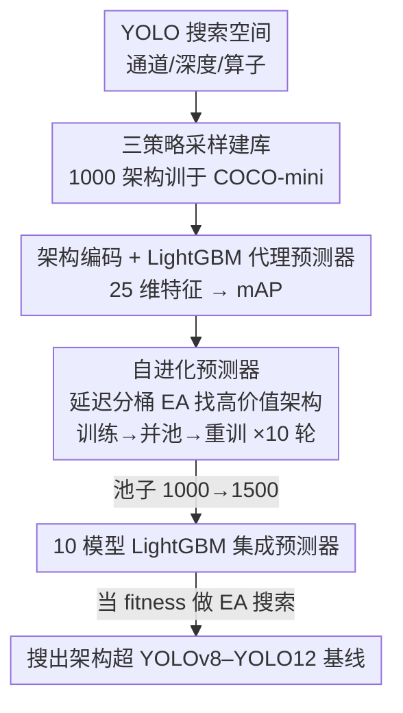

# YOLO-NAS-Bench: A Surrogate Benchmark with Self-Evolving Predictors for YOLO Architecture Search

**会议**: CVPR 2026  
**arXiv**: [2603.09405](https://arxiv.org/abs/2603.09405)  
**代码**: https://github.com/VDIGPKU/YOLO-NAS-Bench (有)  
**领域**: 目标检测 / 神经架构搜索 / NAS Benchmark  
**关键词**: YOLO, NAS Benchmark, 代理预测器, 自进化, 演化搜索

## 一句话总结
针对"目标检测做 NAS 评估代价太高、又没有现成 benchmark"的痛点，本文构建了首个面向 YOLO 检测器的代理 benchmark YOLO-NAS-Bench——在统一搜索空间里采样并完整训练 1000 个架构建库，训练 LightGBM 代理预测器，再用"自进化机制"让预测器自己去高性能区找架构补充训练池，把集成预测器的 sKT 从 0.694 提到 0.752，最终用它当 fitness 做演化搜索，搜出的架构在 COCO-mini 上同延迟下全面超过 YOLOv8–YOLO12 官方基线。

## 研究背景与动机
**领域现状**：NAS 在图像分类上已经很成熟，靠 NAS-Bench-101/201/301 这类 benchmark（查表或代理预测器）把"算法开发"和"昂贵的架构评估"解耦，让大家在统一标尺上公平比较搜索算法。

**现有痛点**：把 NAS 搬到目标检测极其昂贵——检测模型更大、COCO 这类数据集每次训练的算力需求高得多，而且搜索空间要同时考虑 backbone、neck、head。在 COCO 上完整训练一个 YOLO 架构要在多卡集群上跑好几天，而 NAS 动辄要评估上千个候选，直接训练根本不可行。

**核心矛盾**：分类领域有 benchmark 可以零成本查询架构性能，检测领域却没有——现有 NAS benchmark（101/201/301/360）几乎全是分类，搜索空间、训练流程、评估协议都没法迁移到检测；而 Det-NAS、OPANAS、YOLO-NAS 这些检测 NAS 方法又各自定义私有搜索空间和评估设置，互相之间没法公平比较。检测 NAS 缺一个统一标尺。

**本文目标**：造一个面向 YOLO 检测器的代理 benchmark，让任意 NAS 算法都能近乎零成本地查询"某个 YOLO 架构性能如何"，分解为三个子问题——定义统一搜索空间、建真值性能库、训练高保真代理预测器。

**切入角度**：用 NAS-Bench-301 的"代理预测器"思路（而非穷举查表），因为 YOLO 搜索空间组合数达百万级、不可能穷举训练；同时观察到 NAS 真正关心的是**高性能架构之间的排序**，而均匀采样训练出的预测器恰恰在高性能区欠拟合——这是切入点。

**核心 idea**：用"自进化机制"让预测器自己去发现并评估高价值架构、把训练分布逐步对齐到高性能前沿，从而在最关键的 top 区把排序学准。

## 方法详解

### 整体框架
YOLO-NAS-Bench 是一条"建库 → 训预测器 → 自进化精炼 → 演化搜索验证"的流水线。输入是一个 YOLO 风格的架构搜索空间，输出是一个能零成本查询任意架构 mAP 的高保真代理预测器（以及用它搜出的优于官方基线的架构）。具体地：先在 backbone+neck 上定义涵盖**通道宽度、块深度、算子类型**三维的搜索空间；用三种互补策略采样 1000 个架构、在 COCO-mini 上从头完整训练得到 {架构, mAP} 真值库；把每个架构编码成 25 维特征向量训练 LightGBM 代理预测器；再用**自进化预测器**循环——让当前预测器引导"按延迟分桶的演化搜索"去发现高价值架构、训练后并入池子、重训预测器，循环 10 轮把池子从 1000 扩到 1500；最后用 10 个 LightGBM 模型集成得到最终预测器，并把它当 fitness 做演化搜索验证实用性。

### 关键设计

**1. YOLO 导向的三维搜索空间：让 benchmark 覆盖 v8–v12 的核心模块**

要做"统一标尺"，搜索空间必须既覆盖现代 YOLO 的关键模块、又不至于爆炸到无法采样。本文固定检测头，只在 backbone 和 neck 上搜三个维度：**通道宽度**（backbone 四个 stage S2–S5 各自独立选通道数，候选集随 stage 加深而变宽，呼应特征金字塔自然变宽的规律，如 S2∈{128,192,256}、S5∈{768,1024,1280}）；**块深度**（每个 stage 内重复块数可搜，控制各分辨率层的表征容量）；**算子类型**（同时管 stage 内的特征提取模块和 stage 间的下采样算子）。特征提取候选 {C2f, C3k2, C2fCIB, A2C2f} 正好是 YOLOv8 到 YOLO12 跨代的核心积木——从轻量卷积 C2f、到重参数化的 C3k2/C2fCIB、再到注意力增强的 A2C2f；下采样候选 {Conv, SCDown}。backbone 里算子调色板随分辨率降低逐级变宽（S2/S3 只选 {C2f,C3k2}，S4 加 C2fCIB，S5 再加 A2C2f），neck 则固定通道和深度、只搜算子（N1–N4 共享一个全局算子选择、D1–D2 共享一个下采样选择）以抑制空间膨胀。所有维度组合后约百万量级，给 NAS 算法评估提供足够丰富的地形。

**2. 三策略互补采样 + 统一训练协议：建一个无偏的真值性能库**

代理预测器的上限取决于训练数据的代表性，单一采样会让某些尺度欠采。本文用三种互补策略采 1000 个架构：随机采样（200 个）给均匀的基线覆盖；分层采样（400 个）按参数量分箱、箱内均匀抽，保证轻量和重量级架构都不被低估；拉丁超立方采样 LHS（400 个）在每个搜索维度独立做分层、最大化高维离散空间的填充覆盖。三者互补——随机管广度、分层防尺度欠采、LHS 给近最优的空间填充。这 1000 个架构全部在 **COCO-mini**（按类别和框尺寸分层抽样的 COCO 10% 子集，保留 80 类和原始分布）上从头训练、用统一协议（120 epoch、batch 128、640×640、Mosaic/MixUp/Copy-Paste 增广，不用预训练），mAP 取最后一个 epoch，构成 benchmark 地基。

**3. 自进化预测器：让预测器自己去高性能前沿补数据、把排序学准**

这是核心创新，针对"均匀采样训练的预测器在高性能区欠拟合、而 NAS 恰恰最关心 top 区排序"这个分布错配。机制是一个自进化循环（见 Fig. 3）：先把 1000 个初始架构观测到的**延迟范围均分成 10 个桶**，保证循环在每个延迟工作点都去找高性能架构、而不是只盯一个尺度；每个桶内均匀采一个目标延迟，跑**演化算法 EA**——以"当前预测器预测的 mAP"为 fitness、"实测延迟"为约束（EA 跑 100 代、种群 50、选 top 25% 为父代、交叉 50%/变异 50%（变异率 0.2）、top 10% 精英保留），每桶取 top 5、一轮共产出 50 个新架构。这 50 个新架构在同一协议下完整训练拿到真值 mAP、并入池子、重训预测器；如此循环 10 轮，池子从 1000 长到 1500。关键在于每轮新增的架构都**偏向当前预测器认为有前途的高性能区**，逐步缩小"预测器训练分布"和"真实 NAS 搜索分布"之间的鸿沟。最后用 10 个不同随机种子的 LightGBM 做**集成**（取 10 个模型预测的算术均值），降方差、稳排序。

**4. 紧凑架构编码 + LightGBM + sKT 评估：树模型最适配这种离散搜索空间**

每个架构配置编码成 **25 维特征向量**：通道宽度和块深度用标量表示，算子选择用 one-hot 编码——这样树模型能对每个算子独立分裂、不会被人为强加的序关系干扰。预测器选 LightGBM 梯度提升树，从 25 维编码回归到 mAP$_{50\text{-}95}$，用 RMSE 当 loss。评估沿用 NAS-Bench-301 的两个指标：**$R^2$** 衡量整体回归质量；**Sparse Kendall Tau（sKT）**衡量排序一致性——它是把预测值四舍五入到 0.1% 精度后再算的 Kendall $\tau$ 秩相关，这样能折扣掉因微小预测噪声造成的排序抖动，公式为 $\mathrm{sKT}=\tau(\mathbf{y},\,\lfloor\hat{\mathbf{y}}\rceil_{0.001})$。消融显示 LightGBM 在树模型里 $R^2$/sKT 平衡最好，MLP 则严重失败（$R^2$ 仅 0.053），印证树模型最适配这种高维离散、含 one-hot 算子的搜索空间。

### 损失函数 / 训练策略
代理预测器用 RMSE 训练，在留出的 20% 验证集上报 $R^2$ 和 sKT。架构真值训练用统一配置：120 epoch、batch 128、640×640、初始 lr 0.01（第 100 epoch 步进衰减）、Mosaic 1.0 / MixUp 0.15 / Copy-Paste 0.5、从头训练不用预训练。延迟在单张 NVIDIA P40 上以 batch 1、640×640 FP32 输入、10 次预热 + 50 次计时前向测得，取平均推理毫秒数。

## 实验关键数据

### 主实验

**预测器质量（自进化前后对比，验证集 20%）**

| 设置 | #架构 | $R^2$ | sKT |
|------|------|-------|-----|
| 自进化前 | 1,000 | 0.770 | 0.694 |
| 自进化后 | 1,500 | **0.815** | **0.752** |

自进化让 $R^2$ 从 0.770 升到 0.815（+4.5%）、sKT 从 0.694 升到 0.752（+5.8%）。sKT 0.752 表示强排序一致性，$R^2$ 0.815 说明预测器抓住了架构性能的大部分方差，是真值性能地形的高保真代理。

**预测器引导的 EA 搜索 vs YOLO 官方基线（COCO-mini，P40 延迟）**

| 模型 | S: mAP/Lat | M: mAP/Lat | L: mAP/Lat | X: mAP/Lat |
|------|-----------|-----------|-----------|-----------|
| **Ours** | **31.9**/16.85 | **32.7**/21.00 | **33.4**/27.09 | **33.6**/35.00 |
| YOLO12 | 27.2/20.40 | 30.4/22.17 | 30.8/42.51 | 32.9/54.13 |
| YOLO11 | 27.7/15.30 | 30.8/20.03 | 32.1/29.84 | 32.8/37.73 |
| YOLOv10 | 25.8/15.89 | 29.7/20.01 | 30.1/25.83 | 30.5/36.84 |
| YOLOv9 | 27.1/19.25 | 31.6/25.59 | 31.6/26.85 | 32.3/53.07 |
| YOLOv8 | 26.2/10.95 | 29.4/17.21 | 30.8/23.30 | 32.9/33.71 |

预测器搜出的四个架构在全延迟谱上 Pareto 压制所有 v8–v12 官方基线：小模型区优势最明显，Ours-s 在相当延迟下比 YOLO11s 高 +4.2% mAP；大模型区 Ours-x 比 YOLO12x mAP 更高、速度还快 1.5×。这说明预测器不仅在留出数据上排序相关性高，在 top 区也有强判别力——它看好的架构完整重训后确实更优。

### 消融实验

**预测器类型对比（初始 1000 架构，无集成，同 split）**

| 预测器 | $R^2$ | sKT |
|--------|-------|-----|
| LightGBM | 0.768 | 0.699 |
| XGBoost | 0.758 | 0.696 |
| NGBoost | 0.755 | 0.704 |
| Random Forest | 0.744 | 0.678 |
| MLP | 0.053 | 0.440 |

**自进化 vs 随机扩池（同池大小 1200，验证集 20%）**

| 扩池策略 | #架构 | $R^2$ | sKT |
|---------|------|-------|-----|
| 初始（不扩） | 1,000 | 0.770 | 0.694 |
| 随机 +200 | 1,200 | 0.776 | 0.701 |
| 自进化 +200 | 1,200 | **0.798** | **0.738** |

### 关键发现
- **增益来自"靶向高性能区"而非单纯加数据**：把池子同样扩到 1200，随机扩池只到 sKT 0.701，自进化扩池到 0.738，差出 +0.022 $R^2$/+0.037 sKT——证明提升源于自进化对高性能架构的定向富集，而非数据量本身。
- **树模型完胜 MLP**：在高维离散、算子 one-hot 的搜索空间上，LightGBM/XGBoost/NGBoost 的 sKT 都在 0.7 附近，MLP 的 $R^2$ 仅 0.053、sKT 0.440 几乎不可用，印证 benchmark 用树模型当代理是对的。
- **延迟分桶保证全谱覆盖**：把延迟均分 10 桶分别搜，让自进化在每个延迟工作点都补到高性能架构，最终主实验四个尺度（S/M/L/X）全面胜出，没有出现只在某一档强的偏科。

## 亮点与洞察
- **"预测器自己造训练数据"的闭环很巧**：传统 NAS benchmark 一次性采样建库就定型，本文让预测器用自己的判断去高性能前沿挖架构、训练后回灌重训，把"预测器最该学准的区域"和"它的训练分布"对齐，是一种针对 NAS 痛点的主动学习/分布对齐思路。
- **抓住了 NAS 评估的本质——top 区排序**：很多人只看整体 $R^2$，本文强调高性能架构间的排序才是 NAS 真正用得上的，并用 sKT（折扣噪声后的 Kendall τ）专门度量，自进化机制就是冲着这个指标设计的。
- **延迟不建代理、坚持实测**：作者刻意不为延迟建代理预测器，因为延迟跨硬件平台差异大、代理会引入误差；只对 mAP 建代理、延迟实测，是对"benchmark 可信度"的务实取舍，可迁移到任何需要跨硬件部署的 NAS 场景。
- **可复用的搜索空间设计法**：把"跨代核心模块"（C2f→C3k2→C2fCIB→A2C2f）按分辨率梯度地放进算子调色板，既覆盖了 v8–v12 的演化、又控制了空间规模，这种"用模块演化史定义搜索空间"的思路可借鉴到其他模型族。

## 局限性 / 可改进方向
- **作者承认的局限**：benchmark 建在 COCO-mini（COCO 的 10%）上、延迟只在单张 P40 上测；用此 benchmark 做 NAS 时仍需对每个架构实测延迟（没建延迟代理）。后续计划扩到全量 COCO、多样硬件（边缘 GPU、移动 NPU）和更多任务（实例分割、姿态估计）。
- **自己发现的局限**：① COCO-mini 上的 mAP 排序是否能无偏迁移到全量 COCO 上的排序，文中没验证——若两者排序不一致，benchmark 的结论可能在真实场景打折。② 自进化只跑了 10 轮、池子 1000→1500，sKT 0.694→0.752 的增益曲线是否还会继续上升、何时饱和未给出，难判断"再多轮是否值得"。③ 搜索空间固定了检测头、neck 通道/深度，head 和 neck 容量这些维度被排除在 benchmark 之外，对依赖 head 设计的 NAS 算法覆盖不全。
- **改进思路**：可补一个"COCO-mini 排序 vs 全 COCO 排序"的一致性验证；把自进化轮数/池子规模的增益曲线画出来给出停止准则；在 benchmark 里发布每个架构的中间训练曲线，支持 early-stopping 类多保真 NAS 算法。

## 相关工作与启发
- **vs NAS-Bench-301**: 都用代理预测器（而非查表）覆盖大搜索空间、都用 sKT 评估，本文继承了这套协议；区别在 301 面向分类 DARTS 空间，本文首次把它落到 YOLO 检测空间，并额外加了自进化机制主动富集高性能数据。
- **vs YOLOBench**: YOLOBench 只刻画一组固定的 YOLO 模型族、无法当 NAS 算法评估的标尺；本文是可搜索的代理 benchmark，任意 NAS 算法都能查询任意架构。
- **vs Det-NAS / OPANAS / YOLO-NAS**: 这些检测 NAS 方法各自定义私有搜索空间、训练配方和评估设置，互相没法公平比较；本文提供共享搜索空间 + 预算真值库 + 校准代理预测器，把"算法开发"和"昂贵评估"解耦，让检测 NAS 有了统一标尺。

## 评分
- 新颖性: ⭐⭐⭐⭐ 首个面向 YOLO 检测器的代理 NAS benchmark，自进化预测器是对"NAS 关心 top 区排序"痛点的针对性创新。
- 实验充分度: ⭐⭐⭐ 预测器质量、搜索实用性、预测器类型、自进化 vs 随机扩池都验证了，但只在 COCO-mini/单 GPU 上、缺向全 COCO 的排序迁移性验证。
- 写作质量: ⭐⭐⭐⭐ 流水线讲得清楚，指标定义（sKT 公式）和搜索空间表格交代到位。
- 价值: ⭐⭐⭐⭐ 给检测 NAS 社区补上了缺失的统一标尺，代码开源，工具属性强、可被后续算法直接复用。

<!-- RELATED:START -->

## 相关论文

- [\[CVPR 2026\] Does YOLO Really Need to See Every Training Image in Every Epoch?](does_yolo_really_need_to_see_every_training_image_in_every_epoch.md)
- [\[AAAI 2026\] YOLO-IOD: Towards Real Time Incremental Object Detection](../../AAAI2026/object_detection/yolo-iod_towards_real_time_incremental_object_detection.md)
- [\[ICCV 2025\] YOLO-Count: Differentiable Object Counting for Text-to-Image Generation](../../ICCV2025/object_detection/yolo-count_differentiable_object_counting_for_text-to-image_generation.md)
- [\[CVPR 2026\] Beyond Semantic Search: Towards Referential Anchoring in Composed Image Retrieval](beyond_semantic_search_towards_referential_anchoring_in_composed_image_retrieval.md)
- [\[CVPR 2026\] EW-DETR: Evolving World Object Detection via Incremental Low-Rank DEtection TRansformer](ew-detr_evolving_world_object_detection_via_incremental_low-rank_detection_trans.md)

<!-- RELATED:END -->
