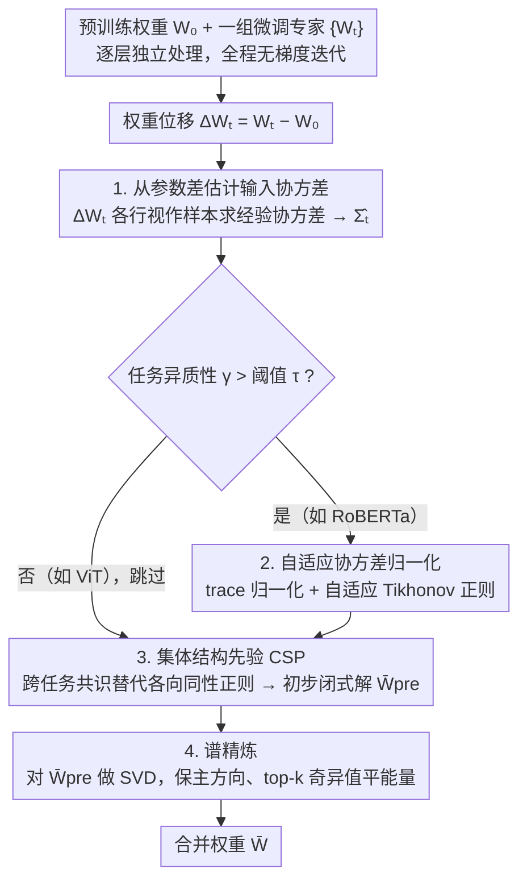

# ACE-Merging: Data-Free Model Merging with Adaptive Covariance Estimation

**会议**: CVPR 2026  
**arXiv**: [2603.02945](https://arxiv.org/abs/2603.02945)  
**代码**: 无  
**领域**: 优化  
**关键词**: 模型合并, 数据无关, 协方差估计, 谱精炼, 闭式解

## 一句话总结
本文从理论上证明了微调参数差蕴含输入协方差信息，据此提出 ACE-Merging，通过自适应协方差估计、集体结构先验和谱精炼三步实现无数据闭式模型合并，在 GPT-2 上比之前方法平均提升 4%，在 RoBERTa-Base 上提升 5%。

## 研究背景与动机

**领域现状**：预训练+微调产生大量任务专用模型，模型合并(Model Merging)旨在将多个专家模型融合为一个统一模型，避免昂贵的多任务重训。现有方法分三类：数据依赖(需原始数据)、测试时自适应(推理开销大)、数据无关(最灵活)。

**现有痛点**：数据无关方法最具实用价值，但从 Task Arithmetic 到 TIES-Merging 等都只是参数空间的启发式操作（符号对齐、剪枝等），只处理干扰的"症状"而未触及根本原因——任务数据分布的统计结构差异。

**核心矛盾**：最优合并公式 $\bar{W} = (\sum_t W_t \Sigma_t)(\sum_t \Sigma_t)^{-1}$ 需要每个任务的输入协方差 $\Sigma_t$，但数据无关设定下恰恰无法获取这些统计量。

**本文目标** 如何在完全不访问数据的情况下，准确估计每个任务的输入协方差，从而实现有理论保障的最优合并。

**切入角度**：作者发现微调产生的权重位移 $\Delta W_t$ 的行之间隐含了输入协方差信息——将 $\Delta W_t$ 的行视为独立样本，其经验协方差正比于 $\Sigma_t$。

**核心 idea**：微调参数差本身就编码了输入协方差，无需任何数据即可估计并构造理论最优的闭式合并解。

## 方法详解

### 整体框架
ACE-Merging 的出发点是一个早已知道的"理想"合并公式 $\bar{W} = (\sum_t W_t \Sigma_t)(\sum_t \Sigma_t)^{-1}$：它用每个任务的输入协方差 $\Sigma_t$ 作权重做加权平均，理论上最优，唯一的障碍是数据无关设定下拿不到 $\Sigma_t$。本文的整条 pipeline 就是为了"凭空"补出这个协方差，再把它喂进闭式解。给定预训练权重 $W_0$ 和一组微调专家 $\{W_t\}$，方法逐层独立处理：先从权重位移 $\Delta W_t = W_t - W_0$ 反推出每个任务的协方差估计，再根据任务间的尺度差异自适应地归一化，接着加一个跨任务共享的结构先验得到初步闭式解，最后用谱精炼修掉解里的病态分量，输出合并权重 $\bar{W}$。全程没有任何梯度迭代。

### 关键设计

**1. 从参数差估计输入协方差：把"没有数据"的死结转成可计算的量**

数据无关合并的根本障碍是拿不到 $\Sigma_t$，而本文的理论核心（Theorem 1）正是证明 $\Sigma_t \propto \text{Cov}_{\mathcal{D}_t}[\Delta W_t]$——微调留下的权重位移里本就编码了输入的二阶统计。直觉上，因为微调更新量小，可在 $W_0$ 处把梯度线性化，得到 $\Delta W_t \approx -2\eta N_t \,\mathbb{E}[(W_0 x - y)x^\top]$，位移与输入外积 $x x^\top$ 直接挂钩。落到操作上，把 $\Delta W_t$ 的每一行当作一个独立样本，算它的经验协方差即可：

$$\hat{\Sigma}_t \propto (\Delta W_t - \mathbf{1}\mu_t^\top)^\top (\Delta W_t - \mathbf{1}\mu_t^\top)$$

这一步是整个方法的地基，它把"数据无关合并"从无从下手的启发式问题，变成了有显式估计目标、可走闭式解的问题。它也顺带统一解释了前人：WUDI-Merging 其实隐式用了一个类似代理 $\hat{\Sigma}_t \propto \|\Delta W_t\|_F^{-2} (\Delta W_t)^\top \Delta W_t$，只是它靠迭代梯度下降求解、不稳定，而本文把这个量摆到台面上、直接闭式用掉。

**2. 自适应协方差归一化：让能量大的任务别一家独大**

直接把各任务的 $\hat{\Sigma}_t$ 加进合并公式有个隐患——不同任务的 $\Delta W_t$ 能量尺度差异可能很大，能量高的任务会主导最终结果。本文先用一个异质性度量把这种差异量化出来：$\gamma = \frac{\text{Var}_t[\log\|\Delta W_t\|_F^2]}{(\mathbb{E}_t[\log\|\Delta W_t\|_F^2])^2}$，即各任务位移能量（取对数后）的相对方差，$\gamma$ 越大说明任务间越不齐次。只有当 $\gamma$ 超过阈值 $\tau$ 时才触发归一化：先做 trace 归一化把每个协方差的总能量拉平 $\hat{\Sigma}_{t,\text{scaled}} = \hat{\Sigma}_t / \text{Tr}(\hat{\Sigma}_t)$，再加一个随尺度自适应的 Tikhonov 正则 $\hat{\Sigma}_{t,\text{reg}} = \hat{\Sigma}_{t,\text{scaled}} + \frac{\epsilon}{\text{Tr}(\hat{\Sigma}_t)} I$ 稳住求逆。$\gamma$ 在这里就是一个门控开关：实测 RoBERTa 的异质性（$\gamma > 0.3$）远高于 ViT（$\gamma < 0.25$），对本就齐次的 ViT 任务做归一化纯属画蛇添足，门控让方法自动跳过这一步。

**3. 集体结构先验（CSP）：用跨任务共识替代各向同性的正则**

上一步的 $\epsilon I$ 正则对所有特征维度一视同仁，是各向同性的，等于无视了输入空间真实的几何结构。CSP 的做法是把所有任务缩放后协方差的列均值广播到每一行，构造一个低秩的共识先验：$\mathbf{C}_{\text{agg}} = \mathbf{1} \cdot (\frac{1}{d_{\text{in}}} \mathbf{1}^\top \sum_t \hat{\Sigma}_{t,\text{scaled}})$，把它替到正则位置，得到初步闭式解：

$$\bar{W}_{\text{pre}} = \Big(\sum_t W_t \hat{\Sigma}_{t,\text{reg}}\Big)\Big(\sum_t \hat{\Sigma}_{t,\text{reg}} + \mathbf{C}_{\text{agg}}\Big)^{-1}$$

和均匀的 $\epsilon I$ 比，$\mathbf{C}_{\text{agg}}$ 携带了"哪些维度是各任务共同看重的"这一信息，于是正则会选择性地加固这些共享的重要方向，而不是无差别地压所有维度。

**4. 谱精炼：方向是对的、能量分错了，就只重排能量**

初步闭式解 $\bar{W}_{\text{pre}}$ 有个严重的谱病态：实测它的 top 5% 奇异值就占了 99% 以上能量，条件数高达 $8.7\times 10^5$。但关键观察是——它的主方向其实是对的（和最终解的余弦相似度≈1），坏的只是能量在奇异值上的分配。于是不必推翻重算，只需保留方向、把能量摊平。具体是先算结构残差 $\Delta_{\text{res}} = \sum_t W_t (\hat{\Sigma}_{t,\text{scaled}} - \bar{\Sigma})$，与 $\bar{W}_{\text{pre}}$ 融合后做 SVD，对 top-$k$ 个奇异方向统一换成它们的均值奇异值 $\sigma_{\text{iso}}$ 重新加权：

$$\Delta W_{\text{refine}} = \sigma_{\text{iso}}\, \mathbf{U}_{:,1:k} \mathbf{V}_{:,1:k}^\top, \qquad \bar{W} = \bar{W}_{\text{pre}} + \Delta W_{\text{refine}}$$

这种"保方向、平能量"的修法既消除了病态，又没破坏前几步辛苦估出来的几何结构，是消融里最终把性能顶上去的那一刀。

### 损失函数 / 训练策略
ACE-Merging 是纯闭式方法，不涉及任何训练/优化迭代。超参固定为 $\tau=0.3$, $k_{\text{frac}}=0.3$，$\epsilon$ 按模型族调整（GPT-2: $4\times 10^{-2}$, RoBERTa-Base: $2\times 10^{-4}$, 其余: $1\times 10^{-5}$）。

## 实验关键数据

### 主实验

**视觉任务 (ViT-B/16, 平均绝对准确率 %)**

| 任务数 | Weight Avg | Task Arithmetic | CART | TSV-M | ACE-Merging | 提升 |
|--------|-----------|----------------|------|-------|-------------|------|
| 8 tasks | 72.2 | 75.4 | 88.3 | 89.0 | **90.6** | +1.6 |
| 14 tasks | 69.5 | 70.5 | 84.1 | 84.6 | **86.1** | +1.5 |
| 20 tasks | 65.3 | 65.8 | 80.5 | 80.6 | **82.1** | +1.5 |

**语言任务 (GPT-2, GLUE Avg %)**

| 方法 | CoLA | MNLI | MRPC | QNLI | QQP | RTE | SST-2 | Avg |
|------|------|------|------|------|-----|-----|-------|-----|
| Task Arithmetic | 68.7 | 68.6 | 69.6 | 70.5 | 81.8 | 47.3 | 83.6 | 70.0 |
| TSV-M | 65.6 | 75.4 | 58.6 | 64.4 | 86.2 | 55.6 | 85.7 | 70.2 |
| **ACE-Merging** | 70.3 | 69.9 | 71.8 | 76.7 | 79.0 | 62.5 | 88.5 | **74.1** |

### 消融实验

| 配置 | RoBERTa-L | GPT-2 | ViT-B/16 (8tasks) | 说明 |
|------|-----------|-------|-------------------|------|
| E1: Basic Closed-form | 80.05 | 68.72 | 89.91 | 仅闭式解 |
| E2: + Adaptive ε | 88.04 | 71.50 | 89.91 | 自适应正则贡献最大 |
| E3: + Aggregate Prior | 86.79 | 71.51 | 90.60 | 结构先验辅助 |
| E4: + Spectral Refinement | **91.68** | **74.09** | **90.60** | 谱精炼最终提升 |

### 关键发现
- 自适应正则化贡献最大——在 RoBERTa-L 上从 E1 到 E2 提升了近 8 个百分点，说明任务异质性平衡是核心瓶颈
- ViT 因任务异质性低($\gamma < 0.3$)自动跳过自适应和谱精炼阶段（E1≈E2, E3≈E4），验证了 $\gamma$ 门控机制的合理性
- 超参敏感性分析显示 $\gamma \in [0.1, 0.3]$, $k_{\text{frac}} \in [0.1, 0.5]$ 范围内性能稳定，$\epsilon$ 更敏感
- RoBERTa-Base 上 ACE-Merging (90.4%) 大幅超越 WUDI-Merging (85.3%)，在 RoBERTa-Large 上也保持 ~3% 优势

## 亮点与洞察
- **理论洞察极为优雅**：将数据无关合并的根本障碍（缺少协方差）转化为可从参数差直接估计的量，建立了"微调权重差 ↔ 输入协方差"的形式化联系。这一视角不仅解释了 ACE-Merging 为何有效，还统一解释了先前方法——Weight Averaging 假设 $\Sigma_t = kI$，WUDI-Merging 隐式用 $\|\Delta W_t\|_F^{-2} (\Delta W_t)^\top \Delta W_t$ 作代理
- **闭式解 vs 迭代解**：WUDI-Merging 需要梯度下降迭代，而 ACE-Merging 是真正的 closed-form，计算效率高且稳定性更好
- **谱精炼的观察很巧妙**：发现初始闭式解方向正确但能量分布极端失衡（top 5% 奇异值占 99% 能量），因此只需保留方向重分配能量。这个"方向正确、幅度错误"的诊断思路可迁移到其他矩阵优化问题

## 局限与展望
- $\epsilon$ 需要按模型族手动设定（GPT-2、RoBERTa、ViT 各不同），作者也承认自动估计 $\epsilon$ 是未来方向
- 线性近似 $f(W,x) \approx Wx$ 在深层非线性网络中可能不够精确，特别是对注意力层
- "将 $\Delta W_t$ 的行视为独立样本"这一假设在实际中未必成立——权重矩阵的行间存在结构性相关
- 仅在 GLUE 和视觉分类任务上验证，未测试生成任务（如 LLM 对话、代码生成）
- 合并时逐层独立操作，忽略了跨层间的依赖关系

## 相关工作与启发
- **vs WUDI-Merging**: 本文在理论框架下将 WUDI 重新解释为 ACE 的特例（norm-weighted 协方差代理），且 ACE 用闭式解替代 WUDI 的迭代优化，更稳定高效
- **vs TSV-M**: TSV-M 用 SVD 分解共享/任务特定子空间，属于启发式；ACE 直接建模协方差，理论基础更扎实
- **vs RegMean**: RegMean 是数据依赖方法直接用真实协方差，ACE 证明了无需数据也能估计协方差并达到可比性能
- 协方差估计+谱修正的思路可推广到联邦学习中的模型聚合问题

## 评分
- 新颖性: ⭐⭐⭐⭐ 理论贡献优雅但核心 insight（参数差 ∝ 协方差）并非完全意外
- 实验充分度: ⭐⭐⭐⭐⭐ 视觉+语言、多架构多尺度、完整消融和敏感性分析
- 写作质量: ⭐⭐⭐⭐⭐ 逻辑链清晰，理论→统一框架→方法→实验层层推进
- 价值: ⭐⭐⭐⭐ 数据无关合并的实用工具，但 $\epsilon$ 需手调降低了开箱即用性

<!-- RELATED:START -->

## 相关论文

- [\[CVPR 2026\] Model Merging in the Essential Subspace](model_merging_in_the_essential_subspace.md)
- [\[CVPR 2026\] Label-Free Cross-Task LoRA Merging with Null-Space Compression](label-free_cross-task_lora_merging_with_null-space_compression.md)
- [\[CVPR 2026\] BD-Merging: Bias-Aware Dynamic Model Merging with Evidence-Guided Contrastive Learning](bd-merging_bias-aware_dynamic_model_merging_with_evidence-guided_contrastive_lea.md)
- [\[CVPR 2026\] Defending Unauthorized Model Merging via Dual-Stage Weight Protection](defending_unauthorized_model_merging_via_dual-stage_weight_protection.md)
- [\[CVPR 2026\] DC-Merge: Improving Model Merging with Directional Consistency](dc-merge_improving_model_merging_with_directional_consistency.md)

<!-- RELATED:END -->
