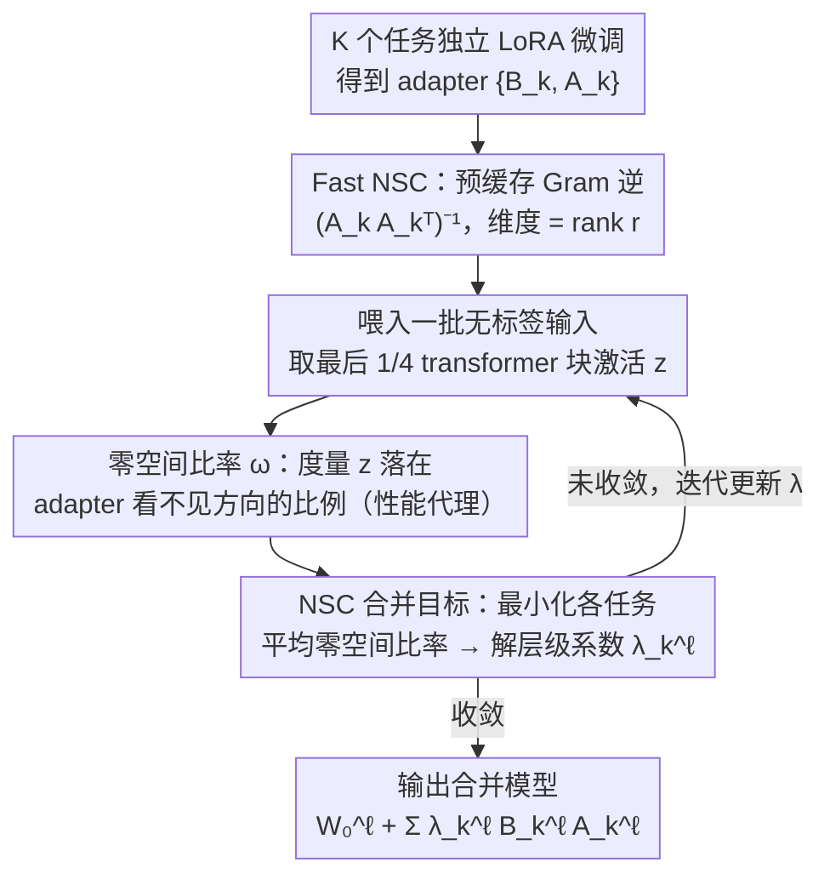

# Label-Free Cross-Task LoRA Merging with Null-Space Compression

**会议**: CVPR 2026  
**arXiv**: [2603.26317](https://arxiv.org/abs/2603.26317)  
**代码**: [GitHub](https://github.com/wonyoung01/nsc_merging)  
**领域**:优化
**关键词**: 模型合并, LoRA, 零空间压缩, 无标签, 跨任务

## 一句话总结

观察到LoRA微调过程中下投影矩阵A的零空间比率随训练下降且与性能强相关，据此提出NSC Merging，一种无标签、任务无关的LoRA合并方法，在20个异构视觉任务、6个NLI任务和VLM评估上达到SOTA。

## 研究背景与动机

模型合并（Model Merging）将独立微调的检查点组合为单一多任务模型，无需联合训练。在基础模型时代，LoRA微调已成为标准，使LoRA合并成为一个重要方向。

现有梯度引导的合并方法（如AdaMerging）使用输出熵最小化作为代理目标来估计合并权重，在分类任务上效果好，但面临两个根本限制：
1. **不适用于回归任务**：熵的定义仅对分类有意义，深度估计、表面法线预测等回归任务无法使用
2. **对LLM/VLM不可扩展**：熵需要在每个生成token处计算，成本随序列长度线性增长

核心矛盾：需要一个既适用于分类又适用于回归、且不依赖输出logits的合并信号。

本文关键观察：LoRA微调期间，下投影矩阵 $\mathbf{A}$ 的零空间被系统性地压缩——即越来越多的输入激活落入adapter的投影子空间中。这种**零空间压缩**与任务性能强负相关，可作为任务无关的合并信号。

## 方法详解

### 整体框架

NSC Merging 要解决的问题是：把 $K$ 个独立 LoRA 微调出的 adapter 合并成一个多任务模型，且合并系数的搜索不能依赖任务标签或输出 logits（否则回归任务和长序列 LLM 都用不了）。整条流水线从已训好的 adapter 出发：先为每个任务独立 LoRA 微调得到 $\{B_k, A_k\}$，再对每个 adapter 预计算一个只跟 LoRA rank 相关的小矩阵 $(A_kA_k^\top)^{-1}$（**Fast NSC** 的缓存）；随后把一批无标签输入喂进模型，以**零空间比率**为代理信号、以**平均零空间比率最小化**为目标去优化每层每任务的合并系数 $\{\lambda_k^\ell\}$，迭代收敛后输出合并模型 $W_0^\ell + \sum_k \lambda_k^\ell B_k^\ell A_k^\ell$。整个过程只看输入激活的几何关系，不看模型预测对不对，这是它能同时覆盖分类、回归和生成任务的根本原因。

### 关键设计

**1. 零空间比率：把 LoRA 的训练动力学变成性能代理信号**

梯度引导合并的老办法（AdaMerging）靠输出熵判断合并好不好，但熵只对分类有意义、还得逐 token 算。本文换了一个完全输入侧的信号：对 LoRA 更新 $\Delta W = BA$，下投影矩阵 $A_k^\ell$ 的零空间 $\mathcal{N}(A_k^\ell)$ 是那些被 adapter 直接丢弃的输入方向，于是定义零空间比率

$$\omega_k^\ell(\mathbf{z}) = \frac{\|\text{Proj}_{\mathcal{N}(A_k^\ell)}(\mathbf{z})\|_2}{\|\mathbf{z}\|_2}$$

它度量一个输入激活 $\mathbf{z}$ 中有多大比例落在 adapter 看不见的方向上。作者观察到训练过程中这个比率会被系统性压低——adapter 逐渐把更多任务相关的激活拉进自己的投影子空间，而且 $\omega$ 与任务性能呈强负相关，分类和回归都成立。之所以这个信号靠谱：LoRA 的 rank 很小（如 16 维对 768 维），adapter 子空间仅覆盖约 2.1% 的特征空间，零空间被压缩意味着这点有限容量被花在了刀刃上，因此能反过来推断性能好坏，且全程不碰输出 logits。

**2. NSC 合并目标：用平均零空间比率无标签地学层级系数**

有了代理信号，合并系数的搜索就变成最小化所有任务在合并模型下的平均零空间比率：

$$\min_{\{\lambda_k^\ell\}} \frac{1}{K}\sum_{k=1}^K \mathbb{E}_{\mathbf{x} \sim \mathcal{D}_k}\big[\Omega_k(\mathbf{x}; \Theta_{merge})\big]$$

其中 $\Omega_k$ 是任务 $k$ 在所有目标层上的平均零空间比率，合并参数即 $W_0^\ell + \sum_k \lambda_k^\ell B_k^\ell A_k^\ell$。系数按「层 × 任务」细粒度展开（而非 Task Arithmetic 的一个全局缩放），所以能在异构任务间做更精细的权衡。由于目标只依赖 adapter 的几何结构，它对任务类型完全无所谓；对 LLM/VLM 只需输入 token 的激活即可计算，成本与序列长度脱钩，直接绕开了熵方法逐 token 累加的扩展性瓶颈。

**3. Fast NSC：用 Gram 逆缓存把每步开销从 $O(d^2)$ 压到 $O(r^2)$**

直接算零空间投影要构建整个 $\mathcal{N}(A_k^\ell)$ 的投影矩阵，维度是特征维 $d$，每步迭代都重算成本很高。本文把比率等价改写成只含小矩阵的形式：

$$\omega_k(\mathbf{z}) = \sqrt{1 - \frac{\mathbf{z}^\top A_k^\top(A_kA_k^\top)^{-1}A_k\mathbf{z}}{\|\mathbf{z}\|_2^2}}$$

这里 $\mathbf{z}$ 和 $A_k\mathbf{z}$ 在前向推理时本就算过，唯一需要额外存的就是 $(A_kA_k^\top)^{-1}$——它的维度等于 LoRA rank $r$，远小于 $d$，且可以一次预缓存反复复用。瓶颈因此从全空间投影的 $O(d^2)$ 降到 $O(r^2)$（$r\ll d$）。进一步地，NSC 目标只在最后 1/4 的 transformer 块上计算：消融显示这一档几乎追平全层、却省下大量开销，而只取最后 1 层则性能明显掉，说明深层 adapter 的零空间信号最有判别力。

### 损失函数 / 训练策略

- 优化器：AdamW，lr=0.001（视觉）/ 0.0003（LLM/VLM）
- 初始化：$\lambda$ 初始化为 0.4
- 迭代：100 步（视觉）/ 500 步（LLM/VLM）
- 仅使用无标签验证集，LLM 上甚至只用 input IDs 即可

## 实验关键数据

### 主实验 — 20个异构视觉任务（ViT-B）

| 方法 | NYUD-v2 4任务 | PASCAL 5任务 | Taskonomy 11任务 | 总平均 |
|------|------------|------------|---------------|-------|
| Task Arithmetic | ~46% | ~62% | ~103% | 77.2% |
| TIES | ~47% | ~62% | ~102% | 77.3% |
| KnOTS-TIES | ~45% | ~62% | ~102% | 76.6% |
| RobustMerge | ~69% | ~85% | ~100% | 89.9% |
| **NSC (Ours)** | ~**75%** | ~**87%** | ~**100%** | **92.0%** |

（数值为归一化到单任务微调的性能百分比）

### LLM实验（LLaMA-3-8B, 6个NLI任务）

| 方法 | MNLI | QNLI | SNLI | RTE | SICK | SciTail | 平均 |
|------|------|------|------|-----|------|---------|------|
| TA | 92.8 | 86.8 | 93.3 | 93.6 | 83.8 | 95.0 | 90.9 |
| AdaMerging | 94.3 | 84.8 | 92.5 | 92.1 | 89.2 | 84.8 | 89.6 |
| RobustMerge | 94.3 | 88.1 | 93.7 | 93.6 | 83.0 | 94.5 | 91.2 |
| **NSC (Ours)** | 94.9 | 88.3 | 92.8 | 91.3 | **91.2** | **95.1** | **92.3** |

### 消融实验

| 配置 | 说明 | 效果 |
|------|------|------|
| 全层计算NSC | 计算所有LoRA层 | 效果最优但成本高 |
| 最后1/4层 | 仅最后quarter的transformer块 | 接近全层，效率大幅提升 |
| 最后1层 | 仅最后一个块 | 性能下降明显 |
| 仅使用input IDs | 不需要任何图像/文本内容 | LLM上仍然有效 |

### 关键发现

- NSC在混合分类+回归的异构任务上优势最大（NYUD-v2上+2.1%相对RobustMerge），因为其他方法在回归任务上挣扎
- AdaMerging在LLM上表现差（89.6%），因为熵计算在长序列上的计算成本导致优化不充分
- NSC的均衡性最好：不会在某些任务上过拟合而牺牲其他任务（prior methods overfit subsets of tasks的问题）
- 零空间比率在合并后模型中仍与性能相关：低比率样本准确率更高

## 亮点与洞察

- 零空间压缩是一个优雅的观察：LoRA的下投影矩阵在训练中逐渐"捕获"更多任务相关的激活，这一动力学被转化为合并信号
- 完全输入导向的方法使其自然扩展到回归和生成任务，解决了熵方法的根本局限
- Gram逆缓存技巧很实用：将计算瓶颈从 $O(d^2)$ 降为 $O(r^2)$（r<<d）
- 无标签+无输出的特性使其成为最"轻量"的梯度引导合并方法

## 局限与展望

- 仍需少量无标签数据进行优化，不是完全数据无关的
- 异构视觉任务上归一化性能仍只有92%，距离单任务微调有显著差距
- 目标层选择（最后1/4）是经验选择，不同模型可能需要不同策略
- 仅验证了ViT-B级别的视觉模型，更大规模模型（如ViT-L/H）的效果未知

## 相关工作与启发

- **vs AdaMerging**: 两者都用梯度优化合并系数，但AdaMerging用输出熵（限于分类、随序列长度扩展），NSC用零空间比率（任务无关、输入导向）
- **vs KnOTS**: KnOTS将adapter投影到共享子空间再合并SVD成分，更关注adapter对齐而非合并权重优化
- **vs Task Arithmetic**: TA使用全局缩放因子，在异构任务上表现很差（77.2%），NSC的层级系数细粒度控制显著更好

## 评分

- 新颖性: ⭐⭐⭐⭐ 零空间压缩观察新颖且有力，从LoRA结构推导合并信号的思路很自然
- 实验充分度: ⭐⭐⭐⭐⭐ 20个视觉任务+6个NLI+VLM评估，11个基线，消融充分
- 写作质量: ⭐⭐⭐⭐ 动机和方法推导清晰，实验展示全面
- 价值: ⭐⭐⭐⭐⭐ 解决了模型合并在异构任务上的关键瓶颈，对LoRA生态有实际影响

<!-- RELATED:START -->

## 相关论文

- [\[CVPR 2026\] ACE-Merging: Data-Free Model Merging with Adaptive Covariance Estimation](ace-merging_data-free_model_merging_with_adaptive_covariance_estimation.md)
- [\[CVPR 2026\] Model Merging in the Essential Subspace](model_merging_in_the_essential_subspace.md)
- [\[CVPR 2026\] BD-Merging: Bias-Aware Dynamic Model Merging with Evidence-Guided Contrastive Learning](bd-merging_bias-aware_dynamic_model_merging_with_evidence-guided_contrastive_lea.md)
- [\[ICML 2026\] On the Convergence Rate of LoRA Gradient Descent](../../ICML2026/optimization/on_the_convergence_rate_of_lora_gradient_descent.md)
- [\[CVPR 2026\] DC-Merge: Improving Model Merging with Directional Consistency](dc-merge_improving_model_merging_with_directional_consistency.md)

<!-- RELATED:END -->
