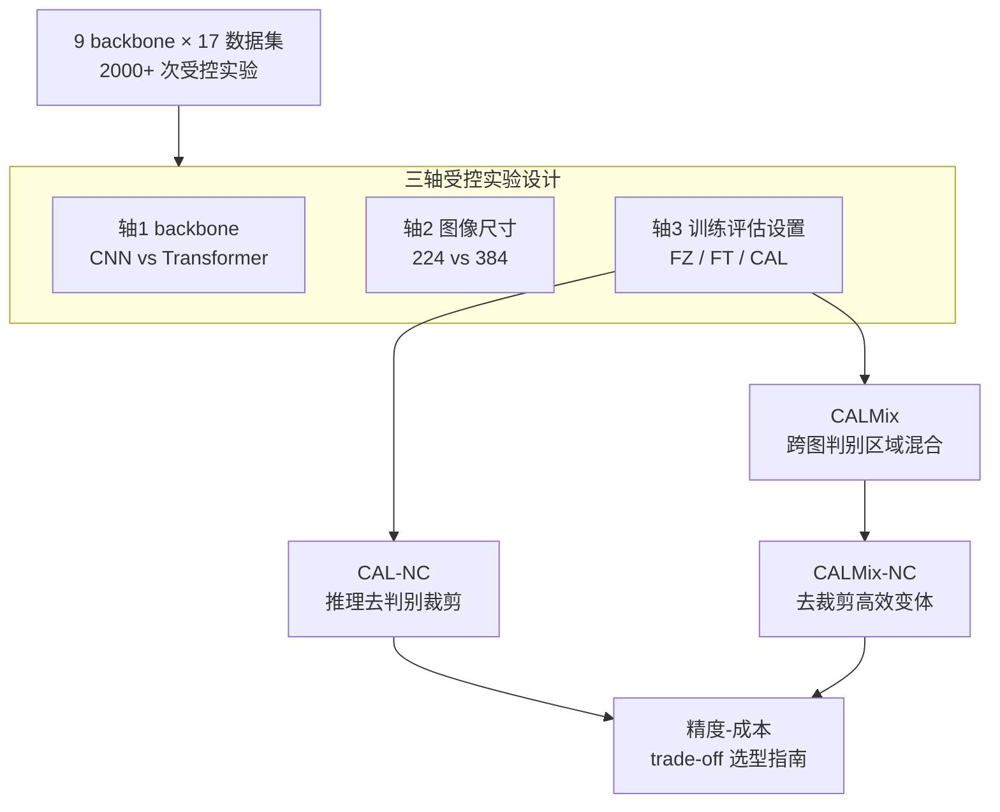

# A Large-Scale Study on the Accuracy vs Cost Trade-offs of Training and Evaluation Settings in Fine-Grained Image Recognition

**会议**: CVPR 2026  
**arXiv**: [2605.18700](https://arxiv.org/abs/2605.18700)  
**代码**: https://github.com/arkel23/FGIR-Backbones (有)  
**领域**: 细粒度图像识别(FGIR) / 实证研究 / Counterfactual Attention Learning  
**关键词**: 细粒度识别, 精度-成本权衡, 数据感知增强, 推理裁剪, 大规模基准

## 一句话总结
这是一篇关于细粒度图像识别(FGIR)的大规模实证研究——用 2000+ 次实验、跨 9 个 backbone × 17 个数据集 × 6 种训练/评估设置，系统量化了「训练评估设置越复杂、精度越高但算力成本越大」这条 trade-off 曲线；并据此提出去掉推理期判别裁剪的高效变体 CAL-NC / CALMix-NC，在精度几乎不掉的前提下把推理吞吐拉回 FT 水平。

## 研究背景与动机
**领域现状**：FGIR 要区分鸟的物种、车的型号这类「类间差异极细微」的子类别。过去十年的工作主要聚焦在「判别性特征选择模块」——各种 attention、part-based、双线性池化等结构上；近年有研究指出 backbone 架构选型本身才是 FGIR 精度与部署成本的关键决定因素。

**现有痛点**：但已有的 backbone 横评（如 Battle of the Backbones 等）几乎都是在**通用识别设置**下做的——要么 Frozen(只训分类头)、要么 Fine-Tuned(全量微调)，完全忽略了 FGIR 领域**专属**的训练策略（如基于 attention 裁剪的 CAL）会怎样改变这条精度-成本曲线。也就是说，社区知道「换 backbone 有代价」，却不知道「换训练/评估设置(Training & Evaluation Settings, TrEvS)有多大代价」。

**核心矛盾**：FGIR 里精度与算力成本天然冲突——越复杂的 backbone、越大的输入分辨率、越精细的 FGIR 专属训练（尤其是推理期要做两次前向的 attention 裁剪），都能提精度，但训练时间、推理吞吐的代价没人系统量化过。尤其 CAL 这类方法在**推理时**还要先全局前向预测判别区域、再裁剪局部二次前向，吞吐损失巨大——但这部分推理开销到底贡献了多少精度，从未被拆开测过。

**本文目标**：(1) 系统刻画 backbone × 图像尺寸 × TrEvS 三个轴对精度-成本 trade-off 的交互影响，给出实用选型指南；(2) 把 CAL 的「数据感知训练收益」和「推理裁剪开销」解耦，验证能否只保留前者。

**切入角度**：作者的关键观察是——CAL 的真正收益可能主要来自其**训练期**的数据感知增强（裁剪+掩码），而非推理期的二次前向裁剪。如果成立，就能在推理时直接砍掉裁剪。

**核心 idea**：用「训练期保留数据感知增强、推理期去掉判别裁剪」(CAL-NC)，再叠加更强的「跨图判别区域混合」增强(CALMix)，在精度几乎不掉的同时把推理成本拉回普通微调水平。

## 方法详解

### 整体框架
这篇论文本质是一份**受控实验报告 + 由实验观察催生的方法改进**。整体分两部分：前半是把 FGIR 的精度-成本 trade-off 拆成三个正交的实验轴（backbone / 图像尺寸 / 训练评估设置），用统一的归一化指标跨 9 个 backbone、17 个数据集、2000+ 次实验做受控对比；后半则由「CAL 的收益主要来自训练期增强」这一观察出发，提出去推理裁剪的 CAL-NC、跨图混合增强的 CALMix 及其高效变体 CALMix-NC。

实验协议本身也有讲究：分两阶段，先在 5 个学习率 $\{0.3, 0.1, 0.03, 0.01, 0.003\}$ 上做超参搜索、按训练集留出子集选最优 lr；再用选定 lr 做多 seed 重复实验以消除随机性。所有指标（Top-1 准确率、训练时间、批量测试吞吐）在可视化前都做 min-max 归一化 $x' = \frac{x - \min(x)}{\max(x) - \min(x)}$，以便在异构尺度间公平对比 trade-off。

### 关键设计
下面三点对应「这份研究的关键轴」与「由观察催生的方法改进」，与上图的分组及节点一一对应。

**1. 三轴受控实验设计：把 FGIR 的精度-成本曲线拆成可比较的正交轴**

针对「过去 backbone 横评只在通用设置下做、看不到 FGIR 专属策略代价」这个痛点，作者把 trade-off 的影响因素拆成三个正交轴分别消融：**轴1 backbone**——9 个跨 CNN 与 Transformer 的预训练架构（VGG-19、ResNet-101、ResNetV2-101、ResNetV2-101x3-BiT、ViT-B/16、Swin-B、ConvNeXt-B、VAN-B3 等），在全部 17 个数据集上比；**轴2 图像尺寸**——224 vs 384，在最初的 4 个数据集上比；**轴3 训练评估设置(TrEvS)**——从 Frozen(FZ，只训分类头)、Fine-Tuned(FT，全量微调)，到 FGIR 专属的 CAL 及其变体共 6 种设置。统一用 Top-1 准确率作「性能」、训练时间与推理吞吐作「成本」，min-max 归一化后画在同一张图里。这套设计的价值在于：它不是再发明一个新模块，而是把「换 backbone / 换分辨率 / 换训练策略各要付多大代价」量化成可直接查表的工程指南——这正是过去横评空缺的部分。

**2. CAL-NC：把 CAL 的训练收益与推理裁剪开销解耦**

CAL 及许多 FGIR 方法走的是**两阶段推理**：先用类 attention 模块（CAL 用双线性 attention 池化 BAP）基于一次全局前向预测判别区域，再据此裁剪图像做第二次局部前向。这第二次前向是推理吞吐的杀手。作者的关键质疑是：CAL 的精度收益，到底来自推理裁剪，还是来自训练期那套数据感知增强（裁剪+掩码）？为此提出 **CAL-NC(CAL No Crops)**——训练时照常用 CAL 的数据感知机制，推理时**直接去掉 attention 裁剪**，只做一次全局前向。实验给出了干净的答案：去掉推理裁剪后精度最多只掉 9%，而吞吐最高提升 825%，恢复到与 FZ/FT 相当的水平。这说明 CAL 的主要收益确实来自训练期的数据感知机制，推理裁剪的「性价比」很低——这是全文最具操作价值的发现。

**3. CALMix / CALMix-NC：用跨图判别区域混合把训练期增强推到更强**

既然收益来自训练期增强，那加强增强能否进一步提精度？作者在 CAL 原有的 attention 裁剪与掩码之外，引入**跨图混合(cross-image mixing)**：在**同类**的两张图之间交换各自的判别区域，迫使模型学到区域级、更鲁棒的判别特征，记为 **CALMix**。但 CALMix 训练时仍带推理期 attention 裁剪、部署成本高，于是同样配一个去裁剪的高效变体 **CALMix-NC**。结果上，CALMix 相比 CAL 精度最多再提 38%（代价是训练成本 +149%），而 CALMix-NC 在精度几乎追平 CALMix 的同时，把推理成本降到普通 FT 水平——形成了精度-效率上最实用的一档。

### 损失函数 / 训练策略
方法层面复用 CAL 的核心训练机制：双线性 attention 池化(BAP) + 反事实(counterfactual)监督——通过对比「事实预测」与「反事实预测」（用扰动/随机化的 attention），鼓励模型把判别力真正落在有区分度的区域而非背景。CALMix 在此之上叠加跨图判别区域混合作为额外的数据感知增强。NC 变体不改训练目标，只在推理阶段移除二次裁剪前向。

## 实验关键数据

### 主实验：三个轴上的 trade-off（相对变化，min-max 归一化对比）
下表汇总论文报告的「最多(up to)」相对变化幅度——这是全文最核心的结论性数字。

| 设置/维度变化 | 准确率(相对) | 训练时间(相对) | 推理吞吐(相对) |
|--------------|------------|--------------|--------------|
| FZ → FT | 最多 +60% | 最多 +279% | 几乎不变 |
| FT → CAL | 最多 +54% | 最多 +154% | 推理裁剪致吞吐最多 −90% |
| CAL → CAL-NC | 最多仅 −9% | — | 最多 +825% |
| CAL → CALMix | 最多 +38% | 最多 +149% | — |
| CALMix → CALMix-NC | 几乎持平 | — | 降至 FT 水平 |
| 图像尺寸 224 → 384 | 最多 +26% | 最多 +217% | 最多 −82% |

> ⚠️ 这些百分比均为论文报告的「最多(up to)」相对幅度、且基于 min-max 归一化跨异构尺度聚合，不同行之间不可直接做大小相减比较，仅表征各维度 trade-off 的量级。

### backbone 维度（17 数据集横评）
| backbone 类别 | 代表 | trade-off 表现 |
|--------------|------|---------------|
| 经典 CNN | ResNet-101 | 成本低、训练/推理快，但精度偏弱 |
| 重型 Transformer | ViT-B/16 | 算力需求高 |
| 超大 CNN | ResNetV2-101x3-BiT | 复杂度极高却**不**带来匹配的精度收益（性价比差） |
| 最佳折中 | **Swin-B / ConvNeXt-B** | 精度-成本 trade-off 最优，稳定优于轻量 CNN 与重型 Transformer |

### 关键发现
- **CAL 的收益主要来自训练期、而非推理裁剪**：CAL-NC 去掉推理裁剪后精度最多只掉 9%、吞吐却涨最多 825%——这是全文最反直觉也最实用的结论，意味着大量 FGIR 方法的推理期二次前向是「低性价比开销」。
- **精度与复杂度非严格单调**：更复杂的 backbone 不一定更准，ResNetV2-101x3-BiT 就是典型「贵而不强」；Swin-B / ConvNeXt-B 才是 trade-off 甜点。
- **盲目加分辨率不划算**：224→384 训练时间最多 +217%、吞吐最多 −82%，精度却最多只 +26%；在 FZ(冻结)设置下提分辨率甚至可能**变差**——说明算力受限时朴素的分辨率缩放不是好策略。
- **复杂度的代价来得很早**：仅从 FZ 到 FT，训练时间就能涨最多 279%，提醒「即便中等幅度的复杂度提升也已带来显著成本」。

## 亮点与洞察
- **「解耦验证」式的方法贡献**：CAL-NC 不是发明新模块，而是用一个受控变体把「训练期增强 vs 推理期裁剪」两部分收益拆开测——这种「先质疑、再用最小改动验证」的研究方式，比堆结构更有说服力，且直接产出可落地的效率收益(吞吐 +825%)。
- **规模与统一指标**：2000+ 实验、700+ checkpoint 全开源，且坚持 min-max 归一化把精度/训练时间/吞吐放进同一坐标系——让「精度-成本」第一次在 FGIR 上变成可横向查表的工程量。
- **可迁移的思路**：「把推理期重计算砍掉、看精度掉多少」这套解耦诊断可迁移到任何带两阶段/级联推理的方法（检测、分割、retrieval rerank 等），用来识别低性价比的推理开销。
- 跨图判别区域混合(CALMix)把 mixup 类增强从「整图混合」细化到「同类判别区域交换」，是对 FGIR「差异在局部」特性的针对性利用。

## 局限与展望
- **作者承认**：FGIR 专属训练策略虽稳定提精度，但都伴随显著算力成本；NC 变体是在「可接受的小幅精度损失」下换效率，本质是 trade-off 而非免费午餐。
- **聚合方式的代价**：核心结论大量依赖 min-max 归一化后的「相对最多变化」，跨维度数字不可直接比较，且归一化会掩盖绝对精度水平——读者拿来做工程决策时需回看具体数据集的绝对值。⚠️ 论文正文以图(Fig. 2-4)呈现细节，文本笔记只能转述其「up to」幅度。
- **轴间交互未必充分**：图像尺寸与 TrEvS 分析只在最初 4 个数据集上做，backbone × 尺寸 × 设置三者的完整交叉并未在全部 17 数据集上铺满，结论的普适性受限于此。
- **改进思路**：可补充绝对精度-FLOPs 帕累托前沿（而非仅相对归一化），并把 CAL-NC 的「去推理重计算」诊断推广到更多两阶段 FGIR/检测方法上。

## 相关工作与启发
- **vs Battle of the Backbones / 通用 backbone 横评**：他们在通用识别设置下比 backbone，本文专门补上 FGIR 专属的训练/评估设置轴，揭示「同一 backbone 在 FZ/FT/CAL 下 trade-off 截然不同」这一被忽略的维度。
- **vs CAL(原版)**：CAL 训练+推理都用 attention 裁剪；本文通过 CAL-NC 证明推理裁剪性价比低、可砍，并用 CALMix 在训练侧加强数据感知增强——是对 CAL 的「效率化 + 增强化」双向改造。
- **vs SnapMix / CutMix 等混合增强**：传统混合在整图或随机区域上做；CALMix 用 attention 定位的判别区域、在**同类**图间交换，更贴合 FGIR「类间差异在局部」的先验。

## 评分
- 新颖性: ⭐⭐⭐⭐ 不是新架构，但「解耦 CAL 训练/推理收益」的视角与大规模 TrEvS 横评是真空白点
- 实验充分度: ⭐⭐⭐⭐⭐ 2000+ 实验、9 backbone × 17 数据集 × 6 设置，规模与统一指标都到位
- 写作质量: ⭐⭐⭐⭐ 结论清晰、数字密集，但核心 trade-off 全靠「up to 相对值」，缺绝对帕累托前沿略可惜
- 价值: ⭐⭐⭐⭐⭐ 直接给出可落地的 FGIR 选型指南 + 去推理裁剪的高效变体(吞吐 +825%)，工程价值高

<!-- RELATED:START -->

## 相关论文

- [\[AAAI 2026\] Forest vs Tree: The (N, K) Trade-off in Reproducible ML Evaluation](../../AAAI2026/others/forest_vs_tree_the_n_k_trade-off_in_reproducible_ml_evaluation.md)
- [\[ICML 2026\] AMDP: Asynchronous Multi-Directional Pipeline Parallelism for Large-Scale Models Training](../../ICML2026/others/amdp_asynchronous_multi-directional_pipeline_parallelism_for_large-scale_models_.md)
- [\[ACL 2025\] Barec: A Large and Balanced Corpus for Fine-grained Arabic Readability Assessment](../../ACL2025/others/a_large_and_balanced_corpus_for_fine-grained_arabic_readability_assessment.md)
- [\[ICML 2026\] Torus Graphs for Large-Scale Neural Phase Analysis](../../ICML2026/others/torus_graphs_for_large_scale_neural_phase_analysis.md)
- [\[ACL 2025\] Tuna: Comprehensive Fine-grained Temporal Understanding Evaluation on Dense Dynamic Videos](../../ACL2025/others/tuna_temporal_understanding.md)

<!-- RELATED:END -->
