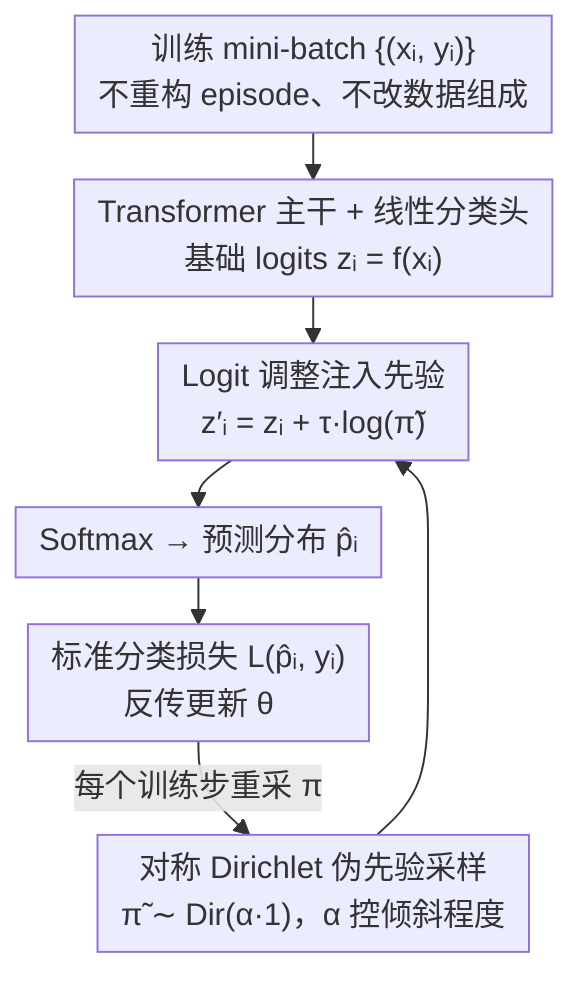

# DirPA: Addressing Prior Shift in Imbalanced Few-shot Crop-type Classification

**会议**: CVPR 2026  
**arXiv**: [2603.12905](https://arxiv.org/abs/2603.12905)  
**代码**: 无  
**领域**: 少样本学习 / 遥感农业分类  
**关键词**: few-shot learning, class imbalance, prior shift, Dirichlet augmentation, crop classification

## 一句话总结
提出 Dirichlet 先验增强（DirPA），在少样本学习训练的每一步从对称 Dirichlet 分布采样一个伪先验并以 logit 调整 $z'=z+\tau\log\tilde{\pi}$ 注入分类器（不改数据、不重构 episode），主动模拟真实世界长尾分布以消除先验偏移，在欧盟多个国家的作物分类任务中展示了一致的鲁棒性提升和稀有类别精度改善。

## 研究背景与动机

**领域现状**：农业监测中的作物类型分类是遥感领域的核心任务。实际场景中面临两个核心挑战：(1) 标注卫星遥感数据的成本极高，导致标注样本稀缺，天然适合少样本学习（FSL）框架；(2) 自然界中作物分布极度不平衡——小麦、玉米等主要作物覆盖大面积，而稀有作物（特殊经济作物、地方品种等）仅占极小比例，形成典型的长尾分布。

**现有痛点**：少样本学习的标准训练范式（如原型网络、MAML）通常人为构造平衡的 episode，即每个类别在 support set 和 query set 中拥有相同数量的样本。这种设计虽然简化了训练，但与真实测试场景的长尾分布产生严重的 **先验偏移（prior shift）**——模型在训练时看到的是类别均匀分布，但在部署时面对的是高度倾斜的分布（某些类别的样本量可能是稀有类别的 100 倍甚至更多）。这种分布不匹配直接导致模型对多数类过度自信、对稀有类忽视。

**核心矛盾**：FSL 的 episode 训练机制假设训练和测试的类别先验分布一致，但实际应用中不可能事先知道测试时的确切先验分布，而不同地理区域的作物比例差异巨大，需要一种对先验分布具有泛化能力的训练策略。

**本文目标**：如何让 FSL 模型在训练时就对多种可能的类别先验分布具有鲁棒性，从而在面对未知的真实长尾分布时仍然保持稳定的分类精度？

**切入角度**：不去预测或估计测试时的先验分布，而是在训练时主动模拟各种可能的分布——通过 Dirichlet 分布这一多项分布的共轭先验来采样类别比例向量，使每个训练 episode 的类别分布都不同，涵盖从均匀到极端倾斜的各种情况。

**核心 idea**：用 Dirichlet 分布采样 episode 的类别比例，让模型在训练时就体验各种不平衡程度，从而对先验偏移免疫。

## 方法详解

### 整体框架
DirPA 不碰网络结构、不加参数、不要额外数据，本质是一种**训练期的 logit 增强**。标准 FSL 训练隐式假设类别先验均匀，与真实长尾测试错位（先验偏移）。DirPA 在训练的每一步主动注入一个随机先验：先从对称 Dirichlet 分布 $\tilde{\boldsymbol{\pi}}^{(s)}\sim\text{Dir}(\alpha\cdot\mathbf{1})$ 采一个 $K$ 维伪先验（pseudo-prior），再把它以 $\boldsymbol{z}_i'=\boldsymbol{z}_i+\tau\log\tilde{\boldsymbol{\pi}}^{(s)}$ 的形式直接叠加到分类器输出的 logits 上，过 softmax 得到预测分布后用标准分类损失反传。关键是它**不重构 episode、不改动数据中 support/query 的样本组成**——扰动只发生在 logit 层。由于每一步采到的先验都不同（从近均匀到极端单类主导），模型被迫在各种先验下都保持判别力，从而学到对先验偏移免疫的 prior-agnostic 表征，部署时面对未知长尾分布无需任何推理期重加权。

### 关键设计

**1. 对称 Dirichlet 伪先验采样：用单参数 $\alpha$ 覆盖从均匀到极端长尾**

训练只见均匀先验是先验偏移的根子；但事先并不知道部署区域到底是哪种长尾，固定某一种分布等于赌错方向。DirPA 不赌：每个训练步从对称 Dirichlet $\text{Dir}(\alpha\cdot\mathbf{1})$ 在 $(K{-}1)$ 维概率单纯形上采一个伪先验 $\tilde{\boldsymbol{\pi}}$，让"训练时假定的类别比例"本身随机变化。选 Dirichlet 因为它对整个概率分布空间有 full support（任何真实先验都采得到、可学）、是多项分布的共轭先验（推导与计算简洁），且只用单一集中参数 $\alpha$ 就能控制倾斜程度：$\alpha<1$ 采高度倾斜（单类主导）的分布，$\alpha\ge 1$ 采接近均匀的分布。一次训练扫过无数种先验模式，模型学到的不再是拟合某一种长尾的捷径，而是对任意先验都稳的表征。

**2. Logit 调整注入先验：$\boldsymbol{z}_i'=\boldsymbol{z}_i+\tau\log\tilde{\boldsymbol{\pi}}$，扰动加在输出端而非数据端**

光采出先验向量还要让它真正作用到模型。DirPA 的注入方式是 logit adjustment：对每个样本，把基础 logits $\boldsymbol{z}_i=f(\boldsymbol{x}_i)$ 加上 $\tau\log\tilde{\boldsymbol{\pi}}$（$\tau$ 为控制扰动强度的缩放因子），再过 softmax 算概率、用标准交叉熵反传。这一项的含义是在 logit 空间对后验做一次先验平移——等价于让模型"假设"当前 batch 来自类别比例为 $\tilde{\boldsymbol{\pi}}$ 的分布、并仍要分对。与 BBSE、Kluger 等在推理期估计测试分布再重加权的事后修正相反，DirPA 是训练期的事前免疫：扰动只改 logits、不动数据，因此即插即用、与具体 backbone 无关，部署时不需要任何先验知识或推理期调整。

### 损失函数 / 训练策略
DirPA 不改损失本身——分类头照常用标准交叉熵 $\mathcal{L}(\hat{\boldsymbol{p}}_i,y_i)$，先验扰动是通过每步对 logits 的随机平移隐式引入的（Algorithm 1：采 mini-batch → 采伪先验 $\tilde{\boldsymbol{\pi}}^{(s)}\sim\text{Dir}(\alpha\cdot\mathbf{1})$ → 调整 logits → softmax → 算 batch 损失 → 反传）。从期望角度看，它等价于对先验做了一次积分 $\mathbb{E}_{\tilde{\boldsymbol{\pi}}\sim\text{Dir}(\alpha)}\big[\mathcal{L}(\theta;\tilde{\boldsymbol{\pi}})\big]$，意味着参数 $\theta$ 必须在所有被采到的先验下都表现良好，而不只是在均匀分布上最优。整体训练采迁移学习式两段：先在奥地利 + 德国的大规模数据上预训练 Transformer 特征提取器，再到各目标国家分别少样本微调，DirPA 在训练（微调）阶段生效。$\alpha$ 控制采样倾斜程度、$\tau$ 控制注入强度，是方法仅有的两个核心超参。

## 实验关键数据

### 主实验

| 评估维度 | DirPA 效果 | 对比基线 | 说明 |
|----------|-----------|----------|------|
| 整体精度（多国平均） | 一致提升 | 标准平衡 episode | 在所有测试国家均有正向增益 |
| 稀有类别 per-class accuracy | 显著改善 | 标准 FSL | 长尾分布下稀有类别精度提升最大 |
| 极端长尾分布 (100:1+) | 训练稳定 | 基线训练崩溃 | DirPA 稳定训练过程，避免优化不稳定 |
| 跨国迁移 | 保持收益 | 单区域训练 | 不同地理区域的收益方向一致 |

注：论文包含 28 张表和 9 张图，涵盖多个 EU 国家、多种 FSL backbone、多种不平衡程度的全面实验。

### 消融实验

| 配置 | 效果 | 说明 |
|------|------|------|
| $\alpha$ 很大（接近均匀） | 无增益 | 退化为标准平衡训练 |
| $\alpha$ 很小（极端倾斜） | 训练不稳定 | 某些类完全无 query 样本 |
| $\alpha$ 适中 | 最佳平衡 | 覆盖多样分布且训练稳定 |
| 不同 FSL backbone（原型网络等） | 一致有效 | 方法与模型无关，即插即用 |
| 不同地理区域 | 提升幅度不同但方向一致 | 证明地理泛化能力 |

### 关键发现
- Dirichlet 参数 $\alpha$ 是控制方法效果的核心旋钮：过大时等同于均匀训练无增益，过小时训练不稳定，适中值能最好地覆盖实际可能遇到的分布范围
- DirPA 的收益在稀有类别上最为显著——这正是长尾分布下最需要关注的部分
- 方法在不同 EU 国家（不同气候、不同作物类型）上的收益方向一致，虽然幅度因作物分布不同而有差异
- DirPA 不仅提高精度，还稳定了训练过程——在极端长尾场景下标准训练可能崩溃，而 DirPA 保持平稳收敛

## 亮点与洞察
- 问题定义精准且有实际意义：明确指出 FSL 中 prior shift 是被普遍忽视但影响巨大的瓶颈，这个问题不仅存在于农业分类，在所有训练/测试分布不匹配的 FSL 场景中都存在
- 方法设计极其简洁优雅：不改变模型结构、不增加参数、不需要额外数据——仅通过训练时对 logits 注入随机采样的先验就能获得一致提升，真正做到了即插即用
- Dirichlet 分布的选择有坚实的概率论基础：作为多项分布的共轭先验，它是对"所有可能的类别先验"进行建模的自然选择
- 实验规模令人印象深刻：20 页正文、28 张表格、覆盖多个 EU 国家，是少见的地理尺度验证

## 局限与展望
- 目前仅在遥感作物分类领域验证，对医学影像、自然图像等其他长尾 FSL 场景的迁移效果未知——虽然理论上方法是通用的，但实证支持有限
- $\alpha$ 参数的选择目前需要经验调优或网格搜索，缺乏自适应策略——理想情况下应根据任务特性自动调整
- 本文是对先前工作 (Reuss et al., 2026a) 的跨区域扩展，核心方法创新在原始论文中已提出，本文贡献主要在实证验证层面
- 未与近年的 transductive FSL 方法（利用 query 集统计信息在推理时调整先验）做深入对比——两类方法可能互补
- 未探索在训练时同时调整 support set 和 query set 的不平衡度，可能遗漏了某些有益的训练信号

## 相关工作与启发
- **vs 标准原型网络/MAML**: 这些经典 FSL 方法假设训练和测试的类别先验一致，DirPA 通过打破这一假设在先验偏移下获得了显著优势
- **vs Transductive FSL**: Transductive 方法（如 TIM、α-TIM）在推理时利用 query 集的统计信息来校准分类器，是事后修正策略；DirPA 是事前预防策略——在训练时主动模拟不平衡，两者互补且不冲突
- **vs 过采样/欠采样策略**: 传统 class-balanced sampling 或 SMOTE 等过采样方法固定到某一种平衡策略；DirPA 通过 Dirichlet 分布模拟所有可能的分布，泛化性更强
- **vs Domain Generalization**: DirPA 的核心思想与 DG 中的数据增强理念一致——通过增加训练分布的多样性来提高泛化能力，只不过 DirPA 的"增强"发生在标签空间（类别先验）而非特征空间

## 评分
- 新颖性: ⭐⭐⭐ 核心 idea（Dirichlet 先验模拟）简洁有效，但作为原始方法的地理扩展，增量创新有限
- 实验充分度: ⭐⭐⭐⭐⭐ 28 张表、9 张图、多国多场景多 backbone 验证，实验规模罕见地全面
- 写作质量: ⭐⭐⭐⭐ 问题定义清晰，实验组织有条理，20 页的篇幅允许充分展开
- 价值: ⭐⭐⭐ 对遥感 FSL 社区价值明确，Dirichlet 采样策略有推广潜力，但当前应用领域较窄

<!-- RELATED:START -->

## 相关论文

- [\[ICCV 2025\] Is Meta-Learning Out? Rethinking Unsupervised Few-Shot Classification with Limited Entropy](../../ICCV2025/others/is_meta-learning_out_rethinking_unsupervised_few-shot_classification_with_limite.md)
- [\[CVPR 2025\] Few-Shot Personalized Scanpath Prediction](../../CVPR2025/others/few-shot_personalized_scanpath_prediction.md)
- [\[ICML 2025\] Provably Improving Generalization of Few-Shot Models with Synthetic Data](../../ICML2025/others/provably_improving_generalization_of_few-shot_models_with_synthetic_data.md)
- [\[ICLR 2026\] Neural Force Field: Few-shot Learning of Generalized Physical Reasoning](../../ICLR2026/others/neural_force_field_few-shot_learning_of_generalized_physical_reasoning.md)
- [\[ICML 2025\] Feedforward Few-shot Species Range Estimation](../../ICML2025/others/feedforward_few-shot_species_range_estimation.md)

<!-- RELATED:END -->
