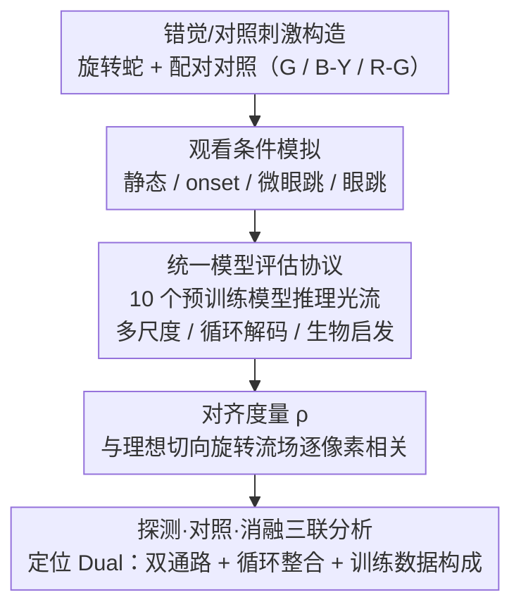

# Do Vision Models Perceive Illusory Motion in Static Images Like Humans?

**会议**: CVPR 2026 Findings  
**arXiv**: [2604.09853](https://arxiv.org/abs/2604.09853)  
**代码**: 有  
**领域**: 视觉感知/计算神经科学  
**关键词**: 运动错觉, 光流模型, 人类视觉, 旋转蛇错觉, 生物启发模型

## 一句话总结

本文系统评估了多种光流模型在旋转蛇等静态图像运动错觉上的表现，发现仅人类启发的Dual-Channel模型在模拟眼跳条件下能再现人类感知的旋转运动。

## 研究背景与动机

**领域现状**：DNN在光流估计基准上已超越人类，但在鲁棒性上仍有差距。视觉运动错觉为探测人机差异提供了有力工具，但现有研究集中于动态错觉（如reverse-phi），对静态图像错觉的研究不足。

**现有痛点**：旋转蛇错觉——一种在完全静态图像中人类强烈感知到旋转运动的现象——现有光流模型能否再现尚不清楚。该错觉依赖于微妙的亮度不对称和注视性眼动。

**核心矛盾**：标准DNN光流模型在基准测试上表现优异，但其计算策略是否与人类视觉系统共享关键原理仍不明确。

**本文目标**：评估代表性DNN和人类启发运动模型再现静态图像运动错觉的能力，识别关键计算组件。

**切入角度**：使用in silico心理物理学方法，在统一实验流水线下系统性比较10种运动估计模型。

**核心idea**：双通道运动处理、眼动瞬态信号和循环整合是再现人类运动感知的关键机制。

## 方法详解

### 整体框架

本文不提出新模型，而是搭一套统一的 in silico（计算机内）心理物理学流水线，把"模型能不能像人一样在静态图里看到运动"这个主观问题变成可量化的实验。流程分四步：(1) 按既定范式合成旋转蛇错觉图及其配对对照图，并用灰度(G)、蓝黄(B-Y)、红绿(R-G)三种配色分离亮度信号与高阶颜色信号；(2) 把每张图渲染成模拟人眼观看的四种帧序列——静态、刺激出现(onset)、微眼跳(microsaccade)、眼跳(saccade)，给模型补上人类感知该错觉所必需的眼动瞬态；(3) 让 10 个代表性运动估计模型（多尺度、循环解码、生物启发三类）一律加载官方预训练权重推理光流；(4) 用归一化相关度量 ρ 把模型光流场与"人类感知的理想切向旋转流场"逐像素比对打分，再通过探测/对照/消融三联分析把"再现错觉"的功劳拆到具体计算组件上。判据很直接——人在旋转蛇上感知到的是沿同心圆切向的全局旋转流，所以只看模型光流里是否出现这种与理想旋转一致的模式。

### 关键设计

**1. 错觉/对照刺激构造：把"亮度不对称驱动的错觉"从空间布局里剥出来**

旋转蛇刺激由六个同心圆环、每环 24 个重复单元组成，强可预测地诱发人类的逆时针旋转感。光看错觉图无法证明模型的旋转是"被错觉骗到"还是"被布局/轨迹带偏"，所以本文为每张错觉图配一张对照图：在每个重复单元内部打乱亮度/颜色序列，从而破坏驱动错觉的局部亮度梯度（非对称微结构），但完整保留全局布局与配色。再叠加灰度、蓝黄、红绿三种配色——三者对人都诱发逆时针旋转，但灰度只剩亮度线索、蓝黄/红绿引入等亮度的颜色对比，由此能区分错觉究竟依赖亮度运动还是高阶颜色运动。判据是：模型若在错觉图上出现切向旋转流、在对照图上却没有，才说明旋转是被错觉的亮度不对称驱动的，而非布局或眼动轨迹的副产物。

**2. 统一模型评估协议：让差异只来自架构，而非训练或评测口径**

不同光流模型来自不同论文、用不同数据训练，直接比较容易把架构差异和训练差异混在一起。本文让全部 10 个模型加载各自官方预训练权重、在完全相同的错觉/对照图集上推理，输出统一按"是否出现切向旋转流"判读；这些模型横跨多尺度、循环解码、生物启发三大架构家族。如此一来，某个模型再现错觉而另一个没有，就能归因到它的运动计算结构本身，而非"谁的训练数据更好"。（唯一例外是 DorsalNet，它原本预测自运动参数而非光流，本文额外训练一个线性解码器把其多层特征映射成稠密光流。）

**3. 观看条件模拟 + 对齐度量：补上人类触发错觉的生理前提，并量化"像不像人"**

心理物理学早已发现，旋转蛇在严格固定凝视下显著减弱，人真正"看见"旋转靠的是眼跳/微眼动带来的瞬态视网膜滑移。只喂一张纯静态图等于抽掉了人类感知该错觉的必要条件，比较并不公平。本文因此渲染四种帧序列：静态（重复同一帧）、刺激出现 onset（先白屏再出图，模拟单次出现瞬态）、微眼跳与眼跳（沿直线平移图像，位移 $\Delta\in\{15,30,60,90,120\}$ 像素，覆盖人类微眼跳到眼跳的幅度范围，每段序列至多三次位置变化）。打分用归一化相关度量：把模型预测光流 $\mathbf{P}$ 与"人类感知的理想旋转流场" $\mathbf{R}$（绕中心切向旋转、幅度按 $(r/R)^{\gamma}M$ 随半径平滑衰减）逐像素求内积再除以两者 Frobenius 范数，得 $\rho\in[-1,1]$：$\rho=1$ 方向完全对齐、$0$ 不相关、$-1$ 方向相反（顺时针）。该度量只看方向一致性、不苛求幅度，正好契合错觉运动的分析。这样"模型在静态下不动、在微眼跳下出现旋转"成为可观测的开关，直接对应人类感知。

**4. 探测·对照·消融三联分析：把"人类样运动感知"定位到 Dual 模型的哪些机制**

十个模型里只有生物启发的 Dual 模型出现正向对齐（灰度与蓝黄变体、微眼跳条件下相关最高）。Dual 走两条并行通路：一阶通路 $E_1$（类比初级视皮层 V1）用可分离时空 Gabor 滤波器在 8 个尺度上提取亮度运动能量；高阶通路 $E_2$ 用 3D CNN + 可训练 Gabor 从 RGB 序列提取非傅里叶（颜色/特征）运动；两路融合成 $E_m$ 后送入 Stage II——一个 6 层 Transformer（类比中颞区 MT）做图注意力 + 循环整合，每个循环步由线性解码器出一次光流。本文用三类分析定位关键成分：**探测**（不改权重，直接解码中间表征）发现仅靠 $E_1$ 即便经过循环、对错觉图仍接近零，而融合 $E_m$ 在 Stage I 就显著抬升、循环整合进一步放大、相关在 Stage II-6 达峰——说明一阶通路单独不足，是高阶通路 + 循环整合共同凑出全局旋转；**对照**（把 RAFT、ME-Attention 用 Dual 的同一数据重训）发现二者仍远弱于 Dual，说明架构的作用超出训练数据本身；**消融**（重训 Dual 的若干变体）发现去掉一阶或高阶任一通路都使对齐显著下降，联合去掉"非纹理 + 非漫反射物体运动"两个训练子集则使对齐几乎消失——而所有变体对真实旋转仍能正确估计，故双通路架构与训练数据构成二者缺一不可，并非基础运动能力的问题。

### 损失函数 / 训练策略

主实验为零样本评估：10 个模型一律使用各自官方预训练权重直接推理、不做微调，确保结论反映模型既有的运动计算策略而非临时适配出来的行为。仅在对照(control)与消融(ablation)分析中，为剥离"架构 vs 训练数据"的作用，才在统一数据上重训 RAFT、ME-Attention 与 Dual 的若干变体。Dual 的训练损失是两条通路逐步预测光流的序列损失之和——一阶通路 $E_1$ 与融合通路 $E_m$ 在每个循环迭代输出的光流分别与真值光流 $\mathbf{u}^*$ 求损失后相加。

## 实验关键数据

### 主实验

| 模型类型 | 静态条件 | 微眼跳条件 | 再现错觉 |
|---------|---------|---------|---------|
| 多尺度DNN (PWC-Net/LFN2 等) | 无/极弱旋转流 | 无旋转流 | ✗ |
| 循环解码DNN (RAFT/CCMR 等) | 无/极弱旋转流 | 无旋转流 | ✗ |
| Dual (生物启发) | 弱信号 | 部分再现逆时针旋转（相关最高） | ✓ |

眼跳(saccade)大幅位移下，各模型光流被强加的平移方向主导；与人类感知最接近的对齐出现在微眼跳（尤其 ~30 px）条件，且主要见于灰度与蓝黄变体（红绿变体常呈负相关）。

### 探测 / 对照 / 消融分析（针对 Dual）

| 配置 | 关键发现 | 说明 |
|------|---------|------|
| 探测：仅 $E_1$ 解码 | 接近零（即便经过循环） | 一阶通路单独不足以产生旋转 |
| 探测：融合 $E_m$ + 循环至 Stage II-6 | 相关峰值 | 高阶通路 + 循环整合凑出全局旋转 |
| 去掉一阶通路 $E_1$ | 对齐显著下降 | 一阶运动能量必要 |
| 去掉高阶通路 $E_2$ | 对齐显著下降 | 高阶颜色/特征运动必要 |
| 去掉非纹理 + 非漫反射物体运动训练子集 | 对齐几乎消失 | 训练数据构成是关键 |
| 同数据重训 RAFT / ME-Attention | 仍远弱于 Dual | 架构作用超出训练数据 |

（以上变体对真实旋转刺激均能正确估计光流，说明削弱的是"再现错觉"而非基础运动能力。）

### 关键发现

- 大多数光流模型完全无法在静态图像上产生与人类一致的旋转流场
- Dual 模型只在模拟微眼跳条件下（尤其 ~30 px）展现预期旋转运动，静态条件下也较弱
- 高阶通路与循环整合共同把局部运动能量整合成全局旋转，单靠一阶通路不足；架构与训练数据构成二者缺一不可

## 亮点与洞察

- **运动错觉作为模型诊断工具**：通过人类感知偏差来区分"能工作的"和"像人类一样工作的"模型
- **生物启发计算原理的验证**：双通道运动处理、眼动瞬态和循环整合是三个可迁移的设计原则
- **对鲁棒视觉系统设计的启示**：能再现人类感知偏差的模型可能在真实世界中也更鲁棒

## 局限与展望

- 仅测试了有限的运动错觉类型
- Dual-Channel模型的实际光流估计性能未与主流DNN对比
- 仅分析了零样本推理，未探索微调能否使DNN学会再现错觉

## 相关工作与启发

- **vs 标准光流基准**: 基准测试上表现好不代表与人类视觉对齐，运动错觉提供了互补的评估维度
- **vs reverse-phi研究**: reverse-phi是动态错觉，旋转蛇是静态错觉，后者对模型的要求更高

## 评分

- 新颖性: ⭐⭐⭐⭐ 静态运动错觉在计算视觉中的首次系统评估
- 实验充分度: ⭐⭐⭐⭐ 10种模型×多种条件×消融分析
- 写作质量: ⭐⭐⭐⭐ 跨学科研究组织得当
- 价值: ⭐⭐⭐ 对光流模型设计有启发但实际应用有限

<!-- RELATED:START -->

## 相关论文

- [\[ICML 2026\] Position: Age Estimation Models Do Not Process Biometric Data](../../ICML2026/others/position_age_estimation_models_do_not_process_biometric_data.md)
- [\[CVPR 2026\] ViT3: Unlocking Test-Time Training in Vision](vit3_unlocking_test_time_training_in_vision.md)
- [\[NeurIPS 2025\] Brain-Like Processing Pathways Form in Models With Heterogeneous Experts](../../NeurIPS2025/others/brain-like_processing_pathways_form_in_models_with_heterogeneous_experts.md)
- [\[CVPR 2026\] Your Classifier Can Do More: Towards Balancing the Gaps in Classification, Robustness, and Generation](your_classifier_can_do_more_towards_balancing_the.md)
- [\[ICML 2026\] Vision Transformer 微调中的非光滑分量优势](../../ICML2026/others/vision_transformer_finetuning_benefits_from_non-smooth_components.md)

<!-- RELATED:END -->
