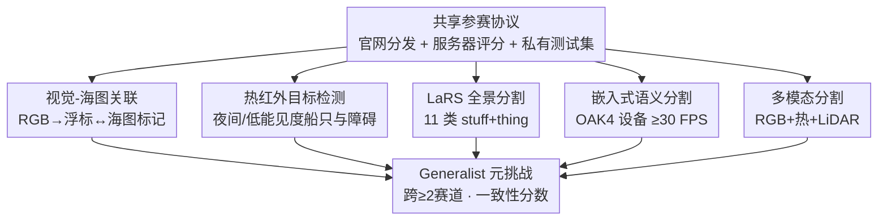

# 4th Workshop on Maritime Computer Vision (MaCVi): Challenge Overview

**会议**: CVPR 2026  
**arXiv**: [2604.13244](https://arxiv.org/abs/2604.13244)  
**代码**: 数据/榜单见 https://macvi.org/workshop/cvpr26  
**领域**: 海事计算机视觉 / 目标检测 / 全景与语义分割 / 多模态感知（赛事综述）  
**关键词**: 海事感知, USV 无人艇, 赛事综述, 嵌入式实时, 小目标检测

## 一句话总结
这是 CVPR 2026 第 4 届海事计算机视觉工作坊（MaCVi）的赛事综述报告，它把 5 个面向无人水面艇（USV）感知的基准挑战（视觉-海图关联、热红外检测、LaRS 全景分割、嵌入式语义分割、多模态分割）的任务设置、评测协议、数据集与获胜方案技术要点系统梳理出来，并跨赛道总结出"几何先验 + 大规模自监督骨干 + 集成 + 嵌入式实时约束"这几条共性趋势，结论是海事感知正从单任务最优走向跨任务/跨传感条件/跨部署约束的通用化。

## 研究背景与动机
**领域现状**：海事场景（动态光照、水面反射、远距离杂乱背景、夜间低能见度）对通用视觉模型极不友好，而 USV 这类自主系统又高度依赖鲁棒的检测、分割与导航感知。要推动这个方向，光有算法不够，还需要标准化基准 + 公开榜单 + 协作生态。

**现有痛点**：海事感知缺乏统一、可复现、面向真实部署的评测平台——很多方法在干净数据上好看，但在反射/夜间/小目标/算力受限的真实工况下退化严重，且彼此用不同数据/指标，无法横向比较。

**核心矛盾**：本届报告反复强调的是"预测精度"与"嵌入式实时可行性"之间的张力——既要在困难工况下不漏检小障碍物（安全攸关），又要能在低功耗边缘设备上跑到实时帧率，这两者天然冲突。

**本文目标**：作为一份 challenge overview，它要做的不是提出新方法，而是把 MaCVi 2026 的 5 个赛道讲清楚：每个赛道解决什么任务、用什么数据、怎么评分、谁赢了、赢在哪，并提炼跨赛道的方法趋势。

**切入角度**：用"基准挑战赛 + 获胜队技术报告"的形式，让各路队伍在统一私有测试集上竞争，再由组织方做交叉分析，从而把"什么设计在海事真实工况下真正有效"沉淀成可复用经验。

**核心 idea**：用一套共享的参赛/评测协议串起 5 个互补赛道（外加一个跨赛道的 Generalist Meta Challenge），既覆盖"任务多样性"又同时压"精度"和"实时部署"两个维度。

## 方法详解
本节把这篇综述的"方法"重新理解为：整套赛事的**任务设置 / 赛道结构 / 评测协议 / 代表性获胜方案**。先讲整体框架（5 赛道 + 元挑战 + 共享协议），再按赛道逐一拆解其设置与获胜方法要点。

### 整体框架
MaCVi 2026 由一个**共享参赛协议**统领 5 个并列赛道：所有赛道都通过工作坊官网分发规则/数据/评测代码/starter kit，参赛者把预测结果（含必要时的 ONNX 导出）提交到官方评测服务器，服务器自动打分并维护公开榜单；提交频率限每天 1–3 次，赛期为 2025-12-29 至 2026-03-15（AoE），最终经复现性核验后按各赛道官方指标排名，头部队伍受邀贡献简短技术报告并汇入本综述。5 个赛道分别覆盖**视觉-海图关联、热红外目标检测、LaRS 全景分割、嵌入式语义分割、多模态语义分割**；此外还设一个 **Generalist Meta Challenge**，要求一支队同时参加 ≥2 个赛道，用"一致性分数（Consistency Score）"奖励跨任务都能打的通用方法。本届的总基调是"模型质量"与"嵌入式实时约束"双重强调。

### 关键设计
下面按"赛道设置 + 代表性获胜方法"组织——每个赛道讲清它的任务/数据/评分指标，以及冠军方案赢在哪个具体设计上。

**1. 视觉-海图关联赛道：把几何先验显式注入关联**

任务是从单目 RGB 图像里检测可见的海上导航助航标（浮标），并在杂乱、反射、远距离视角下把它们关联到正确的海图标记。数据集含 4,285 训练 / 904 验证 / 924 测试样本（测试集私有），按 buoy-detection 的 P/R/F1、匹配框 mIoU 排名，总分定义为 $\text{Overall} = \tfrac{1}{2}(\text{F1} + \text{mIoU})$，模型限 250M 参数。冠军（HD Korea Shipbuilding，Overall 0.7646）用的是 **Skyline-aware ROI-calibrated association**：先估计天际线、把海图信息投影到图像空间定义 query 专属搜索区域、再做分配与标定的分阶段流水线；亚军（Arquimea，0.7386）则用一个学到的"世界→图像"投影当紧凑空间先验接 DETR。跨提交的最强趋势就是**显式几何先验**——把海图/IMU 派生的线索投进检测器，远比纯视觉骨干堆参数有效；而更强的检测骨干（季军 Xidian 的 DEIMv2）与几何先验互补而非替代。

**2. 热红外目标检测赛道：集成 + 半监督攻克小目标**

针对夜间/低能见度这种 RGB 失效但作业关键的工况，用热红外成像检测船只与导航障碍。采用 Maritime Collision Avoidance Dataset（德/英/荷水域 2023–2025 采集），重组为 vessel / navigational object 两类、COCO 格式，704 训练 / 173 验证 / 381 测试（标签隐藏），主指标是 COCO $\text{AP}$（IoU 0.50–0.95），$\text{AP}_{50}$ 作 tiebreaker，并强制上报推理 FPS 与硬件。冠军（Schneider Electric Taiwan，AP 0.4868）的核心是**多架构集成 + 半监督**：6 模型跨 5 种架构经 Weighted Boxes Fusion（WBF）融合，再叠一个"在 381 张无标注测试图上伪标 + MixPL 师生训练"的三阶段半监督管线。本赛道的支配性结论是**集成 + 高分辨率**：三甲全靠 6–11 个模型 WBF 融合，且因 63.4% 标注目标小于 $32\times32$ 像素（导航目标中位仅 $8.3\times18.6$），提高推理分辨率是改善小目标的最大杠杆；CLAHE 对比度增强对强模型有益、对弱模型反而微降（−0.002~−0.008 AP）；季军证明只是**修正风机标注**这一项就拿到所有单项里最大增益（+0.027 AP），说明标注质量与领域过滤可与复杂学习策略掰手腕。

**3. LaRS 全景分割赛道：mask-transformer + 自监督大骨干**

要求把 USV 视角场景解析成 stuff 类（水、天、静态障碍）与 thing 实例（船/浮标/划艇/泳者/动物/桨板/漂浮物/其他 8 类动态障碍），在 1,203 张 LaRS 测试图上按 11 类平均 $\text{PQ}$ 排名，并拆出 RQ/SQ 及 stuff/thing 分项；特别地，落在静态障碍区域内的动态障碍误检不额外罚 FP。本赛道收到 6 队 26 次提交，冠军 **M2F-DINOv3**（FER Zagreb，PQ 53.5）以 mask-transformer 元架构配 DINOv3 自监督骨干夺魁，甚至在 stuff 类上超过 SOTA 的 PanSR（57.3 PQ，参赛外），并在夜间、强反射、过曝、雨雾等困难场景反超 PanSR——说明**大规模自监督预训练显著提升困难工况鲁棒性**。但所有提交都没整体超过 PanSR，差距主要来自 thing 类（尤其小动态障碍），印证 PanSR 的 object-centric proposal 头在小目标/密集场景上的优势仍未被复刻。

**4. 嵌入式语义分割赛道：在 ≥30 FPS 硬约束下卡质量-吞吐权衡**

直面"现有海事分割太吃算力、装不进小型节能 USV"的痛点，在真实 Luxonis 嵌入式设备 OAK4 上评测。沿用 LaRS 协议但加部署约束：模型必须可导出为静态计算图 ONNX、只用支持算子、吃单张 $768\times384$ 图、且在目标设备上 ≥30 FPS；服务端会把模型 INT8 量化后编译上设备评测。排名用导航导向指标——静态障碍看 water-edge accuracy $\mu$、动态障碍看 F1，主指标是组合质量 $Q = \text{F1}\cdot\text{mIoU}$。冠军 **DSOS-Net**（Independent Researcher，Q 61.9）用 DINOv3 预训练的 ConvNeXt 骨干 + 轻量 RSOS-Net 风格解码器 + 两阶段训练，在最小障碍物上最强、误检也最少；亚军 PIDNet-S 主打量化友好与实时，mIoU 最高；季军 RSOS R50 吞吐最高（96.3 FPS）。本届最优都没超过去年参考模型 RSOS-Net 的最佳 Q/F1，但都守住了实时门槛，清楚展示了**质量与吞吐之间的折中**。

**5. 多模态语义分割赛道：退化传感下的跨模态融合**

在 MULTIAQUA 上做同步 RGB + 热红外 + LiDAR 的分割，预测静态障碍/动态障碍/水/天 4 类，关键难点是既要利用辅助模态、又要在某些模态退化或缺失时仍稳。参赛者分别提交白天验证集与夜间隐藏测试集的预测，排名按 $M$（两个 split 的 mIoU 均值），并额外报告各 split mIoU 与动态障碍 IoU 以反映夜间鲁棒性与安全攸关的障碍检测。本赛道 3 队 36 次提交，冠军 **GatedMemorySAM**（GIST AI LAB，M 82.1）基于 SAM 家族强预训练骨干、并**显式建模困难能见度条件**，在验证集上甚至超过 MaCVi 参考；其余两队白天尚可但夜间显著退化，说明退化传感下的鲁棒跨模态融合仍是公开难题。

### 一个完整示例：Generalist 元挑战如何打分
附录里的 Generalist Meta Challenge 是个很能说明"跨任务一致性"理念的例子。设有 $M$ 个赛道榜单，榜单 $i$ 有 $N_i$ 个排名条目。对模型 $j$，先取它在榜单 $i$ 上的排名 $r_{ij}$（若没参加该榜，则记为 $N_i+1$）；再归一化成 $s_{ij} = \max\!\left(0,\ 1 - \frac{r_{ij}-1}{N_i-1}\right)$，于是榜首映射到 1、末位与缺席都映射到 0；最终一致性分数取跨榜算术平均 $C_j = \frac{1}{M}\sum_{i=1}^{M} s_{ij}$。直观地说：一个只在单一赛道夺冠、其余赛道缺席的"偏科"模型，会被大量 0 拉低分数；只有在多个赛道都名列前茅的通用方法才能拿高 $C_j$——这把"通用性"量化成了可排名的单一标量。

## 实验关键数据

> 说明：这是赛事综述，没有统一的"本文方法 vs SOTA"主实验，下面整理各赛道的**关键赛果/排行榜要点**。

### 各赛道冠军与基线对比
| 赛道 | 主指标 | 冠军方法（机构） | 冠军分 | 组织方基线 | 备注 |
|------|--------|------------------|--------|-----------|------|
| 视觉-海图关联 | Overall=½(F1+mIoU) | Skyline-aware ROI 关联（HD Korea） | 0.7646 | DETR 式融合 0.3333 | 三甲全超基线 |
| 热红外检测 | COCO AP | 多架构集成+SSL（Schneider Taiwan） | 0.4868 | Faster R-CNN 0.3137 | 三甲均靠 6–11 模型集成 |
| LaRS 全景分割 | PQ（11 类） | M2F-DINOv3（FER Zagreb） | 53.5 | M2F Swin-B 41.4 | 未超 PanSR 的 57.3 |
| 嵌入式语义分割 | Q=F1·mIoU | DSOS-Net（Independent） | 61.9 | 去年 RSOS-Net 64.2 | 未超去年最佳但守住实时 |
| 多模态分割 | M=mean(mIoU) | GatedMemorySAM（GIST） | 82.1 | SWIN-B+M2F 83.4 | 验证集超参考、夜间略低 |

### 跨赛道趋势分析
| 趋势 | 体现赛道 | 关键证据 |
|------|----------|----------|
| 几何先验注入 | 视觉-海图关联 | 冠亚季军都用天际线/投影/IMU 先验，远胜纯视觉 |
| 集成 + 高分辨率 | 热红外检测 | 三甲 WBF 融合 6–11 模型；63.4% 目标 <32² 像素，提分辨率最有效 |
| 自监督大骨干 + mask-transformer | LaRS / 嵌入式 / 多模态 | DINOv3 / SAM 家族骨干在雨雾夜间反超 SOTA |
| 质量↔吞吐折中 | 嵌入式分割 | DSOS-Net 质量最好，RSOS R50 吞吐 96.3 FPS 但精度让步 |
| 数据/标注治理 | 热红外检测 | 仅修正风机标注就 +0.027 AP，单项最大增益 |

### 关键发现
- **小目标检测是跨赛道公共瓶颈**：热红外里导航目标中位面积仅 ≈154 px²，LaRS 里 PanSR 仍漏检最小一档目标，嵌入式里最小障碍物检测率最低——海事感知的核心难点高度一致。
- **大规模自监督预训练在困难工况下最值钱**：DINOv3/SAM 骨干在夜间、强反射、雨雾、过曝场景下甚至能反超原 SOTA，说明鲁棒性而非干净精度才是海事真痛点。
- **没有免费午餐**：CLAHE 只对强模型有益、对弱模型微降；最优嵌入式方法没超过去年 Q/F1 却换来实时可部署——增益高度依赖模型容量与部署约束。

## 亮点与洞察
- **把"通用性"做成可排名指标**：Generalist 元挑战用归一化排名 + 一致性分数 $C_j$，把"一个方法是否跨任务都能打"压成单一标量，缺席即 0，惩罚偏科——这个评测设计可迁移到任何多任务/多 benchmark 的"通才"评比里。
- **嵌入式赛道把"实时"做成硬门槛而非软指标**：必须 INT8 量化后在真实 OAK4 上 ≥30 FPS 才进榜，倒逼方法直面部署现实，而不是只在 A100 上报点数——这对所有声称"实时"的论文都是个有价值的评测范式。
- **"修标注 > 加模型"的反直觉结论**：热红外季军证明仅纠正风机标注就拿到全场单项最大 AP 增益（+0.027），提醒社区数据治理常被低估。
- **几何先验与强骨干互补而非互斥**：视觉-海图关联里物理接地的几何条件最有效，但更强检测骨干仍能叠加增益——给"先验工程 vs 表示学习"之争一个具体注脚。

## 局限与展望
- **报告自承为 draft / 迭代起点**：文中明确这是"current challenge configuration"的初稿，会随后续更新迭代，部分赛道参赛队伍数较少（多模态仅 3 队、嵌入式 5 队），样本量有限、趋势结论需谨慎外推。⚠️ 部分技术细节以官方榜单与各队技术报告为准。
- **赛道间不可直接横比**：各赛道主指标定义不同（Overall / AP / PQ / Q / M），冠军分高低不代表任务难度或方法强弱可比，跨赛道结论只能停在"趋势"层面。
- **多模态夜间退化仍是空白**：除冠军外两队夜间显著掉点，退化/缺失传感下的鲁棒融合尚无成熟解法。
- **展望**：作者预告未来将引入更多"通才（generalist）"挑战，推动能跨任务/跨传感条件/跨部署约束迁移的海事感知方法。

## 相关工作与启发
- **vs LaRS / PanSR（海事分割 SOTA）**：LaRS 提供全景分割基准与基线，PanSR 是其上 SOTA（57.3 PQ，object-centric proposal 头擅长小目标密集场景）；本届最佳提交 M2F-DINOv3 仅 53.5 PQ 未超 PanSR，但在困难工况反超，说明自监督骨干补鲁棒、却仍欠专门的小目标头。
- **vs 前几届 MaCVi**：延续往届势头，但本届首次把"嵌入式实时可行性"与"多模态退化鲁棒性"提到与精度同等权重，并新增 Generalist 元挑战，体现从单任务最优转向跨任务通用的导向。
- **vs 通用检测/分割范式（DETR 系、Mask2Former、SAM、WBF 集成、半监督 MixPL）**：本综述是这些通用技术在"海事真实工况"下的一次大规模压力测试，告诉社区哪些组件（几何先验、自监督骨干、集成、高分辨率）在反射/夜间/小目标/算力受限场景里真正迁移得动。

## 评分
- 新颖性: ⭐⭐⭐ 作为赛事综述本身不提新方法，但 Generalist 一致性分数与嵌入式硬实时门槛的评测设计有新意。
- 实验充分度: ⭐⭐⭐⭐ 5 赛道 + 多维分层分析（按场景/尺寸/类别）+ 获胜队技术报告，覆盖面广；个别赛道参赛队偏少。
- 写作质量: ⭐⭐⭐⭐ 结构清晰、赛道与趋势分离、表格与定性图齐全，便于查阅。
- 价值: ⭐⭐⭐⭐ 为海事感知社区提供统一基准、可复现榜单与跨赛道经验沉淀，对做 USV 感知与边缘部署的人很实用。

<!-- RELATED:START -->

## 相关论文

- [\[CVPR 2026\] AVION: Aerial Vision-Language Instruction from Offline Teacher to Prompt-Tuned Network](avion_aerial_visionlanguage_instruction_from_offli.md)
- [\[CVPR 2026\] LookasideVLN: Direction-Aware Aerial Vision-and-Language Navigation](lookasidevln_direction-aware_aerial_vision-and-language_navigation.md)
- [\[ICCV 2025\] Towards a Unified Copernicus Foundation Model for Earth Vision](../../ICCV2025/remote_sensing/towards_a_unified_copernicus_foundation_model_for_earth_vision.md)
- [\[CVPR 2025\] Learning Occlusion-Robust Vision Transformers for Real-Time UAV Tracking](../../CVPR2025/remote_sensing/learning_occlusion-robust_vision_transformers_for_real-time_uav_tracking.md)
- [\[ICML 2025\] ExPLoRA: Parameter-Efficient Extended Pre-Training to Adapt Vision Transformers under Domain Shifts](../../ICML2025/remote_sensing/explora_parameter-efficient_extended_pre-training_to_adapt_vision_transformers_u.md)

<!-- RELATED:END -->
