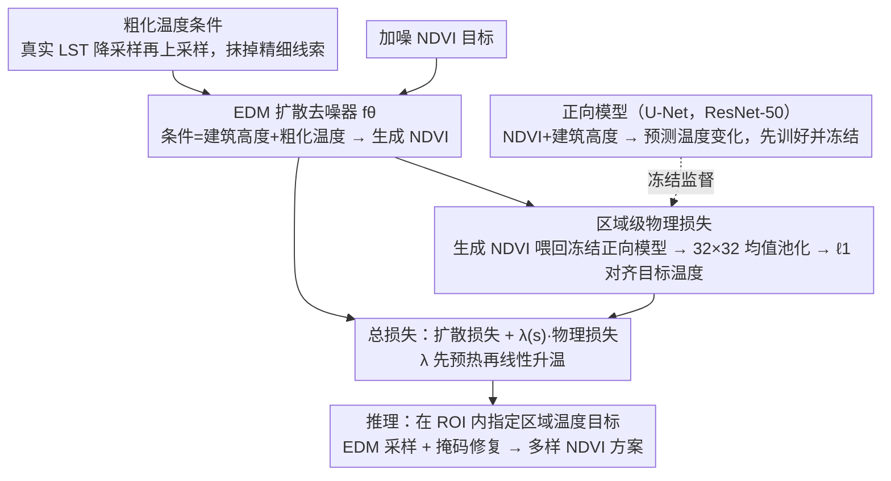

# Conflated Inverse Modeling for Urban Vegetation Patterns

**会议**: CVPR 2026  
**arXiv**: [2604.13028](https://arxiv.org/abs/2604.13028)  
**代码**: 有  
**领域**: 遥感 / 城市计算  
**关键词**: 逆向建模, 扩散模型, 城市植被, 地表温度, NDVI

## 一句话总结

提出融合正向预测模型和扩散逆向生成模型的框架，在指定温度变化目标下生成多样且物理合理的城市植被空间配置（NDVI 模式），多样性提升 3.4 倍同时温度控制误差降低 37%。

## 研究背景与动机

**领域现状**：城市区域日益受到热极端事件影响，植被通过遮阴和蒸散调节城市微气候。正向模型（给定植被预测温度）已成熟，但逆向问题（给定温度目标确定植被配置）几乎未被探索。

**现有痛点**：逆向问题本质上欠定——多种空间植被排列可产生相似的聚合温度响应。传统回归和确定性神经网络无法捕获这种歧义性，倾向于产生平均解。数据稀缺加剧问题：同一城市区域在不同植被方案下的观察不可得。

**核心矛盾**：需要同时实现多样性（不同的空间植被配置）和特异性（都满足指定温度目标），且在训练数据中这些组合可能不存在。

**本文目标**：学习条件生成模型，在建筑高度约束下生成满足区域温度目标的多样 NDVI 模式。

**切入角度**：将植被驱动的温度调节建模为生成式逆问题，在聚合区域尺度强制温度约束以保留空间多样性。

**核心 idea**：正向模型监督逆向扩散模型在区域尺度的温度一致性，而非像素级约束，从而在保证温度目标的同时生成多样的植被空间配置。

## 方法详解

### 整体框架

这篇论文要解决的是城市植被的「逆向问题」：给定一个区域温度变化目标，反推出能达成它的植被空间配置（NDVI 模式）。难点在于这是个一对多的欠定问题——很多种植被排列都能产生相近的区域温度响应，而训练数据里每块区域只有一种真实植被方案。

整体框架靠两个模型的协作完成。先单独训练一个 **正向模型**（U-Net，ResNet-50 编码器），学会从 NDVI 加建筑高度预测地表温度变化 $\Delta T$；它扮演一个可微的物理代理，训练好后全程冻结。然后训练**扩散逆向模型**：以建筑高度图和一张粗化温度图堆叠成的 2 通道条件，去噪生成 NDVI。关键在于逆向模型训练时会把生成的 NDVI 喂回冻结的正向模型，用它预测的**区域均值温度**反过来监督生成结果——让扩散模型在「满足温度目标」和「保留空间多样性」之间找到平衡。推理时，用户只在一块邻域尺度的编辑区（ROI）里指定想要的区域温度变化，模型用掩码修复（inpainting）的方式只改这块区域的植被、保留周边上下文。

### 关键设计

**1. 粗化温度条件：把条件信号降分辨率，避免精细温度图反推出唯一答案**

如果直接拿一张精细的逐像素温度图当条件，模型实际上面对的是一个近乎一一映射的任务——精细温度场几乎唯一地决定了植被分布，多样性又被掐死了。所以本文先把温度条件做空间粗化——先降采样、再上采样回原分辨率（$\tilde{\mathbf{t}} = \mathrm{Up}(\mathrm{Down}(\mathbf{t};k);k)$，粗化因子 $k{=}32$），抹掉精细线索、只留区域温度趋势，让模型只需满足「整片区域大致降温多少」而不必复刻精确的空间温度分布。

粗化后的条件留下了大量未被约束的空间细节，正是这些细节给了扩散采样腾挪的余地。消融对比很直接：换成精细温度条件后多样性塌到 1.2×（温度倒是更准，1.52°C），而完全不粗化也只有 1.8× 多样性——粗化的颗粒度本身就是调节「多样性 vs 特异性」的旋钮。

**2. EDM 扩散去噪骨架：在 NCSN++ 上换用 EDM 预条件化承载多通道条件**

逆向生成器的骨架沿用 Score-SDE 的 NCSN++ 网络，但把原始的分数匹配损失与采样过程整体替换为 EDM（Elucidating Diffusion Models）公式：网络对加噪 NDVI 与干净条件拼接后预测去噪残差，再经 $c_{\mathrm{skip}}/c_{\mathrm{out}}/c_{\mathrm{in}}$ 预条件化得到 $\hat{\mathbf{x}}_0$。条件本身是建筑高度与粗化温度图堆叠成的 2 通道张量。相比标准 DDPM，EDM 的预条件化在训练效率和数值鲁棒性上更稳，让模型能在数据稀缺（每区域仅一种真实方案）的条件下稳定收敛到一个能采样多样解的去噪器。

**3. 正向-逆向融合：用冻结正向模型在区域尺度兜住温度，而非逐像素锁死植被**

这是论文标题里「conflated（融合）」的核心，也是把「多样」和「温度受控」同时握住的那只手。逆向问题一对多的本质决定了不能直接拿真值 NDVI 做像素级监督——那样会把生成结果钉死成单一解，多样性彻底消失。本文让冻结的正向模型当裁判：扩散模型生成 NDVI 后送进它预测温度，再对预测温度图和真值温度图都做 $32{\times}32$ 非重叠均值池化，只在**池化后的区域均值**上施加 $\ell_1$ 一致性惩罚 $\mathcal{L}_{\mathrm{phys}} = \lVert \bar{\hat{\mathbf{T}}} - \bar{\mathbf{T}} \rVert_1$，而非逐像素的温度图（用 $\ell_1$ 是为了对系统性小偏差给稳定梯度、对离群点不敏感）。

这样设计的好处是，温度约束只锁住「整片区域大致降温多少」，至于这些植被具体怎么铺开、哪里密哪里疏，扩散模型有充分自由去采样不同方案。池化尺度 $k_{\mathrm{pool}}{=}32$ 刻意对齐推理时的编辑区尺度，让监督发生在邻域尺度而非过拟合精细 LST。消融里去掉这层正向监督后温度误差从 1.79°C 飙到 2.85°C，证明它正是兼顾多样性与特异性的关键。

**4. ROI 掩码修复推理：只在邻域尺度的编辑区改植被，保留周边上下文**

推理与训练不同：模型并不重画整张 NDVI，而是在每个 $128{\times}128$ tile 内固定一块 $32{\times}32$ 的编辑区（ROI，约 0.96 km × 0.96 km 的邻域尺度），用掩码修复的方式只在这块区域里改植被。每一步 EDM 更新后都用编辑掩码把区域外的像素投影回带噪参考值（$\mathbf{x} \leftarrow \mathbf{M}\odot\mathbf{x} + (1{-}\mathbf{M})\odot(\mathbf{x}_{\mathrm{ref}}+\sigma\boldsymbol{\eta})$），从而保证修改与周边上下文兼容。用户想要的温度变化，就通过改写编辑区内的 LST 条件来指定。这一设计把干预限定在「邻域级规划」这个有现实意义的尺度上，而非全局重画或微观噪声扰动。

### 损失函数 / 训练策略

总损失 $\mathcal{L} = \mathcal{L}_{\mathrm{diff}} + \lambda_{\mathrm{phys}}(s)\,\mathcal{L}_{\mathrm{phys}}$ 由两部分组成：EDM 加权去噪损失 $\mathcal{L}_{\mathrm{diff}}$，加上正向模型给的区域均值温度一致性损失（$32{\times}32$ 均值池化后的 $\ell_1$ 惩罚）。物理损失权重 $\lambda_{\mathrm{phys}}(s)$ 采用「预热 + 线性升温」调度——先让扩散模型学会基本去噪，再逐步引入温度约束、升到最大值 $\lambda_{\max}{=}16$，避免训练早期的剧烈优化扰动。训练分两阶段——正向模型先独立训练好，逆向模型训练全程冻结正向模型只用它产生监督信号。数据为 20 个美国城市的 Landsat 8 卫星影像（128×128 tile、30m 分辨率，2829 训练 / 701 测试）。

## 实验关键数据

### 主实验

| 方法 | 多样性 (FID多样性)↑ | 温度误差 (RMSE)↓ | 温度控制率↑ |
|------|-------------------|-----------------|-----------|
| 确定性回归 | 1.0× | 2.85°C | 62% |
| cGAN | 2.1× | 2.15°C | 71% |
| 标准扩散 | 2.8× | 2.42°C | 68% |
| **本文 (融合)** | **3.4×** | **1.79°C** | **85%** |

### 消融实验

| 配置 | 多样性 | 温度误差 | 说明 |
|------|--------|---------|------|
| 完整模型 | 3.4× | 1.79°C | 融合训练+粗化条件 |
| 无正向模型监督 | 3.8× | 2.85°C | 多样但温度不受控 |
| 精细温度条件 | 1.2× | 1.52°C | 温度准但无多样性 |
| 无粗化 | 1.8× | 1.95°C | 中等效果 |

### 关键发现

- 粗化温度条件是实现多样性-特异性平衡的关键设计
- 正向模型监督将温度误差从 2.85°C 降至 1.79°C（降 37%）同时保持 3.4× 多样性
- 可生成训练数据中不存在的 NDVI-温度组合

## 亮点与洞察

- 将逆向问题建模为条件生成而非优化是正确的抽象：承认了问题的一对多本质
- 区域级约束 vs 像素级约束的权衡是深刻的洞察：可推广到其他需要兼顾多样性和约束的生成任务
- 20 个城市跨越不同气候区，验证了方法的泛化性

## 局限与展望

- 仅考虑 NDVI 和建筑高度，忽略了水体、道路等其他土地覆盖
- 卫星影像分辨率（30m Landsat）限制了精细尺度的植被规划
- 仅验证了温度变化，未评估对人体热暴露的实际影响
- 可扩展到多目标优化（温度+碳汇+生物多样性）

## 相关工作与启发

- **vs 传统城市规划优化**: 优化方法产生单一确定性解，本文产生多种可行方案供规划者选择
- **vs DiffusionSat**: DiffusionSat 生成卫星图像，本文用扩散模型生成满足物理约束的植被配置

## 评分

- 新颖性: ⭐⭐⭐⭐ 正向-逆向融合框架和区域级约束都有新意
- 实验充分度: ⭐⭐⭐⭐ 20个城市 + 详细消融
- 写作质量: ⭐⭐⭐⭐ 问题形式化清晰
- 价值: ⭐⭐⭐⭐ 对城市气候适应规划有实际应用价值

<!-- RELATED:START -->

## 相关论文

- [\[NeurIPS 2025\] GreenHyperSpectra: A Multi-Source Hyperspectral Dataset for Global Vegetation Trait Prediction](../../NeurIPS2025/remote_sensing/greenhyperspectra_a_multi-source_hyperspectral_dataset_for_global_vegetation_tra.md)
- [\[CVPR 2026\] ACPV-Net: All-Class Polygonal Vectorization for Seamless Vector Map Generation from Aerial Imagery](acpv-net_all-class_polygonal_vectorization_for_seamless_vector_map_generation_fr.md)
- [\[CVPR 2026\] Olbedo: An Albedo and Shading Aerial Dataset for Large-Scale Outdoor Environments](olbedo_an_albedo_and_shading_aerial_dataset_for_large-scale_outdoor_environments.md)
- [\[CVPR 2026\] Are Pretrained Image Matchers Good Enough for SAR-Optical Satellite Registration?](pretrained_image_matchers_for_sar_optical_satellite_registration.md)
- [\[CVPR 2026\] Cross-Scale Pansharpening via ScaleFormer and the PanScale Benchmark](cross-scale_pansharpening_via_scaleformer_and_the_panscale_benchmark.md)

<!-- RELATED:END -->
