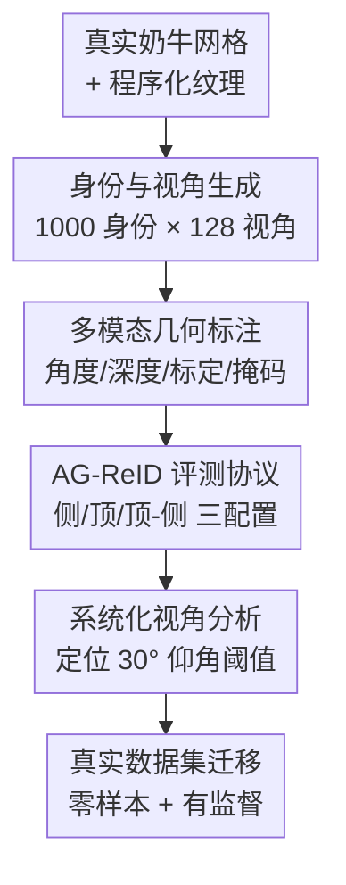

# MOO: A Multi-view Oriented Observations Dataset for Viewpoint Analysis in Cattle Re-Identification

**会议**: CVPR 2026 (CV4Animals Workshop)  
**arXiv**: [2603.04314](https://arxiv.org/abs/2603.04314)  
**代码**: https://github.com/TurtleSmoke/MOO (有)  
**领域**: 数据集 / 动物 Re-ID / 空地跨视角 (AG-ReID)  
**关键词**: 牛只重识别, 合成数据集, 视角分析, 仰角阈值, 空地跨视角

## 一句话总结
作者构建了一个名为 MOO 的大规模合成牛只重识别（ReID）数据集——1000 头牛、每头从 128 个均匀采样视角渲染（共 128,000 张带精确方位角/仰角标注的图像），用这套"可控变量"系统量化视角对带花纹动物 ReID 的影响，发现 $30^\circ$ 仰角是泛化能力的关键分水岭，并验证用 MOO 预训练能在 4 个真实牛只数据集上零样本/有监督双双涨点。

## 研究背景与动机
**领域现状**：动物 ReID（在不重叠相机间认出同一个体）是野生动物保护与畜牧自动化监控的核心技术。现实部署里相机摆放受限，常出现"空地跨视角"（Aerial-Ground ReID, AG-ReID）场景——无人机俯拍的图要和地面侧拍的图匹配，视角差异极大。

**现有痛点**：在人体 ReID 里视角依赖性已被充分研究，但动物领域几乎空白。这很要命，因为动物（如奶牛、海豹、豹）的花纹常常**左右不对称**，识别对视角变化极其敏感。而现有动物数据集要么只有固定俯拍/侧拍视角（农业数据集），要么视角虽多但采自不可控的野外（背景杂乱、遮挡、缺精确标注），都**无法把"视角影响"从"环境偏差"里剥离出来**做系统分析。

**核心矛盾**：要研究"视角到底如何影响识别"，需要的是**精确角度标注 + 受控环境**的数据；但真实采集很难同时满足这两点——野外不可控，农场视角又单一。现有数据集没有一个能提供连续覆盖的方位角（azimuth）和仰角（elevation）标注。

**本文目标**：① 造一个视角连续可控、标注精确的基准；② 第一次定量回答"仰角变化如何劣化带花纹动物的特征感知"；③ 验证这种合成几何先验能不能迁移到真实世界。

**切入角度**：用**合成渲染**绕开真实采集的不可控性——既然左右花纹不对称是识别的关键线索，那就用一个真实奶牛 3D 网格 + 程序化纹理生成大量"独一无二"的虚拟个体，再用虚拟相机在球面上均匀采样视角，把背景、光照、姿态全部固定为变量，只让视角变。

**核心 idea**：用受控合成数据把"视角"这一个变量隔离出来，系统标定它对 ReID 的影响，找出指导真实相机布点的几何规律。

## 方法详解

### 整体框架
MOO 不是一个新模型，而是"**数据集 + 系统分析 + 迁移验证**"三段式工作。整条流水线是：先用一个真实奶牛网格 + 程序化纹理批量生成 1000 个独特身份，再用虚拟相机在 16 方位 × 8 仰角的球面网格上渲染出 128,000 张带精确角度标注的图；然后在这套受控数据上按仰角/方位角切片训练 baseline，量化"训练视角—测试视角"的泛化矩阵，定位关键仰角阈值；最后把 MOO 当预训练源，在 4 个真实牛只数据集上检验零样本与有监督迁移收益。

### 关键设计

**1. 程序化身份与球面视角生成：把"视角"隔离成唯一变量**

要做视角的系统分析，最大障碍是真实数据里视角和背景、光照、个体差异全纠缠在一起。作者用一个真实奶牛 3D 网格在中性姿态下，通过 UV 映射叠加**程序化纹理生成**，造出 1000 个花纹各异、左右不对称的独特身份；所有图都带前景掩码渲染，直接消除了 ReID 里臭名昭著的背景偏差。视角由虚拟相机在**16 个方位角**（$\phi\in[0^\circ,360^\circ)$）× **8 个仰角**（$\theta\in[-20^\circ,85^\circ]$，相对水平侧视）的均匀网格上采样，并对方位/仰角分别加 $\pm10^\circ$/$\pm5^\circ$ 的随机抖动来模拟连续变化、避免网格过拟合。最终 Blender 渲染 $512\times512$ 分辨率，1000 身份 × 128 视角 = 128,000 张图。这样除了"视角"之外的一切都被钉死，分析结论才能干净归因到几何上

**2. 多模态几何标注：让数据集支撑超出 RGB 的视角研究**

光有图不够，做几何分析必须知道每张图"从哪个角度拍的"。MOO 为每张图提供完整标注：方位角与仰角 $(\phi,\theta)$、相机标定参数、身份标签，并额外渲染与 RGB 同视角的**深度图**。这是它相对现有数据集（如表 1 中只有 Az. 角的 CoBRA、完全无视角标注的 Top 类数据集）的核心区别——它是唯一同时给出连续 Az.+El. 角标注的数据集。正是这套精确角度元数据，才让后面"按仰角切 8 片、按方位切 4 片分别训练评测"成为可能，也让"按部署场景策略性挑选训练数据"变得可操作

**3. AG-ReID 评测协议：用"侧/顶/顶-侧"模拟真实空地匹配**

为对接真实的空地跨视角场景，作者把数据按 $30^\circ$ 仰角划界：低于 $30^\circ$ 记为**侧视（Side）**，高于 $30^\circ$ 记为**顶视（Top）**。数据集等分为 500 训练 + 500 测试身份，建立三种训练配置（Side-only / Top-only / Top-Side）与三种 query→gallery 评测协议（Top→Side、Side→Top、Top-Side→Top-Side）。这套协议直接复刻了"无人机查地面"或"地面查无人机"的非对称匹配难题，让 MOO 不只是张图集，而是一个能逼出跨视角泛化短板的真实可比基准

**4. 系统化视角影响分析：定位 30° 仰角这一泛化分水岭**

这是论文真正的"发现"型贡献。作者在受控数据上做两类切片实验：① **单视角专家**——在某一仰角分区训练、在其余分区测试，发现一个明显的**非对称退化**：高仰角训练的模型能很好泛化到低视角，反之不行，且 $\theta>30^\circ$ 时 ReID 才稳健（俯视保留了跨方位的共享特征，而侧视受自遮挡之害）；② **方位角影响**——侧面（Right/Left）训练近乎完美（mAP $>0.98$），而矢状面（Front/Back）显著更难，侧视平均比矢状视高约 20% mAP，因此相机应优先布在侧方。更反直觉的是：即便训练时覆盖全部仰角，"全视角模型"仍**追不上**各视角专家模型的上界——说明单纯堆数据规模解决不了跨视角泛化，这是个根本性局限

## 实验关键数据

### MOO 基准上的 AG-ReID（表 3，mAP）
即便是受控合成环境，跨视角匹配依然远未饱和——有监督上界（Top-Side 训练）仅 52.5% mAP。

| 训练配置 | Top→Side mAP | Side→Top mAP | Top-Side→Top-Side mAP |
|----------|:---:|:---:|:---:|
| Train Side | 13.1 | 13.0 | 20.6 |
| Train Top | 22.0 | 25.0 | 39.4 |
| Train Top-Side | **39.4** | **41.6** | **52.5** |

可见 Side→Top 场景下，只用侧视训练只有 13.0% mAP，只用顶视训练升到 25.0%，全视角训练才到 41.6%——跨视角泛化极难，且顶视训练明显优于侧视训练，印证了"高仰角更易泛化"。

### 方位角影响（表 2，同视角 setup 的 mAP）
| 训练\测试 | Right | Left | Front | Back | 平均 |
|-----------|:---:|:---:|:---:|:---:|:---:|
| Right | 0.98 | 0.99 | 0.16 | 0.15 | 0.63 |
| Left | 0.99 | 0.99 | 0.17 | 0.16 | 0.65 |
| Front | 0.42 | 0.42 | 0.56 | 0.24 | 0.40 |
| Back | 0.50 | 0.51 | 0.29 | 0.75 | 0.48 |

侧面（Right/Left）互相迁移近乎完美，但迁到 Front/Back 直接崩到 0.15~0.17；矢状面自身最高也只有 0.56/0.75，整体远逊于侧面。

### 真实世界迁移（表 4，节选 mAP）
在 FriesianCattle2015 (FC15)、FC17、AerialCattle2017 (AC17)、Cows2021 (C21) 四个真实数据集上，对比 ImageNet-21k baseline 与额外用 MOO 预训练：

| 初始化 | FC15 (零样本) | AC17 (零样本) | C21 (零样本) | FC15 (有监督) | AC17 (有监督) |
|--------|:---:|:---:|:---:|:---:|:---:|
| ImageNet21K | 51.1 | 55.5 | 9.4 | 73.7 | 81.8 |
| → MOO (All) | 59.2 | 67.5 | 13.4 | 89.2 | 82.4 |
| → MOO (Top) | **63.4** | 65.3 | **32.1** | **91.1** | **89.0** |

最亮眼的是顶视数据集 Cows2021：零样本 mAP 从 baseline 的 9.4% 跃升到 MOO-Top 预训练的 32.1%（All-views 只有 13.4%）——说明**按部署视角策略性挑选预训练数据**至关重要。

### 关键发现
- **30° 仰角阈值**：高于此值的俯视才能跨方位稳健 ReID，侧视受自遮挡拖累；这是论文最核心的可操作结论（指导相机布点）。
- **数据规模不是万能药**：即便全仰角覆盖，All-View 模型也追不上单视角专家上界，跨视角泛化存在根本性瓶颈。
- **视角对齐预训练才有用**：MOO-Top 在顶视目标集（C21）上零样本暴涨，而 MOO-All 反而平平——预训练视角要和部署视角匹配。
- **失败案例**：FriesianCattle2017 上 MOO 预训练在有监督下反而略降，作者归因于该数据集一帧多牛、遮挡、复杂背景等混淆因素。

## 亮点与洞察
- **"隔离单一变量"的实验哲学**：用合成数据把视角从背景/光照/姿态里彻底剥离，才得到干净可归因的几何结论——这套"造受控数据来做科学测量"的思路可迁移到任何"想量化某个变量影响却被现实纠缠"的视觉任务。
- **不对称退化的发现很反直觉**：高仰角→低视角能泛化、反之不行，揭示了俯视图在跨方位时保留了更多共享判别特征，对"该把无人机还是地面相机当主视角"有直接工程指导意义。
- **预训练视角匹配 > 预训练数据多样性**：MOO-Top 在顶视目标上完胜 MOO-All，提醒大家迁移学习里"对齐部署条件"比"堆多样性"更重要，可复用到其他域迁移场景。

## 局限与展望
- **合成-真实域差距仍在**：虽然零样本迁移涨点，但毕竟是程序化纹理 + 单一中性姿态的奶牛网格，真实牛的姿态多样性、形变、毛发细节没建模，结论外推到其他物种（豹、海豹）需谨慎。
- **只用单一 ViT baseline 做分析**：所有视角结论都基于 ImageNet-21k 预训练 ViT + FC 头这一种架构，换更强的 ReID 专用模型，30° 阈值是否依旧成立未验证。
- **"同视角 setup"分析的可比性**：表 2 的方位角矩阵在"query/gallery 同分区"下测，和真实跨视角检索的难度不直接等价，横向比大小要留意 caveat。
- **改进思路**：引入姿态/形变多样性、多物种纹理，把"30° 阈值"是否物种无关做成更普适的结论；以及把深度图标注利用起来做显式几何对齐的 ReID 模型。

## 相关工作与启发
- **vs 农业固定视角数据集（OpenCows2020 / Cows2021 / MVCAID100）**: 它们只有单一俯拍或侧拍、无连续视角标注；MOO 提供全视角覆盖 + 精确 Az./El. 角，第一次让视角影响可系统测量。
- **vs 野外野生动物数据集（ATRW / LeopardID / CzechLynx）**: 视角虽多但环境不可控、遮挡背景杂乱，无法剥离视角与环境偏差；MOO 用合成渲染换来纯净的受控变量。
- **vs 视角不变 ReID 方法（度量学习 / 3D 纹理展开 / 多分支网络）**: 那些工作是"造模型抗视角"，本文是"造数据+做分析量化视角到底多伤特征"，为前者提供可指导建模的基础测量。
- **vs 人体 ReID 的视角研究**: 人体领域早有视角依赖性量化，本文把这套系统分析第一次搬到带不对称花纹的动物上，填补领域空白。

## 评分
- 新颖性: ⭐⭐⭐⭐ 第一个带连续 Az./El. 角标注的合成动物 ReID 数据集，"30° 仰角阈值"是有价值的新发现
- 实验充分度: ⭐⭐⭐⭐ 视角切片分析 + 4 个真实数据集零样本/有监督双设置验证，较扎实；但只用单一 baseline 架构
- 写作质量: ⭐⭐⭐⭐ 动机—数据—分析—迁移逻辑清晰，图表支撑到位
- 价值: ⭐⭐⭐⭐ 给畜牧监控的相机布点和迁移预训练数据选择提供了直接可操作的工程指导

<!-- RELATED:START -->

## 相关论文

- [\[CVPR 2026\] SDF-Net: Structure-Aware Disentangled Feature Learning for Optical-SAR Ship Re-identification](sdfnet_structureaware_disentangled_feature_learnin.md)
- [\[CVPR 2025\] EarthDial: Turning Multi-sensory Earth Observations to Interactive Dialogues](../../CVPR2025/remote_sensing/earthdial_turning_multi-sensory_earth_observations_to_interactive_dialogues.md)
- [\[NeurIPS 2025\] GreenHyperSpectra: A Multi-Source Hyperspectral Dataset for Global Vegetation Trait Prediction](../../NeurIPS2025/remote_sensing/greenhyperspectra_a_multi-source_hyperspectral_dataset_for_global_vegetation_tra.md)
- [\[CVPR 2026\] Olbedo: An Albedo and Shading Aerial Dataset for Large-Scale Outdoor Environments](olbedo_an_albedo_and_shading_aerial_dataset_for_large-scale_outdoor_environments.md)
- [\[CVPR 2026\] RHO: Robust Holistic OSM-Based Metric Cross-View Geo-Localization](rho_robust_holistic_osm-based_metric_cross-view_geo-localization.md)

<!-- RELATED:END -->
