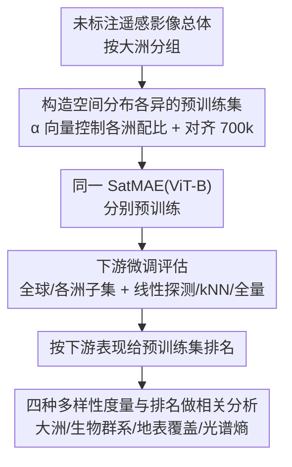

# Pretrain Where? Investigating How Pretraining Data Diversity Impacts Geospatial Foundation Model Performance

**会议**: CVPR 2026  
**arXiv**: [2604.21104](https://arxiv.org/abs/2604.21104)  
**代码**: https://github.com/kerner-lab/pretrain-where (有)  
**领域**: 遥感 / 地理空间基础模型 / 自监督预训练  
**关键词**: 地理空间基础模型, 预训练数据分布, 数据多样性, 光谱熵, 实证研究

## 一句话总结
这是第一篇系统隔离"预训练数据的地理构成"对地理空间基础模型下游性能影响的实证研究：作者用同一个 SatMAE 架构、在按大洲切分的多套等规模预训练集上反复预训练+微调，发现仅用欧洲数据预训练在全球和各大洲下游任务上都最强，而真正与性能强相关的不是大洲/生物群系/地表覆盖多样性，而是"逐样本光谱熵"（ρ=0.84）。

## 研究背景与动机
**领域现状**：遥感/地理空间基础模型（RSFM，如 SeCo、CROMA、Prithvi、Galileo、MMEarth、SatlasNet）几乎每提出一个新架构就同时带来一套新的预训练数据集，而这些数据集的空间采样策略五花八门——有的围着城市中心采（SeCo），有的按生物群系平衡采（MMEarth），有的按地表覆盖类别采（Prithvi/Galileo），有的按全球均匀网格采（MajorTOM、CopernicusFM）。

**现有痛点**：当一个新模型刷新了 SOTA，提升到底来自新架构、新模态，还是来自那套新数据集？现有工作几乎都把功劳归给架构或输入模态，预训练数据集的贡献被系统性忽略了。这导致架构进步难以解释、也未必可叠加——你不知道换个数据集还能不能复现这个增益。

**核心矛盾**：扫学习率这类超参很容易，但"扫预训练数据集"代价极其高昂（每换一套数据就要重新预训练一遍大模型），实践上不可行；而搜索空间还会随着可选的地理单元（大洲、生物群系、地表覆盖）爆炸式增长。于是大家干脆不研究它。

**本文目标**：在严格控制架构与训练流程不变的前提下，回答两个子问题——（1）预训练数据的地理构成到底对下游性能有多大影响、什么样的构成最好？（2）能不能找到一个廉价可算的"数据集多样性"指标，用来在不重训的情况下预判一套预训练集好不好？

**切入角度**：作者把"大洲"当作互斥且穷尽的空间分组，构造一系列只在地理分布上不同、其余完全相同（同架构、同规模 700k、同训练流程）的预训练集，从而把数据分布这一个变量真正隔离出来；并把它的影响幅度和"学习率"这种核心超参直接对比。

**核心 idea**：用受控对照实验隔离"预训练数据地理分布"这一单一变量，再用多种多样性度量去解释性能差异，最终发现样本级光谱复杂度（而非地理覆盖广度）才是关键。

## 方法详解

### 整体框架
这是一篇实证研究，"方法"即一条受控实验流水线（论文 Figure 2），目标是把"预训练数据的地理分布"从架构等其它因素里剥离出来单独考察。整条管线分四步：(a) 构造一组只在大洲分布上不同、规模都对齐到 700k 的预训练数据集；(b) 用同一个 SatMAE（ViT-Base）在每套数据上分别预训练；(c) 在一批全球及按大洲切分的下游任务上微调评估（线性探测为主，辅以 kNN 和全量微调）；(d) 按下游表现给各预训练集排名，再分析"排名"与四种数据多样性度量的相关性，找出能预测性能的多样性维度。

### 关键设计

**1. 用 group-allocation 向量构造"只在地理分布上不同"的预训练集**

要隔离数据分布这一个变量，就必须让被比较的数据集除了地理构成以外完全一样。作者沿用 Rolf 等人的数据集构造框架：把样本总体划分为互斥且穷尽的组 $g\in G$（这里取六大洲，排除南极洲），用配比向量 $\vec{\alpha}\in\Delta^{|G|}$ 控制最终数据集里各组的占比，其中 $\alpha_g:=\frac{1}{n}\sum_{i=1}^n \mathbf{I}[g_i=g]$。据此构造三类极端配置：**One-hot-<大洲>**（$\vec{\alpha}$ 某一维为 1、其余为 0，即全部样本来自单一大洲，如 One-hot-Asia 为 $[1,0,0,0,0,0]$）、**Global**（六洲均分 $[1/6,\dots,1/6]$）、以及 **Zero-pretraining**（随机初始化、不预训练的基线）。所有数据集规模都对齐到 SatMAE 原始预训练集 FMoW 的 700k，确保"数据量"不成为混淆因素。这样一来，下游性能差异就只能归因于地理分布本身。

**2. 全球 + 按大洲双层下游评估，用三种探测方式交叉验证**

光看全球任务还不够，作者想知道"地理对齐"假设是否成立——即用某洲数据预训练是否对该洲下游任务最好。为此每个下游任务都切出 **global 子集**（各洲等量采样）和 **per-continent 子集**（只取单一大洲），覆盖场景分类（FMoW-Sentinel 62 类）、人口密度回归（MOSAIKS）、地表覆盖分割（ForTy 8 类）和综合基准 GEO-Bench（6 个 Sentinel-2 任务），所有下游标注子集都 <5k。评估以**线性探测**（冻结预训练权重、只训分类/回归/分割头）为主，并额外用 **kNN** 和**全量微调**在 FMoW-global 上交叉验证。三种探测方式得到一致的相对排名，说明观测到的差异来自预训练数据本身，而非某种评估设置的伪影。

**3. 四种多样性度量，特别是逐样本光谱熵**

为了找一个不用重训就能预判数据集好坏的指标，作者对每套预训练集计算四种多样性，前三种都是数据集级的香农熵 $H=-\sum_k p_k\log p_k$：**大洲多样性**（影像在各洲分布的熵）、**生物群系多样性**和**地表覆盖多样性**（按各类覆盖面积占比 $p_c=A_c/A_{\text{total}}$ 算熵，分别用 RESOLVE 15 类生物群系和 ESA WorldCover 11 类地表覆盖）。第四种**光谱多样性**是本文的关键创新，它是样本级而非数据集级的：对每张影像 $i$ 的每个波段 $b$，把像素值划成 $K=100$ 个 bin 得到分布 $p_{i,b,k}=h_{i,b,k}/N_{i,b}$，算出该波段光谱熵 $H_{i,b}=-\sum_k p_{i,b,k}\log p_{i,b,k}$，再对所有波段取平均得样本熵 $H_i=\frac{1}{|\mathcal{B}|}\sum_b H_{i,b}$，最后对全数据集取均值 $H_{\text{spectral}}=\frac{1}{|\mathcal{I}|}\sum_i H_i$。这一指标刻画的是"单张训练样本内部的光谱复杂度"，而非地理覆盖的广度。除自建的 7 套数据集外，作者还把 FMoW、SSL4EO-S12、SSL4Eco 三套已发布数据集纳入多样性分析，共 10 套，用于和性能做相关性回归。

### 损失函数 / 训练策略
本文不改训练目标，沿用 SatMAE 的掩码自编码器（MAE）自监督预训练（ViT-Base，作者官方代码与默认超参）。下游线性探测/全量微调时唯一调的超参是学习率，从 $\{1,3,5,8\}\times\{10^{-1},\dots,10^{-5}\}$ 网格里按验证集挑最优；kNN 在 $K\in\{1,3,\dots,320\}$ 上扫。所有结果跨 5 个随机数据种子，报告均值与 95% 置信区间。

## 实验关键数据

### 主实验
全球下游任务上各预训练策略的线性探测对比（Rank 越小越好），One-hot-Europe 全面领先：

| 预训练 | FMoW (Acc↑) | MOSAIKS人口 (R²↑) | ForTy (F1↑) | GEO-Bench↑ | Rank↓ |
|--------|------|------|------|------|------|
| One-hot-Europe | **0.33** | **0.23** | **0.37** | **0.51** | **0.00** |
| One-hot-North-America | 0.32 | 0.22 | 0.36 | 0.49 | 1.00 |
| One-hot-South-America | 0.27 | 0.20 | 0.36 | 0.49 | 1.50 |
| One-hot-Asia | 0.27 | 0.20 | 0.35 | 0.47 | 2.00 |
| Global | 0.23 | 0.17 | 0.35 | 0.46 | 2.75 |
| One-hot-Oceania | 0.23 | 0.14 | 0.33 | 0.45 | 3.50 |
| One-hot-Africa | 0.15 | 0.08 | 0.31 | 0.41 | 4.50 |
| Zero-pretraining | 0.12 | 0.03 | 0.30 | 0.46 | 5.25 |

仅换源大洲就带来 10–21 个指标点的差距；One-hot-Europe 在 FMoW 上比 Global 高 10 个百分点（33% vs 23%），且差距大于置信区间。值得注意的是 Global（六洲均分）只排第 5，反直觉地不如多个单洲方案。

FMoW-global 上换 kNN / 全量微调，相对排名完全一致：

| 预训练 | kNN | 全量微调 |
|--------|------|------|
| One-hot-Europe | **0.31** | **0.66** |
| One-hot-North-America | 0.26 | 0.63 |
| One-hot-South-America | 0.27 | 0.62 |
| One-hot-Asia | 0.27 | 0.60 |
| Global | 0.27 | 0.54 |
| One-hot-Oceania | 0.25 | 0.46 |
| One-hot-Africa | 0.22 | 0.30 |
| Zero-pretraining | 0.11 | 0.22 |

最好与最差预训练在 kNN 上差 20%、在全量微调上差 44%。

四种多样性与平均下游性能的相关性（10 个数据点，需谨慎解读）：

| 多样性度量 | 相关系数 ρ | p 值 | 结论 |
|------|------|------|------|
| 大洲多样性 | 0.42 | 0.221 | 弱相关 |
| 生物群系多样性 | 0.43 | 0.213 | 弱相关 |
| 地表覆盖多样性 | 0.30 | 0.403 | 弱相关 |
| **光谱多样性（逐样本熵）** | **0.84** | **0.002** | **强相关** |

### 消融实验
本文是实证研究，"消融"体现为对关键变量的对照分析：

| 对照配置 | 关键发现 | 说明 |
|------|---------|------|
| 三种探测方式（线性/kNN/全量） | 相对排名完全一致 | 差异来自预训练数据，非评估设置伪影 |
| 5k 微调 vs 700k 全量微调（Figure 4） | 性能方差缩小但未消失，最好/最差仍差 >10 个点 | 大规模微调无法完全抹平预训练初始化差异 |
| 各洲下游子集（Figure 3） | One-hot-Europe 在几乎所有大洲子集上都最强 | "地理对齐"假设不成立 |
| Global vs 单洲 | Global 仅排第 5 | "全球分布最泛化"的直觉被推翻 |

### 关键发现
- **地理对齐假设被证伪**：用某洲数据预训练并不在该洲下游任务上最优（仅 North-America 在自己的子集上略胜 One-hot-Europe），欧洲数据反而几乎在所有大洲子集上最强——泛化能力不来自地理匹配。
- **预训练影响难以靠微调抹平**：即便把微调集放大到与预训练同规模（700k），最好与最差预训练仍相差超 10 个百分点，说明初始化差异有持久性。
- **光谱熵才是真正的预测因子**：四种多样性里只有逐样本光谱熵强相关（ρ=0.84），大洲/生物群系/地表覆盖均弱相关。Figure 6 直观印证——One-hot-Africa/Oceania/Asia/Europe 的平均光谱熵依次为 1.61/2.13/2.30/2.46，恰与性能排序同向。

## 亮点与洞察
- **把"换数据集"当成和"换学习率"一样的一等变量来量化**：作者直接对比"换源大洲"和"扫学习率"的影响幅度，并证明前者影响更大（Figure 1），一句话就让"预训练数据被忽视"这个问题有了分量。
- **发现一个反直觉且稳健的结论**：Europe-only 全面碾压 Global 和地理对齐方案，且这个排名跨任务、跨探测方式、跨微调规模都稳定，不是偶然。这提醒整个 RSFM 社区：堆地理覆盖广度未必划算。
- **提出可迁移的廉价代理指标**：逐样本光谱熵不需要重训模型就能算，可作为构造/筛选预训练集的实用准则——这个"样本级复杂度 > 覆盖广度"的洞察，对自然图像、医学影像等其它领域的数据策展同样有启发。
- **开源 7 套空间分布各异的预训练集 + 模型库 + 实验框架**，让"预训练数据消融"这件昂贵的事变得可复现。

## 局限与展望
- **只测了一个架构**：作者出于算力考虑只用 SatMAE（ViT-B + MAE）做了透彻实验，结论能否推广到 CROMA、Galileo、SatCLIP 等不同架构/目标的模型仍待验证（作者据 Entezari 等人的跨架构证据推测可迁移，但未实测）。
- **相关性样本量小**：多样性—性能相关只基于 10 套数据集，ρ=0.84 虽显著（p=0.002）但点数少，作者自己也提醒需谨慎；要确立普适性还需更多预训练集。
- **"为什么是欧洲"只给了相关性解释**：光谱熵高解释了欧洲数据为何强，但这是相关而非因果机制；是否还有采集传感器、地物纹理等隐藏混淆，论文未深挖。
- **下游标注子集都 <5k**：受标注稀缺限制，下游评估规模偏小，极大规模下游场景下结论是否依旧，仍是开放问题。

## 相关工作与启发
- **vs SSL4Eco [26]**：同样隔离预训练数据的影响，但 SSL4Eco 只是把 SeCo 在自己的数据上重训一次做对比；本文系统地构造了一整族按大洲/全球切分的受控数据集，并进一步追问"什么多样性指标能预测性能"，研究更彻底。
- **vs Purohit et al. [27]**：他们比较了按大洲/生物群系/自然森林/世界城市等采样方式，结论是"平衡构成常优于区域特定"；本文结论部分相反——单洲（尤其欧洲）反超全球平衡，并把差异归因到更细的样本级光谱复杂度而非粗粒度地理覆盖。
- **vs 自然图像领域的预训练数据研究 [10,11,29]**：CV 社区早已发现数据分布是迁移性能的最大因素、且微调数据增多会削弱预训练影响；本文把这套问题首次系统搬到地理空间领域，并验证"微调放大但不消除差异"在 RSFM 上同样成立。

## 评分
- 新颖性: ⭐⭐⭐⭐ 首个系统隔离地理构成影响的 RSFM 研究，且光谱熵这一预测指标的发现反直觉、有价值。
- 实验充分度: ⭐⭐⭐⭐ 跨 4 类下游任务、3 种探测方式、5 个种子、全球+各洲双层评估，受控严谨；仅架构单一、相关分析样本量小。
- 写作质量: ⭐⭐⭐⭐ 问题动机清晰、结论层层递进，图表与论证对得上。
- 价值: ⭐⭐⭐⭐ 给"预训练数据策展该看什么"提供了可操作的廉价代理指标，对 RSFM 数据集设计有直接指导意义。

<!-- RELATED:START -->

## 相关论文

- [\[CVPR 2026\] HyperFM: An Efficient Hyperspectral Foundation Model with Spectral Grouping](hyperfm_an_efficient_hyperspectral_foundation_model_with_spectral_grouping.md)
- [\[CVPR 2026\] Data Leakage Detection and De-duplication in Large Scale Geospatial Image Datasets](data_leakage_detection_and_de-duplication_in_large_scale_geospatial_image_datase.md)
- [\[NeurIPS 2025\] GeoLink: Empowering Remote Sensing Foundation Model with OpenStreetMap Data](../../NeurIPS2025/remote_sensing/geolink_empowering_remote_sensing_foundation_model_with_openstreetmap_data.md)
- [\[CVPR 2026\] UniGeoSeg: Towards Unified Open-World Segmentation for Geospatial Scenes](unigeoseg_towards_unified_open-world_segmentation_for_geospatial_scenes.md)
- [\[ICCV 2025\] Towards a Unified Copernicus Foundation Model for Earth Vision](../../ICCV2025/remote_sensing/towards_a_unified_copernicus_foundation_model_for_earth_vision.md)

<!-- RELATED:END -->
