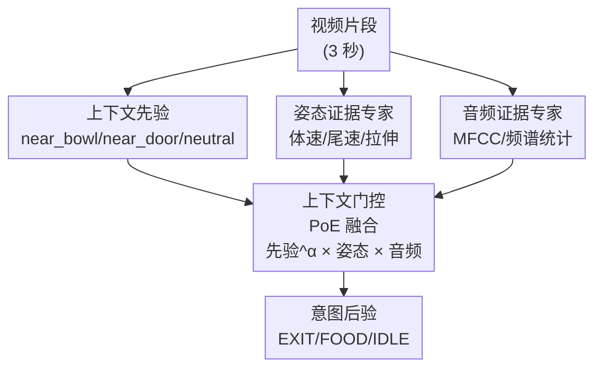

# Context as Prior: Bayesian-Inspired Intent Inference for Non-Speaking Agents with a Household Cat Testbed

**会议**: CVPR 2026  
**arXiv**: [2604.27445](https://arxiv.org/abs/2604.27445)  
**代码**: 无（论文未提供）  
**领域**: 机器人 / 具身智能 / 多模态意图推断  
**关键词**: 意图推断、非语言智能体、贝叶斯先验、Product-of-Experts、捷径学习

## 一句话总结
针对无法用语言表达目标的智能体（宠物、婴儿等），本文把"空间上下文"当成贝叶斯先验而非普通输入特征，用一个上下文门控的 Product-of-Experts（PoE）框架融合上下文先验、姿态证据和音频证据，在家猫意图推断测试床上把整体准确率从特征拼接的 71.83% 提到 77.72%，并大幅压低"看见碗就猜吃饭"这类上下文捷径错误。

## 研究背景与动机
**领域现状**：家庭和共享环境里越来越多智能体无法用自然语言可靠表达意图——宠物、前语言期婴儿、其他非语言具身伙伴。要服务它们，系统只能从**不完整的行为观测**里反推意图，而不是听从明确口令。现有动物行为分析工作（DeepLabCut、SLEAP、MammalNet 等）大多停在"可观测的动作/姿态类别"识别，很少触及背后的**潜在目标推断**。

**现有痛点**：行为线索本身往往是噪声大、信息不足的——运动模式会在不同目标间重叠，叫声又稀疏不一致；单靠姿态和音频常常无法消歧。环境上下文虽然信息量很大（猫在门边大概率想出门、在碗边大概率想吃饭），但**上下文单独无法判断**这段视频是"真在追求目标"还是"只是恰好待在那儿发呆"。

**核心矛盾**：如果把上下文当成普通特征喂进判别模型，模型很容易塌缩到捷径规则——`near_bowl → FOOD`、`near_door → EXIT`——无视实际行为证据。这正是 shortcut learning 在强相关上下文下的典型病。任务本质是**非对称**的：上下文强约束"哪些意图可行"，但不能决定"此刻是否真在执行该意图"。

**本文目标**：在强上下文先验的家庭环境里，把"在某上下文内区分目标导向行为 vs 兼容该上下文的发呆"这件事做对，同时既利用上下文又不被它带偏。

**切入角度**：作者从贝叶斯视角重新framing这个问题——上下文天然就是关于可行目标的**先验** $P(y\mid c)$，姿态和音频是用来更新先验的**证据**。这个角度有希望，因为它在结构上就把"上下文该约束什么"和"行为该裁决什么"分开了。

**核心 idea**：用"上下文当先验、行为当证据"的 Product-of-Experts 后验融合，代替"上下文当普通特征"的朴素拼接，从而在保留上下文约束力的同时让行为证据有机会推翻捷径。

## 方法详解

### 整体框架
方法叫 **CatSignal**。给定一段视频片段，模型抽取三路信息——空间上下文、姿态动力学、声学特征，每一路各自产出一个对意图类别 $y\in\{\text{EXIT},\text{FOOD},\text{IDLE}\}$ 的分布；最终预测由**上下文门控的 PoE 融合**得到一个"类后验"分布。关键在于三路的角色不对等：上下文那一路被当作先验 $P(y\mid c)$（低维、固定不训练），姿态和音频两路是被训练的"专家"证据 $P(y\mid x_{\text{pose}})$、$P(y\mid x_{\text{audio}})$，三者相乘归一化得到后验。

### 关键设计

**1. 上下文当先验，而非普通特征：把可行性约束和行为裁决解耦**

这是全文的支点，针对"上下文当特征会塌缩成捷径"这个痛点。作者把离散空间状态 $c\in\{\texttt{near\_bowl},\texttt{near\_door},\texttt{neutral}\}$ 解释成一个先验式约束 $P(y\mid c)$：它只编码粗粒度的环境可行性——例如 $P(\text{EXIT}\mid\texttt{near\_door})$ 很高、$P(\text{FOOD}\mid\texttt{near\_door})$ 几乎为零。在保留数据集里，near_bowl 区只出现 FOOD 和 IDLE，near_door 区只出现 EXIT 和 IDLE，neutral 区只有 IDLE。这样上下文负责"砍掉不可行的意图"，但**故意不让它决定** EXIT/FOOD 还是 IDLE——那一步留给行为证据。区别于把 $c$ 拼进特征向量后让模型自由学习关联（那会直接学成"碗→吃"），这里上下文的影响力被结构性地限定在先验项里。

**2. 姿态与音频双证据专家：提供能推翻先验的行为信号**

针对"先验不足以区分目标导向 vs 发呆"。用 DeepLabCut 估计 2D 关键点，抽取体速、身体拉伸、尾速、尾摆等运动学描述子，定义姿态专家 $P(y\mid x_{\text{pose}})$；从与姿态时间窗同步的音频里抽 MFCC 和频谱统计，定义音频专家 $P(y\mid x_{\text{audio}})$。两个专家给出的是各自模态视角下的意图分布，它们才是在同一上下文内把"正在求门"和"只是在门边发呆"分开的依据。之所以要双模态，是因为单一模态都不够——运动模式会跨目标重叠、叫声稀疏；论文分析还发现音频判别力往往更强，姿态受大幅/模糊运动下关键点稳定性拖累

**3. 上下文门控的 Product-of-Experts 后验融合：让先验和证据相乘而非相加**

把先验和两路证据用 PoE 形式组合：

$$\tilde{P}(y\mid x_{\text{all}})\propto P(y\mid c)^{\alpha}\cdot P(y\mid x_{\text{pose}})\cdot P(y\mid x_{\text{audio}})$$

其中 $\alpha$ 调节上下文先验的强度，归一化后即用于预测的类后验。相乘（PoE）而非相加（late-fusion average）的好处是：任一专家若对某类给出接近 0 的概率，就能"否决"该类——这正好对应"先验把不可行意图压到接近零"的语义，也让强证据能把先验偏好的类拉下来（论文图示的近门例子：上下文偏 EXIT，但姿态+音频偏 IDLE，PoE 后验最终倒向 IDLE）。$\alpha$ 给了一个旋钮：$\alpha=0$ 等于丢掉上下文，性能崩塌；$\alpha=1.0$ 整体最优，主实验即用此值。注意作者只训练姿态/音频专家、固定低维上下文专家，因此虽不是完全生成式贝叶斯模型，却保住了"上下文是先验结构而非普通特征"这一核心区分

## 实验关键数据

数据集是真实家庭环境录制的 34 段家猫视频，总时长 1855.76 秒；经姿态有效性过滤后保留 212 个 3 秒片段。三类意图（EXIT/FOOD/IDLE）按**事后行为结果**回溯打标（如开门后真离开记为 EXIT）。评估用 Leave-One-Video-Out（LOVO）交叉验证，测的是跨录制 session 的泛化而非视频内时间插值。

### 主实验

| 方法 | Acc.(%) | Std.(%) | Macro-F1 |
|------|---------|---------|----------|
| Context-only | 60.87 | 48.80 | 0.7117 |
| Audio-only | 50.87 | 38.76 | 0.4977 |
| Pose-only | 39.36 | 36.25 | 0.3623 |
| Feature Concat | 71.83 | 35.35 | 0.6666 |
| LateFusion-Avg | 73.69 | 33.88 | 0.7666 |
| LateFusion-Weighted | 73.76 | 32.02 | 0.7454 |
| PoE-Ctx+Pose | 60.55 | 43.56 | 0.6729 |
| PoE-Ctx+Aud | 75.31 | 35.77 | 0.7549 |
| **Prior-Guided PoE (Full)** | **77.72** | 33.24 | 0.7460 |

完整 PoE 模型整体准确率最高（77.72%），优于特征拼接（71.83%）、late-fusion（~73.7%）和部分专家变体。单模态都不够：姿态最弱（39.36%），音频中等（50.87%），上下文虽强（60.87%）但不完整——它无法区分目标导向与兼容上下文的发呆。

### 消融实验（先验强度 $\alpha$）

| $\alpha$ | Acc.(%) | Std.(%) | Macro-F1 |
|----------|---------|---------|----------|
| 0.0 | 45.60 | 37.01 | 0.4156 |
| 0.3 | 73.10 | 35.19 | 0.6577 |
| 0.5 | 75.42 | 34.71 | 0.6922 |
| 0.8 | 75.75 | 34.14 | 0.7100 |
| **1.0** | **77.72** | 33.24 | 0.7460 |
| 1.2 | 75.11 | 34.27 | 0.7244 |

$\alpha=0$（丢掉上下文）准确率塌到 45.60%，说明先验不可或缺；中到满强度（0.5–1.0）最好，$\alpha=1.0$ 整体最优，超过 1.2 反而回落——先验太强又开始挤压证据。

### 关键发现
- **捷径错误显著下降**：在模糊上下文里，Context-only 对 IDLE 样本 100% 失败（完全塌缩成捷径）。本文 PoE 在 near_bowl 区把 IDLE→FOOD 的捷径错误率从 late-fusion 的 18.5% 降到 3.7%；near_door 区也更好（38.7% vs 51.6%），但优势更小。
- **诚实的 trade-off**：⚠️ 本文并非全面碾压——Macro-F1 上 PoE（0.7460）反而略低于 LateFusion-Avg（0.7666）；选择性预测（accuracy–coverage）上 late-fusion 的累积准确率更强。论文坦承简单融合在 Macro-F1 和置信度质量上仍有竞争力，本文的卖点是**整体准确率最高 + 最能压住上下文捷径塌缩**。
- **上下文+音频已很强**：PoE-Ctx+Aud 单独就有 75.31%，完整模型只多 ~2.4 个点。作者推测当前家庭数据集里叫声往往高度判别，而姿态受运动模糊和关键点稳定性限制。

## 亮点与洞察
- **把"角色不对称"写进模型结构**：最妙的是没有用更大的网络或更多数据去硬学"何时该信上下文"，而是用 PoE 的乘性结构 + 先验指数 $\alpha$，在数学形式上就规定了"上下文只能约束可行性、证据负责裁决"。这种"用结构约束代替数据约束"的思路可迁移到任何"强相关 spurious 特征"的任务。
- **先验当指数项的旋钮**：$P(y\mid c)^{\alpha}$ 把"信多少上下文"变成一个连续可调、可消融的标量，既能定量展示捷径与证据的张力（$\alpha$ 扫描曲线），也给部署时按场景调强弱留了接口。
- **任务 framing 本身是贡献**：把非语言智能体的行为理解从"多模态分类"重新表述为"强上下文先验下的概率意图推断"，这个视角对婴儿、康复、HRI 等场景都有启发——很多看似分类的问题其实是先验+证据的后验推断。

## 局限与展望
- **作者承认**：刻意定位为家猫 proof-of-concept；标签空间只有 3 类且回溯打标；姿态预处理会过滤掉关键点不足的片段，可能连带丢掉信息量大的剧烈运动段，反而削弱姿态专家。
- **自己发现的**：数据规模极小（212 个 3 秒片段、34 段视频），LOVO 下标准差高达 ~33%，结论的统计稳健性存疑；上下文 $c$ 是人工离散化的三状态，怎么从原始视频自动、连续地估计上下文先验没有解决；"intent"是 outcome-verified 的事后标签，并非实时可得，落地到真正的在线意图推断还有距离。
- **改进思路**：把离散上下文先验换成可学习的、从空间布局自动推断的连续先验；扩到多家庭、多物种、更丰富的意图集合；针对姿态专家弱的问题，引入对运动模糊更鲁棒的关键点或时序模型，而不是直接过滤掉难样本。

## 相关工作与启发
- **vs 特征拼接 / late-fusion（Feature Concat、LateFusion-Avg/Weighted）**: 它们把上下文当普通模态特征做加性/拼接融合，在强相关上下文下容易学成捷径；本文用乘性 PoE 把上下文降格为先验项，整体准确率更高、捷径错误更低，代价是 Macro-F1 与选择性预测上不占优。
- **vs Product-of-Experts 原型（Hinton 2002；Wu & Goodman 2018）**: 经典 PoE 把多模态当对等专家相乘；本文的差异是引入**上下文门控 + 先验指数 $\alpha$**，让其中一路（上下文）扮演不可训练的先验而非对等专家，强调"先验 vs 证据"的角色区分。
- **vs 贝叶斯 theory-of-mind / inverse planning（Baker 等；Rabinowitz 等 Machine ToM）**: 那一脉做的是显式生成式的目标推断；本文坦承自己不是完全生成式贝叶斯模型，而是借用贝叶斯直觉的判别式近似，工程上更轻、更易在小数据真实宠物视频上落地。
- **vs 动物行为分析（DeepLabCut、SLEAP、MammalNet）**: 它们聚焦可观测的姿态/动作识别，本文把这些工具（DeepLabCut 关键点）当作前端证据抽取器，目标上移到**潜在意图**推断。

## 评分
- 新颖性: ⭐⭐⭐⭐⭐ 把"上下文当先验、PoE 解耦角色"用来治多模态捷径学习，framing 清晰、切口巧；但 PoE 本身是成熟工具，创新在用法而非机制。
- 实验充分度: ⭐⭐⭐ 数据集仅 212 片段、单一家庭单只猫，标准差极大，更像 proof-of-concept；好在消融和捷径分析诚实、有 caveat。
- 写作质量: ⭐⭐⭐⭐⭐ 问题动机和方法角色讲得很透，先验/证据/后验的对应关系清楚，且坦白承认 Macro-F1 不占优。
- 价值: ⭐⭐⭐⭐ 思路对"非语言智能体意图推断"和"强相关上下文去捷径"有启发，但当前规模决定其更偏概念验证而非可直接复用的系统。

<!-- RELATED:START -->

## 相关论文

- [\[CVPR 2026\] Boosting Vision-Language-Action Finetuning with Feasible Action Neighborhood Prior](boosting_vision-language-action_finetuning_with_feasible_action_neighborhood_pri.md)
- [\[NeurIPS 2025\] Benchmarking Egocentric Multimodal Goal Inference for Assistive Wearable Agents](../../NeurIPS2025/robotics/benchmarking_egocentric_multimodal_goal_inference_for_assist.md)
- [\[CVPR 2026\] Adaptive Action Chunking at Inference-time for Vision-Language-Action Models](adaptive_action_chunking_at_inference-time_for_vision-language-action_models.md)
- [\[AAAI 2026\] Realistic Synthetic Household Data Generation at Scale](../../AAAI2026/robotics/realistic_synthetic_household_data_generation_at_scale.md)
- [\[CVPR 2026\] Global Prior Meets Local Consistency: Dual-Memory Augmented Vision-Language-Action Model for Efficient Robotic Manipulation](global_prior_meets_local_consistency_dual-memory_augmented_vision-language-actio.md)

<!-- RELATED:END -->
