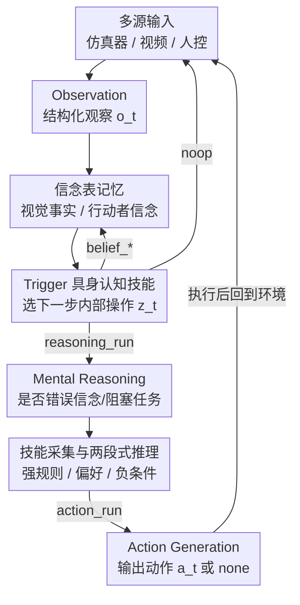

# MindClaw: Closed-Loop Embodied Mental-State Reasoning for Precision Intervention

**会议**: CVPR 2026  
**arXiv**: [2606.01063](https://arxiv.org/abs/2606.01063)  
**代码**: 无  
**领域**: 机器人 / 具身智能 / 心智理论(ToM)  
**关键词**: Theory of Mind、精准干预、闭环具身、信念记忆、触发技能  

## 一句话总结
把机器人的「心智理论」推理从「看完一段视频后输出最终动作」改造成实时闭环系统——核心是把「下一步该更新记忆 / 推理 / 行动 / 还是什么都不做」当成一个可学习的**具身认知技能(Trigger)**来调度，让机器人只在真正需要时才介入，在 MindPower benchmark 上把任务准确率与精准干预准确率显著拉高。

## 研究背景与动机

**领域现状**：心智理论(Theory of Mind, ToM)让 agent 能推断他人的信念、目标、意图，是人本具身辅助的关键能力。近年的文本与多模态 ToM benchmark（FANToM、Hi-ToM、MMToM-QA、MuMA-ToM 等）已经能测模型对「角色心智状态」的识别。

**现有痛点**：这些 benchmark 几乎都把 ToM 当成**离线识别 / 问答**——给一段固定的故事或视频，让模型预测某个角色的信念或目标标签。这种 formulation 测不出一个具身助手能否：保持与变化环境的连接、随时间维护「针对特定行动者」的信念、判断「此刻该不该启动推理」、以及「该不该动手」。结果是模型能答对 ToM 问题，却当不了一个好用的交互助手。

**核心矛盾**：本文的前作 MindPower 已经迈出一步——引入「机器人中心」的推理层级（感知→信念→欲望→意图→决策→动作），但它仍把辅助表示成「观察完整场景后输出一个最终决策/动作」的**静态 video-to-text**。真实的具身辅助不等于「永远输出一个动作」：在人本环境里，不必要的帮助是打扰甚至有害的；如果人正常推进任务，正确的机器人动作是**不动**。所以真正的问题不只是「机器人该输出什么动作」，而是「**什么时候**该更新记忆、推理他心、生成帮助、还是什么都不做」。

**本文目标**：把机器人中心的 ToM 从「最终阶段动作生成」扩展为「在线闭环的认知控制」，并把「精准干预（precision intervention）」立为核心目标——只在需要时才给出有用动作，否则保持沉默。

**核心 idea**：把「触发」formulate 成一个**具身认知技能**——不是把视频直接映射成动作，而是先在「观察 + 行动者信念记忆 + 近期操作 + 合法场景候选」上做一次中间认知建模，决定下一步是写信念、跑推理、生成动作、还是 noop；并从正确/错误轨迹里采集这类技能、按操作分类、当作强规则/偏好条件/负条件来指导推理。

## 方法详解

### 整体框架

MindClaw 是一个三层闭环系统：**输入层(Input)** 把 VirtualHome / ThreeDWorld 仿真器、静态视频、键盘控制等多源输入统一成同一种「窗口」表示；**Claw 层** 是控制层，维护交互的在线状态并决定「下一步调用哪个认知操作」（含 Engine / Adapter / Memory / Trigger 四个组件）；**Reasoning 层** 提供三个基于模型的服务：Observation（把窗口转成结构化观察 $o_t$）、Mental Reasoning（判断行动者是否处于错误信念/隐藏目标、是否阻塞任务、是否值得干预）、Action Generation（把推理结果转成最终机器人动作 $a_t$ 或 `none`）。

关键在于把「内部认知控制」与「外部机器人行为」彻底分开：每个时间步先做 Observation，再由 Trigger 从操作空间里选一个**内部操作** $z_t$（更新信念表 / 跑推理 / 生成动作 / noop），只有当推理判定该介入时，系统才真正输出可执行动作 $a_t$。在仿真器模式下动作被发回环境、改变下一帧状态，从而形成闭环。

每一步的处理产生一条轨迹 $\tau_t=(o_t, z_t^{(1)},\dots,z_t^{(K)}, r_t, a_t, e_t)$，其中 $z_t$ 是触发选出的一串内部操作、$r_t$ 是推理记录、$a_t$ 是最终动作（可为 `none`）、$e_t$ 是环境返回的执行结果——这把「触发的内部决策」和「对外动作」在记号上就分开了。

### 关键设计

**1. 精准干预原则：把 noop 和 none 都当成一等输出**

针对「现有方法总倾向于输出一个动作、过度帮助会打扰人」这个痛点，MindClaw 把「不做」抬到和「做」同等的地位。系统遵循 precision-intervention 原则：若行动者与观察到的世界状态一致、任务正常推进，最终机器人动作就该是 `none`；只有当维护的信念状态与当前观察显示出「可解决的错误信念 / 隐藏目标 / 阻塞任务的不匹配」时，才输出一个**最小**有用动作 $a_t$。对应地，触发层的 `noop` 是一等触发结果，动作层的 `none` 是合法最终动作。这一点之所以有效，是因为它把「该不该帮」从一个隐式偏置变成显式可评估的决策——评测里专门用 PIA(Precision Intervention Accuracy) 来衡量「是否只在需要时才介入」，直接奖励「该沉默时沉默」。

**2. 双轨信念表：把视觉事实和行动者信念分开存**

错误信念辅助的本质，是「物体的真实位置」与「人以为的位置」之间的错位，而要让这个错位**在记忆里可见**，就不能把两者混存。Memory 因此分成两张表：视觉接地的客观事实 $\texttt{visual\_facts}[object]\rightarrow location$，和针对特定行动者的主观信念 $\texttt{actor\_beliefs}[actor][object]\rightarrow location$。当物体已经被移到货架、但某个行动者仍认为它在桌上，这个 mismatch 就直接体现在两张表的差异里。值得注意的是，信念表**不由 Observation 直接写**，而是只在 Trigger 发出对应 belief 操作时才更新——即「信念表修改不是触发前的独立步骤」，这保证了感知与记忆写入的因果顺序，也让后续失败更容易定位（是没观察到、还是观察到了没更新信念）。

**3. Trigger 作为认知 dispatcher：先选认知操作，再接地到具体槽位**

这是 MindClaw 的核心。Trigger 是 Claw 层与 Reasoning 层之间的调度器，被 formulate 成一个**具身认知技能**——它「具身」是因为决策接地于当前观察、行动者信念记忆、近期操作和可执行环境上下文；它「认知」是因为输出不是物理机器人指令，而是控制「写记忆 / 推理 / 生成动作 / 沉默」的内部操作。给定触发上下文 $x_t=(o_t, B_{t-1}, H_{t-1}, C_t)$（观察、信念表、近期操作历史、合法候选），技能策略写作 $\pi_\theta(z_t\mid x_t,\mathcal{S})$，并被分解为「操作选择」与「槽位接地」两步：

$$\pi_\theta(z_t\mid x_t,\mathcal{S})=P_\theta(v_t\mid x_t,\mathcal{S})\cdot P_\theta(i_t,j_t,\ell_t\mid v_t,x_t,\mathcal{S}).$$

第一项决定「需要哪类认知步骤」（信念更新 / 推理 / 动作生成 / noop），第二项把它接地到具体 actor $i$、object $j$、location $\ell$（且必须从候选 $C_t$ 里选）。这种 factorization 之所以有效，是因为很多错误不只来自选错动词，也来自把操作接地到错误的人或物。操作空间 $\mathcal{Z}$ 共 7 种：`belief_create/update_visual_fact`、`belief_create/update_actor_belief`、`reasoning_run`、`action_run`、`noop`。技能还遵循三条时序原则——观察先于触发、信念操作先于推理、心智推理先于机器人动作——从机制上防止过度帮助。

**4. 从轨迹采集技能 + 两段式规则推理**

光靠在标签上 fine-tune 不够，作者把「错误分析」固化成显式的中间表示。技能集 $\mathcal{S}$ 从配对的正确/错误 rollout 里采集：把成对案例喂给强 LLM（GPT、Qwen3-4B）让它总结可复用的决策模式，再在全轨迹集上验证、按原子操作分组，每个操作 $v$ 的技能整理成三类 $\mathcal{S}_v=(\mathcal{S}_v^{+},\mathcal{S}_v^{\pm},\mathcal{S}_v^{-})$：强偏好条件、弱偏好条件、负条件。推理时走两段式——先对强偏好/负条件做**确定性匹配**（把 $\mathcal{S}_v^{+}$ 尽量编译成正则或结构化字段匹配器），若强规则命中且无负条件阻塞就直接输出该操作；否则把观察、记忆、候选槽位连同相关偏好/负条件一起交给触发模型做技能增强预测：

$$z_t=\begin{cases}R_v(x_t), & R_v\in\mathcal{S}_v^{+}\text{ 命中且无 } R^-\in\mathcal{S}_v^{-}\text{ 阻塞}\\ \arg\max_{z\in\mathcal{Z}}\pi_\theta(z\mid x_t,\mathcal{S}), & \text{否则}\end{cases}$$

这样高置信案例不依赖模型采样、由规则确定性命中，模糊案例才交给学习到的策略——兼顾精度与灵活性。

### 一个完整示例

以「错误信念纠正」为例走一遍闭环：人 Alice 把钥匙放在桌上后离开 → 机器人观察到钥匙被（他人/事件）移到货架 → Trigger 发出 `belief_update_visual_fact(none, 钥匙, 货架)`，更新客观事实表，但 Alice 的 `actor_beliefs[Alice][钥匙]` 仍是「桌上」 → Alice 返回找钥匙，Trigger 检测到两表 mismatch，发出 `reasoning_run(Alice, 钥匙, none)` → Mental Reasoning 判定 Alice 处于错误信念且该错位阻塞了她的目标 → Trigger 发出 `action_run`，Action Generation 输出最小动作（如把钥匙移到 Alice 视野/引导她到货架）。反之，若 Alice 行为与世界状态一致、正常推进，则全程 Trigger 只会 `noop`，最终动作为 `none`，机器人保持沉默。

### 损失函数 / 训练策略

推理时分工：Trigger 用 Qwen3-4B，Observation / Mental Reasoning / Action 三个模块用 GPT-5.5。Trigger 策略可通过技能增强 prompting、监督微调(SFT)或二者结合实现；消融显示 SFT + 技能的组合在「非 noop」决策上最强，说明技能不是 prompt 装饰，而是提供了「何时更新记忆/推理/动作/沉默」的结构化中间知识。

## 实验关键数据

评测在 MindPower Benchmark（590 个 video-text 样本，机器人中心、开放式输出、含 Level-3 能力）上进行，报告三个干预指标：**TA**(Task Accuracy，是否理解任务目标与心智上下文)、**PIA**(Precision Intervention Accuracy，是否只在需要时介入)、**CS**(Closed-loop / Action Satisfaction，生成动作是否满足闭环辅助目标)。

### 主实验

| 模型 | TA(%) | PIA(%) | CS(%) |
|------|------|------|------|
| GPT-5.4 | 3.80 | 8.70 | 100.00 |
| Gemini 3.1 Pro | 2.25 | 15.60 | 76.10 |
| Qwen3-VL-30B | 0.00 | 11.40 | 8.10 |
| VideoLLaMA3-7B | 0.50 | 19.30 | 22.20 |
| Video-R1 | 0.00 | 6.80 | 68.80 |
| **MindClaw** | **14.36** | **36.63** | **100.00** |

直接的视频-语言基线在任务理解与干预校准上都很挣扎：多个模型 TA 近乎 0，说明仅靠视觉识别识别不出相关任务目标与心智上下文；PIA 普遍偏低，说明「该不该帮」判断不了。有些模型在「已触发动作」里 CS 很高（如 GPT-5.4 的 100），但这并不代表有效辅助——它们常常在错误时机才触发。MindClaw 把 TA 提到 14.36%、PIA 提到 36.63%，同时保持 100% 的 CS，证明更好的干预时机与精度可以不牺牲动作有效性。

### 消融实验

| 配置 | 关键指标 | 说明 |
|------|---------|------|
| 信念表 — Qwen3-4B w/ → w/o | 9.51% → 1.64% | 去掉信念表，弱模型几乎崩溃 |
| 信念表 — GPT-5.5 w/ → w/o | 20.32% → 18.75% | 强模型也下降，依赖较小 |
| Trigger — Qwen3-4B | 46.51% / 9.05% | ACC / ACC(去 noop)，纯模型基线 |
| Trigger — Qwen3-4B-Skill | 77.71% / 41.61% | 加技能规则，非 noop 大涨 |
| Trigger — Qwen3-4B-SFT | 85.19% / 48.41% | 仅 SFT |
| Trigger — Qwen3-4B-SFT-Skill (GPT-5.5) | 89.71% / 64.14% | SFT+技能最强 |

### 关键发现
- **信念表对弱模型是命门**：去掉信念表后 Qwen3-4B 从 9.51% 暴跌到 1.64%，而 GPT-5.5 只从 20.32% 降到 18.75%——显式的「行动者信念记忆」对参数量小的触发模型尤其关键，强模型能部分用内部能力补偿。
- **技能不是 prompt 装饰**：仅加技能就把 Qwen3-4B 的整体 ACC 从 46.51% 拉到 77.71%、非 noop ACC 从 9.05% 拉到 41.61%；SFT 与技能结合后非 noop ACC 进一步到 64.14%，说明技能提供了结构化的中间决策知识，尤其在「该主动做点什么（非 noop）」的难判断上贡献最大。
- **CS 高 ≠ 辅助好**：基线 GPT-5.4 的 CS 也是 100%，但 TA/PIA 极低，因为它常在错误时机触发——单看动作有效性会高估系统能力，必须配合 TA/PIA 一起看。

## 亮点与洞察
- **把「沉默」做成一等公民**：noop / none 与真实动作同级，并用 PIA 直接评测「该沉默时沉默」——这把「过度帮助」从一个被忽视的副作用，变成可优化的核心目标，对人本辅助机器人很有借鉴意义。
- **触发即认知技能**：不直接 video→action，而是先输出一个结构化认知操作 `verb(actor, object, location)`，把「选错动词」和「接地错对象」拆成两步可诊断的子问题——这种「中间认知表示」让端到端失败可归因，是很可复用的设计思路。
- **错误分析→显式规则**：从正确/错误轨迹里抽取技能、按操作分类成强/偏好/负条件，再用「正则确定性匹配 + 模型兜底」两段式推理，把人对错误的理解固化成可执行规则——这套「把 debug 经验沉淀成 $\mathcal{S}^{+}/\mathcal{S}^{-}$」的范式可迁移到其它需要可控决策的 agent 系统。

## 局限与展望
- **绝对数值仍很低**：MindClaw 的 TA 仅 14.36%、PIA 36.63%，说明闭环具身 ToM 远未解决——这更像「证明该范式有效」的早期工作，离实用还有距离。⚠️ 横向比较时也要注意：不同模型组合、不同 benchmark 难度下的指标不可直接当作能力大小相减。
- **强依赖大模型组合**：Observation/Reasoning/Action 三模块都用 GPT-5.5，Trigger 用 Qwen3-4B——系统性能与这些底座模型的能力强绑定，技能采集本身也需要强 LLM 来总结模式，复现成本与可迁移性存疑。
- **评测局限于 MindPower**：仅在单一 benchmark（590 例）上验证，仿真器(VirtualHome/ThreeDWorld)与真实机器人之间的 sim-to-real gap 未涉及；技能规则在新场景的泛化、负条件误杀正确干预的风险都待进一步检验。
- ⚠️ 论文未公开代码，部分模型版本号（GPT-5.5 / Gemini 3.1 Pro 等）和具体实现细节以原文为准。

## 相关工作与启发
- **vs MindPower（前作 benchmark）**：MindPower 提供机器人中心的推理层级，但主要评测「观察完场景后的最终决策/动作」，是静态 video-to-text；MindClaw 保留其机器人中心目标，但把问题换成实时闭环的在线认知控制，新增了行动者信念记忆、触发控制的认知操作和精准干预——把「补全推理层级」变成「在线决定何时更新/推理/行动/沉默」。
- **vs 多模态 ToM benchmark（MMToM-QA、MuMA-ToM、BDIQA 等）**：它们把 ToM 当离线识别/问答，给固定 clip 预测信念/目标标签；本文要求 agent 持续连接变化环境、维护时序记忆、并真正动作回环境，是从「认知识别」走向「认知控制」。
- **vs Claw 式具身框架（OpenClaw、RoboClaw、ABot-Claw）**：这些框架擅长工具调用、技能编排、机器人能力调度与重规划，但不显式把「人的心智状态」纳入控制问题、不维护行动者信念表、也不判断人是否处于错误信念；MindClaw 把 Claw 式交互执行与 ToM 驱动的精准干预结合，让触发器成为「决定心智推理何时影响机器人动作」的具身认知技能。

## 评分
- 新颖性: ⭐⭐⭐⭐ 把 ToM 从离线识别推进到闭环精准干预、并把「触发」formulate 成可学习认知技能，问题定义有新意。
- 实验充分度: ⭐⭐⭐ 有主结果 + 信念表/触发两组消融，但仅单 benchmark、绝对指标偏低、无真机验证。
- 写作质量: ⭐⭐⭐⭐ 问题动机讲得清楚、符号与三层架构组织有条理。
- 价值: ⭐⭐⭐⭐ 「精准干预 + 触发即认知技能」对人本辅助机器人是有启发的方向，可复用性较强。

<!-- RELATED:START -->

## 相关论文

- [\[CVPR 2026\] Closed-Loop Neural Activation Control in Vision-Language-Action Models](closed-loop_neural_activation_control_in_vision-language-action_models.md)
- [\[CVPR 2026\] RADAR: Closed-Loop Robotic Data Generation via Semantic Planning and Autonomous Causal Environment Reset](radar_closedloop_robotic_data_generation_via_seman.md)
- [\[CVPR 2026\] DextER: Language-driven Dexterous Grasp Generation with Embodied Reasoning](dexter_language-driven_dexterous_grasp_generation_with_embodied_reasoning.md)
- [\[ICML 2025\] Closed-loop Long-horizon Robotic Planning via Equilibrium Sequence Modeling](../../ICML2025/robotics/closed-loop_long-horizon_robotic_planning_via_equilibrium_sequence_modeling.md)
- [\[CVPR 2026\] Recurrent Reasoning with Vision-Language Models for Estimating Long-Horizon Embodied Task Progress](recurrent_reasoning_with_vision-language_models_for_estimating_long-horizon_embo.md)

<!-- RELATED:END -->
