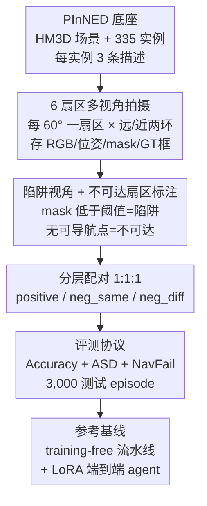

# PInVerify: An Offline Embodied Benchmark for Active Instance Verification

**会议**: CVPR 2026  
**arXiv**: [2605.30639](https://arxiv.org/abs/2605.30639)  
**代码**: https://github.com/Avalon-S/PInVerify (有)  
**领域**: 具身智能 / Benchmark / 多模态VLM  
**关键词**: 主动实例验证、具身感知、下一最佳视角、细粒度属性、离线 benchmark

## 一句话总结
本文提出"主动实例验证(Active Instance Verification, AIV)"任务——智能体到达候选物体附近后，主动绕物体选视角、逐步核对细粒度文字描述以判断"是不是这一个"，并配套离线 benchmark PInVerify（3,000 测试 episode、18 类、6 扇区导航拓扑、含陷阱视角/不可达扇区标注），用 ≤8B 开源 MLLM 搭了 training-free 与 LoRA 微调两条参考基线，发现检测质量是主要瓶颈、而现有 NBV 主动选视角并未带来可靠增益。

## 研究背景与动机
**领域现状**：具身导航这条线已经从"找到某类物体"（ObjectNav）走到"找到某个用语言描述的特定实例"（PIN/REVERIE）。但这些 benchmark 的成功判据都是"到达目标附近"（arrival/proximity），episode 在走到目标邻域就终止。

**现有痛点**：到达不等于找对。给定"拿那个带白色花纹的蓝杯子"，智能体走到一个带白色条纹的蓝杯子旁边，在 arrival 式导航指标下照样算命中——可部署时这就是一次送错货。问题在于导航距离下 RGB 看不清细粒度纹理，而且区分性属性常分布在物体的非正面（背面/侧面），单视角根本判不出来。

**核心矛盾**：验证（verification）这个动作一直被埋在导航推理链里（如 CompassNav 在 prompt 里插一步"Target Verification"，IEVE 在导航里切换探索/验证动作），从未被单独拎出来当成一个可量化的决策问题来评测。导航成功 ≠ 语义成功，二者之间缺了"交互前的主动验证"这一环。

**本文目标**：把这一环形式化为独立任务，并造一个能可控复现、把定位质量/查询模式/选视角策略都能单独消融的离线测试床。

**切入角度**：作者主张在交互前应有一个"主动验证阶段"——智能体绕候选物体主动选一串视角、逐属性累积证据直到有把握再下 YES/NO。把"移动"从"验证决策"里抽离（离线预拍多视角），就能干净地只考核验证能力。

**核心 idea**：定义 AIV = 有限步决策过程（绕物体选视角→核对属性→判定是否匹配），并用预拍的 6 扇区多视角图把它做成离线 benchmark，让验证决策与定位质量、视角选择策略可分别测量。

## 方法详解

### 整体框架
PInVerify 不是一个"方法"，而是一个**任务定义 + 离线 benchmark + 参考基线**三件套。任务侧把 AIV 形式化为有限步决策过程；数据侧围绕每个目标物体预拍一张"6 扇区 × 远近两环"的多视角导航图，并打上陷阱视角、不可达扇区、分层难度负样本等协议级标注；基线侧用 ≤8B 开源 MLLM 给出一条 training-free 模块化流水线和一条 LoRA 端到端智能体，纯粹用来勾画这个 benchmark 的难度边界。

具体地，一个 episode 是元组 $(\mathcal{Q}, o_{\text{query}}, o_{\text{target}}, \mathcal{G})$：$\mathcal{Q}=\{q_1,q_2,q_3\}$ 是描述查询实例的三条自然语言，$o_{\text{target}}$ 是场景里实际摆放的候选物体，$\mathcal{G}=(\mathcal{V},\mathcal{E})$ 是绕 $o_{\text{target}}$ 的导航图（节点=预拍视角，边=可导航的扇区转移）。智能体要从 $\mathcal{Q}$ 和它**主动选取**的观测序列判断 $o_{\text{target}}=o_{\text{query}}$ 是否成立。第 $t$ 步状态 $S_t=(p_t, I_t, B_t)$：$p_t$ 当前视角、$I_t$ 当前 RGB 观测（外加上一步若落到陷阱/不可达会附带可见性警告）、$B_t$ 是智能体对验证决策的内部信念（作者刻意不规定其形式）。动作空间 $\mathcal{A}=\{\texttt{NAV}_{d_1},\dots,\texttt{NAV}_{d_6}\}\cup\{\texttt{YES},\texttt{NO}\}$，$K=6$ 个方位扇区、horizon $T=6$（每扇区最多访问一次），YES/NO 是终止决策。候选物体在 $I_t$ 内的定位交给可插拔检测器（默认 Grounding DINO，消融用 GT 框）——这样 AIV 主要考核验证，而把检测质量作为一条显式评测轴。

下图是为每个目标物体构建离线导航图、再组装成评测集的多阶段流水线：

### 关键设计
对 benchmark 论文，关键设计 = **benchmark 怎么造**（前三点）+ **怎么评**（后两点）；最后一点交代参考基线的核心机制。

**1. 6 扇区 × 远近双环的离线多视角拍摄拓扑：把"绕物体看"做成可复现的离散图**

痛点是真·在线导航有渲染随机性、且把移动和验证决策搅在一起，没法做可控消融。作者复用 PInNED（HM3D 场景 + Habitat 渲染 + 338 个 Objaverse-XL 实例注入到 18 个日常类、每实例 3 条描述，其中 335 可用）作为视觉底座，但在其上新拍一套多视角图。给定目标质心 $\mathbf{g}$，某拍摄位 $\mathbf{c}$ 的方位角 $\theta=\mathrm{atan2}(c_z-g_z,\, c_x-g_x)$；取 $K=6$ 个方位扇区、每 $60^\circ$ 一个、相对起拍方位定义（对绝对朝向不变），每个扇区是底层 12 扇区离散化里的一个 $30^\circ$ 角窗。每个扇区在两个观测距离各拍一组（远 1.4–1.7 m、近 0.9–1.2 m），相机朝向目标。每张 capture 存 RGB、相机位姿、实例分割 mask、GT 框，以及一个布尔值 `mask_meets_threshold`（投影 mask 是否超过该类的可见性阈值）。这套"扇区图"把"绕着物体主动看"抽象成一张离线、确定性转移的导航图，使后续对检测/查询模式/NBV 的消融都能干净进行。

**2. 陷阱视角与不可达扇区：把具身感知里"看得到但看不清/走不过去"的失败显式标进 benchmark**

纯几何 benchmark 通常不暴露的两类失败，在这里被显式建模。一个 capture 若**几何可导航但目标投影 mask 低于可见性阈值 $\tau$**（自遮挡、环境遮挡、极端视角所致），就是**陷阱视角(trap view)**——能走过去但白走一趟；其余**不可达扇区(unreachable)**则根本没有可导航点（墙/家具挡住），对它发 NAV 会失败、智能体原地不动。两类失败都消耗一步，并通过下一帧观测里的 `visibility_warning` 字段告知智能体。导航动作按几何解析：给定相对方向 $d_k$ 与目标偏移 $\Delta\theta_k$，环境从当前位姿算出绝对目标方位，取 $\pm 30^\circ$ 内最近的 capture，否则判该扇区不可达。正是这些标注让 PInVerify 比"一堆静态照片"多出真正的具身状态结构——智能体必须学会从无信息观测里恢复。

**3. 1:1:1 分层负样本：把"标定偏差"和"类别识别"从准确率里拆开**

每个目标物体采三类配对：positive（同一实例）、neg_same（同类、不同细粒度属性，如两个只差颜色/花纹的背包，考实例级辨别）、neg_diff（不同类，如背包查询配帽子目标，作类别级理智检查）。评测集在三类上严格 1:1:1 平衡（各 1,000）。这种分层的妙处在于：它能把"过度确认 vs 过度拒绝"的**标定偏差**从"类别级识别能力"里分离出来——一个一味答 NO 的模型会在 neg_same/neg_diff 上拿满分却在 positive 上崩盘，分层后这种偏差一眼可见，支撑了 §6 的失败模式分析。配对取自 1,847 个能同时构成三类的 episode，最终采样 3,000 对、覆盖 71 个目标实例、35 个 HM3D 场景；另有 15,225 对的 disjoint 训练池。

**4. 双轴评测协议：Accuracy + ASD + 导航失败率，暴露三条被准确率掩盖的失败轴**

只看准确率会掩盖具身验证的真实困难。作者沿两轴报告：**准确率**（总体、分 pair 类型、分类别）与**效率/诊断**（平均决策步数 ASD、导航失败率 NavFail）。三者合起来暴露三条失败轴：标定偏差（确认 vs 拒绝，来自 pair 类型拆分）、观测效率（ASD）、从无信息观测中恢复的能力（NavFail）。评测程序还额外记录首视角准确率与预测翻转统计供细粒度诊断。Table 3 把 PInVerify 定位在五个轴上同时满足：主动选视角、实例级粒度、语言查询、显式多视角推理、离线可复现——这是相关 benchmark 里独一份。

**5. 两条参考基线：training-free 模块流水线 + LoRA 端到端 agent，用来勾画难度而非主张方法**

为给后续工作一个起点，作者搭了两条基线。training-free 流水线分四步：(a) **属性分解**——文本 MLLM 先从 $\mathcal{Q}$ 预测类别，再把 $\mathcal{Q}$ 拆成至多 $N_{\max}=8$ 个属性（含名称、类型、判别权重、从 $\mathcal{Q}$ 里引用的证据短语，引用约束抑制幻觉属性）；(b) **逐视角验证**——每步定位+裁剪目标（短边<512 上采样），对每个未决属性让 MLLM 返回 $s\in\{\texttt{Yes},\texttt{No},\texttt{Unsure}\}$；(c) **置信度加权多视角跟踪**（见下节公式）；(d) **NBV 选视角**——Random / LLM-NBV / Angular FPS 三选一。另一条是把 Qwen3-VL-4B 用 LoRA(rank 16, $\alpha=32$) 微调成端到端 agent：吃场景 RGB + 候选裁剪，一次前向输出 `<think>/<answer>`（验证决策 + 下一动作）。作者反复强调这两条只是 baseline，不是方法贡献。

### 损失函数 / 训练策略
**置信度加权多视角跟踪（training-free 核心机制）**：对每个属性 $a_i$ 维护逐视角历史 $H_i=[(v_j,s_j,c_j)]$。令调整后置信度 $\tilde{c}=c$ 若 $c\geq\tau_{\text{conf}}=0.3$、否则 $\tilde{c}=0.2c$（陷阱视角检测置信度 $c=0.1$ 会被压到 $\tilde{c}=0.02$）。对每个状态 $\sigma\in\{\texttt{M},\texttt{C},\texttt{Mi}\}$（Matched/Contradictory/Missing）累加权重：

$$w_\sigma(a_i)=\sum_{(v,s,c)\in H_i,\, s=\sigma}\tilde{c}$$

调和规则**刻意非对称**：只有当 $w_C$ 同时超过 $w_M$ 和 $w_{\text{Mi}}$ 才判 Contradictory；$w_M>0.3$ 判 Matched；否则 Missing。这编码了"未观测 ≠ 被否定"的原则——低可见观测（$\tilde{c}\to 0.02$）无法单独触发拒绝，从而减少对部分可见物体的虚假拒绝。Angular FPS 的 NBV 选未访问方向 $d^\star=\arg\max_{d_k}\min_{\theta\in\Theta_{\text{vis}}}\Delta(\theta_k,\theta)$，其中 $\Delta(\alpha,\beta)=\min(|\alpha-\beta|,2\pi-|\alpha-\beta|)$ 是单位圆上的最短弧距——相机绕物体环形排布时，这才是正确度量（不是点云上的欧氏 FPS）。

**端到端 agent 训练**：先 SFT（约 22K 样本，CoT 标签由 GT 配对信息 + 逐步可见性元数据模板化生成，训练始终用 GT 框裁剪），再在 SFT adapter 上探索三种 post-SFT 对齐：离线 DPO、在线 GRPO（每 prompt $G=4$ 个补全）及其序列级变体 GSPO。复合奖励 = 验证正确性（软部分分）+ 动作质量（4 档、消费 benchmark 的 visible/navigable/best_sectors 元数据）+ 格式合规。

## 实验关键数据

### 主实验
评测全程用 3,000-episode 测试集、$T=6$ 自适应停止；$n=3000$、$p=0.85$ 时 95% 二项置信区间 $\approx\pm 1.3$ pp，更小差异视为等价。

跨模型与 embedding 基线对比（DINO 检测，各模型取最优配置）：

| 模型 | 配置 | Overall | Pos | Neg_Same | Neg_Diff | ASD |
|------|------|---------|-----|----------|----------|-----|
| CLIP (embedding) | SV-Merged | 0.771 | 0.349 | 0.965 | 1.000 | 1.0 |
| SigLIP2 (embedding) | SV-Merged | 0.801 | 0.429 | 0.974 | 1.000 | 1.0 |
| Qwen3-VL-4B | MV-Attr+LLM | **0.850** | 0.596 | 0.965 | 0.988 | 2.34 |
| Qwen3-VL-8B | MV-Attr+LLM | 0.797 | 0.412 | 0.979 | 1.000 | 1.94 |
| SenseNova-SI-8B | MV-Direct+Rnd | 0.833 | 0.658 | 0.884 | 0.958 | 1.62 |

最佳 on-device MLLM（0.850）比最佳 embedding（SigLIP2，0.801）高 **+4.9 pp**，正样本上差距更大（0.596 vs 0.429）。值得注意的是 8B 反而不如 4B——8B 更偏拒绝，而"要求每个属性都确认"的属性分解对它更不利；SenseNova 相反，过度确认导致 neg_same 在属性分解下掉到 0.526，改用 Direct 查询才到 0.833。**最佳查询策略取决于模型的标定画像，而非单纯的原始能力**。

训练后 agent（Qwen3-VL-4B + LoRA）：

| 方法 | 检测 | Overall | Pos | Neg_Same | ASD | NavFail% |
|------|------|---------|-----|----------|-----|----------|
| TF-Best (MV-Attr+LLM) | DINO | 0.850 | 0.596 | 0.965 | 2.34 | 28.1 |
| Base (未微调) | DINO | 0.706 | 0.146 | 0.973 | 1.74 | 16.3 |
| SFT | DINO | 0.848 | 0.759 | 0.814 | 1.96 | 18.2 |
| SFT+GRPO | DINO | 0.853 | 0.736 | 0.838 | 1.61 | 9.0 |
| SFT+GSPO | DINO | **0.856** | 0.745 | 0.839 | 1.62 | 9.1 |
| SFT+GSPO | GT | **0.889** | 0.813 | 0.864 | 1.65 | 9.9 |

未微调 Qwen3-VL-4B 只有 0.706（Pos 0.146，强烈"no match"偏差）；SFT 把 Pos 拉了 +61.3 pp 到 0.759；GRPO/GSPO 再加约 1 pp 总体并把 NavFail 从 18.2% 压到 9%。SFT+GSPO 用 GT 框达 85.6%（GT 88.9%）。

### 消融实验
| 配置 | 关键指标 | 说明 |
|------|---------|------|
| 属性分解 vs Direct (单视角) | Pos 0.652 vs 0.457 | 分解促逐属性确认，缓解整体匹配的拒绝偏差，总体高 2.5–3.1 pp |
| 单视角 Attr → 多视角最优 | Overall 0.844→0.850 | 仅 +0.6 pp（CI 内）；多视角主要帮负样本 |
| 多视角对 neg_same vs Pos | neg_same 0.918→0.965(+4.7), Pos 0.652→0.596 | 保守跟踪器下更多视角=更多"未确认"机会，收紧 Pos、强化拒绝 |
| Random / Angular FPS / LLM-NBV | 0.848 / 0.848 / 0.850 | 三者落在 0.2 pp 内，全在 95% CI 内，主动选视角无可靠增益 |
| GT 框 vs DINO (SV-Attr) | 0.875 vs 0.844 (+3.1) | Pos 上 +10.6 pp（0.758 vs 0.652），检测质量是实测瓶颈 |

### 关键发现
- **检测质量是主要瓶颈**：GT 框相对 DINO 在 SV-Attr 上 +3.1 pp、在正样本上 +10.6 pp；正样本失败里有 53–94% 来自拒绝偏差、6–34% 来自陷阱/观测，且 Pos–检测置信度相关 $r=0.932$。
- **主动选视角没用（在测试的 ≤8B MLLM 上）**：三种 NBV 在 CI 内无差，三者导航失败次数也接近（Random 1,793 / FPS 1,958 / LLM 1,787），说明**逐步证据提取**才是这些基线的限速步——把空间留给未来更强不确定性感知的 agent。
- **两条范式互补**：TF-Best 强于负样本拒绝（neg_same 0.965 vs 0.839），训练 agent 强于正样本确认（Pos +14.9 pp）和效率（ASD 1.62 vs 2.34、NavFail 9% vs 28%）——标定至少和原始能力一样重要。
- **难度与类别尺度相关**：小物体（钱包、手表、钥匙）总体约 0.68–0.72，大而有辨识度的（背包、泰迪熊）超 0.92。

## 亮点与洞察
- **把"验证"从导航里拆出来单独评测**：这是最核心的概念贡献——以往验证总被埋在导航推理链里无法量化，AIV 把它做成独立的有限步决策任务，让"语义成功 ≠ 几何成功"这件事第一次有了可控测试床。
- **离线扇区图 = 可复现的"主动看"**：用预拍 6 扇区 × 远近双环把"绕物体主动选视角"抽象成确定性离线图，既消除渲染随机性，又能干净地分别消融检测/查询/NBV——这套"把移动抽离、只考验证"的设计思路可迁移到其他需要主动感知却难复现的具身任务。
- **陷阱视角/不可达扇区 + visibility_warning**：把具身感知里"看得到看不清、走不过去"的真实失败显式编进 benchmark 并反馈给 agent，比静态照片集多出真正的具身结构。
- **置信度加权跟踪的非对称规则**："未观测 ≠ 被否定"——低可见观测被压到 $\tilde{c}=0.02$ 无法单独触发拒绝，是个直觉清晰、可复用的多视角证据融合 trick。
- **反直觉结论本身很有价值**：8B 不如 4B、主动选视角无增益、最优查询模式取决于模型标定而非能力——这些"负结果"清晰刻画了当前 ≤8B MLLM 在细粒度具身验证上的真实短板。

## 局限性 / 可改进方向
- **作者承认**：纯离线、把移动从验证里抽离，端到端在线导航的集成留作未来工作；基线只是 baseline 不是方法贡献。
- **标签/奖励依赖 benchmark 侧 GT**：SFT 的 CoT 标签和 RL 奖励都来自 benchmark 提供的 GT 配对/可见性/best_sectors 元数据，这对"参考基线"是有意为之，但也意味着训练 agent 的强表现部分建立在特权信息上，迁移到真实在线场景未必成立。
- **结论限定在 ≤8B 开源 MLLM**："主动选视角无增益""8B 不如 4B"等结论是在 on-device 规模上得到的，更大模型或更强不确定性建模下未必成立——作者也明说留了空间给未来 agent。
- **规模偏小**：3,000 测试 episode 来自 71 个目标实例、35 个场景，类别尺度与难度强相关说明覆盖还不够均衡；95% CI 达 ±1.3 pp 使很多差异落在噪声内。
- **改进思路**：把离线扇区图接回在线 Habitat 导航做端到端评测；引入显式不确定性量化的 NBV（如 evidential active recognition）看能否突破"主动选视角无增益"的现状。

## 相关工作与启发
- **vs PIN / OVON / REVERIE（导航 benchmark）**：它们问"怎么到达目标"，成功判据是到达邻域；AIV 从到达之后开始，问"目标对不对"。PInVerify 复用 PInNED 的场景/摆放/描述，但新增任务定义、6 扇区拓扑、陷阱视角、分层配对等协议级标注——是补充而非替代导航 benchmark。
- **vs CompassNav / IEVE（导航里的验证步）**：它们把验证作为 prompt 里一步或导航动作之一嵌在端到端流程里；本文把验证隔离成独立评测阶段，且查询是语言条件（vs IEVE 的图像目标）、有 benchmark 级支撑（vs CompassNav 的 prompt 级一步）。
- **vs 经典 NBV / 主动 3D 重建**：它们优化几何完整性（结构光/覆盖率）；AIV 是"审视驱动"而非"发现驱动"——拿一个已找到的候选，选视角去降低属性级歧义，而非空间不确定性或类别身份。
- **vs Du et al. 多视角主动细粒度识别**：他们在车辆数据集上做 N 选一分类的策略梯度选视角；AIV 是针对自由文本描述的验证、查询是语言条件、且置于含陷阱视角/不可达扇区的具身 3D 场景。
- **vs RefCOCO / VSI-Bench 等 QA**：它们在给定的静态 2D 图像/视频上评测语言-视觉接地或空间推理；AIV 要求 agent 在遮挡与视角不确定下**主动获取新证据**后再做决定。

## 评分
- 新颖性: ⭐⭐⭐⭐⭐ 首次把"交互前主动实例验证"形式化为独立任务并配套可控离线 benchmark，填补导航与交互之间的语义验证空白。
- 实验充分度: ⭐⭐⭐⭐ 跨 5 个模型 + embedding 基线 + training-free/训练两条范式 + 检测/查询/NBV 多轴消融，CI 严谨；但结论限于 ≤8B、规模偏小。
- 写作质量: ⭐⭐⭐⭐⭐ 任务形式化、benchmark 构造、失败轴拆解都讲得非常清楚，诚实报告负结果。
- 价值: ⭐⭐⭐⭐ 提供了细粒度具身语义验证的可复现测试床与清晰难度边界，对后续主动感知/不确定性建模研究有直接抓手。

<!-- RELATED:START -->

## 相关论文

- [\[CVPR 2026\] Instance-level Visual Active Tracking with Occlusion-Aware Planning](instance-level_visual_active_tracking_with_occlusion-aware_planning.md)
- [\[CVPR 2026\] ActiveGrasp: Information-Guided Active Grasping with Calibrated Energy-based Model](activegrasp_information-guided_active_grasping_with_calibrated_energy-based_mode.md)
- [\[CVPR 2026\] SaPaVe: Towards Active Perception and Manipulation in Vision-Language-Action Models for Robotics](sapave_active_perception_manipulation_vla_roboti.md)
- [\[CVPR 2026\] AVA-VLA: Improving Vision-Language-Action models with Active Visual Attention](ava_vla_improving_vision_language_action_models_with_active_visual_attention.md)
- [\[ICLR 2026\] Statistical Guarantees for Offline Domain Randomization](../../ICLR2026/robotics/statistical_guarantees_for_offline_domain_randomization.md)

<!-- RELATED:END -->
