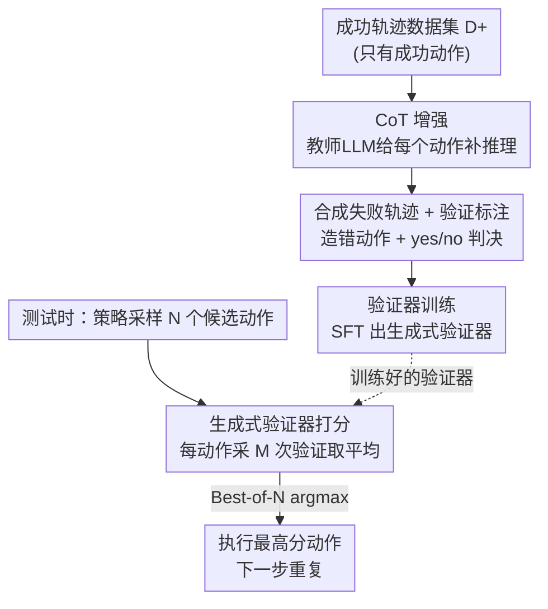

# Think Twice, Act Once: Verifier-Guided Action Selection For Embodied Agents

**会议**: CVPR 2026  
**arXiv**: [2605.12620](https://arxiv.org/abs/2605.12620)  
**代码**: 有（项目主页 + 代码链接，见论文）  
**领域**: 具身智能 / Embodied Agent / 测试时计算 / 验证器  
**关键词**: 具身智能体、生成式验证器、Best-of-N、合成失败数据、测试时计算

## 一句话总结
针对 MLLM 具身智能体「贪心解一个动作、错了也没法自检」的脆弱性，VeGAS 在测试时让策略采样一组候选动作、再用一个**专门训练过的生成式验证器**打分选最优；其关键发现是「现成 MLLM 当验证器毫无增益」，必须用 LLM 自动合成的失败轨迹课程把验证器训出来——在 LangR 和 EB-ALFRED 上最难的多物体长程任务上相对 CoT 基线最高提升 36%。

## 研究背景与动机
**领域现状**：多模态大模型（MLLM）凭借 Internet 级图文知识和思维链（CoT）推理，已成为构建具身智能体的主流底座——从早期纯 zero-shot，到在具身数据上做监督/强化微调，再到加入 step-by-step 推理，决策能力逐步增强。

**现有痛点**：这类智能体在**分布外（OOD）和长程任务**上仍然很脆。论文给的画面很具体：智能体能可靠执行「给我拿香蕉」，却在同义改写成「给我拿一个黄色弯曲的水果」时失败；在单物体 pick-and-place 上训练好的策略，碰到「擦干净苹果再放进柜子」这种多步任务就崩。

**核心矛盾**：作者诊断出根因——智能体在每一步都**贪心解码出唯一一个动作并直接提交，没有在执行前自我纠错的机会**。而人类做事会先在脑子里盘算几个候选、评估各自后果、只挑最靠谱的那个，本质上是「行动前先验证」。这个直觉在 LLM 领域已有计算对应物：数学/代码上「采样多个解 + 学到的验证器选最优」能大幅提升性能。

**本文目标**：把「采样—验证—选择」这套测试时计算范式搬到**高层具身推理**上。但具身场景比数学/代码更难——部分可观测、只能从第一视角观测推断语义任务进度、长程规划里误差会累积，因此具身验证基本是空白。

**切入角度 / 核心 idea**：用一句话概括就是「**在不动策略的前提下，给它外挂一个会推理的验证器，把单步贪心改成 Best-of-N 验证选择**」。但最关键、也最反直觉的观察是：直接拿现成 MLLM 当验证器**完全没用**——通用语言理解不足以做具身验证；而且标准具身数据集只有成功演示，根本没有「什么是错动作」的监督信号。所以真正的创新落在**如何自动造出失败数据来训验证器**。

## 方法详解

### 整体框架
VeGAS（Verifier-Guided Action Selection）由两条线组成：**一条训练时的数据合成 + 验证器训练管线**，和**一条测试时的 Best-of-N 推理流程**。底座策略 $\pi$ 是一个 MLLM（Qwen2.5-VL-3B-Instruct），输入指令 $I$、第一视角 RGB 观测序列和历史动作，自回归输出 $y_t=(c_t,a_t)$——一段可选的 CoT 推理 $c_t$ 加一个用自然语言编码的高层语义动作 $a_t$（如 `pick(apple)`、`navigate(table)`），由 oracle 底层控制器执行。

训练时：从只含**成功轨迹**的数据集出发，先用教师 LLM（o3）给每个动作补 CoT 得到 CoT 策略；再用同一个教师为每条成功轨迹**合成一条对应的失败轨迹**，并给成功/失败轨迹里的每个动作都标注「验证」（一段 CoT + `action_is_correct: yes/no` 判决），用这批正负样本监督微调出验证器。测试时：每一步策略采 $N$ 个候选动作，验证器对每个候选采 $M$ 次验证、把判决映射成分数取平均，最后 argmax 选分最高的动作执行，下一步重复。

### 关键设计

**1. Best-of-N 验证选择：把单步贪心换成「采样—验证—选最优」**

这是针对「贪心解一个动作、错了无法自纠」痛点的测试时机制。在第 $t$ 步，策略以 temperature 0.7 采样 $N$ 个候选 $(c_t^{(n)},a_t^{(n)})$，每个候选交给生成式验证器，按原始 GenRM 做法采 $M$ 次验证以降方差，每次验证产出一段 CoT 加一个判决，把 `yes`$\to 1$、`no`$\to 0$ 得到 $M$ 个分数取平均作为该候选最终分 $\sigma_t^{(n)}$，最后 $a_t=\operatorname{argmax}_{n\in[N]}\sigma_t^{(n)}$ 执行。实验用 $N=16,M=5$。这里刻意用**生成式验证器**（先 step-by-step 推理再给判决）而非判别式验证器（直接吐一个标量分），因为前者性能更强、且分数可解释（能看到它为什么判错）。论文强调：VeGAS 的增益**不是来自「多采样几个候选」本身**——下面会看到没训练过的验证器照样多采样却没用——而是来自验证器被训得能区分对错。

**2. CoT 增强：给纯动作轨迹补上高层语义推理**

底座数据只有「观测→动作」的映射，缺少推理过程。作者用教师 LLM（o3）给每条成功轨迹的每个动作 $a_i^+$ 补一段思维链 $c_i^+$，解释「在已有 $I,o_1,a_1^+,\dots,o_i$ 的前提下，为什么该做这个动作」，得到 $\mathcal{D}^+_{CoT}$。注意这步**只加推理、不改动作序列**。与 Zawalski 等把推理 grounding 到物体/夹爪坐标做精细操作不同，VeGAS 针对的是需要长程规划和语言解释的**高层语义推理**。这段 CoT 一举两得：既训出更强的 CoT 策略，也成了验证器能「读懂场景」的文字依据（见消融里 text-only 验证器为何不掉点）。

**3. LLM 驱动的合成失败课程：凭空造出「错动作 + 为什么错」的监督信号**

这是全文最核心的设计，专治「数据集只有成功、没有失败」的根本缺口。对每条成功轨迹 $\tau^+$，提示 o3 生成一条对应的失败轨迹 $\tau^-$，且要求错误**真实且多样**，覆盖三大类典型失败模式：**拿错物体**（任务要香蕉却拿苹果）、**放错容器**（该放床上却放沙发）、**前提违背**（没开微波炉就想启动它）。然后对 $\tau^+$ 和 $\tau^-$ 里**每个动作**都让模型标注一段验证 CoT 加二元判决 `action_is_correct: yes/no`。这样无需任何额外人工采集，就得到了正负均衡的验证训练语料。这一步是「为什么现成 MLLM 当验证器没用、而训练后就行」的答案所在——它把验证器暴露在一个丰富的潜在错误分布上，学会识别那些贴近真实的细微错误（如把 armchair 误当成「大型舒适休息处」、实际答案是 sofa）。

### 损失函数 / 训练策略
策略和验证器都用**同一个底座** Qwen2.5-VL-3B-Instruct，只在训练数据上不同，均用标准的**下一 token 预测**监督微调（仅在输出 token 上算 loss，含 CoT 前缀）。验证器输入指令 $I$、历史动作 $a_{1:t-1}$、当前观测 $o_t$、候选的 CoT $c_t$ 和动作 $a_t$，输出验证 $v_t$（CoT + 判决）。数据规模：LangR 用 RL 策略在训练集上跑出约 10K 轨迹（丢弃 <3% 失败的），ALFRED 用原 benchmark 约 6.5K 专家演示；验证器从约 4.5K（LangR）/ 6.5K（ALFRED）成功轨迹各合成一条失败轨迹，正负采样成均衡集。推理用 vLLM，候选与验证可**并行采样**。

## 实验关键数据

### 主实验
两个 OOD 具身 benchmark：LangR（Habitat 2.0，8 任务 ×100 指令）和 EB-ALFRED（AI2-THOR，6 任务 ×50 指令）。指标是成功率（%）。

**LangR（Table 1）**：

| 方法 | 平均 | Multiple Objects（最难） | Referring Expr. | Multiple Rearrange |
|--------|------|------|------|------|
| SemLang (LLaVA-1.5-7B) 旧 SOTA | 58 | 2 | 31 | 80 |
| No-CoT (Qwen-3B) | 58 | 17 | 48 | 68 |
| w/ CoT (强基线) | 65 | 25 | 59 | 64 |
| + ZS 验证器（现成） | 64 | 30 | 48 | 65 |
| **+ FT 验证器 (VeGAS)** | **71** | **34** | **62** | **82** |

VeGAS 把 CoT 基线从 65% 抬到 71%，全任务一致提升；在最难的 Multiple Objects 上相对 CoT **提升约 36%**、相对 No-CoT 翻倍。关键对照：现成 ZS 验证器（64%）**反而略低于** CoT 基线（65%），证明 Best-of-N 范式本身不够，必须训练。

**EB-ALFRED（Table 2）**：

| 方法 | 平均 | Long Horizon | Spatial |
|--------|------|------|------|
| Qwen-3B w/ CoT | 44 | 22 | 34 |
| + Qwen-3B ZS 验证器 | 44 | 24 | 35 |
| **+ Qwen-3B FT 验证器 (VeGAS)** | **49** | **34** | **43** |
| Gemma-4B w/ CoT | 48 | 28 | 34 |
| **+ Gemma-4B FT 验证器 (VeGAS)** | **51** | 25 | 37 |

CoT 策略（44%）已超过约 20× 大的 Qwen2.5-VL-72B（30%）；VeGAS 进一步抬到 49%（Qwen）/51%（Gemma），两个模型族都复现「ZS 无增益、FT 才有效」的趋势，说明收益来自验证器本身而非特定架构。

**跨模型增益**：一个 3B 小验证器还能给它从没一起训过的**大型现成策略**打分提分——把 Qwen2.5-VL-72B 从 30%→38%、InternVL-3.5-38B 从 24%→35%，证明紧凑验证器能增强远超自身规模的策略。

### 消融实验
| 配置 | 关键指标 | 说明 |
|------|---------|------|
| 完整 VeGAS (o3 教师) | LangR 71% | 完整模型 |
| 换便宜教师 Qwen3-VL-8B | LangR 69% | 弱教师仍 +4 over CoT，管线不依赖前沿模型 |
| Self-Consistency（同等算力） | < VeGAS | 多采样投票，扩展效率明显不如 VeGAS |
| text-only 验证器（去视觉） | LangR 71% / ALFRED 47.5% | LangR 不掉、ALFRED 仅微降 |
| 候选覆盖率 N=10 | 0.894 | 10 个候选中含至少一个正确动作的概率 |

### 关键发现
- **「训练」才是命门，不是「多采样」**：现成 ZS 验证器在两个 benchmark 上都没增益甚至倒退；同等 LLM 调用预算下 Self-Consistency（多数投票）扩展曲线也明显比 VeGAS 平缓——能否有效利用测试时计算，取决于验证器有没有被合成失败数据训过。
- **候选集质量足够**：Best-of-N 能成立的前提是候选里至少有一个对的，实测 LangR 上 $N=10$ 时覆盖率已达 89%（$N=2$ 为 68%、$N=4$ 为 79%），所以瓶颈在「会不会选」而非「有没有」。
- **视觉输入几乎可省**：text-only 验证器与多模态版几乎打平（LangR 71% vs 71%，ALFRED 49% vs 47.5%）——因为每个候选自带的 CoT 已用自然语言描述了场景，验证器并非真「盲」；作者也推测当前高层 benchmark 缺少遮挡/精细视觉区分的场景，视觉验证的价值还没被压出来。
- **延迟可控**：$N(M+1)$ 次 LLM 调用看着多，但候选与验证可并行，从 $N=1$（1 次调用、3s）到 $N=8$（48 次调用、6s）墙钟仅增 2×，$N=16$ 也只 8s，部署可接受。

## 亮点与洞察
- **「现成 MLLM 当验证器没用」这个反直觉发现本身就是贡献**：它把研究重心从「怎么验证」精准转移到「拿什么数据训验证器」，让后面的合成失败管线显得顺理成章——是篇先证伪、再立论的好范式。
- **用 LLM 自动合成失败课程，绕开了具身领域最稀缺的负样本**：成功演示遍地都是、失败演示几乎没有，作者让教师 LLM 围绕「拿错/放错/前提违背」三类模式批量造错并自带「为什么错」的解释，零额外人工。这套「让强模型造负样本来训判别/验证器」的思路可直接迁移到任何只有正样本的决策任务。
- **小验证器撬动大策略**：3B 验证器给 72B 策略提分，给出了一个很实用的部署形态——大模型不可微调时，只训一个轻量验证器外挂即可。
- **text-only 验证器够用的洞察很有迁移价值**：当候选动作自带文字化的场景描述（CoT）时，验证器可以不吃图，省算力又不掉点，提示高层具身规划在很大程度上是个语言问题。

## 局限与展望
- **依赖 oracle 底层控制器**：方法只管高层语义动作选择，假设有完美的底层策略去执行 `pick/navigate`，没触及底层控制的失败。
- **强教师依赖（虽被缓解）**：合成数据质量与教师模型挂钩，o3 给 71%、Qwen3-8B 给 69%、CoT 基线 65%——便宜教师可用但仍有 gap，且数据质量上限受教师能力约束。
- **视觉验证价值未被验证**：作者自承当前 benchmark 缺遮挡/细粒度视觉区分场景，所以 text-only 不掉点；在真正需要看图判对错的任务上，去视觉的简化可能站不住。
- **合成失败的覆盖面**：三类失败模式是人为设定的，真实部署中的长尾错误（如物理交互失败、感知幻觉）是否被合成课程覆盖存疑。
- **每步独立验证、无跨步回溯**：VeGAS 在每个时间步做 Best-of-N，但一旦某步选错并执行，长程任务里没有显式的回退/重规划机制。

## 相关工作与启发
- **vs Self-Consistency（多数投票）**：两者都靠采样多个候选，但 SC 用投票、VeGAS 用学到的验证器选；同等算力下 VeGAS 扩展更陡更稳，说明「会评估的选择器」比「数票数」更能榨干测试时计算。
- **vs 判别式验证器 / Best-of-N（Cobbe 等）**：早期验证器直接输出 0–1 标量分；VeGAS 用**生成式**验证器先推理再判决，性能更强且可解释（能看到它为什么判某动作错）。
- **vs 数学/代码上的测试时计算（Large Language Monkeys 等）**：把「采样+验证」从全可观测、有明确正确性的数学/代码，扩展到**部分可观测、误差累积的高层具身推理**，是首个把生成式验证器用于该场景的工作。
- **vs CoT 具身推理（Zawalski 等）**：后者把推理 grounding 到物体/夹爪坐标做精细操作；VeGAS 针对长程规划与语言解释的高层语义推理，且 CoT 只是底座，真正的杠杆是验证器。

## 评分
- 新颖性: ⭐⭐⭐⭐ 首个把生成式验证器用于高层具身推理，「现成验证器无用 → 合成失败课程」的论证链清晰且反直觉。
- 实验充分度: ⭐⭐⭐⭐ 两 benchmark、两模型族、跨模型增益、覆盖率/教师/视觉/延迟多维消融，论证扎实；但缺真实机器人验证。
- 写作质量: ⭐⭐⭐⭐⭐ 动机—诊断—方法—消融环环相扣，反例和图示把「为什么需要训验证器」讲得很透。
- 价值: ⭐⭐⭐⭐ 「小验证器外挂大策略 + 自动合成负样本」是可直接复用的部署/数据范式，对具身 OOD 鲁棒性有实际意义。

<!-- RELATED:START -->

## 相关论文

- [\[CVPR 2025\] Think Small, Act Big: Primitive Prompt Learning for Lifelong Robot Manipulation](../../CVPR2025/robotics/think_small_act_big_primitive_prompt_learning_for_lifelong_robot_manipulation.md)
- [\[CVPR 2026\] Learning to See and Act: Task-Aware Virtual View Exploration for Robotic Manipulation](learning_to_see_and_act_task-aware_virtual_view_exploration_for_robotic_manipula.md)
- [\[ECCV 2024\] See and Think: Embodied Agent in Virtual Environment](../../ECCV2024/robotics/see_and_think_embodied_agent_in_virtual_environment.md)
- [\[CVPR 2026\] ActiveGrasp: Information-Guided Active Grasping with Calibrated Energy-based Model](activegrasp_information-guided_active_grasping_with_calibrated_energy-based_mode.md)
- [\[NeurIPS 2025\] Act to See, See to Act: Diffusion-Driven Perception-Action Interplay for Adaptive Policies](../../NeurIPS2025/robotics/act_to_see_see_to_act_diffusion-driven_perception-action_interplay_for_adaptive_.md)

<!-- RELATED:END -->
