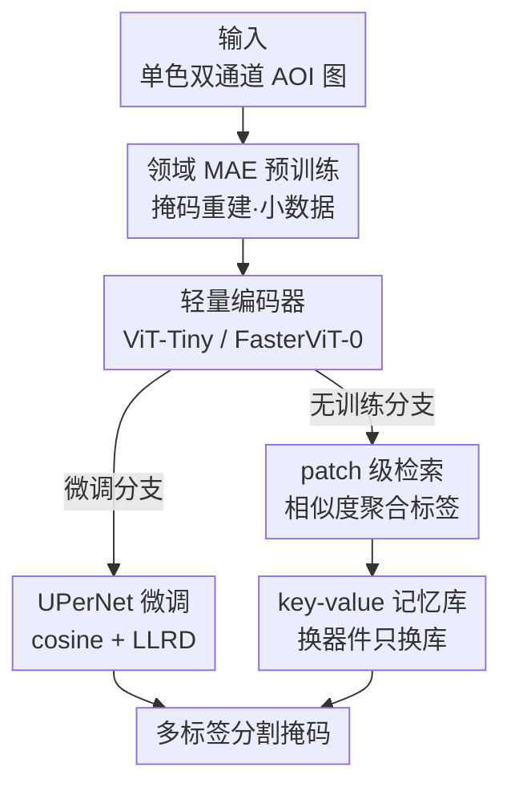

# AOI-SSL: Self-Supervised Framework for Efficient Segmentation of Wire-bonded Semiconductors In Optical Inspection

**会议**: CVPR 2026  
**arXiv**: [2605.12430](https://arxiv.org/abs/2605.12430)  
**代码**: https://github.com/jacomof/aoi-ssl (有)  
**领域**: 语义分割 / 自监督 / 工业视觉检测  
**关键词**: 自动光学检测(AOI), 掩码自编码器(MAE), 小数据自监督, 检索式分割, 引线键合半导体

## 一句话总结
针对半导体引线键合自动光学检测中"每换一款器件就要重新标注+重训分割模型"的痛点，本文用领域内小数据自监督预训练（发现 MAE 比 DINO/iBOT 更适合）+ 轻量微调 + patch 级检索式无训练推理，在固定 8 小时算力下把分割 mIoU 提到 60.3%，并让检索式分割在单一器件上无需训练即达 71.5% mIoU、近乎即时适配新器件。

## 研究背景与动机
**领域现状**：自动光学检测（AOI）是半导体封装质检的关键环节，要先把引线（wire）、球焊点（ball）、楔焊点（wedge）、环氧封装（epoxy）等结构做语义分割，再交给下游做缺陷判定。目前主流的 AOI 分割模型（如 ResNet18 + U-Net++ / DeepLabV3+）都是**器件专用**的。

**现有痛点**：这些模型与具体器件设计、采集条件强耦合。一旦上新器件、或出现显著的协变量漂移（capture/process variation），就得重新采集标注数据、从头训一个新模型——在产线环境里既费钱又费时。同时 AOI 的成像还很"非标准"：用单色（monochrome）双通道图（两个通道是同一器件在不同光源下的灰度视图，服务于光学标定与深度估计），分辨率从 ~800² 跨到 ~8120²，且大量黑边、结构极细（细引线）、类别极度不均衡（wedge 占标注像素不到 1%）。

**核心矛盾**：现成自监督（SSL）和基础模型（如 DINOv2）都假设有海量、多样的 RGB 预训练数据；而工业 AOI 恰恰是**窄域 + 小数据 + 非 RGB + 边缘算力**，两者错配。

**本文目标**：拆成三个子问题——(1) 在小 AOI 数据上做有效的领域自监督预训练；(2) 在固定算力预算下快速稳定地微调；(3) 换器件时不重训也能即时适配。

**切入角度**：作者观察到 AOI 域"语义多样性低、几何细节重要"，这对像素级重建型 SSL（MAE）友好、对聚类蒸馏型（DINO/iBOT）不友好；同时检索式（in-context）适配天然契合"只更新一个标注记忆库即可换器件"的产线需求。

**核心 idea**：用领域内 MAE 预训练打底，再叠加 patch 级最近邻检索把标签从记忆库直接迁移到查询图，用"换记忆库代替重训解码器"实现近即时适配。

## 方法详解

### 整体框架
整篇方法围绕一条三阶段管线展开：**预训练阶段**用 7000+ 张无标注 AOI 图，在轻量 ViT 上做领域自监督（重点是 MAE）；**训练/建库阶段**把带标注的参考图编码成稠密 patch 嵌入，连同其多标签掩码存进 key-value 记忆库 $\mathcal{M}$；**推理阶段**对查询图编码出 patch 嵌入，逐 patch 用余弦相似度检索最近邻、聚合邻居标签、重组成整图掩码。微调式分支（接 UPerNet 解码头）与检索式分支共用同一个预训练编码器，前者追求高支持类的精度、后者追求无训练的即时适配。整体围绕单色双通道、细结构、强不均衡、边缘算力这几个约束做设计。

### 关键设计

**1. 领域内 MAE 预训练：小数据、非 RGB 下选对自监督范式**

痛点是通用 SSL 都依赖海量多样 RGB 数据，而 AOI 只有少量单色双通道图。作者在自家 7000+ 无标注图（50+ 器件）上同时适配 MAE、DINO、iBOT 三种范式做对照，结论是 **MAE 在这个 regime 里明显最好**。MAE 通过随机丢弃 patch token 再用轻量 transformer 解码头在像素空间重建、以重建 MSE 为目标学习表征；DINO/iBOT 走 student-teacher 自蒸馏（teacher 是 student 的 EMA），用温度缩放 softmax 把 $[CLS]$ 投影到 $K$ 维概率空间做对齐，目标为 $\mathcal{L}_{\text{DINO}}(I)=\sum_{x\in A_t(I)}\sum_{x'\in A_s(I)}\sum_{i=1}^{K}-P_t^{(i)}(x)\log P_s^{(i)}(x')$，并靠中心化 $c$ 防塌缩。作者的解释是：AOI 域**语义多样性低、几何细节才是关键**，像素级重建天然适配稠密下游任务，而聚类式蒸馏抓不住细粒度几何，因此 MAE 收敛更快、下游分割更好。为让 MAE 能跑在不支持任意 token 数的 FasterViT 上，作者把可学习 mask token 同时塞进编码器和解码器输入（借鉴 iBOT/DINO），掩码比例 0.7，预训练 3000 epoch

**2. 限时微调：cosine 退火 + 层级学习率衰减把小数据微调稳住**

把预训练编码器接一个轻量 UPerNet 解码头（金字塔池化 + FPN，多尺度特征），ViT-Tiny 取最后 4 个 transformer block 的输出、FasterViT-0 取其 4 个层级特征图。痛点在于小数据 + 固定 8 小时算力下微调极易发散或欠拟合。作者发现训练调度才是成败关键：cosine annealing 学习率衰减叠加 LLRD（层级学习率衰减，浅层小学习率、深层大学习率）能把验证集 mIoU 从两者全关时的 22.4 拉到全开的 53.7。损失上，因为是**带重叠的多标签**分割，对每个类单独算 loss 再平均；试过 soft DICE、Jaccard 等区域损失来对抗类不均衡，最终发现简单的逐类 BCE 反而最稳

**3. patch 级检索式 in-context 分割：换记忆库代替重训**

这是为"换器件不重训"设计的核心。把 $N$ 张参考图编码成归一化嵌入 key $k_j$ 与其原始多标签掩码 value $V_j$，构成记忆库 $\mathcal{M}=\{(k_j,V_j)\mid k_j\in\mathbb{R}^d, V_j\in\mathbb{R}^{P^2\times C}\}_{j=1}^{M}$；与 RSU 存平均标签不同，这里**整 patch 掩码原样存**（小库才负担得起），以最大化 IoU。推理时对查询图每个 patch $q_i$ 取 top-$k$ 余弦最近邻 $\mathcal{N}(i)$，再聚合邻居标签。作者对比两种聚合：相似度加权（本文）$w^{\text{sim}}_{i,j}=s_{i,j}/\sum_{m}s_{i,m}$、$\hat{y}_i=\sum_j w^{\text{sim}}_{i,j}V_j$；以及 RSU 式注意力加权 $w^{\text{attn}}_{i,j}=\mathrm{softmax}(s_{i,j}/\beta)$。一个反直觉的发现是：在这种**低语义多样性**的多标签稠密检索里，简单相似度聚合往往不输甚至优于更复杂的注意力聚合。换器件时只需更新记忆库、几乎零额外训练即可即时适配，用 Faiss 在 GPU 上做近对数时间检索，全训练集嵌入约占 2GB 显存

**4. 架构归纳偏置：混合 ViT 救细长结构**

纯 ViT 因非重叠 patch 边界会输出"盒状/低分辨率"掩码，细引线常常掉进 patch 缝隙里。作者引入带卷积成分的 FasterViT-0（层级下采样 + 重叠 tokenization），在 SSL 预训练之后归纳偏置依然重要：FasterViT-0 达 60.3% mIoU，明显超过纯 transformer 的 ViT-Tiny（53.5%），增益主要落在 Wire 这类细长类别上。这说明对受限模型规模的 AOI 任务，多尺度 + 卷积式归纳偏置是抓细结构的必要补充

### 一个完整示例：一张查询图怎么被检索分割
设一张新器件查询图被切成 $L$ 个 patch。①编码器（ViT-Tiny）输出 $L$ 个归一化 patch 嵌入 $q_i$；②对每个 $q_i$，在 2GB 记忆库里用 Faiss 取余弦最近的 top-$k$ 个 key，记下相似度 $s_{i,j}$；③按 $w^{\text{sim}}_{i,j}=s_{i,j}/\sum_m s_{i,m}$ 加权聚合这些邻居对应的整 patch 多标签掩码 $V_j$，得到该 patch 的预测 $\hat{y}_i$；④把 $\{\hat{y}_i\}$ 重排回图像分辨率，对每个类用网格搜索 + 5 折交叉验证选出的阈值二值化，得到最终多标签掩码。整个过程不更新任何网络权重——换一款器件，只要往记忆库里塞那款器件的少量标注图即可。

### 损失函数 / 训练策略
预训练：MAE 用掩码 patch 的像素级 MSE，掩码比 0.7，3000 epoch、batch 100、base lr $1.5\times10^{-4}$（A100）；DINO/iBOT 用自蒸馏交叉熵 + 中心化防塌缩。所有 SSL 都配 AOI 专属增广（翻转、90° 旋转、高斯模糊、对比度抖动、高斯噪声）+ 100 epoch 线性 warmup 的 cosine 退火，作者实测去掉这套增广会让三种框架都过早表征塌缩。微调：逐类 BCE + cosine annealing + LLRD，AdamW（weight decay 0.05），所有模型统一在单张 RTX 2080 上限时 8 小时训练以模拟产线约束。

## 实验关键数据

### 主实验
固定 8 小时算力、RTX 2080 测吞吐。本文 AOI-MAE 预训练的 FasterViT-0 + UPerNet 取得最佳 60.3% mIoU，比 ImageNet 监督基线 ResNet18 + U-Net++ 高近 8 个百分点；无训练的 patch 检索也有 48.1% mIoU，且吞吐高得多（266.7 crops/s）。

| 模型 | Crops/s | mIoU | Epoxy | Wire | Wedge | Ball |
|------|---------|------|-------|------|-------|------|
| ResNet18 + DeepLab（监督基线） | 87.3 | 43.5 | 66.7 | 50.3 | 10.3 | 46.7 |
| ResNet18 + U-Net++（监督基线） | 86.9 | 52.4 | 75.4 | 59.1 | 9.2 | 65.8 |
| ViT-Small 冻结 DINOv2 + Patch 检索 | 90.9 | 47.8 | 43.4 | 48.7 | 45.8 | 53.4 |
| ViT-Tiny + Patch 检索（本文，无训练） | 266.7 | 48.1 | 38.4 | 47.8 | 44.4 | 61.8 |
| ViT-Tiny + UPerNet（本文） | 218.1 | 53.5 (+50.7%) | 73.7 | 43.0 | 26.5 | 70.7 |
| **FasterViT-0 + UPerNet（本文）** | 163.3 | **60.3 (+40.9%)** | 79.3 | 66.7 | 19.3 | 75.8 |

括号内为相对从头训练的预训练增益（MAE 预训练使 ViT-Tiny 微调相对提升达 ~50.7%）。值得注意：本文自定义 MAE 用 <1% 的 DINOv2 预训练数据、<一半参数（~10M vs ~22M）、~3× 吞吐，仍能稳压冻结 DINOv2 检索——即"双重收益"。

**单一器件检索**：当记忆库精选为同一器件布局（42 张库、24 张测、互不重叠），无训练 patch 检索达 71.5% mIoU，远超全微调的 ResNet18 + U-Net++（47.5%）。

| 策略 | mIoU | Epoxy | Wire | Wedge | Ball |
|------|------|-------|------|-------|------|
| Patch 检索（本文，MAE 编码器） | **71.5** | 68.0 | 65.6 | **78.7** | 73.5 |
| ResNet18 + U-Net++（全微调） | 47.5 | 43.3 | 72.1 | 3.4 | 71.1 |

### 消融实验
检索策略消融（5 折交叉验证，fine-tune 训练划分）：

| 预训练 | 粒度 | 聚合 | mIoU | 说明 |
|--------|------|------|------|------|
| MAE | Patch | Similarity | **45.7** | patch + 相似度最好 |
| MAE | Patch | Attention | 44.7 | 注意力聚合略逊 |
| MAE | Image | Similarity | 26.9 | 图级粒度大幅掉点 |
| DINO | Patch | Similarity | 39.3 | MAE > DINO |
| iBOT | Patch | Attention | 40.1 | iBOT 上注意力反超相似度 |

训练调度消融（验证集 mIoU）：

| Cosine 退火 | LLRD | mIoU | 说明 |
|:---:|:---:|------|------|
| ✓ | ✓ | **53.7** | 两者都开 |
| ✓ | ✗ | 33.7 | 去 LLRD 掉 20 |
| ✗ | ✓ | 19.6 | 去 cosine 大崩 |
| ✗ | ✗ | 22.4 | 全关 |

### 关键发现
- **粒度 > 聚合方式**：patch 级相对图级是质变（45.7 vs 26.9），因为能容忍 AOI 图常见的局部形变与位置漂移；而相似度 vs 注意力在 MAE/DINO 上只是微差，低语义多样性下简单相似度足矣、还更省算力（iBOT 是例外，注意力反超）。
- **Wedge 类是检索的主场**：wedge 占标注像素 <1%，卷积解码器会"过平滑"导致 IoU 仅 3.4%–9.2%（低召回）；patch 检索靠直接匹配相似 patch + MAE 预条件化细结构，把 wedge IoU 做到 78.7%。
- **归纳偏置在 SSL 后仍重要**：纯 ViT 因非重叠 patch 出"盒状"低分辨率掩码，FasterViT 的层级注意力 + 多尺度缓解了这点，Wire 类增益最明显。
- **记忆库可扩展性**：mIoU 随标注图数量近线性增长，库扩到 400 张（比全微调少 33% 数据）时 patch 检索即超越 ResNet18 + U-Net++ 基线，数据效率更优。

## 亮点与洞察
- **"换库代替重训"直击产线痛点**：把器件适配从"重训解码器"降级成"更新一个 key-value 记忆库 + 网格搜阈值"，几乎零训练即可上新器件，这是把 in-context/检索思路真正落到工业 AOI 的少见尝试。
- **小数据下 MAE > 蒸馏的解释很有迁移价值**：把"任务语义多样性低、几何细节为王"作为选 SSL 范式的判据——任何窄域、细结构、单色/非 RGB 的工业检测都能借鉴"先试 MAE"这条经验。
- **反直觉结论：复杂注意力聚合并非普遍更优**。在低语义多样性多标签稠密检索里，简单余弦相似度加权常常打平甚至胜过 RSU 式注意力，省下算力，提醒大家别无脑上复杂聚合。
- **存整 patch 掩码而非平均标签**：当记忆库本身不大时，用空间换 IoU 是个划算且容易复用的小 trick。

## 局限与展望
- **作者承认**：只做了直接 SSL 预训练，未叠加来自更大编码器的知识蒸馏；极端类不均衡只用区域损失对付，没系统试 Focal Loss / 类重加权（调参开销大，留作未来）；只在 512² 中心裁剪上验证，更高分辨率与产线级质量要求待评估。
- **自己发现**：两套数据集均为单一光学系统下的私有数据，跨成像系统/跨厂的泛化未知；检索式分割对每类阈值高度敏感，需网格搜索 + 5 折交叉验证，换数据集要重调；单一器件 71.5% 与多器件 60.3% 不可直接横向比（前者记忆库被精选到同一布局，结构先验更强）。
- **改进思路**：把 MAE 预训练与轻量蒸馏结合；为 wedge 这类超稀有类设计自适应阈值或代价敏感检索；探索全图（非中心裁剪）下的检索拼接以满足产线分辨率。

## 相关工作与启发
- **vs RSU（Retrieval-based Scene Understanding）**: RSU 也建 patch 记忆库 + 注意力式标签混合，但存的是平均标签、且默认注意力聚合更好；本文存整 patch 掩码以最大化 IoU，并实证在 AOI 低语义多样性下简单相似度聚合往往足够，把这套思路首次系统迁移到引线键合分割。
- **vs DINOv2 等大基础模型**: 冻结 DINOv2（142M 图预训练）做检索能用，但本文自训 MAE 以 <1% 数据、<一半参数、~3× 吞吐取得更高 mIoU，说明检索虽 backbone 无关，但在工业 AOI 上唯有配领域自监督才发挥全力。
- **vs 传统 AOI 分割（ResNet18 + U-Net++ / DeepLabV3+）**: 这些卷积基线器件专用、换器件需重训，且在 wedge 等细小稀有类上过平滑、IoU 个位数；本文在细结构类与适配速度上明显占优，但在某些高支持类（如 Wire 的微调列）仍可能被传统解码器局部反超。
- **vs FasterViT/SegFormer/Swin 等高效骨干**: 本文把 FasterViT 当 AOI 实用骨干，并强调即使经 SSL 预训练，卷积式归纳偏置对细长结构仍不可或缺。

## 评分
- 新颖性: ⭐⭐⭐⭐ 把检索式 in-context 分割系统落到工业 AOI，并给出"小数据选 MAE、简单相似度聚合够用"的反直觉结论，单点创新扎实但多为已有思路的领域迁移。
- 实验充分度: ⭐⭐⭐⭐ 主对比 + 单器件 + 检索/调度/库规模多维消融齐全，但只在单一私有光学系统、512² 裁剪上验证，跨厂泛化缺位。
- 写作质量: ⭐⭐⭐⭐ 动机—方法—实验链条清晰，三阶段管线与公式交代到位，少量细节散落附录。
- 价值: ⭐⭐⭐⭐ 直击半导体产线"换器件重训"痛点，提供可即时适配的工程化方案，工业落地价值高。

<!-- RELATED:START -->

## 相关论文

- [\[CVPR 2026\] SemiTooth: a Generalizable Semi-supervised Framework for Multi-Source Tooth Segmentation](semitooth_a_generalizable_semisupervised_framework.md)
- [\[ICCV 2025\] Joint Self-Supervised Video Alignment and Action Segmentation](../../ICCV2025/segmentation/joint_self-supervised_video_alignment_and_action_segmentation.md)
- [\[CVPR 2026\] LEMMA: Laplacian Pyramids for Efficient Marine Semantic Segmentation](lemma_laplacian_pyramids_for_efficient_marine_semantic_segmentation.md)
- [\[CVPR 2025\] Soft Self-Labeling and Potts Relaxations for Weakly-Supervised Segmentation](../../CVPR2025/segmentation/soft_self-labeling_and_potts_relaxations_for_weakly-supervised_segmentation.md)
- [\[CVPR 2026\] Heuristic Self-Paced Learning for Domain Adaptive Semantic Segmentation under Adverse Conditions](heuristic_self-paced_learning_for_domain_adaptive_semantic_segmentation_under_ad.md)

<!-- RELATED:END -->
