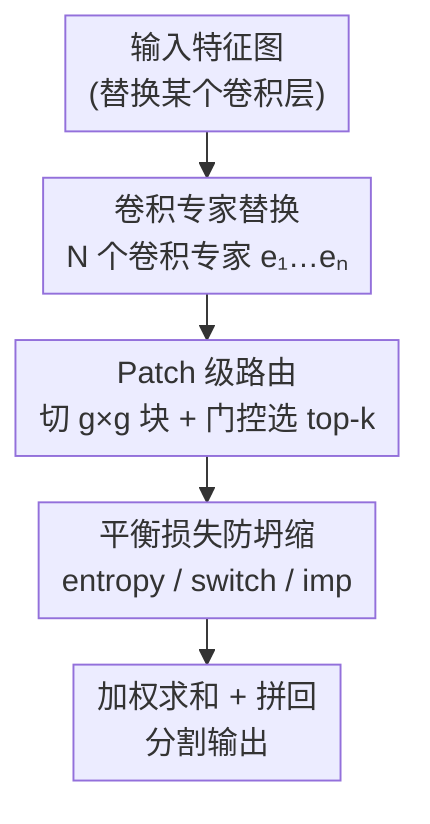

# Design and Behavior of Sparse Mixture-of-Experts Layers in CNN-based Semantic Segmentation

**会议**: CVPR 2026  
**arXiv**: [2604.13761](https://arxiv.org/abs/2604.13761)  
**代码**: https://github.com/KASTEL-MobilityLab/moe-layers/ (有)  
**领域**: 语义分割 / 模型效率 / 条件计算  
**关键词**: 稀疏MoE、CNN、语义分割、patch级路由、专家专精化

## 一句话总结
本文系统研究了如何把稀疏 Mixture-of-Experts (MoE) 层以"patch 级路由"的粗粒度方式塞进 CNN 语义分割网络——用一组卷积专家替换单个卷积层、按空间块路由到 top-k 专家，在 6 种 CNN、2 个数据集上几乎不增加推理算力就拿到最高 +3.9 mIoU 的提升，并给出了门控设计、专家数、稀疏度、放置位置如何影响路由动态与专家专精化的经验结论。

## 研究背景与动机
**领域现状**：稀疏 MoE 在 Transformer 里已经是成熟组件——它把 FFN 块替换成一组专家 + 一个门控网络，每个输入只激活 top-k 专家，从而在不成比例增加推理算力的前提下大幅扩容（Switch Transformer、GLaM、V-MoE 都是这个路子）。但在 CNN 里 MoE 的用法一直很零散。

**现有痛点**：已有的 CNN-MoE 工作几乎都聚焦在**细粒度**——在 filter 级（CondConv、Dynamic Convolution）或 channel 级（DeepMoE、AdvMoE）做专家选择，主要服务于图像分类。而语义分割这种**稠密预测**任务，到目前为止还没有人系统地把稀疏 MoE 层用进 CNN：既缺一个标准配置，也缺对"门控怎么设计、专家放哪、放几个、路由多稀疏"这些设计选择如何影响最终精度和内部行为的经验认识。

**核心矛盾**：稀疏 MoE 在 CNN 分割里存在一组张力——空间适应性 vs 计算开销。图像级路由（整张特征图用一套专家）算得起但完全没有空间选择性；像素级路由空间灵活但在高分辨率特征图上算力爆炸；同时稀疏路由天生有"路由坍缩"（routing collapse）风险，门控会把绝大多数输入塞给少数几个专家，专精化和泛化都崩掉。

**本文目标**：(1) 给 CNN 分割定义一个可复现的稀疏 MoE 参考配置；(2) 把门控复杂度、路由粒度、专家数、激活数 k、平衡损失、层放置位置这些设计旋钮逐个拆开做行为分析，看它们如何影响精度、开销、路由稳定性和专家专精化。

**切入角度**：作者押注一个折中粒度——**patch 级路由**。把特征图切成 $g\times g$ 的非重叠块，每个 patch 作为路由单元送进门控、选 top-k 卷积专家。这个粒度既保留了 CNN 的空间归纳偏置（专家仍是卷积层），又比像素级便宜得多、比图像级有空间选择性。

**核心 idea**：用一个 patch 级稀疏 MoE 卷积层（PatchConvMoE）替换 CNN 分割网络中**单个**卷积层，并把它当作探针，系统刻画稀疏专家路由在卷积稠密预测里的设计敏感性和内部动态。

## 方法详解

### 整体框架
方法核心是一个即插即用的 **PatchConvMoE 层**：它替换网络里某一个标准卷积层 $\ell$，由 $N$ 个卷积专家 $\{e_1,\dots,e_N\}$ 和一个门控网络 $G$ 组成，每个专家复刻被替换卷积层的结构、输出 $C_o$ 通道。前向时，输入特征图先被切成 $g\times g$ 个 patch，每个 patch 独立过门控、选出 top-k 专家、加权求和得到该 patch 的输出，最后把所有 patch 输出拼回完整特征图。整个网络其余部分不变，因此可以直接和标准卷积 baseline 对比。论文不是提一个 SOTA 模型，而是把这个层当"显微镜"，逐项扫描设计选择。

下面这张图展示 PatchConvMoE 层内部的数据流向（节点名即下文关键设计名）：

### 关键设计

**1. 卷积专家替换：用一组卷积层代替单个卷积层、保留空间归纳偏置**

针对的痛点是——Transformer 里 MoE 直接替换 FFN，但 CNN 没有现成对应物，且细粒度的 filter/channel 专家破坏了卷积的空间结构。作者的做法很克制：把网络里某一个 $1\times1$ 或 $3\times3$ 卷积层 $\ell$ 整层替换成 $N$ 个**结构完全相同的卷积专家**，每个专家就是一份和原卷积一样的卷积、输出同样 $C_o$ 通道；门控预测路由权重、只激活 top-k 专家、把它们的输出加权求和。这样模型容量随专家数上升，但每次前向只跑 k 个专家，**激活参数量和算力都贴着 baseline**（实验里激活参数最多 +1.51%、GFLOPs 最多 +1.51%）。用卷积当专家而不是 MLP，是为了维持 CNN 的空间归纳偏置、并保证能在各种现成架构上几乎零改动地嵌入

**2. Patch 级路由：在图像级与像素级之间取折中的路由粒度**

这是全文最关键的粒度选择。图像级路由整张特征图共用一套专家、没有空间选择性（实验中图像级路由**始终低于 baseline**）；像素级路由太贵。作者把输入特征图 $f\in\mathbb{R}^{H_f\times W_f\times C_f}$ 切成 $g\times g$ 个非重叠 patch，得到 $p=g^2$ 个块 $\{f_1,\dots,f_p\}$，每个 patch $f_i$ 独立过门控得到稀疏权重向量

$$G(f_i)=[g_1(f_i),\dots,g_N(f_i)],$$

从 $N$ 个专家里选 top-k，patch 输出是被选专家的加权和

$$y_i=\sum_{j\in\mathrm{TopK}(G(f_i))} g_j(f_i)\cdot e_j(f_i),\quad y_i\in\mathbb{R}^{\frac{H_f}{g}\times\frac{W_f}{g}\times C_o},$$

最后所有 $y_i$ 拼回 $f'\in\mathbb{R}^{H_f\times W_f\times C_o}$。这样不同空间区域可以走不同专家（路面 vs 行人交给不同专家），又把门控调用数从"每像素"降到"每块"。实验里 patch 级路由稳定优于图像级，且各架构的最优 patch 尺寸大多对应 **$3\times3$ 网格**——网格太细（patch 太小）或太粗都会掉点

**3. 平衡损失防路由坍缩：用三种损失对抗"专家被冷落"**

稀疏 MoE 的老问题是路由坍缩——门控把大多数输入塞给少数专家，专家用量极不均衡、专精化消失。作者并排评测三种平衡损失：importance loss $L_{imp}$ 惩罚一个 batch 内专家重要性的方差以鼓励均匀路由；switch loss $L_{switch}$ 直接把平均路由概率往均匀先验上拉；entropy loss $L_{entropy}$ 最大化专家分配的熵以鼓励多样使用。关键发现是这三者各有取舍且依架构而变：**完全不加平衡损失有时 mIoU 最高，但专家会坍缩到单个主导专家、彻底失去专精化**；$L_{entropy}$ 常给出最高 mIoU；而 $L_{switch}$ 给出最均衡、坍缩最轻的路由（最高 NRE、最低 TEC）。换句话说，"精度最优"和"路由最健康"未必是同一个配置，这正是本文要揭示的设计敏感性

**4. 单层最优放置：只换一个解码器卷积层，避免多层 MoE 的训练不稳定**

和 Transformer "把所有 FFN 都换成 MoE"不同，作者发现 CNN 里**只换一个、且换在解码器**最好。系统扫描编码器末层、解码器首/末层后，结论是放在解码器更有利（解码器层更直接参与基于已学特征精修分割输出），且选参数量稍大的那层（解码器最后的 $3\times3$ 卷积）略好。一旦同时替换多个卷积层，稀疏路由引入的条件计算会让训练方差暴涨、网络变得不稳定，mIoU 断崖式下跌（ENet 换 3 层从 55.70 跌到 32.31）。所以一个**精心放置的单 MoE 层**就能拿到自适应计算的好处，又不背上过度稀疏的不稳定代价

### 损失函数 / 训练策略
分割主损失之外叠加上述三种平衡损失之一（或不加）。训练统一 200 epoch、SGD（momentum 0.9、batch size 8、初始学习率 $2\times10^{-2}$、无 lr scheduler）；带 backbone 的模型（DeepLabv3+、LR-ASPP、PSPNet）用 ImageNet 预训练的 ResNet-50 / MobileNetv3。参考配置 PatchConvMoE：8 专家、top-2 路由、$L_{entropy}$、$3\times3$ 网格、2Conv-GAP 门控。

## 实验关键数据

### 主实验
在 Cityscapes 和 BDD100K 上，把单个卷积层换成 PatchConvMoE（8 专家、top-2、$L_{entropy}$、$3\times3$ 网格）后 mIoU 普遍提升，参数与算力几乎不变。

| 架构 | 数据集 | Baseline mIoU | PatchConvMoE 最佳 mIoU | 提升 | 激活参数增幅 |
|------|--------|--------------|------------------------|------|------------|
| ENet | Cityscapes | 51.80 | 55.70 | **+3.90** | +0.29% |
| ERFNet | Cityscapes | 60.66 | 61.98 | +1.32 | +1.13% |
| U-Net | Cityscapes | 64.94 | 63.88 | −1.06（未超） | +0.54% |
| LR-ASPP | BDD100K | 61.53 | 64.64 | **+3.11** | +0.06% |
| DeepLabv3+ | BDD100K | 78.80 | 80.98 | +2.18 | +1.51% |
| PSPNet | BDD100K | 78.12 | 81.01 | +2.89 | +0.05% |

最大相对提升出现在轻量模型（ENet +3.9、LR-ASPP +3.11）；大模型（PSPNet、DeepLabv3+）增益绝对值也稳定但较小。推理时间增幅对轻量模型更明显（PSPNet 推理时间 +14.45%），训练时间最多 +30%。

### 消融实验
| 配置维度 | 关键结果 | 说明 |
|----------|---------|------|
| 门控架构 | 2Conv-GAP > Conv-GAP > 3Conv-GAP | 两层卷积门控普遍最好；门控过复杂反而阻碍学习 |
| 路由粒度 | patch 级 > 图像级 | 图像级路由始终低于 baseline；$3\times3$ 网格通用最优 |
| 平衡损失 | $L_{entropy}$ / $L_{imp}$ 精度最佳；不加损失易坍缩 | 无损失时专家坍缩到单个主导专家、失去专精化 |
| 专家数 $N$ | 4 或 8 最佳 | 超过 8/16 收益不再上升、参数反而暴涨；CNN 仅约 ×2 扩展 vs Transformer >×10 |
| 激活数 $k$ | top-2 通常优于 top-1 | $k=n$（无稀疏）多数情况下比稀疏更差，凸显稀疏的重要性 |
| 共享专家 | 独立专家 > 独立+共享 | 共享专家在 CNN 里不如在 Transformer 里有效 |
| MoE 层数/位置 | 单层、放解码器最优 | 换多层导致训练不稳定、mIoU 暴跌（ENet 3 层 → 32.31） |

路由坍缩定量分析用两个指标：**归一化路由熵 NRE**（越低=越坍缩）和**top 专家集中度 TEC**（越高=越坍缩）。$L_{switch}$ 在所有模型上给出最高 NRE、较低 TEC（如 LR-ASPP 的 NRE 0.9951 / TEC 0.2951），路由最均衡；$L_{imp}$ 在轻量模型上 NRE 显著偏低（ENet 0.5764）、TEC 偏高（0.7425），专家主导最严重。

### 关键发现
- **精度最优 ≠ 路由最健康**：$L_{entropy}$ 常给最高 mIoU，但 $L_{switch}$ 才给最均衡的专家使用（最低坍缩）；选损失要在精度和专精化之间权衡。
- **模型容量缓解坍缩**：带 backbone 的深层模型（ERFNet、U-Net、DeepLabv3+）即使在较弱平衡下也有更稳定、更类别选择性的专家使用；ENet 这类浅模型对损失类型几乎不敏感、专家协作有限。
- **专家有语义/空间专精化**：专家-类别热图显示 road、building 这类大静态类在坍缩时主导路由，而 person、rider、traffic sign 等小目标在 $L_{switch}$ 下区分更清晰。
- **稀疏不可省**：$k=n$（激活全部专家）多数情况下反而更差，说明收益不是单纯来自容量增加，而是来自条件式稀疏路由本身。

## 亮点与洞察
- **patch 级路由是这篇的"刚刚好"选择**：在像素级（太贵）和图像级（没选择性）之间找到了一个对高分辨率稠密预测真正可行的折中，且用卷积当专家保住了 CNN 的空间归纳偏置——这套配方可以几乎零改动迁移到任何带卷积层的分割网络。
- **"只换一层、放解码器"颠覆了 Transformer 直觉**：Transformer 是 FFN 全换 MoE，但 CNN 分割里多层 MoE 会让条件计算把训练方差放大到崩。这个反直觉结论提醒：把一个架构家族的 MoE 经验直接搬到另一个家族是危险的。
- **把"精度"和"路由健康度"解耦评测很有价值**：作者用 NRE/TEC 量化坍缩、用专家-类别热图和共激活矩阵做可解释性分析，揭示了"mIoU 最高的配置可能专家已坍缩"这一容易被精度掩盖的事实——这套诊断思路可迁移到任何稀疏 MoE 的健康度审计。
- **CNN-MoE 只有约 ×2 的扩展甜区**：和 Transformer 动辄 >×10 扩展不同，CNN 专家数到 8/16 就饱和，给后续做 CNN 条件计算的人划定了现实的设计边界。

## 局限与展望
- **不追 SOTA、只用紧凑模型**：作者明确选了 6 个轻量/常用 CNN 做受控对比，没在 HRNet 这类高端 backbone 上验证，绝对 mIoU 不代表当前最强；patch 级 MoE 能否在大模型上同样收益未知。
- **结论强依赖架构**：几乎每个设计旋钮（最优 patch 尺寸、最优损失、专家数甜区）都因架构而异，缺乏一个跨架构的统一选择法则，实际落地仍需逐模型调参。
- **共享专家、多层 MoE 都被判"在 CNN 里不灵"**，但作者只在 ENet 上示例性验证了共享专家；这两个负面结论的普适性还需更多架构佐证。
- **训练不稳定未根治**：多层 MoE 的高方差被规避（只用单层），而非从优化层面解决；若想在 CNN 里堆更多 MoE 容量，仍缺稳定训练的手段。
- 可改进方向：把 patch 划分做成自适应（按内容而非固定网格）、引入更鲁棒的平衡损失同时兼顾精度与路由健康、探索能稳定训练多 MoE 层的正则化。

## 相关工作与启发
- **vs V-MoE / Soft-MoE（Transformer MoE）**：它们在 ViT 里用专家替换 FFN、做图像级或 token 级软路由；本文针对 CNN 稠密预测，用卷积专家 + patch 级稀疏路由，并实证了 Transformer 的"FFN 全换""共享专家有效""大幅扩专家数"这些经验在 CNN 里都不成立。
- **vs DeepMoE / CondConv / AdvMoE（细粒度 CNN-MoE）**：它们在 filter/channel 级做输入相关的专家选择、主攻分类或鲁棒性；本文走更粗的 patch/层级粒度，且首次把稀疏 MoE 用到 CNN 语义分割，并系统刻画路由动态与专精化。
- **vs sparsely-gated MoE module（块级 MoE）**：块级 MoE 通过语义专家专精提升可解释性，本文则把路由单元定位在空间 patch、并配套 NRE/TEC 与热图分析，把"可解释性"从模块归属细化到空间-类别层面。

## 评分
- 新颖性: ⭐⭐⭐⭐ 首次把稀疏 MoE 系统用进 CNN 语义分割，patch 级路由 + 全面设计分析填补空白，但单个组件多为已有技术的组合。
- 实验充分度: ⭐⭐⭐⭐⭐ 6 架构 × 2 数据集，门控/粒度/专家数/k/损失/位置全维度消融 + NRE/TEC/热图可解释性分析，扎实。
- 写作质量: ⭐⭐⭐⭐ 结构清晰、表格信息密度高；部分负面结论（共享专家、多层）只在单一架构示例验证，普适性表述略强。
- 价值: ⭐⭐⭐⭐ 给 CNN 条件计算/分割落地提供了可复现配方和一套设计经验法则，实用参考价值高。

<!-- RELATED:START -->

## 相关论文

- [\[CVPR 2026\] Spatio-Semantic Expert Routing Architecture with Mixture-of-Experts for Referring Image Segmentation](spatio-semantic_expert_routing_architecture_with_mixture-of-experts_for_referrin.md)
- [\[AAAI 2026\] Generalizable Slum Detection from Satellite Imagery with Mixture-of-Experts](../../AAAI2026/segmentation/generalizable_slum_detection_from_satellite_imagery_with_mixture-of-experts.md)
- [\[CVPR 2026\] SegCompass: Exploring Interpretable Alignment with Sparse Autoencoders for Enhanced Reasoning Segmentation](segcompass_exploring_interpretable_alignment_with_sparse_autoencoders_for_enhanc.md)
- [\[CVPR 2026\] Semantic Alignment in Hyperbolic Space for Open-Vocabulary Semantic Segmentation](semantic_alignment_in_hyperbolic_space_for_open-vocabulary_semantic_segmentation.md)
- [\[CVPR 2026\] LEMMA: Laplacian Pyramids for Efficient Marine Semantic Segmentation](lemma_laplacian_pyramids_for_efficient_marine_semantic_segmentation.md)

<!-- RELATED:END -->
