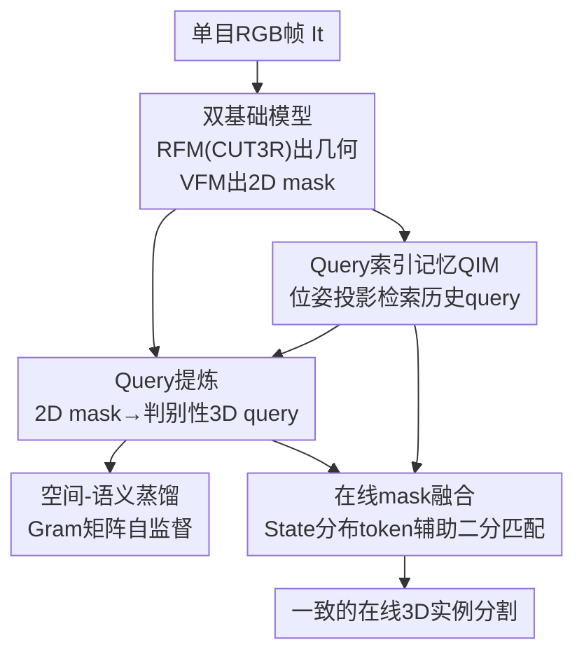

# MoonSeg3R: Monocular Online Zero-Shot Segment Anything in 3D with Reconstructive Foundation Priors

**会议**: CVPR 2026  
**arXiv**: [2512.15577](https://arxiv.org/abs/2512.15577)  
**代码**: https://github.com/VICO-UoE/MoonSeg3R  
**领域**: 3D视觉 / 实例分割  
**关键词**: 单目3D实例分割、在线零样本、重建基础模型(RFM)、视觉基础模型(VFM)、CUT3R

## 一句话总结
把在线 3D 重建模型 CUT3R 当作几何先验、SAM 系 VFM 当作 2D mask 先验，MoonSeg3R 让只有一路单目 RGB 视频流的系统也能边重建边做零样本 3D 实例分割，是第一个不依赖深度传感器/已知位姿/3D 监督的在线单目方案，在 ScanNet200/SceneNN 上接近 RGB-D 方法且 mask 融合速度最快。

## 研究背景与动机
**领域现状**：在线 3D 实例分割（边走边重建场景、边给物体实例打 mask）是机器人导航、具身感知的核心能力。当前最有效的范式是借 VFM（SAM、CLIP、CropFormer）拿到强 2D mask，再用深度传感器/已知位姿提供的显式几何把 mask "抬升"到 3D 并跨帧合并，代表作有 EmbodiedSAM、OnlineAnySeg。

**现有痛点**：这些方法全都假设输入是**带位姿的 RGB-D 序列**——要么需要 3D instance mask 的全监督，要么至少需要 ground-truth 的深度和位姿来做 mask lifting 与 merge。一旦平台没有深度相机、或拿不到精确位姿（很多真实机器人/手机就是这种情况），它们直接失效。

**核心矛盾**：单目 RGB 流天生缺几何——观测是局部的、深度要靠推断、视角变化和遮挡下还要维持同一物体的 3D 关联。直接用网络预测的深度/位姿喂给 RGB-D 方法又会因几何噪声而性能崩盘（论文里 OnlineAnySeg-M 就是反例）。问题根源是：**语义来自 VFM、几何来自传感器，二者解耦后单目场景下几何这一支断了**。

**切入角度**：作者注意到新一批前馈式在线重建网络——称为**重建基础模型(Reconstructive Foundation Model, RFM)**，如 DUSt3R、CUT3R——能从无位姿单目流实时、可泛化地重建 3D。尤其 CUT3R 维护一个循环的 "state token" 隐式编码全局场景几何。既然 RFM 已经把几何先验学好了，能不能用它替代深度传感器，给在线分割提供几何？

**核心 idea**：用 RFM 的几何先验（显式 pointmap/位姿 + 隐式 state）替代深度监督，把 VFM 的 2D mask 提炼成具判别力的 **3D query 原型**，再靠 query 记忆和 state 注意力做跨帧关联——即"用重建基础模型的时空先验，换掉对深度传感器的依赖"。

## 方法详解

### 整体框架
MoonSeg3R 解决的是"只给一路单目 RGB 流，怎么在线零样本地同时重建场景几何并分割 3D 实例"。整体是一条四步流水线：每来一帧 $\mathbf{I}_t$，先用**两个冻结的基础模型**并行处理——RFM（CUT3R）吐出显式几何（位姿 $\mathbf{P}_t$、世界坐标 pointmap $\mathbf{X}_t$）和隐式表示（几何特征 $\mathbf{F}_t^{3d}$、state 注意力 $\mathbf{A}_t$），VFM（CropFormer/FastSAM）吐出 2D 实例 mask $\mathbf{M}_t$。然后把每个 2D mask 经几何+语义特征 lift 成一个 3D 原型 query，经 query refinement 提炼成判别性 query $\mathbf{q}'_t$；同时用位姿把历史 query 记忆投影回当前视角注入上下文；最后在推理时用 query、bounding box 和 state 分布 token 三路相似度做帧内合并 + 跨帧二分匹配，把不同帧的局部观测合并成一致的 3D 实例。整套训练**无任何 3D ground-truth**，靠自监督蒸馏。

### 关键设计

**1. 自监督 Query 提炼：把 2D mask 变成判别性 3D 原型**

痛点是 VFM 给的是逐帧、会过分割/欠分割的 2D mask，直接 lift 到 3D 的原始特征既缺 3D 接地（纯 2D DINO 特征）又缺语义（纯 CUT3R 几何特征），无法把同一物体的 mask 关联起来、也分不开不同物体（消融里 $\mathbf{F}^{2d}$、$\mathbf{F}^{3d}$ 单独用都很差，拼起来也只是微增）。做法是先把每个 mask 区域在拼接特征 $\mathbf{F}_t=[\mathbf{F}^{3d}_t,\mathbf{F}^{2d}_t]$（几何来自 CUT3R，语义来自 DINOv3）上做 masked average pooling 得到初始原型 $\mathbf{q}^i_t=\eta(\sum_{u,v}\mathbf{F}_t\mathbf{M}^i_t / \sum_{u,v}\mathbf{M}^i_t)$，再过一个轻量 query decoder $\phi$ 做 masked cross-attention 提炼：$\mathbf{q}'_t \leftarrow \phi(\mathrm{Attn}(\mathbf{q}_t,\mathbf{F}_t,\mathbf{M}_t))$。关键是它**全程自监督**：没有 GT mask，而是要求提炼后的 query 能逐点还原出原始 mask——用 BCE 重建损失 $\mathcal{L}_{seg}=\mathrm{BCE}(\sigma(\psi(\mathbf{F}_t)\odot\mathbf{q}'_t),\mathbf{M})$ 逼 query 在本帧内把对应实例和其余实例区分开。这一步在消融里单独就带来 +4.4 AP / +8.0 AP$_{50}$，是涨点主力

**2. 空间-语义蒸馏：堵住自监督学到的"空间捷径"**

单靠上面的重建损失有个坑：作者发现 query 会走捷径——只用语义丰富的 $\mathbf{F}^{2d}$ 就能满足重建目标，于是 $\mathbf{F}^{3d}$ 的几何信息被丢弃，特征退化成一个与真实空间位置无关的固定空间图案（论文 Fig. 4 中可视化为固定的紫→黄渐变）。这会毁掉跨帧关联，因为 query 不再编码 3D 几何。解决办法是加一个 Gram 矩阵蒸馏损失：对投影后的参考特征算归一化 Gram 矩阵 $\mathbf{G}=\psi(\mathbf{F})\psi(\mathbf{F})^\top / (\|\psi(\mathbf{F})\|\|\psi(\mathbf{F})\|)$（patch 间两两点积，给出 patch 级结构指导但允许局部特征自由更新），并约束它同时贴近 2D 语义结构 $\mathbf{G}^{2d}$ 和 3D 几何结构 $\mathbf{G}^{3d}$：$\mathcal{L}_{dist}=\|\mathbf{G}-\mathbf{G}^{2d}\|_F^2+\|\mathbf{G}-\mathbf{G}^{3d}\|_F^2$。这样既保住了两个基础模型的本质结构、又让 query 保持判别力，特征变得物体感知（同一个包在不同视角下一致、不同柜子能反映 3D 空间差异），带来 +1.0 AP

**3. 3D Query 索引记忆 QIM：用历史上下文补全单帧的残缺观测**

单目单帧只能看到物体的一部分，3D 表示天然残缺、碎片化。QIM 是一个轻量的、基于索引的记忆机制，把当前 query 链接到时间上相关的历史 query。它维护两个结构：全局 query bank $\mathcal{Q}_{t-1}$（存所有历史 query 特征），和 query 索引图 $\mathcal{M}_{t-1}\in\{0,1\}^{n^k\times n^q}$（记录哪些 query 关联到哪个 3D 空间 key）。空间 key 是从 pointmap $\mathbf{X}_t$ 上 average pooling 出的稀疏 3D 点，每个 key 代表一小块重建几何；$\mathcal{M}_t(i,j)=1$ 当且仅当 key $\mathbf{k}^i_t$ 落在 mask $\mathbf{M}^j_t$ 内。检索时妙在**复用 CUT3R 的预测位姿** $\mathbf{P}_t$：把所有存储的空间 key 投影回当前相机坐标系并光栅化成索引图 $\mathbf{I}^{ind}_t$，每个像素就标出当前可见的历史 query，再从 bank 取出 $\mathcal{Q}^{ctx}_t=\mathrm{Retrieve}(\mathbf{I}^{ind}_t,\mathcal{Q}_{t-1})$，经一层 cross-attention 注入到 query 提炼里（Eq. 4）。训练上配一个跨帧损失 $\mathcal{L}_{xseg}$，逼当前 query 去 attend 到检索来的历史信息。这把跨帧关联从"事后匹配"提前成"提炼时就带上下文"，消融里 +2.4 AP

**4. State 分布 Token：从 CUT3R 隐式记忆里榨出实例身份描述子**

CUT3R 的 state token 是隐式、不可解释的，下游分割没法直接用。作者的发现是：state 分支的 cross-attention $\mathbf{A}\in\mathbb{R}^{n_s\times(h\times w)}$（每个 state token 对各图像 patch 的注意力分配）对每个实例给出了一个**跨邻帧时间稳定的唯一身份**。于是定义 state 分布 token——把实例的 2D mask 盖在 $\mathbf{A}$ 的空间维上做掩码求和：$\mathbf{s}^i_t=\sum_{j=1}^{h\times w}(\mathbf{A}_t\odot\mathbf{M}^i_t)\in\mathbb{R}^{n_s}$，得到一个 $n_s$ 维向量。推理融合时它和 query 相似度、bounding box IoU 三路相加构成跨帧匹配代价 $\mathbf{E}^{ij}=\cos(\mathbf{q}^{prev,i},\mathbf{q}'^j_t)+\cos(\mathbf{s}^{prev,i},\mathbf{s}^j_t)+\mathrm{IoU}(\mathbf{b}^{prev,i},\mathbf{b}^j_t)$，剪枝后做二分匹配。它的价值是给无监督融合多提供一个稳定的、来自重建模型注意力动态的身份线索，对又大又全可见的沙发、又小又部分可见的桌子都能稳定匹配，+0.8 AP

### 损失函数 / 训练策略
训练目标是三项加权和：$\min_{\eta,\phi,\psi}\lambda_{seg}\mathcal{L}_{seg}+\lambda_{dist}\mathcal{L}_{dist}+\lambda_{xseg}\mathcal{L}_{xseg}$，权重分别取 1 / 0.1 / 0.5。CUT3R 和 DINOv3 全程冻结，只训 query 投影 $\eta$、query decoder $\phi$（3 层 transformer decoder，每层两个 cross-attention + 一个 self-attention + FFN）、特征精炼网络 $\psi$。从每个 ScanNet 场景随机采 16 帧相邻 RGB（512×384），训练时用 FastSAM 出 mask，AdamW、lr 1e-4 余弦退火到 1e-5，100 epoch，4×A6000 跑约 6 小时。测试时为与 OnlineAnySeg 公平对比改用 CropFormer 出 mask，关键帧采样间隔 ScanNet200 取 10、SceneNN 取 20，帧内合并阈值 0.8、跨帧匹配阈值 1.8。

## 实验关键数据

### 主实验
在 ScanNet200（312 个验证场景）和 SceneNN（12 个干净序列）上做类别无关实例分割，指标用 AP（IoU 50–95% 平均）、AP$_{50}$、AP$_{25}$。注意 MoonSeg3R 是**唯一**单目输入方案，其余对比方法都吃带位姿的 RGB-D；OnlineAnySeg-M 是把 CUT3R 预测的深度/位姿喂给 OnlineAnySeg 搭的单目 baseline。

| 方法 | 输入 | 在线 | 零样本 | ScanNet200 AP | ScanNet200 AP$_{50}$ | SceneNN AP | 速度(ms) |
|------|------|------|--------|---------------|----------------------|------------|----------|
| EmbodiedSAM | RGB-D+位姿 | ✓ | ✗ | 28.8 | 42.7 | 20.1 | 80 |
| OnlineAnySeg | RGB-D+位姿 | ✓ | ✓ | 18.6 | 36.1 | 18.1 | 3000* |
| SAM3D | RGB-D+位姿 | ✓ | ✓ | 9.6 | 24.8 | 9.1 | 125 |
| OVIR-3D | RGB-D+位姿 | ✗ | ✓ | 14.4 | 27.5 | 12.3 | – |
| OnlineAnySeg-M | 单目 | ✓ | ✓ | 13.4 | 26.8 | 13.2 | 3000+66 |
| **MoonSeg3R** | 单目 | ✓ | ✓ | **16.7** | **33.3** | **14.3** | **55+66** |

关键看点：单目设定下 MoonSeg3R 比同样单目的 OnlineAnySeg-M 在 ScanNet200 上 +3.3 AP、SceneNN 上 +1.1 AP，且 mask 融合只要 55ms（OnlineAnySeg-M 要 3000ms，因为它要逐实例抽 CLIP 特征 + 迭代 mask 图遍历）。它还反超了 RGB-D 的离线方法 OVIR-3D 和在线方法 SAM3D，向带位姿 RGB-D 的 OnlineAnySeg 看齐——但只用单目 RGB。

### 消融实验
ScanNet200 上逐组件累加（用 CropFormer 出 mask）：

| 配置 | AP | AP$_{50}$ | AP$_{25}$ | 说明 |
|------|-----|-----------|-----------|------|
| $\mathbf{F}^{2d}$ only | 7.2 | 19.6 | 43.7 | 纯 DINO 2D 特征，缺 3D 接地 |
| $\mathbf{F}^{3d}$ only | 6.4 | 17.5 | 41.1 | 纯 CUT3R 几何，缺语义 |
| $\mathbf{F}^{2d}+\mathbf{F}^{3d}$ | 8.1 | 19.7 | 42.3 | 简单拼接只微增 |
| + Query Refinement | 12.5 | 27.7 | 46.6 | 自监督 query 提炼，+4.4 AP（主力）|
| + SSD（空间-语义蒸馏）| 13.5 | 29.3 | 48.5 | 堵住空间捷径，+1.0 AP |
| + QIM（query 索引记忆）| 15.9 | 32.8 | 49.4 | 跨帧上下文，+2.4 AP |
| + SDT（state 分布 token，完整）| **16.7** | **33.3** | **50.0** | 融合身份线索，+0.8 AP |

### 关键发现
- **Query Refinement 是涨点主力**：从拼接特征 8.1 直接跳到 12.5 AP（+4.4），说明原始基础模型特征不够判别，必须经自监督提炼成 query 原型才能可靠关联实例。
- **空间捷径是个真坑**：去掉 SSD 时 query 会偷懒只用 2D 语义、丢掉 3D 几何，学出与真实空间无关的固定图案；Gram 蒸馏强行保住几何结构才让特征变成物体感知。
- **几何来源决定成败**：把 OnlineAnySeg 的 GT 深度/位姿换成 CUT3R 预测就崩到 13.4 AP，证明为 RGB-D 设计的方法迁不动到单目；MoonSeg3R 反而能在噪声几何下稳健工作。

## 亮点与洞察
- **"用 RFM 换掉深度传感器"这个视角很值**：第一次把在线重建基础模型当几何先验来喂分割，证明 RFM 的时空先验能有效替代显式深度监督——这给一大批"没深度相机/没位姿"的真实平台打开了门。
- **复用 CUT3R 预测位姿做记忆检索**很巧：QIM 不另起炉灶估位姿，直接拿重建模型现成的 $\mathbf{P}_t$ 把历史空间 key 投影回当前视角光栅化，一步前馈就拿到当前可见的历史 query，比逐实例抽 CLIP + 图遍历快了一个量级。
- **从隐式 state 注意力榨出显式身份描述子**是最 "啊哈" 的点：CUT3R 的 state token 本来不可解释，作者发现它的 cross-attention 分布对每个实例是时间稳定的指纹，于是 mask 求和就得到一个免训练的跨帧身份线索——把"重建模型的副产物"变成"分割的关联特征"，这个思路可迁移到任何带循环 state 的基础模型。

## 局限与展望
- **继承 RFM 的误差累积**：作者承认在很长序列上性能下降，因为 CUT3R 会累积几何漂移——记忆和位姿都建在重建之上，重建一漂关联就退化。
- **绝对精度仍落后全监督 RGB-D**：16.7 vs EmbodiedSAM 28.8 AP，"接近"主要是相对零样本/单目 baseline 而言，真要落地高精度场景还有差距。⚠️ 跨设定（单目 vs RGB-D、监督 vs 零样本）的数值不能直接比大小，难度不同。
- **依赖外部 VFM/RFM 的选型**：训练用 FastSAM、测试用 CropFormer，mask 质量直接决定上限；过分割/欠分割虽有帧内合并兜底，但 VFM 漏检的物体无法恢复。
- 改进思路：引入 RFM 的不确定性/置信度来加权记忆，对长序列做局部重定位或 keyframe 子图，缓解漂移累积。

## 相关工作与启发
- **vs EmbodiedSAM / OnlineAnySeg（RGB-D 在线）**：它们靠 GT 深度+位姿做 mask lifting 与 merge（前者还要 3D mask 全监督），MoonSeg3R 把几何换成 RFM 预测、监督换成自监督蒸馏；代价是绝对精度更低，优势是真正单目、零 3D 监督、且融合快 50 倍以上。
- **vs SAM3D / MaskClustering（离线 zero-shot）**：它们要拿到完整 RGB-D 序列做全局 mask 分组优化，MoonSeg3R 一帧来一帧处理、实时在线，且单目下 AP 反而更高（16.7 vs SAM3D 9.6）。
- **vs EA3D（单目在线 GS 分割）**：EA3D 也用 VFM+RFM 但靠多步 Gaussian 优化，推理慢、且只在新视角的 2D 分割上评测；MoonSeg3R 直接在 3D 分割结果上评，一步前馈，不做逐场景优化。
- **启发**：把"基础模型的隐式表示（state/attention）显式化成下游可用的身份/记忆"是一条通用配方，可迁到视频跟踪、SLAM 里的回环检测等需要稳定 ID 的任务。

## 评分
- 新颖性: ⭐⭐⭐⭐⭐ 第一个单目在线零样本 3D 实例分割，"用 RFM 几何先验换深度监督" + "从 state 注意力榨身份 token" 都是新视角。
- 实验充分度: ⭐⭐⭐⭐ 两个真实 benchmark + 逐组件消融 + 速度分析齐全，但只有 2 个数据集、缺更多 RFM/VFM 选型的交叉验证。
- 写作质量: ⭐⭐⭐⭐ 四步流水线讲得清楚，公式完整；自定义概念（state 分布 token、QIM）都给了定义。
- 价值: ⭐⭐⭐⭐⭐ 解锁无深度传感器/无位姿平台的在线 3D 分割，对具身感知和机器人落地价值高。

<!-- RELATED:START -->

## 相关论文

- [\[CVPR 2026\] DSS: Discover, Segment, and Select for Zero-shot Camouflaged Object Segmentation](discover_segment_and_select_a_progressive_mechanism_for_zero-shot_camouflaged_ob.md)
- [\[ICCV 2025\] ZIM: Zero-Shot Image Matting for Anything](../../ICCV2025/segmentation/zim_zero-shot_image_matting_for_anything.md)
- [\[CVPR 2026\] From 2D Alignment to 3D Plausibility: Unifying Heterogeneous 2D Priors and Penetration-Free Diffusion for Occlusion-Robust Two-Hand Reconstruction](from_2d_alignment_to_3d_plausibility_unifying_heterogeneous_2d_priors_and_penetr.md)
- [\[CVPR 2025\] Robust 3D Shape Reconstruction in Zero-Shot from a Single Image in the Wild](../../CVPR2025/segmentation/robust_3d_shape_reconstruction_in_zero-shot_from_a_single_image_in_the_wild.md)
- [\[CVPR 2026\] Selective, Regularized, and Calibrated: Harnessing Vision Foundation Models for Cross-Domain Few-Shot Semantic Segmentation](selective_regularized_and_calibrated_harnessing_vision_foundation_models_for_cro.md)

<!-- RELATED:END -->
