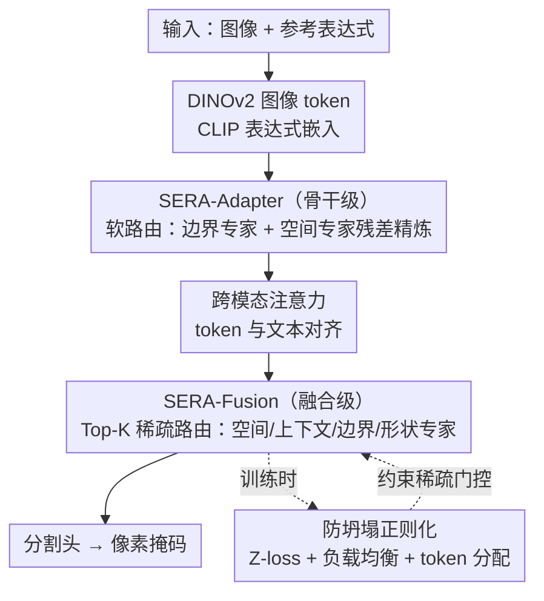

# Spatio-Semantic Expert Routing Architecture with Mixture-of-Experts for Referring Image Segmentation

**会议**: CVPR 2026  
**arXiv**: [2603.12538](https://arxiv.org/abs/2603.12538)  
**代码**: 无  
**领域**: 分割  
**关键词**: Referring Image Segmentation, Mixture-of-Experts, Parameter-Efficient Tuning, Vision-Language Models, Expert Routing  

## 一句话总结

提出 SERA 框架，在冻结的视觉-语言骨干网络中引入两阶段轻量级 MoE 专家精炼（骨干级 SERA-Adapter + 融合级 SERA-Fusion），通过表达式引导的自适应路由实现参考图像分割中的空间一致性和边界精度提升，仅更新不到 1% 的骨干参数。

## 研究背景与动机

参考图像分割（RIS）需要根据自然语言表达生成像素级掩码，核心难点在于将语言与视觉内容精确对齐，同时处理空间关系、细粒度属性和目标边界。现有方法存在三个关键问题：

**统一精炼策略的局限**：大多数方法对所有参考表达式使用相同的处理路径，无法匹配不同表达式的多样推理需求（有的依赖空间布局，有的依赖外观，有的依赖上下文关系）

**冻结骨干的适应困难**：为节省计算成本而冻结预训练编码器时，视觉表示的适应能力受限，导致掩码碎片化、边界泄漏或目标选错

**MoE 引入的挑战**：直接将 MoE 路由引入 RIS 面临训练不稳定和干扰预训练表示的风险

SERA 的核心动机是：不同的参考表达式需要不同类型的推理专家，因此引入条件化的专家路由机制，在保持预训练表示优势的同时实现表达式感知的特征精炼。

## 方法详解

### 整体框架

SERA 要解决的是参考图像分割里的一个现实矛盾：既想省钱冻结预训练骨干，又想让视觉表示能随表达式灵活调整。它的做法不是动骨干本身，而是在骨干内部和视觉-语言融合处各塞一组轻量级的 MoE 专家去"补课"。整体流程是：DINOv2 提取图像 token 序列、CLIP 提取表达式的全局嵌入，token 先在骨干内被 **SERA-Adapter** 精炼一遍，再在融合阶段被 **SERA-Fusion** 重塑成 2D 特征图后精炼第二遍，最后送入分割头出掩码。两个阶段的专家都不是统一处理所有表达式，而是根据当前表达式动态决定让哪类专家出力，从而让"空间型""外观型""上下文型"表达各自走到合适的精炼路径。

### 关键设计

**1. SERA-Adapter：在冻结骨干内部做稳定的专家精炼**

冻结编码器最大的代价是视觉表示无法随任务调整，容易出现掩码碎片、边界泄漏。SERA-Adapter 直接插进 DINOv2 选定的几个 Transformer 块里补这个缺口：它先把视觉 token 投影回 2D 空间网格，用 1×1/3×3/5×5 多尺度卷积分支富化局部上下文得到 $\mathbf{G}_{\text{rich}}$，再交给两个互补专家——边界专家用可学习深度卷积放大轮廓响应 $\mathbf{B} = \text{ReLU}(\text{BN}(\mathbf{G} + \beta \cdot \text{DWConv}_{3\times3}(\mathbf{G})))$（$\beta=0.1$），空间专家用深度卷积加带尺度残差强化局部一致性 $\mathbf{S} = \phi(\text{DWConv}_{3\times3}(\mathbf{G})) + \alpha \mathbf{G}$（$\alpha=0.3$）。

关键是它用的是**软路由**而非硬选择：对空间 token 做全局平均池化得到摘要 $\mathbf{z}$，线性投影加 softmax 得到两个专家的连续权重 $[w_s, w_b] = \boldsymbol{\sigma}(\mathcal{R}(\mathbf{z}))$，然后以残差形式叠回原特征

$$\mathbf{G}_{\text{corr}} = \mathbf{G}_{\text{rich}} + \alpha w_s \mathbf{E}_s + \beta w_b \mathbf{E}_b$$

（这里 $\alpha=0.25, \beta=0.15$ 是固定缩放系数），最后展平回 token 序列并与文本嵌入做跨模态注意力。之所以在骨干内坚持软路由而不是稀疏 Top-K，是因为稀疏门控在冻结编码器上容易训练不稳、扰动预训练表示；连续加权的残差精炼则能温和地注入表达式信息而不破坏原有特征。

**2. SERA-Fusion：在融合阶段用稀疏路由逼专家分工**

骨干精炼过的特征到了视觉-语言融合阶段还要再提质，但这一阶段的诉求和骨干内相反——这里希望不同专家真正各管一摊、形成特化，而不是人人都掺一脚。SERA-Fusion 因此设计了四个物理语义明确的专家：空间专家注入显式坐标信息 $E_{\text{spa}}(\mathbf{X}) = \mathbf{X} + \alpha \cdot \text{Conv}_{1\times1}(\mathbf{G})$（$\mathbf{G}$ 是归一化坐标网格）；上下文专家把空间维展平后做多头自注意力加 FFN 残差，捕获长程依赖；边界专家用固定 Sobel 算子取水平/垂直梯度及幅值 $E_{\text{bnd}}(\mathbf{X}) = \mathbf{X} + \phi(\text{Conv}_{1\times1}([\mathbf{X}, \mathbf{G}_{\text{mag}}, \mathbf{G}_x + \mathbf{G}_y]))$；形状专家结合深度模糊的低频平滑与拉普拉斯算子的高频结构线索，促进全局结构一致。

路由上它换成 **Top-K 稀疏门控**：先 $\mathbf{z} = \text{GAP}(\mathbf{X})$ 取摘要、$\mathbf{r} = \mathbf{W}_2 \sigma(\mathbf{W}_1 \mathbf{z})$ 算路由 logit，训练时加高斯噪声鼓励路由多样性，再 Top-K 选择 + softmax 归一化只激活少数专家。两阶段刻意用不同路由策略——骨干内求稳所以软路由，融合级求特化所以稀疏路由——正是 SERA 的核心取舍，让同一套 MoE 思想在两个对计算预算和稳定性要求不同的位置都站得住。

**3. 防止专家坍塌的正则化：让稀疏路由别退化成只用一个专家**

稀疏 Top-K 路由有个老毛病：门控容易偷懒，把绝大多数 token 全塞给同一个专家，其余专家饿死、特化无从谈起。SERA 用三个仅训练时生效的辅助损失把这件事按住：Z-loss 惩罚路由 logit 的均方幅度 $\mathcal{L}_z = \lambda_z \frac{1}{BE} \|\mathbf{r}\|_2^2$，防止 logit 爆炸；负载均衡损失惩罚各专家使用量的变异系数 $\mathcal{L}_{\text{balance}} = \lambda_{\text{bal}} \text{CV}(\mathbf{u})^2$，逼门控把 token 摊匀；token 分配正则化进一步稳住训练中 token 到专家的指派。三者合力，才让上面四个专家真的各自学到边界、空间、上下文、形状这些不同线索，而不是名义上四个、实际上一个。

### 损失函数 / 训练策略

- 总 MoE 正则化：$\mathcal{L}_{\text{MoE}} = \mathcal{L}_{\text{logit}} + \mathcal{L}_{\text{balance}} + \mathcal{L}_{\text{token}}$
- **参数高效策略**：骨干完全冻结，仅更新 LayerNorm 和 bias 参数（不到 1% 骨干参数），加上提出的模块和任务特定分割层
- 优化器：Adam，初始学习率 $1 \times 10^{-4}$，后期衰减 0.1 倍
- 硬件：单张 NVIDIA A6000，batch size 16

## 实验关键数据

### 主实验

在 RefCOCO/RefCOCO+/G-Ref 三个标准基准上评测（mIoU）：

| 方法 | 类型 | RefCOCO val | RefCOCO+ val | G-Ref val(g) | 平均 |
|------|------|-------------|--------------|--------------|------|
| ETRIS | PET | 70.5 | 60.1 | 57.9 | 62.8 |
| DETRIS-B | PET | 76.0 | 68.9 | 65.9 | 70.4 |
| VATEX | Full FT | 78.2 | 70.0 | 69.7 | 72.8 |
| RISCLIP-B | Full FT | 75.7 | 69.2 | — | 70.6 |
| **SERA (Ours)** | **PET** | **76.5** | **70.4** | **66.6** | **71.1** |

SERA 在冻结骨干的 PET 设置下超越所有 PET 方法，并与多个全量微调方法持平或接近。在 RefCOCO+（无绝对空间术语）上提升尤为显著，说明外观驱动和上下文驱动推理受益更大。

### 消融实验

**组件消融**（RefCOCO / RefCOCO+ / G-Ref(g) mIoU）：

| 配置 | RefCOCO | RefCOCO+ | G-Ref(g) |
|------|---------|----------|----------|
| Baseline | 74.90 | 68.70 | 65.10 |
| + SERA-Adapter | 75.35 (+0.45) | 69.42 (+0.72) | 65.74 (+0.64) |
| + SERA-Adapter + SERA-Fusion | **76.50 (+1.60)** | **70.40 (+1.70)** | **66.62 (+1.52)** |

**Top-K 路由消融**（RefCOCO val mIoU / oIoU）：

| Top-K | val mIoU | val oIoU |
|-------|----------|----------|
| K=1 | 75.46 | 73.32 |
| K=2 | 76.47 (+1.01) | 74.65 (+1.33) |
| K=3 | 76.20 (+0.74) | 74.10 (+0.78) |
| K=4 | 76.50 (+1.04) | 74.74 (+1.42) |

### 关键发现

1. 两个模块提供互补增益：SERA-Adapter 主要改善骨干级特征，SERA-Fusion 在融合阶段进一步增强空间表示
2. K=1 时性能最低，增加到 K>=2 后显著提升，K=4 总体最稳定
3. 在 RefCOCO+ 上增益最大（+1.70 mIoU），表明当空间术语被移除时，外观/上下文驱动的专家精炼更关键
4. 支持零样本跨数据集泛化，表明学到的视觉-语言表示可迁移

## 亮点与洞察

- **两阶段差异化路由策略**是精妙设计：骨干内用软路由保稳定，融合级用稀疏路由促特化
- 仅更新 bias + LayerNorm 的极端参数高效策略（<1% 参数）与 MoE 专家精炼结合，是新颖的设计空间
- 专家设计有明确物理语义（空间/边界/上下文/形状），比纯黑盒 MoE 更可解释
- 正则化策略（Z-loss + 负载均衡 + token 分配）确保了稀疏路由的健康训练

## 局限与展望

- 在 G-Ref 上的提升相对小于 RefCOCO+，长描述性表达的处理仍有改进空间
- 目前仅在 DINOv2 + CLIP 框架上验证，是否能迁移到其他 VLM 骨干（如 SAM、Grounding DINO）未知
- 专家数量和类型是手工设计的（4 个），是否可以自动发现最优专家组合值得探索
- 未在更大规模或更多样的分割任务上验证泛化性

## 评分

- **新颖性**: ⭐⭐⭐⭐ — 在 RIS 中首次系统引入 MoE 专家路由，且两阶段差异化路由策略设计精妙
- **实验**: ⭐⭐⭐⭐ — 三个标准基准 + 完整消融 + 零样本泛化 + 丰富定性分析，但缺少效率分析
- **写作**: ⭐⭐⭐⭐ — 结构清晰，公式完整，图表专业，方法阐述系统
- **价值**: ⭐⭐⭐⭐ — 为 VLM 的参数高效适应提供了新的 MoE 视角，对 RIS 和密集预测任务有启发

<!-- RELATED:START -->

## 相关论文

- [\[ICLR 2026\] AMLRIS: Alignment-aware Masked Learning for Referring Image Segmentation](../../ICLR2026/segmentation/amlris_alignment-aware_masked_learning_for_referring_image_segmentation.md)
- [\[CVPR 2026\] UnrealPose: Leveraging Game Engine Kinematics for Large-Scale Synthetic Human Pose Data](unrealpose_leveraging_game_engine_kinematics_for_large-scale_synthetic_human_pos.md)
- [\[CVPR 2026\] MixerCSeg: An Efficient Mixer Architecture for Crack Segmentation via Decoupled Mamba Attention](mixercseg_an_efficient_mixer_architecture_for_crack_segmentation_via_decoupled_m.md)
- [\[CVPR 2026\] Reasoning with Pixel-level Precision: QVLM Architecture and SQuID Dataset for Quantitative Geospatial Analytics](reasoning_with_pixel-level_precision_qvlm_architecture_and_squid_dataset_for_qua.md)
- [\[CVPR 2026\] Phrase-Instance Alignment for Generalized Referring Segmentation](phrase-instance_alignment_for_generalized_referring_segmentation.md)

<!-- RELATED:END -->
