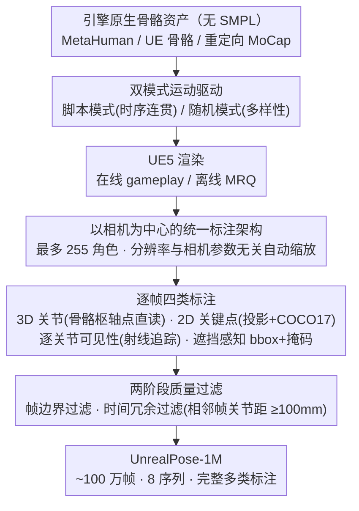

# UnrealPose: Leveraging Game Engine Kinematics for Large-Scale Synthetic Human Pose Data

**会议**: CVPR 2026  
**arXiv**: [2601.00991](https://arxiv.org/abs/2601.00991)  
**代码**: 有  
**领域**: 分割  
**关键词**: synthetic data, Human Pose Estimation, Unreal Engine, Game Engine, Instance Segmentation

## 一句话总结

提出 UnrealPose-Gen，一个基于 Unreal Engine 5 的合成人体姿态数据生成管线，利用游戏引擎原生骨骼运动学（而非 SMPL）生成百万级标注数据集 UnrealPose-1M，提供 3D 关节、2D 关键点、遮挡标志、实例分割掩码和相机参数等完整标注。

## 研究背景与动机

准确的 3D 人体姿态数据获取一直是领域痛点，现有途径各有严重缺陷：

**真实 3D 数据集受限**：Human3.6M、3DPW 等依赖 marker-based 动捕系统，成本高、场景单一、动作多样性不足

**2D 数据集缺少 3D 标注**：COCO-Pose、MPII 提供丰富的 in-the-wild 标注，但缺少 3D 且存在标注者间不一致性

**伪 3D 监督的偏差**：
   - **Lifting 方法**（2D→3D）：跨数据集泛化差，精度大幅下降
   - **参数模型拟合**（SMPL 系列）：继承训练数据（CAESAR）的人口统计偏差，关节位置依赖拟合质量和回归器选择而非解剖学，某些方法产生弯曲膝盖或不自然的直腿

**现有合成数据以 mesh 为中心**：SURREAL、AGORA、BEDLAM 等都围绕 SMPL 参数设计，关节标签来自 mesh 回归而非运动学枢轴点，且复杂交互仍是未解决问题

**核心洞察**：游戏开发者已经花了几十年创建复杂的多人交互、物体操作和多样角色动作——计算机视觉社区何不直接利用这些丰富的游戏动画资产？

## 方法详解

### 整体框架

这篇工作要解决的是「高质量 3D 人体姿态数据从哪来」的老问题，思路是把它整个搬进游戏引擎：用 Unreal Engine 5 渲染带骨骼的虚拟角色，从相机视角把每个角色的 3D 关节、2D 关键点、遮挡可见性、实例分割掩码和相机参数一次性全标出来。整套系统拆成两块——**UnrealPose-Gen** 是跑在 UE5 上的标注生成管线（支持在线 gameplay 渲染和离线 MRQ / Movie Render Queue 渲染两条路径），**UnrealPose-1M** 是用这条管线实际产出的约 100 万帧标注数据集。下面四个关键设计依次回答：标注从哪个坐标系产生、每帧标哪些东西、为什么敢扔掉 SMPL、以及怎么把动作驱动起来并筛掉废帧。

### 关键设计

**1. 以相机为中心的统一标注架构：在线、离线渲染共用一套标注逻辑**

现有合成数据集（SURREAL、AGORA、BEDLAM）都是离线批渲染产物，没法从运行中的游戏直接取数据。UnrealPose-Gen 把整个标注管线建在相机系统内部：用户先指定要追踪的角色资产（最多 255 个），系统就从相机视角统一提取这些角色的全部标注。它对相机参数（焦距、传感器尺寸、宽高比）和输出分辨率都不做假设，投影坐标会按当前相机自动缩放，所以同一套逻辑既能挂在离线的 MRQ 高质量渲染上，也能挂在实时 gameplay 渲染上。把标注收口到相机系统这一层，既保证在线/离线两条路径标出来的东西完全一致，也第一次让「直接从一个跑着的 UE5 游戏里抽训练数据」成为可能。

**2. 逐帧四类标注：从骨骼枢轴点直接读，连遮挡都标进去**

光有图像没用，关键是标注要齐、要对得上真实数据的口径。每一帧管线生成四类标注：（i）**3D 关节位置**——直接查询骨骼网格组件（skeletal mesh component）拿到世界坐标系下所有指定关节，再变换到相机坐标系；注意这些是驱动动画的枢轴点（pivot points），即骨骼旋转中心，而不是从 mesh 回归出来的 SMPL 关节。（ii）**2D 关键点**——同时给两组，一组是上面 3D 关节直接投影下来的 2D 坐标，另一组是标准 COCO-Pose 17 关键点，方便直接喂给现有 2D 模型。（iii）**逐关节可见性**——从相机到每个关节世界点做一次射线追踪（line trace），被挡住就标为不可见，这正是大多数合成数据集省略掉的信息。（iv）**遮挡感知的检测标签**——边界框和实例分割掩码都按遮挡裁切，被挡的部分不算进掩码、bbox 只紧包可见区域，每个人有唯一 instance ID 并跨帧保持。这样一来遮挡和多人交互场景里标注也不会糊。

**3. SMPL 无关的引擎原生标签：把参数模型的系统性偏差从源头去掉**

伪 3D 监督最大的隐患是 SMPL 拟合带进来的偏差，这也是本文最核心的卖点。UnrealPose-Gen 直接从 UE 骨骼枢轴点取关节标签，全程不碰 SMPL：用的是 MetaHuman 及其骨骼，任何 UE 兼容的骨骼与动画——商城买的资产、重定向过来的 MoCap、甚至重定向到 UE rig 上的 SMPL 动作——都能渲染并产出完整标注。这一刀切掉了 SMPL 的四类系统性偏差：关节位置不再依赖拟合质量和回归器选择而是真正的运动学旋转中心；不再受固定拓扑限制，松散衣物、头发和复杂接触都能建模；体型也不再被训练扫描的人口统计锁死（SMPL 的 CAESAR 来自 18–65 岁欧美人群）；同时还能白嫖游戏行业几十年积累的交互密集动画（格斗、对话、工具操作），这些恰恰是传统动捕难以安全采集的场景。

**4. 双模式运动驱动 + 两阶段质量过滤：在时序连贯和多样性之间各取所需，再筛掉废帧**

要让 100 万帧既覆盖广又对下游有用，得在「动作怎么演」和「哪些帧值得留」上都做控制。运动驱动器给两种模式：**脚本模式**定义一串标记点，角色在标记点间移动并播放指定动作/空闲动画，产出时序连贯的序列，适合视频级姿态方法；**随机模式**给定探索区域和动画目录，随机挑位置和动画，把姿态、视角、动作多样性拉满，适合单帧方法。生成之后再过两道质量关：**帧边界过滤**丢掉关键点投影出画面的帧，保证留下来的帧主体完整在画内；**时间冗余过滤**比较相邻帧的关节欧氏距离，变化太小的近重复帧直接扔，在不掉覆盖率的前提下压缩冗余。管线本身也高度可定制——改几行代码就能导出骨骼里任意关节子集（眼睛、耳朵、手指、面部特征点等）。

最终产出的 UnrealPose-1M 数据组成如下：

| 序列类型 | 帧数 | 场景 | 角色 | 动作 |
|----------|------|------|------|------|
| 连贯序列 x5 | ~800K | 5 场景（画廊+篮球场） | 5 个 MetaHuman | ~40 个脚本动作 |
| 随机序列 x3 | ~170K | 3 场景（城市公园） | 5 个 MetaHuman | ~100 个随机动画 |
| 多人帧 | ~115K | 2 个场景 | — | — |
| **总计** | **~1M** | **8 个环境** | **5 个角色** | **多样** |

相机配置也刻意做宽：FOV 从 30° 到 90°，高度从地面到俯览，距离远近不一，涵盖标准基准里罕见的地面视角和陡峭俯角。每帧标注包含：(i) 17 个 COCO 格式 2D 关键点 + 可见性；(ii) 16 个骨骼关节的 2D 投影 + 可见性；(iii) 16 个 3D 关节的世界/相机坐标；(iv) 每人 bbox + 分割掩码 + 唯一 ID。数据按 75/20/5 划分训练/验证/测试，并要求相邻帧（相机坐标系下所有关节欧氏距离之和）至少相差 100mm。

### 损失函数 / 训练策略

本文是数据集/管线贡献，不涉及模型训练。验证实验直接用现有预训练模型在合成数据上推理评估数据质量（real-to-synthetic 评估），不做微调。

## 实验关键数据

### 主实验

使用预训练模型（未在合成数据上微调）评估 real-to-synthetic 迁移，验证数据保真度：

| 模型 | 任务 | AP | AP50 | AP75 | AR | MPJPE(mm) | PA-MPJPE(mm) |
|------|------|------|------|------|------|-----------|-------------|
| HRNet-W48 | Image→2D (Top-down) | 0.883 | 0.990 | 0.980 | 0.896 | — | — |
| DEKR-HRNet-W32 | Image→2D (Bottom-up) | 0.802 | 0.977 | 0.923 | 0.831 | — | — |
| PoseAug | 2D→3D Lifting | — | — | — | — | 61.81 | 57.28 |
| MeTRAbs | Image→3D | — | — | — | — | 104.16 | 111.41 |
| Mask2Former (Swin-L) | 实例分割 | avg IoU=0.89 | — | — | — | — | — |

### 消融实验

**PoseAug 逐关节 MPJPE 分布**（2D→3D lifting）：

| 关节区域 | 误差趋势 | 说明 |
|----------|----------|------|
| 躯干关节（颈、脊柱、髋） | 低误差 | 低关节度、几何稳定 |
| 末端关节（肘、腕、膝、踝） | 高误差 | 高关节度、遮挡频繁、外观多变 |
| 骨盆 | 最高原始误差 | 作为对齐根节点，反映残余全局偏移而非局部姿态质量 |

**MeTRAbs Image→3D 逐关节分析**：

| 关节区域 | 误差趋势 | 说明 |
|----------|----------|------|
| 核心躯干关节（髋等） | 低误差 | 纹理稳定、形状清晰，跨域影响小 |
| 末端关节（颈、腕、踝） | 高误差 | 视角/遮挡/渲染细节差异导致跨域误差更大 |

### 关键发现

1. **高 2D 关键点 AP**（HRNet 0.883 AP）：COCO 预训练模型在合成数据上表现强劲但未饱和，验证标注兼容性和图像真实感
2. **合理的跨域 3D 误差**：PoseAug 的 61.8mm MPJPE 在跨域研究的预期范围内，说明 2D-3D 标注几何一致性强
3. **误差模式与真实数据一致**：躯干低误差、末端高误差的解剖学模式在合成和真实数据集中表现一致，这是数据保真度的重要证据
4. **实例分割高质量**：Mask2Former 达到 0.89 avg IoU，场景元素（天空、花瓶、树木）也被正确标注，验证了 MetaHuman 渲染和环境的真实感
5. 多人场景中遮挡和交互的处理保持了标注质量

## 亮点与洞察

- **范式转换**：从"苦苦合成人体交互"到"直接利用游戏行业已有的丰富动画资产"，这是一个非常务实的洞察
- **SMPL 无关性**是关键卖点——消除了参数模型的系统性偏差（人口统计、回归器依赖、拟合伪影）
- **在线/离线双模式**：不仅支持高质量离线渲染，还能在游戏运行时实时生成数据，开放了从现有 UE5 游戏中提取训练数据的可能性
- **遮挡感知标注**：关键点可见性标志和遮挡感知边界框/掩码，这些细节对实际应用至关重要但在现有合成数据集中常被忽略
- 管线高度可定制——支持任何 UE 兼容骨骼、任意关节子集、灵活相机配置

## 局限与展望

- **算力限制未做训练实验**：只做了推理评估，未验证在 UnrealPose-1M 上训练模型再迁移到真实数据的效果，这是最关键的缺失实验
- **角色多样性有限**：仅 5 个 MetaHuman，虽然 MetaHuman Creator 可生成数千种角色
- **静态相机**：目前使用固定相机位置，不支持移动相机和动态内参，简单扩展但尚未实现
- **手动集成**：需要手动集成到 UE5 项目中，尚未打包为即插即用的 UE5 插件
- **在线渲染未在真实游戏中验证**：MRQ 离线渲染已验证，但从运行中的游戏实时提取数据的性能和质量尚未测试
- **数据集规模受时间和算力约束**：虽然管线理论上无限制，合成数据的 scaling law 仍是开放问题

## 评分

- **新颖性**: ⭐⭐⭐⭐ — 从游戏引擎原生骨骼取代 SMPL 的思路新颖且务实，但合成数据管线本身并非全新概念
- **实验**: ⭐⭐⭐ — 验证数据质量的实验设计合理但不够深入，缺少在合成数据上训练后迁移到真实数据的关键实验
- **写作**: ⭐⭐⭐⭐ — 动机阐述有力，与 SMPL 方法的对比论证清晰，技术细节充分
- **价值**: ⭐⭐⭐⭐ — 开源管线+数据集具有实际影响力，为社区提供了一条利用游戏资产的新路径，但需要后续工作验证训练效果

<!-- RELATED:START -->

## 相关论文

- [\[CVPR 2026\] XSeg: A Large-scale X-ray Contraband Segmentation Benchmark for Real-World Security Screening](xseg_a_large-scale_x-ray_contraband_segmentation_benchmark_for_real-world_securi.md)
- [\[ICML 2026\] What Makes Synthetic Data Effective in Image Segmentation](../../ICML2026/segmentation/what_makes_synthetic_data_effective_in_image_segmentation.md)
- [\[AAAI 2026\] Do We Need Perfect Data? Leveraging Noise for Domain Generalized Segmentation](../../AAAI2026/segmentation/do_we_need_perfect_data_leveraging_noise_for_domain_generalized_segmentation.md)
- [\[CVPR 2025\] Scale Efficient Training for Large Datasets](../../CVPR2025/segmentation/scale_efficient_training_for_large_datasets.md)
- [\[CVPR 2026\] RealVLG-R1: A Large-Scale Real-World Visual-Language Grounding Benchmark for Robotic Perception and Manipulation](realvlg-r1_a_large-scale_real-world_visual-language_grounding_benchmark_for_robo.md)

<!-- RELATED:END -->
