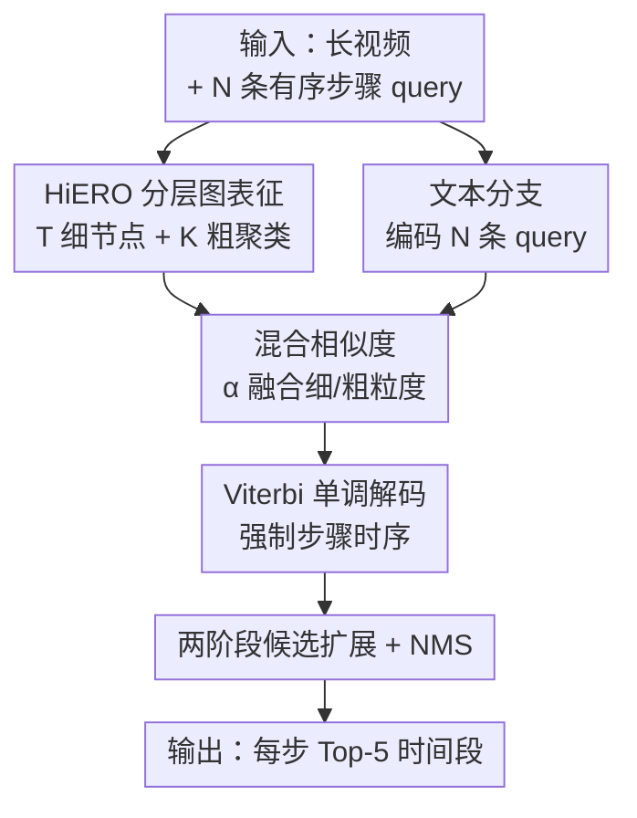

# HiERO-StepG @ Ego4D Step Grounding Challenge: hierarchical activity understanding enables zero-shot step grounding

**会议**: CVPR 2026 (Ego4D Step Grounding Challenge 技术报告)  
**arXiv**: [2605.31227](https://arxiv.org/abs/2605.31227)  
**代码**: https://github.com/andreazenotto/HiERO-StepG (有)  
**领域**: 自监督 / 表示学习 / 第一人称视频 / 过程理解  
**关键词**: Step Grounding, 零样本, 分层视频图, Viterbi 解码, 弱监督表征

## 一句话总结
在 HiERO 弱监督表征空间上，给零样本步骤定位（step grounding）加一套"分层相似度融合 + Viterbi 单调解码 + 动态候选扩展"的纯推理后处理，不用任何步骤边界标注，就在 Ego4D Step Grounding 挑战赛 R1@IoU=0.3 上拿到 56.27%、全球榜第二。

## 研究背景与动机
**领域现状**：Step Grounding 任务给定一段第一人称长视频和一条自由文本描述的"过程步骤"（procedural step），要定位出这个步骤在视频里的起止时间，本质是 moment localization 在 Ego4D GoalStep 上的细分。主流做法是全监督——拿标注好的步骤边界去训一个定位模型（OSGNet、BayesianVSLNet、EgoVideo 等）。

**现有痛点**：全监督路线依赖大量"步骤级"时间边界标注，而这类标注比"动作级"窄叙述（narration）贵得多，扩展性差。一类无监督替代是把"同一任务的多个视频里反复出现的动作簇"当作步骤，但它假设所有视频属于同一任务、共享同一套步骤，无法泛化到没见过的流程。StepFormer 用可学习 query 从 narration 里建模隐式步骤，但只在单一时间粒度上建模，抓不住人类活动天然的"步骤—子步骤"分层结构。

**核心矛盾**：过程活动本身是分层的（做菜=若干大步骤，每步又拆成小动作），但要么靠昂贵标注硬学这个层次、要么用便宜监督却丢掉层次。

**本文目标**：不碰任何步骤边界标注，只用便宜的动作级 narration，让步骤"涌现"出来并精确定位。

**切入角度**：作者基于 HiERO——一个把"功能相关的动作"在特征空间里拉近的弱监督表征。在这个空间里，过程步骤天然表现为"叙述相似的动作簇"，做个聚类就能检测出来，不需任务特定微调。问题只剩：HiERO 原生的零样本定位对文本歧义、过于宽泛的步骤描述、高度重复的 query 不够鲁棒。

**核心 idea**：保持 HiERO 表征不动（完全零样本），只在**定位阶段**加约束——融合细/粗两个粒度的相似度、用 Viterbi 强制步骤时序单调、再用两阶段候选扩展精修边界，把涌现出来的步骤"锁"到正确时间段。

## 方法详解

### 整体框架
输入是一段长视频和 $N$ 条按时间先后排好的步骤文本 query，输出是每条 query 在视频里的 Top-5 候选时间段。整条流水线分两个分支汇合再解码：**图分支**把视频编码成分层视频图，给出 $T$ 个细粒度时间节点和 $K$ 个粗粒度聚类；**文本分支**把 $N$ 条 query 编码到同一空间。两个粒度各自和 query 算相似度后，用权重 $\alpha$ 线性融合成"混合相似度矩阵" $S \in \mathbb{R}^{N\times T}$，再交给 Viterbi 解码求一条单调最优路径，最后做候选扩展 + NMS 输出 Top-5。

注意：图分支 / 文本分支 / 对比训练都来自 HiERO（背景模块，不是本文新增）；本文的贡献集中在虚线之后的"混合相似度 → Viterbi → 候选扩展"这条零样本定位链路。

### 关键设计

**1. HiERO 分层图表征：让步骤无需标注就从动作簇里涌现**

这是整套零样本能力的地基（来自 HiERO，本文沿用）。把视频切成 $T$ 个不重叠 clip，用视频特征提取器（LaViLa / EgoVLP）抽 clip 嵌入，构成视频图 $\mathcal{G}=(\mathbf{X},\mathcal{E},\mathbf{p})$：节点 $\mathbf{X}\in\mathbb{R}^{T\times D}$ 是 clip 嵌入，时间距离小于阈值 $\tau$ 的节点才连边，$\mathbf{p}$ 编码时间戳。图分支是 encoder-decoder：时间编码器逐级把分辨率折半，得到 $L$ 个越来越粗的图 $\{\mathcal{G}^{(0)},\dots,\mathcal{G}^{(L)}\}$，实现局部时间推理；function-aware 解码器再用谱聚类把"时间上可能很远但功能相似"的节点聚成 functional threads，在每个 thread 内部做推理后传回原图。训练靠两个目标：视频-文本对比对齐 $\mathcal{L}_{vna}$（让节点嵌入靠近其时间窗内的 narration 嵌入）+ functional threads 聚类 $\mathcal{L}_{ft}$（同簇拉近、异簇推远），在 EgoClip 约 3.8M clip-text 对上弱监督训练。结果是一个"距离=功能相似度"的空间，步骤/子步骤自然成簇，推理时一个谱聚类就能检测——这正是零样本的来源

**2. 混合相似度：用粗粒度全局上下文给细粒度去噪**

HiERO 原生只在最细的 $\mathcal{G}^{(0)}$ 节点上和 query 算相似度，对视觉噪声和过于宽泛的步骤描述很脆弱。本文把细粒度局部相似度（来自 $\mathcal{G}^{(0)}$ 节点嵌入与 $\ell_2$ 归一化 query 的余弦相似度）和粗粒度全局相似度（来自对应的 $\mathcal{G}^{(L)}$ 粗聚类）按权重 $\alpha$ 线性融合，得到混合相似度矩阵 $S\in\mathbb{R}^{N\times T}$，$s_{ij}$ 表示第 $i$ 条 query 与第 $j$ 个时间节点的得分（实现取 $\alpha=0.7$）。粗粒度提供"当前大活动是什么"的全局语境，细粒度提供精确时刻，两者一融合，步骤分配对视觉噪声更稳——消融里它在 LaViLa 上单独带来 +5.72% R1@0.3

**3. Viterbi 单调解码：把"步骤必须按顺序发生"变成硬约束**

零样本逐 query 独立取最相似段，会把"高度重复的步骤"分配错位（比如 query 在视频里出现多次时乱配）。本文把 $N$ 条 query 的定位建成一个全局最优单调路径问题：求节点序列 $P=(p_1,\dots,p_N)$ 最大化 $\max_P \sum_{i=1}^{N} S_{i,p_i}$，约束 $t(p_{i-1}) \le t(p_i)+\tau$，即步骤 $i$ 不能在步骤 $i-1$ 完成前开始（$\tau$ 是容许轻微重叠的小容忍窗，取 1.0 秒）。用 Viterbi 动态规划求解：得分累积矩阵 $D$ 满足 $D_{1,t}=S_{1,t}$，后续 $D_{i,t}=S_{i,t}+\max_{t'}\big(D_{i-1,t'}+\phi(t',t)\big)$，其中时序掩码 $\phi(t',t)=0$（合法转移 $t'\le t+\tau$）或 $-10^9$（非法，直接排除非单调路径），最后回溯重建最优路径 $P$。这一步是涨点主力——引入它就带来 +19.58% R1@0.3，因为它能消歧重复步骤并保证预测严格按流程顺序排布

**4. 两阶段候选扩展 + NMS：从单点对齐扩成 Top-5 多样时间段**

Viterbi 给的是每步一个最优节点（点级对齐），但榜单要 Top-5 且要覆盖步骤真实时长。本文先做点级候选生成：除 Viterbi 结果外，再取每个候选步骤内及全视频中相似度最高的节点当额外候选；再做 query 条件的动态边界扩展：从每个峰值节点向左右迭代扩边界，直到局部余弦相似度跌破"动态停止阈值"（峰值最大相似度的某个相对比例），并用一组不同的扩展比例（0.6 / 0.5 / 0.4）对每个峰生成一簇同心候选段；最后所有段补到最小时长（2 秒）、做 IoU=0.65 的 NMS 去冗余，得到最终 Top-5 多样预测。它把"死板贴着聚类边界"换成"自适应贴着真实时长"，在 R5 指标上拉升明显（LaViLa 上 R5@0.3 从 65.06 升到 67.74）

### 损失函数 / 训练策略
本文**不训练新模型**——HiERO 用 $\mathcal{L}_{vna}+\mathcal{L}_{ft}$ 在 EgoClip 约 3.8M clip-text 对上预训练后冻结，HiERO-StepG 的全部贡献是推理期后处理，因此对 step grounding 任务完全零样本、不碰任何步骤边界标注。关键超参：混合相似度 $\alpha=0.7$、Viterbi 容忍 $\tau=1.0$ 秒、扩展比例 $\{0.6,0.5,0.4\}$、最小段长 2 秒、NMS IoU 阈值 0.65。

## 实验关键数据

### 主实验
Ego4D GoalStep 测试集官方榜单（提交截止后），主指标 R1@IoU=0.3。本文（andreazenotto）在完全零样本、无步骤标注的前提下排名第二，且远超所有 2025 年的全监督方法：

| 方法 | 年份 | R1@0.3 | R1@0.5 | R5@0.3 | R5@0.5 |
|------|------|--------|--------|--------|--------|
| yisen_feng（榜一） | 2026 | 63.02 | 54.21 | 80.12 | 74.93 |
| **本文 HiERO-StepG（零样本）** | 2026 | **56.27** | 40.20 | 77.39 | 61.38 |
| kaname06 | 2026 | 53.39 | 45.43 | 79.91 | 73.59 |
| OSGNet（全监督） | 2025 | 42.02 | 32.83 | - | - |
| BayesianVSLNet（全监督） | 2025 | 35.18 | 20.49 | - | - |
| EgoVideo（全监督） | 2025 | 34.06 | 26.97 | - | - |

### 消融实验
验证集上逐模块叠加（LaViLa-L 特征）。从 HiERO 基线起，每加一个本文模块就稳涨：

| 配置 | R1@0.3 | R1@0.5 | R5@0.3 | R5@0.5 |
|------|--------|--------|--------|--------|
| Raw features | 14.96 | 10.88 | 33.65 | 23.23 |
| HiERO baseline（谱聚类逐 query） | 15.70 | 11.27 | 36.37 | 25.44 |
| + Viterbi 单调解码 | 35.28 | 24.90 | 44.49 | 31.00 |
| + 混合相似度 | 41.00 | 28.81 | 48.65 | 33.74 |
| + Query 条件扩展 + NMS | 48.51 | 34.58 | 65.06 | 49.34 |
| + 动态扩展 | 48.51 | 34.58 | **67.74** | **53.53** |

EgoVLP 特征下趋势一致：基线 13.98 → +Viterbi 33.95 → +混合 39.63 → +扩展NMS 45.40。

### 关键发现
- **Viterbi 单调解码贡献最大**：单独叠加带来 +19.58% R1@0.3（LaViLa），说明"消歧重复步骤 + 强制流程顺序"是 step grounding 最值钱的先验，远比表征本身的微调重要。
- **混合相似度**靠粗粒度全局上下文去噪，再贡献 +5.72% R1@0.3。
- **动态扩展**对 R1 几乎不变（48.51→48.51），但把 R5@0.3 从 65.06 拉到 67.74——它的价值在"多样 Top-5 召回"而非单点精度，正好契合榜单需要返回 5 个候选。
- 零样本反超全监督：本文 56.27 比 2025 全监督 SOTA OSGNet（42.02）高出 14 个点，印证"功能相似度表征 + 强时序先验"的组合拳。

## 亮点与洞察
- **"冻结表征 + 纯推理后处理"也能上榜第二**：整套方法不训练、不碰步骤标注，价值全在解码端的三个先验，提醒我们好的表征空间上"怎么读出答案"和"表征本身"同样关键。
- **把定位问题重述成单调路径 DP**：用 $\phi(t',t)=-10^9$ 这种"硬惩罚掩码"把时序约束塞进 Viterbi，是个干净可复用的 trick——任何"有序 query 对齐长序列"的任务（指令跟随、流程检索、字幕对齐）都能直接搬。
- **细/粗双粒度融合去噪**：用同一分层图天然产出的粗聚类当全局先验给细节点降噪，省掉了额外多尺度网络，是分层图表征的顺手红利。
- **同心多比例扩展专攻 Top-K 召回**：对 R1 无害、对 R5 显著有益，说明"边界精修"和"召回多样性"要分开优化，对所有 Top-K 检索类任务都有借鉴意义。

## 局限与展望
- **依赖 query 已按时间排好**：方法假设 $N$ 条步骤 query 严格按视频出现顺序给定，单调约束才成立；query 顺序未知或乱序时 Viterbi 的硬单调会失效。
- **严格单调对真实重叠/回退不友好**：现实流程会回头重做某步、或两步并行，$-10^9$ 的硬惩罚一刀切排除非单调路径，$\tau$ 只给极小容忍窗，难处理交错步骤。
- **天花板仍受 HiERO 表征约束**：冻结表征意味着对训练时未覆盖的活动类型、过于抽象的步骤描述，相似度本身就不准，后处理救不回来；与榜一（63.02）差 6.75 个点也部分来自此。
- **超参偏经验**：$\alpha=0.7$、$\tau=1.0$、扩展比例 0.6/0.5/0.4、NMS 0.65 均为手调，跨数据集/特征是否稳健未充分验证。
- 改进方向：放宽单调为"软"时序先验（允许有界回退/重叠）、让 query 顺序也可学、把后处理涨点反哺到表征微调。

## 相关工作与启发
- **vs HiERO（本文基础）**：HiERO 给出零样本 step grounding 的表征和"谱聚类逐 query"基线；本文不动表征，只在定位阶段加混合相似度 + Viterbi + 候选扩展，把验证集 R1@0.3 从 15.70 抬到 48.51，是对 HiERO 推理链路的工程化加固。
- **vs StepFormer**：StepFormer 用可学习 query 在单一时间粒度建模隐式步骤；本文借分层图天然拿到多粒度（细节点 + 粗聚类）并显式融合，更贴合活动的层次结构。
- **vs BayesianVSLNet（全监督）**：BayesianVSLNet 用时间先验去平移"出现多次的步骤"的预测，本文受其启发但走得更彻底——把时序先验做成 Viterbi 全局单调约束，且完全零样本，最终 R1@0.3（56.27）远超它（35.18）。
- **vs OSGNet / EgoVideo（全监督）**：它们靠标注步骤边界训练定位模型，本文不用任何步骤标注却反超 14+ 个点，质疑了"step grounding 必须重标注"的默认假设。

## 评分
- 新颖性: ⭐⭐⭐⭐ 表征非自创（来自 HiERO），但"冻结表征 + 单调 DP 解码 + 同心候选扩展"的零样本组合拳设计精巧、reframe 干净。
- 实验充分度: ⭐⭐⭐ 挑战赛技术报告体量，主表 + 双特征逐模块消融到位，但缺超参敏感性、跨数据集泛化与定性分析。
- 写作质量: ⭐⭐⭐⭐ 流水线清晰、公式完整、消融叙事层层递进，背景与贡献边界交代明确。
- 价值: ⭐⭐⭐⭐ 零样本反超全监督、榜单第二，且 Viterbi 单调解码这套先验对有序序列对齐类任务高度可迁移。

<!-- RELATED:START -->

## 相关论文

- [\[ICML 2026\] From Zero to Hero: Advancing Zero-Shot Foundation Models for Tabular Outlier Detection](../../ICML2026/self_supervised/from_zero_to_hero_advancing_zero-shot_foundation_models_for_tabular_outlier_dete.md)
- [\[ICML 2026\] InfoAtlas: A Foundation Model for Zero-Shot Statistical Dependence Estimation](../../ICML2026/self_supervised/infoatlas_a_foundation_model_for_zero-shot_statistical_dependence_estimate.md)
- [\[ICCV 2025\] CObL: Toward Zero-Shot Ordinal Layering without User Prompting](../../ICCV2025/self_supervised/cobl_toward_zero-shot_ordinal_layering_without_user_prompting.md)
- [\[CVPR 2026\] Free-Grained Hierarchical Visual Recognition](free-grained_hierarchical_visual_recognition.md)
- [\[CVPR 2026\] Group-DINOmics: Incorporating People Dynamics into DINO for Self-supervised Group Activity Feature Learning](group_dinomics_incorporating_people_dynamics_into_dino_for_self_supervised_group_activity_feature_learning.md)

<!-- RELATED:END -->
