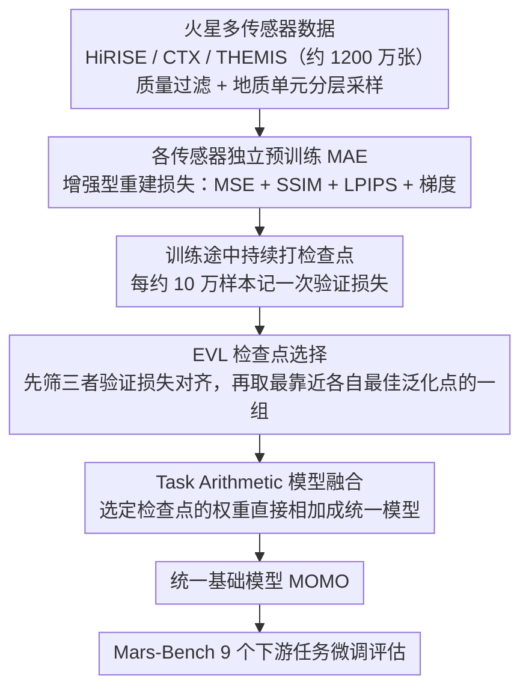

# MOMO: Mars Orbital Model — Foundation Model for Mars Orbital Applications

**会议**: CVPR 2026  
**arXiv**: [2604.02719](https://arxiv.org/abs/2604.02719)  
**代码**: [https://github.com/kerner-lab/MOMO](https://github.com/kerner-lab/MOMO)  
**领域**: 自监督  
**关键词**: 火星遥感, 基础模型, 模型融合, 检查点选择策略, 多传感器

## 一句话总结

MOMO 是首个火星遥感基础模型，通过在三种火星传感器（HiRISE/CTX/THEMIS）上分别预训练 MAE 并提出 Equal Validation Loss（EVL）检查点选择策略进行模型融合，在 Mars-Bench 的 9 个下游任务上超越 ImageNet 预训练和地球观测基础模型。

## 研究背景与动机

**领域现状**：基础模型在地球观测（EO）领域已有超过 150 个模型（SatMAE、CROMA、Prithvi 等），在食品安全、灾害响应等应用中取得广泛成功。火星轨道卫星同样系统性地采集行星表面观测数据，但至今没有专门为火星遥感设计的基础模型。研究者仍在使用 ImageNet 预训练模型处理火星任务。

**现有痛点**：(1) 地球 EO 基础模型无法直接迁移到火星：不同的大气条件、光照、表面材质和传感器特性导致分布差异大。(2) 火星传感器间差异极大：HiRISE 分辨率 0.25m/像素、CTX 5m/像素、THEMIS 100m/像素；覆盖率差异也很大（CTX 覆盖约 100%、HiRISE 不到 3%）。(3) 传统的多传感器融合方法（如数据堆叠、异构数据混合训练）在火星数据上不可行或不可扩展。

**核心矛盾**：火星多传感器数据在空间分辨率上跨越 400 倍（0.25m 到 100m），覆盖率差异巨大，且缺乏时空对齐的共现观测。传统的 channel stacking 或 joint training 方法要么要求数据对齐，要么在新增传感器时需要全部重训。

**本文目标** 如何高效构建一个统一的火星多传感器基础模型，使其能在各种火星遥感任务上超越 ImageNet 和 EO 预训练？

**切入角度**：不直接混合异构数据，而是各传感器独立训练 MAE，然后用 task arithmetic 融合参数。关键洞察是：直接在最后 checkpoint 融合可能不稳定，因为各传感器训练轨迹不同。提出 EVL 策略对齐训练阶段后再融合。

**核心 idea**：各传感器独立预训练 MAE + 基于验证损失对齐的检查点选择策略 + task arithmetic 模型融合 = 首个火星遥感基础模型。

## 方法详解

### 整体框架

MOMO 想解决的问题很直接：火星有三种轨道传感器（HiRISE、CTX、THEMIS），分辨率从 0.25m 到 100m 跨越 400 倍、覆盖率天差地别、又没有时空对齐的共现观测，传统把它们堆在一起 joint training 的路子在这里走不通。MOMO 的应对是"分而治之再合并"：先准备约 1200 万张高质量火星图像（每个传感器约 400 万），为每个传感器**各自独立**预训练一个 MAE（重建目标用一个增强型组合损失，逼模型学到地貌结构而非只学颜色纹理）；训练途中持续打检查点并记录验证损失；最后用 EVL 策略挑出三个模型"收敛程度相当"的那组检查点，再用 task arithmetic 把它们的权重直接加成一个统一模型。这个统一模型就是 MOMO，可以拿去 Mars-Bench 的 9 个下游任务上微调评估。

### 关键设计

**1. 增强型重建损失：让 MAE 学到地貌结构而不只是颜色纹理**

标准 MAE 用 MSE 当重建目标，问题在于 MSE 只盯像素强度对不对，对形状、边界连续性这类高阶空间特征不敏感——结果模型能把颜色纹理补回来，却重建不出环形山的精确轮廓，而火星分割任务恰恰最吃这种边界与形状信息。MOMO 把重建目标换成一个组合损失

$$\mathcal{L}_\text{total} = \lambda_1\mathcal{L}_\text{MSE} + \lambda_2\mathcal{L}_\text{SSIM} + \lambda_3\mathcal{L}_\text{LPIPS} + \lambda_4\mathcal{L}_\text{grad}$$

四项各管一摊：MSE 保像素级保真，SSIM 约束结构一致性，LPIPS 给出感知级约束，梯度损失 $\mathcal{L}_\text{grad}$ 则惩罚预测图和真值图在水平/垂直方向梯度上的差异、逼模型把边缘的空间平滑性也学对。多出来的这几项正是冲着下游分割对边界形状的需求去的，纯 MSE 学到的表示在这些任务上会明显吃亏。

**2. Equal Validation Loss（EVL）检查点选择：在"收敛程度相当"的地方融合，而不是各取最终点**

三个传感器数据分布差异大、训练轨迹各走各的，如果直接拿各自最后一个 checkpoint、或各自 early-stopping 点去融合，很可能出现有的模型已经过拟合、有的还欠拟合，权重凑在一起就不稳。EVL 的做法是让融合发生在三者收敛水平接近的时刻：训练中每处理约 10 万样本就记一次验证损失 $\mathcal{L}_i^{(e)}$ 并存一个检查点，然后在所有传感器的 epoch 组合 $\mathbf{t_c}=(e^1,\dots,e^n)$ 里筛出"损失对齐"的——要求任意两个传感器的验证损失差

$$\Delta_{ij} = |\mathcal{L}_i^{(e_a^i)} - \mathcal{L}_j^{(e_b^j)}| \leq \epsilon$$

在所有满足这个对齐条件的组合中，再挑离各自 early-stopping epoch 平均距离最小的一组，即

$$\mathbf{t_c}^\star = \min_{\mathbf{t_c} \in \mathcal{E}_\text{EVL}} \bar{D}(\mathbf{t_c}),\quad \bar{D}(\mathbf{t_c}) = \frac{1}{n}\sum_i |e^i - s_{es}^i|$$

第一个条件保证三者"收敛得差不多"，第二个条件保证这组检查点又都尽量靠近各自的最佳泛化点。两个条件叠在一起，融合时就不会出现一个模型拖另一个后腿的情况，融合后的稳定性也更好。

**3. Task Arithmetic 模型融合：用加权重代替混数据，天然支持增量扩展**

选定那组最优检查点后，MOMO 取出各传感器模型的参数 $\{\theta_i^{(e_\star^i)}\}$，直接用 task arithmetic 的加法把权重合成一个模型 $\text{MOMO}=\mathcal{T}(\theta_1^{(e_\star^1)},\dots,\theta_n^{(e_\star^n)})$。相比把异构数据混在一起训（Data Merge），这条路最大的好处是可扩展：以后想加一个新传感器，只要单独训它的 MAE 再融进来，不用把所有传感器从头重训。而它之所以能融得动，前一步的 EVL 是关键——损失景观可视化显示 EVL 选出的这几个模型在权重空间本就更靠近、落在同一个损失盆地里，所以线性相加才不会掉到性能塌陷的区域。

### 损失函数 / 训练策略

每个传感器独立训练 5 个 epoch，每个训练约 400 万样本。使用 HEALPix 策略划分训练/验证集以防数据泄漏。预训练数据经过 SSIM 和噪声估计的质量过滤（阈值 0.4），并按火星地质单元分层采样确保地理代表性。

## 实验关键数据

### 主实验

| 模型 | AtmosDust | DoMars16k | Frost | Landmark | Boulder | ConeQuest | Crater Binary | Crater Multi | MMLS | Avg. Rank |
|------|-----------|-----------|-------|----------|---------|-----------|---------------|-------------|------|-----------|
| Scratch | 0.94 | 0.73 | 0.95 | 0.79 | 0.07 | 0.52 | 0.37 | 0.05 | 0.50 | 4.11 |
| ImageNet | 0.92 | **0.91** | 0.97 | **0.92** | 0.16 | 0.70 | 0.55 | 0.11 | 0.57 | 2.33 |
| SatMAE | 0.96 | 0.93 | 0.97 | 0.92 | 0.05 | 0.68 | 0.46 | 0.04 | 0.32 | 3.00 |
| **MOMO** | **0.96** | 0.92 | **0.98** | 0.91 | **0.20** | **0.71** | **0.54** | **0.12** | **0.57** | **1.67** |

分类任务平均 F1-score，分割任务报告 mIoU。MOMO 平均排名 1.67，显著优于所有基线。

### 消融实验

| 检查点策略 | Boulder | ConeQuest | Crater Binary |
|-----------|---------|-----------|---------------|
| Early Stopping (ES) | 0.12 | 0.68 | 0.50 |
| Last Epoch (LE) | 0.18 | 0.70 | 0.50 |
| **EVL (Ours)** | **0.20** | **0.71** | **0.54** |

EVL 在三个分割任务上一致优于 ES 和 LE，平均提升约 2.5% mIoU。

### 关键发现

- **分割 vs 分类**：MOMO 在分割任务上优势明显（平均 mIoU 提升 ~4% vs ImageNet），但分类任务提升较小（~1.25%），说明 in-domain 预训练对精细空间理解帮助更大
- **EO 模型在火星上表现不佳**：CROMA、Prithvi 等 EO 基础模型在分割任务上远不如 ImageNet，验证了地球和火星数据分布确实有本质差异
- **MOMO vs 数据混合训练（DM）**：DM 方式在 Frost 任务上 F1 只有 0.44（vs MOMO 的 0.98），崩溃严重，说明直接混合异构数据的训练不稳定
- **MOMO vs 单传感器预训练**：单传感器预训练在对应传感器任务上表现不错，但需要维护多个模型。MOMO 统一一个模型即可处理所有传感器，分割性能还平均高 4.2%
- **损失景观分析**：EVL 选择的检查点在权重空间更紧密，位于更平坦的损失盆地中，解释了其更好的稳定性和泛化性

## 亮点与洞察

- **基于验证损失对齐的检查点选择**：这是一个简单但有效的技术贡献，可广泛应用于任何需要融合异构数据训练模型的场景。核心思想是"在相似收敛水平融合"，而非简单地在最终或最佳检查点融合
- **模型融合替代数据融合的思路**：避免了异构数据混合训练的不稳定性，且天然支持增量扩展（新传感器只需训+合），这对地球遥感多传感器基础模型也有借鉴
- **增强型 MAE 损失**：在火星地貌这类结构特征至关重要的场景中，组合 LPIPS + SSIM + 梯度损失远优于纯 MSE，这对任何空间结构敏感的 MAE 预训练都适用

## 局限与展望

- 受计算限制未与更多模型融合基线比较（如 Git Re-Basin、alignment-based 方法），可能还有更好的融合策略
- 假设模型间存在线性模式连通性，在数据分布差异极大时可能不成立
- 仅使用三种传感器，未来扩展到更多传感器（如 CRISM 光谱仪）的效果未知
- 分类任务上提升有限（仅 ~1%），可能对于简单任务 ImageNet 预训练已足够

## 相关工作与启发

- **vs SatMAE**：SatMAE 是经典 EO 基础模型，在火星分类上表现尚可但分割崩溃（Boulder mIoU 仅 0.05），说明 EO→Mars 迁移效果差
- **vs 数据混合训练（Data Merge）**：DM 在某些任务上严重崩溃（Frost F1=0.44），而 MOMO 通过模型融合避免了异构数据训练的不稳定
- **vs Purohit et al. (2023)**：前人仅在单传感器（CTX）上做过预训练并在 2 个任务上评估，MOMO 在三个传感器 9 个任务上全面评估，且引入了模型融合框架

## 评分

- 新颖性: ⭐⭐⭐⭐ 首个火星遥感基础模型，EVL 检查点选择策略是新颖的技术贡献
- 实验充分度: ⭐⭐⭐⭐ Mars-Bench 9 个任务的全面评估，多基线对比，检查点策略消融和损失景观分析
- 写作质量: ⭐⭐⭐⭐ 动机清晰，方法描述系统化，但部分数学符号较冗余
- 价值: ⭐⭐⭐⭐ 开创性地将基础模型引入行星科学，开源权重/代码/数据，对行星遥感社区有重要推动

<!-- RELATED:START -->

## 相关论文

- [\[CVPR 2026\] GeoBridge: A Semantic-Anchored Multi-View Foundation Model for Geo-Localization](geobridge_semantic-anchored_multi-view_foundation_model_for_geo-localization.md)
- [\[ICML 2026\] How 'Neural' is a Neural Foundation Model?](../../ICML2026/self_supervised/how_neural_is_a_neural_foundation_model.md)
- [\[ICML 2026\] InfoAtlas: A Foundation Model for Zero-Shot Statistical Dependence Estimation](../../ICML2026/self_supervised/infoatlas_a_foundation_model_for_zero-shot_statistical_dependence_estimate.md)
- [\[ICML 2025\] Foundation Model Insights and a Multi-Model Approach for Superior Fine-Grained One-shot Subset Selection](../../ICML2025/self_supervised/foundation_model_insights_and_a_multi-model_approach_for_superior_fine-grained_o.md)
- [\[AAAI 2026\] Spikingformer: A Key Foundation Model for Spiking Neural Networks](../../AAAI2026/self_supervised/spikingformer_a_key_foundation_model_for_spiking_neural_networks.md)

<!-- RELATED:END -->
