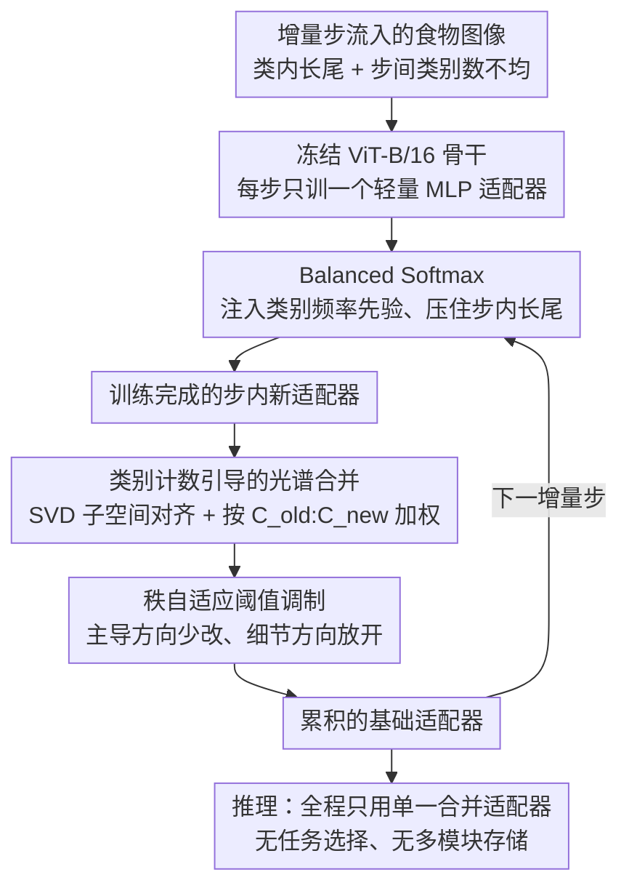

# Dual-Imbalance Continual Learning for Real-World Food Recognition

**会议**: CVPR 2026  
**arXiv**: [2603.29133](https://arxiv.org/abs/2603.29133)  
**代码**: [GitHub](https://github.com/xiaoyanzhang1/DIME)  
**领域**: Continual Learning / Food Recognition  
**关键词**: 持续学习, 双重不平衡, 适配器合并, 长尾分布, 食物识别

## 一句话总结

提出 DIME 框架，通过类别计数引导的光谱适配器合并和秩自适应阈值调制机制，在双重不平衡（类内长尾分布 + 步间类别数不均匀）的持续学习场景下，在四个长尾食物数据集上持续超越 baseline 3% 以上。

## 研究背景与动机

真实世界的食物识别系统需要持续学习新的菜品类别。这种场景存在**双重不平衡**：

**类别不平衡（Class Imbalance）**：食物数据天然呈长尾分布，少数常见食物（如米饭、汉堡）样本量大，大量小众菜品样本稀少

**步骤不平衡（Step Imbalance）**：不同增量学习步骤引入的类别数量差异显著——现有方法假设每步引入相似数量的类别，但实际中某些阶段可能引入大量新菜品，某些阶段只有少量

这两种不平衡的叠加效应尚未被充分研究。双重不平衡导致的核心挑战是**不对称学习动态**：头部类别和大步骤提供稳定梯度，而尾部类别和小步骤产生噪声大、方差高的更新，容易干扰已学习表征。

## 方法详解

### 整体框架

DIME 想在「类内长尾 + 步间类别数不均」的双重不平衡下做持续学习，又不愿付出存多个任务专属模块的代价。它冻结预训练 ViT 骨干，每个增量步只训练一个轻量级 MLP 适配器，训练时用 Balanced Softmax 压住步内的长尾分布；这一步训完后，新适配器不是被单独保存、而是被立刻「合并」回一个不断累积的基础适配器里。合并不走简单的参数平均，而是先把新旧适配器投到一个共享的 SVD 子空间对齐，再按两边的类别计数加权混合，并对不同奇异值方向施加不同的更新幅度。推理时全程只用这一个合并后的适配器，没有任务选择、也没有多模块存储开销。整套设计的核心就是把「怎么合并适配器」做对——既不让少量新类的噪声更新冲掉大量旧知识，也不让稳定的主导模式被无差别地改写。

### 关键设计

**1. Balanced Softmax：让尾部菜品在步内也能被公平地学到**

食物数据天然长尾，常见菜（米饭、汉堡）样本多、小众菜样本少，标准交叉熵会被头部类主导，尾部类几乎学不动。DIME 在 softmax 里直接注入类别频率先验，把 logit 调成 $\tilde{z}_y = z_y + \log \pi_y$，其中 $\pi_y$ 是类别 $y$ 的经验频率——频率高的类先验项大、被相对压低，频率低的类得到补偿。这样单步训练就不会被头部类带跑，尾部类拿到公平的梯度，为后续合并提供一个本身就不偏的适配器。

**2. 类别计数引导的光谱合并：用 SVD 对齐 + 类别配比，避免新旧适配器破坏性干涉**

把每步新适配器直接和基础适配器做参数平均，会在不同步骤的更新方向之间产生破坏性干涉——两套权重各有各的主方向，硬平均等于互相抵消。DIME 先把基础适配器 $M_B$ 和新适配器 $M_t$ 沿列拼接做一次 SVD，$X = [M_B\ M_t] = U\Sigma V^\top$，让两者落进同一组主方向 $V$ 里，更新就只在一致的坐标系下交互。对齐之后再按两边累积的类别数量加权混合右奇异向量：

$$w_b = \frac{C_{\text{old}}}{C_{\text{old}}+C_{\text{new}}}, \quad w_t = \frac{C_{\text{new}}}{C_{\text{old}}+C_{\text{new}}}, \quad V_{\text{blend}}^\top = w_b V_B^\top + w_t V_t^\top$$

这一步直接回应了步间不平衡：当某步只引入少量新菜（$C_{\text{new}}$ 小），它的权重 $w_t$ 自动变小，噪声大的更新不会覆盖掉积累已久的旧知识；反之大步骤拿到应得的话语权。

**3. 秩自适应阈值调制：主导方向保稳定，细节方向留灵活**

光谱对齐解决了「在哪个坐标系合并」，但所有方向一刀切地混合仍不够好——奇异值大的方向对应常见颜色、纹理这类主导视觉模式，应当保持稳定；奇异值小的方向对应细节变化，恰恰是吸收新菜品需要的灵活度。DIME 据此对更新量施加一个按秩分档的门控掩码 $G$：前 $r_h$ 个（奇异值最大的）方向用较小的 $\gamma_{\text{head}}$ 限制改动，其余方向用较大的 $\gamma_{\text{tail}}$ 放开吸收，最终 $V_{\text{final}}^\top = V_B^\top + G \odot \Delta V^\top$。因为大步骤往往产生强主导方向、小步骤贡献弱但有用的细节变化，这种分档让合并在两类方向上各取所需，而不是在两边都缩手缩脚。

### 损失函数 / 训练策略

- 骨干网络冻结（ViT-B/16 预训练于 ImageNet-21K），仅训练适配器参数和分类头
- 适配器使用 MLP 结构，隐藏维度 64
- SGD 优化器，学习率 0.07，权重衰减 0.0005，批大小 16，训练 20 个 epoch
- 步骤不平衡通过指数衰减序列 $s_t = \rho^{(t-1)/(T-1)}$ 控制，随机置换避免人为课程效应

## 实验关键数据

### 主实验

| 数据集 | 指标 ($A_T$) | DIME | TUNA (最强baseline) | 提升 |
|---|---|---|---|---|
| VFN186-LT | Last Acc | **69.07%** | 66.19% | +2.88% |
| VFN186-Insulin | Last Acc | **69.40%** | 66.28% | +3.12% |
| VFN186-T2D | Last Acc | **69.88%** | 67.32% | +2.56% |
| Food101-LT | Last Acc | **77.01%** | 75.00% | +2.01% |

在极端不平衡（$\rho=0.001$）下优势更明显：VFN186-LT 上 DIME 69.33% vs TUNA 66.60%（+2.73%），Food101-LT 上 78.13% vs 74.02%（+4.11%）。

### 消融实验

| 配置 | $A_T$ | $wA$ | 说明 |
|---|---|---|---|
| Base (直接合并+等权+CE) | 66.73% | 74.90% | 基线 |
| + SM (光谱合并) | 67.20% | 74.95% | SVD 对齐减少冲突 |
| + CCW (类别权重) | 67.95% | 76.68% | 步骤不平衡感知 |
| + RTM (阈值调制) | 68.68% | 77.67% | 选择性保护主导方向 |
| + BSM (Balanced Softmax) | **69.31%** | **78.07%** | 处理类内长尾 |

### 关键发现

- **双重不平衡的影响是真实且显著的**：不平衡越严重（$\rho$ 越小），DIME 优势越大
- **各组件贡献清晰且互补**：SM/CCW/RTM/BSM 每一步都带来稳定提升
- **推理效率优秀**：DIME 推理时间 (9.50s) 和 FLOPs (33.73G) 与最轻量的 ACMap 持平，但精度高出约 4%
- **大任务保护好，小任务不牺牲**：在任务大小分析中，DIME 在大/中/小任务上均表现最佳或接近最佳
- **超参数不敏感**：$r_h$、$\gamma_{\text{head}}$、$\gamma_{\text{tail}}$ 在合理范围内性能稳定

## 亮点与洞察

1. **问题定义精准**：提出"双重不平衡"概念，首次系统地研究类别不平衡和步骤不平衡的叠加效应
2. **设计哲学优雅**：在 SVD 对齐空间中进行合并，用秩自适应门控实现"重要方向保稳定、次要方向留灵活"
3. **实用性强**：推理时仅维护单个合并适配器，无存储和选择开销
4. **引入加权平均精度 $wA$**：更公平地评估步骤不平衡下的整体性能——传统 $\bar{A}$ 会被少类别的简单步骤拉高

## 局限与展望

- 仅在食物识别领域验证，是否推广到其他长尾持续学习场景（如医学影像、自动驾驶）尚未验证
- SVD 分解增加了合并阶段的计算开销（虽然仅在步骤切换时执行一次）
- 未探索与排练（rehearsal）策略的结合可能——与 exemplar memory 结合或许能进一步提升
- 适配器维度固定为 64，未研究不同容量的适配器对不同规模步骤的适应性
- 仅使用 ViT-B/16 骨干，未验证更大骨干（如 ViT-L）上的效果

## 相关工作与启发

- 基于 KnOTS 的光谱对齐思想，将其从 LoRA 推广到 MLP 适配器
- Balanced Softmax 来自长尾学习领域，用 log 先验补偿类别不平衡
- 与 EASE、MOS、TUNA 等最新持续学习方法对比，展示了双重不平衡设置下的系统性优势
- 秩自适应门控思想可以推广到其他需要选择性合并知识的场景

## 评分

- 新颖性: ⭐⭐⭐⭐ — 双重不平衡设定和秩自适应合并有创新，但各组件均有前身
- 实验充分度: ⭐⭐⭐⭐⭐ — 四个数据集、多个不平衡比、完整消融、效率对比、敏感性分析
- 写作质量: ⭐⭐⭐⭐ — 问题形式化严谨，符号一致
- 价值: ⭐⭐⭐⭐ — 解决了一个实际且被忽视的问题，方法具有推广潜力

<!-- RELATED:START -->

## 相关论文

- [\[NeurIPS 2025\] Contrastive Consolidation of Top-Down Modulations Achieves Sparsely Supervised Continual Learning](../../NeurIPS2025/signal_comm/contrastive_consolidation_of_top-down_modulations_achieves_sparsely_supervised_c.md)
- [\[ECCV 2024\] Optimizing Illuminant Estimation in Dual-Exposure HDR Imaging](../../ECCV2024/signal_comm/optimizing_illuminant_estimation_in_dual-exposure_hdr_imaging.md)
- [\[ICCV 2025\] Boosting Multimodal Learning via Disentangled Gradient Learning](../../ICCV2025/signal_comm/boosting_multimodal_learning_via_disentangled_gradient_learning.md)
- [\[ICML 2026\] Meta-learning Structure-Preserving Dynamics](../../ICML2026/signal_comm/meta-learning_structure-preserving_dynamics.md)
- [\[AAAI 2026\] Task Aware Modulation Using Representation Learning for Upscaling of Terrestrial Carbon Fluxes](../../AAAI2026/signal_comm/task_aware_modulation_using_representation_learning_for_upsaling_of_terrestrial_.md)

<!-- RELATED:END -->
