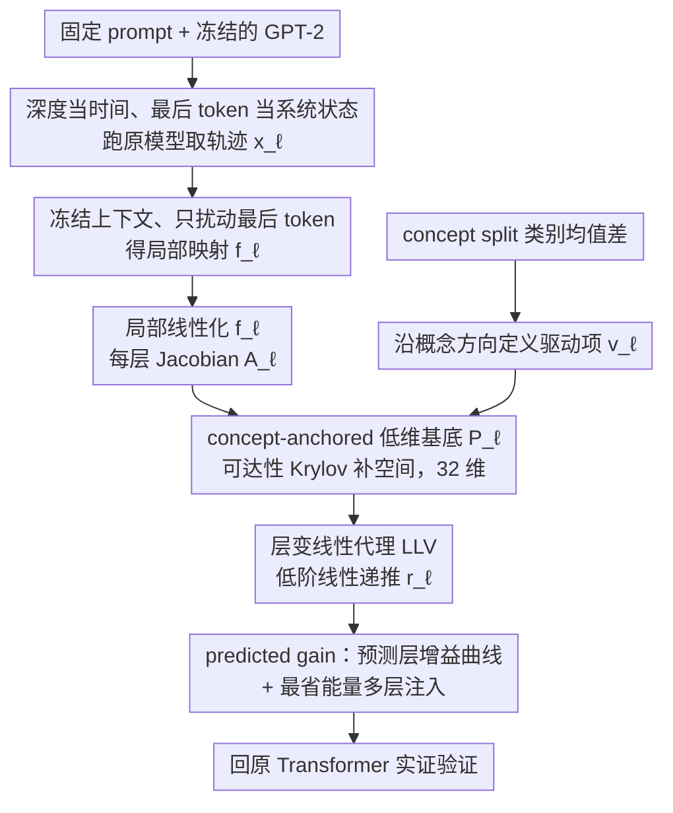

# As Language Models Scale, Low-order Linear Depth Dynamics Emerge

**会议**: CVPR 2026  
**arXiv**: [2603.12541](https://arxiv.org/abs/2603.12541)  
**代码**: 无  
**领域**: 社会计算  
**关键词**: 激活干预, 局部线性化, 深度动力学, 系统辨识, 模型缩放

## 一句话总结
这篇论文把 Transformer 的层深看成离散时间系统，证明在给定上下文附近可以用一个 32 维的低阶线性状态空间代理去近似 GPT-2 的层间传播与干预响应，而且模型越大，这个低阶代理越准确，还能据此算出比启发式注入更省能量的多层干预策略。

## 研究背景与动机
现有的大模型分析方法有一个明显断层：一类工作关注表示里是否存在可线性分离的“概念方向”，另一类工作关注 activation steering 是否有效，但很少有人去建模“一个概念方向在不同层被注入以后，到底如何沿深度传播并最终影响输出”。

更具体地说，大家已经知道在残差流里加一个方向向量可以改变情感、毒性、仇恨言论等属性，但通常做法仍然很经验主义：

1. 逐层扫一遍，看看哪层最好。
2. 拍脑袋选择最后一层、所有层平均注入或某个中间层。
3. 对为什么这些层有效、为什么多层分配会更省“干预能量”，缺少统一解释。

论文认为真正缺的是一个“局部、可预测、可控制”的深度动力学视角。作者把因果 Transformer 的层深当作离散时间，把最后一个非 padding token 的隐藏状态看作系统状态，然后问一个很系统控制的问题：

如果在第 $k$ 层往残差流里加一个小扰动，它经过后续所有 block 之后，会怎样影响最终的概念读出？

这个问题之所以重要，有三层原因：

**机制理解**：如果不能描述扰动如何沿深度传播，就只能停留在“某个方向有用”的静态表征层面。

**干预设计**：如果能预测每层的增益曲线，就不需要 brute-force layer sweep。

**缩放规律**：模型越来越大通常意味着更复杂，但作者怀疑更大模型在局部反而更“规整”，因此可能更适合被低维动力学代理压缩。

作者的核心观察很有意思：虽然 LLM 全局上是高维非线性系统，但在固定 prompt 附近、只看最后 token 的局部层间传播时，它未必需要一个同样高维的复杂模型来解释。换句话说，真正决定 steering 响应的那部分动力学，也许只活跃在一个很小的可达子空间里。

本文因此要回答三个连贯的问题：

1. 能不能为给定上下文辨识出一个低阶线性 layer-variant surrogate？
2. 这个 surrogate 能不能准确预测不同层的 steering sensitivity 曲线？
3. 这种可辨识性会不会随着模型规模上升而系统性增强？

作者的回答是肯定的，而且第三点是全文最有价值的结论：模型变大以后，局部低阶线性代理不仅没有失效，反而变得更准。

## 方法详解

### 整体框架
这篇工作的本质是把 activation steering 从一堆经验技巧改写成一个局部系统辨识与最优控制问题。它不去拟合 Transformer 的全部行为，只拟合一个很局部但很关键的对象：在某个固定 prompt 下，最后一个 token 的隐状态受到小扰动以后，这个扰动经过后续所有 block 传播，会怎样改变最终的概念读出。

整条流水线围绕这一目标展开：先对给定 prompt 跑一遍原模型，拿到最后 token 沿深度的隐状态轨迹 $x_\ell(p)$；再固定上下文里其它 token、只让最后 token 在进入下一层 block 前被小幅扰动，得到一个 prompt-conditioned 的映射 $x_{\ell+1}=f_\ell(x_\ell;p)$；在这条运行轨迹附近把 $f_\ell$ 局部线性化，得到每层 Jacobian $A_\ell(p)$；结合概念方向 $v_\ell$ 与可达子空间构造一个 32 维基底 $P_\ell$，把高维动力学投影成低阶线性层变代理（LLV）；最后用 LLV 预测单层注入的增益曲线，并求出达到目标输出变化时最省能量的多层注入策略。关键在于，这个代理不是事后解释，而是要能回到原始非线性 Transformer 上被实证验证——它必须既能预测整条 layerwise gain 曲线，又能导出比启发式更优的 multi-layer actuation schedule。

### 关键设计

**1. 把深度当时间、把最后 token 当系统状态：先把问题压成一个可辨识的对象**

要理解 steering 对最终输出的作用，最贴近决策端的状态就是最后一个 token 的表征，所以作者定义 $x_\ell(p)=h_\ell(p)[t(p),:]$（$t(p)$ 是最后一个非 padding token 的位置），而不去建模整段序列的全部隐状态。把 Transformer 的 block 序列看作离散时间推进之后，"一个概念方向在第 $k$ 层被注入、再沿深度传播"这件事就可以直接用状态空间的语言来写。这一步看似只是换了个记号，实际是把"解释整个 LLM"这个无从下手的问题，压缩成了"刻画当前语境下最后 token 的层间传播"这个有限可控的对象。

**2. 冻结上下文，只建模 last-token 的局部响应：把跨 token 交互吸收掉**

如果让整个序列的隐状态都自由变化，系统维度会大到根本无法辨识。作者的做法是：对一个固定 prompt，保持非最后 token 的隐藏状态不动，只扰动最后 token，再看下一层 block 怎样映射它，由此得到条件在上下文之下的映射 $x_{\ell+1}=f_\ell(x_\ell;p)$。这等于把复杂的跨 token 交互统统吸收进"冻结上下文"这个常量里，只保留与 steering 最相关的那部分局部动力学。问题于是从"全局解释 Transformer"变成"局部解释这一条运行轨迹"，线性化也因此有了正当性——近似的对象本来就只是邻域响应，而非全局计算。

**3. 沿概念方向定义外部驱动项：把输入端也数据驱动地钉死**

很多 activation steering 工作默认存在一个可用的方向，却不去建模它如何传播。这里作者把方向估计和动力学传播合到一个框架里：每层的概念方向 $v_\ell$ 由独立 concept split 上两类样本最后 token 表征的类别均值差归一化得到，主实验只考虑沿这个方向的加性注入 $u_\ell v_\ell$。这样一来，输入（注入方向）、状态（last-token 轨迹）、输出（概念读出）三者都被数据驱动地定义出来并在同一系统里闭环，steering 的"往哪加"不再是手工拍板，而是和后续的传播分析共用同一套基底。

**4. concept-anchored 的低维基底 $P_\ell$：把维度预算花在真正被激发的子空间上**

降维的风险在于：如果低维基底没覆盖到控制输入真正会激发的子空间，再精巧的代理也会丢掉关键传播模式。作者因此不做普通 PCA、也不用随机补空间，而是让每层基底的第一列强行固定为概念方向 $v_\ell$，其余列由 reachability-informed Krylov complement 构造——从平均 Jacobian 反复作用下真实会被 steering 激发的方向出发，递推地展开一组更"可达"的基（complement 大小为 31，对应总 reduced dimension 32）。这相当于先问"控制输入沿深度走会点亮哪些方向"，再把有限的维度预算优先分配给这些方向，从而在很低的阶数下仍保住对 steering 敏感的那部分动力学。

**5. 层变线性代理 LLV：用随层变化的线性矩阵贴合"每层功能不同"**

把扰动投影到上述基底后，深度传播被写成一个低阶线性递推

$$r_{\ell+1}\approx \bar{A}_\ell(p)\, r_\ell + \bar{B}_\ell(p)\, u_\ell,\qquad r_\ell = P_\ell^\top \delta x_\ell$$

注意这里的 $\bar{A}_\ell$、$\bar{B}_\ell$ 是**随层变化**的，而不是一个全局线性模型。这点很关键：Transformer 各层功能本就不同，用一套层变矩阵去近似，比强行套一个统一线性算子更贴合实际结构。作者也刻意把话说得克制——他们主张的不是"Transformer 本质上线性"，而是"在运行轨迹附近、局部、且逐层变化的线性近似足够准"，这正是后面缩放结论能站住的前提。

**6. 用 predicted gain 把分析变成控制：先预测哪层好，再算最省能量的注入**

有了 LLV，每层的灵敏度就不必再逐层实测。对单层第 $k$ 层注入，最终概念增益可直接从代理预测：

$$g_k^{pred}\approx C\,\Phi(k+1,L)\,\bar{B}_k$$

其中 $\Phi$ 是 reduced transition product（降维空间里从 $k+1$ 层到末层 $L$ 的传递乘积）。这一步把"解释模型"升级成"可操作模型"：它不再是事后告诉你哪层好，而是事先预测整条 gain 曲线，并据此求解一个最优控制问题——在达到目标概念偏移的前提下，把注入能量在多层之间最省地分配，得到的 schedule 显著优于"全层均匀注入""只注最后一层"这类启发式。

### 损失函数 / 训练策略
严格说这篇工作没有传统意义上的训练损失：它在 frozen pretrained GPT-2 家族上做局部辨识，不更新任何模型权重。所谓"学习"集中在三处——用 concept split 算每层两类样本最后 token 表征的均值差并归一化得到概念方向 $v_\ell$；估计局部 Jacobian 时优先用 JVP 计算雅可比作用，必要时退回 central finite difference；最后在降维基底上辨识出 $\bar{A}_\ell(p)$、$\bar{B}_\ell(p)$，主实验固定 reduced order $d=32$。

几个关键设置值得记下：GPT-2-large 主结果用 concept batch size 32、held-out batch size 64；operating split 只用于辨识局部动力学，evaluation split 只用于评估增益和控制效果，二者严格分离，从而保证"预测有效"不是同批 prompt 上的自证；主图的 gain evaluation magnitude 主要取 $\epsilon=0.1$，并在更宽范围内验证鲁棒性。

## 实验关键数据
论文在 10 个二分类 NLP 任务上评估，包括 Amazon Polarity、Yelp Polarity、SST-2、IMDB、BoolQ、二分类版 MNLI、Civil Comments Toxicity、TweetEval-Irony、TweetEval-Hate、TweetEval-Offensive。

主结果聚焦 GPT-2-large，同时在 GPT-2、GPT-2-medium、GPT-2-large 三个尺度上研究缩放规律。

### 主实验
作者最重要的量化结果不是传统分类精度，而是 predicted gain curve 与 full model empirical gain curve 的一致性，以及最优控制相对启发式策略的能量效率。

| 设置 | 指标 | 本文结果 | 对比/基线 | 结论 |
|------|------|----------|-----------|------|
| GPT-2-large, $d=32$ | 层间增益预测 Spearman | 各展示数据集达到 0.99 或 1.00 | 经验逐层扫描 | 低阶 LLV 几乎完整复现整条 gain 曲线 |
| GPT-2-large, $d=32$ | 层间增益曲线形状 | 与 empirical 曲线近乎重合 | 只找 best layer 的粗糙分析 | surrogate 预测的不只是最优层，而是完整响应形状 |
| GPT-2 family 缩放 | 平均 Spearman | GPT-2: 约 0.77, GPT-2-medium: 约 0.81, GPT-2-large: 0.995 | 固定同样 reduced order=32 | 模型越大，低阶线性代理越可辨识 |
| GPT-2 family 缩放 | 平均 Pearson | GPT-2: 约 0.68, GPT-2-medium: 约 0.74, GPT-2-large: 0.997 | 同上 | 可辨识性提升不只是排序一致，更是数值幅度一致 |
| GPT-2-large 控制 | 达到同样目标概念偏移所需能量 | LLV-optimal 最低或并列最低 | uniform-all, last-layer-only, middle-only, early-only, random-layer | 线性代理导出的控制分配显著优于启发式策略 |

### 消融实验
论文虽然不是典型模块堆叠式方法，但仍有几组关键分析可以视作“消融”：

| 配置 | 关键指标变化 | 说明 |
|------|-------------|------|
| Full LLV, $d=32$, Krylov complement | 最佳 | 主设定，预测曲线与实测高度一致 |
| 减小 reduced dimension | 一致性下降后逐步饱和 | 说明 steering 相关动力学确实是低维的，但维度太小会欠拟合 |
| 随机 complement 替代 Krylov complement | 预测更差 | 说明“可达性引导”的补空间比随机构造更贴合真实传播子空间 |
| 改变 $\epsilon$ | 在较宽区间仍稳定 | 说明 empirical finite difference 不依赖某个精细调参点 |
| heuristic multi-layer / single-layer injection | 能量明显更高 | 证明 surrogate 不只是解释器，也能指导控制设计 |

### 关键发现
1. **最佳干预层并不固定**：不同任务的 gain 曲线形状明显不同，有的后层单调升高，有的是中后层平台区，因此“总在最后一层注入”并不可靠。
2. **真正被拟合的是整条响应曲线**：论文反复强调 surrogate 的价值不是识别一个 top-1 layer，而是准确刻画从早层到晚层的完整敏感性结构。
3. **缩放规律非常反直觉**：通常大家觉得模型更大更难解释，但这里恰恰是更大模型更容易被低阶局部线性系统解释。
4. **控制收益可观**：相比 uniform-all，LLV-optimal 往往还能再省大约 2 到 5 倍能量；相比 last-layer-only，经常能好一个数量级，甚至多个数量级。

## 亮点与洞察
1. 这篇论文把 activation steering 从“经验技巧”提升成了“局部系统控制问题”。这一步的价值在于，它把方向、传播、干预分配放进了统一数学框架里。
2. “大模型更容易被低阶局部代理解释”这个结论很有冲击力。它暗示 scale 带来的不只是能力上升，也可能带来局部动力学的规整化和可压缩性增强。
3. concept-anchored Krylov basis 是很巧的设计。第一列强行对齐概念方向，剩余维度再围绕可达性展开，兼顾了语义相关性与动力学保真度。
4. 论文非常重视 operating split 与 evaluation split 分离。这避免了用同一批 prompt 同时辨识和验证，从而使“预测有效”这个结论更可信。
5. 这项工作提供了一个很好的中层抽象：它既不像纯 probing 那样静态，也不像端到端控制那样黑盒，而是抓住了“局部传播结构”这个可计算的中间层。

## 局限与展望
1. **局部性很强**：作者自己也承认，这不是一个全局替代 Transformer 的线性模型，只在 prompt-conditioned operating trajectory 附近有效。离开这个局部邻域，近似能否保持还不清楚。
2. **只看最后 token**：这种状态定义对 next-token readout 很自然，但对于需要全序列交互、跨 token aggregation 的机制分析可能不够。
3. **只验证 GPT-2 家族**：缩放规律目前只在 GPT-2、GPT-2-medium、GPT-2-large 上成立，尚未验证到现代 decoder-only LLM、MoE 或多模态模型。
4. **任务仍以二分类概念为主**：概念方向来源于二分类均值差，这对 sentiment/toxicity/hate 等任务合适，但对开放生成、多标签语义或复杂推理未必直接适用。
5. **控制目标较单一**：当前控制目标是最终 concept score 的目标偏移，尚未覆盖更复杂的 sequence-level behavior constraints。
6. **线性读出假设仍然隐含较强**：如果某些语义概念本身就不是稳定的线性方向，那么整个 surrogate 的输入与输出定义都会受影响。

我自己的可改进想法有两条：

1. 可以把这个框架迁移到更现代的开源模型上，检验“scale 提高局部可辨识性”是否是 GPT-2 专属现象，还是更普遍的训练后动力学规律。
2. 可以把单一概念方向扩展成多输入控制，把 $V_\ell$ 从一个向量变成一个小型控制子空间，用来分析多属性联合 steering 的耦合关系。

## 相关工作与启发
**vs Activation Addition / 对比激活注入**：前者告诉我们“往哪个方向加”可能有效，但并不描述这个方向如何跨层传播；本文补上的是传播动力学和干预分配问题。

**vs 线性表示假说**：线性表示假说关心高层概念是否能被线性方向承载，偏静态；本文则进一步问，沿这些方向施加扰动后，动力学上会怎样演化。

**vs 局部 Jacobian 分析工作**：已有工作观察到训练后 Transformer 存在某种局部线性或几何规整性，但本文真正把这种规整性做成可验证、可控制的低阶 surrogate，并给出缩放证据。

它对我的启发主要有三点：

1. 做 LLM 可解释性时，不能只停留在“概念能否线性探测”，更应该研究概念扰动的传播结构。
2. 缩放研究不一定要围绕 loss 或 benchmark accuracy，也可以围绕“可辨识性”“可压缩性”这种系统属性来做。
3. 若未来要做 steering 或安全控制，先学出一个可用的低阶局部代理，再把控制策略转回原模型验证，是比 heuristic schedule 更稳妥的路线。

## 评分
- 新颖性: ⭐⭐⭐⭐⭐ 论文把 activation steering、局部线性化、降阶系统辨识和缩放规律串成一个统一故事，观点新且完整。
- 实验充分度: ⭐⭐⭐⭐ 10 个任务、三个 GPT-2 尺度、增益预测与控制两个维度都做了，但模型家族仍偏窄。
- 写作质量: ⭐⭐⭐⭐⭐ 叙事非常清晰，问题定义、方法结构、核心结论三者衔接紧密。
- 价值: ⭐⭐⭐⭐⭐ 这篇工作不仅解释为什么某些层更适合干预，还给出可操作的控制策略，对后续可解释 steering 研究很有启发。

<!-- RELATED:START -->

## 相关论文

- [\[CVPR 2026\] Probabilistic Concept Graph Reasoning for Multimodal Misinformation Detection](probabilistic_concept_graph_reasoning_for_multimodal_misinformation_detection.md)
- [\[CVPR 2026\] Bridging Pixels and Words: Mask-Aware Local Semantic Fusion for Multimodal Media Verification](bridging_pixels_and_words_mask-aware_local_semantic_fusion_for_multimodal_media_.md)
- [\[CVPR 2026\] Learning from Synthetic Data via Provenance-Based Input Gradient Guidance](learning_from_synthetic_data_via_provenance-based_input_gradient_guidance.md)
- [\[ACL 2026\] Splits! Flexible Sociocultural Linguistic Investigation at Scale](../../ACL2026/social_computing/splits_flexible_sociocultural_linguistic_investigation_at_scale.md)
- [\[CVPR 2026\] Revisiting Unknowns: Towards Effective and Efficient Open-Set Active Learning](revisiting_unknowns_towards_effective_and_efficient_open-set_active_learning.md)

<!-- RELATED:END -->
