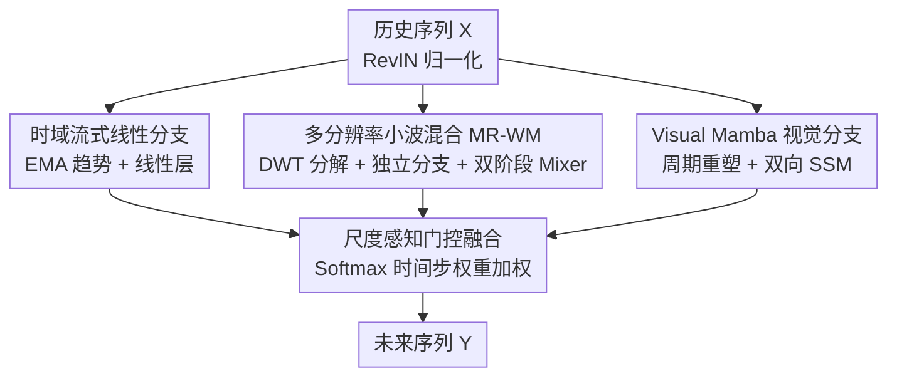

# TriTS: Time Series Forecasting from a Multimodal Perspective

**会议**: CVPR 2026 (A2A-MML Workshop)  
**arXiv**: [2604.16748](https://arxiv.org/abs/2604.16748)  
**代码**: 无  
**领域**: 时间序列 / 多模态  
**关键词**: 长期时序预测, 跨模态解耦, Visual Mamba, 小波分解, 门控融合

## 一句话总结
TriTS 把一维时间序列同时投影到时域、频域、2D-视觉三个正交空间，用流式线性分支锚定数值、多分辨率小波分支解耦趋势与噪声、Visual Mamba 分支以线性复杂度捕捉跨周期全局纹理，再用尺度感知门控动态融合三者，在 7 个长期预测基准上达到 SOTA 且参数量和推理延迟远低于现有视觉类预测器。

## 研究背景与动机
**领域现状**：长期时序预测（LTSF）的范式正从纯一维时域分析（RNN、Transformer、线性模型）走向"跨模态表征"。频域方法（FEDformer 等）抽取周期模式；视觉派（VisionTS、VisionTS++）把一维信号折叠成 2D"时序图像"，借预训练视觉基础模型（MAE）的结构感知力，在零样本/少样本上表现亮眼。

**现有痛点**：现有跨模态桥接方式有两个硬伤。其一，视觉分支几乎都用标准 ViT，自注意力对序列长度是 $O(N^2)$ 复杂度，处理超长历史窗口时显存和推理延迟爆炸。其二，频域方法依赖 FFT，用的是全局基函数，难以精确定位非平稳信号里的瞬时突变和局部异常，还会被周期谐波（fundamental + 高阶谐波）干扰、产生频率泄漏。

**核心矛盾**：真实时序里全局趋势、复杂季节性、非平稳局部突变高度纠缠，**任何单一模态都无法同时兼顾这几类特征**——视觉模型擅长全局结构却缺数值保真度，频域擅长周期却抓不住全局语义，线性模型稳但抓不住非线性动态。

**本文目标**：在不付出 ViT 二次复杂度代价的前提下，把一维信号桥接到 2D 视觉空间；同时用更精细的时频定位替代 FFT；并让三种模态按数据特性动态配比。

**切入角度**：作者认为"表征瓶颈"本质来自单视角，应当把信号显式拆解到三个互补的正交空间，各管一摊（数值锚定 / 时频解耦 / 全局纹理），再融合。

**核心 idea**：用 time + frequency + 2D-vision 三分支解耦表征，视觉分支用线性复杂度的 Visual Mamba 取代 ViT、频域分支用多分辨率小波混合取代 FFT，最后尺度感知门控自适应融合。

## 方法详解

### 整体框架
输入是经 RevIN 归一化的多元历史序列 $\tilde{\mathbf{X}}\in\mathbb{R}^{L\times C}$（$L$ 回看窗口、$C$ 通道数），输出未来序列 $\hat{\mathbf{Y}}\in\mathbb{R}^{T\times C}$。归一化后的同一份输入并行喂进三条互补分支：时域流式线性分支产出 $\mathbf{H}_{\text{time}}$ 作"线性锚"保证数值稳定；频域多分辨率小波分支产出 $\mathbf{H}_{\text{freq}}$ 显式解耦趋势/噪声；视觉 Visual Mamba 分支先把序列按主周期折成 2D"时序图像"再产出 $\mathbf{H}_{\text{vis}}$ 捕捉跨周期全局纹理。三路表征最后送进尺度感知门控融合，按时间步生成置信权重加权求和得到最终预测。整条管线是"一进三出再聚合"的并行结构。

### 关键设计

**1. 时域流式线性分支：用 EMA 趋势替代 SMA，给整个框架提供无偏低频锚**

纯线性层简单有效，但对输入里的高频噪声过于敏感；而常见的简单移动平均（SMA）做趋势提取又会过度平滑，且需要序列边界 padding、引入边界偏差。受 xPatch 启发，TriTS 改用指数移动平均（EMA）作趋势算子：$\mathbf{X}_{\text{trend},t}=\alpha\tilde{\mathbf{X}}_t+(1-\alpha)\mathbf{X}_{\text{trend},t-1}$，权重随时间指数衰减，对近期变化更敏感，且天然保持序列长度、无需 padding。提取的趋势项再过一个流式线性层 $\mathbf{H}_{\text{time}}=\mathbf{X}_{\text{trend}}\mathbf{W}_{\text{time}}+\mathbf{b}_{\text{time}}$（不加激活函数以免破坏线性关系）。这条分支不追求建模复杂动态，而是充当数值上的"压舱石"——消融显示去掉它会让训练直接发散（见下文）。

**2. 多分辨率小波混合 MR-WM：用独立分辨率分支解耦趋势与噪声，根治 FFT 的谐波干扰**

针对 FFT 全局基函数难定位非平稳突变的问题，频域分支改用基于 Mallat 算法的多级离散小波变换（DWT，固定 $m=3$ 级）。每级把上一级的近似系数拆成新的近似系数 $\mathbf{X}_{A_i}$ 与细节系数 $\mathbf{X}_{D_i}$，只保留顶层近似系数 $\mathbf{X}_{A_m}$（长期宏观趋势）和各级细节系数集 $\{\mathbf{X}_{D_1},\dots,\mathbf{X}_{D_m}\}$（各尺度局部变化），得到 $\mathcal{W}(\tilde{\mathbf{X}})=\{\mathbf{X}_{A_m},\mathbf{X}_{D_m},\dots,\mathbf{X}_{D_1}\}$ 共 $m+1$ 个分量。关键在于为这 $m+1$ 个分量构建**完全独立的分辨率分支**，各自有独立的 RevIN、Patching、Mixer 参数空间——这种"分辨率隔离"严防高频噪声在特征提取时污染低频趋势；同时因为基频和高阶谐波被分到了不同小波子带，独立分支天然解耦了它们，绕开了全局 FFT 的谐波干扰与频率泄漏。各分支独立预测后经逆小波变换（IDWT）结构化重建为 $\mathbf{H}_{\text{freq}}$。

每个分辨率分支内部用**双阶段 Mixer**（Patch + Embedding）捕捉依赖：先把小波系数切成 Patch，Patch Mixer 沿 Patch 维聚合局部时序上下文（$\mathbf{Z}_k^{\text{patch}}=\text{MLP}_{\text{patch}}(\text{Permute}(\mathbf{Z}_k^{\text{in}}))$），再由 Embedding Mixer 沿通道维用共享 MLP 抽全局语义并残差连接（$\mathbf{H}_{f,k}=\text{MLP}_{\text{emb}}(\text{Permute}(\mathbf{Z}_k^{\text{patch}}))+\mathbf{Z}_k^{\text{patch}}$），整体保持 $O(L)$ 复杂度。

**3. Visual Mamba 视觉分支：周期重塑 + 双向 SSM，以线性复杂度替代 ViT 抓全局纹理**

这是绕开 VisionTS 中 ViT $O(L^2)$ 瓶颈的核心。首先用自相关函数确定主周期 $P$，把归一化序列按 $P$ 折叠成"时序图像" $\mathbf{I}\in\mathbb{R}^{S\times P\times C}$（$S=L/P$）——周期内高频变化映射成行纹理，周期间演化映射成列结构；再切成非重叠 Patch $\mathbf{x}_p\in\mathbb{R}^{N\times(P^2\cdot C)}$ 投影到隐空间。然后用 Visual Mamba（Vim）的双向选择性状态空间模型替代自注意力：连续 SSM 为 $h'(t)=\mathbf{A}h(t)+\mathbf{B}x(t),\ y(t)=\mathbf{C}h(t)$，经零阶保持（ZOH）离散化为 $\overline{\mathbf{A}}=\exp(\mathbf{\Delta}\mathbf{A})$ 等；Mamba 的选择性机制让 $\mathbf{B},\mathbf{C},\mathbf{\Delta}$ 都由输入动态生成，从而按上下文自适应"记住/遗忘"历史。由于视觉感知没有严格因果性（像素依赖是双向的），单向扫描会信息不对称，因此 Vim 编码器做双向扫描——前向 $\mathbf{Y}_{\text{fwd}}=\text{SSM}_{\text{scan}}(\mathbf{H}_{l-1},\dots)$、后向对翻转序列 $\mathbf{Y}_{\text{bwd}}=\text{SSM}_{\text{scan}}(\text{Flip}(\mathbf{H}_{l-1}),\dots)$，门控融合后映回时域得 $\mathbf{H}_{\text{vis}}$。整条分支把长序列建模复杂度严格限制在 $O(N)$，既要视觉模型的全局感受野又要长序列的效率。

**4. 尺度感知门控融合：按时间步动态配比三模态，而非简单平均**

三模态各有所长（时域无损数值锚、频域解析周期与噪声、视觉抓全局结构纹理），但它们的重要性在不同数据上会动态漂移，简单平均不够。作者设计轻量门控网络生成**时间步级**的置信权重 $[\mathbf{G}_{\text{time}},\mathbf{G}_{\text{freq}},\mathbf{G}_{\text{vis}}]=\text{Softmax}(\text{MLP}([\mathbf{H}_{\text{time}};\mathbf{H}_{\text{freq}};\mathbf{H}_{\text{vis}}]))$，最终表征为加权和 $\mathbf{H}_{\text{fuse}}=\mathbf{G}_{\text{time}}\odot\mathbf{H}_{\text{time}}+\mathbf{G}_{\text{freq}}\odot\mathbf{H}_{\text{freq}}+\mathbf{G}_{\text{vis}}\odot\mathbf{H}_{\text{vis}}$。可视化（图 2）显示 ETTh1 上视觉权重明显偏高（强长期全局依赖），而 Weather 上频域权重抬升（强局部周期性），证明门控确实在按数据特性自适应配比。

### 损失函数 / 训练策略
RevIN 归一化输入、Zero-Mean 标准化数据；视觉分支用 ImageNet-1k 预训练的 Vim-Tiny 骨干；小波分解固定 $m=3$ 级，Patch size 从 $\{8,12,16\}$ 按数据集经验调；Adam 优化器、batch size 128、Early Stopping（patience=5）；预测长度 $T\in\{96,192,336,720\}$；评测指标为 MSE/MAE。

## 实验关键数据

7 个真实基准（ETTh1/h2/m1/m2、Weather、ECL、Traffic），对比 8 个 SOTA：VisionTS、VisionTS++（视觉派）、WPMixer、FDNet（小波派）、iTransformer、PatchTST（Transformer 派）、TimeMixer、DLinear（线性派）。

### 主实验（lookback=96，MSE/MAE，越低越好，AVG 为 4 个预测长度平均）

| 数据集 | 指标 | TriTS | VisionTS++ | VisionTS | WPMixer | iTransformer | DLinear |
|--------|------|-------|-----------|---------|---------|-------------|---------|
| ETTh1 | AVG MSE | **0.411** | 0.423 | 0.432 | 0.433 | 0.457 | 0.461 |
| ETTh2 | AVG MSE | **0.366** | 0.379 | 0.397 | 0.378 | 0.383 | 0.563 |
| ETTm1 | AVG MSE | **0.379** | 0.392 | 0.401 | 0.380 | 0.407 | 0.404 |
| ETTm2 | AVG MSE | **0.270** | 0.294 | 0.297 | 0.279 | 0.291 | 0.354 |
| Weather | AVG MSE | **0.221** | 0.224 | 0.229 | 0.245 | 0.261 | 0.265 |
| ECL | AVG MSE | **0.158** | 0.164 | 0.161 | 0.181 | 0.180 | 0.225 |
| Traffic | AVG MSE | **0.399** | 0.413 | 0.413 | 0.486 | 0.423 | 0.625 |

TriTS 在多数数据集和预测长度上取得最优。相比纯视觉的 VisionTS/VisionTS++，时域流式分支+频域小波分支补足了视觉模型的数值保真度短板，在波动剧烈的 ETT 系列上尤其明显；相比纯小波的 WPMixer/FDNet，Visual Mamba 分支补上了它们缺失的全局视觉感知，在 $L=720$ 超长预测上优势突出（如 ETTh1-720：TriTS 0.449 vs WPMixer 0.464）。

### 消融实验（lookback=96 AVG MSE）

| 配置 | ETTh1 | ETTm1 | Weather | ECL | 说明 |
|------|-------|-------|---------|-----|------|
| TriTS (Full) | **0.411** | **0.379** | **0.221** | **0.158** | 完整模型 |
| w/o Time Branch | 1.213 | 0.558 | 0.281 | 0.829 | 训练严重不稳/发散 |
| w/o Freq Branch | 0.447 | 0.402 | 0.301 | 0.196 | 频域贡献，Weather 掉最多 |
| w/o Vision Branch | 0.474 | 0.423 | 0.251 | 0.164 | ETT 上掉点明显 |
| w/o Gating Fusion | 0.442 | 0.388 | 0.224 | 0.166 | 改简单平均后退化 |

### 关键发现
- **时域分支是地基**：去掉它 ETTh1 的 MSE 从 0.411 飙到 1.213、ECL 从 0.158 到 0.829，模型出现严重不稳/梯度过拟合——它提供的数值稳定性是整个框架的前提，而非锦上添花。
- **模态贡献随数据而异**：ETTh1 上视觉分支更关键（强长期依赖，去掉它涨到 0.474），Weather 上频域分支更关键（强局部周期，去掉它涨到 0.301），印证了门控按数据自适应配比的必要性。
- **门控融合优于简单平均**：去掉门控（等价简单平均）在所有数据集均退化，说明时间步级动态加权确实有用。
- **效率优势**：用 Vim-Tiny 替代 VisionTS 的 MAE-Base、用线性复杂度 Vim 替代二次复杂度 ViT，TriTS 在处理长序列（look-back=pred=720）时训练时间和显存显著低于 VisionTS，同时精度更高。

## 亮点与洞察
- **"三正交空间解耦"的视角很干净**：把纠缠信号显式拆成数值锚（时域）/ 时频解耦（频域）/ 全局纹理（视觉）三个互补正交视角，各管一摊再门控聚合，比硬塞进单一大模型更可解释，门控权重还能反推数据特性。
- **小波独立分支天然解谐波**：把基频和高阶谐波分到不同小波子带、再用独立参数分支处理，是用结构先验直接消除 FFT 频率泄漏的巧招——比在频谱上加可学习滤波器更物理。
- **Vim 把"视觉折叠 + 线性复杂度"两件好事合到一起**：周期重塑保留了 TimesNet/VisionTS 那套"行=周期内、列=周期间"的 2D 结构感知，又用双向 SSM 把代价从 $O(N^2)$ 砍到 $O(N)$，是视觉派时序预测降本的实用路线。
- **可迁移思路**：时间步级门控融合可直接搬到任何多分支/多模态时序模型；"用小波子带隔离做去谐波"可迁移到任何带强周期性的频域建模任务。

## 局限性 / 可改进方向
- **主周期依赖自相关确定、固定单周期**：作者也承认未来要探索自适应周期检测——当序列含多个共存周期或周期漂移时，单一固定 $P$ 的折叠会失真。
- **三分支并行带来结构复杂度**：虽然单分支都高效，但三条分支 + 门控的工程实现与调参（每数据集还要单独调 patch size）成本不低，论文未给完整参数量/FLOPs 数值表，效率结论主要靠图 3 定性展示。
- **仅在规整多元基准上验证**：未覆盖不规则采样、缺失值、协变量等更复杂场景（作者列为未来工作）。
- **Workshop 短文**：实验规模与分析深度相对正会论文偏轻，部分对比（如 Table 3 调参后结果）TriTS 并非在所有数据集都最优（如 ECL/ETTm2 上 VisionTS++/TimeMixer 略胜）。

## 相关工作与启发
- **vs VisionTS / VisionTS++**：都把时序折成 2D 图像借视觉骨干，但它们用 ViT/MAE（$O(N^2)$、大模型），TriTS 用 Vim-Tiny（$O(N)$、小模型）且额外挂时域、频域分支补数值保真度，因此在波动大的 ETT 上更准、长序列更省。
- **vs WPMixer / FDNet**：同样用多分辨率小波解耦趋势/噪声，但它们纯频域、缺全局视觉感知，TriTS 的 Vim 分支补上这一块，长序列预测更强。
- **vs PatchTST / iTransformer**：Transformer 派靠 patch / 倒置通道注意力建模长程依赖但受二次复杂度所限；TriTS 用 SSM + 小波 + 线性的组合在效率和精度上整体占优。
- **vs DLinear / TimeMixer**：纯线性模型高效但抓不住复杂非线性与全局语义；TriTS 保留流式线性分支当锚的同时，用另外两条分支补足复杂特征。

## 评分
- 新颖性: ⭐⭐⭐⭐ 首次把 Visual Mamba 引入时序预测、三正交模态解耦 + 门控融合的组合较新，但各组件（Vim、小波混合、EMA 趋势）多来自已有工作的拼装。
- 实验充分度: ⭐⭐⭐ 7 数据集 + 8 baseline + 消融 + 权重可视化较完整，但效率分析只有定性图、无参数量/FLOPs 表，且为 Workshop 短文规模。
- 写作质量: ⭐⭐⭐⭐ 动机清晰、公式规范、三分支叙述条理分明。
- 价值: ⭐⭐⭐⭐ "视觉折叠用线性复杂度 Vim + 小波去谐波 + 门控融合"是一套实用且可复用的长期时序预测降本提精方案。

<!-- RELATED:START -->

## 相关论文

- [\[ICML 2026\] AnomSeer: Reinforcing Multimodal LLMs to Reason for Time-Series Anomaly Detection](../../ICML2026/time_series/anomseer_reinforcing_multimodal_llms_to_reason_for_time-series_anomaly_detection.md)
- [\[ACL 2025\] Context-Aware Sentiment Forecasting via LLM-based Multi-Perspective Role-Playing Agents](../../ACL2025/time_series/context_aware_sentiment_forecasting_agents.md)
- [\[NeurIPS 2025\] MAESTRO: Adaptive Sparse Attention and Robust Learning for Multimodal Dynamic Time Series](../../NeurIPS2025/time_series/maestro_adaptive_sparse_attention_and_robust_learning_for_multimodal_dynamic_tim.md)
- [\[AAAI 2026\] GAICo: A Deployed and Extensible Framework for Evaluating Diverse and Multimodal Generative AI Outputs](../../AAAI2026/time_series/gaico_a_deployed_and_extensible_framework_for_evaluating_diverse_and_multimodal_.md)
- [\[ICML 2026\] Ellipsoidal Time Series Forecasting](../../ICML2026/time_series/ellipsoidal_time_series_forecasting.md)

<!-- RELATED:END -->
