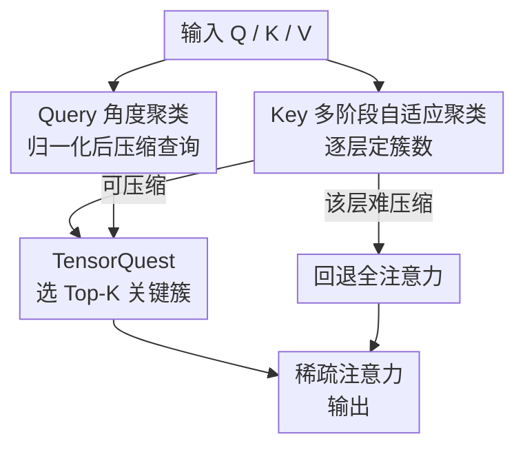

# AdaCluster: Adaptive Query-Key Clustering for Sparse Attention in Video Generation

**会议**: CVPR 2026  
**arXiv**: [2604.18348](https://arxiv.org/abs/2604.18348)  
**代码**: https://github.com/USTC-MLSys-Team/Adacluster (有)  
**领域**: 视频生成 / 扩散模型 / 推理加速 / 稀疏注意力  
**关键词**: 视频 DiT、稀疏注意力、Token 聚类、训练无关加速、Top-K 注意力

## 一句话总结
AdaCluster 是一个训练无关的稀疏注意力框架，针对视频 DiT 中 query 和 key 在注意力里扮演的不同角色，分别用「角度聚类」压缩 query、用「逐层自适应多阶段 K-means」聚类 key，再配合可跑在 Tensor Core 上的 TensorQuest 快速选关键簇，在 CogVideoX-2B / HunyuanVideo / Wan-2.1 上实现 1.67×–4.31× 端到端加速且画质几乎无损（PSNR 最高 30.99）。

## 研究背景与动机

**领域现状**：视频扩散 Transformer（DiT）已经是高保真视频生成的主流范式，但推理极慢——注意力复杂度随序列长度平方增长，而视频的序列长度等于「帧数 × 高 × 宽」，动辄 70K～180K token。作者实测 CogVideoX-2B 在单张 A40 上生成 81 帧 720p 视频要 1691 秒，其中注意力就占了 75% 的时间。要让 DiT 落地，必须把注意力这块的计算砍下来。

**现有痛点**：现有稀疏注意力大体分两条路。一类是「分块」方法（如 SpargeAttn），把连续 token 切成定长块、用块均值当代表——但连续的 token 在嵌入空间里未必语义相近，某些 token 离块代表很远，估计就不准。另一类是「聚类」方法（如 SVG2），用聚类保证同组内 token 更相似，理论上更准；但 SVG2 对 query 和 key 一视同仁，都用同一套基于欧氏距离的聚类，并且把簇数写死（所有模型/层统一 100 个 query 簇 + 500 个 key 簇）。

**核心矛盾**：作者观察到两个被忽略的事实。其一，query 和 key 在注意力里角色不同、分布也很不一样——query 只需保住「相对打分」的排序，而 key 的方向和长度都直接影响 Top-K 结果，二者本不该用同一种聚类。其二，不同层的 token 分布松紧差异巨大（图 2/图 4 的 compactness score 在层间相差很多），有的层高度分散需要更多簇甚至不适合聚类，有的层很集中、少量簇就够；用统一簇数必然「该细的没细、该粗的浪费」，最终漏掉关键 token、掉画质。

**本文目标**：在不训练、不改权重的前提下，(1) 给 query/key 设计各自合适的聚类策略以提高压缩率，(2) 让 key 的簇数随层自适应，(3) 聚类后还能高效且不漏地把关键 token 选出来。

**核心 idea**：对「先聚类、再选簇」这条管线做**角色感知重设计**——query 走角度聚类拿高压缩率，key 走逐层自适应的多阶段聚类保欧氏紧致度，关键簇选择用等价但能上 Tensor Core 的 TensorQuest 加速。

## 方法详解

### 整体框架

AdaCluster 接收一层注意力的 $Q, K, V$，对 query 和 key 走两条不同的聚类路径，最后只在被选中的少量「关键簇」上做注意力，从而把 $O(L^2)$ 的全注意力压成稀疏计算。具体地：query 先归一化再做标准 KMeans（角度聚类）；key 走多阶段 K-means，顺带判定「这一层是否值得压缩」；对值得压缩的层，用 TensorQuest 估计每个 key 簇对当前 query 的重要性、取 Top-K 簇内的 token 算注意力；对那些怎么聚都不紧致的「难压缩层」，直接回退成 FlashAttention 全注意力以保精度。整个过程训练无关，只在推理时按层动态决策。

### 关键设计

**1. Query 角度聚类：归一化到单位球再聚类，换更高压缩率**

痛点是 query 向量分布在高维空间、模长差异极大，直接在原始空间聚类很难，只能拿到有限的压缩率。作者用了一个关键性质：对任意 query $q$，query-key 打分 $s$ 的**相对大小与 $q$ 的模长无关**——也就是说，决定「哪个 key 重要」的只是方向，不是长度。基于此，AdaCluster 先把 query 归一化到单位球，再用归一化后的 query 去衡量 key 的重要性。归一化后 query 分布变得紧凑得多（图 3），于是能用很高的压缩率聚类。本质上这是把「欧氏距离聚类」换成了「角度（cosine）聚类」：只要角度接近就归为一簇，比 SVG2 对 query 也用欧氏聚类高效得多，实验里固定到 65 个 query 簇即可。

**2. Key 多阶段自适应聚类：逐层动态定簇数，按紧致度收敛**

key 这边不能照搬 query 的偷懒——key 的方向和长度都影响 Top-K 结果，必须保住**欧氏相似性**。理由可由上界给出：设 $c(k)$ 是 $k$ 聚类后的簇心，则对任意 $q$ 有

$$q^{\top}c(k) - q^{\top}k \le \|q\| \cdot \|k - c(k)\|$$

只要同簇内 token 足够紧致（$\|k-c(k)\|$ 很小），就能用簇心打分 $q^{\top}c(k)$ 近似真实打分 $q^{\top}k$，从而「只比较簇、不比较每个 key」。所以簇内紧致度直接决定关键 key 能否被选中。但不同层分布松紧差别很大，统一簇数行不通。作者用层级的紧致度量化：对每个 head 算重建误差 $\mathrm{MSE}^{i}_{l}=\frac{1}{N}\sum \|k^{i}_{l}-c(k^{i}_{l})\|_2^2$，并定义紧致度 $\mathrm{Comp}_l = 1/\mathrm{MSE}_l$，分散的层就该多给簇。落地用**多阶段 K-means**（算法 1）：先用中等簇数聚一遍，把离簇心超过阈值 $\tau$ 的离群 token 挑出来、用少量新簇再聚，反复直到所有 token 都进了紧致簇；若簇数超过上限 $N_{\max}$，就判定该层「难压缩」、整层退回全注意力。一个加速细节是**跨步初始化**：DiT 多步去噪里相邻步的 token 分布几乎不变（图 6），所以只在第一步跑完整多阶段聚类来定各层簇数，后续步固定簇数、并用上一步的簇心当初始化，省掉大量重复聚类

**3. TensorQuest：把关键簇选择从 CUDA Core 搬到 Tensor Core**

聚完类还得快速判断「哪些簇对当前 query 重要」。作者借鉴 LLM 解码里的 Quest——它用注意力权重上界来估计 key 的重要性：

$$\text{Quest}(q,K)=\sum_{d=1}^{D}\max\big(q^{d}\cdot\max(K^{d}),\, q^{d}\cdot\min(K^{d})\big)$$

但 Quest 的逐维取 max/min 只能跑在 CUDA Core 上，而扩散去噪的注意力计算量远大于 LLM 解码，直接用会带来无法接受的延迟。AdaCluster 提出 **TensorQuest**：先把 query/key 拆成正负两部分 $q^{+}=\max(q,0),\,q^{-}=\min(q,0)$（key 同理），则上式可等价改写成两次矩阵乘

$$\text{Quest}(q,K)=\text{matmul}(q^{+},k^{+})+\text{matmul}(q^{-},k^{-})$$

这样除了轻量的正负拆分，主计算变成矩阵乘、能吃满擅长高吞吐矩阵运算的 Tensor Core，数值上与原版 Quest 完全等价，却把 Top-K 选择这步在最长序列上加速最高约 5×。拿到打分后取 Top-K 簇、收集其中的 $K^{*}, V^{*}$ 做注意力即可

### 损失函数 / 训练策略
全程**训练无关**，无需任何微调或额外训练，方法以推理期算子形式落地。关键超参：query 簇数固定 65，key 簇数按算法逐层动态调整；阈值 $\tau$ 取第一步推理里「token 到簇心平均距离」的 1.5×；按 $k_{\max}$ 让紧致度最差的约 15% 层走全注意力。算子用 Triton + FlashInfer 自定义实现，跳过的层用 FlashAttention。HunyuanVideo 用 30 步去噪，另两个模型用 50 步。

## 实验关键数据

### 主实验
在 PenguinVideoBenchmark 提示集上，用 PSNR/SSIM/LPIPS 衡量与全注意力的相似度，用 VBench 衡量画质，硬件为单张 A40。

| 模型 | 方法 | PSNR↑ | SSIM↑ | LPIPS↓ | 加速比↑ |
|------|------|-------|-------|--------|---------|
| CogVideoX-2B (720×480) | SpargeAttn | 28.189 | 0.517 | 0.618 | 1.23× |
| CogVideoX-2B | **AdaCluster** | **30.989** | **0.767** | **0.231** | **1.67×** |
| Wan-2.1-1.3B (832×480) | SpargeAttn | 28.292 | 0.437 | 0.599 | 1.81× |
| Wan-2.1-1.3B | SVG2 | 28.230 | 0.358 | 0.679 | 1.61× |
| Wan-2.1-1.3B | **AdaCluster** | **29.083** | **0.571** | **0.393** | **1.85×** |
| HunyuanVideo (1280×720) | SpargeAttn | 28.155 | 0.490 | 0.596 | 1.33× |
| HunyuanVideo | SVG2 | 29.319 | 0.794 | 0.308 | 1.57× |
| HunyuanVideo | **AdaCluster** | **30.580** | **0.835** | **0.203** | **1.68×** |

AdaCluster 在三个模型上的相似度（PSNR/SSIM/LPIPS）全面优于 SpargeAttn 和 SVG2，同时加速比也最高，即「掉点最少又最快」。

### 效率随序列长度
用 HunyuanVideo 固定 81 帧、变分辨率（token 数见下），观察加速比随序列长度的变化。

| token 数 | AdaCluster | SpargeAttn | SVG2 |
|----------|-----------|-----------|------|
| 28.3K | 1.53× | 1.28× | 1.46× |
| 176.4K | 4.31× | 1.78× | 不适用 |

序列越长稀疏度越高、加速空间越大，AdaCluster 在 176.4K token 上拉到 4.31×；SVG2 因缓存元数据的显存开销，token 超过约 101.1K 就跑不了。

### 消融实验
均基于 HunyuanVideo 1280×720、81 帧（75.6K token）。

| 配置 | PSNR↑ | SSIM↑ | LPIPS↓ | ImgQual↑ | 说明 |
|------|-------|-------|--------|----------|------|
| AdaClus（逐层自适应簇数） | 30.580 | 0.835 | 0.203 | 65.11% | 完整模型 |
| AvgClus（各层等簇数，均值持平 412） | 29.007 | 0.724 | 0.378 | 64.79% | 去掉自适应簇数 |
| TensorQuest 选簇 | 30.580 | 0.835 | 0.203 | 65.11% | 完整模型 |
| w/o Quest（均值估计） | 28.941 | 0.687 | 0.410 | 64.06% | 去掉 TensorQuest |

### 关键发现
- **自适应簇数贡献明显**：在「平均簇数持平」的公平对比下，逐层自适应（AdaClus）比统一簇数（AvgClus）PSNR 高约 1.57 dB、LPIPS 从 0.378 降到 0.203，证明「按层分散程度分配簇数」确实保住了更多关键 token。
- **TensorQuest 选簇优于均值**：用 Quest 上界估计簇重要性比简单用簇均值（w/o Quest）PSNR 高约 1.64 dB，说明簇心均值会漏掉边界上的关键 token，而 Quest 上界更稳。
- **TensorQuest 同时提速**：因为把计算挪到 Tensor Core，Top-K 选择这步在最长序列上最高 5× 加速，是端到端加速的重要来源。
- **CogVideoX 是软肋**：CogVideoX 本身画质最差，AdaCluster 和 SpargeAttn 在它上面的 image quality 都明显下滑，作者归因于模型本身而非方法。

## 亮点与洞察
- **角色感知是核心洞察**：query 只关心「相对排序」（与模长无关）→ 角度聚类可激进压缩；key 方向长度都重要 → 必须保欧氏紧致度。把这个不对称性挑明并落到两套聚类，是相比 SVG2「一视同仁」最关键的差异。
- **多阶段聚类自带「难压缩层」退出机制**：簇数超上限就整层退回全注意力，既避免在不适合聚类的层硬压掉画质，又把「该不该压」交给数据自己决定，工程上很干净。
- **TensorQuest 的正负分解很巧**：$\max(q^d\max K^d, q^d\min K^d)$ 这种逐维分支天然不亲和矩阵乘，作者用正负部分拆分把它等价改写成两次 matmul，从而吃满 Tensor Core——这是一个可迁移到其他「需要上界估计 + 想上 Tensor Core」场景的通用 trick。
- **跨步复用簇心**：利用 DiT 相邻去噪步分布平滑这一先验，只在第一步定簇、后续步复用并热启动，把聚类开销摊薄到几乎为零。

## 局限与展望
- **依赖序列足够长才有大加速**：短序列（28.3K token）加速仅 1.53×，加速优势主要在超长序列（176.4K → 4.31×）时才充分显现；低分辨率/短视频收益有限。
- **画质评估本身不可靠**：作者自己承认 VBench 等指标存在「SpargeAttn 偶尔反超原模型」的反常，画质评估仍是开放问题，因此「无损」更多靠相似度指标支撑而非绝对画质分。
- **若干超参靠经验设定**：$\tau=1.5\times$ 平均距离、top 15% 层走全注意力、query 簇数 65，这些阈值的鲁棒性主要靠附录敏感性分析，跨更多模型/分辨率是否稳定仍需更多验证。
- **CogVideoX 上画质下滑**：在弱模型上稀疏化更容易暴露问题，方法对底座质量有一定依赖。

## 相关工作与启发
- **vs SVG2**：同为聚类式稀疏注意力，SVG2 对 query/key 用同一套欧氏聚类且簇数写死；AdaCluster 做角色感知拆分（query 角度、key 欧氏）+ 逐层自适应簇数，相似度和加速都更好，且 SVG2 因元数据显存在超长序列上直接跑不了。
- **vs SpargeAttn**：SpargeAttn 在块级检测稀疏、按连续 token 分块，忽略语义/数值相似性；AdaCluster 用聚类保证簇内相似，长序列加速比（4.31× vs 1.78×）和画质都更高。
- **vs Quest**：Quest 面向 LLM 解码、用上界估计选关键 KV page，但只跑 CUDA Core；AdaCluster 的 TensorQuest 在数值等价前提下改写为矩阵乘上 Tensor Core，适配计算更密集的扩散去噪。
- **vs 训练式稀疏注意力（VSA / DSV / RadialAttention）**：这些方法靠重训练或 LoRA 微调学稀疏模式，成本高；AdaCluster 完全训练无关、即插即用。
- **vs 扩散量化（PTQD / SVDQuant 等）**：量化降数值精度，与本文正交——AdaCluster 降的是注意力计算量，二者可叠加。

## 评分
- 新颖性: ⭐⭐⭐⭐ 「query/key 角色感知 + 逐层自适应簇数 + TensorQuest 上 Tensor Core」三点组合清晰，但单点多基于已有 Quest/聚类思想的改造。
- 实验充分度: ⭐⭐⭐⭐ 覆盖三个主流 DiT、多分辨率、相似度与画质双维度、含针对性消融；但仅 A40 主实验、画质指标本身不稳。
- 写作质量: ⭐⭐⭐⭐ 动机推导（分布差异、上界分析）扎实，算法伪代码完整，叙述清楚。
- 价值: ⭐⭐⭐⭐⭐ 训练无关、即插即用、超长序列 4.31× 加速，对视频 DiT 落地有直接实用价值。

<!-- RELATED:START -->

## 相关论文

- [\[ICML 2026\] Attention Sparsity is Input-Stable: Training-Free Sparse Attention for Video Generation via Offline Sparsity Profiling and Online QK Co-Clustering](../../ICML2026/video_generation/attention_sparsity_is_input-stable_training-free_sparse_attention_for_video_gene.md)
- [\[CVPR 2026\] Free-Lunch Long Video Generation via Layer-Adaptive O.O.D Correction](free-lunch_long_video_generation_via_layer-adaptive_ood_correction.md)
- [\[ICML 2026\] DFSAttn: Dynamic Fine-Grained Sparse Attention for Efficient Video Generation](../../ICML2026/video_generation/dfsattn_dynamic_fine-grained_sparse_attention_for_efficient_video_generation.md)
- [\[ICML 2026\] VEDA: Scalable Video Diffusion via Distilled Sparse Attention](../../ICML2026/video_generation/veda_scalable_video_diffusion_via_distilled_sparse_attention.md)
- [\[CVPR 2026\] Efficient Long-Context Modeling in Diffusion Language Models via Block Approximate Sparse Attention](efficient_long-context_modeling_in_diffusion_language_models_via_block_approxima.md)

<!-- RELATED:END -->
