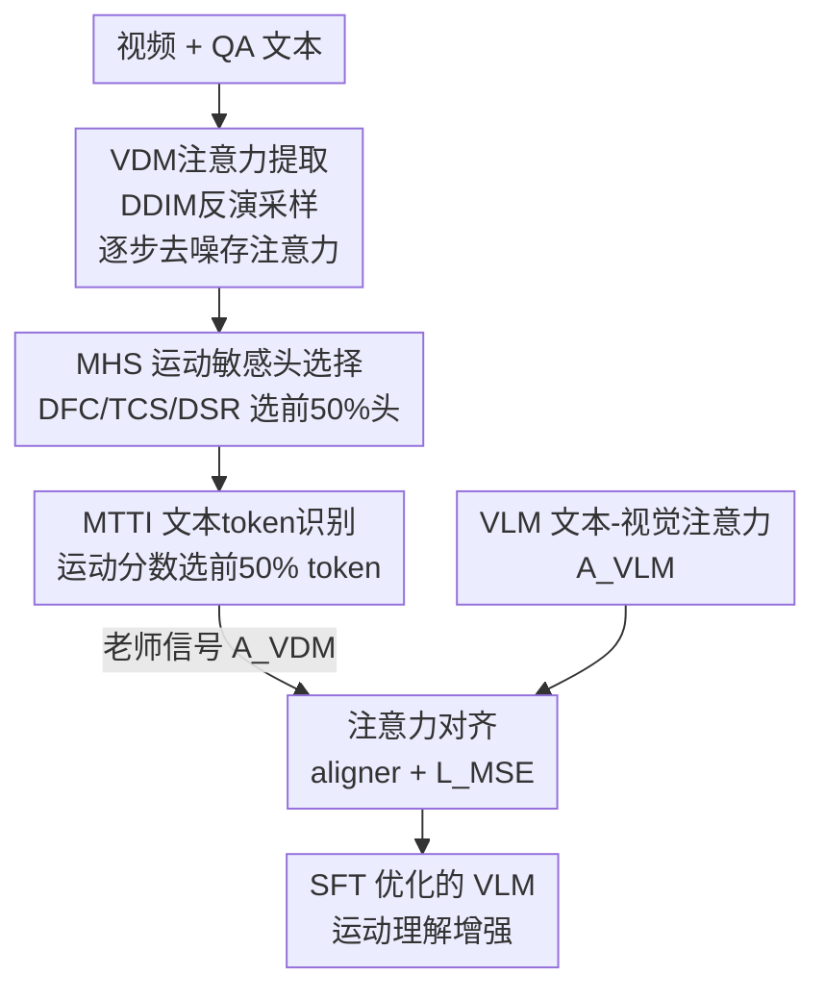

# MotionEnhancer: Leveraging Video Diffusion for Motion-Enhanced Vision-Language Models

**会议**: CVPR 2026  
**arXiv**: [2606.06853](https://arxiv.org/abs/2606.06853)  
**代码**: https://motion-enhancer.github.io/ (项目主页)  
**领域**: 视频理解 / 多模态VLM / 扩散模型  
**关键词**: 视频运动理解、视频扩散模型、注意力对齐、知识蒸馏、参数无关模块

## 一句话总结
把视频扩散模型（VDM）里天然编码的「运动先验」蒸馏出来，作为辅助监督去对齐 VLM 的文本-视觉注意力，从而在不加任何可训练参数、不改架构的前提下显著提升 VLM 对细粒度运动的理解能力。

## 研究背景与动机

**领域现状**：视频理解的主流框架是 VLM——抽关键帧、用图像编码器编码、喂进多模态大模型做对齐与推理（Qwen2.5-VL、InternVL3 等）。它们在事件级、故事级理解（视频描述、QA）上表现很强。

**现有痛点**：VLM 对**帧间细粒度运动**的捕捉很弱。一个人「先跑后停」、镜头「往哪个方向移动」、动作「重复了几次」这类问题，VLM 经常答错。已有改进要么靠额外模块（TE Fusion 的组内自注意力），要么靠外部工具（MotionSight 的物体高光、运动模糊），都偏重或偏复杂。

**核心矛盾**：作者从分布层面给出了理论解释。VLM 用自回归目标训练，其文本-视觉注意力本质学到的是一个**判别式条件分布 $p(t\mid V)$**——「给定画面，这个 token 多大概率出现」，模型完全可以靠静态外观线索（背景、上下文）满足这个目标，**不必建模时序如何变化**。而运动理解需要的是一个**寻证式分布 $p(V\mid t)$**——「给定语义概念 $t$（如某个动词），它的视觉证据在视频时空哪里、如何随时间演化」。论文用公式 $\mathbf{E}[\mathrm{Motion}(s,f)]\propto\|V_{f+1}(s)-V_{f}(s)\|$ 把运动证据落到帧间特征差上。两个分布根本错配，这正是 VLM「外观偏置强、时序不敏感」的根源。

**切入角度**：VDM 在逐步去噪生成视频时，必须保证相邻帧构成合理运动，被迫学到物体运动的物理规律、场景转换、帧间依赖。其文本-视觉交叉注意力 $A^{VDM}(t,s,f)\approx p_\phi(v_{s,f}\mid t,\mathbf{z}_k)$ 恰好近似了寻证式分布 $p(V\mid t)$，而且天然「运动校准」——时序变化大（难重建）的区域获得更多建模关注。所以 VDM 的注意力就是现成的运动先验来源。

**核心 idea**：用 VDM 内部的注意力当「老师」，通过注意力对齐把运动先验蒸给 VLM——一种「用一个模型族（生成式 VDM）的内部信号去指导另一个模型族（判别式 VLM）」的跨范式知识迁移，且只需 VDM 的注意力、不需要它的原始训练数据。

## 方法详解

### 整体框架
MotionEnhancer 的输入是视频 + QA 文本对，输出是一个运动理解更强的 VLM。整条管线分两段：**离线**先从冻结的 VDM（CogVideoX-1.5-5B）抽出注意力图，经两个参数无关模块筛出真正与运动相关的注意力（得到老师信号 $A_{\text{VDM}}$）；**在线** SFT 阶段再用一个轻量 aligner 把 VLM 的同位置注意力 $A_{\text{VLM}}$ 对齐到 $A_{\text{VDM}}$，与原自回归损失联合优化。关键是两个筛选模块 MHS、MTTI 都**不引入任何可训练参数**，纯靠在已有注意力上做统计计算，老师信号一次提取（A100 上约 20-30 秒/样本）即可在多个 VLM 间复用。

### 关键设计

**1. VDM 注意力提取：把生成模型的运动先验「读出来」而不破坏它**

要拿 VDM 的注意力当老师，第一步是稳定地把它从 VDM 里抽出来。作者用 5 步 DDIM 反演（inversion）把输入视频映回噪声，再 5 步去噪采样重建。由于 CogVideoX 用 zero terminal SNR 训练，直接反演会有采样偏移，作者用 classifier-free guidance 重建，并引入一条并行 DDIM 反演路径提供「跨流记忆」来纠偏。去噪每一步都计算并保存多模态注意力 $A_{\text{mm}}=\mathrm{Softmax}(Q_{\text{mm}}K_{\text{mm}}^T/\sqrt{d})$，最终对 layer 维和 timestep 维都做平均池化得到一张稳定的注意力图。整个提取过程在冻结 VDM 上离线完成，不动 VLM、也不需要 VDM 的训练数据。

**2. MHS 运动敏感头选择：只挑真正盯着运动的那些 head**

并非 VDM 的每个注意力头都在建模时序——很多头只管空间外观。MHS 借鉴 SparseVideoGen 的观察：运动相关的帧级注意力往往呈**对角线模式**（同一区域跨帧的时序连续性）。它用一个对角掩码 $\mathcal{M}$ 框出这种结构，再对每个 vision-to-vision 注意力图 $A_{\text{v2v}}$ 算三个**无参数**指标：① 对角聚焦系数 DFC $=\frac{\sum_{(i,j)\in\mathcal{M}}A^2[i,j]}{\sum_{(i,j)\notin\mathcal{M}}A^2[i,j]}$，衡量注意力有多集中在对角线上；② 时序连续分数 TCS，对每个空间位置取跨帧子矩阵、统计超过阈值 $\tau$（设为平均注意力值）的最长连续段长度再求均值，反映关注的持续性；③ 对角显著比 DSR $=n_{\text{high}}/|D|$，统计对角区域里高注意力出现的密度。三个指标各自标准化后求和得到每个头的综合分，取**前 50%** 作为运动头，再对它们的注意力做平均池化。三指标互补——DFC 看强度、TCS 看持续、DSR 看分布广度，单一指标都容易被孤立的高值点误导。

**3. MTTI 运动显著文本 token 识别：滤掉与运动无关的文本，让对齐聚焦**

选完头后得到文本-视觉注意力 $A_{\text{t2v}}\in\mathbb{R}^{T\times S}$，但不是每个文本 token 都和运动有关（如冠词 the、连词 which）。MTTI 对空间维 $H\times W$ 平均池化得到 token 在各帧上的注意力 $A_{\text{t2f}}\in\mathbb{R}^{T\times F}$，给每个 token 算一个运动分数 $\mathrm{MS}(t)=\mathrm{Mean}_f(A_{\text{t2f}}^t)+\frac{1}{F-1}\sum_{f=1}^{F-1}|A_{\text{t2f}}^t(f+1)-A_{\text{t2f}}^t(f)|$。前一项是该 token 的整体重要性（均值），后一项是它注意力的**帧间一阶差分均值**——动态事件（动词及其主宾）波动大、静态元素波动小。按分数排序取**前 50%** token 参与对齐。作者也诚实指出：它主要是滤掉无关功能词，而非精确地只留动词，因为运动语义常由动词连同其主语/宾语共同承载。

**4. 注意力对齐：用轻量 aligner 把 VLM 注意力拉向 VDM 老师**

VLM 这边同样对头和层做平均池化得到 $A_{\text{VLM}}\in\mathbb{R}^{T'\times S}$（这里不做运动头选择——作者在讨论中解释 VLM 的头是「通用理解型」、不像 VDM 的头那样有清晰的时空专精，所以平均池化更合适）。先把 $A_{\text{VLM}}$ 插值到 $A_{\text{VDM}}$ 的尺寸，再用一个 3 层 MLP 作为 aligner 网络，最小化 $\mathcal{L}_{\text{MSE}}=\|\mathrm{Aligner}(A_{\text{VLM}})-A_{\text{VDM}}\|_2$，且只对前面 MTTI 选中的 token 计算对齐损失。这一步让 VLM 的文本-视觉注意力从「盯外观」逐渐学会「盯运动证据」。

### 损失函数 / 训练策略
总损失把原自回归损失和注意力对齐损失加权相加：$\mathcal{L}_{\text{total}}=\mathcal{L}_{\text{AR}}+\lambda\mathcal{L}_{\text{MSE}}$，平衡因子 $\lambda=1$。训练数据用 MotionBench-Train 的全部 5k 对 + 从 MotionVid-QA 采样 20k 对，共 25k QA 对。VDM 注意力 5 步反演 + 5 步采样离线提取、可跨 VLM 复用。SFT 阶段 vision tower、merger、LLM backbone 都可训练，用 AdamW（LLM/merger 学习率 $1\mathrm{e}{-5}$、vision tower $2\mathrm{e}{-6}$，weight decay 0.1，cosine 调度 + 0.03 warmup），batch size 8、训练 1 个 epoch，8×A100(80GB) + DeepSpeed。

## 实验关键数据

### 主实验
在两个运动级视频理解 benchmark 上评测：MotionBench（5,385 视频 / 8,052 QA，6 类运动任务）和 FAVOR-Bench（close-ended 1,776 视频 / 8,184 QA，6 个维度）。带 MotionEnhancer 后各尺寸 backbone 一致提升，尤其运动相关指标。

| Benchmark | Backbone | Overall | Average | 提升(Overall) |
|-----------|----------|---------|---------|------|
| MotionBench | Qwen2.5-VL-3B | 53.56 → 56.60 | 49.45 → 52.51 | +3.04 |
| MotionBench | Qwen2.5-VL-7B | 52.81 → 57.04 | 48.29 → 52.92 | +4.23 |
| MotionBench | InternVL3-2B | 53.96 → 55.50 | 49.69 → 51.35 | +1.54 |
| MotionBench | InternVL3-8B | 54.88 → 57.69 | 50.81 → 53.22 | +2.81 |
| FAVOR-Bench | Qwen2.5-VL-3B | 37.43 → 44.53 | 38.07 → 43.94 | +7.10 |
| FAVOR-Bench | Qwen2.5-VL-7B | 42.61 → 46.88 | 42.58 → 47.01 | +4.27 |
| FAVOR-Bench | InternVL3-2B | 39.27 → 43.71 | 39.11 → 45.35 | +4.44 |
| FAVOR-Bench | InternVL3-8B | 45.82 → 48.94 | 46.35 → 49.25 | +3.12 |

关键对比：Qwen2.5-VL-7B + MotionEnhancer 在 MotionBench 上 57.04，**超过专门做运动的 MotionSight（55.30）**；而且 Qwen2.5-VL-3B+MotionEnhancer 在两个 benchmark 上都**反超原版 Qwen2.5-VL-7B**，7B+MotionEnhancer 逼近 Qwen2.5-VL-72B（MotionBench 58.30 / FAVOR 48.14）——小模型靠运动先验摸到了大模型的天花板。

### 消融实验
在 Qwen2.5-VL-7B 上验证 MHS 与 MTTI 的贡献（Overall/Average）：

| 配置 | MotionBench | FAVOR-Bench | 说明 |
|------|-------------|-------------|------|
| baseline（都用平均池化） | 54.83 / 51.51 | 44.83 / 44.54 | 仅在 25k 数据上 SFT |
| + 仅 MHS | 56.60 / 52.51 | 46.65 / 46.55 | Overall +1.77 / +1.82 |
| + 仅 MTTI | 55.80 / 51.31 | 45.47 / 45.99 | 单用增益小于 MHS |
| + MHS + MTTI（完整） | 57.04 / 52.92 | 46.88 / 47.01 | 二者互补，增益最大 |

### 关键发现
- **MHS 贡献更大**：单加 MHS 比单加 MTTI 提升更明显。作者解释 MTTI 依赖 MHS 先做的运动头筛选——头都没选对，再筛 token 收益有限，所以两者互补、组合最优。
- **小模型受益更大**：3B backbone 在 FAVOR-Bench 上 Overall +7.10，是所有设置里最大涨幅，说明运动先验对能力较弱的模型补足效果更显著。
- **细分指标爆发**：7B 在 MotionBench 上 Camera Motion 提升约 11.7%、Motion Recognition 约 4.4%，正是最依赖时序的维度。
- **老师信号可复用**：VDM 注意力离线一次性提取（约 20-30 秒/样本），可跨多个 VLM 和消融实验重用，摊薄了开销。

## 亮点与洞察
- **跨范式知识迁移**：最「啊哈」的点是把生成式模型（VDM）的内部注意力当成判别式模型（VLM）的老师，且只借注意力、不碰 VDM 的训练数据。这把「生成模型懂运动」这件隐性能力显式蒸出来用，思路可迁移到任何「A 模型族隐式擅长某能力、B 模型族缺这个能力」的场景。
- **参数无关的先验筛选**：MHS / MTTI 全是在已有注意力上做统计（对角集中度、帧间差分），零新增参数、零架构改动，纯 computation-only。这让方法可即插即用到不同 VLM 和 DiT-based VDM 上。
- **理论先行**：用 $p(t\mid V)$ vs $p(V\mid t)$ 的分布错配把「VLM 为什么不懂运动」讲透，再论证 VDM 注意力恰好近似 $p(V\mid t)$，给「为什么该用 VDM 当老师」提供了可解释的依据，而不是纯实验试出来的 trick。
- **可复用 trick**：「均值 + 一阶差分」作为时序显著性打分（MTTI 的 MS 公式）很轻量，可迁移到任何「区分动态 vs 静态 token/区域」的任务。

## 局限与展望
- **作者承认的局限**：对「主体占满整帧且静止」的视频，训练后纠错率低。可视化发现这类视频的 VDM 注意力变得弥散、不聚焦——根源是 VDM 训练数据多为含小物体的视频，对大而静的主体建模差，这个偏置被一并蒸给了 VLM。
- **MTTI 不够精确**：作者自述它主要滤掉功能词，而非精确只留动词，运动语义是由动词连同主宾共同承载的，token 选择仍偏粗。
- **依赖 VDM 质量与偏置**：方法效果受限于所选 VDM（CogVideoX）的能力上界和数据偏置，VDM 学不好的运动模式（大静态主体）就传不过去。改进方向：更精细的运动提取 + 数据预处理缓解偏置；作者还提出把 VDM 运动 latent 当作下游时序敏感任务（如机械臂抓取）的预训练信号。

## 相关工作与启发
- **vs MotionSight**：同样为提升 VLM 运动理解，MotionSight 靠物体高光 + 运动模糊等显式增强、偏工具化；本文不加任何额外模块/工具，靠蒸馏 VDM 注意力，且在 MotionBench 上 57.04 > MotionSight 55.30。
- **vs Lavender**：Lavender 把 VLM 注意力对齐到 Stable Diffusion 以迁移视觉专长，但只针对**图像**；本文把这套注意力对齐扩展到**视频**，关键是补上 MHS/MTTI 两个针对时序的轻量适配，证明该范式只需极小改动即可迁到视频。
- **vs DIVA / GenHancer**：它们用冻结扩散模型的生成反馈优化 CLIP 特征 / 引入轻量去噪器重建，同样是「扩散模型指导 VLM」，但聚焦图像特征质量；本文聚焦**视频运动理解**这一时序问题，且强调参数无关、可跨模型复用。

## 评分
- 新颖性: ⭐⭐⭐⭐⭐ 「用 VDM 注意力当老师蒸运动先验给 VLM」的跨范式思路新颖，且有分布错配理论支撑
- 实验充分度: ⭐⭐⭐⭐ 两 benchmark × 两个 backbone 家族 × 多尺寸验证充分，消融清晰；但仅一个 VDM、缺更多 VDM/对齐设计的横向对比
- 写作质量: ⭐⭐⭐⭐ 理论动机推导清楚、方法简洁；个别公式排版与符号略密
- 价值: ⭐⭐⭐⭐ 零新增参数、零架构改动即插即用，小模型摸到大模型天花板，工程实用性强

<!-- RELATED:START -->

## 相关论文

- [\[CVPR 2026\] LAMP: Language-Assisted Motion Planning for Controllable Video Generation](lamp_language-assisted_motion_planning_for_controllable_video_generation.md)
- [\[CVPR 2026\] Efficient Long-Context Modeling in Diffusion Language Models via Block Approximate Sparse Attention](efficient_long-context_modeling_in_diffusion_language_models_via_block_approxima.md)
- [\[ICML 2026\] MiVE: Multiscale Vision-language features for reference-guided video Editing](../../ICML2026/video_generation/mive_multiscale_vision-language_features_for_reference-guided_video_editing.md)
- [\[CVPR 2026\] Diff4Splat: Repurposing Video Diffusion Models for Dynamic Scene Generation](diff4splat_controllable_4d_scene_generation_with_latent_dynamic_reconstruction_m.md)
- [\[CVPR 2026\] Goal-Driven Reward by Video Diffusion Models for Reinforcement Learning](goal-driven_reward_by_video_diffusion_models_for_reinforcement_learning.md)

<!-- RELATED:END -->
