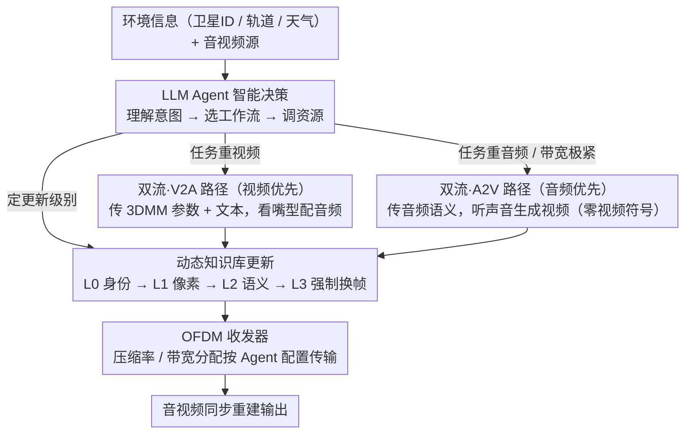

# Semantic Satellite Communications for Synchronized Audiovisual Reconstruction

**会议**: CVPR 2026  
**arXiv**: [2603.10791](https://arxiv.org/abs/2603.10791)  
**代码**: 无  
**领域**: 视频生成  
**关键词**: 卫星通信, 语义传输, 音视频同步, 跨模态生成, LLM智能决策

## 一句话总结

提出面向卫星通信的自适应多模态语义传输系统，通过双流生成架构（视频驱动音频 / 音频驱动视频）实现动态模态优先级切换，结合知识库动态更新机制和 LLM 智能决策模块，在严苛带宽约束下实现高保真音视频同步重建。

## 研究背景与动机

1. **领域现状**：卫星通信面临极端物理层限制（雨衰、大 Doppler 频偏、数百毫秒传播延迟），传统通信方式难以在 kbps 级带宽下支持高带宽多媒体流。语义通信通过仅传输任务相关语义来突破带宽瓶颈，已在文本和图像上取得成功。

2. **现有痛点**：(1) 现有多模态语义传输方法在设计阶段就固定了模态优先级和跨模态生成路径，无法根据任务需求灵活调整；(2) 知识库缺乏动态更新机制，导致过时信息或资源浪费；(3) 被动适应信道变化，缺乏前瞻性的主动传输策略。

3. **核心矛盾**：卫星场景下带宽极其有限且信道高度动态，同时多模态同步传输需要大带宽和稳定信道——两者之间存在根本矛盾。

4. **本文目标**：如何在有限卫星带宽下实现灵活、鲁棒、高保真的音视频同步传输。

5. **切入角度**：利用跨模态生成的互补性——只传输最重要的模态语义，通过生成模型恢复另一个模态。

6. **核心 idea**：用 LLM Agent 协调双流跨模态生成（V2A/A2V）和动态知识库更新，实现卫星带宽约束下的智能音视频语义传输。

## 方法详解

### 整体框架

这篇论文要解决的是一个很具体的痛点：卫星链路只有 kbps 级带宽，却要传完整的音视频流，传统编码（H264/H265）根本扛不住。它的破局思路是「只传一个模态、生成另一个模态」——发送端不发完整视频，而是发一小撮语义特征（如 3DMM 人脸参数或音频音素），接收端靠生成模型把缺失的那个模态补出来。

整套系统按通信协议栈分三层：**技术层**管 OFDM 物理传输；**语义层**是核心，在 LLM Agent 指挥下选择性地抽取任务相关特征，并在 V2A（视频优先）或 A2V（音频优先）两条工作流之间切换来重建音视频；**效果层**评估任务级指标（如人脸关键点距离、语音可懂度）。三层之间还挂着一个共享的**语义知识库**，存用户参考图像这类不随帧变化的静态信息，供生成端反复复用——这是带宽能压下来的关键。

### 关键设计

**1. 双流跨模态生成架构：让传输路径跟着任务需求走，而不是写死**

固定流水线的问题在于它在设计阶段就锁死了"传哪个模态、生成哪个模态"，可监控任务想要视频高保真、紧急语音调度只在乎音频可懂度，两者的最优传输方式南辕北辙。本文给出两条对称的路径任选。**V2A 路径（视频优先）**传 3DMM 参数和文本：先用参考图像加 3DMM 重建视频 $\hat{V}_i = f_{VG}(\hat{S}_{i,M}, V_1)$，再从重建视频里抽唇部特征 $E_{\text{lip}} = f_{\text{Lip}}(\hat{V})$，用注意力把唇形和文本对齐 $E_{\text{lip-text}} = \text{Attention}(E_{\text{lip}}, E_{\text{text}}, E_{\text{text}})$，经转置卷积扩展后吐出 Mel 频谱并合成波形——音频是"看着嘴型配出来的"。**A2V 路径（音频优先）**反过来，传音频语义（文本+音素+时长），先重建音频 $\hat{A} = f_{\text{HiFi}}(f_{\text{Mel}}(\hat{S}_P, \hat{S}_D))$，再用 audio-to-3DMM 模块从声音预测面部参数，最后合成视频——视频是"听着声音生成的"，连一个视频符号都不用传。两条路径共享同一个知识库里的参考图像，所以无论走哪边，人脸身份都稳得住。

**2. 动态知识库更新机制：参考帧只在真该换的时候才换，别白烧带宽**

参考图像是生成质量的地基，但每更新一次参考帧要烧掉 16,384 个符号，在卫星带宽下是奢侈品。本文不每帧都更新，而是设了一个由松到紧的四级判别阶梯，逐级决定"旧参考帧还能不能用"。**L0（身份一致性）**最省，只看人脸嵌入空间里的余弦相似度 CSIM 是否高于阈值 $\alpha_{\text{CSIM}}=0.7$，身份没变就继续复用；**L1（像素质量）**进一步用 PSNR 卡低层视觉一致性，阈值 $\alpha_{\text{PSNR}}=13$ dB；**L2（语义质量）**最细，算表情/旋转/平移三项加权的 3DMM 参数距离，三项都低于各自阈值才复用；**L3（强制更新）**则每段都换新参考帧，质量最高但带宽也最高。这条阶梯把成本拉开了一个数量级——L0 一段只要约 2,785 符号，L3 要 16,384 符号。好处直接体现在性价比上：V2A-L2 大约只花 L3 一半的带宽，性能却逼近 L3。

**3. LLM Agent 智能决策模块：用语义推理替代查表，做跨层调度**

到底走 V2A 还是 A2V、知识库更新到第几级、带宽怎么分，这些决策耦合在一起，状态空间组合爆炸，传统查表法根本列不全所有信道×任务的场景。本文把 GPT-4o 当作中枢 Agent，靠 prompt engineering 喂给它卫星 ID、轨道位置、天气等环境信息，让它走三步推理：先**理解意图**（任务目标 + 当前信道质量），再**选工作流**（V2A 还是 A2V），最后**调资源**（压缩率、带宽分配、知识库更新级别）。Agent 的输出不是建议而是直接配置——决策结果直接写进 OFDM 收发器的参数。它能做出查表法做不到的前瞻动作，比如主动把更新级别从 L3 降到 L2、把省下的带宽重新分配出去，用约一半带宽撑住接近 L3 的效果。

### 一个完整示例

设想一个卫星监控回传任务，信道 SNR≈12 dB。LLM Agent 先读到环境信息（卫星过顶、天气晴好、链路尚可）和任务意图（"保人脸清晰、可后续做关键点检测"），判断视频是主模态，于是**选 V2A 路径**。第一段视频里人物是新出现的，知识库没有匹配的参考帧——四级判别在 L0 就因 CSIM 低于 0.7 触发，**强制走 L3 更新**，花掉约 16,384 个符号把参考帧传过去。接下来几段人物姿态、表情变化都不大：L0 的身份相似度过关、L1 的 PSNR 也过关，**停在 L2 复用旧参考帧**，每段只发 3DMM 参数和文本约几百个符号，接收端用旧参考图加新参数重建视频，再从唇形配出同步音频。当 Agent 感知到信道转差（雨衰临近），它进一步**把更新级别压到 L0、把带宽腾给前向纠错**，宁可牺牲一点像素细节也保住身份不漂。整段下来，绝大多数帧靠几百符号搞定，只有人物切换那一刻烧了一次 1.6 万符号，平均带宽相比 H264 的 40 万符号/帧压了约三个数量级。

### 损失函数 / 训练策略

语义编解码器对使用 MSE（浮点数据）+ 交叉熵（token 序列）联合训练 400 epochs，学习率 0.001。V2A 主干网络用 pitch/energy/Mel 谱图三项 L2 损失训练 1000 epochs，学习率 0.0001。卫星信道模型采用 NTN-TDL-A，卫星高度 300-1200 km。

## 实验关键数据

### 主实验

视频重建（SNR=12 dB）：

| 方法 | AKD ↓ | 带宽 (符号) |
|------|------|------------|
| H264+LDPC | N/A (无法检测) | 400,991 |
| H265+LDPC | N/A | 54,390 |
| SVC | 8.36 | 600 |
| V2A (本文) | 5.41 | 600 |
| A2V (本文) | 5.85 | 0 (视频部分) |

音频传输（SNR=20 dB）：

| 方法 | LSE-C ↑ | LSE-D ↓ | WER ↓ | 带宽 |
|------|---------|---------|-------|------|
| DeepSC-S | 7.85 | 6.57 | 0.11 | 32,768 |
| A2V (本文) | 5.85 | 8.69 | 0.11 | 600 |
| V2A (本文) | 2.22 | 12.16 | 0.11 | 300 |

### 消融实验

知识库更新级别影响（V2A, SNR=12 dB）：

| 更新级别 | AKD | 平均更新次数/100段 | 平均带宽/段 |
|---------|-----|------------------|------------|
| L0 | ~8 | 17 | 3,085 |
| L1 | ~6.5 | 27 | 4,727 |
| L2 | ~5.8 | 50 | 8,492 |
| L3 | ~4.8 | 100 | 16,684 |

### 关键发现

- **极端压缩比**：V2A/A2V 仅需 600-900 个符号即可传输一帧，比 H264 的 40 万+符号减少约 600 倍
- **A2V 实现"零视频传输"**：完全不传视频符号，仅从音频语义生成视频，在极端带宽场景下非常有价值
- **低 SNR 下语义方法远超传统方法**：传统 H264/H265 在低 SNR 下快速崩溃，而生成式方法保持稳定
- **LLM Agent vs 查表法**：Agent 主动将更新级别从 L3 降至 L2 并重新分配带宽，以约 50% 的带宽达到接近 L3 的性能
- **V2A-L2 性价比最高**：AKD 5.8 vs L3 的 4.8，但带宽仅为一半

## 亮点与洞察

- **跨模态生成替代传输**：只传一个模态的语义，用另一个模态的生成来替代传输，这在卫星通信的极端带宽约束下特别有意义。A2V 的"零视频传输"是一个很大胆的设计。
- **多级知识库更新机制设计精巧**：从身份级到像素级到语义级的递进判别，既节省带宽又保证生成质量，L0-L2 形成了一个实用的质量-带宽权衡工具箱。
- **LLM 作为通信系统控制器**：超越了传统 rule-based 的适配策略，让 LLM 理解任务意图和物理约束后做跨层决策，是语义通信与基础模型结合的有趣探索。

## 局限与展望

- **生成网络延迟较高**：V2A/A2V 的推理延迟（0.07-0.1s/帧）远高于传统方法，可能不适合超低延迟场景
- **仅针对面部视频场景**：当前设计围绕 3DMM 人脸参数，难以直接扩展到通用视频场景
- **LLM Agent 的实时性**：GPT-4o 的推理速度是否能满足卫星通信的实时决策需求存疑
- **单一卫星中继假设**：未考虑多卫星协作和星间链路的场景

## 相关工作与启发

- **vs SVC**：SVC 仅用关键点传输视频语义，对信道噪声极其敏感（12 dB 下 AKD=8.36）；本文的 3DMM 参数更鲁棒（AKD=5.41）
- **vs DeepSC-S**：DeepSC-S 端到端语音编解码质量高，但带宽是本文方法的 55 倍
- **vs 固定模态优先级方案**：文献 [57][58][55][23] 固定了单向生成路径，本文的双流切换更灵活

## 评分

- 新颖性: ⭐⭐⭐⭐ 双流跨模态生成+LLM Agent 决策的系统级设计新颖，将多个方向有机结合
- 实验充分度: ⭐⭐⭐⭐ 涵盖视频/音频/同步三维评估，知识库消融和 Agent 案例分析详实
- 写作质量: ⭐⭐⭐ 系统复杂度高导致论文冗长，some sections过于公式化
- 价值: ⭐⭐⭐⭐ 对卫星通信+语义传输领域有重要参考价值，LLM Agent 控制通信系统的思路有前瞻性

<!-- RELATED:START -->

## 相关论文

- [\[CVPR 2026\] U-Mind: A Unified Framework for Real-Time Multimodal Interaction with Audiovisual Generation](u-mind_a_unified_framework_for_real-time_multimodal_interaction_with_audiovisual.md)
- [\[CVPR 2026\] SWIFT: Sliding Window Reconstruction for Few-Shot Training-Free Generated Video Attribution](swift_sliding_window_reconstruction_for_few-shot_training-free_generated_video_a.md)
- [\[CVPR 2026\] PhysVid: Physics Aware Local Conditioning for Generative Video](physvid_physics_aware_local_conditioning_for_generative_video_models.md)
- [\[CVPR 2026\] VGA-Bench: A Unified Benchmark for Video Aesthetics and Generation Quality Evaluation](vga_bench_unified_benchmark_for_video_aesthetics_and_generation_quality.md)
- [\[CVPR 2026\] DriveLaW: Unifying Planning and Video Generation in a Latent Driving World](drivelaw_unifying_planning_and_video_generation_in_a_latent_driving_world.md)

<!-- RELATED:END -->
