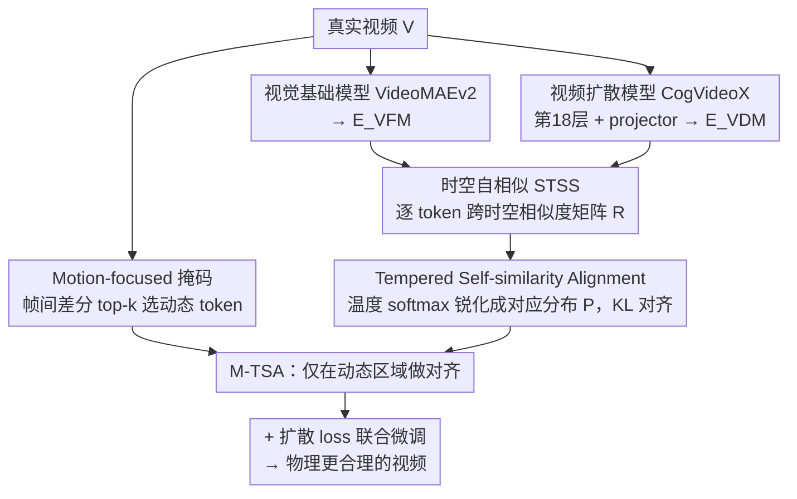

# Tempered Self-Similarity Alignment for Physically Plausible Video Generation

**会议**: CVPR 2026  
**arXiv**: [2605.24962](https://arxiv.org/abs/2605.24962)  
**代码**: https://cvlab.postech.ac.kr/project/TSA (项目主页)  
**领域**: 视频生成 / 扩散模型 / 表示对齐  
**关键词**: 视频扩散、物理合理性、时空自相似、表示对齐、知识蒸馏

## 一句话总结
本文把视觉基础模型里的「时空自相似（STSS）」转成带温度的对应关系概率分布，再通过 KL 对齐把这种关系知识蒸馏进视频扩散模型，并只在动态区域做对齐，从而显著提升生成视频的物理合理性（VideoPhy 物理常识分 25.3→30.8）。

## 研究背景与动机

**领域现状**：文本生成视频的扩散模型（CogVideoX、HunyuanVideo、Wan 等）画质和分辨率已经很高，但生成的视频经常违背物理规律——出现 appearance drift（物体外观漂移）、不真实的形变、运动不连贯。这在机器人训练、虚拟环境构建、视频预测这些需要精确运动模拟的场景里是致命短板。

**现有痛点**：已有三条改进路线各有硬伤。① 物理仿真器路线（PhysGen、PhysDreamer 等）依赖重型仿真器，只能覆盖特定物理域，难以扩展到多样的真实场景；② MLLM 推理路线（PhyT2V、WISA 等）靠迭代 refine，显著拖慢生成速度，且效果被 MLLM 自身的物理推理能力卡死；③ 光流路线（VideoJAM、Track4Gen 等）只能刻画相邻帧之间的短程位移，对长程运动和结构随时间的变化无能为力。

**核心矛盾**：物理合理性的本质是「物体如何随时间运动、形变、与周围实体交互」这种**关系结构**，但上述信号要么太重、要么太慢、要么太短视，都没能把这种长程关系知识高效注入生成模型。最接近的工作 VideoREPA 已经开始从视频基础模型蒸馏 STSS，但它**直接对齐原始 STSS 张量、且在所有区域均匀对齐**——原始相似度张量经 L1 对齐后分布过于平滑，给不出精确的运动监督，静态背景还白白稀释了学习信号。

**本文目标**：用一个更精确、更聚焦的关系监督信号，把基础模型里编码的真实运动动力学迁移进视频扩散模型，且不依赖仿真器、不增加推理延迟。

**切入角度**：作者注意到时空自相似（STSS，即特征跨时空两两相似度）天然压制颜色/纹理这类光度变化、突出实体间的关系结构，能编码物体怎么动、怎么变形、怎么交互——这正是物理合理性需要的信号。关键改进点在于**不要直接对齐原始相似度，而是把它当成「运动对应关系」来对齐**：每个 query token 跨帧的相似度其实就是它的软轨迹。

**核心 idea**：把 STSS 用温度缩放 softmax 锐化成「对应关系概率分布」，再用 KL 散度把扩散模型的分布对齐到基础模型的分布，并用运动显著性掩码把对齐限制在动态区域。

## 方法详解

### 整体框架
方法（TSA）建立在表示对齐（REPA）的框架上，但对齐的对象从「逐 patch 特征」换成了「跨帧对应关系分布」。整体流程是：给定一段真实视频，一路送进预训练视觉基础模型（VideoMAEv2）得到时空特征 $\mathbf{E}^{\text{VFM}}$，另一路从去噪网络（CogVideoX-2B）第 18 个 transformer block 取中间特征、过一个轻量 projector 投到同一特征空间得到 $\mathbf{E}^{\text{VDM}}$；两路各自算 STSS 相似度矩阵 $\mathbf{R}\in\mathbb{R}^{N\times N}$，再沿空间维做温度缩放 softmax 得到锐化的对应关系分布 $\mathbf{P}$；最后用 KL 散度把两个分布对齐（TSA loss）。在此基础上，用帧间差分构造运动显著性掩码，只对 top-$k$ 动态 token 做对齐（M-TSA），把监督聚焦到真正发生物理运动的区域。整套 loss 与标准扩散 loss 联合微调扩散模型，推理阶段不引入任何额外开销。

### 关键设计

**1. Tempered Self-similarity Alignment：把自相似当成「对应分布」用温度锐化后对齐**

直接对齐原始 STSS 张量（VideoREPA 的做法）会得到过于平滑的相似度，每个 query token 对不清楚自己在下一帧具体对应到哪个位置，运动监督非常模糊。本文的关键转换是：先对两路特征沿通道做 L2 归一化、展平时空维得到 $\bar{\mathbf{E}}\in\mathbb{R}^{N\times C}$（$N=FHW$），算出 STSS 相似度矩阵 $\mathbf{R}=\bar{\mathbf{E}}\bar{\mathbf{E}}^\top$；再把 $\mathbf{R}$ reshape 成 $\mathbb{R}^{N\times F\times HW}$，沿空间维做**温度缩放 softmax**得到对应关系概率分布

$$\mathbf{P}_{i,f}=\text{softmax}\!\left(\frac{\mathbf{R}_{i,f}}{\tau}\right)\in\mathbb{R}^{HW},$$

其物理含义是：query token $i$ 在第 $f$ 帧上对应到各空间位置的概率分布——也就是它的一条「软轨迹」。与光流把位移表示成相邻帧的 one-hot 对应不同，这种表示天然刻画长程动态和结构变化的不确定性。TSA loss 就是用 KL 散度对齐两个模型的对应分布：

$$\mathcal{L}_{\text{TSA}}=\frac{1}{NF}\sum_{i=1}^{N}\sum_{f=1}^{F}D_{\mathrm{KL}}\!\left(\mathbf{P}^{\text{VFM}}_{i,f}\,\|\,\mathbf{P}^{\text{VDM}}_{i,f}\right).$$

这样设计有两个好处。其一，KL 的梯度 $\partial\mathcal{L}_{\text{TSA}}/\partial\mathbf{R}^{\text{VDM}}_{i,f}=\frac{1}{\tau}(\mathbf{P}^{\text{VDM}}_{i,f}-\mathbf{P}^{\text{VFM}}_{i,f})$ 正比于两个分布的概率失配——对没对齐的区域给强梯度、对已对齐的区域衰减梯度，而 VideoREPA 用的 L1 目标无论对齐好坏都给均匀梯度。其二，温度 $\tau$ 直接控制对应关系的粒度：$\tau$ 越低分布越锐，监督从「物体级」收紧到「部件级」再到「点级」（论文 Fig.3），给出更精细的逐 query 运动监督，同时仍保留 STSS 里的部件级结构信息。实验最优 $\tau=0.1$。

**2. Motion-focused Self-Similarity Alignment（M-TSA）：用运动掩码把对齐聚焦到动态区域**

视频里大部分区域是静态背景，对这些区域做对应对齐既浪费算力，又会把模型的注意力从真正发生物理运动的地方拉走。M-TSA 的做法是先把视频切成不重叠的 tubelet（$P_t\times P_h\times P_w$）得到 patch token $\mathbf{Y}$，对每个 token 算帧间 L1 差分

$$\Delta_{t,h,w}=\|\mathbf{Y}_{t,h,w}-\mathbf{Y}_{t-1,h,w}\|_1$$

（首帧用第 2 帧的差分填充），然后逐帧选差分最大的 top-$k$（默认 $k=20\%$）token 构成运动显著性掩码 $\mathcal{M}$，阈值 $r_t$ 取该帧差分的 top-$k$ 分位。最终只对掩码内的动态 token 做 KL 对齐：

$$\mathcal{L}_{\text{M-TSA}}=\frac{1}{|\mathcal{M}|F}\sum_{i\in\mathcal{M}}\sum_{f=1}^{F}D_{\mathrm{KL}}\!\left(\mathbf{P}^{\text{VFM}}_{i,f}\,\|\,\mathbf{P}^{\text{VDM}}_{i,f}\right).$$

这一步在去掉静态冗余、降低显存/计算开销的同时，逼模型把学习容量集中到物理上有意义的运动上，而不是被大面积静态背景带偏。

### 损失函数 / 训练策略
最终目标是 M-TSA loss 与标准扩散去噪 loss 联合微调：

$$\mathcal{L}_{\text{total}}=\mathcal{L}_{\text{diffusion}}+\lambda\,\mathcal{L}_{\text{M-TSA}}.$$

基础模型 CogVideoX-2B（去噪网络）+ VideoMAEv2-B（视觉基础模型）；projector 为 3 层 MLP + 一个 3D 卷积（用来把扩散特征的时空分辨率对齐到基础模型）。超参 $\lambda=0.5$、$\tau=0.1$、$k=20$，对齐位置取 CogVideoX 第 18 个 transformer block。从 OpenVid 子采样 64K 视频，用 AdamW（lr $2\times10^{-6}$、batch 32）全参微调 4000 步，8 张 RTX 6000 Ada。

## 实验关键数据

### 主实验
评测在 VideoPhy（344 prompt，材料交互：固-固/固-流/流-流）和 VideoPhy2（590 prompt，人-物交互）上。SA = 语义贴合度，PC = 物理常识，分值为「得分 ≥0.5（VideoPhy）/≥4（VideoPhy2）样本占比」。

| 数据集 | 指标 | baseline (CogVideoX-2B*) | +REPA | +TRD (VideoREPA) | +TSA | +M-TSA (本文) |
|--------|------|------|-------|------|------|------|
| VideoPhy | Overall PC | 25.3 | 22.7 | 27.6 | 29.1 | **30.8** |
| VideoPhy | Solid-Solid PC | 15.4 | 9.1 | 18.2 | 19.6 | **21.0** |
| VideoPhy | Overall SA | 59.6 | 60.5 | 63.1 | 62.8 | **64.5** |
| VideoPhy2 | Joint | 22.9 | 23.3 | 23.1 | 24.0 | **24.4** |
| VideoPhy2 | PC | 68.0 | 66.8 | 68.4 | 69.3 | **69.8** |

- M-TSA 的 Overall PC 30.8% 超过了靠 LLM 迭代 refine 的 PhyT2V（29.0%），而且不需要推理时迭代。
- 最大增益在 Solid-Solid：PC 从 15.4→21.0（相对 +36.4%），说明刚体交互这类最考验物理一致性的场景受益最大。

VBench 上 M-TSA 把 Total Score 从 81.0→81.2，画质指标（Subject/Background Consistency、Motion Smoothness 等）基本持平——说明提升物理合理性并未牺牲原模型的视频质量。

### 消融实验
| 配置 | 关键指标（VideoPhy Overall PC） | 说明 |
|------|---------|------|
| Full (M-TSA) | 30.8 | 完整模型 |
| 仅 TSA（无掩码） | 29.1 | 去掉运动掩码，掉 1.7 |
| TRD / L1 对齐（VideoREPA） | 27.6 | 换回原始 STSS 的 L1 均匀对齐 |
| REPA（逐特征对齐） | 22.7 | 不用 STSS、退化为普通特征对齐，甚至低于 baseline |
| $\tau$: 1.0→0.1 | 单调上升 | 温度越低分布越锐，运动监督越精细；低于 0.1 反而下降 |
| $k$: 5%→20%→更大 | 20% 最优 | 5% 即超 baseline，>20% 后逐渐回落 |
| 对齐层 $l$ | 第 18 block 最优 | 太浅/太深都次优 |

### 关键发现
- **温度是核心旋钮**：$\tau$ 从 1.0 降到 0.1，PC 单调提升；但再低就掉点——过度锐化会压掉部件级几何这类结构线索，反而损害连贯运动理解。说明「精细运动线索」和「结构上下文」需要平衡。
- **静态区域是噪声而非信息**：$k=20\%$ 时把对齐限制在最动态的 20% token 即达最优，对齐更多（含静态背景）反而把模型带偏向静态背景。
- **关系分布 > 原始特征/原始相似度**：REPA 的逐特征对齐（22.7）甚至低于 baseline（25.3），VideoREPA 的原始 STSS L1 对齐（27.6）次之，本文的锐化分布 + KL（30.8）最优——验证「把 STSS 当对应分布对齐」这一重新诠释的价值。
- **架构无关**：把 loss 用到自回归视频生成模型 NOVA-0.6B 上，Overall PC 从 20.1→30.5，各材料类别一致提升，说明方法对双向扩散和因果自回归都适用。

## 亮点与洞察
- **把「自相似」重新诠释成「软轨迹分布」**：同一个 STSS 张量，VideoREPA 当成要逐元素匹配的特征矩阵，本文把每行 reshape 成跨帧的概率分布。这个视角切换让监督从「让相似度数值一致」升级为「让对应关系一致」，而后者才是运动的本质——这是最让人「啊哈」的地方。
- **温度 = 可调的监督粒度**：用一个温度参数把对应关系从物体级、部件级一路调到点级，等于给「该学多细的运动」装了个旋钮，且 KL 的梯度形式天然实现「难样本强监督、易样本弱监督」。这个思路可迁移到任何用相似度做蒸馏的关系型 KD 任务。
- **运动掩码几乎零成本**：仅靠像素帧间差分选 top-$k$ token，无需额外网络或光流，就把对齐聚焦到动态区，既省显存又涨点——是个可直接复用的轻量 trick。

## 局限性 / 可改进方向
- **依赖视觉基础模型的天花板**：迁移到的运动知识上限由 VideoMAEv2 决定，基础模型本身没见过/学不好的物理现象（如复杂流体、刚体碰撞细节）很难凭对齐补出来。
- **掩码靠像素差分**：top-$k$ 帧间差分会把相机运动、光照变化误判为「动态区域」，在大幅运镜场景下掩码可能失真，作者未讨论这种情形。
- **绝对物理分仍偏低**：即便是最好的 M-TSA，VideoPhy 物理常识分也只有 30.8%，离「绝大多数视频物理合理」还很远；评测又依赖 VideoCon/AutoEval 自动评分器，其可靠性也会影响结论。
- **改进思路**：把运动掩码换成更鲁棒的（如基于光流/分割的前景掩码）、或让温度随训练/token 自适应，可能进一步缩小与真实动力学的差距。

## 相关工作与启发
- **vs VideoREPA（TRD loss）**: 同样从视频基础模型蒸馏 STSS，但 VideoREPA 直接对**原始 STSS 张量**做 L1、且全区域均匀对齐；本文把 STSS 用温度 softmax 锐化成**对应概率分布**、用 KL 对齐、且只对动态区域——监督更精确、梯度自适应、聚焦运动，PC 27.6→30.8。
- **vs REPA**: REPA 对齐的是逐 patch 的语义特征（cosine 相似度），关心「特征像不像」；本文对齐的是跨帧对应关系分布，关心「运动对不对」。在物理合理性任务上 REPA 反而低于 baseline，说明语义特征对齐不足以传递动力学。
- **vs 光流引导方法（VideoJAM、Track4Gen）**: 光流是相邻帧 one-hot 位移、只管短程；本文的对应分布是跨整段视频的软轨迹，能刻画长程动态和结构变化的不确定性。
- **vs PhyT2V（MLLM 迭代）**: PhyT2V 靠 LLM 推理物理属性并迭代 refine，推理慢且受 LLM 物理能力限制；本文是训练期一次性蒸馏，推理零额外开销，PC 还更高（30.8 vs 29.0）。

## 评分
- 新颖性: ⭐⭐⭐⭐ 「把 STSS 重新诠释为温度锐化的对应分布 + KL 对齐」是对 VideoREPA 的关键升级，视角切换很巧，但仍在表示对齐的大框架内。
- 实验充分度: ⭐⭐⭐⭐ 覆盖 VideoPhy/VideoPhy2/VBench 三个 benchmark，温度/掩码/层位/跨架构（NOVA）消融齐全；绝对分仍低且依赖自动评分器。
- 写作质量: ⭐⭐⭐⭐ 动机递进清晰、公式与梯度分析到位、图示（Fig.3 粒度、Fig.5 消融）直观。
- 价值: ⭐⭐⭐⭐ 即插即用的训练期 loss、推理零开销、架构无关，对追求物理合理视频生成的工作有直接借鉴价值。

<!-- RELATED:START -->

## 相关论文

- [\[CVPR 2026\] Chain of Event-Centric Causal Thought for Physically Plausible Video Generation](chain_of_event-centric_causal_thought_for_physically_plausible_video_generation.md)
- [\[CVPR 2026\] Physical Object Understanding with a Physically Controllable World Model](physical_object_understanding_with_a_physically_controllable_world_model.md)
- [\[CVPR 2026\] Infinity-RoPE: Action-Controllable Infinite Video Generation Emerges From Autoregressive Self-Rollout](infinity-rope_action-controllable_infinite_video_generation_emerges_from_autoreg.md)
- [\[ICML 2026\] Self-Refining Video Sampling](../../ICML2026/video_generation/self-refining_video_sampling.md)
- [\[CVPR 2026\] From Static to Dynamic: Exploring Self-supervised Image-to-Video Representation Transfer Learning](from_static_to_dynamic_exploring_self-supervised_image-to-video_representation_t.md)

<!-- RELATED:END -->
