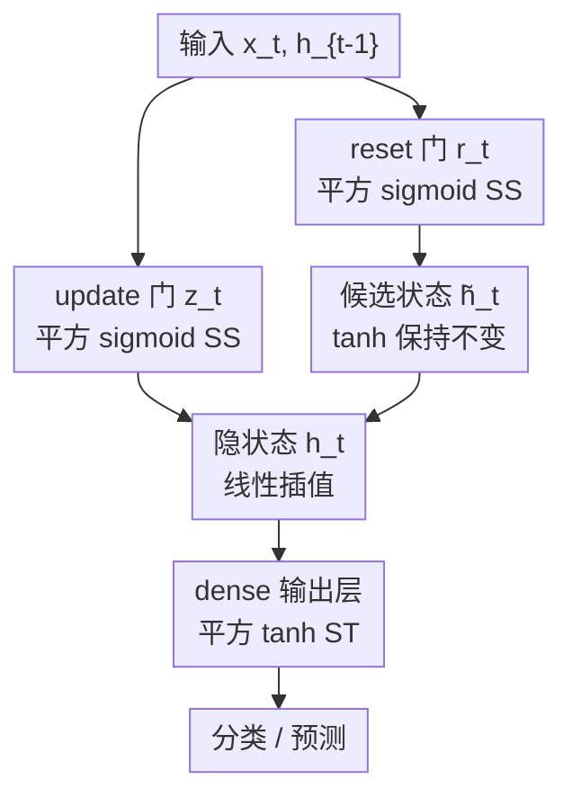

# Contrast-Enhanced Gating in GRUs for Robust Low-Data Sequence Learning

**会议**: CVPR 2026  
**arXiv**: [2402.09034](https://arxiv.org/abs/2402.09034)  
**代码**: 无  
**领域**: 视频理解 / 序列学习 / RNN  
**关键词**: GRU, 门控激活, 平方非线性, 低数据, 时序建模

## 一句话总结
把 GRU 门控里的 sigmoid 和输出 dense 层的 tanh 各自"平方"一下（squared sigmoid-tanh, SST），用一个零参数、几乎零开销的改动拉大门控的"开/关"对比度，在手语识别、步态/活动识别、时序预测这些小数据任务上稳定超过原版 GRU。

## 研究背景与动机

**领域现状**：在手语识别、可穿戴传感器活动识别、时序预测这类**数据量小、要部署在资源受限设备**的场景里，GRU 仍然是首选——它比 LSTM 参数少、训练稳、推理快，比 Transformer 更不容易在小数据上过参数化。GRU 的核心是 reset 门 $r_t$ 和 update 门 $z_t$（都用 sigmoid），加上候选状态 $\widetilde{h}_t$（用 tanh）。

**现有痛点**：标准 sigmoid/tanh 都是**饱和型**非线性。在小数据、稀疏模式（informative 帧/信号出现稀少）的条件下，sigmoid 输出常常挤在 $[0,1]$ 的中段，导致门控的"开"（接近 1）和"关"（接近 0）两种状态**区分度不够**——门半开半关，既没把无关信息滤干净，也没把关键信息保留住，梯度对细微时序变化也不敏感，最终下游精度受限。

**核心矛盾**：要提升小数据下的门控选择性，常规路子是**加容量**（更深/更宽/换 Transformer）或**引入可学习激活**（如 APL、PReLU），但这些都会**增加参数和计算**，与"小数据 + 资源受限"的部署诉求相冲突。作者通过对印度手语 ISL 数据做 PCA 可视化，确认特征空间里存在稀疏区域、细微时序差异被普通门控吃不下。

**本文目标**：在**完全不改 GRU 结构、不加任何参数**的前提下，单独改善门控非线性的"对比度"，让门更果断地开关。

**核心 idea**：用"平方"这个最简单、平滑、无参数的变换增强对比度——$0.9^2{=}0.81$ 几乎不掉，而 $0.1^2{=}0.01$ 被进一步压扁，于是大值更大、小值更小，门控的开/关被拉开。把它叫做 squared sigmoid-tanh (SST)。

## 方法详解

### 整体框架
SST 不是一个新网络，而是一组**激活函数替换规则**，作为 drop-in 模块插进现成 GRU。核心判断是"在哪些位置该锐化、在哪些位置不能动"：reset 门 $r_t$ 和 update 门 $z_t$ 的 sigmoid 换成**平方 sigmoid (SS)**，输出端 dense 层的 tanh 换成**平方 tanh (ST)**；而 GRU 内部候选状态 $\widetilde{h}_t$ 的 tanh **保持不变**——因为锐化它会让 $\widetilde{h}_t$ 难以随时间平滑更新。整套替换零新增参数，前向只多一次乘法，几乎零开销。

### 关键设计

**1. 平方 sigmoid（SS）：把半开半关的门拉成果断开关**

针对的痛点是 sigmoid 输出在小数据下挤在中段、门控开/关分不开。SS 直接把 sigmoid 平方：$SS(x){=}\big(SF(x)\big)^2$，其中 $SF(x){=}\frac{1}{1+e^{-x}}$。由于 $SF\in[0,1]$，平方后仍落在 $[0,1]$，但曲线被"拉伸"——高概率值近乎保持（$0.9^2{=}0.81$），低概率值被进一步抑制（$0.1^2{=}0.01$），从而拉大强弱激活之间的对比度，让 $r_t$、$z_t$ 更果断地决定"保留还是遗忘"。作者还证明了 SS 满足激活函数该有的全部性质：有界（$[0,1]$）、连续、可微，且其导数 $SS'(x){=}2\big(SF(x)\big)^2\big(1{-}SF(x)\big)$ 在曲线中段曲率更大，意味着对输入小扰动更敏感、能映射更复杂的稀疏模式

**2. 平方 tanh（ST）：分段保号的平方，给输出层加非线性又不丢方向**

输出端 dense 层若直接平方 tanh 会把负值变正、丢掉符号信息。ST 用分段定义解决：
$$ST(x)=\begin{cases}-(TF(x))^2 & x<0\\ (TF(x))^2 & x\geqslant 0\end{cases},\quad TF(x)=\frac{e^x-e^{-x}}{e^x+e^{-x}}$$
即对负输入"平方后再取负"，从而保持原 tanh 的符号、整体仍有界于 $[-1,1]$，只是曲线在原点附近多了一个"窄腰"、离原点越远非线性越强。作者同样验证了 ST 的有界、非线性（不满足可加性）、连续（$x{\to}0$ 左右极限都为 0）和可微（除 $x{=}0$ 是 corner point 外处处可导）。之所以输出层选 ST 而不用 ReLU，是为了避免负输入区的"零梯度"问题、保留平滑梯度过渡，作者实测 ST 在 dense 层的测试精度优于 ReLU

**3. 选择性放置：只锐化门控与输出，刻意放过候选状态**

SST 的精髓不止"平方"，更在"在哪平方"。reset/update 门负责信息的筛选与遗忘，锐化它们能直接提升选择性和对噪声的鲁棒性（$z_t$ 决定保留多少 $h_{t-1}$，$r_t$ 决定捕捉多复杂的模式）；输出层用 ST 增强表达。但**候选状态 $\widetilde{h}_t$ 的 tanh 被刻意保留**——它承载的是当前要写入记忆的内容，若也平方会让其随时间的更新变得困难、破坏长程信息的平滑演化。这种"该锐化的锐化、该平滑的保平滑"的位置分工，是 SST 既能提对比度又不破坏训练稳定性的关键

### 损失函数 / 训练策略
SST 不引入任何新损失或正则项，训练目标随任务而定（分类用交叉熵、预测用 MSE）。所有对比实验严格固定相同架构、相同超参，唯一变量就是门控/输出层的激活函数，以隔离"对比度增强"本身的效果。

## 实验关键数据

覆盖四类小数据时序任务：手语识别、步态分类、人体活动识别（HAR）、金价预测。所有任务都人为引入稀疏（如 20% 值置零）以模拟真实传感器缺失。

### 主实验

**步态分类（加速度计，244 受试者，20% 稀疏）**

| 模型 | Test Acc | Precision | Recall | F1 | AUC |
|------|----------|-----------|--------|------|------|
| GRU | 79.8% | 78.9% | 77.8% | 78.3% | 0.86 |
| GRU-SST | **84.3%** | **87.7%** | 77.4% | **82.2%** | **0.92** |

**人体活动识别（WISDM / UCI-HAR，20% 稀疏）**

| 模型 | 数据集 | 训练 Acc | 测试 Acc |
|------|--------|---------|---------|
| GRU | WISDM | 99.5 | 97.08 |
| GRU-SST | WISDM | 100 | **99.28** |
| GRU | UCI-HAR | 99 | 93.08 |
| GRU-SST | UCI-HAR | 100 | **98.30** |

**金价时序预测（Yahoo Finance, 2000–2026, MSE）**

| 模型 | 训练 Loss | 验证 Loss | 测试 Loss |
|------|-----------|-----------|-----------|
| GRU | 0.70 | 0.08 | 0.28 |
| GRU-SST | **0.54** | **0.06** | **0.08** |

手语识别（13 类 ISL，每类 30 段视频）上 MOPGRU-SST 测试精度 100% vs 基线 95%；t-SNE 显示 SST 的隐层/dense 层聚类分离更清晰。作者诚实标注：此数据集样本极少、特征空间相对结构化，100% 应解读为"受控低数据基准上的可分性提升"，而非普适优越性。

### 消融 / 分析

| 配置 | 关键指标 | 说明 |
|------|---------|------|
| GRU（sigmoid/tanh） | 多任务基线 | 标准门控，对比度不足 |
| GRU-SST（全套） | 各任务一致提升 | reset/update 用 SS、dense 用 ST、候选 tanh 不变 |
| dense 层用 ReLU（替代 ST） | 测试精度更低 | 负输入零梯度，ST 平滑梯度更优 |

### 关键发现
- **数据越少、提升越大**：UCI-HAR（仅 1 万样本）测试精度从 93.08% → 98.30%（+5.2%），增益明显大于样本百万级的 WISDM（+2.2%），印证 SST 是为稀疏/小数据量身定做。
- **AUC 提升说明判别力实打实增强**：步态任务 AUC 0.86 → 0.92，不是单纯调高某个阈值下的准确率，而是整体类间可分性变好。
- **位置选择是必要的**：dense 层若用 ReLU 反而不如 ST；候选状态若也平方会破坏更新——验证"选择性放置"不是可有可无。

## 亮点与洞察
- **零参数 + 零额外结构**：整套方法就是"在三个特定位置把激活平方一下"，前向只多一次乘法，却能稳定涨点——这种"几乎免费的午餐"对资源受限部署极有吸引力，也容易复现。
- **"在哪锐化"比"怎么锐化"更值得琢磨**：作者没有无脑全平方，而是区分了门控（该果断）和候选记忆（该平滑），这个洞察可迁移到 LSTM 的各种门、甚至 attention 的 gating。
- **平方作为最小对比度增强算子**：相比可学习激活（加参数）或 $\text{sigmoid}(x)^p$（要调 $p$），平方是平滑、无参、保持优化稳定的最小选择——把"增强对比度"这件事做到了极简。
- **诚实标注过拟合风险**：作者主动指出 100%/近 100% 训练精度在这些成熟基准上可能是强拟合，强调应看测试精度——这种自省在小数据论文里难得。

## 局限与展望
- **作者承认的局限**：评测局限于 GRU 管线和低数据基准；未与 LSTM、hard-sigmoid、参数化激活、轻量 Transformer / 状态空间模型做横向对比；锐化会进一步压扁极小激活，对**超长序列或极弱信号**可能反而有害。
- **自己发现的局限**：① 多数数据集"近 100%"已接近饱和，难以区分 SST 与基线的真实差距，缺少多次重复实验的方差报告；② 每个任务沿用了不同来源的训练配置（[14]/[24]/[32]/[33]），不是统一协议，公平性略打折扣；③ 缺少对"平方"与其他锐化算子（如 $\text{sigmoid}^p$、温度缩放）的直接消融对比，"为什么偏偏是平方最好"主要靠定性论证。
- **改进思路**：在大规模/长序列数据上验证对比度增强是否仍成立；把 SST 推广到 LSTM 各门并系统消融"放置位置 × 锐化强度"；引入可调温度让锐化强度随训练自适应，缓解极弱信号被过度抑制。

## 相关工作与启发
- **vs 可学习激活（APL / PReLU / Swish）**：它们靠**引入可学习参数**增强表达，多在前馈网络验证；SST 不加任何参数、直击 RNN 门控的时序信用分配问题，更契合小数据。
- **vs 高效循环单元（QRNN / SRU）**：它们改的是**cell 结构/并行化**来提速；SST 完全不动结构，只换激活，正交且可叠加。
- **vs 轻量 Transformer / 状态空间模型**：它们追求在长序列上兼顾精度与效率；SST 站在"小数据下 GRU 仍有性价比"的立场，作为补充而非替代，且承认在长序列上未必占优。

## 评分
- 新颖性: ⭐⭐⭐ 想法简单到几乎"显然"，但"选择性放置 + 分段保号平方"的工程洞察有价值
- 实验充分度: ⭐⭐⭐ 覆盖四类任务、有表格有可视化，但缺统一协议、方差报告和锐化算子横向消融
- 写作质量: ⭐⭐⭐⭐ 数学性质证明完整、对过拟合风险主动标注，诚实自洽
- 价值: ⭐⭐⭐⭐ 零成本、易复现、对资源受限的小数据时序部署很实用

<!-- RELATED:START -->

## 相关论文

- [\[CVPR 2026\] LAOF: Robust Latent Action Learning with Optical Flow Constraints](laof_robust_latent_action_learning_with_optical_flow_constraints.md)
- [\[CVPR 2026\] From Contrast to Consistency: Rethinking Event-based Continuous-Time Optical Flow Estimation](from_contrast_to_consistency_rethinking_event-based_continuous-time_optical_flow.md)
- [\[CVPR 2026\] Towards Data-Efficient Video Pre-training with Frozen Image Foundation Models](towards_data-efficient_video_pre-training_with_frozen_image_foundation_models.md)
- [\[CVPR 2026\] Unified Spatiotemporal Token Compression for Video-LLMs at Ultra-Low Retention](unified_spatiotemporal_token_compression_for_video-llms_at_ultra-low_retention.md)
- [\[CVPR 2026\] Robust Promptable Video Object Segmentation](robust_promptable_video_object_segmentation.md)

<!-- RELATED:END -->
