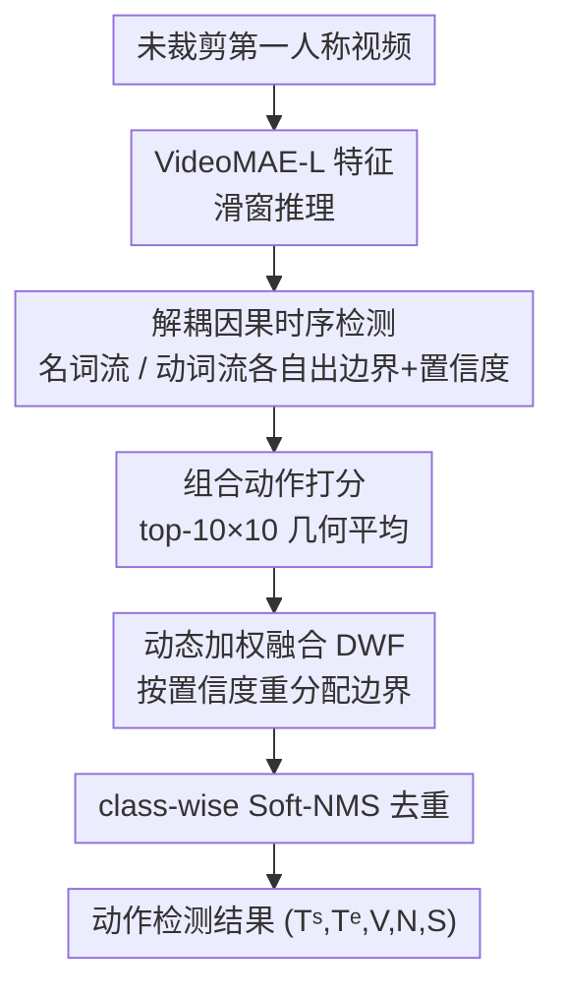

# EgoAction: Egocentric Action Composition with Reliability-Aware Temporal Fusion for the EPIC-KITCHENS Action Detection Challenge at CVPR 2026

**会议**: CVPR 2026 (EPIC-KITCHENS Action Detection Challenge 技术报告)  
**arXiv**: [2605.24496](https://arxiv.org/abs/2605.24496)  
**代码**: 无（基于 OpenTAD 实现）  
**领域**: 视频理解 / 时序动作检测 / 第一人称视频  
**关键词**: 第一人称动作检测、名词-动词解耦、可靠性感知融合、边界后处理、EPIC-KITCHENS

## 一句话总结
针对 EPIC-KITCHENS-100 动作检测赛道，把"名词流"和"动词流"两条因子级时序检测器解耦到最后一步，再用一个无需训练的 **Dynamic Weighted Fusion (DWF)** 规则——按两条流的分类置信度给各自预测的时间边界加权——替换原来固定的算术平均，在官方榜单拿到 25.94 的 action 平均 mAP（第 3 名）。

## 研究背景与动机

**领域现状**：EPIC-KITCHENS-100 动作检测要求在未裁剪的长第一人称厨房视频里，既定位每个交互动作的起止时间，又给出 `(动词, 名词)` 的组合标签（97 个动词 × 300 个名词），官方指标是 tIoU 阈值 $\{0.1,0.2,0.3,0.4,0.5\}$ 上的平均 mAP。主流强检测器（OpenTAD / CausalTAD 系）用因果时序建模 + anchor-free 头做特征级检测。

**现有痛点**：这个任务的难点不在"识别"，而在**时序定位与组合语义的耦合**——边界对了名词错了算错，名词动词都对但边界偏了在高 tIoU 下同样被罚。作者把困难拆成三点：（C1）第一人称镜头抖动 + 交互相位短，导致 proposal 边界轻微漂移；（C2）两条流会**以不同方式退化**——名词流在物体小/被遮挡/厨房杂物干扰时不确定，动词流在动作细微/时序延迟时不确定；（C3）动作标签由 97×300 组合而成但只有少数常见，需要保留丰富 top-K 候选又不能在 NMS 前组合爆炸。

**核心矛盾**：原来的两流后处理把名词、动词预测的边界做**固定算术平均** $\textbf{b}^{\mathrm{mean}}=\frac12(\textbf{b}^n+\textbf{b}^v)$，这等价于假设两条流定位可靠性相同；可一旦某条流退化，平均反而会把本来正确的边界往坏的那条流拽，放大定位误差。

**本文目标**：在保留名词-动词因子化的前提下，让最终时间边界的"话语权"按当前 proposal 上**哪条流更可靠**来分配，而不是一刀切平均。

**切入角度**：作者观察到对 anchor-free 稠密检测器，"给某个 proposal 打出更尖锐语义后验"的那条流，往往也是局部时序证据更干净的那条流——于是**分类置信度可以当作边界可靠性的廉价先验**。

**核心 idea**：用置信度自适应的加权融合（DWF）替换固定算术平均，只重分配时间边界、不改动作语义打分，几乎零开销地把边界权威转向更可靠的流。

## 方法详解

### 整体框架

EgoAction 是一条"先解耦、后组合"的特征级时序检测流水线。输入是一段未裁剪第一人称视频，先抽 EPIC 微调的 VideoMAE-L 特征，然后**分别**训练名词、动词两个 CausalTAD 风格检测器，各自吐出 proposal 级的分类置信度 + 时间边界；只有在两条流都产出证据之后，才在最后一步组合成动作：用几何平均给 top-K 名词×动词组合打分，用 DWF 按置信度加权融合两条流的边界，最后过 class-wise Soft-NMS 去重。整套设计避免把 97×300 当成一个庞大稀疏的类集去学，并把"最显式的可靠性决策"推迟到后处理。

### 关键设计

**1. 解耦因果时序检测：用两条独立的因子流绕开组合稀疏**

直接把 `(动词, 名词)` 当一个 97×300 的联合类集去检测，类别又多又稀疏（C3），难学。作者沿用 OpenTAD 里的 CausalTAD：对每条流 $R\in\{n,v\}$，特征序列 $\textbf{X}^R\in\mathbb{R}^{T\times C}$（$C{=}1024$）经因果投影（输出维 512）后送进 $L{=}7$ 层特征金字塔（步长 $\{1,2,4,8,16,32,64\}$），anchor-free 头逐点预测类别概率 $\textbf{P}_l^R=\sigma(g_{\mathrm{cls}}^R(\textbf{H}_l^R))$ 和到边界的距离 $\textbf{D}_l^R=\mathrm{ReLU}(g_{\mathrm{reg}}^R(\textbf{H}_l^R))$。名词、动词检测器在 train+val 上**分开训练**，各自只需学一个因子的词表，从而复用更强的因子级预测、把组合留到最后。长视频用最大窗长 4608、50% 重叠的滑窗推理，并显式把特征域边界换算回秒（$\mathrm{sec}(\textbf{b})=\frac{\textbf{b}\delta+W_0+O}{F}$，$\delta{=}8,O{=}4,F{=}30$），防止局部窗被当成独立视频

**2. 组合动作打分：几何平均让动作"既要物体也要动作"都成立才算强**

两条流解耦后要重新拼成动作，但既不能把候选拼爆，也不能让某一因子单方面拉高分数。作者对每个对齐的 proposal $j$ 各保留 top $K_n{=}10$ 名词、top $K_v{=}10$ 动词，组合假设 $(p,q)$ 的得分取**几何平均** $S_{j,p,q}=\sqrt{P_{j,p}^{n}P_{j,q}^{v}}$，动作索引 $A_{p,q}=300q+p$。几何平均比算术平均保守：只有当物体证据和动作证据**同时**支持时分数才高，任一因子弱都会把组合分压下去，从而在保留丰富候选（10×10）的同时天然抑制"一强一弱"的虚假组合，缓解组合稀疏（C3）

**3. 动态加权融合 DWF：按置信度把边界话语权交给更可靠的流**

这是全文核心，直接针对 C1/C2。原后处理对两条流边界做固定平均，在某条流退化时反而把正确边界拖坏。DWF 把"哪条流定位更可信"量化成 proposal 级权重：对 proposal $j$ 先取两条流的最大类别置信度 $C_j^n=\max_p P_{j,p}^n$、$C_j^v=\max_q P_{j,q}^v$，归一化成权重

$$W_j^n=\frac{C_j^n}{C_j^n+C_j^v+\epsilon},\qquad W_j^v=\frac{C_j^v}{C_j^n+C_j^v+\epsilon},\quad \epsilon=10^{-6}$$

再线性插值得到融合边界 $\hat{\textbf{b}}_j=W_j^n\textbf{b}_j^n+W_j^v\textbf{b}_j^v$（起止坐标各做一次）。它**只改时间区间、不动语义分** $S=\sqrt{P^nP^v}$，因此不会把动作分类器偏向名词或动词，只是把边界权威转给当前更可靠的流——名词被遮挡/杂物干扰时置信度掉、边界让位给动词；动作细微/延迟时动词置信度掉、边界让位给名词。整个算子只有两次 reduction、一次归一化、一次向量化线性插值，几乎零开销。作者还给出一个直觉式不等式：当更自信的流期望误差更小（且 margin 大于权重估计噪声）时，$\mathbb{E}[|\hat{\textbf{b}}_j-\textbf{b}_j^\star|]\le\mathbb{E}[|\frac12(\textbf{b}_j^n+\textbf{b}_j^v)-\textbf{b}_j^\star|]$（⚠️ 这是直觉论证而非严格定标定理，以原文为准）

> 作者还实现了一个**跨流可靠性引导**的双流变体（用不确定性门 $\omega_t=1-\text{minmax}(U_t)$ 压制不可靠的辅助流特征，再做 cross-attention 把互补证据注入主流），但它只用于研究因子间交互，**未用于最终提交**——为保持流水线确定、鲁棒，作者把最显式的可靠性决策留给了后处理阶段的 DWF。

### 损失函数 / 训练策略

每条流用标准稠密 TAD 损失 $\mathcal{L}^R=\lambda_{\mathrm{cls}}\mathcal{L}_{\mathrm{focal}}(\textbf{P}^R,\textbf{Y}^R)+\lambda_{\mathrm{reg}}\mathcal{L}_{\mathrm{DIoU}}(\textbf{D}^R,\textbf{B}^R)$（分类用 focal loss、回归用 DIoU loss）。训练用 AdamW（lr $10^{-4}$、weight decay 0.05）、batch size 16、混合精度、EMA、label smoothing、cosine 衰减、5 轮 warm-up、共 50 轮、梯度裁剪 1。后处理 NMS 前最多保留 5000 候选、每视频最多 3000 检测；名词用 Soft-NMS $\sigma{=}0.6$（min score 0.005，voting 0.65），动词/动作用 $\sigma{=}0.4$（min score 0.001，voting 0.75）。

## 实验关键数据

### 主实验（官方 Codabench 榜单，mAP %）

| Rank | 方法 | Verb Avg. | Noun Avg. | Action Avg. | Action@0.5 |
|------|------|-----------|-----------|-------------|------------|
| 1 | KAUST-4Paradigm-MoonshotAI-Nvidia (官方 baseline) | 30.02 | 35.22 | 31.98 | 26.50 |
| 2 | dg_team / deepglint (官方 baseline) | 26.87 | 29.56 | 26.25 | 22.06 |
| **3** | **EgoAction（本文，新提交）** | **28.66** | **28.61** | **25.94** | **20.84** |
| 4 | Oxford+Bristol (官方 baseline) | 27.12 | 29.36 | 24.21 | 18.86 |
| 5 | yy (新提交) | 24.13 | 23.70 | 19.98 | 16.22 |

- EgoAction 在 Action Detection 赛道排名第 3，action 平均 mAP 25.94，仅落后第 2 名 0.31 分、领先第 4 名 1.73 分，且**未用多 seed 集成**。
- 名词、动词均衡（28.66 / 28.61），但 action 比单因子约低 2.7 分——这是组合任务的固有 gap：动作命中要求定位准 + 两个语义因子都对。

### 诊断式组件研究（隐藏测试标签无法做严格单变量消融，故用 val 记录 + 机制描述）

| 组件 | 证据 | 作用 |
|------|------|------|
| 独立名词检测器 | val noun mAP 36.25 | 强物体流 |
| 独立动词检测器 | val verb mAP 32.91 | 强动作流 |
| 硬联合组合 | val action mAP 28.86 | 暴露融合瓶颈 |
| DWF 边界融合 | 式 (16) | 自适应边界权威 |
| top-10×10 组合 | 已实现 | 控制动作稀疏 |
| Soft-NMS voting | 已实现 | 抑制滑窗重复 |

### 关键发现
- **定位精度是主要瓶颈**：action mAP 从 tIoU 0.1 的 29.56 一路掉到 0.5 的 20.84；DWF 正是瞄准中高 tIoU——此时一点边界漂移就能把真阳变假阳。
- **解耦的必要性**：单因子 val mAP（名词 36.25 / 动词 32.91）明显高于联合动作（28.86），说明复用强因子级预测比直接学庞大稀疏的动作词表更划算。
- 主要失败模式：极短交互下两条流可能**同向偏移**（VideoMAE-L 的 snippet 步长把转换离散化了），以及 open/fridge、take/cup 这类高频组合即便视觉名词模糊也能在 top-K 中存活。

## 亮点与洞察
- **"分类置信度 ≈ 定位可靠性"这个廉价先验很巧**：不需要训练定标头，仅用 max 置信度归一化就把边界权威动态分配，零开销、确定性、class-agnostic，特别适合打榜这种要稳的场景。
- **只改边界、不改语义分的解耦很关键**：DWF 把"该信谁的边界"和"动作分多高"两件事分开，避免提分时无意中偏向名词或动词——这是它优于"直接抬高高置信流分数"的地方。
- **几何平均当组合门**：用 $\sqrt{P^nP^v}$ 让动作"双因子都强才强"，是一个可迁移到任意双流/多因子组合任务的保守打分 trick。
- 把可靠性决策从特征级（双流 cross-attention 变体）**主动下沉到后处理**，换取确定性和鲁棒性——这是工程上对"打榜要稳"的清醒取舍。

## 局限与展望
- 作者承认：当前 DWF 只用最大类别置信度，没显式刻画后验熵、时序锐度、名词-动词一致性；高 tIoU 下两流同向偏移它修不了。
- **缺严格消融**：隐藏测试集导致无法做最终提交的单变量消融，DWF 的增益只能靠 val 记录 + 机制论证间接支撑，式 (17) 的不等式也只是直觉论证而非证明。
- 这是一份**赛道技术报告**而非通用方法论文，核心贡献（DWF）是后处理小算子，依赖现成 VideoMAE-L 特征和 OpenTAD/CausalTAD 框架，独立贡献相对轻量。
- 改进方向：把标量置信度换成更丰富的可靠性向量（熵 / 时序锐度 / 因子一致性），或用一个学习式定标头从两个后验向量 + 区间分歧 $|\textbf{b}^n-\textbf{b}^v|$ 预测权重（作者为避免过拟合 val 标签、保持确定性而没在最终提交里用）。

## 相关工作与启发
- **vs CausalTAD**：CausalTAD 用 InternVideo2 特征 + 因果时序建模做强 TAD；本文沿用其因果检测骨架，但在 2026 赛道受限于 EPIC 微调的 VideoMAE-L 特征，把单检测器拆成名词/动词两条解耦流，并补上一个 DWF 后处理来修两流融合的失败模式。
- **vs 固定算术平均两流融合**：传统两流后处理对名词、动词边界做等权平均，隐含"两流可靠性相同"假设；DWF 用置信度归一化权重做加权插值，在某流退化时把边界权威转给可靠流，这是本文最核心的改进点。
- **vs 联合 (verb,noun) 检测器**：联合检测要学 97×300 的稀疏动作词表；本文坚持因子化 + 几何平均组合，复用更强的单因子预测，绕开组合爆炸与稀疏。

## 评分
- 新颖性: ⭐⭐⭐⭐ DWF 思路直观有效（置信度当边界可靠性先验），但本质是个轻量后处理算子，骨架沿用现成框架
- 实验充分度: ⭐⭐⭐ 受隐藏测试集限制只有榜单名次 + val 诊断记录，无法做严格单变量消融
- 写作质量: ⭐⭐⭐⭐⭐ 把三个 challenge（C1/C2/C3）与设计一一对应，动机—机制—公式衔接清晰
- 价值: ⭐⭐⭐⭐ 对第一人称组合动作检测的两流融合是个即插即用、零开销的实用 trick，打榜拿到第 3

<!-- RELATED:START -->

## 相关论文

- [\[CVPR 2026\] TempRet: Temporal Enhancement and Two-Stage Reranking for CVPR 2026 EPIC-KITCHENS-100 Multi-Instance Retrieval Challenge](tempret_temporal_enhancement_and_two-stage_reranking_for_cvpr_2026_epic-kitchens.md)
- [\[CVPR 2026\] EgoAdapt: A Multi-Scene Egocentric Adaptation Method for CVPR 2026 HD-EPIC VQA Challenge](egoadapt_a_multi-scene_egocentric_adaptation_method_for_cvpr_2026_hd-epic_vqa_ch.md)
- [\[CVPR 2026\] SoccerNet 2026 Player-Centric Ball-Action Spotting：对 FOOTPASS 基线的重训练与后处理扩展](soccernet_2026_player-centric_ball-action_spottingretraining_and_post-processing.md)
- [\[CVPR 2026\] Decompose and Transfer: CoT-Prompting Enhanced Alignment for Open-Vocabulary Temporal Action Detection](decompose_and_transfer_cot-prompting_enhanced_alignment_for_open-vocabulary_temp.md)
- [\[CVPR 2026\] Hand Trajectory Fusion for Egocentric Natural Language Query Grounding](hand_trajectory_fusion_for_egocentric_natural_language_query_grounding.md)

<!-- RELATED:END -->
