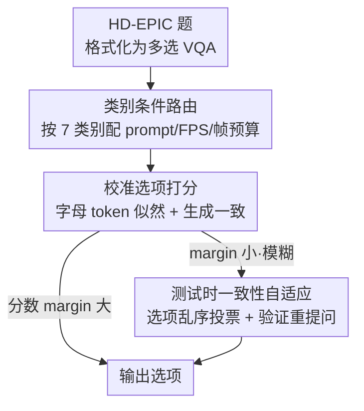

# EgoAdapt: A Multi-Scene Egocentric Adaptation Method for CVPR 2026 HD-EPIC VQA Challenge

**会议**: CVPR 2026 (HD-EPIC VQA Challenge 技术报告)  
**arXiv**: [2605.24500](https://arxiv.org/abs/2605.24500)  
**代码**: 无  
**领域**: 第一人称视频理解 / 多模态VLM / 视频问答  
**关键词**: 第一人称视频, HD-EPIC, 视频VQA, 推理时自适应, 选项打分

## 一句话总结
针对 HD-EPIC 第一人称厨房视频 VQA 挑战赛，EgoAdapt 在**不训练、冻结 Qwen3-VL-8B** 的前提下，靠三件推理时套件——按问题类别路由采样配置、用字母 token 似然给每个选项打分、对模糊样本做一致性自适应——把整体准确率从前 SOTA 的 44.21% 拉到 67.22%。

## 研究背景与动机
**领域现状**：第一人称（egocentric）视频理解早已不满足于识别孤立动作，而要把手-物交互、场景几何、物体状态变化和人的意图串在长、未裁剪的录像里推理。HD-EPIC 正是为此设计的精细 benchmark：2.6 万道多选题，覆盖菜谱、配料、营养、细粒度动作、3D 感知、物体运动、注视共 7 个宏类别。

**现有痛点**：作者发现挑战赛的真正瓶颈**不只是模型容量**，而是「一套通用推理配方」和「benchmark 在时间/空间/语义上异质结构」之间的失配。具体三点：(1) **时间尺度差异巨大**——细粒度动作可能只依赖不到 1 秒的操作，而菜谱/物体运动题要跨好几分钟甚至多段视频保留上下文；(2) **很多题带显式时空线索**，要求模型把语言对齐到具体视觉证据，而非靠全局视频语义瞎答；(3) **7 个宏类别的推理结构根本不同**——营养题要常识比较配料随时间的变化，3D 感知题要空间 grounding，菜谱题要把观察到的流程匹配到隐含的烹饪计划。

**核心矛盾**：单一 prompt + 固定采样策略，会被迫在**时间覆盖广度**和**时间分辨率**之间做一个对所有题都不合适的折中。

**本文目标**：在冻结 backbone、纯推理时调整的约束下，让模型对每道题拿到「最匹配该题所需证据」的时间分辨率、视觉覆盖和语义框架。

**核心 idea**：把问题当成**对齐问题**——按类别路由配置、对每个候选答案显式打分、仅在打分显示模糊时才触发一致性检查。EgoAdapt 即 Egocentric Adaptation via **C**ategory, **C**alibration, **C**onsistency。

## 方法详解

### 整体框架
EgoAdapt 不是一个 prompt 模板，而是一套**问题感知的推理框架**：把多选决策拆成三个可控阶段——选对视频证据、把候选答案变成可比的模型分数、对不确定的决策做一致性稳定化。对每道 HD-EPIC 题，先把原始实例格式化成多选 prompt，再选一条类别专属推理路由（决定 system prompt、采样 FPS、帧预算），然后给所有选项打分，最后当分数分布模糊时才做一致性自适应。backbone 接口始终是统一的多选接口，变的只是「该看视频的哪一片、看多少」。

### 关键设计

**1. 类别条件路由：让每道题拿到匹配的时间分辨率与覆盖**

针对「单一配置被迫在覆盖广度和分辨率间折中」的痛点。EgoAdapt 把 7 个宏类别按「主导证据类型」分组，每条路由控制三件事：system prompt、采样 FPS、最大帧预算 $N_c$。给定一段长度 $T$ 的视频，在类别帧预算下均匀采样：$t_j = t_{\mathrm{start}} + \frac{j-1}{N-1}(t_{\mathrm{end}} - t_{\mathrm{start}})$，其中 $N \le N_c$。菜谱、配料、营养、3D 感知、物体运动这些**长上下文类别**给更大帧预算，让模型在几分钟内保住事件顺序；细粒度动作、注视这些**短窗类别**则在更小窗口内用更高有效时间密度。作者把帧预算明确当成「证据分配」问题：长上下文题里漏掉一个关键事件就答不出，所以优先广覆盖；短窗题里判别信号局部且转瞬即逝，所以在短窗内加密。

路由还顺手解决了**时间标签对齐**：HD-EPIC 有些选项本身是视频里的时间引用（单时间戳或区间，用 `<TIME>` 标签编码）。模型实际看到的是降采样后的视频，所以每个 `<TIME>` 都要重映射到模型真正观测到的时间坐标：$t' = \frac{t_{\mathrm{raw}} - t_{\mathrm{input\_start}}}{D} + o_k$，其中 $D$ 是类别专属时间除子、$o_k$ 是多视频拼接偏移。这保证答案文本里的时间标签直接对齐模型可见的帧索引。注意路由只改 system prompt 的**语义指令**（菜谱强调步骤定位、营养强调碳水/脂肪/蛋白/卡路里比较、注视区分当前注视与未来交互预测等），prompt 格式和下游打分接口保持完全一致

**2. 校准选项打分：用似然代替直接生成字母，暴露完整不确定度**

针对「直接让模型吐字母在多选视频 QA 里很脆」的痛点——模型可能输出不受约束的短语、夹带额外解释、或在选项顺序微调下就改答案。EgoAdapt 改用 score-then-select：读模型在选项字母上的 next-token 分布，选校准分最高的。对以 `Correct:` 结尾的 prompt $P_i$，选项 $k$ 的基础分是其字母 token $\ell_k$ 在首个生成位置的对数概率 $s_{i,k} = \log p_\theta(\ell_k \mid \mathcal{F}_i, P_i)$。一次前向就拿到所有选项分数，且因为同一 prompt、同一视觉输入，分数直接可比——这对 HD-EPIC 特别有用，因为很多选项语义相近（两个时间区间落在同一菜谱阶段、两个物体位置视觉相邻、两个注视目标在画面同一区域），只看生成文本会把有用的不确定度藏起来。

同时跑一遍短的自由生成，把生成答案 $\hat{z}$ 解析成选项索引 $\hat{k}$。最终分数把似然和生成一致性合起来：$\tilde{s}_{i,k} = s_{i,k} + \beta\,\mathbf{1}[k = \hat{k}]$，$\beta$ 是小的一致性奖励。这样既保住似然选择的鲁棒性，又用直接生成当弱确认信号；若自由生成解析不出合法选项，就退回纯似然分数，**冗长或非法生成不会变成非法提交**。这里的 top-2 分数 margin 后面被一致性模块用来决定是否要追加推理

**3. 测试时一致性自适应：仅对模糊样本追加检查**

针对「路由+打分后仍有残余模糊」的痛点（视觉相似的菜谱步骤、只差一小段时间区间的物体运动选项、几个候选物体都靠近视野中心的注视题）。这些题 top-2 分数 gap 很小，EgoAdapt 就用这个 gap 当触发器，避免在清晰题上浪费算力。两个机制：

**选项乱序投票**——对触发的题，用不同随机顺序 $\pi_m$ 重跑 $M$ 次推理，每次得到乱序下的预测 $\hat{y}^{(m)}$，映射回原索引后多数投票：$\hat{y} = \operatorname{argmax}_k \sum_{m=1}^{M} \mathbf{1}[\pi_m^{-1}(\hat{y}^{(m)}) = k]$（实现里 $M=5$）。它检验模型的证据是绑在**答案内容**还是**呈现位置**上——稳定预测能扛过乱序，位置偏置的预测则容易翻，专治多选 benchmark 里「选项位置变成意外捷径」。**验证重提问**——对营养、物体运动这类能用紧凑辅助问题概括证据的类别，额外发一个简化验证 prompt（如「加了哪个配料」「某物体有没有换位置」），保守地当作主多选预测的额外一致性检查，而非替代它

## 实验关键数据

### 主实验
backbone 为 Qwen3-VL-8B，权重**全程冻结**，所有增益都来自推理 pipeline；单节点 8×A100。HD-EPIC 全 benchmark 准确率对比（%）：

| 方法 | 菜谱 | 配料 | 营养 | 细粒度 | 3D感知 | 物体运动 | 注视 | 总体 |
|------|------|------|------|--------|--------|----------|------|------|
| VideoLLaMA 2 † | 30.75 | 25.67 | 32.67 | 27.24 | 25.74 | 28.50 | 21.20 | 27.39 |
| LongVA † | 29.62 | 30.83 | 33.67 | 30.68 | 32.91 | 22.73 | 24.50 | 29.28 |
| LLaVA-Video † | 36.25 | 33.50 | 38.67 | 43.02 | 27.31 | 18.93 | 29.30 | 32.43 |
| Gemini Pro † | 60.50 | 46.17 | 34.67 | 39.63 | 32.51 | 20.83 | 28.65 | 37.57 |
| HelloWorld | 64.75 | 43.33 | 37.00 | 42.03 | 40.88 | 29.90 | 32.95 | 41.55 |
| DeepFrames | 64.62 | 54.67 | 38.00 | 48.30 | 42.59 | 30.17 | 31.15 | 44.21 |
| **EgoAdapt** | **88.00** | **68.17** | **71.67** | **64.03** | **64.87** | **61.63** | **52.15** | **67.22** |

> † 为原 HD-EPIC 挑战赛公布结果。EgoAdapt 总体 67.22%，比前最佳 DeepFrames 高 **+23.01 个百分点**，且 7 个类别**全部领先**，说明增益不是靠过拟合某一题型。最大绝对涨幅都落在需要结构化时空推理的类别：营养 38.00→71.67、物体运动 30.17→61.63、3D 感知 42.59→64.87、菜谱 64.62→88.00。

### 消融实验
Table 2 隔离一致性自适应（TTA）的贡献——w/o TTA 保留同样的 backbone、类别路由、选项打分接口，只关掉乱序投票和验证检查（%）：

| 配置 | 菜谱 | 配料 | 营养 | 细粒度 | 3D感知 | 物体运动 | 注视 | 总体 |
|------|------|------|------|--------|--------|----------|------|------|
| w/o TTA | 79.83 | 67.83 | 61.33 | 56.06 | 41.39 | 46.73 | 47.55 | 57.18 |
| **EgoAdapt** | 88.00 | 68.17 | 71.67 | 64.03 | 64.87 | 61.63 | 52.15 | **67.22** |

### 关键发现
- **TTA 是大头但不是全部**：去掉 TTA 总体从 67.22% 掉到 57.18%（−10.04 点），但 57.18% 已远超前 SOTA 44.21%——说明「类别路由 + 校准打分」本身就贡献了主要增益，TTA 在分数接近时锦上添花。
- **TTA 增益高度类别相关**：3D 感知 +23.48、物体运动 +14.90、营养 +10.34、菜谱 +8.17、细粒度 +7.97，都是选项视觉/时间接近、容易模糊的类别；配料几乎不动（+0.34），说明多数配料题在第一遍校准打分就定了。
- **注视最难**：即便有 TTA 也只 52.15%（+4.60），因为视觉信号往往很微弱、正确目标常和干扰物挤在第一人称视野中心附近。

## 亮点与洞察
- **把「benchmark 异质性」当对齐问题而非容量问题**：作者的核心判断是瓶颈在「通用配方 vs 异质结构」的失配，于是不碰权重、纯推理时按类别分配证据，这个视角对所有多类别 benchmark 都可迁移。
- **score-then-select 比 generate-a-letter 稳得多**：读字母 token 似然让所有选项在同一前向、同一视觉输入下可比，自然暴露出 top-2 margin 当置信度信号，又顺手解决了 VLM 爱夹带解释导致解析失败的老问题——这个 trick 几乎任何多选 VLM 评测都能用。
- **用分数 margin 当 TTA 触发器**：清晰题一遍过、模糊题才追加乱序投票/验证，把算力花在刀刃上，比无脑对所有题做 self-consistency 高效。
- **乱序投票治选项位置捷径**：检验「证据绑内容还是绑位置」，专门压制因呈现顺序而被选中的答案，是多选 benchmark 一个很实用的去偏手段。

## 局限与展望
- **本质是挑战赛工程报告**：三个组件都是已知技巧（类别 prompt、似然打分、self-consistency 投票）的针对性组合，方法论新颖性有限，作者也定位为「为异质 egocentric benchmark 提供实践指引」。
- **强依赖类别标签**：路由建立在 HD-EPIC 已给出的 7 个宏类别上，真实开放场景里题目类别未知时如何自动路由，文中没讨论。
- **超参细节缺失**：每个类别的具体帧预算 $N_c$、采样 FPS、时间除子 $D$、一致性奖励 $\beta$、触发 TTA 的 margin 阈值都没给数值，复现需要自己调。
- **注视仍是短板**：52.15% 远低于其他类别，第一人称微弱注视信号的建模没被这套推理时套件根本解决。
- **只在单一 backbone 验证**：仅 Qwen3-VL-8B 一个 backbone，换更小/更大模型增益是否一致未知。

## 相关工作与启发
- **vs 直接生成字母的多选 VLM 评测基线**：它们让模型直接吐答案字母，易受冗长生成和选项顺序扰动；EgoAdapt 改成对所有选项读似然打分，鲁棒且暴露完整不确定度。
- **vs 通用 self-consistency / 多次采样投票**：通用做法对所有题无差别重复采样；EgoAdapt 用校准分 margin 当触发器，只对模糊题做乱序投票，并加了针对性的验证重提问，更省算力也更对症。
- **vs 固定采样的视频 LLM（VideoLLaMA 2 / LongVA / LLaVA-Video）**：它们用统一采样配置，被迫在时间覆盖和分辨率间折中；EgoAdapt 按类别分配帧预算，让长上下文题广覆盖、短窗题高密度。

## 评分
- 新颖性: ⭐⭐⭐ 视角（异质性=对齐问题）清晰，但三组件均为已知技巧的组合，定位为挑战赛方案。
- 实验充分度: ⭐⭐⭐ 全 benchmark 对比 + TTA 消融到位，但缺关键超参、缺路由/打分单独消融、仅单 backbone。
- 写作质量: ⭐⭐⭐⭐ 动机推导清楚，公式与设计一一对应，技术报告写得很工整。
- 价值: ⭐⭐⭐⭐ +23 点的实打实涨幅 + 可直接复用的推理时套件，对做 egocentric/多选 VLM 评测的人很实用。

<!-- RELATED:START -->

## 相关论文

- [\[CVPR 2026\] TempRet: Temporal Enhancement and Two-Stage Reranking for CVPR 2026 EPIC-KITCHENS-100 Multi-Instance Retrieval Challenge](tempret_temporal_enhancement_and_two-stage_reranking_for_cvpr_2026_epic-kitchens.md)
- [\[CVPR 2026\] EgoAction: Egocentric Action Composition with Reliability-Aware Temporal Fusion for the EPIC-KITCHENS Action Detection Challenge at CVPR 2026](egoaction_egocentric_action_composition_with_reliability-aware_temporal_fusion_f.md)
- [\[CVPR 2026\] OmniEgo-R2: A Routed Reasoning Framework for the 1st Cross-Domain EgoCross Challenge](omniego-r2_a_routed_reasoning_framework_for_the_1st_cross-domain_egocross_challe.md)
- [\[CVPR 2026\] Hand Trajectory Fusion for Egocentric Natural Language Query Grounding](hand_trajectory_fusion_for_egocentric_natural_language_query_grounding.md)
- [\[CVPR 2026\] Mistake Attribution: Fine-Grained Mistake Understanding in Egocentric Videos](mistake_attribution_fine-grained_mistake_understanding_in_egocentric_videos.md)

<!-- RELATED:END -->
