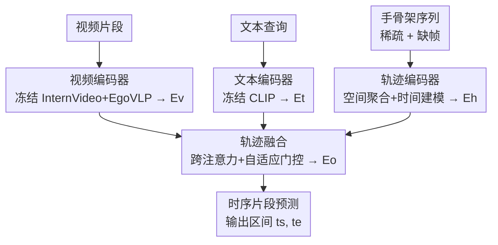

# Hand Trajectory Fusion for Egocentric Natural Language Query Grounding

**会议**: CVPR 2026  
**arXiv**: [2606.02962](https://arxiv.org/abs/2606.02962)  
**代码**: 无（未公开）  
**领域**: 视频理解 / 第一人称视觉 / 多模态时序定位  
**关键词**: 第一人称视频、NLQ时序定位、手部轨迹、跨注意力融合、自适应门控

## 一句话总结
针对第一人称视频自然语言查询（NLQ）定位任务，本文提出把稀疏的手部骨架序列编码成"运动学特征"，再用跨注意力 + 自适应门控注入到冻结的视频-文本主干里，在 Ego4D NLQ v2 上对"手物交互"和"数量/状态"这两类与操作密切相关的查询分别带来 +2.54 和 +4.32 的 R1@0.3 提升。

## 研究背景与动机
**领域现状**：第一人称视频自然语言查询（NLQ）定位要解决的是：给定一段长第一人称视频和一句自由文本查询（如"我把红螺丝刀放哪了？"），模型要预测出查询所指事件发生的时间区间 $[t_s, t_e]$。当前 SOTA（如 GroundNLQ）的主流套路是：用大规模预训练视频编码器（InternVideo、EgoVLP）提视频特征，再和 CLIP 文本特征做融合，本质上是"语义外观匹配"。

**现有痛点**：纯外观匹配对很多查询其实不够。作者统计发现，Ego4D 的 13 类查询模板里有 5 类（"我把 X 放哪了"、"我往 X 里放了什么"、"我对 X 做了什么动作"、"X 处于什么状态"、"我的物体 X 在哪"）的答案窗口本质上就是一次"手-物操作动作或其直接结果"——这类**操作中心查询（manipulation-centric queries）**在 train+val 中占 7,529/18,315，约 41%。换句话说，近一半查询的答案就发生在"伸手、抓取、放置"这种手部动作的瞬间，但现有方法完全没用手部信息。

**核心矛盾**：手部信号虽然有用，却**极其稀疏**。Mediapipe 这类手骨架提取器每只手能给 21 个关键点，但在 Ego4D 上平均只有 41% 的帧能检测到手（其余因为长时间空闲、运动模糊、手出画面而缺失）。相比之下，注视（gaze）是每帧一个稠密标量、物体检测是每帧若干框，而手部轨迹充满时间空洞，这让轨迹编码和与视频-文本的融合都变得棘手。

**本文目标**：把手部轨迹作为一种新的辅助模态引入 NLQ 定位，并解决其"稀疏性"带来的编码和融合难题。

**切入角度**：操作事件的语义来自"静态手型如何随时间变化"——靠近、接触、释放，这正是时序上最有判别力的瞬间。因此作者把手部建模拆成"空间聚合（看一帧内的手型）+ 时间建模（看手型怎么演变）"两个阶段，并显式屏蔽掉没检测到手的帧。

**核心 idea**：用一个轻量轨迹编码器把稀疏手骨架转成视频对齐的运动学特征，再用"跨注意力 + 内容自适应门控"把它选择性地注入冻结的视频-文本表征，让轨迹信号只在该出力时出力。

## 方法详解

### 整体框架
整个系统冻结预训练主干、只训练两个新模块，把"手部运动学"作为外挂模态接进 NLQ 定位流水线。输入是第一人称视频片段 + 文本查询 + 手骨架序列，输出是答案时间区间 $[t_s, t_e]$。共 5 个模块：**视频编码器**用冻结的 InternVideo + EgoVLP 把视频编成视频 token $\mathbf{E_v}$；**文本编码器**用冻结的 CLIP 把查询编成文本 token $\mathbf{E_t}$；可训练的**轨迹编码器**把手骨架序列转成视频对齐的运动学特征 $\mathbf{E_h}$；可训练的**轨迹融合**模块通过跨注意力 + 自适应门控把 $\mathbf{E_h}$ 和 $\mathbf{E_t}$ 注入 $\mathbf{E_v}$，得到多模态表征 $\mathbf{E_o}$；最后**时序片段预测头**从 $\mathbf{E_o}$ 预测答案区间。两个可训练模块（轨迹编码器 + 轨迹融合）合计参数极少，主干全程冻结。

### 关键设计

**1. 轨迹编码器：把稀疏手骨架拆成"空间聚合 + 时间建模"两阶段、并显式屏蔽缺帧**

痛点是手骨架既稀疏又结构复杂——每帧最多 $L = 2 \times 21 = 42$ 个关键点（左右手各 21），还有大量帧根本没检测到手。作者用一个时空 transformer 把问题分解：**空间阶段**先把一帧内的关键点聚成一个描述子，**时间阶段**再看这个描述子怎么跨帧演变，这正对应操作事件"靠近-接触-释放"的语义结构。具体地，每个关键点的原始通道 $\mathbf{r}_{t,\ell} = (x,y,z,v)$（3D 位置 + 可见性）经过**逐关键点**的可学习投影编成 token：$\mathbf{x}_{t,\ell} = \mathbf{W}_{r,\ell}\,\mathbf{r}_{t,\ell} + \mathbf{p}_\ell$，其中 $\mathbf{W}_{r,\ell}$ 对每个"(手,关节)"对单独学一套投影，$\mathbf{p}_\ell$ 是位置编码。空间聚合用一个共享可学习 query $\mathbf{q}$ 对该帧 $L$ 个关键点做跨注意力 $\mathbf{s}_t = \mathrm{CrossAttn}(\mathbf{Q}{=}\mathbf{q}, \mathbf{K}{=}\mathbf{V}{=}\{\mathbf{x}_{t,\ell}\})$，让模型自动挑出最有信息量的关节（如抓取时的指尖），而不是用固定的池化规则。时间阶段把 $\{\mathbf{s}_t\}$ 过自注意力再线性投影得 $\mathbf{E}_h = \mathrm{Proj}(\mathrm{SelfAttn}(\{\mathbf{s}_t\}))$。关键是两个阶段都用 key-padding mask 把没检测到手的帧排除掉，避免空洞污染注意力——这是直接针对 41% 检出率这个痛点设计的

**2. 轨迹融合：用视频 token 去 query 辅助模态、并给每条支路配独立的内容自适应门控**

痛点是融合时既要保住预测头依赖的"视频-文本对齐"，又要让模型自己学"该多大程度信任轨迹支路"（毕竟一半帧没手）。作者让视频 token $\mathbf{E_v}$ 作为 query 去分别查询轨迹流和文本流：$\mathbf{E_{vh}} = \mathrm{CrossAttn}(\mathbf{E_v}, \mathbf{E_h})$，$\mathbf{E_{vt}} = \mathrm{CrossAttn}(\mathbf{E_v}, \mathbf{E_t})$，得到两路视频对齐的增强表征。融合时不是均匀相加，而是各乘一个**学习的标量门控**再做残差：每个门由一个轻量 MLP 作用于该支路跨注意力输出的时间平均得到，$g_h = \sigma(\mathrm{MLP}_h(\bar{\mathbf{e}}_{vh}))$、$g_t = \sigma(\mathrm{MLP}_t(\bar{\mathbf{e}}_{vt}))$，最终

$$\mathbf{E_v}' = \mathbf{E_v} + g_h \cdot \mathbf{E_{vh}} + g_t \cdot \mathbf{E_{vt}}$$

由于每个门只读自己那条支路，网络可以独立地压低某一支——比如当手大多没检测到、$\mathbf{E_{vh}}$ 几乎没信号时，把 $g_h$ 调小而不影响文本支路。之后再过一个标准自注意力块做精炼 $\mathbf{E_o} = \mathbf{E_v}' + f_{\text{self}}(\mathbf{E_v}')$。整个融合块堆叠两次，输出送进预测头。门控机制是这篇论文应对"模态可靠性随片段内容剧烈波动"的核心手段

### 损失函数 / 训练策略
轨迹编码器仅 195K 参数（占全模型 0.6%），从零开始与轨迹融合模块联合训练，主干保持冻结。优化器用 AdamW（学习率 $5\times10^{-5}$、余弦衰减、2 个 warmup epoch），对新引入的模块用 $2\times$ 更高的学习率。

## 实验关键数据

数据集为 Ego4D NLQ v2（13,435 训练 / 4,552 验证 query-clip 对），训练用训练集、报告用验证集。指标是标准 R$m$@IoU=$n$：top-$m$ 预测里至少一个与真值 IoU $\geq n$ 的查询占比，$n$ 取 0.3 和 0.5。

### 主实验（分类别 R1）

为验证"手部运动学有助于动作中心定位"，作者在与操作中心查询最接近的两个类别上报告分类别 R1：手物交互（HOI，$N{=}1928$）与数量/状态（Quantity/State，$N{=}718$）。

| 类别 | $N$ | R1@0.3 GroundNLQ | R1@0.3 本文 | Δ | R1@0.5 GroundNLQ | R1@0.5 本文 | Δ |
|------|-----|------|------|------|------|------|------|
| HOI | 1928 | 28.99 | 31.54 | +2.54 | 19.97 | 21.73 | +1.76 |
| Quantity/State | 718 | 24.93 | 29.25 | +4.32 | 16.85 | 21.17 | +4.32 |
| Overall | 4552 | 25.77 | 26.54 | +0.77 | 17.11 | 18.50 | +1.39 |

收益恰好集中在这两个操作相关类别，且在 HOI 内部进一步集中在动作模板上（"我对 X 做了什么动作？" +4.00；"我往 X 里放了什么？" +4.58），印证轨迹主要帮助定位"动作何时发生"。

### 整体对比

| 模型 | R1@0.3 | R1@0.5 | R5@0.3 |
|------|--------|--------|--------|
| GroundNLQ（基线，本地复现，无轨迹支路） | 25.77 | 17.11 | 51.87 |
| 本文（轨迹融合） | 26.54 | 18.50 | 52.37 |

整体上 R1@0.5 提升 +1.39，几乎是 R1@0.3（+0.77）提升的两倍——说明手部运动学不仅帮助召回相关时段，更能在操作瞬间**收紧定位精度**。

### 关键发现
- 收益与先验吻合：在覆盖约 41% 验证集的两类操作中心查询上提升最大（HOI +2.54、Quantity/State +4.32 R1@0.3），而整体提升较温和，说明轨迹信号是"对症下药"而非全面增益。
- 高 IoU 阈值收益更大（R1@0.5 提升约为 R1@0.3 的两倍），暗示手部运动学的主要价值在于**精确定位接触瞬间**，而非粗略召回。
- 极轻量：仅 195K 新参数（全模型 0.6%）、主干冻结，就能换来分类别两位数百分点级别的相对提升。

## 亮点与洞察
- **用统计驱动动机**：先量化"41% 的查询答案发生在手物操作瞬间、5/13 模板属操作中心"，再针对性引入手部模态——动机不是拍脑袋，而是数据里挖出来的，这种"先证明缺口存在再补"的写法很有说服力。
- **针对稀疏性的两个互补设计**：编码端用 key-padding mask 屏蔽缺帧、融合端用内容自适应门控压低无信号支路，从"特征生成"和"特征使用"两头同时对抗 41% 检出率这个核心障碍，思路干净。
- **门控的可解释性**：每个门只读自己支路的时间平均，使得"手没检测到时自动调小手支路权重"成为网络可学习的行为，而非硬编码规则——这种"让模型自己判断模态何时可信"的设计可迁移到任何"辅助模态质量不稳定"的多模态融合场景（如带噪 gaze、漏检物体框）。
- **不动主干的外挂式范式**：冻结大主干、只训轻量适配模块，使方法天然兼容未来更强的视频-文本主干，工程上很友好。

## 局限与展望
- **检出稀疏是天花板**：作者承认手只在 41% 的帧可见，这从根本上限制了轨迹支路的贡献上限；第一人称手检测一旦改进，定位应能直接受益。
- **整体提升有限**：Overall R1@0.3 仅 +0.77，收益高度依赖查询类别，对非操作类查询基本无帮助——这是"补特定缺口"方法的固有边界。
- **缺与其他辅助模态的横向对比**：论文只和无轨迹的 GroundNLQ 基线比，没有和 GazeNLQ / ObjectNLQ / OSGNet 这些同样引入辅助模态的工作直接同台比较，因此"手部 vs 注视 vs 物体"哪个更值得加、能否叠加，尚不清楚（作者提到融合模块模态无关、可自然扩展到 gaze，但未实测）。
- **未公开代码**，复现门槛较高。

## 相关工作与启发
- **vs GroundNLQ**：GroundNLQ 用预训练视频编码器 + CLIP 文本做纯语义外观匹配；本文在其上外挂手部轨迹支路，区别在于显式引入运动学线索，优势是操作中心查询定位更准，劣势是对非操作查询几无增益。
- **vs GazeNLQ**：GazeNLQ 给视频-文本加预测的注视信息、用残差跨注意力融合；本文换成手部轨迹这一更直接反映"操作动作"的模态，且因手部稀疏而额外引入缺帧屏蔽 + 自适应门控（注视是稠密标量、无此问题）。
- **vs ObjectNLQ / OSGNet**：ObjectNLQ 加物体检测支路强调查询相关物体，OSGNet 再加一条建模相机/头部运动的镜头支路作为佩戴者注意力代理；三者都是"注入辅助空间信号"的同一动机，本文是首个把**手部轨迹**作为辅助模态用于 NLQ 定位的工作，填补了这一空白。
- **启发**：手部先验在手物接触检测、动作预测、运动学预训练等相邻第一人称任务里早已成熟，本文证明它同样能迁移到时序语言定位；"统计量化缺口 → 轻量外挂模态 → 门控控制可信度"这套组合拳，可复制到其他"主干已强但忽略某种结构化辅助信号"的任务。

## 评分
- 新颖性: ⭐⭐⭐⭐ 首个把手部轨迹引入 NLQ 定位，动机由数据统计支撑，切入点清晰但单一模态扩展
- 实验充分度: ⭐⭐⭐ 在 Ego4D NLQ v2 上验证了核心假设并给出分类别消融，但只和单一基线比、缺与其他辅助模态横向对比
- 写作质量: ⭐⭐⭐⭐ 动机-方法-实验逻辑闭环，公式与符号清晰，统计支撑到位
- 价值: ⭐⭐⭐⭐ 极轻量（0.6% 参数、冻结主干）、模态无关可扩展，对操作中心查询有明确实用价值

<!-- RELATED:START -->

## 相关论文

- [\[CVPR 2026\] Mamba-VMR: Multimodal Query Augmentation via Generated Videos for Precise Temporal Grounding](mamba-vmr_multimodal_query_augmentation_via_generated_videos_for_precise_tempora.md)
- [\[ECCV 2024\] Benchmarks and Challenges in Pose Estimation for Egocentric Hand Interactions with Objects](../../ECCV2024/video_understanding/benchmarks_and_challenges_in_pose_estimation_for_egocentric_hand_interactions_wi.md)
- [\[CVPR 2026\] Mistake Attribution: Fine-Grained Mistake Understanding in Egocentric Videos](mistake_attribution_fine-grained_mistake_understanding_in_egocentric_videos.md)
- [\[CVPR 2026\] EgoAction: Egocentric Action Composition with Reliability-Aware Temporal Fusion for the EPIC-KITCHENS Action Detection Challenge at CVPR 2026](egoaction_egocentric_action_composition_with_reliability-aware_temporal_fusion_f.md)
- [\[CVPR 2026\] Polyphony: Diffusion-based Dual-Hand Action Segmentation with Alternating Vision Transformer and Semantic Conditioning](polyphony_diffusion-based_dual-hand_action_segmentation_with_alternating_vision_.md)

<!-- RELATED:END -->
