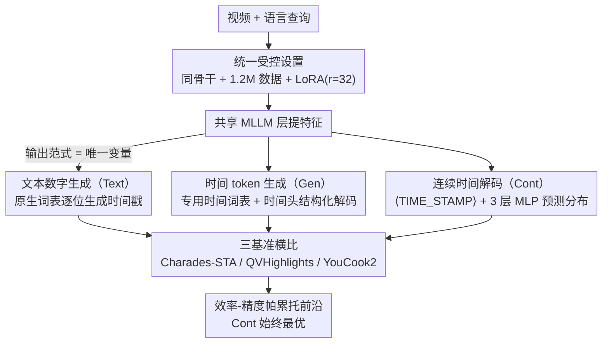

# How Should Video LLMs Output Time? An Analysis of Efficient Temporal Grounding Paradigms

**会议**: CVPR 2026  
**arXiv**: [2604.08966](https://arxiv.org/abs/2604.08966)  
**代码**: [https://tg-paradigms.github.io/](https://tg-paradigms.github.io/)  
**领域**: 视频理解  
**关键词**: 视频时序定位, 多模态大语言模型, 时间输出范式, 效率分析, 紧凑模型

## 一句话总结

本文在统一框架下对比了视频时序定位的三种主流时间输出范式（文本数字生成、时间token生成、连续时间解码），发现连续分布范式在效率-精度帕累托前沿上始终表现最优。

## 研究背景与动机

**领域现状**：视频时序定位（VTG）是连接语言查询与视频时间片段的核心任务。多模态大语言模型（MLLM）已成为该任务的主流骨干，但各种方法在时间输出设计上分歧巨大——有的直接生成文本时间戳，有的引入专用时间token，有的通过连续解码预测时间分布。

**现有痛点**：每种范式都使用自己的骨干、数据集和训练协议，导致无法将性能差异归因于输出设计本身。此外，随着VTG系统向资源受限的边缘设备部署，缺乏系统性的效率-精度权衡分析。

**核心矛盾**：输出范式的选择对定位精度和计算成本的影响尚不明确，特别是在紧凑模型（0.5B-8B）上。

**本文目标**：在相同骨干、数据和训练协议下公平对比三种范式的精度和效率。

**切入角度**：选择SmolVLM2（0.5B/2.2B）、FastVLM（1.5B）和Molmo2（4B/8B）作为紧凑骨干，确保唯一变量是输出范式。

**核心idea**：连续分布范式在帕累托前沿上实现了最优的效率-精度权衡，具有最低的延迟开销和鲁棒的定位精度。

## 方法详解

### 整体框架

这篇论文不发明新方法，而是想回答一个被长期混淆的问题：视频时序定位（VTG）里，让 MLLM「把时间说出来」到底有几种写法、哪种最划算？过去每篇工作都换了骨干、换了数据、换了训练协议，于是没人能说清精度差异究竟来自输出设计还是别的因素。本文把三种代表性的时间输出范式——文本数字生成（Text，VTimeLLM 风格）、时间 token 生成（Gen，TRACE 风格）、连续时间解码（Cont，DisTime 风格）——剥离出来：先用同一批紧凑骨干（SmolVLM2 0.5B/2.2B、FastVLM 1.5B、Molmo2 4B/8B）经共享 MLLM 层提特征，再在此之后分叉成三种不同的时间输出头；除输出范式外，骨干、1.2M 训练数据、LoRA 协议全部固定，最后放到 Charades-STA、QVHighlights、YouCook2 三个基准上横比。这样唯一变量就只剩「时间怎么输出」，差异才能干净地归因到输出范式本身。

### 关键设计

**1. 文本数字生成（Text）：把时间当普通文字写出来**

最朴素的做法是不碰架构，直接让模型把时间边界当自然语言数字吐出来，套进一个模板里，比如「from 52.0 to 63.0 seconds」，再用标准的下一 token 预测损失 $\mathcal{L}_{text} = -\sum_j \log P(w_j \mid w_{<j}, I, F)$ 训练。好处是零改动、完全复用 LLM 原生词表；代价是时间语义和通用数字 token 纠缠在一起——「63」这个数字既要表达秒数又要表达普通整数，时间的连续性被打散成离散字符，而且数值要逐位自回归生成，精度和速度都受牵连。

**2. 时间 token 生成（Gen）：给时间单开一套词表**

Text 的痛点是时间和语言挤在同一个表示空间，Gen 的思路就是把它们拆开：沿用 TRACE 的因果事件建模，把视频拆成一串事件 $e_k=(t_k, s_k, c_k)$，每个事件带时间戳、显著性分数和文字描述，并为时间专门配一个独立 tokenizer（13 个字符级 token），用任务特定的交叉熵损失训练。这样时间坐标有了自己的表示空间，不再被自然语言污染，还能顺带保留「事件 + 显著性」这种结构化信息——这也是它在 QVHighlights 这类需要同时输出时间和显著性 mAP 的任务上有独特优势的原因。代价是引入了额外的 encoder-decoder 对，推理走结构化解码，开销居中。

**3. 连续时间解码（Cont）：把定位变成预测一条分布**

前两种范式都把时间当成「要生成的离散符号」，Cont 则换了个视角——时间本身是连续量，边界标注又天然主观（同一个动作不同标注者会标出不同起止点），那不如直接预测一条概率分布。具体做法是加一个可学习的 ⟨TIME_STAMP⟩ token，把它的隐状态喂给一个轻量 MLP（仅 3 层），把连续时间空间离散成 $reg_{max}+1$ 个 bin 并输出每个 bin 的概率，最终时间取这些 bin 的加权期望：

$$\hat{t}_s = \sum_i e_{st}^{(i)} \cdot a_i$$

这一步是单步解码、没有自回归累积，所以延迟最低；用分布的期望而非硬数字，又自然吸收了边界标注的歧义；而额外参数只是一个 3 层 MLP，开销几乎可以忽略。这三点叠加起来，正是它在效率-精度帕累托前沿上始终领先的根本原因。

### 损失函数 / 训练策略

三种范式共享同一套 LoRA 微调协议（r=32）和同一份 1.2M 训练数据，只在监督信号上各按自己的输出形式选择：Text 用标准语言建模损失，Gen 用任务特定交叉熵，Cont 用 1D-IoU 回归损失加分布焦点损失（distribution focal loss）。

## 实验关键数据

### 主实验

| 基准/范式 | 指标 | Text | Gen | Cont |
|--------|------|------|------|------|
| Charades-STA (SmolVLM2-2.2B) | R1@0.5 | 中等 | 较高 | 最高 |
| QVHighlights (SmolVLM2-2.2B) | R1@0.5 | 中等 | 较高 | 最高 |
| YouCook2 (SmolVLM2-2.2B) | CIDEr | 最高 | 较高 | - |

### 消融实验

| 配置 | 推理延迟 | 参数开销 | 说明 |
|------|---------|------|------|
| Text范式 | 高（自回归） | 无额外 | 多步生成增加延迟 |
| Gen范式 | 中（结构化解码） | 中等 | 额外encoder-decoder对 |
| Cont范式 | 最低 | 最小（3层MLP） | 单步解码，无自回归 |

### 关键发现

- 连续分布范式在大多数骨干和任务组合上实现最优精度-效率权衡
- Text范式受限于自回归生成，推理延迟显著高于其他范式
- Gen范式在需要同时输出时间和显著性分数的任务上有独特优势（如QVHighlights的mAP指标）
- 输出范式的选择对紧凑模型的影响被放大，强调了在资源受限场景下选择正确范式的重要性

## 亮点与洞察

- **首次公平的跨范式对比**：通过严格控制除输出范式外的所有变量，首次隔离了输出设计对VTG性能的因果影响
- **紧凑模型的放大效应**：在小模型上架构选择的影响更为显著，为边缘部署提供了关键的设计指导
- **连续分布范式的效率优势**：单步解码避免了自回归的累积延迟，参数开销仅为3层MLP，且自然处理边界歧义

## 局限与展望

- 仅评估了0.5B-8B的紧凑模型，未包含7B+的大规模骨干
- 训练数据格式化不可避免地存在范式特异性，可能引入微妙的偏差
- 未探索范式组合或混合策略的可能性

## 相关工作与启发

- **vs TRACE**: 本文在统一框架下复现了TRACE的因果事件建模，证明其结构化解码在某些任务上有优势但效率偏低
- **vs DisTime**: 分布解码范式在效率和精度上的双重优势得到了跨骨干的验证

## 评分

- 新颖性: ⭐⭐⭐ 实证研究为主，方法设计沿用已有工作
- 实验充分度: ⭐⭐⭐⭐⭐ 5个骨干×3种范式×3个基准，非常全面
- 写作质量: ⭐⭐⭐⭐ 结构清晰，实验设计严谨
- 价值: ⭐⭐⭐⭐ 为VTG系统设计提供了客观的经验指导

<!-- RELATED:START -->

## 相关论文

- [\[CVPR 2026\] SlotVTG: Object-Centric Adapter for Generalizable Video Temporal Grounding](slotvtg_object-centric_adapter_for_generalizable_video_temporal_grounding.md)
- [\[CVPR 2026\] CVA: Context-aware Video-text Alignment for Video Temporal Grounding](cva_context-aware_video-text_alignment_for_video_temporal_grounding.md)
- [\[ICCV 2025\] Sparse-Dense Side-Tuner for Efficient Video Temporal Grounding](../../ICCV2025/video_understanding/sparse-dense_side-tuner_for_efficient_video_temporal_grounding.md)
- [\[CVPR 2026\] HieraMamba: Video Temporal Grounding via Hierarchical Anchor-Mamba Pooling](hieramamba_video_temporal_grounding_via_hierarchical_anchor-mamba_pooling.md)
- [\[CVPR 2026\] Cluster-Wise Spatio-Temporal Masking for Efficient Video-Language Pretraining](cluster-wise_spatio-temporal_masking_for_efficient_video-language_pretraining.md)

<!-- RELATED:END -->
