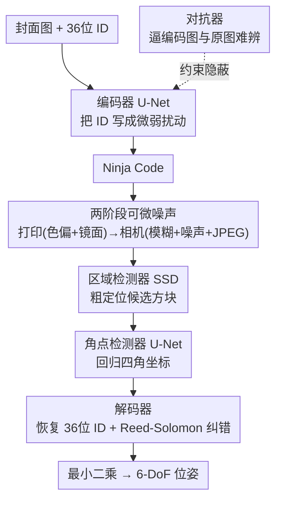

# Ninja Codes: Neurally Generated Fiducial Markers for Stealthy 6-DoF Tracking

**会议**: CVPR 2026  
**arXiv**: [2510.18976](https://arxiv.org/abs/2510.18976)  
**代码**: [https://sento.net/research/ninjacodes](https://sento.net/research/ninjacodes)  
**领域**: 视频理解  
**关键词**: 基准标记, 6-DoF追踪, 深度隐写术, 隐蔽标记, 神经网络编码

## 一句话总结
Ninja Codes 利用深度隐写术技术，通过端到端训练的编码器将任意图像转化为视觉上不显眼的基准标记，可用标准打印机打印并用RGB相机检测，实现隐蔽的6-DoF位置追踪。

## 研究背景与动机
1. **领域现状**：传统基准标记（ArUco、AprilTag等）因低成本、易部署和鲁棒性能被广泛使用，但其醒目的外观限制了在美学敏感场所的应用。
2. **现有痛点**：传统基准标记的黑白网格外观使其不适合家居、展览等需要美观的场景，限制了室内定位和AR技术在日常生活中的普及。
3. **核心矛盾**：标记需要足够明显以便检测，但又需要足够隐蔽以融入环境——这是一个看似矛盾的需求。
4. **本文目标**：创建能自然融入各种真实环境纹理的隐蔽基准标记，同时保持可靠的6-DoF追踪能力。
5. **切入角度**：借鉴深度隐写术（将信息隐藏在图像中而不被人眼察觉）的思路，将标记生成视为信息编码问题。
6. **核心idea**：端到端训练编码器、解码器、区域检测器、角点检测器和对抗网络，通过微妙的视觉修改将36位ID嵌入环境纹理图像中。

## 方法详解

### 整体框架
Ninja Codes 要解决的核心矛盾是：标记得足够「显眼」让相机可靠检测，又得足够「隐蔽」融进环境纹理。论文把它转化成一个深度隐写问题——给定一张任意封面图，编码器把 36 位 ID 以人眼几乎察觉不到的微弱扰动写进去，生成一张看起来还是原图、实际却携带可解码 ID 的标记。整套系统由五个网络串成一条端到端可训练的链路：编码器把封面图（cover image）+ ID 变成 Ninja Code，经过模拟「打印→相机拍摄」的两段噪声后，区域检测器先粗定位标记所在的方块，角点检测器再精确定位四个角，解码器最后从中恢复 36 位 ID；对抗器则在训练中盯着编码图与原图的视觉差异，逼编码器把扰动藏得更深。

### 关键设计

**1. 编码器：把 ID 藏进封面图，而不是另画一个码**

传统标记之所以扎眼，是因为它本身就是一张黑白网格——和环境毫无关系。Ninja Codes 反过来，让标记长得就是那张封面图本身。具体做法是先把 36 位 ID 经一次线性变换扩展成与封面图同尺寸的 tensor，再和 RGB 封面图沿通道拼成 6 通道输入，喂给一个 U-Net 输出编码后的图像。选 U-Net 是因为它的多尺度跳连能在保持全局视觉一致（远看还是原图）的同时，把 ID 信息以局部高频扰动的形式撒进纹理里。编码器并不被允许随意修改图像——对抗损失 $L_a$ 会持续约束编码图与原图的视觉差异最小化，把「能被解码」和「看不出改过」这两个目标同时压在一张图上。

**2. 两阶段可微噪声模拟：在训练里走完整条打印—拍摄链路**

一个标记从生成到被检测，要经历打印到纸面、贴上表面、再被相机拍下这一整条物理链路，每一环都会扭曲它的颜色和纹理；如果训练时不模拟这些扰动，学出来的码一打印一拍就废。论文把这条链路拆成两段噪声依次施加：打印噪声模拟颜色偏移和纸面镜面反射，相机噪声模拟颜色偏移、高斯模糊、高斯噪声和 JPEG 压缩。关键在于这些噪声函数全部设计成可微的，因而梯度能穿过整条「编码→打印→拍摄→解码」链路反传回编码器，让它在训练中就学会生成对这些扰动天然鲁棒的码，而不是事后再补救。

**3. 检测-解码三级流水线：让隐写图不只能解码，还能被「找到并定位」**

这是 Ninja Codes 区别于 HiDDeN、StegaStamp 等纯深度隐写工作的关键一步——后者只解决「编码-解码」，默认你已经把图对齐好喂进解码器；而基准标记必须先在一整帧杂乱场景里把标记找出来、定到角点，才谈得上读 ID 和算位姿。论文为此把检测拆成三级串联：区域检测器（region detector）基于 SSD，输入 300×300、单类别且只用方形 anchor，骨干特意选 VGG 而非更常见的 ResNet 以求更快收敛，先粗扫出可能含标记的方块；角点检测器（corner detector）是 U-Net 接全连接层，在该方块内直接回归四个角点坐标——这里论文没用关键点检测更流行的 heatmap，而用直接回归，因为标记常常部分超出画面，回归在这种情况下更稳；解码器（decoder）是卷积加全连接，从对齐后的图里恢复 36 位 ID，且因为前两级已经做好几何矫正，它不像 StegaStamp 那样还得塞一个 spatial transformer 来吸收形变。三级各司其职，正好对应论文对「检测」（detection）的定义：找到标记 + 拿到角点 + 取回 ID。

**4. 两阶段训练策略：先学会看见，再学会隐身**

如果一上来就把检测损失和隐蔽损失一起优化，目标互相打架、很难收敛。论文把训练切成两段：第一阶段（20 轮）只训练检测相关能力，此时不压视觉差异，编码器会自发生成对比鲜明的彩色条纹标记——先让整套检测器学会稳定地找到并解码标记。第二阶段（60 轮）才引入包括图像损失在内的全部损失，并把图像损失权重 $w_i$ 从 1.0 逐步抬到 100–300，编码器在「必须保持可检测」的前提下被一点点逼着把扰动藏进封面纹理，标记随之越变越隐蔽。$w_i$ 因此成了一个可调的旋钮：调得越高越隐蔽，对应论文里 NC₁₀₀ / NC₂₀₀ / NC₃₀₀ 三档隐蔽度。

### 一个完整示例：一张贴在墙上的码如何被读出来
设一面贴着 NC₂₀₀ 标记的墙被相机拍下。① 区域检测器先在整帧里扫出候选方块，定位标记大致所在的区域；② 角点检测器在该区域内回归四个角点的精确坐标（最终角点误差约 1.06 px），这四个角既用来解码、也直接给出 6-DoF 位姿所需的平面对应关系；③ 解码器读出 36 位消息。由于墙面纹理、光照都引入了噪声，解出的 36 位里可能有个别比特翻转——这时 Reed-Solomon 纠错介入，把 NC₃₀₀ 的丢失率从 11.10% 拉回约 6.00%。这条链路也解释了论文一个关键观察：多数检测失败发生在「消息恢复」这一步，而非前面的「区域定位」，所以纠错码才是提升可靠性的关键一环。

### 损失函数 / 训练策略
总损失为各项加权和 $L = w_i L_i + w_r L_r + w_c L_c + w_k L_k + w_m L_m + w_a L_a$：$L_i$ 是图像损失（像素 MSE + 色度 L1 + LPIPS，控制隐蔽度），$L_r$/$L_c$ 是区域检测的回归与分类损失，$L_k$ 是角点 MSE 损失，$L_m$ 是消息恢复 MSE 损失，$L_a$ 是对抗损失。训练分两阶段（20 + 60 轮），第二阶段中 $w_i$ 从 1.0 渐增至 100–300 以换取递增的隐蔽性。

## 实验关键数据

### 主实验

| 配置 | 角点误差(px) | 丢失率(%) | 说明 |
|------|------------|----------|------|
| NC₁₀₀ | 0.994 | 3.20 | 低隐蔽度 |
| NC₂₀₀ | 1.057 | 7.30 | 中隐蔽度 |
| NC₃₀₀ | 1.145 | 11.10 | 高隐蔽度 |
| ArUco | 0.586 | 0.00 | 传统标记基准 |
| NC₃₀₀+纠错 | - | 6.00 | Reed-Solomon纠错 |

### 消融实验

| 配置 | 关键指标 | 说明 |
|------|---------|------|
| 去除高对比度纹理后 | NC₃₀₀丢失率降至8.15% | 高对比度环境是主要挑战 |
| Fine-tuned检测器 | 与专用检测器接近 | 支持多编码器共用一套检测器 |
| 6-DoF位置误差 | ~2.42cm (NC₂₀₀) | 接近ArUco的2.18cm |

### 关键发现
- 隐蔽性和检测可靠性存在权衡：$w_i$ 越高越隐蔽，但丢失率也越高。
- 多数检测失败源于消息恢复失败而非区域定位失败，Reed-Solomon纠错可有效缓解。
- 高对比度纹理（如瓷砖、草地）是最大挑战，检测失败集中在这类图像。
- 微调后的检测器可处理不同编码器生成的标记，支持场景化定制。

## 亮点与洞察
- **解决了一个长期存在但被忽视的实际问题**：在美学敏感场景中部署基准标记。
- **端到端训练pipeline**的设计使得各模块协同优化，无需手动调整。
- 两阶段噪声模拟的设计非常工程化，分别模拟了打印和拍摄链路的扰动。

## 局限与展望
- 在高对比度纹理上可靠性下降明显。
- 仅在室内常规照明条件下验证，极端光照（如强烈阳光直射）未测试。
- 编码器与检测器紧耦合，不同训练session产生的标记无法互通。
- 未来可探索非平面表面上的应用（借鉴DeepFormableTag）。

## 相关工作与启发
- **vs ArUco/AprilTag**: 传统标记检测精度和可靠性更高，但无法融入环境。Ninja Codes以适度的性能损失换取了隐蔽性。
- **vs HiDDeN/StegaStamp**: 这些深度隐写术工作仅关注编码-解码，本文额外增加了定位能力（区域+角点检测）。

## 评分
- 新颖性: ⭐⭐⭐⭐⭐ 将深度隐写术应用于基准标记生成是全新的跨领域组合
- 实验充分度: ⭐⭐⭐⭐ 数字+打印实物测试，但场景多样性可增加
- 写作质量: ⭐⭐⭐⭐ 方法描述详尽，实验细节充分
- 价值: ⭐⭐⭐⭐ 解决了实际痛点，有明确的应用场景

<!-- RELATED:START -->

## 相关论文

- [\[CVPR 2026\] Mamba-VMR: Multimodal Query Augmentation via Generated Videos for Precise Temporal Grounding](mamba-vmr_multimodal_query_augmentation_via_generated_videos_for_precise_tempora.md)
- [\[CVPR 2026\] Drift-Resilient Temporal Priors for Visual Tracking](drift-resilient_temporal_priors_for_visual_tracking.md)
- [\[CVPR 2026\] Event6D: Event-based Novel Object 6D Pose Tracking](event6d_event-based_novel_object_6d_pose_tracking.md)
- [\[CVPR 2026\] SpikeTrack: A Spike-driven Framework for Efficient Visual Tracking](spiketrack_a_spike-driven_framework_for_efficient_visual_tracking.md)
- [\[CVPR 2026\] FlexHook: Rethinking Two-Stage Referring-by-Tracking in RMOT](rethinking_two-stage_referring-by-tracking_in_referring_multi-object_tracking_ma.md)

<!-- RELATED:END -->
