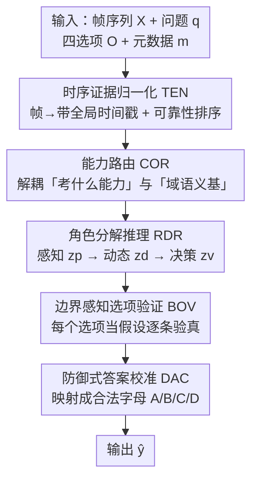

# OmniEgo-R2: A Routed Reasoning Framework for the 1st Cross-Domain EgoCross Challenge

**会议**: CVPR 2026 (EgoVis Workshop, EgoCross Challenge)  
**arXiv**: [2605.24481](https://arxiv.org/abs/2605.24481)  
**代码**: https://github.com/Lee-zixu/OmniEgo-R2 (有)  
**领域**: 视频理解 / 多模态VLM / 第一人称视频推理  
**关键词**: 第一人称视频, 跨域推理, 测试时推理, 能力路由, 选项验证

## 一句话总结
针对横跨手术/工业/极限运动/动物视角四域的 EgoCross 第一人称视频问答挑战赛，本文不训练新模型，而是在官方分域微调的 Qwen3-VL-4B 上套一条由「时序证据归一化→能力路由→角色分解推理→边界感知选项验证→防御式答案校准」五模块串成的**测试时推理流水线**，把异构域统一成同一套「证据—能力—验证」程序，最终在 Source-Limited / Open-Source 两个赛道分别取得 66.35% / 66.77% 总准确率，双榜第二。

## 研究背景与动机
**领域现状**：第一人称（egocentric）视频理解已有专门的 benchmark 和模型，但它和传统第三人称视频识别本质不同——相机绑在行动主体身上，关键证据往往是局部的、不稳定的、依赖动作的：目标物可能只在画面边缘出现，相位变化只靠一次细微的运动过渡编码，甚至大部分采样帧里根本看不到目标。EgoCross 这个新 benchmark 把难度推到极致：横跨手术、工业（ENIGMA）、极限运动（XSports）、动物视角四个域，包含 15 种子任务类型，且任务分布高度异构（手术偏重持握物识别/计数/时序定位，运动偏重动作时序定位/方向预测，动物偏重交互识别）。

**现有痛点**：在这种数据上直接对 MLLM 做端到端 prompting 会暴露三个具体瓶颈——(C1) **时序边界模糊**：很多题问某个相位/交互/运动从何时"开始"，但采样帧稀疏，决定性的过渡恰好发生在两帧之间；(C2) **跨域语义粒度错配**：同一个抽象能力在不同域要用不同的视觉语法实例化——"held object"在手术里是手术器械、在工业里是零部件、在动物视角里是移动目标，"空间定位"在工业里是小物件巡检、在运动里靠身体姿态和地平线变化；(C3) **相近选项下的决策不稳定**：闭集多选题里干扰项语义高度相似（或带"not visible"假设），模型可能推理过程合理却选了无证据支撑的选项，甚至输出格式损坏丢分。

**核心矛盾**：单次多模态查询 $p_\theta(y\mid X,q,O)$ 把"证据定位、时序对齐、域语义、选项比较、输出合法性"五件事**纠缠在一起**，跨域偏移又会放大每一处脆弱。

**本文目标**：把 EgoCross 当作一个**鲁棒的跨域具身视频推理问题**而非简单多选 VQA 来解，且赛制限定只能用官方分域 SFT 的 Qwen3-VL-4B backbone、不能换/再训大模型。

**核心 idea**：把每个域看成插进同一套推理程序的**不同语义基（semantic basis）**——让模型用同一套决策架构去推理手术器械、工业零件、动物交互、运动轨迹，差异只体现在"用哪套域语法去解释证据"，从而把异构域统一成共享的「证据—能力—验证」流水线。

## 方法详解

### 整体框架
OmniEgo-R2（Omnidomain Egocentric Routed Reasoning）是一条建立在官方分域 SFT 的 Qwen3-VL-4B 之上的**测试时推理框架**——注意它不是可微网络，而是用结构化 prompt + 时间戳视觉输入 + 鲁棒输出解析串起来的程序。它把一个异构 EgoCross 样本的预测显式分解为五步复合函数：

$$\hat{y}=\mathcal{C}\circ\mathcal{V}\circ\mathcal{R}\circ\mathcal{G}\circ\mathcal{N}(X,q,O,m)$$

其中输入是帧序列 $X=\{x_i\}_{i=1}^T$、问题 $q$、四选项 $O=\{o_A,o_B,o_C,o_D\}$ 和元数据 $m$（域、采样率等），输出是 $\hat{y}\in\{A,B,C,D\}$。五个算子依次对应五个模块：$\mathcal{N}$ = 时序证据归一化（TEN），把帧变成带全局时间戳、按可靠性排序的证据；$\mathcal{G}$ = 能力路由（COR），把题目落到"考什么能力 + 用哪套域语义基"；$\mathcal{R}$ = 角色分解推理（RDR），把"感知—动态—决策"拆成不同角色；$\mathcal{V}$ = 边界感知选项验证（BOV），逐个选项当假设去验真；$\mathcal{C}$ = 防御式答案校准（DAC），把验证后的决策稳定地落成合法选项字母。一句话串起来：TEN 回答"何时、哪些帧可信"，COR 回答"考什么能力、用哪域语义"，RDR 回答"证据里到底发生了什么"，BOV 回答"哪个选项经得起验证"，DAC 保证"验证后的决策能变成合法提交"。

### 关键设计

**1. 时序证据归一化 TEN：把稀疏帧变成"带全局时间戳 + 可靠性排序"的证据，破 C1**

EgoCross 大量题目用时序语言（某交互"开始"、某运动"改变方向"、哪个动作最接近某时间戳）。如果只把采样帧当成一个有序图像列表喂进去，模型会把**局部帧序**和**全局时间**搞混，尤其长视频分段处理时更严重。TEN 第一步给每帧打全局时间戳，把帧 $x_i$ 变成单元 $\tilde{x}_i=(x_i,\tau_i)$，其中 $\tau_i=\dfrac{i+i_0}{r}$，$i_0$ 是当前段的全局偏移、$r$ 是采样率——这样"第几帧"就被换算成"第几秒"，分段也不会乱。第二步是让模型区分"信息帧"和"第一人称噪声帧"，但作者刻意**不引外部网络算数值帧分数**，而是在观察阶段施加一条可靠性排序准则：当 $\mathrm{Rel}(x_i,q,O)>\mathrm{Rel}(x_j,q,O)$ 且 $\mathrm{Deg}(x_i)<\mathrm{Deg}(x_j)$ 时记 $x_i\succ x_j$，即 $x_i$ 是更强证据。这里 $\mathrm{Rel}$ 是帧对"问题—选项"的相关度、$\mathrm{Deg}$ 是模糊/相机抖动/无关杂物的退化程度。这是一个**测试时由 prompt 诱导的概念性证据排序**，不是真去算神经分数或跑检测器；输出是证据集 $\mathcal{E}=\{(x_i,\tau_i)\}$ 加一条观察规则：稳定帧作主证据，模糊帧只在标记过渡时才保留。

**2. 能力路由 COR：把"考什么能力"和"用哪套域语义"解耦，破 C2**

朴素做法是把数据集名直接拼进 prompt，但这不够——同一能力在不同域有不同视觉含义（手术里时序定位看器械—组织接触，运动里看轨迹变化或身体朝向；工业里计数要守受控分组规则，手术里计数看可见器械或解剖区域）。COR 把样本映射到一个能力 $c$ 和一个域语义基 $\mathcal{B}_d$：$(c,\mathcal{B}_d)=\rho(q,O,m)$，再生成推理协议 $\mathcal{P}=\phi(c,\mathcal{B}_d,q,O)$。能力 $c$ 覆盖识别/计数/空间定位/时序定位/预测/不可见推理六类；语义基 $\mathcal{B}_d$ 指定域专属视觉语法（手术=器械中心、工业=物体—流程中心、运动=物理—具身中心、动物=自我—他者行为中心）。关键巧思（见 Table 1）是路由器**不造四条互不相干的流水线**：它为每个能力定义一个**共享的"证据边界"和"验证规则"**（如时序能力的证据边界是"状态过渡"、验证规则是"最近时间戳"；不可见能力的边界是"全帧覆盖"、规则是"完全缺席"），再把这个边界实例化到正确的语义空间。这就把 TEN 和后续推理桥接起来：帧打好时间戳和可靠性后，COR 决定"什么算相关证据、该检查哪类矛盾"。

**3. 角色分解推理 RDR：把"感知—动态—决策"拆成不同角色，破"过早承诺"**

直接 prompting 要求模型在一次生成里同时观察细节、推断运动、比较选项、产出合法标签，常导致**过早承诺**（early commitment）——还没记够视觉证据就先选了个看似合理的选项。RDR 在样本需要时序或行为重解读时，把推理拆成三个角色串行生成中间文本状态：感知 $z_p=F_\theta(\mathcal{E},q,O;\mathcal{P}_{\mathrm{perc}})$ 记录感知证据，动态 $z_d=F_\theta(\mathcal{E},z_p,q,O;\mathcal{P}_{\mathrm{dyn}})$ 记录时序/行为动态，决策 $z_v=F_\theta(\mathcal{E},z_p,z_d,q,O;\mathcal{P}_{\mathrm{ver}})$ 记录面向选项的决策依据（$F_\theta$ 始终是同一个 Qwen3-VL-4B，backbone 不变）。运动重的样本受益于这种"感知—动态—验证"分解；但对细粒度小物体或受控词表的样本，硬拆反而会"叙事漂移"，于是 RDR 改用一个紧凑的专家验证器 $z_v=F_\theta(\mathcal{E},q,O;\mathcal{P}_{\mathrm{exp}})$ 一步到位。也就是说 RDR **自适应调节推理深度**而不动 backbone——这也解释了消融里它在工业域大涨、在运动域反掉点的 trade-off。

**4. 边界感知选项验证 BOV + 防御式答案校准 DAC：把每个选项当假设验真，再稳成合法字母，破 C3**

多选第一人称 QA 极易被"貌似合理"的干扰项坑：候选可能物体类别对但粒度错、可能接近但不在正确时间边界、可能被某个缺席条件反驳。BOV 把每个选项当成一个假设，问它是否满足 COR 定义、RDR 支撑的证据边界，用一个合取谓词分解验证：

$$\mathcal{V}(o_y)=\mathcal{S}(o_y)\wedge\mathcal{G}(o_y)\wedge\mathcal{T}(o_y)\wedge\neg\mathcal{K}(o_y)$$

其中 $\mathcal{S}$ 是视觉支撑、$\mathcal{G}$ 是语义粒度一致、$\mathcal{T}$ 是时序兼容、$\mathcal{K}$ 是硬矛盾。这些项**不是分类器算的**，而是选项验证 prompt 强制执行的判据（如 not-visible 选项必须全程缺席、时序选项必须对齐"未发生—已发生"边界、next-interaction 选项必须与最终观察轨迹一致）；若多个选项都成立，验证器偏向"直接证据最强、无据假设最少"的那个。DAC 则解决最后一公里：推理对了不等于能提交，答案必须能恢复成合法选项字母。它把语义决策和答案落地分离，让模型输出受约束的预测字段，再用分层恢复规则 $\hat{y}=\Gamma(r)$ 把原始响应 $r$ 确定性地映射进 $\{A,B,C,D\}$——合法结构化输出直接采纳，否则恢复最可靠的孤立选项提及，再不行才回退到一个合法标签。DAC 不改视觉语义、不加新证据，纯粹防"格式噪声"导致的无谓掉分，让预测接口稳定。

### 损失函数 / 训练策略
**没有训练**。OmniEgo-R2 是纯测试时框架，复用官方为 Animal/XSports/Industry/Surgery 四域分别 SFT 的 Qwen3-VL-4B checkpoint，整条 Eq.(1) 不可微。实现细节：帧以带时间戳的图像列表输入；默认视觉预算上限 $360\mathrm{K}$ 像素，工业域小物体推理用更高预算；最大生成长度 2048 token；重复惩罚设 1.05–1.1。

## 实验关键数据

### 主实验
EgoCross CloseQA 闭集赛道，报告四域 + Overall 准确率。Baseline 取自 EgoCross benchmark 原文 Table 2。

| 组别 | 方法 | Animal | XSports | Industry | Surgery | Overall |
|------|------|--------|---------|----------|---------|---------|
| 专有 MLLM | GPT-4.1 | 64.48 | 43.09 | 45.71 | 57.24 | 52.63 |
| 专有 MLLM | Gemini 2.5 Pro | 68.85 | 43.90 | 37.55 | 61.48 | 52.95 |
| 开源 MLLM | Qwen2.5-VL-7B | 53.55 | 41.87 | 37.55 | 46.29 | 44.82 |
| 开源 MLLM | InternVL3-8B | 49.18 | 41.06 | 33.06 | 47.00 | 42.58 |
| 第一人称 MLLM | EgoGPT | 41.53 | 24.80 | 24.49 | 31.80 | 30.66 |
| **本文** | **OmniEgo-R2 (Source-Limited)** | **74.32** | **54.47** | 81.22 | 58.66 | **66.35** |
| **本文** | **OmniEgo-R2 (Open-Source)** | **74.32** | **54.47** | **82.86** | 58.66 | **66.77** |

两赛道均排名第二，且在所比方法中 Overall 最高：比 Gemini 2.5 Pro 高 13.40 / 13.82 分，比 Qwen2.5-VL-7B 高 21.53 / 21.95 分。作者诚实指出，由于用了分域 SFT 的 Qwen3-VL-4B，这部分增益**同时来自域适配和结构化测试时推理**，不是纯 backbone 对比。

### 消融实验
增量消融（从直接 QA baseline 起逐个叠模块），共 957 道挑战题，$\Delta$Overall 是相对 baseline 的绝对提升：

| 配置 | Animal | XSports | Industry | Surgery | Overall | ΔOverall |
|------|--------|---------|----------|---------|---------|----------|
| Baseline（直接 MLLM） | 47.54 | 41.46 | 41.22 | 44.52 | 43.47 | – |
| + TEN | 71.58 | 46.75 | 45.71 | 53.00 | 53.08 | +9.61 |
| + COR & 语义基 | 71.58 | 55.69 | 56.73 | 52.30 | 57.99 | +14.52 |
| + RDR | 72.13 | 49.59 | 61.63 | 53.36 | 58.10 | +14.63 |
| + BOV, DAC & 高分辨率（完整版） | 74.32 | 54.47 | 82.86 | 58.66 | 66.77 | +23.30 |

### 关键发现
- **TEN 单独就给最大的首跳（+9.61%）**：Animal 从 47.54% 暴涨到 71.58%。说明动物视角视频对"时序锚定 + 可靠性感知"的观察极度敏感——关键交互线索往往只短暂出现或贴在画面边缘，先把稀疏帧变成带时间戳的稳定证据单元，再深推理才有意义。
- **COR 带来第二大增益（累计 +14.52%）**：印证"结构化不变性"假设——把异构域归一成共享能力、同时保留域专属视觉语法，显著改善跨域平衡，Industry 45.71%→56.73%、XSports 46.75%→55.69%。
- **RDR 是一把双刃剑**：净增益边际（累计 +14.63%）却藏着内部 trade-off——它像"慢思考"机制把感知和决策解耦，让程序性强的 Industry 涨到 61.63%，却让依赖连续轨迹的快节奏 XSports 从 55.69% 掉到 49.59%，说明显式角色分解对运动密集场景过于刻板。
- **BOV+DAC+高分辨率收尾一击 +23.30%**：Industry 飙到 82.86%、XSports 回升到 54.47%。逐选项假设验证（BOV）+ 自适应分辨率对辨别细微语义粒度错配的干扰项至关重要，DAC 则堵住格式损坏导致的无谓掉分，几个模块高度互补。

## 亮点与洞察
- **"域=语义基"的统一视角很漂亮**：不为每个域写脚本，而是把四个域当成插进同一套「证据—能力—验证」程序的不同语义基，用同一决策架构推理器械/零件/动物/轨迹——这把"跨域"从工程堆砌问题变成了"共享边界 + 域实例化"的结构问题。
- **零训练、纯测试时推理也能拿榜眼**：在不能换 backbone 的赛制约束下，靠 prompt 工程 + 鲁棒解析把 Qwen3-VL-4B 从 43.47% 拉到 66.77%，证明"careful test-time reasoning design"对跨域第一人称 QA 的鲁棒性提升空间巨大。
- **DAC 这种"防御式校准"是被低估的提分点**：闭集挑战里"推理对了但输出格式坏了"会白白丢分，把语义决策和答案落地分离、用分层恢复规则兜底，是任何 LLM 提交类任务都能直接迁移的工程 trick。
- **能力—边界—验证规则的对照表（Table 1）可复用**：把六类能力各自的"证据边界 + 验证规则"列成算子表，本质是一套与域无关的推理协议骨架，迁移到其他多能力 benchmark 时换语义基即可。

## 局限与展望
- **本质是挑战赛技术报告**：方法是测试时 prompt 程序而非可学习模型，TEN 的"可靠性排序"、BOV 的谓词验证都靠 prompt 诱导、无显式计算，泛化性和可复现性依赖具体 prompt 设计，论文也未给 prompt 细节。
- **增益来源不纯**：用了官方分域 SFT checkpoint，主表的提升混合了"域适配"和"测试时推理"两部分，难以剥离出纯推理框架的贡献。
- **消融是"增量叠加"而非"逐个剔除"**：只能看累计增益、看不到去掉单模块的损失，且 RDR 在 XSports 掉点暴露了角色分解对快节奏运动场景的负作用，目前靠"专家验证器"分支硬绕，缺一个自动判断何时该拆角色的机制。
- **只在 EgoCross 四域验证**：是否能推广到更多第一人称域、开放式（OpenQA）而非闭集多选，尚未知。

## 相关工作与启发
- **vs 直接端到端 prompting**：baseline 把证据定位/时序对齐/域语义/选项比较/输出合法性全塞进一次查询，纠缠且脆弱；OmniEgo-R2 把它显式拆成五步复合函数，每步只管一件事，从 43.47% 提到 66.77%。
- **vs 专有大模型（GPT-4.1 / Gemini 2.5 Pro）**：它们靠强 backbone 但无跨域结构化推理，Overall 仅 52~53%；本文用更小的 4B 模型 + 结构化测试时推理反超 13+ 分，说明对 EgoCross 这类异构任务，"怎么推理"比"模型多大"更关键。
- **vs 第一人称专用 MLLM（EgoVLPv2 / EgoGPT）**：这些模型虽专门面向第一人称，但在跨域闭集 QA 上仅 27~31%，远落后于通用 MLLM + 路由推理，提示"第一人称预训练"不等于"跨域鲁棒推理"。

## 评分
- 新颖性: ⭐⭐⭐⭐ "域=语义基插进共享推理程序"的统一视角清晰，五模块各自针对一个具体瓶颈，但属于 prompt 工程组合而非新模型
- 实验充分度: ⭐⭐⭐ 有完整主表 + 增量消融且诚实标注增益来源，但只在单 benchmark、闭集、增量式消融，缺逐模块剔除和 prompt 细节
- 写作质量: ⭐⭐⭐⭐ 三挑战→五模块→复合函数的逻辑链很顺，公式和算子表把测试时程序讲得清楚
- 价值: ⭐⭐⭐⭐ 作为榜眼方案给出了一套可迁移的跨域第一人称推理骨架（尤其 DAC 防御式校准和能力—边界算子表），对做 MLLM 测试时推理和 egocentric QA 的人有直接参考价值

<!-- RELATED:START -->

## 相关论文

- [\[CVPR 2025\] TAMT: Temporal-Aware Model Tuning for Cross-Domain Few-Shot Action Recognition](../../CVPR2025/video_understanding/tamt_temporal-aware_model_tuning_for_cross-domain_few-shot_action_recognition.md)
- [\[CVPR 2026\] EgoAdapt: A Multi-Scene Egocentric Adaptation Method for CVPR 2026 HD-EPIC VQA Challenge](egoadapt_a_multi-scene_egocentric_adaptation_method_for_cvpr_2026_hd-epic_vqa_ch.md)
- [\[CVPR 2026\] TempRet: Temporal Enhancement and Two-Stage Reranking for CVPR 2026 EPIC-KITCHENS-100 Multi-Instance Retrieval Challenge](tempret_temporal_enhancement_and_two-stage_reranking_for_cvpr_2026_epic-kitchens.md)
- [\[NeurIPS 2025\] A Unified Reasoning Framework for Holistic Zero-Shot Video Anomaly Analysis](../../NeurIPS2025/video_understanding/a_unified_reasoning_framework_for_holistic_zeroshot_video_an.md)
- [\[CVPR 2026\] VideoNet: A Large-Scale Dataset for Domain-Specific Action Recognition](videonet_a_large-scale_dataset_for_domain-specific_action_recognition.md)

<!-- RELATED:END -->
