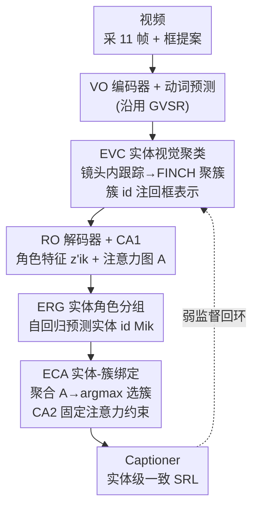

# One Identity, Many Roles: Multimodal Entity Coreference for Enhanced Video Situation Recognition

**会议**: CVPR 2026  
**arXiv**: [2604.23173](https://arxiv.org/abs/2604.23173)  
**代码**: https://katha-ai.github.io/projects/cinemec/ (项目页)  
**领域**: 视频理解  
**关键词**: 视频情景识别、实体共指、弱监督定位、语义角色标注、视觉聚类

## 一句话总结
针对视频情景识别（VidSitu）里"同一个实体在不同事件中扮演不同角色、却被各自独立描述/定位"的碎片化问题，本文提出多模态实体共指任务（MEC）和四阶段框架 CineMEC——在不用任何定位标注的弱监督下，把文本里的角色提及聚成实体组、把视频里的框聚成视觉簇并互相绑定，让同一实体在整段视频里拥有一致的描述和连贯的跟踪，captioning（CIDEr +2.5、LEA +7）与定位跟踪（HOTA +18）同时提升。

## 研究背景与动机

**领域现状**：视频情景识别（VidSitu）要回答"谁对谁做了什么、用什么、怎么做、在哪里"——把一段约 10 秒的视频切成若干短事件，每个事件预测一个显著动词（verb），再按 VidSitu 预定义的动词-角色映射，给每个语义角色（Arg0 施事、Arg1 受事、Location 等）生成一句描述（SRL，semantic role labeling）。GVSR（VideoWhisperer）进一步把每个角色弱监督地定位到视频里某一帧的一个框上。

**现有痛点**：现有方法把"事件×角色"当成彼此独立的单元来处理——同一个"穿蓝衬衫的男孩"在事件 A 里是"投篮者"、在事件 B 里是"被注视的对象"，会被生成两句不一样的 caption、定位到两个互不关联的框。结果是身份在事件之间被打碎：描述不一致、跟踪断裂。GVSR 更是把定位限制成"每个角色一帧一个框"，根本无法跨镜头把同一实体的轨迹连起来。

**核心矛盾**：问题的根本在于缺少**以实体为中心**的视角——文本侧的角色提及、SRL 描述，和视觉侧跨帧跨镜头的框，三者从未被统一到"同一个身份"上。而视频比图像难得多：VidSitu 平均每 10 秒有 2.89 次镜头切换，同一实体在不同镜头里视角/遮挡/景别都在变（远景叫"穿西装的男人"、近景成了"黑发男人"），常规跟踪器在镜头边界直接失效。

**本文目标**：把它形式化成一个新任务——多模态实体共指（MEC，Multimodal Entity Coreference），拆成四个互相关联的子任务：(i) 每个事件预测显著动词；(ii) 跨事件把指向同一实体的角色提及聚成实体组；(iii) 把视频里的框聚成视觉簇并与实体组绑定；(iv) 为每个实体组生成一致的实体级 caption。

**切入角度**：作者的关键观察是**视觉聚类与文本描述天然互相增益**——把同一实体的框聚得更准，能帮助生成更一致的 caption；反过来，caption 监督又能把视觉簇拉得更紧。于是可以**完全不要定位/跟踪标注**，只用 SRL caption 这一弱信号驱动整个系统。

**核心 idea**：用"角色提及聚类 + 视觉框聚类 + 二者互绑"替代"逐角色独立 caption/定位"，在弱监督下让同一实体在全视频保持身份一致。

## 方法详解

### 整体框架
CineMEC 在 GVSR 的三件套（VO 视频-物体编码器、RO 角色-物体解码器、Captioner 描述器）之上，插入三个以实体为中心的新模块来完成 MEC。输入是一段视频，按 1 fps 采 F=11 帧、每帧最多 L=15 个框（共最多 165 个框 token），事件数 |S|=5、每事件最多 6 个角色（共 30 个事件-角色 query）；输出是四样东西：每个事件的动词、跨事件的实体组、每个实体组对应的视觉簇（一条跨帧轨迹）、每个实体一致的 caption。

整条流水线是：先用 VO 编码器把事件特征与逐帧框特征对齐成上下文表示，动词由事件 embedding 直接预测；接着 **EVC** 用"镜头内跟踪 + FINCH 无监督聚类"把框聚成候选视觉簇，并把簇 id 注回框表示，让 RO 解码器的角色 query 去关注"簇"而非孤立的逐帧框；RO 解码器经一层交叉注意力 CA1 产出带视觉信息的角色特征 $\mathbf{z}'_{ik}$ 和角色↔框的注意力图 $\mathcal{A}$；**ERG** 把这些角色特征当序列、自回归地预测每个角色的实体 id，从而把跨事件指向同一实体的角色聚成实体组；**ECA** 用 $\mathcal{A}$ 在"实体组×视觉簇"上做注意力聚合并 argmax，把每个实体组绑定到一个视觉簇，再用一层固定注意力的 CA2 强制该组内所有角色只看绑定簇里的框；最后 Captioner 把这些"实体一致"的角色 embedding 解码成 SRL。整个系统形成协同回环：caption 监督把视觉簇拉紧、视觉簇又反过来改善角色分组。

### 关键设计

**1. EVC 实体视觉聚类：用"局部到全局"在镜头频繁切换下聚出实体轨迹**

针对"常规跟踪器在镜头边界失效、同一实体跨镜头视角全变"这个视觉痛点，EVC 用 local-to-global 策略：先用一个 prompt-free 跟踪器（YOLOE-11）在**单个镜头内**把框连成短轨迹，再把这些跨镜头的短轨迹聚成全局簇。具体地，所有框经 VO 编码得到上下文表示 $\mathbf{x}^{o}_{tl}$（第 $t$ 帧第 $l$ 个框），然后用无监督的 FINCH 算法（两级聚类）把它们聚成视觉簇集合 $\mathcal{T}=\{T_n\}_{n=1}^{N}$，每个簇对应一个候选实体的整段轨迹。关键一步是把"簇 id embedding"加回到框表示得到 $\mathbf{x}'^{o}_{tl}$，这样 RO 解码器在做角色定位时会被引导去关注"一整个簇"而不是碎片化的逐帧检测。注意：EVC 全程没有任何真值簇监督，它的学习信号完全来自下游 caption。

**2. ERG 实体角色分组：把跨事件的角色提及当流式序列、自回归聚成实体**

针对"同一实体在不同事件扮演不同角色，文本侧无法把它们认成同一个身份"的语言痛点，ERG 把它建模成文本共指问题，并模仿人看流式视频的方式：每遇到新事件/角色，就判断"这是之前出现过的某个实体，还是一个新实体"。实现上是一个自回归 Transformer 解码器，输入 CA1 产出的多模态角色特征序列 $\mathbf{z}'_{ik}$，带因果掩码逐步预测每个角色的实体 id $\hat{M}_{ik}$（训练时用 teacher forcing 稳定）。推理时把预测的映射 $\hat{\mathcal{M}}$ 转成实体组 $\hat{G}_j=\{(i,k)\mid \hat{M}_{ik}=j\}$，即"实体 $j$ 由哪些事件-角色对组成"。监督信号来自 VidSitu 的标注结构——同一实体在所有角色上被标注成完全相同的 caption，于是用字符串匹配就能反推出真值实体映射 $\mathcal{M}$；由于实体出现次数长尾严重，ERG 采用 focal loss $L^{e}_{ik}=\text{FL}(\hat{M}_{ik},M_{ik})$。

**3. ECA 实体-视觉簇绑定 + CA2 注意力约束：让文本身份和视觉轨迹真正对齐**

ERG 只在文本侧把角色聚成了组，并没建立到视觉的连接，ECA 负责补上这一刀。它复用 CA1 的角色↔框注意力图 $\mathcal{A}\in\mathbb{R}^{(i*k)\times(t*l)}$：对每个视觉簇 $T_n$ 求其成员框的注意力和、对每个实体组 $\hat{G}_j$ 累加其角色提及的注意力，得到"实体组×视觉簇"的聚合图 $\hat{\mathcal{A}}_{jn}=\sum_{g\in\hat{G}_j}\sum_{b\in T_n}\mathcal{A}[g,b]$，再取 $\hat{T}_j=\arg\max_n \hat{\mathcal{A}}_{jn}$ 把每个实体组绑定到最被关注的视觉簇，从而完成 $\hat{G}_j\Leftrightarrow\hat{T}_j$ 的 MEC 目标。绑定之后，为了让 caption 真正只依据该实体的视觉证据，作者再加一层 **CA2**：它复用 CA1 的参数，但把注意力图换成固定的 $\mathcal{A}'$——对"组内角色 × 绑定簇内框"的索引置均匀权重、其余置 0，输出受限于簇的实体角色 embedding $\tilde{\mathbf{z}}_{ik}=\text{CA2}(\mathbf{z}_{ik},\mathbf{x}'^{o}_{tl};\mathcal{A}')$。这等于强制"同组所有角色只能看自己那条轨迹的框"，既隔离了其它实体的干扰，又逼迫同组角色学出一致的视觉表示。

**4. 双路 captioning 与协同回环：用 caption 当唯一弱监督驱动整套聚类**

Captioner 对 $\tilde{\mathbf{z}}_{ik}$ 解码出 SRL，且训练时走两条路：(i) 逐角色用 $\tilde{\mathbf{z}}_{ik}$ 生成；(ii) 对实体组 $\hat{G}_j$ 把组内 embedding 做 mean-pooling 得 $\tilde{\mathbf{z}}_j$ 再生成。因为同组角色与其均值都对应同一目标 caption，这同时拉近了"个体角色表示"与"实体级表示"。这套设计的精髓在于：EVC 和 ECA **都不被直接监督**，caption 损失就是它们的弱监督——只有当模型选对了与实体对齐的视觉簇，才能生成正确的 caption。由此形成协同回环：语言侧准确的角色分组帮助关注到正确视觉簇，视觉侧选对簇又反过来强化角色分组，两个模态互相增益、把多模态实体共指紧紧耦合在一起。

### 损失函数 / 训练策略
多任务联合，所有损失等权相加：$L = L^{v} + L^{e} + L^{gc} + L^{rc}$。其中动词预测用交叉熵 $L^{v}_i=\text{CE}(\hat{v}_i,v_i)$；实体角色分组用 focal loss $L^{e}_{ik}=\text{FL}(\hat{M}_{ik},M_{ik})$ 应对长尾；实体组级 caption 损失 $L^{gc}_j=\sum_w \text{CE}(\hat{C}^w_j,C^w_j)$ 用 mean-pooled $\tilde{\mathbf{z}}_j$、并按组内角色数重加权；角色级 caption 损失 $L^{rc}_{ik}=\sum_w \text{CE}(\hat{C}^w_{ik},C^w_{ik})$ 用 $\tilde{\mathbf{z}}_{ik}$；两条 caption 损失都按词自回归。EVC / ECA 不设独立损失，靠 caption 与 ERG 损失弱监督。Transformer 模块统一 3 层、8 头、$d=2048$（ERG 解码器 2 层），Adam、lr $10^{-4}$，单张 L40、batch 32 端到端训练。推理时动词可用真值或预测（$\mathcal{P}(\hat{v}_i)$ 映射出角色），最终每个实体输出一句 mean-pooled caption。

## 实验关键数据

数据集为 VidSitu，作者额外为 val/test 标注了实体框以支持定位/跟踪评测。指标：动词 Acc@K；caption 用 CIDEr；跨角色身份一致性用 LEA（同一实体所有角色 caption 一致才高）与 LEA-Soft（LEA 叠加 CIDEr 语义相似度）；帧内定位 IoU@θ；全视频跟踪 HOTA。

### 主实验（GT-verb 设定，验证集，主对比 vs GVSR/VideoWhisperer）

| 方法 | 骨干 | Verb@1 | CIDEr | LEA | LEA-Soft | IoU@0.5 | HOTA |
|------|------|--------|-------|-----|----------|---------|------|
| VideoWhisperer (GVSR) | FR+SF | 45.06 | 68.23 | 48.22 | 43.93 | 17.43 | 11.28 |
| CineMEC（旧骨干） | FR+SF | 49.86 | 68.38 | 54.93 | 48.91 | 23.02 | 15.90 |
| VideoWhisperer (GVSR) | YS+SF | 46.02 | 73.73 | 48.37 | 48.87 | 42.82 | 16.23 |
| **CineMEC** | YS+SF | 49.32 | **76.34** | **55.78** | **52.45** | **55.93** | **34.22** |
| Human | - | - | 84.85 | 72.10 | 70.33 | - | - |

同骨干（YS+SF）下相对 VW：CIDEr +2.5、LEA +7.4、LEA-Soft +3.5、IoU@0.5 +13、HOTA +18。值得注意的是以往方法常在 CIDEr（VW 高）和 LEA（HostSG 高）间二选一，CineMEC 两者兼得。另一个 RAG 方法 TypesDev 虽 CIDEr 高达 90.12（甚至超人类），但 LEA 仅 38.36，说明即便强 VLM/LLM 也难给"扮演多角色的实体"统一描述，且其不做定位。

### 端到端预测动词设定（Tab.2，更难）

| 方法 | CIDEr | LEA | LEA-Soft | HOTA |
|------|-------|-----|----------|------|
| VideoWhisperer | 51.24 | 38.00 | 34.26 | 8.13 |
| **CineMEC** | **60.32** | **46.21** | **42.64** | **24.76** |

去掉 oracle 角色后仍全面领先（CIDEr +9、LEA +8、HOTA +18），证明端到端可用性。对比指令微调 MLLM（Tab.3）：VILA 40.44 / Qwen2-VL 57.28 / LLaVA-Video 60.10 / ClipSitu 61.93，CineMEC 76.34 CIDEr，领先最强 MLLM 15+ 点。

### 消融实验（Tab.4，模块与损失，对照 row10 完整模型）

| 配置 | A@1 | CIDEr | LEA | IoU@0.5 | HOTA | 说明 |
|------|-----|-------|-----|---------|------|------|
| 1 VW 基线 | 46.0 | 73.7 | 48.4 | 42.8 | 16.2 | 角色独立 |
| 仅 ERG (row4) | 49.0 | 70.9 | 54.1 | 49.4 | - | 只文本分组，无视觉簇 → CIDEr 偏低 |
| 仅 EVC (row7) | 50.7 | 76.1 | 45.0 | 55.5 | - | 只视觉簇，角色不链 → LEA 偏低 |
| **完整 (row10)** | 49.3 | **76.3** | **55.8** | **55.9** | **34.2** | ERG+EVC 互补 |

另有 Tab.5：去掉 CA2 固定注意力（w/o CA2）→ CIDEr 76.34→72.16、HOTA 34.22→32.68，定位变弱；不注入簇 id embedding（no clst-emb）→ CIDEr→74.23，证明把簇信息写进 RO memory 有效。

### 关键发现
- **ERG 与 EVC 互补且缺一不可**：只用 ERG（文本分组）会因 mention 分错导致 caption 串到别的实体、CIDEr/LEA 都掉；只用 EVC（视觉簇）caption 因有连贯视觉证据而升、但 LEA 低（角色没被链起来）；合用才两升。
- **双路 caption 损失互相补**：移除角色级 $L^{rc}$，CIDEr 与 LEA 都掉。
- **GIED 验证协同回环**：作者定义 GIED（ground-truth intra-entity distance）——用 IoU>0.3 把提案框对到真值实体框形成 oracle 簇，对含 $n$ 框的簇求 $n(n-1)/2$ 对的平均两两距离、再跨实体平均；越小说明同实体框在表示空间越聚拢。训练中 GIED 持续下降、CIDEr 同步上升，直接证明"视觉聚类↔caption"的相互增益。
- **ERG 是当前瓶颈**：换成真值分组后 CIDEr +8、LEA +17 直逼人类，说明 caption 模块本身够强，差距主要来自角色分组——而分组受长尾困扰（平均每视频 5.2 个实体但方差大，3-5 个高频实体主导重现）。

## 亮点与洞察
- **把"实体共指"从图像搬到视频并真正多模态化**：以往 MEC 只在图像或只在文本（如身份感知音频描述）里做，本文同时解决文本提及聚类 + 视觉轨迹聚类 + 二者绑定，且要扛镜头切换、视角变化——是这条线少有的"视频版且双模态"工作。
- **caption 当弱监督驱动视觉聚类，巧在闭环自洽**：EVC/ECA 没有任何定位标注，却因为"只有选对簇才能生成对的 caption"而被反向逼出正确聚类。这个"用便宜的文本标注撬动昂贵的视觉定位"思路，可迁移到任何"描述易标、定位难标"的 grounding 任务。
- **CA2 固定均匀注意力是个轻巧的强约束**：不引入新参数（复用 CA1），仅把注意力图改成"组内角色只看绑定簇的框、其余置 0"，就把"身份隔离"硬编码进了 captioner，消融显示它对定位与 CIDEr 都关键。
- **LEA / GIED 这类一致性度量值得借鉴**：当任务要求"同一对象跨片段表述一致"时，单看 CIDEr 会被高分掩盖碎片化问题（TypesDev 即如此），需要 LEA 这种身份一致性指标和 GIED 这种轨迹紧致度诊断来补位。

## 局限与展望
- **ERG 是主瓶颈**：真值分组能再涨 CIDEr +8/LEA +17，说明预测分组的错误显著拖累整体；长尾分布（少数高频实体主导）让自回归 id 预测难以学好稀有实体。
- **依赖 VidSitu 的特殊标注结构**：真值实体映射靠"同实体在所有角色被标成完全相同 caption + 字符串匹配"得到，换到没有这种一致标注的数据集，弱监督信号将不复存在。
- **跟踪仍受现成器件上限约束**：镜头内跟踪交给 YOLOE-11、聚类交给 FINCH，框提案质量与跟踪器在重遮挡/缺席帧上的失败会直接传导到视觉簇；HOTA 34.22 虽大幅超基线，但离实用跟踪还有距离。
- **规模偏小**：每事件 ≤6 角色、最多 30 个实体 id、仅对 Arg0/1/2 与 Location/Scene 做共指，长视频、多实体密集场景下的可扩展性未验证。

## 相关工作与启发
- **vs GVSR / VideoWhisperer**：GVSR 首次给 VidSitu 加弱监督定位，但限定"每角色一帧一个框"、角色 caption 各自独立，无法跨事件统一身份。CineMEC 直接在其 VO/RO/Captioner 上扩三模块（EVC/ERG/ECA），把"角色组↔视觉簇"绑定起来做实体一致输出——优势是身份连贯、可跨镜头跟踪（HOTA +18），代价是流水线更复杂、依赖一致 caption 标注。
- **vs TypesDev / 指令微调 MLLM（Qwen2-VL、LLaVA-Video 等）**：它们靠 RAG 或自回归生成，CIDEr 可以很高（TypesDev 甚至超人类），但 LEA 普遍很低、且不做结构化定位——说明大模型擅长"说得像"却不擅长"同一实体说得一致 + 定得准"。CineMEC 用专门的实体表示在一致性和定位上反超，提示"结构化、实体中心"的小模型在这类任务上仍有不可替代性。
- **vs 视频场景图（VidSGG）/ 共指消解**：VidSGG 难生成自由文本、也难维持跨实例的实体身份；文本共指只在语言侧。本文的贡献正是把二者在视频里联合求解。

## 评分
- 新颖性: ⭐⭐⭐⭐⭐ 首次把多模态实体共指形式化到视频 VidSitu，并用 caption 弱监督撬动无标注视觉聚类，任务定义与方法都新。
- 实验充分度: ⭐⭐⭐⭐ 主表/预测动词/MLLM 对比/模块与损失消融 + GIED 诊断齐全，并扩了带框标注的评测集；但仅限 VidSitu 单数据集。
- 写作质量: ⭐⭐⭐⭐ 任务动机与协同回环讲得清楚，符号体系一致；模块较多、初读需对照图 2。
- 价值: ⭐⭐⭐⭐ "便宜文本标注驱动昂贵视觉定位"的弱监督闭环与 LEA/GIED 一致性度量，对一大类 grounding/描述一致性任务有借鉴意义。

<!-- RELATED:START -->

## 相关论文

- [\[CVPR 2026\] OpenMarcie: Dataset for Multimodal Action Recognition in Industrial Environments](openmarcie_dataset_for_multimodal_action_recognition_in_industrial_environments.md)
- [\[CVPR 2026\] Envisioning the Future, One Step at a Time](envisioning_the_future_one_step_at_a_time.md)
- [\[CVPR 2026\] Understanding Identity Continuity in Thermal Video through Scene-Level Consistency](understanding_identity_continuity_in_thermal_video_through_scene-level_consisten.md)
- [\[CVPR 2026\] MovieRecapsQA: A Multimodal Open-Ended Video Question-Answering Benchmark](movierecapsqa_a_multimodal_open-ended_video_question-answering_benchmark.md)
- [\[CVPR 2026\] Contrast-Enhanced Gating in GRUs for Robust Low-Data Sequence Learning](contrast-enhanced_gating_in_grus_for_robust_low-data_sequence_learning.md)

<!-- RELATED:END -->
