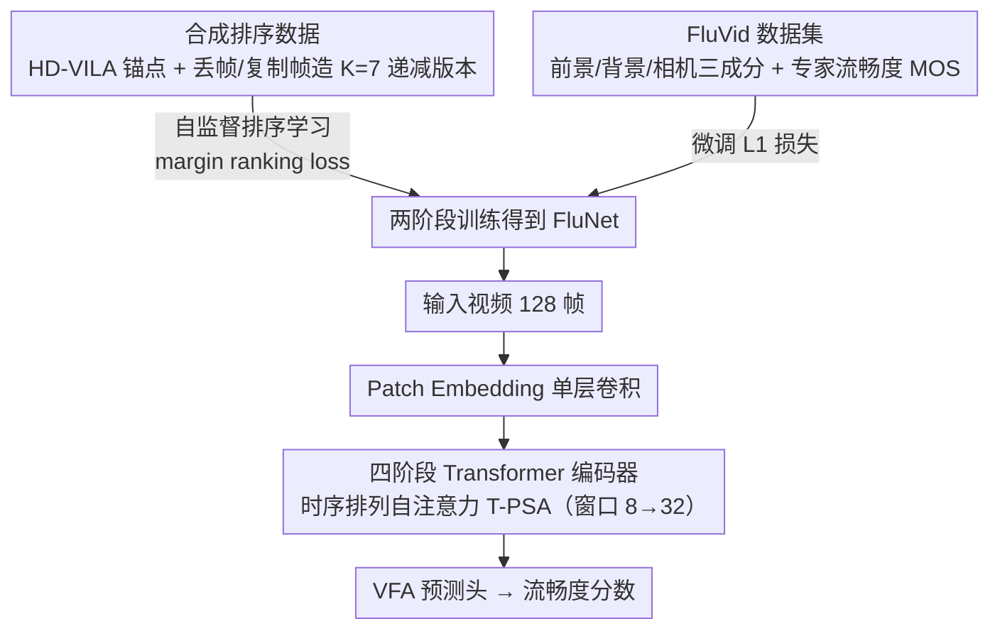

# Pioneering Perceptual Video Fluency Assessment: A Novel Task with Benchmark Dataset and Baseline

**会议**: CVPR 2026  
**arXiv**: [2603.26055](https://arxiv.org/abs/2603.26055)  
**代码**: [https://github.com/KeiChiTse/VFA](https://github.com/KeiChiTse/VFA)  
**领域**: 视频理解  
**关键词**: 视频流畅度评估, 时序质量, 基准数据集, 自注意力, 自监督学习

## 一句话总结

本文首次将视频流畅度评估（VFA）从传统视频质量评估（VQA）中独立出来，构建了首个流畅度评估数据集 FluVid（4,606 视频），并提出 FluNet 基线模型，通过时序排列自注意力（T-PSA）实现高效帧间交互，SRCC/PLCC 分别达到 0.816/0.821。

## 研究背景与动机

**领域现状**：视频质量评估（VQA）是目前量化视频主观感受的主流方法，已有大量模型（如 Fast-VQA、DOVER）被广泛使用。VQA 将空间质量（噪声、色彩等）和时序质量（运动一致性、帧连续性等）混合在一起进行整体评估。

**现有痛点**：作者通过先导实验发现，现有 VQA 模型的预测高度偏向空间质量，而对时序维度（即流畅度）的评估能力严重不足。这导致 VQA 预测分数无法有效指导自适应帧率编码、帧插值等时序相关的下游任务。

**核心矛盾**：VQA 模型的"空间-时序"纠缠使得流畅度信号被大幅稀释。人眼对时序失真比空间失真更敏感，但模型输出却恰恰相反。造成这一问题的根本原因有三：（1）缺乏独立的流畅度评分标准；（2）缺乏大规模的流畅度标注数据集；（3）缺乏针对流畅度设计的模型架构。

**本文目标** 将视频流畅度评估形式化为独立感知任务 VFA；构建首个流畅度评分标准和数据集 FluVid；设计流畅度感知baseline FluNet。

**切入角度**：从视觉心理学和认知科学出发，流畅度由三个核心视频成分决定——前景、背景和相机运动。同时，现有方法的主要障碍是输入帧数不足和帧间交互不充分。

**核心 idea**：通过通道压缩+时序维度排列的自注意力机制（T-PSA），在保持计算量可控的前提下大幅扩展时序窗口，配合自监督排序训练策略，让模型学会感知流畅度差异。

## 方法详解

### 整体框架

FluNet 包含三个部分：patch embedding 层 $F_p$（单层卷积）、编码器 $F_e$（含 T-PSA 的四阶段 Transformer）和 VFA 预测头 $F_h$（两层逐点卷积）。输入视频 $V \in \mathbb{R}^{T \times H \times W \times 3}$ 先经过 $F_p$ 映射为特征图，再逐层编码，最后通过 $F_h$ 回归流畅度分数。整个架构基于 Swin Transformer 的层次化设计，四个 stage 分别含 (2,2,6,2) 个 T-PSA block。模型先在合成排序数据上做自监督排序学习、再用 FluVid 数据集微调，这三块（T-PSA 架构、排序训练、FluVid 数据）正是下文的三项关键设计。

### 关键设计

**1. 时序排列自注意力（T-PSA）：让时序窗口翻 4 倍而算力反降**

要感知流畅度，模型必须看到足够长的连续帧——可一旦把输入从 32 帧加到 128 帧、注意力窗口从 8 帧拉到 32 帧，计算量就会爆炸（128 帧 + 32 窗口的朴素 attention 高达 1114 GFLOPs）。T-PSA 的做法是先把 $\mathbf{K}, \mathbf{V}$ 的通道维度从 $C$ 压到 $C/\gamma$（$\gamma=2$），再把时序 token 重新排列（permute）到通道维度上：这样 $\mathbf{K}_p, \mathbf{V}_p$ 的窗口从 $(D,S,S)$ 缩成 $(D/\gamma,S,S)$，而通道维度被排列填补回 $C$，恰好能和未动的 $\mathbf{Q}$ 正常算注意力。关键在于它只对时序维度 $D$ 做压缩-排列的腾挪、空间窗口 $S$ 保持不变，等于把算力预算全押在"看更长的时间"而非"看更细的空间"上——这正契合流畅度是个时序属性。最终时序窗口从 8 扩到 32，GFLOPs 反而从 1114 降到 308。

**2. 自监督排序训练策略：用合成卡顿视频绕开昂贵标注**

流畅度的真实标注必须由专业人员在受控实验室环境下打分，成本极高，无法支撑大规模训练。作者转而构造可自动生成监督信号的排序任务：从 HD-VILA 采样 2,000 个高质量视频作为"锚点"，对每个锚点用随机丢帧 + 复制帧合成 $K=7$ 个流畅度逐级递减的版本（丢帧率随等级递增，丢帧位置随机落在 $M=5$ 个时间区间里）。模型不需要预测绝对分数，只需保证同一锚点下流畅度高的版本得分更高，用 margin ranking loss 约束：

$$\mathcal{L}_{\text{rank}} = \frac{1}{K}\sum_{i=0}^{K-1}\max(0, \hat{y}_{i+1} - \hat{y}_i + \beta), \quad \beta=0.4$$

由于同一锚点的 7 个版本内容完全相同、只在流畅度上有差异，模型被迫把空间内容剥离、专注学习"卡顿带来的相对差异"，从而在零人工标注的前提下习得流畅度排序能力。

**3. FluVid 数据集：首个以流畅度为中心的基准**

现有 VQA 数据集都围绕整体质量打分，没有流畅度中心的标注，VFA 既无法训练也无法评测。作者据两条原则构建 FluVid：一是按视觉心理学认定的三个流畅度决定成分——前景运动、背景运动、相机运动——分别采集视频，保证流畅度信号的覆盖面；二是确保内容与参数（帧率、分辨率等）的多样性。最终从 SSv2 和 5 个 UGC-VQA 数据集中筛出 4,606 个视频，由 20 位专家按 5 级 ACR 标准标注流畅度 MOS，为 VFA 任务提供了训练与评测的统一标尺。

### 损失函数 / 训练策略

训练分三阶段：（1）可选的 LSVQ 预训练使模型具备质量感知能力（FluNet++）；（2）排序学习阶段使用 $\mathcal{L}_{\text{rank}}$ 在 16,000 个合成视频上训练 30 个 epoch；（3）微调阶段使用 606 个 FluVid 视频的 L1 损失 $\mathcal{L}_{\text{ft}} = \|\hat{y}_b - y_b\|_1$ 训练 60 个 epoch。

## 实验关键数据

### 主实验

| 方法 | 类型 | 帧数 | 窗口大小 | GFLOPs | SRCC↑ | PLCC↑ |
|------|------|------|---------|--------|-------|-------|
| Fast-VQA | VQA | 32 | (8,7,7) | 279 | 0.640 | 0.633 |
| DOVER | VQA | - | - | - | 0.638 | 0.614 |
| Qwen 2.5-VL | LMM | - | - | - | 0.598 | 0.584 |
| FineVQ | LMM | - | - | - | 0.622 | 0.609 |
| Fast-VQA+128帧+排序+微调 | VQA | 128 | (8,7,7) | 1114 | 0.725 | 0.716 |
| **FluNet (Ours)** | VFA | 128 | (32,7,7) | 308 | **0.774** | **0.770** |
| **FluNet++ (Ours)** | VFA | 128 | (32,7,7) | 308 | **0.816** | **0.821** |

### 消融实验

| 配置 | SRCC↑ | PLCC↑ | 说明 |
|------|-------|-------|------|
| 仅排序学习 | 0.722 | 0.718 | 排序学习有效 |
| 仅微调 | 0.710 | 0.693 | 微调也有效 |
| 联合训练 | 0.753 | 0.748 | 联合效果不如分阶段 |
| 排序→微调 | 0.774 | 0.770 | 分阶段最优 |
| 窗口(8,7,7) | 0.736 | 0.722 | 小窗口性能差 |
| 窗口(16,7,7) | 0.758 | 0.749 | 窗口越大越好 |
| 窗口(32,7,7) | 0.774 | 0.770 | 最优窗口大小 |
| Stage 1-3 用 T-PSA | 0.779 | 0.766 | 最佳阶段配置 |
| 全部 4 个 stage 用 T-PSA | 0.774 | 0.770 | 第4阶段加不加差别不大 |

### 关键发现

- FluNet 在 GFLOPs 仅为 308 的情况下超越了 1114 GFLOPs 的 Fast-VQA（+4.9% SRCC），证明 T-PSA 的效率优势
- 增加输入帧数（32→128）对所有方法都有增益，但 T-PSA 的独特优势在于可以同时扩大时序窗口
- 排序→微调的分阶段策略优于联合训练，说明先学会排序再校准分数是更好的学习路径
- VQA 方法整体优于 LMM，说明精细的质量感知能力比通用理解更重要；但 LMM 中 Qwen 2.5-VL 表现最好，受益于其高帧率处理能力

## 亮点与洞察

- **T-PSA 的通道-时序维度交换**是一个非常巧妙的设计。通过压缩 K/V 通道维度然后将时序 token 排列到通道维度，在不增加计算量的情况下实现了 4 倍时序窗口扩展。这个思路可以迁移到任何需要长时序建模的视频任务中
- **将 VFA 从 VQA 中独立出来的洞察**本身有很大价值。作者通过定量实验证明 VQA 模型偏向空间质量，这一发现对视频生成评估也很有启发——当前用 VQA 指标评估视频生成质量可能严重低估了时序问题
- **合成排序训练**巧妙地解决了标注稀缺问题，丢帧+复制帧的合成方式虽然简单，但有效模拟了真实世界的卡顿

## 局限与展望

- FluVid 数据集仅 4,606 个视频，规模有限且主要来自 UGC 视频，缺少 AI 生成视频
- 合成的排序训练数据仅模拟了丢帧卡顿，未覆盖其他流畅度问题（如运动模糊、帧率不稳定等）
- T-PSA 的通道压缩比 $\gamma$ 固定为 2，没有探索自适应压缩策略
- 未考虑将 VFA 与 VQA 结合做联合预测的方案，而这在实际应用中可能更有价值

## 相关工作与启发

- **vs Fast-VQA**：Fast-VQA 使用稀疏帧采样+固定窗口的 attention，FluNet 通过 T-PSA 在相同计算量下实现了更大的时序窗口和更多输入帧，SRCC 从 0.640 提升到 0.774
- **vs LMM 方法（Qwen 2.5-VL, FineVQ）**：LMM 具有强大的语义理解能力但缺乏细粒度的流畅度感知。质量感知的 LMM（如 FineVQ）表现优于通用 LMM，但仍不及专门设计的 VFA 方法
- 这项工作对视频生成评估有很大启发：当前用 FVD 等指标评估视频生成质量时，流畅度维度可能被严重忽视

## 评分

- 新颖性: ⭐⭐⭐⭐ 首次定义 VFA 任务并构建完整生态（标准+数据+方法），T-PSA 设计巧妙
- 实验充分度: ⭐⭐⭐⭐⭐ 23 种方法的全面 benchmark + 详尽消融实验 + 多维度分析
- 写作质量: ⭐⭐⭐⭐ 问题动机清晰，行文结构完整，figure 设计直观
- 价值: ⭐⭐⭐⭐ 填补了流畅度评估空白，对视频生成质量评估和视频处理优化有实际指导意义

<!-- RELATED:START -->

## 相关论文

- [\[CVPR 2026\] TacSIm: A Dataset and Benchmark for Football Tactical Style Imitation](tacsim_a_dataset_and_benchmark_for_football_tactical_style_imitation.md)
- [\[AAAI 2026\] FineVAU: A Novel Human-Aligned Benchmark for Fine-Grained Video Anomaly Understanding](../../AAAI2026/video_understanding/finevau_a_novel_human-aligned_benchmark_for_fine-grained_video_anomaly_understan.md)
- [\[CVPR 2026\] Event6D: Event-based Novel Object 6D Pose Tracking](event6d_event-based_novel_object_6d_pose_tracking.md)
- [\[CVPR 2026\] EgoXtreme: A Dataset for Robust Object Pose Estimation in Egocentric Views under Extreme Conditions](egoxtreme_a_dataset_for_robust_object_pose_estimation_in_egocentric_views_under_.md)
- [\[CVPR 2026\] OpenMarcie: Dataset for Multimodal Action Recognition in Industrial Environments](openmarcie_dataset_for_multimodal_action_recognition_in_industrial_environments.md)

<!-- RELATED:END -->
