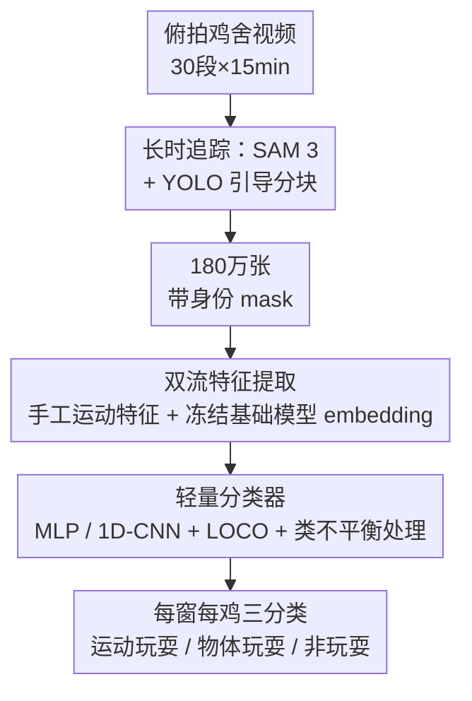

# PlayClass: Automated Play Behaviour Classification in Poultry

**会议**: CVPR 2026  
**arXiv**: [2605.27304](https://arxiv.org/abs/2605.27304)  
**代码**: https://github.com/sbhattlab/PlayClassCV4Animals (有)  
**领域**: 视频理解 / 动物行为识别  
**关键词**: 家禽福利监测、玩耍行为分类、SAM 3 长时追踪、视频基础模型、类不平衡

## 一句话总结
PlayClass 是一条从俯拍鸡舍视频中自动识别个体「玩耍行为」的流水线：用 YOLO 引导分块的 SAM 3 做 15 分钟级长时追踪、再把手工运动特征与冻结的图像/视频基础模型 embedding 喂给轻量分类器，最终 V-JEPA 2.1 配合手工特征拿到 77.0 的宏平均 F1。

## 研究背景与动机
**领域现状**：自动化动物福利监测近年大量借助计算机视觉，但绝大多数工作盯的是**负面指标**——疼痛、疾病、跛行、感染。在家禽（poultry）这个对食品安全和人畜共患病监测都很重要的场景里，主流做法是用光流统计群体活跃度，或用基于深度学习的追踪做个体级的姿态/进食/打喷嚏识别，几乎都服务于「出了什么毛病」。

**现有痛点**：**正面福利行为，尤其是「玩耍」（play），几乎无人自动化**。玩耍虽然耗能、有受伤风险，却是动物福祉的重要正向信号。难点有三：①数据极度稀缺（家禽视频因隐私和所有权限制很难拿到，且没有带标注的玩耍视频）；②**定义本身模糊**——玩耍常和非玩耍共享运动模式（比如奔跑既可能是玩、也可能是逃），且会在状态间快速切换；③家禽群体里个体长得几乎一样、密集且频繁遮挡，追踪极易身份错乱。

**核心矛盾**：玩耍行为的**运动学指纹**和非玩耍高度重叠，同时类别严重不平衡（玩耍是稀有事件），既要长时间稳定追踪到每只鸡的身份，又要在稀少且易混淆的样本上把玩耍从背景里分出来。

**本文目标**：拆成两个子问题——(1) 如何把只能处理短片段的 SAM 3 扩展到 15 分钟录像、且在频繁遮挡下保持个体身份；(2) 在数据稀缺的情况下，哪种特征/骨干网络最能区分玩耍 vs 非玩耍。

**切入角度**：作者押注**冻结的基础模型 embedding**（图像 DINOv3、视频 V-JEPA 2/2.1、VideoPrism）作为 label-light 的表示，并配一个**强的手工运动特征基线**作对照，看学习到的视觉表示到底比纯运动学/形状描述子多带了多少信息。

**核心 idea**：把「长时追踪（SAM 3 + YOLO 引导分块）」和「冻结基础模型 + 手工运动特征双流分类」拼成一条流水线，用宏平均 F1 在严重不平衡的真实鸡舍数据上系统评测家禽玩耍行为分类。

## 方法详解

### 整体框架
PlayClass 把「俯拍鸡舍视频 → 每只鸡的玩耍类别」拆成三段串行流水线。**输入**是 30 段俯拍录像（704×576，25fps，每段 15 分钟，覆盖 45 只红原鸡×白来航杂交雏鸡）；**输出**是对每个 5 秒观测窗口、每只鸡的三分类标签（locomotor play 运动玩耍 / object play 物体玩耍 / other 非玩耍）。

中间三段是：**①长时追踪**——SAM 3 在 GPU 显存限制下只能逐 60 秒分块处理，靠 YOLO 检测器选「鸡彼此分得最开」的帧作分块边界、再用上一块末帧的点提示初始化下一块，把身份贯穿整段录像，产出超过 180 万张带框 mask；**②双流特征提取**——从追踪 mask 里既算 19 维手工运动/形状/社交特征（每窗汇成 171 维），又用冻结基础模型抽视觉 embedding；**③分类**——把特征喂给 MLP 或 1D-CNN，配合 LOCO 交叉验证和类不平衡处理出最终标签。三段是清晰的串行 pipeline，框架图如下。

### 关键设计

**1. YOLO 引导分块的 SAM 3 长时追踪：让可提示分割撑过 15 分钟**

SAM 3 能做强大的可提示视频分割，但显存约束和误差累积让它很难处理超过 1 分钟的长片段——直接端到端跑 15 分钟会爆显存、且身份漂移越滚越大。作者把录像切成约 60 秒的块，用文本提示 `bird` 初始化第一块，后续每块用**上一块末帧 mask 上提取的点**作提示来续接。关键创新是两个「自适应」策略：**自适应分块（adaptive chunking）**用一个 YOLO26x + BoT-SORT 追踪器在候选帧里找**个体间间隔最大**的帧作为块边界，让跨块的身份转移发生在鸡彼此分得最开的时刻，最大限度避免点提示落到错的鸡身上；**自适应接地（adaptive grounding）**不死板地从第 1 帧开始，而是先用文本提示在前 5 秒（125 帧）里挑一个「检测置信度高、个体分离好」的帧作起始锚点。这两招把追踪 HOTA 从 Grounded-SAM-2 的 0.282 拉到 0.563、IDF1 拉到 0.700。即便如此，跨块 ID 切换仍需人工后处理修正——这也是流水线尚未全自动的根因。

**2. 手工运动特征与冻结基础模型 embedding 双流互补**

玩耍的信号到底藏在「运动学」还是「学习到的视觉语义」里？作者并行抽两路特征做对照。**手工 mask 特征**：从追踪 mask 上算 19 个逐帧特征，覆盖空间形状（面积、实心度、圆形度）、时间动力学（速度、加速度、转向角）和成对社交上下文（与其他鸡的距离），再用 9 个汇总统计量（矩、分位数等）按窗汇总，得到每窗 171 维向量——这是可解释、无需任何学习视觉表示的强基线。**视觉 embedding**：评测冻结的图像模型 DINOv3（从紧致 bbox 裁剪取 CLS-token）和视频模型 V-JEPA 2/2.1、VideoPrism（按 $K_{\text{in}}$ 帧切非重叠 clip、逐时步空间平均池化后拼接）。两路都产出每窗 $F_w\times D$ 的变长序列（$F_w$ 为时间 token 数、$D$ 为维度）。混合配置下，手工窗口统计量与 1D-CNN 表示在分类头前拼接。实验结论很有意思：手工特征单独就能到 73.4 F1，与最佳混合（77.0）只差 3.6 分，说明玩耍信号大部分能被运动/形状/邻近统计量捕获，而冻结的 V-JEPA 2.1 embedding 提供的是**互补**信号而非碾压。

**3. 轻量分类器 + LOCO 交叉验证 + 类不平衡处理**

在玩耍仅占 13.3%（物体玩耍 9.3%、运动玩耍 4.0%）的严重不平衡下，分类器和评测协议本身就是设计的一部分。架构上用两个简单网络：直接在均值池化 embedding/窗口统计量上跑的 **MLP probe**，以及保留时序信号的 **1D-CNN**——后者先把变长 embedding 序列用自适应平均池化压成 $K$ 个定长段（$K$ 匹配各骨干的时间粒度），再过 GELU 瓶颈、单层 1D 卷积、门控注意力池化，最后接线性分类头。为了拿到诚实的泛化估计，用 **Leave-One-Cage-Out（LOCO）** 五折交叉验证：每折留一个笼子做测试、按环形顺序的下一个笼子做验证、其余三笼训练，避免环境泄漏（同笼背景会让模型「记住」而非「学会」）。类不平衡靠**逆平方根类权重**加权交叉熵 + 标签平滑（$\alpha=0.1$）缓解。消融显示这两项缓解措施是除训练轮数外最关键的。

### 损失函数 / 训练策略
所有模型训练 5 个 epoch，用 AdamW + 加权交叉熵（逆平方根类权重）+ 标签平滑（$\alpha=0.1$），按验证 loss 最优选 checkpoint。主指标是**宏平均 F1**（macro-averaged F1，从跨折聚合的混淆矩阵算出），以应对严重类不平衡。

## 实验关键数据

数据集：30 段俯拍录像、45 只个体、14,515 个 5 秒窗口，类别分布 86.7% 非玩耍 / 9.3% 物体玩耍 / 4.0% 运动玩耍（社交玩耍因仅 201 窗、1.4% 被剔除）。所有实验的折间标准差都偏高（±4–6%），反映各笼玩耍频率差异大。

### 主实验

各骨干（均用 1D-CNN，ViT-L 为主比较点）与手工特征对比：

| 输入 | 分类器 | ViT-B | ViT-L | 说明 |
|------|--------|-------|-------|------|
| 手工特征 | MLP | — | 73.4 ±4.7 | 无任何学习视觉表示的强基线 |
| DINOv3 | 1D-CNN | 70.7 ±5.5 | 74.0 ±6.7 | 图像骨干；ViT-H 无提升（73.4）|
| VideoPrism | 1D-CNN | 73.8 ±4.4 | 74.1 ±4.9 | 时序上下文短（8–16 帧）|
| V-JEPA 2 | 1D-CNN | — | 74.3 ±4.5 | |
| V-JEPA 2.1 | 1D-CNN | 75.8 ±5.0 | 76.3 ±5.4 | 各尺度最强骨干 |
| **手工 + V-JEPA 2.1** | 1D-CNN | 76.5 ±4.1 | **77.0 ±5.5** | 最佳配置 |

关键观察：V-JEPA 2.1 在 ViT-B/ViT-L 两个尺度都全面领先，优势主要来自更高的物体玩耍召回（59.0% vs DINOv3 的 53.4%）；模型放大收益极小（V-JEPA 2.1 ViT-B 已超过所有其他骨干的任意尺度，DINOv3 放到 ViT-H 也不涨），说明这个领域特定任务上表示很早就饱和。

### 消融实验

| 配置（基于最佳模型）| Δ宏平均 F1 | 说明 |
|------|---------|------|
| Full（手工 + V-JEPA 2.1, K=32）| 77.0 | 完整模型 |
| 仅训练 1 epoch | −4.8 ±5.4 | 训练不足掉点最多 |
| − 类权重 | −1.5 ±4.5 | 去掉逆平方根类加权 |
| − 标签平滑 | −1.5 ±4.0 | 去掉标签平滑 |
| − 1D-CNN（换 MLP）| −0.9 ±4.7 | 时序结构贡献很小 |
| K=32 → K=16 | −1.7 | 时间分辨率变粗；K=48 无额外收益 |

追踪侧消融（HOTA / IDF1）：完整方法 0.563 / 0.700；去掉自适应接地暴跌 −0.275 / −0.335（最关键），去掉自适应分块 −0.013 / −0.030。

### 关键发现
- **手工特征是出乎意料的强基线**：单独 73.4，距最佳混合仅差 3.6 分——玩耍识别的主体信号可由运动/形状/邻近统计量捕获，冻结视频表示只贡献互补信号。
- **类不平衡缓解 > 时序建模**：类权重和标签平滑各值 1.5 分，而把 1D-CNN 换回 MLP 只掉 0.9 分，说明对这种短事件，均值池化的 V-JEPA 2.1 embedding 已含住大部分时序信息。
- **物体玩耍最难**：最佳模型上物体玩耍召回仅 66.1%、精度 58.2%，大量误判进非玩耍多数类；拥挤会放大该偏差（鸡间距与物体玩耍准确率 Spearman ρ=0.17, p<10⁻⁹）。
- **表示几何解释错误来源**：t-SNE + k-NN 探针显示 57% 的「啄虫」窗口最近邻是非玩耍窗口（运动学弥散），而「frolicking」自成清晰簇（88% 召回、71% 自邻），印证玩耍定义的内在模糊性。
- **骨干按训练范式聚类**：CKA 分析中 DINOv3/VideoPrism（语义教师目标）一组、V-JEPA 2/2.1（运动预测）一组，后者更擅长捕捉玩耍运动学。

## 亮点与洞察
- **「让分割模型撑过长视频」的工程巧思可复用**：用一个轻量检测+追踪器去**挑分块边界**（个体最分离的帧），把昂贵的可提示分割模型的身份漂移问题转嫁给「选好交接时机」，这套思路对任何「短上下文强模型 + 长序列」的场景都有借鉴价值。
- **强基线的诚实做法值得学**：作者没有为了凸显基础模型而弱化手工特征，反而把它做成 73.4 的硬基线，得出「冻结视频表示只是互补」这个反直觉但更有信息量的结论。
- **用嵌入几何（t-SNE / k-NN / CKA）做错误归因**而非只报数字，把「为什么物体玩耍难」量化到「57% 啄虫窗口最近邻是非玩耍」，这种分析范式可迁移到任何细粒度、易混淆的行为/动作识别任务。
- **LOCO 防环境泄漏**：在同笼背景高度相似的数据上，留笼交叉验证是避免模型「背环境」的关键，对小规模生态学视频数据集是必要的评测纪律。

## 局限与展望
- **未全自动**：流水线仍依赖人工后处理修正跨块 ID 切换、纠正追踪异常、映射 ID 到实验协议，距全自主部署有差距（作者自承）。
- **数据规模与不平衡**：仅 45 只个体、30 段录像，玩耍样本稀少且折间方差大（±4–6%），社交玩耍因样本太少（201 窗）直接被剔除，三分类已是数据所能支撑的上限，14 个细粒度子行为无法可靠评测。
- **遮挡与子类型混淆未解**：物体玩耍召回仅 66.1%，拥挤场景下进一步恶化；共享运动学的子类型（如奔跑 vs 物体奔跑）仍混淆。
- **改进思路**：作者建议用更大的家禽行为数据集做领域自适应预训练、引入跨鸡空间上下文处理遮挡与社交、改进跨块身份匹配以减少人工修正。个人补充：可探索把社交上下文显式建模进 embedding，而非仅作手工特征拼接。

## 相关工作与启发
- **vs 基于光流的群体级家禽监测**：传统做法测群体活跃度/跛行，停在 flock-level；本文做**个体级**且针对**正面行为**玩耍，是该方向首个自动化玩耍分类工作。
- **vs DINOv2 embedding 做绵羊动作分类 / V-JEPA 领域自适应做灵长类行为**：前人证明冻结/微调基础模型 embedding 对动物行为有效，但本文首次评测 V-JEPA 2.1（带密集预测目标）在动物行为上的表现，并发现它在玩耍运动学上优于语义教师类骨干。
- **vs Grounded-SAM-2 长视频追踪**：本文用 YOLO 引导的自适应分块+接地，把 HOTA 从 0.282 提到 0.563，专门解决密集相似个体的长时身份保持。

## 评分
- 新颖性: ⭐⭐⭐⭐ 首个家禽自动化玩耍行为分类，长时 SAM 3 追踪策略有工程巧思，但分类侧主要是现成基础模型的系统评测。
- 实验充分度: ⭐⭐⭐⭐ 骨干/特征/训练三类消融齐全，t-SNE/k-NN/CKA 错误归因扎实，但数据规模小、折间方差大。
- 写作质量: ⭐⭐⭐⭐ 结构清晰、结论诚实（不夸大基础模型优势），错误分析有深度。
- 价值: ⭐⭐⭐⭐ 为动物正面福利的自动化评估提供了可复现的 pipeline 和强基线，应用价值明确。

<!-- RELATED:START -->

## 相关论文

- [\[ACL 2026\] Automated Knowledge Component Generation and Interpretable Knowledge Tracing in Coding Problems](../../ACL2026/video_understanding/automated_knowledge_component_generation_for_interpretable_knowledge_tracing_in_.md)
- [\[ECCV 2024\] Classification Matters: Improving Video Action Detection with Class-Specific Attention](../../ECCV2024/video_understanding/classification_matters_improving_video_action_detection_with_class-specific_atte.md)
- [\[CVPR 2026\] Towards Data-Efficient Video Pre-training with Frozen Image Foundation Models](towards_data-efficient_video_pre-training_with_frozen_image_foundation_models.md)
- [\[CVPR 2026\] VecAttention: Vector-wise Sparse Attention for Accelerating Long Context Inference](vecattention_vector-wise_sparse_attention_for_accelerating_long_context_inferenc.md)
- [\[CVPR 2026\] VideoChat-M1: Collaborative Policy Planning for Video Understanding via Multi-Agent Reinforcement Learning](videochatm1_collaborative_policy_planning_for_vide.md)

<!-- RELATED:END -->
