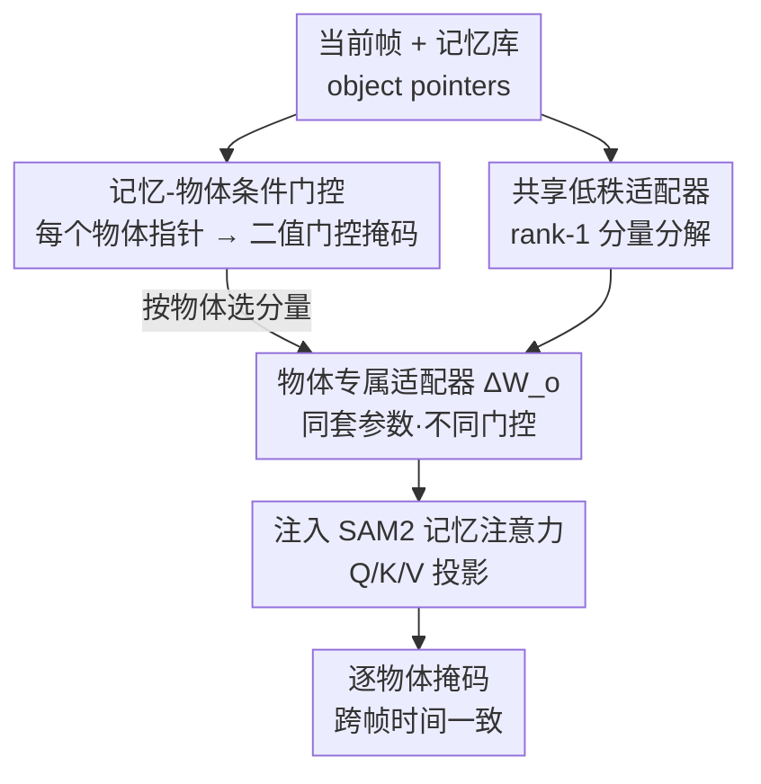

# Robust Promptable Video Object Segmentation

**会议**: CVPR 2026  
**arXiv**: [2605.12006](https://arxiv.org/abs/2605.12006)  
**代码**: https://sohyun-l.github.io/RobustPVOS_project_page/ (项目页，benchmark 公开)  
**领域**: 视频理解 / 语义分割  
**关键词**: 可提示视频目标分割, 鲁棒性, SAM2, 记忆条件适配, 门控低秩适配

## 一句话总结
针对 SAM2 这类可提示视频目标分割（PVOS）模型在恶劣天气/噪声下性能骤降的问题，本文构建了首个 RobustPVOS benchmark（351 段真实恶劣视频 + 大规模时变合成退化数据），并提出 MoGA——用记忆库里每个被跟踪物体的指针来"条件化"地门控一个共享低秩适配器，让每个物体得到各自的、跨帧一致的鲁棒化处理，仅训练 1.1M 参数就在多种退化上稳定超越逐帧鲁棒化方法。

## 研究背景与动机
**领域现状**：可提示视频目标分割（PVOS）让用户用点/框/掩码等自由提示，在视频里分割并跟踪任意物体。SAM2 通过流式记忆架构把图像端的可提示分割能力扩展到视频，在干净视频上做到了惊艳的零样本效果，成为该范式的代表。

**现有痛点**：作者实证发现，SAM2 一旦遇到噪声、模糊、低光照、雨雾雪等输入退化，性能就大幅下滑（如 MVSeg-adv 上 𝒥&ℱ 只有 69.6%，ACDC-Video 上仅 63.5%）。这对自动驾驶、机器人这类恶劣条件不可避免的安全攸关场景是致命的，而此前几乎没有系统研究。

**核心矛盾**：一个朴素思路是把现成的鲁棒图像分割方法逐帧套上去，但真实视频的退化是**空间和时间双重异质**的——同一场景里不同物体受影响程度不同（雾天远处物体几乎看不见、近处仍清晰），退化模式还会逐帧变化。逐帧独立处理既无法保证时间一致性（掩码在帧间抖动），又对整帧做统一鲁棒化、忽略了不同物体的差异。

**本文目标**：① 把 RobustPVOS 立成一个有 benchmark、可系统评测的研究方向；② 设计一个能**对每个物体差异化、且跨帧一致**地做鲁棒化的方法。

**切入角度**：作者的关键观察是——现代视频分割模型（SAM2 等）本身就在记忆库里维护着**每个物体跨帧累积的表征**（object pointer），这些表征天然刻画了"该物体随时间如何被退化影响"。

**核心 idea**：用记忆库里的物体指针去**条件化**鲁棒化过程——以物体表征为条件，门控选择共享低秩适配器中的若干 rank-1 分量，从而对每个被跟踪物体施加专属、且因记忆累积而时间一致的适配。

## 方法详解

### 整体框架
MoGA（Memory-object-conditioned Gated-rank Adaptation）作为插件嵌入冻结的 SAM2 的**记忆注意力模块**里。SAM2 推理时逐帧处理：已处理帧的物体特征以 object pointer 形式存入记忆库，当前帧通过记忆注意力（自注意力 Q/K/V + 交叉注意力 Q）读取这些历史信息。MoGA 不改 SAM2 主干，而是在这些投影层上挂一个**所有物体共享**的低秩适配器，把它拆成 R 个 rank-1 分量；再用一个共享的门控模块，对记忆库里每个物体指针 $\mathbf{m}_o$ 单独算出一组二值门控掩码，决定**这个物体**要激活哪些 rank-1 分量。于是同一套适配器参数，因为门控条件不同，对不同物体构造出不同的有效权重；又因为物体指针是记忆库跨帧累积的，门控选择随时间平滑、保证时间一致。整套只训练 MoGA 模块和 LayerNorm，共 1.1M 参数。

### 关键设计

**1. rank-1 分量分解：把一个适配器拆成可按物体挑选的"零件库"**

普通 LoRA 在冻结权重 $\mathbf{W}_0$ 上加一个低秩增量 $\Delta\mathbf{W}=\mathbf{B}\mathbf{A}$，前向为 $\mathbf{h}=\mathbf{W}_0\mathbf{x}+\mathbf{B}\mathbf{A}\mathbf{x}$，但它对所有输入、所有物体施加**完全相同**的适配，无法感知"现在跟的是哪个物体、它被退化成什么样"。借鉴 GaRA 的做法，MoGA 把 $\Delta\mathbf{W}=\mathbf{B}\mathbf{A}$ 显式拆成 $R$ 个 rank-1 分量 $\{\mathbf{a}_i,\mathbf{b}_i\}_{i=1}^R$，即 $\Delta\mathbf{W}=\sum_{i=1}^{R}\mathbf{b}_i\mathbf{a}_i^\top$。这样适配器就从"一个整体"变成"一个零件库"——可以按输入特性灵活地只挑选部分分量来组装权重矩阵，为下一步"按物体差异化激活"提供了可操作的最小单元。

**2. 记忆-物体条件门控：用每个物体的记忆指针决定它专属的鲁棒化**

这是 MoGA 的核心创新，直接回应"不同物体受退化影响不同、且要跨帧一致"的矛盾。SAM2 记忆库里维护着物体指针集合 $\mathcal{M}=\{\mathbf{m}_o\}_{o=1}^{O}$，每个 $\mathbf{m}_o\in\mathbb{R}^d$ 编码物体 $o$ 跨帧累积的历史特性。MoGA 引入一个**共享但逐物体应用**的门控模块 $g(\cdot)$（三层 MLP），输入物体指针、输出该物体的二值门控掩码 $\mathbf{z}_o=g(\mathbf{m}_o)\in\{0,1\}^R$：先算 logits $\boldsymbol{\alpha}_o=\text{MLP}(\mathbf{m}_o)$，再用 Gumbel-Sigmoid 松弛实现可微的离散选择
$$\tilde{z}_{o,i}=\sigma\Big(\tfrac{1}{\tau}(\alpha_{o,i}+G_i)\Big),\quad G_i\sim\text{Gumbel}(0,1),$$
训练时前向用硬阈值 $z_{o,i}=\mathbb{I}[\tilde{z}_{o,i}>0.5]$、反向用直通估计器（straight-through）保持可微；推理时门控变确定性 $z_{o,i}=\mathbb{I}[\sigma(\alpha_{o,i})>0.5]$。

得到逐物体门控后，输出为各物体专属适配器的平均：
$$\mathbf{h}=\mathbf{W}_0\mathbf{x}+\frac{1}{O}\sum_{o=1}^{O}\Big(\sum_{i=1}^{R}z_{o,i}\cdot\mathbf{b}_i\mathbf{a}_i^\top\Big)\mathbf{x},$$
其中 $\Delta\mathbf{W}_o=\sum_i z_{o,i}\cdot\mathbf{b}_i\mathbf{a}_i^\top$ 就是物体 $o$ 的专属适配器。所有物体**共享同一套** $\{\mathbf{a}_i,\mathbf{b}_i\}$，仅靠门控不同来差异化——这种 Siamese 结构不复制参数就实现了物体级适配。为什么有效：门控条件来自记忆库累积的物体指针，物体指针随帧平滑演化，门控选择也就随之平滑，因而鲁棒化既是物体专属的、又是时间一致的，恰好同时解决了空间异质和时间一致两个难题。

**3. 注入记忆注意力 + 仅靠分割损失自学门控**

MoGA 具体接在 SAM2 记忆注意力的线性投影上：自注意力的 Q、K、V 和交叉注意力的 Q，每个投影各有自己的 rank-1 分量选择，但低秩适配器与门控模块在物体间共享。值得注意的是，**门控模块不被直接监督**——没有任何标签告诉它"该物体该激活哪些分量"，它完全靠下游分割损失反传、像 MoE 那样自行学会为每个物体选合适的适配路径。这避免了为门控设计额外监督信号的难题，也让"选哪些分量"成为一个端到端涌现的能力。

### 损失函数 / 训练策略
训练只用标准分割损失，对所有帧 $t$、所有物体 $o$ 平均：
$$\mathcal{L}_{\text{total}}=\frac{1}{T\cdot O}\sum_{t=1}^{T}\sum_{o=1}^{O}\mathcal{L}_{\text{seg}}(y_{o,t},\hat{y}_{o,t}),$$
其中 $\mathcal{L}_{\text{seg}}$ 为 focal + dice 损失，$\hat{y}_{o,t}$ 是用物体专属适配器 $\Delta\mathbf{W}_o$ 预测的掩码。冻结 SAM2 全部参数，只训 MoGA 模块和 LayerNorm；AdamW，学习率 $5\times10^{-6}$，weight decay 0.1，batch size 4，每段最多 3 个物体；适配器秩 $R=128$，Gumbel-Sigmoid 温度 $\tau=0.3$ 并线性退火以稳定硬门控。

## 实验关键数据

### 主实验
零样本评测（在合成退化数据上训练，直接测真实/合成退化集），指标为 VOS 标准的区域相似度 $\mathcal{J}$、轮廓精度 $\mathcal{F}$ 及其综合 $\mathcal{J}\&\mathcal{F}$。

| 方法 | MVSeg-adv 𝒥&ℱ | ACDC-Video 𝒥&ℱ | YouTube-VOS-C 𝒥&ℱ | YouTube-VOS(干净) 𝒥&ℱ |
|------|------|------|------|------|
| SAM2 | 69.6 | 63.5 | 78.7 | 82.2 |
| URIE+SAM2（图像复原） | 69.6 | 60.9 | 78.6 | - |
| AirNet+SAM2（图像复原） | 69.1 | 59.8 | 78.6 | - |
| GaRA+SAM2（逐帧鲁棒化） | 69.7 | 61.3 | 78.1 | 79.8 |
| **MoGA+SAM2** | **71.8** | **64.5** | **79.9** | **82.6** |

关键现象：图像复原方法（URIE/AirNet）和逐帧鲁棒化方法（GaRA）在退化视频上要么只有微弱提升、要么反而掉点（尤其 ACDC-Video 上从 63.5 掉到 ~60），印证了"逐帧处理破坏时间一致性"的判断；MoGA 在所有退化集一致提升，且在干净视频上 82.6 与原 SAM2 的 82.2 持平，没有牺牲清晰场景性能。

### 参数效率与时长泛化

| 方法 | 可训练参数 | 训练显存 | MVSeg-adv 𝒥&ℱ |
|------|------|------|------|
| 全量微调 SAM2 | 80.9M | 25GB | 71.5 |
| **MoGA+SAM2** | **1.1M** | **22GB** | **71.8** |

仅训 1.1M 参数、22GB 显存，反而比全量微调 80.9M 参数（25GB）效果更好（71.8 vs 71.5），说明记忆条件鲁棒化既更省又更准。长视频上（把 ~6s 片段拼成 ~42s/1K 帧），SAM2 从 69.6 暴跌到 52.3，MoGA 从 71.8 到 56.2，始终保持对 SAM2 的优势，表明记忆库增大时门控仍稳定。

### 消融实验
| 配置 | MVSeg-adv 𝒥&ℱ | 说明 |
|------|------|------|
| 无任何条件 | 69.6 | 等价 SAM2 基线 |
| 仅记忆条件（所有物体指针聚合成单一表征） | 70.9 | 引入时间信息，+1.3 |
| 完整 MoGA（记忆+物体条件，逐物体独立门控） | **71.8** | 再加物体级适配，+0.9 |

| 对比 | MVSeg-adv 𝒥&ℱ | 说明 |
|------|------|------|
| LoRA+SAM2 | 70.9 | 统一适配、不感知物体/记忆 |
| **MoGA+SAM2** | **71.8** | 记忆-物体条件门控带来额外 +0.9 |

秩 $R$ 敏感性（YouTube-VOS-C）：32→79.3、64→79.4、**128→79.9**、256→79.8、512→79.7，128 最优、超过即饱和。温度 $\tau$：0.1/0.3 最佳（79.9），整体对 $\tau$ 不敏感，说明记忆条件本身已为门控提供强引导，硬选择也不失稳。

### 关键发现
- **时间条件比物体条件贡献更大**：从无条件 69.6 加记忆条件到 70.9（+1.3），再加物体级独立门控到 71.8（+0.9），说明跨帧一致性是 RobustPVOS 第一要务，物体级差异化锦上添花。
- **逐帧方法是负贡献**：复原和逐帧 GaRA 在多数退化集掉点，定性上 GaRA 掩码帧间抖动、URIE 只能捕到物体碎片，直接证明"逐帧独立"在视频鲁棒化上的根本缺陷。
- **推理中渐进自愈**：在夜间序列上 SAM2 全程约 40% 𝒥&ℱ，MoGA 随物体指针在记忆库累积，门控选到越来越合适的分量，序列末尾爬升到 80%+，掩码从碎片演化为完整分割。

## 亮点与洞察
- **"记忆库本就编码了退化历史"这个观察很巧**：别人把鲁棒化当成额外的去退化任务，作者发现 SAM2 的 object pointer 天然刻画了每个物体随时间被退化影响的轨迹，于是把鲁棒化"寄生"在已有记忆上，几乎零额外结构。
- **共享适配器 + 逐物体门控的 Siamese 设计**：同一套 rank-1 零件库，靠门控差异化出 $O$ 个物体专属适配器，不复制参数就拿到物体级适配，是把"参数高效"和"实例自适应"统一起来的漂亮 trick，可迁移到任何带实例记忆的视频任务（如视频实例分割、多目标跟踪）。
- **门控无监督自学**：门控选择完全由分割损失驱动、像 MoE 一样涌现，省掉了"哪个物体该激活哪些分量"的标注难题——这种"让选择端到端长出来"的思路在需要离散路由的任务里普遍适用。
- **首个 RobustPVOS benchmark**：351 段真实恶劣视频 + 2500+ 物体掩码 + 时变合成退化（Fourier 时间调制让退化强度逐帧平滑变化），把一个被忽视的安全攸关问题立成可量化的研究方向，benchmark 价值可能大于方法本身。

## 局限与展望
- **绝对增益偏小**：真实集上 MoGA 相对 SAM2 多在 +1~3 个点（MVSeg-adv 69.6→71.8、ACDC 63.5→64.5），ACDC-Video 提升尤其有限，说明在极端退化下离"可部署"仍有距离，benchmark 更像是把问题暴露出来而非解决。
- **依赖底座的记忆机制**：方法强绑定 SAM2 式的 object pointer 记忆库，对没有显式物体级记忆的视频分割架构难以直接套用。
- **退化合成的真实性**：训练数据靠 8 类合成退化 + Fourier 时间调制生成，与真实雨雾雪的退化分布差距未知，可能限制对未见退化的泛化。
- **门控可解释性有限**：可视化只观察到门控掩码"随时间平滑、小幅变化"，但具体每个分量学到了什么退化模式、为何如此选择，仍是黑箱。

## 相关工作与启发
- **vs GaRA**：GaRA 同样用 gated-rank adaptation 做输入自适应鲁棒化，但它是逐帧/逐图独立处理，既无物体概念也无跨帧记忆，导致掩码时间不一致；MoGA 把门控的条件换成记忆库的物体指针，一举拿到物体级差异化 + 时间一致性，这是从图像鲁棒化迁移到视频鲁棒化的关键补丁。
- **vs LoRA**：LoRA 对所有物体、所有帧施加同一个增量，不知道在跟谁；MoGA 用同样的参数预算，靠记忆-物体门控造出逐物体专属增量，71.8 vs 70.9。
- **vs 图像复原（URIE/AirNet）+SAM2**：先复原再分割的两阶段路线逐帧独立、且复原目标与分割目标不对齐，在视频退化上常掉点；MoGA 端到端只用分割损失驱动鲁棒化，避免了复原-分割目标错配。
- **vs 全量微调 SAM2**：全量微调 80.9M 参数反而不如 1.1M 参数的 MoGA，提示在鲁棒化这类需要"条件化、实例化"的问题上，结构先验（记忆条件门控）比单纯堆可训练参数更重要。

## 评分
- 新颖性: ⭐⭐⭐⭐ 立了 RobustPVOS 新任务+首个 benchmark，"用记忆物体指针条件化门控适配器"的角度新颖；但方法本身是 GaRA/LoRA 的视频化扩展。
- 实验充分度: ⭐⭐⭐⭐ 真实+合成双重评测、与复原/逐帧/LoRA/全量微调全面对比，秩/温度/长视频/分量消融齐全；绝对增益偏小是硬伤。
- 写作质量: ⭐⭐⭐⭐ 动机—矛盾—方法逻辑清晰，公式与图配合到位，benchmark 与方法叙述分明。
- 价值: ⭐⭐⭐⭐ 把安全攸关的视频分割鲁棒性立成可量化方向，benchmark 与高效 baseline 对自动驾驶/机器人社区有实用价值。

<!-- RELATED:START -->

## 相关论文

- [\[CVPR 2026\] Occlusion-Aware SORT: Observing Occlusion for Robust Multi-Object Tracking](occlusion-aware_sort_observing_occlusion_for_robust_multi-object_tracking.md)
- [\[CVPR 2026\] Scene-Centric Unsupervised Video Panoptic Segmentation](scene-centric_unsupervised_video_panoptic_segmentation.md)
- [\[CVPR 2026\] EgoXtreme: A Dataset for Robust Object Pose Estimation in Egocentric Views under Extreme Conditions](egoxtreme_a_dataset_for_robust_object_pose_estimation_in_egocentric_views_under_.md)
- [\[CVPR 2026\] Bootstrapping Video Semantic Segmentation Model via Distillation-assisted Test-Time Adaptation](bootstrapping_video_semantic_segmentation_model_via_distillation-assisted_test-t.md)
- [\[CVPR 2026\] Reconstruction-Guided Slot Curriculum: Addressing Object Over-Fragmentation in Video Object-Centric Learning](reconstruction-guided_slot_curriculum_addressing_object_over-fragmentation_in_vi.md)

<!-- RELATED:END -->
