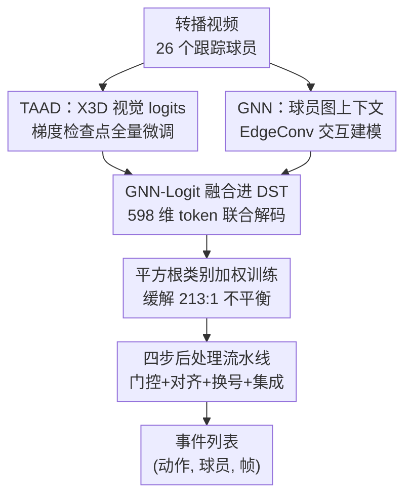

# SoccerNet 2026 Player-Centric Ball-Action Spotting：对 FOOTPASS 基线的重训练与后处理扩展

**会议**: CVPR 2026  
**arXiv**: [2606.09679](https://arxiv.org/abs/2606.09679)  
**代码**: 无  
**领域**: 视频理解  
**关键词**: 时序动作检测、球员中心动作识别、类别不平衡、后处理、足球视频

## 一句话总结
这是 SoccerNet 2026「球员中心的控球动作检测」挑战赛的参赛系统报告：在官方 FOOTPASS 三级联基线（TAAD→GNN→DST）之上加了梯度检查点全量微调、GNN logits 融合进 DST、平方根类别加权、以及一套四步后处理流水线，把测试集 Macro F1 从 0.493 抬到 0.548。

## 研究背景与动机

**领域现状**：足球转播视频里的「控球动作检测」(Ball-Action Spotting) 要求模型回答「谁、在什么时刻、做了哪一类动作」。SoccerNet 2026 把任务定义在 8 类动作（drive、pass、cross、throw-in、shot、header、block、tackle）上，且是**球员中心**的——预测必须落到具体球员身上，而不只是给一个时间点。官方提供了 FOOTPASS 三个参考架构与训练代码作为基线。

**现有痛点**：官方基线存在几个明确的工程/数据短板。其一，TAAD 的 X3D 主干在 batch size 14、22 GB 显存下无法解冻，只能冻结主干训练，限制了表征能力；其二，最强基线 DST 只吃 TAAD 的视觉 logits，没用上 GNN 编码的球员图（战术上下文）；其三，训练数据里 pass 与 tackle 的样本比高达 213:1，均匀损失下模型直接学会忽略稀有类；其四，DST 解码出的事件列表存在大量误检，尤其在稀有类上。

**核心矛盾**：评测主指标是 **Macro F1**——8 个动作类别 F1 的**无权重平均**，于是只有 24 个真值的 tackle 和有 2744 个真值的 pass 权重相同。这就把「稀有类精度」放大成了决定排名的关键，而稀有类恰恰是数据最少、最容易被淹没、误检最致命的部分。

**本文目标**：在不改动任务定义的前提下，围绕「训练容量 / 特征丰富度 / 类别不平衡 / 推理质量」四个维度逐一打补丁，最大化 Macro F1。

**核心 idea**：不发明新架构，而是把 FOOTPASS 三级联跑通、跑满，再用一套针对稀有类误检的后处理把数字榨干。

## 方法详解

### 整体框架
系统建立在官方 FOOTPASS 的三级联（cascade）之上，从原始转播视频一路解码到一份干净的 `(动作, 球员, 帧)` 事件列表：

1. **TAAD**：X3D-S 主干在 M=26 个被跟踪球员间共享，多尺度视频特征经横向上采样融合成 $(B,192,T,44,80)$ 张量；用 RoIAlign（4×2 网格，scale 0.125）抠出每个球员的 crop，再经 Conv1d(192→512, k=3) + 线性头，输出每球员每帧的 9 类 logits（背景 + 8 个动作）。
2. **TAAD+GNN**：用 EdgeConv 分支建模球员交互。每个「球员-帧」节点带 69 维特征（场地坐标、速度、角色 one-hot、球衣号、队伍方）拼上 64 维视觉投影，每个球员连到 6 个最近邻；3 层 EdgeConv（隐藏维 128，max 聚合）与时序 Conv1d(k=5) 交错传播，产出第二套 9 类 logits，刻画「谁靠近球、扮演什么角色」。
3. **TAAD+DST**：Denoising Sequence Transducer 把整段每球员 logit 轨迹当作源序列读入，**自回归地**解码出去重后的事件列表，借助对完整 25 秒窗口的注意力压制零散误检。默认配置：364 维源 token、隐藏维 512、6 层编码器 + 6 层解码器、8 个注意力头、750 帧上下文，交叉熵 + 标签平滑 0.05 训练。该基线在 15% 全局置信阈值下达到 0.493 Macro F1。

本文的四个扩展正好对应这条流水线的四个环节：在 TAAD 训练处加梯度检查点（容量）、在 DST 输入处融合 GNN（特征）、在 DST 损失处加平方根类别权重（不平衡）、在 DST 输出后接后处理（推理质量）。

### 关键设计

**1. 梯度检查点开启主干全量微调：把被冻结的表征能力解放出来**

官方 TAAD 脚本因为「batch 14 解冻 X3D 会超过 22 GB 显存」而在前几个 epoch 后冻结主干，导致视觉表征只能停留在预训练状态。本文在 X3D 第 0–4 个 block 上加梯度检查点（前向时不缓存中间激活、反向时重算），用计算换显存，从而能在 batch size 6 下做全量微调。训练 20 个 epoch，epoch 1–2 冻结主干、之后解冻，AdamW（主干 lr $5\times10^{-5}$、头 lr $10^{-3}$、50 步 warm-up）。这一步本身是工程使能项，但它是后面所有 logits 质量提升的地基——主干能动了，下游融合和加权才有更好的特征可用。

**2. GNN-Logit 融合进 DST 编码器：让解码器同时看视觉流与图上下文**

基线 DST 只编码 TAAD logits（每帧 364 维 token，26 球员）。本文沿特征轴把 GNN logits 拼进来，得到 598 维 token（364 TAAD + 234 GNN，即 $26\times9$）。这个融合模型 GNN-DST 让解码器能**同时注意**纯视觉的 TAAD 流和图上下文化的 GNN 流，兼顾「像不像某个动作」（视觉）与「谁在球附近、什么角色」（空间邻接 + 战术）。单这一项就把测试集 Macro F1 从 0.493 抬到 0.505——稀有类往往需要战术线索（如 tackle 涉及防守球员的位置关系）才能和视觉相近的动作区分开。

**3. 平方根频率类别加权：给稀有类提权但不让它"幻觉"**

训练语料里 pass 约 37000 个事件、tackle 只有 174 个（比例 213:1），均匀损失下 DST 直接学会忽略稀有类。本文给动作交叉熵按 $w_c = 1/\sqrt{n_c}$ 缩放（$n_c$ 为该类训练样本数），使 tackle 相对 drive 获得约 10× 的提权。关键在于**为什么用平方根而不是逆频率**：逆频率加权（约 118×）会让模型疯狂幻觉稀有类、同时把 drive/pass 的召回压垮；平方根加权提权更温和，不出现这种崩溃。权重只施加在动作头，角色头和帧头保持不加权。本文据此训练两个 DST 变体——GNN-DST（带 GNN 融合 + 平方根权重）和 Base-DST（仅 TAAD 输入、不加权），作为后续集成的两个成员。这一项把 Macro F1 进一步抬到 0.521。

**4. 四步后处理流水线：在不再训练的前提下专杀稀有类误检**

全部后处理只作用在 DST 推理产出的原始 JSON 事件上，不涉及额外训练，目标是稀有类的精度崩溃。它包含四个串联操作：

- **组合 logit 门控**：对最易误报的 4 类（shot、header、tackle、block），在预测球员的 ±12 帧窗口内取 TAAD 与 GNN 的峰值原始 logits，组成 $s = \ell_{\text{TAAD}} + \ell_{\text{GNN}}$；低于每类阈值 $\tau_c$（shot 3.0、header 2.5、tackle/block 4.0，从测试集 TP/FP logit 分布标定）的预测被丢弃。这一步移除了 57% 的 block 误报和 74% 的 tackle 误报，且保留全部测试集真值。
- **时序对齐 + 球衣号重指派**：对 header/tackle/block，把帧位置移到 ±25 帧搜索窗内的 TAAD 峰值 logit，球衣号重指派给 ±12 帧内峰值最高的球员（要求比当前指派至少高 0.5 的 margin，防止把已正确的球衣号翻错）。这些操作只对稀有类做——对 drive/pass 做会把预测推出 ±12 帧的评测容差。
- **按类 NMS**：非极大值抑制用类别专属窗口（tackle 25 帧、block 20 帧、其余 15 帧）。
- **双模型集成**：把 GNN-DST（后处理后）与 Base-DST（原始）的预测合并后再抑制一次。Base-DST 的 tackle 预测被排除在集成外——该变体在测试集 tackle 上零真值却带来误报。

整套后处理再贡献 0.027，把最终测试集 Macro F1 推到 0.548。

### 损失函数 / 训练策略
DST 用交叉熵 + 标签平滑 0.05 训练；动作头额外乘平方根类别权重 $w_c = 1/\sqrt{n_c}$，角色头/帧头不加权。TAAD 全量微调用 AdamW（主干 $5\times10^{-5}$、头 $10^{-3}$、50 步 warm-up），20 epoch，前 2 epoch 冻结主干。所有后处理阈值不参与训练，由测试集 logit 分布离线标定。

## 实验关键数据

### 主实验（累积消融）
每个扩展在测试集上的累积 Macro F1 增益（Table 1）：

| 系统 | 测试集 Macro F1 |
|------|------|
| TAAD+DST 基线 | 0.493 |
| + GNN logit 融合（598 维） | 0.505 |
| + 平方根类别加权训练 | 0.521 |
| + logit 门控 + 帧对齐 | 0.535 |
| + 集成 + 门控调参 | 0.548 |

最终系统：测试集 0.548、挑战集 0.446（服务器评测）。

### 分类别结果
测试集 vs 挑战集的每类 F1（Table 2）：

| 类别 | 测试 F1 | 挑战 F1 |
|------|---------|---------|
| drive | 0.703 | 0.650 |
| pass | 0.734 | 0.679 |
| cross | 0.679 | 0.502 |
| throw-in | 0.732 | 0.632 |
| shot | 0.607 | 0.536 |
| header | 0.342 | 0.338 |
| block | 0.336 | 0.178 |
| tackle | 0.256 | 0.056 |
| **Macro** | **0.548** | **0.446** |

### 关键发现
- **GNN 融合与类别加权贡献相当**（各 +0.012、+0.016），后处理再加 0.027；说明在已跑满的基线上，「补特征 + 治不平衡 + 清误检」三者缺一不可。
- **常见类迁移好、稀有类崩盘**：drive/pass/throw-in/cross 从测试到挑战只小幅下滑，而 tackle 在挑战集塌到 F1=0.056（2 TP / 46 FP）。0.10 的测试→挑战 Macro 差距几乎全部来自 tackle 和 block。
- **崩盘根因是阈值过拟合**：logit 门控阈值在测试集上标定，过拟合了测试集的 logit 分布，迁移到挑战集失效——挑战集 tackle 只有 24 个真值，几个误报就足以让 F1 崩溃。

## 消融实验要点

| 配置 | 测试 Macro F1 | 说明 |
|------|---------------|------|
| TAAD+DST 基线 | 0.493 | 官方最强基线 |
| + GNN 融合 | 0.505 | 补战术/空间上下文 |
| + 平方根加权 | 0.521 | 治 213:1 不平衡 |
| + 门控 + 帧对齐 | 0.535 | 清稀有类误检 |
| + 集成 + 调参 | 0.548 | 双 DST 互补 |

- 逆频率加权（约 118×）作为对照被验证为**有害**：模型幻觉稀有类、drive/pass 召回崩塌；平方根（约 10×）才是稳定甜点。
- 组合 logit 门控对 tackle 误报削减 74%、block 误报削减 57%，且不误伤测试集真值——证明 TAAD+GNN 双流峰值是稀有类「真/假」的有效判别信号。

## 亮点与洞察
- **把"评测指标的弱点"反推成"系统设计的重心"**：Macro F1 对稀有类等权放大，于是全部四个扩展里有三个（加权、门控、换号、按类 NMS）专门服务稀有类——这是面向竞赛指标的工程范式，值得迁移到任何 long-tail spotting 任务。
- **平方根 vs 逆频率的对照很有教育意义**：类别加权不是越激进越好，过度提权会让模型从「忽略稀有类」翻转到「幻觉稀有类」，平方根是经验上的稳态。
- **梯度检查点这种"工程使能项"是隐性地基**：它本身不直接涨点，但解锁主干微调后，下游每一项才有更好的特征可用——报告把它列为第一个扩展，顺序即逻辑。
- **后处理用双流峰值 logit 当判别器**：不额外训练、只对原始 JSON 操作，却能稳定清掉七成 tackle 误报，是低成本高回报的 trick。

## 局限与展望
- **阈值过拟合是最大软肋**（作者承认）：门控阈值在测试集标定、迁移到挑战集失效，导致 tackle/block 崩盘。作者建议用交叉验证标定阈值、并用 focal loss（$\gamma=2$）重训替代手工门控。
- **跟踪覆盖不足**（作者承认）：约 20% 的真值事件没有 bounding box，流水线退化为「居中裁剪」而无法识别正确球员——这是上游跟踪器的硬限制，后处理无力回天。
- **方法偏工程拼装、缺通用性**：四个扩展高度耦合 FOOTPASS 与 SoccerNet 数据特性（如阈值、±12 帧容差），换数据集需重标定，难直接复用。
- **后处理阈值靠 TP/FP 分布手调**，缺乏端到端学习，泛化性弱；这也是稀有类崩盘的直接来源。

## 相关工作与启发
- **vs FOOTPASS 官方基线**：基线提供 TAAD/GNN/DST 三架构和训练码，本文不改架构，只在「训练能否吃满 + 特征能否融合 + 损失能否治不平衡 + 输出能否清洗」四处加补丁，把 0.493 抬到 0.548；优势是实用涨点明显，劣势是无架构创新、强依赖数据特性。
- **vs DST / Denoising Sequence Transducer**：DST 把逐帧 logit 轨迹当源序列、自回归解码去重事件列表，借全窗口注意力压制误检；本文的贡献是给它喂更丰富的输入（GNN 融合）和更平衡的损失（平方根加权）。
- **vs Focal Loss**：作者把 focal loss 列为未来改进方向，用以替代「平方根加权 + 手工门控」这套对稀有类的间接处理，方向是用更原理化的损失代替靠测试集标定的阈值。

## 评分
- 新颖性: ⭐⭐ 无架构创新，是竞赛系统的工程拼装，但平方根 vs 逆频率的对照有洞见。
- 实验充分度: ⭐⭐⭐ 累积消融 + 分类别结果清晰，但只在单一挑战数据上、阈值过拟合未解决。
- 写作质量: ⭐⭐⭐⭐ 技术报告结构紧凑，逐项扩展动机明确、数据自洽。
- 价值: ⭐⭐⭐ 对做 long-tail 动作检测/竞赛调优的人有直接参考价值，通用性有限。

<!-- RELATED:START -->

## 相关论文

- [\[CVPR 2026\] EgoAction: Egocentric Action Composition with Reliability-Aware Temporal Fusion for the EPIC-KITCHENS Action Detection Challenge at CVPR 2026](egoaction_egocentric_action_composition_with_reliability-aware_temporal_fusion_f.md)
- [\[CVPR 2026\] Scene-Centric Unsupervised Video Panoptic Segmentation](scene-centric_unsupervised_video_panoptic_segmentation.md)
- [\[CVPR 2026\] SlotVTG: Object-Centric Adapter for Generalizable Video Temporal Grounding](slotvtg_object-centric_adapter_for_generalizable_video_temporal_grounding.md)
- [\[CVPR 2025\] H-MoRe: Learning Human-centric Motion Representation for Action Analysis](../../CVPR2025/video_understanding/h-more_learning_human-centric_motion_representation_for_action_analysis.md)
- [\[CVPR 2026\] TempRet: Temporal Enhancement and Two-Stage Reranking for CVPR 2026 EPIC-KITCHENS-100 Multi-Instance Retrieval Challenge](tempret_temporal_enhancement_and_two-stage_reranking_for_cvpr_2026_epic-kitchens.md)

<!-- RELATED:END -->
