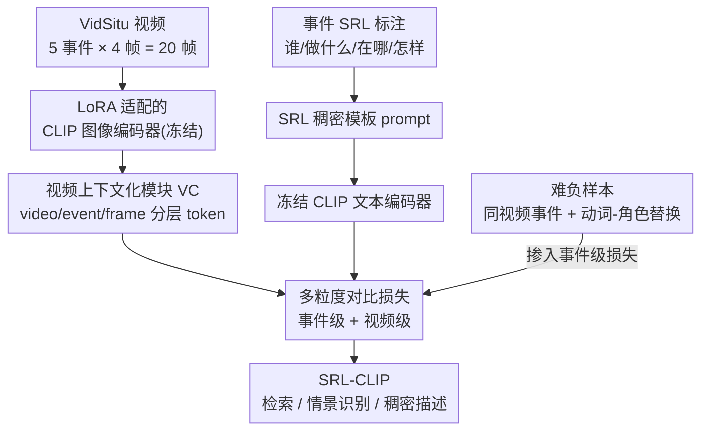

# SRL-CLIP: Efficient CLIP Video Adaptation via Structured Semantic Role Labels

**会议**: CVPR 2026  
**arXiv**: [2401.07669](https://arxiv.org/abs/2401.07669)  
**代码**: 无  
**领域**: 视频理解 / 多模态VLM  
**关键词**: CLIP视频适配, 语义角色标注(SRL), 稠密提示, 高效后预训练, 视频对比学习

## 一句话总结
本文用 VidSitu 的结构化语义角色标注（谁/做什么/对谁/在哪/怎样/为何）拼成稠密模板 prompt，仅在 2.3 万段视频上对冻结的 CLIP 做 LoRA 对比微调（单张 12GB GPU、5 小时），就让 SRL-CLIP 在零样本文本-视频检索上追平甚至超过参数多 4–8 倍、数据多达 6000 倍的 SOTA 模型。

## 研究背景与动机
**领域现状**：把 CLIP 适配到视频是当前主流路线——拿在 4 亿图文对上预训练好的 CLIP 当起点，再在 HowTo100M、WebVid-2.5M 等海量视频-旁白/字幕数据上做对比"后预训练"（post-pretraining），让它具备时序理解能力。

**现有痛点**：这些方法动辄要在上亿条视频上后预训练，代价极高（BT-Adapter 用 8 张 V100、TVTSv2 用 80 张、VAST 用 64 张）。问题不在算法效率，而在**学习信号太稀**：视频本身是包含人、物、状态、动作、关系、随时间变化的高维模态，但配套的旁白/字幕往往只有一句话，无法覆盖视频里的丰富概念，于是 CLIP 的视觉处理能力被浪费，只能靠"数据量"硬堆，每条样本只榨出一点点信息。

**核心矛盾**：丰富视频 vs. 稀疏描述。作者主张 CLIP 本身已经在 4 亿图文对里学到了通用视觉世界知识，再上亿条视频后预训练是浪费——真正缺的是**每条样本的信息密度**，而不是样本数量。

**本文目标**：能不能用**小规模但稠密**的标注，高效地把 CLIP 适配成通用、整体（holistic）的视频理解模型？

**切入角度**：VidSitu 数据集用语义角色标注（Semantic Role Labels, SRL）给每个 2 秒事件做了结构化标注——动作 + 各角色（施事/受事/方式/场景等）对应的名词短语，整体描述了一段视频里"发生了什么"。这种结构化稠密标注天生信息量大，且因为结构化，还能方便地构造难负样本。

**核心 idea**：把 SRL 用规则模板拼成稠密 prompt，在仅 2.3 万段视频上对 CLIP 做 LoRA 对比微调，用"信息密度"换"数据规模"，实现高效且整体的视频适配。作者强调贡献是一套**高效适配配方**，而非架构创新。

## 方法详解

### 整体框架
SRL-CLIP 的输入是 VidSitu 视频（每段 10 秒、切成 P=5 个连续事件、每事件采 T=4 帧，共 L=20 帧）及其 SRL 标注；输出是适配后的 CLIP backbone + 一个视频上下文化模块（Video Contextualizer, VC）。整条管线是：每个事件的 SRL → 规则模板拼成稠密 prompt（冻结的 CLIP 文本编码器编成事件级文本向量）；视频侧所有帧过加了 LoRA 的 CLIP 图像编码器，再连同可学习的"视频 token / 事件 token"一起送进 VC 做时序上下文化；然后在**事件级**和**视频级**两个粒度上，分别用 CLIP 原始特征和 VC 输出特征做对比对齐（共 4 个损失），并在事件级损失里掺入自然难负样本和人工难负样本。

### 关键设计

**1. SRL 结构化稠密模板 prompt：用"信息密度"换"数据规模"**

针对"描述太稀疏导致每条样本信息量低"这个根本痛点，作者不去扩数据，而是把 VidSitu 每个事件的 SRL 拼成一条信息饱满的模板 prompt。模板逐条枚举动作及各语义角色，形如"In this photo, the **action** is *walk*, the **walker** is *man with short hair wearing collared shirt*, **direction** is *forward*, **manner** is *slowly*, **scene** is *apartment*"。这种结构化写法把"谁、做什么、对谁、在哪、怎样、为何"一次性塞进一句话，让 CLIP 对每帧都能学到整体且细粒度的概念。

一个值得注意的发现：作者也试过用 LLaMa 把 SRL 改写成更自然的句子（"a man in a collared shirt is walking slowly in an apartment"），但**效果反而更差**。原因是显式告诉模型"walk 是动作、穿衬衫的人扮演 walker 这个角色、apartment 是 scene"这种角色-名词的显式绑定，比流畅自然语言更利于稠密对齐学习。

**2. 分层视频上下文化模块 VC：在结构化标注上学时序与物体恒存**

仅靠均值池化帧特征无法捕捉跨事件的时序关系，而 VidSitu 视频镜头切换多、同一物体跨事件反复出现。VC 是一个 6 层 Transformer encoder，类比 BERT 的 CLS，它引入两类可学习汇聚 token——一个**视频 token** $\mathbf{v}_i$ 和若干**事件 token** $\mathbf{e}_{ik}$，与所有帧 token 一起输入。为了让模型区分 token 身份与时序位置，作者给每个 token 叠加**类型嵌入**（视频 $\mathbf{e}^{\text{typ}}_v$ / 事件 $\mathbf{e}^{\text{typ}}_e$ / 帧 $\mathbf{e}^{\text{typ}}_f$）和**双重位置嵌入**（事件位置 $\mathbf{e}^{\text{e-pos}}_k$ + 事件内帧位置 $\mathbf{e}^{\text{f-pos}}_j$）：

$$\Phi_V([\mathbf{v}_i,\ \mathbf{e}_{i1},\ \mathbf{f}_{i1}^1,\ldots,\mathbf{f}_{i1}^T,\ \ldots,\ \mathbf{e}_{iP},\ \mathbf{f}_{iP}^1,\ldots,\mathbf{f}_{iP}^T])$$

VC 输出的事件 token $\hat{\mathbf{e}}_{ik}$ 和视频 token $\hat{\mathbf{v}}_i$ 分别代表压缩后的事件/整段表示。由于一段视频里多事件镜头各异却共享物体，VC 被迫学会跨帧跨事件地"把信息有意义地组合起来"，从而获得物体恒存和时序一致性。

**3. 多粒度对比损失：同时在 CLIP 原始特征和 VC 特征上对齐**

适配既要保留 CLIP 原有的图文对齐能力，又要让 VC 学到时序整合，所以作者在两个粒度 × 两类特征上一共设了 4 个对比损失（均为 InfoNCE，记 $L(\cdot,\cdot)$ 为公式 1 的对比损失）：

- CLIP-Event：原始 CLIP 帧特征均值池化 vs. 事件 prompt，$L^{\text{CLIP}}_{\text{event}}=L(\text{mean}_j(\mathbf{f}_{ik}^j),\ \mathbf{t}_{ik})$
- CLIP-Video：CLIP 帧特征跨整段均值池化 vs. 视频级 prompt（各事件 prompt 取均值 $\mathbf{t}_i=\text{mean}_k(\mathbf{t}_{ik})$）
- VC-Event：VC 输出的事件 token vs. 事件 prompt，$L^{\text{VC}}_{\text{event}}=L(\hat{\mathbf{e}}_{ik},\ \mathbf{t}_{ik})$
- VC-Video：VC 输出的视频 token vs. 视频级 prompt，$L^{\text{VC}}_{\text{video}}=L(\hat{\mathbf{v}}_i,\ \mathbf{t}_i)$

总损失为 $\mathcal{L}=L^{\text{CLIP}}_{\text{event}}+L^{\text{VC}}_{\text{event}}+\lambda(L^{\text{CLIP}}_{\text{video}}+L^{\text{VC}}_{\text{video}})$，$\lambda=0.25$。CLIP 级损失保住骨干的通用对齐（利于粗粒度检索），VC 级损失训练上下文化模块（利于 VidSitu 这种细粒度整体理解），消融显示这种组合在 Vb@1 与 CIDEr 的几何平均上最优。

**4. 由结构衍生的难负样本：靠 SRL 的可组合性免费造硬样本**

对比学习需要难负样本逼模型学细粒度区分，而 SRL 的结构化恰好让造负样本变得很廉价。作者用两类：**自然难负样本**——同一段视频的不同事件 prompt 本就高度相似（可能只差一两个动词/角色/名词，如同一人从 walk 变 sit、manner 从 slowly 变 casually），直接拿同视频其他事件当负样本即可；**人工难负样本**——从正样本出发随机替换动词及其对应角色（名词不变，direction/manner/scene 等公共角色保持不变），如把 walk/walker 换成 jog/jogger，迫使模型聚焦动作本身。每条用 $\mathcal{N}_{vr}=4$ 个人工负样本，且难负样本只加在事件级损失（VC-Event、CLIP-Event）的分母里。

**5. LoRA 参数高效适配：冻文本编码器、只调图像注意力**

为在 2.3 万条这种小数据上避免灾难性遗忘，作者不做全量微调，而是冻结 CLIP 图像和文本编码器，只给图像编码器加 LoRA（秩 $r=64$）。消融揭示两个关键选择：**冻结文本编码器**比同时调它更好（迫使图像端去对齐细粒度描述）；LoRA 只加在自注意力的 q/k/v 投影矩阵上效果最好（再加 o/fc/proj 反而掉点）。全量微调不仅贵，效果还更差（Vb@1 低 1.1%、CIDEr 低 1%），正是概念遗忘所致。

### 损失函数 / 训练策略
默认配置：ViT-B/32 / B/16 / L/14；LoRA 秩 64 仅加在图像编码器自注意力 q/k/v；VC 为 6 层 Transformer；$\lambda=0.25$，$\mathcal{N}_{vr}=4$；学习率 $10^{-6}$、AdamW；每视频 P=5 事件、每事件 T=4 帧（共 20 帧）；batch=20 视频（100 个事件-文本对）；训 40 epoch。ViT-B 在单张 12GB RTX2080 上 5 小时、ViT-L/14 在 48GB A6000 上 18 小时。另有 K-SRL 扩展：用 LLaVA-1.6 对 Kinetics-700 的动作标签自动问答生成（带噪声的）SRL，得到 4 万条单事件稠密 prompt，可选地与 VidSitu 联合训练。

## 实验关键数据

### 主实验
零样本文本-视频检索（检索时忽略 VC，直接对骨干帧特征均值池化）。SRL-CLIP 仅用 23k 视频，对比对手数据规模大几个数量级：

| 数据集 | 方法 | 数据规模 | 参数 | R@10 ↑ | MdR ↓ |
|--------|------|---------|------|--------|-------|
| MSRVTT | CLIP ViT-L/14 | – | 400M | 69.6 | 3 |
| MSRVTT | CLIP4Clip | 0.4M | 150M | 66.9 | 4 |
| MSRVTT | Florence | 900M | 637M | 72.6 | – |
| MSRVTT | **SRL-CLIP ViT-L/14** | **23k** | 400M | **73.6** | 3 |
| MSRVTT | VAST（多模态） | 154M | 1.3B | 73.9 | – |
| LSMDC | CLIP ViT-L/14 | – | 400M | 43.7 | 19 |
| LSMDC | CLIP4Clip | 0.4M | 150M | 36.4 | 28 |
| LSMDC | **SRL-CLIP ViT-L/14** | **23k** | 400M | **48.7** | 12 |

SRL-CLIP（ViT-L/14）在 MSRVTT 上 R@10 比 CLIP4Clip / ViFi-IFT 高 6.7% / 6.5%，在 LSMDC 上高 12.3% / 8.8%；超过 Florence（数据多 ~6000 倍）1.0% R@10，仅以 0.3% R@10 微弱落后于参数 1.3B、数据多 6700 倍的 VAST。

整体视频理解（VidSitu 情景识别，CIDEr 衡量 SRL 名词描述质量）：

| 方法 | Vb@1 ↑ | CIDEr ↑ |
|------|--------|---------|
| VideoWhisperer（前 SOTA） | 45.06 | 68.54 |
| CLIP (ViT-L/14) | 46.57 | 60.79 |
| **SRL-CLIP (ViT-L/14)** | **52.36** | **76.24** |

SRL-CLIP 在 VidSitu 上把 CIDEr 从 60.79 提到 76.24（+15.5%），Vb@1 +5.8%，刷新 SOTA。

### 消融实验
损失函数消融（VidSitu, ViT-L/14, CE=CLIP-Event / CV=CLIP-Video / VCE=VC-Event / VCV=VC-Video）：

| 配置 | Vb@1 | CIDEr | 说明 |
|------|------|-------|------|
| 仅 CE | 52.78 | 59.08 | 只用 CLIP 级损失，SRL 描述质量差 |
| 仅 VCE | 52.72 | 75.21 | VC 损失大幅拉高 CIDEr |
| CE+CV+VCE+VCV（默认 R6） | 52.36 | 76.24 | Vb@1/CIDEr 几何平均最优 |

| 配置 | 关键指标 | 说明 |
|------|---------|------|
| LoRA(IE)+冻结 TE | Vb@1 45.53 / CIDEr 71.27 | 默认；冻结 TE 比调 TE 好 |
| 全量微调 IE | Vb@1 43.53 / CIDEr 70.27 | 更贵且更差，概念遗忘 |
| LoRA 仅 q/k/v | CIDEr 76.24 | 最优；加 o/fc/proj 反掉到 71.86 |
| VC 仅用于后预训练 | MSRVTT R@10 73.8 | 粗粒度检索够用 |
| VC 也用于下游(MSRVTT) | R@10 43.5 | 性能崩溃（MSRVTT 字幕不够稠密） |
| 难负样本 $\mathcal{N}_{vr}$=0→4 | Vb@1 52.38→52.36, CIDEr 75.63→76.24 | HN 越多动词准确率升、CIDEr 略波动 |

### 关键发现
- **VC 是"双刃剑"，要分场景用**：VC 在 VidSitu 这种稠密多事件任务上把 CIDEr 大涨 11.7–12.8%，但若直接用于 MSRVTT 这类字幕稀疏的粗粒度检索，性能直接崩塌（R@10 从 73.8 跌到 43.5）——因为 VC 只在 VidSitu 上训过，学到的复杂度匹配不上简单字幕。所以检索时只用骨干、忽略 VC。
- **数据量极省**：仅用 10% VidSitu（约 2300 段视频）就能在 MSRVTT 上带来 +3.9% R@5、+2.6% R@10；从 10% 到 100% 持续涨点，印证稠密 prompt 的高信息密度。
- **结构化 prompt 胜过自然语言改写**：显式的角色-名词绑定比 LLaMa 生成的流畅句子效果更好。
- **难负样本偏动作**：$\mathcal{N}_{vr}$ 增大时动词准确率升、CIDEr 略降，符合"动词-角色替换主要强化动作判别"的预期，取几何平均最优点 $\mathcal{N}_{vr}=4$。

## 亮点与洞察
- **"信息密度换数据规模"的范式反思**：本文最 aha 的点是把视频适配的瓶颈从"样本数"重新定义为"每样本信息量"，用 23k 稠密样本打平 6000 倍数据的对手——这是对"大数据后预训练"惯性的有力反例，且整套可在单张 12GB 消费级显卡上 5 小时跑完，复现门槛极低。
- **结构本身就是难负样本工厂**：SRL 的可组合性让"造难负样本"几乎零成本——同视频事件天然相似、动词-角色可系统替换，这个思路可迁移到任何有结构化标注（场景图、role-filler、属性三元组）的对比学习任务。
- **显式角色绑定 > 流畅自然语言**：反直觉地发现"告诉模型谁扮演什么角色"比通顺句子更利于稠密对齐，对设计 VLM 训练 prompt 有启发：结构化监督信号有时优于"像人话"。
- **VC 的分层 token + 类型/位置嵌入**：用 video/event/frame 三类 token 加类型与双重位置编码来组织层次化视频，是处理"长视频切多事件"的一个干净模板。

## 局限性 / 可改进方向
- **强依赖稠密 SRL 标注**：方法的核心红利来自 VidSitu 这种昂贵的人工结构化标注。作者用 LLaVA 自动生成 K-SRL 来缓解，但承认其标注有噪声；稠密标注的获取成本被作者明确定位为"省了算力但增了标注成本"的权衡。
- **VC 不通用、域适应窄**：VC 只在 VidSitu 上训练，迁到字幕稀疏的数据（MSRVTT）会崩，必须人工判断"何时用 VC"，限制了即插即用性。
- **VidSitu 内部增益有"在域"成分**：作者自己承认 VidSitu 上的部分提升来自在 VidSitu 上做后预训练 + 从零训 VC 的在域优势，跨域纯收益需谨慎解读。
- **改进思路**：让 VC 在多域稠密数据上联合训练以获得通用性；或探索把结构化 prompt 与可学习软 prompt 结合，进一步降低对人工 SRL 的依赖。

## 相关工作与启发
- **vs ViFi-CLIP / ActionClip（任务专用适配）**：它们针对动作识别用动作标签造 CLIP 式 prompt，监督信号稀疏且任务专用，易丢失通用表示（ViFi 在零样本检索上甚至大幅退化，LSMDC R@10 仅 14.8）。本文做**任务无关**适配，用整体 SRL 数据让一个模型横跨检索、情景识别、稠密描述多任务。
- **vs CLIP4Clip / CLIP-ViP（海量后预训练）**：它们靠 0.4M–上亿视频 + Transformer 时序聚合堆数据。本文证明换成稠密结构化 prompt 后，23k 样本即可超过它们，论点是"信息密度 > 数据规模"。
- **vs 大模型多模态方案（VAST / ImageBind / TVTSv2）**：这些模型 450M–1.3B 参数、多模态、数据多 85–6700 倍。SRL-CLIP 以 400M 参数、23k 数据追平甚至超过其中多数，凸显高效适配配方的价值。
- **启发**：在数据昂贵或算力受限场景，"提升单样本标注密度 + 参数高效微调（LoRA）+ 结构衍生难负样本"是一条值得复用的低成本适配路线。

## 评分
- 新颖性: ⭐⭐⭐⭐ 不是架构创新，但"稠密结构化 prompt + 小数据高效适配"的范式反思与配方很有说服力
- 实验充分度: ⭐⭐⭐⭐⭐ 横跨检索/情景识别/稠密描述/VELOCITI 多任务，损失/LoRA/VC/难负样本/数据量消融齐全
- 写作质量: ⭐⭐⭐⭐ 动机链条清晰、配方讲得透；VC 的失败场景也诚实交代
- 价值: ⭐⭐⭐⭐⭐ 单卡 5 小时复现、23k 数据打平 6000 倍对手，对算力受限的研究者极具实用价值

<!-- RELATED:START -->

## 相关论文

- [\[ICML 2026\] SkelHCC: A Hyperbolic CLIP-Driven Cache Adaptation Framework for Skeleton-based One-Shot Action Recognition](../../ICML2026/video_understanding/skelhcc_a_hyperbolic_clip-driven_cache_adaptation_framework_for_skeleton-based_o.md)
- [\[CVPR 2026\] Bootstrapping Video Semantic Segmentation Model via Distillation-assisted Test-Time Adaptation](bootstrapping_video_semantic_segmentation_model_via_distillation-assisted_test-t.md)
- [\[CVPR 2026\] Structured Relational Reasoning for Group Activity Assessment](structured_relational_reasoning_for_group_activity_assessment.md)
- [\[CVPR 2026\] Less is More: Token-Efficient Video-QA via Adaptive Frame-Pruning and Semantic Graph Integration](less_is_more_token-efficient_video-qa_via_adaptive_frame-pruning_and_semantic_gr.md)
- [\[ECCV 2024\] RGNet: A Unified Clip Retrieval and Grounding Network for Long Videos](../../ECCV2024/video_understanding/rgnet_a_unified_clip_retrieval_and_grounding_network_for_long_videos.md)

<!-- RELATED:END -->
